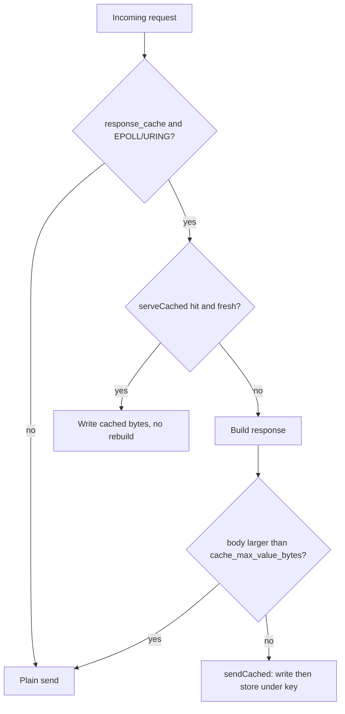

# README

<h1 align="center">
    <b><i>ZIX</i></b>
</h1>

<p align="center" style="color: #C3C3C3;font-color: #C3C3C3;">
    <b><i>Zero sIX; 06;</i></b>
</p>

<p align="center" style="color: #C3C3C3;font-color: #C3C3C3;">
    <i>A network backend library/engine written in zig.</i>
</p>

<div align="center">
    
</div>

<p align="center" style="color: #C3C3C3;font-color: #C3C3C3;">
    <i>Where the wire meets the will.</i>
</p>

<p align="center" style="color: #C3C3C3;font-color: #C3C3C3;">
    <i>Every byte owned, every thread deliberate, every route explicit.</i>
</p>

<p align="center" style="color: #C3C3C3;font-color: #C3C3C3;">
    <i>No hidden cost. Just clean-metal and honest code - predictable by principle</i>
</p>

---

<p align="center" style="color: #C3C3C3;font-color: #C3C3C3;">
    <i>You are the thinker. Tinker.. Assembler... The builder, Not just as user/coder....</i>
</p>

<br>

# Table of Contents

- [Documentation](./README-en.md#documentation)
- [Important Notes](./README-en.md#important-notes)
- [Important Contribution Notes](./README-en.md#important-contribution-notes)
- [Repositories](./README-en.md#repositories)
- [Reason & Motivation](./README-en.md#a-reason-a-motivation)
- [Key Features](./README-en.md#key-features)
- [Server Config Consistency](./README-en.md#server-config-consistency)
- [Memory Model](./README-en.md#memory-model)
- [Requirements](./README-en.md#requirements)
- [Getting Started](./README-en.md#getting-started)
- [Build](./README-en.md#build)
- [Testing](./README-en.md#testing)
- [Examples](./README-en.md#examples)
    - [HTTP/1](./README-en.md#http1)
    - [Minimal](./README-en.md#minimal-examples)
    - [Routing](./README-en.md#routing)
    - [Concurrency Model](./README-en.md#concurrency-model)
    - [Timeouts](./README-en.md#timeouts)
    - [Middleware](./README-en.md#middleware)
    - [WebSocket](./README-en.md#websocket)
    - [SSE](./README-en.md#sse-server-sent-events)
    - [HTTP Client](./README-en.md#http-client)
    - [Static Files & Upload](./README-en.md#static-files--upload)
    - [Response Header Capacity](./README-en.md#response-header-cap-headersize)
    - [Request Header Capacity](./README-en.md#request-header-cap-requestheadersize)
    - [Response Cache Awareness](./README-en.md#response-cache-awareness-response_cache)
        - [When it pays off](./README-en.md#when-it-pays-off)
        - [Rules and conditions](./README-en.md#rules-and-conditions)
    - [HTTP/2](./README-en.md#http2)
        - [gRPC h2c](./README-en.md#grpc-h2c)
    - [Raw TCP](./README-en.md#raw-tcp)
    - [FIX 4.x](./README-en.md#fix-4x)
    - [UDS (Unix Domain Sockets)](./README-en.md#uds-unix-domain-sockets)
    - [Channel](./README-en.md#channel)
    - [UDP](./README-en.md#udp)
    - [Logger](./README-en.md#logger)
- [Benchmark](./README-en.md#benchmark)

<br>

## Documentation

| Document | Description |
| :- | :- |
| [`docs/hld-http-en.md`](docs/hld-http-en.md) | HTTP: goals, runtime model, API, router, WebSocket, SSE, memory model |
| [`docs/hld-http1-en.md`](docs/hld-http1-en.md) | HTTP/1: lean engine goals, dispatch models, handler model, router, WebSocket, memory model |
| [`docs/hld-tcp-en.md`](docs/hld-tcp-en.md) | TCP raw stream: goals, API, frame format, dispatch models |
| [`docs/hld-udp-en.md`](docs/hld-udp-en.md) | UDP: goals, runtime model, API, packet model, endianness, disconnect |
| [`docs/hld-uds-en.md`](docs/hld-uds-en.md) | UDS: goals, API, frame format, server/client lifecycle |
| [`docs/hld-channel-en.md`](docs/hld-channel-en.md) | Channel: goals, model, API, concurrency requirement, examples |
| [`docs/hld-fix-en.md`](docs/hld-fix-en.md) | FIX 4.x: goals, protocol overview, session layer, dispatch models, config |
| [`docs/hld-grpc-en.md`](docs/hld-grpc-en.md) | gRPC h2c: goals, architecture, API, all 4 RPC types, codec, dispatch models |
| [`docs/hld-grpc-proxy-en.md`](docs/hld-grpc-proxy-en.md) | gRPC TLS termination via nginx and haproxy |
| [`docs/hld-logger-en.md`](docs/hld-logger-en.md) | Logger: goals, API, log methods, formats, file rotation, protocol wiring |
| [`docs/lld-http-en.md`](docs/lld-http-en.md) | HTTP: internal data structures and algorithms |
| [`docs/lld-http1-en.md`](docs/lld-http1-en.md) | HTTP/1: internal parsing, write helpers, router, EPOLL engine, WebSocket codec |
| [`docs/lld-tcp-en.md`](docs/lld-tcp-en.md) | TCP: internal data structures and algorithms |
| [`docs/lld-udp-en.md`](docs/lld-udp-en.md) | UDP: internal data structures and algorithms |
| [`docs/lld-uds-en.md`](docs/lld-uds-en.md) | UDS: internal server/client structure and frame handling |
| [`docs/lld-fix-en.md`](docs/lld-fix-en.md) | FIX: internal data structures and serveConn algorithm |
| [`docs/lld-channel-en.md`](docs/lld-channel-en.md) | Channel: ring buffer internals, locking, send/recv algorithms |
| [`docs/lld-logger-en.md`](docs/lld-logger-en.md) | Logger: internal write buffer, spinlock, rotation algorithm |
| [`docs/concurrency-en.md`](docs/concurrency-en.md) | Dispatch models: POOL, ASYNC, MIXED, EPOLL. Thread counts, protocol applicability. |
| [`docs/design-considerations-en.md`](docs/design-considerations-en.md) | Design considerations, design patterns, and naming conventions |
| [`docs/coding-guideline-en.md`](docs/coding-guideline-en.md) | Coding style: source layout, naming, file anatomy, doc comments, config, tests, prose rules |
| [`docs/systems-thinking-en.md`](docs/systems-thinking-en.md) | Systems thinking: explicit cost, bounded allocation, kernel involvement, measurement tooling, the two-sided gate |
| [`docs/adr-en.md`](docs/adr-en.md) | Architecture Decision Records |
| [`docs/headers-en.md`](docs/headers-en.md) | Response header cap: tiers, security, error handling |
| [`docs/tests-en.md`](docs/tests-en.md) | Test tiers (unit / integration / behaviour / edge) and how to run |
<!-- | [`rnd/rfc/README.md`](rnd/rfc/README.md) | RFC-based MUST / MUST NOT conformance checklists for raw HTTP/1.1, HTTP/2, HTTP/3, and TLS 1.3 | -->

<br>

## Important Notes

Zix currently is linux-centric.

As current state, zix will not:
- TLS implementation.
- Database driver implementation.
- Http2 implementation (only as gRPC dependency).
- Http3 implementation.

See [swerver](https://github.com/justinGrosvenor/swerver) for TLS, HTTP/2, HTTP/3 for complete approach for those subject.

<br>

## Important Contribution Notes

- Helping Zig, helping Zix.
- Zig should be the ecosystem.
- Single file, single responsibility.
- Always use and push Zig and their std.
- Any significant change/s required RnD/PoC.
- Cover for the un-cover test/s is good contribution.
- Narrowing down the system thinking then be explicit.
- A "nice to have" and "maybe we need this" is tertiary.
- Always fix from our side first rather than Zig feature/s side.
- If bias/ambigue, try to discuss it. At least involved with other 1-2 entities.
- You and your people (Junior/Mid/Senior) use another language beside english, you can contribute that.

<br>

[Coding Guideline.](docs/coding-guideline-en.md)

[System Thinking Guideline.](docs/systems-thinking-en.md)

<br>

[Milestones.](https://codeberg.org/prothegee/zix/milestones)

[Open an issue.](https://codeberg.org/prothegee/zix/issues/new)

[Open a discussion.](https://github.com/prothegee/zix/discussions)

<br>

## Repositories

- [Codeberg as Main](https://codeberg.org/prothegee/zix)
- [Github as Mirror #1](https://github.com/prothegee/zix)

<br>

## A Reason.. A Motivation...

<details close>
<summary>Frame of Mind:</summary>

```
The way we think, is how system start.
A time to read and think from existing lines,
made "us" re-think, arguing, and approaching for the flow of the program.

When "our" next generation doesn't want to learn the past and present. What will happen?
If they don't want to use/learn/be eager about the language and the build system, they'll ..?

To be modern with less hassle, "magic" should less or more?

Zig (also another programming language) could complement existing program
and able to create a good program, but when critical-performance our options is less/hard.

My work mostly 80% backend and 20% frontend.
So network/communication system is essential in my end.
From monolith, micro-service, and modular micro-service.

At early Zig (before 0.16.x), I enjoyed the language.
Zig is flexible, but "variant of colors" made me go back to Go & C++ again.
So in mid 2025 the plan is only idea and some architectural design.

So when Zig 0.16.x release, and in 2026 early March. I started the march.
Now I can regain transparency, more control, and more explicit in approach.
```

<!--
Why not rust:
- Too many "just use tokio/smol" made me think again.
- My code in rust as professional is still 70% sync, less async.
- Rust in my case to complement existing system, QR & Barcode reader/writer replacing C++.
-->

</details>

<br>

<details open>

<summary>Principles for the motivations:</summary>

__*1. Explicit Over Implicit.*__

__*2. Modular & Maintanable.*__

__*3. Performance-First Architecture.*__

__*4. Practical Features, Ready to Use.*__

__*5. Modern Efficient Concurrency Model.*__

__*6. Predictable, Transparent Memory Management.*__

> We valued clarity, control, and performance.

</details>

<br>

## Key Features

__*1. Full protocol stack under one roof:*__

Tcp (raw), Udp, Uds (Unix domain sockets), Http (HTTP/1.1), Http1 (hot-path-optimized
variant), Http2 (h2c), Grpc (gRPC over h2c), Fix (FIX 4.x), plus Channel and Logger.

> One coherent memory/threading model across monolith, micro-service, and
modular-micro-service backends, instead of stitching together separate libraries with
different conventions.

<br>

__*2. Client libraries across the stack:*__

Every engine ships its matching client: `zix.Http.Client`, the gRPC client, and raw `zix.Tcp`, `zix.Udp`, `zix.Uds`, and `zix.Fix` clients, plus dedicated SSE (`sse_client`) and WebSocket (`ws_client`) clients.

> Call and test your own services with the same library that serves them, instead of vendoring a separate client per protocol.

<br>

__*3. Five selectable dispatch models:*__

- ASYNC (single accept thread, io.async() per conn): lowest latency at moderate load.
- POOL (N acceptors push to a shared queue, M workers handle synchronously): best raw throughput at high connection counts.
- MIXED (N acceptors each dispatch via io.async(), no queue): balanced.
- EPOLL (shared-nothing: each worker owns a SO_REUSEPORT listener + epoll instance, level-triggered, no shared queue): Linux-only, best for high connection counts.
- URING (shared-nothing io_uring: same thread-per-core topology as EPOLL, but completion-based so most syscall transitions are batched away): Linux-only.

> Concurrency strategy is a deliberate config choice, not a implementation default. Http1, Http, Grpc, and Fix implement all five natively on Linux.
Http2 has no native epoll or uring path and folds to POOL.

<br>

__*4. Shared-nothing architecture:*__

Under `.EPOLL` and `.URING` each worker owns a private SO_REUSEPORT listener, its own event loop, connection slab, and response cache, with no shared queue, no cross-thread fd handoff, and no locking. State is partitioned by ownership, not guarded by mutexes.

> Scales by adding independent workers, one per core, so the hot path never contends and the response cache is lock-free by ownership.

<br>

__*5. Explicit, flat configuration:*__

No nested sub-configs: every field (e.g. dispatch_model, max_response_headers: .MINIMAL, pool_size) is top-level and explicit.

> Predictability by principle. You sees exactly what the server does without
chasing inherited defaults. Do not buried (1 or 3+ levels deep) config fields at the core public access, it's not a cemetery.

<br>

__*6. Hot-path-optimized HTTP/1 zix.Http1:*__

- Removed HeadParser, thread-local cached Date header, consolidated writeSimple, serveConn(fd, handler, opts), configurable response-header capacity.

> Squeeze the common request path without sacrificing the explicit API.

<br>

__*7. Composable HTTP request handling:*__

A comptime router with path parameters (`matchParam`) shared by `zix.Http` and `zix.Http1`, an explicit middleware chain (`Middleware` / `NextFn`) on `zix.Http`, static file serving, multipart and file upload parsing (`MultipartParser`), and HTTP range request parsing (`parseRange`) for partial content.

> Each piece is an explicit, opt-in part of the engine, with route matching resolved at compile time. You compose only what a request needs instead of inheriting a fixed pipeline.

<br>

__*8. WebSocket and SSE (both HTTP engines):*__

Engine-owned WebSocket on `zix.Http` and `zix.Http1` (RFC 6455, ping auto-ponged, close auto-echoed, broadcast fan-out, per-event write coalescing under EPOLL), and Server-Sent Events with a matching SSE client.

> Long-lived, push-style connections are handled by the engine itself, not bolted on inside the handler.

<br>

__*9. Multiplexed gRPC (h2c):*__

Multiplexed async epoll with a resumable HTTP/2 state machine, comptime-cached HPACK reply blocks, big initial window, buffered reads, max_streams=128 to avoid REFUSED_STREAM bursts. Context timeouts (handler_timeout_ms, Route.timeout_ms, ctx.isExpired()).

> All four RPC types (unary, server streaming, client streaming, bidirectional)
multiplexed over one h2c connection without a thread per stream, with client
deadlines honored end-to-end. Internal services speak gRPC directly, no TLS
terminator or sidecar required.

<br>

__*10. FIX 4.x:*__

FixContext, a MsgType struct (47 constants), session-oriented routing, trading examples.

> Domain-specific financial messaging as a citizen of the engine, not bolted onto raw
TCP.

<br>

__*11. Channel (typed concurrency and IPC primitive):*__

A generic bounded `Channel(T)` with `send` / `recv` / `close` and drain-after-close semantics, usable for in-process fan-out, worker pools, and inter-process coordination.

> A small, typed building block for coordinating work, the same primitive whether the peers are threads or processes.

<br>

__*12. Protocol-aware logger:*__

Log types per protocol: conn (TCP), packet (UDP), frame (UDS), session (FIX), rpc (gRPC), access() is HTTP-only, Channel is system-only.

> The log vocabulary matches the actual unit of work on each protocol.

__*13. Response Cache Awareness:*__

Opt-in, per-worker response cache (ADR-036) shared by `zix.Http1`, `zix.Http`, and `zix.Grpc`. A handler builds its response once, the engine stores it under a key derived from the request, and a later matching request replays the stored bytes with no rebuild and no re-serialization. Data oriented (a structure of arrays plus one flat payload slab), lock-free by ownership (one instance per worker, never shared), with a lazy on-access TTL. Active under the shared-nothing `.EPOLL` and `.URING` models.

> A tool you reach for deliberately, not a hidden layer. It pays off above a ~4 KiB body (heavy ~32 KiB JSON measured +34% throughput) and is a zero-regression wash below that.

<br>

__*14. Bilingual multi-documentation:*__

Every doc has it own variants.

> Support: en - English, id - Bahasa

<br>

## Server Config Consistency

Every server config shares one vocabulary: the same concept uses the same field name and type across `zix.Tcp`, `zix.Http1`, `zix.Http`, `zix.Grpc`, and `zix.Fix`. Moving a config between protocols is mechanical, not a relearn. These fields are common to all of them:

| Field | Type | Meaning |
| :- | :- | :- |
| `io` | `std.Io` | I/O backend, required, must outlive the server |
| `ip` | `[]const u8` | Bind address |
| `port` | `u16` | Bind port, must be non-zero |
| `dispatch_model` | `DispatchModel` | `.ASYNC` (default), `.POOL`, `.MIXED`, `.EPOLL`, `.URING` |
| `kernel_backlog` | `u31` | TCP listen backlog |
| `workers` | `usize` | Accept or EPOLL worker count, `0` selects cpu_count |
| `pool_size` | `usize` | Pool thread count for `.POOL`, `0` selects a formula |
| `logger` | `?*Logger` | Optional logger, caller-owned |

Buffer, timeout, and cache fields keep the same names wherever a protocol has the feature:

| Field | Type | Present on |
| :- | :- | :- |
| `max_recv_buf` | `usize` | `zix.Tcp`, `zix.Http1`, `zix.Http`, `zix.Uds` |
| `conn_timeout_ms` | `u32` | `zix.Http`, `zix.Fix` |
| `handler_timeout_ms` | `u32` | `zix.Http1`, `zix.Http`, `zix.Grpc`, `zix.Fix` |
| `response_cache` and the four `cache_*` fields | see [Response Cache Awareness](#response-cache-awareness-response_cache) | `zix.Http1`, `zix.Http`, `zix.Grpc` |
| `compression`, `compression_min_size`, `compression_max_out` | `bool` / `usize` / `usize` | `zix.Http1`, `zix.Http` |

A few differences are by design, not drift:

- `zix.Http1` has no `conn_timeout_ms`: it runs no connection-registry timer thread (see the Timeouts note in the HTTP/1 LLD docs).
- `zix.Grpc` sizes inbound data with protocol-specific fields (`max_body`, `max_frame_size`, `max_header_scratch`) instead of `max_recv_buf`.
- Response compression (`compression*`) lives on `zix.Http1` and `zix.Http`, the engines that serve HTTP responses with Accept-Encoding negotiation. `zix.Grpc` uses its own per-message `grpc-encoding` compression instead, and the raw transports (`zix.Tcp`, `zix.Udp`, `zix.Uds`, `zix.Fix`) have no HTTP content negotiation.
- `zix.Udp` (datagram) carries `ip` / `port` / `logger`, and `zix.Uds` (local socket) carries `kernel_backlog` / `max_recv_buf` / `logger` plus its socket path, each only the subset that applies.

<br>

## Memory Model

### HTTP

| Scope | Allocator | Lifetime |
| :- | :- | :- |
| Route table | comptime (zero heap cost) | N/A |
| Read / write I/O buffers | `smp_allocator` | Connection |
| Per-request allocations (`ctx.allocator`) | Per-connection `ArenaAllocator`, reset each request | Request |

Handlers receive `ctx.allocator`, an arena reset between requests. Any allocation made inside a handler is automatically reclaimed at the end of the request without any `free` call.

Routes are baked into the server type at compile time: no allocator is needed for route storage.

### UDP

| Scope | Allocator | Lifetime |
| :- | :- | :- |
| Client record list | `config.allocator` (caller-owned) | Server process lifetime |
| Peer snapshot (broadcast) | `config.allocator` | Single packet dispatch |
| Receive buffer | Stack | Single receive loop iteration |

`config.allocator` must be a general-purpose allocator (e.g. `std.heap.smp_allocator`). `ArenaAllocator` is not suitable: the broadcast peer snapshot is allocated and freed per packet: `ArenaAllocator.free()` is a no-op, so snapshots accumulate unboundedly until the server stops. See [`docs/hld-udp-en.md`](docs/hld-udp-en.md) for the full explanation and PoC.

### HTTP/2 and gRPC

Both use heap-allocated per-connection stream arrays (stack allocation of `max_streams` `Stream` structs would overflow the thread stack). No per-request allocator is exposed: handlers receive raw frame I/O via `GrpcContext` (gRPC) or `fd`/`sid` (HTTP/2).

For full memory details see [`docs/hld-http-en.md`](docs/hld-http-en.md) and [`docs/hld-udp-en.md`](docs/hld-udp-en.md). For threading models see [`docs/concurrency-en.md`](docs/concurrency-en.md).

<br>

## Requirements

- [Zig](https://ziglang.org/):
    - [x] 0.16.x
    - [ ] ~0.17.x~

<br>

## Getting Started

Fetch zix to your project:

Add to `build.zig.zon`:
```zig
.{
    .name = .backend_api,
    .version = "0.1.0",
    .dependencies = .{
        .zix = .{
            .url = "https://codeberg.org/prothegee/zix/archive/0.3.x.tar.gz",
            // .hash will be filled in by `zig fetch --save`
        },
    },
    .paths = .{""},
}
```

Then do `zig fetch --save`.

<br>

Or,

use zig fetch directly with source repo and version:
```sh
zig fetch --save "git+https://codeberg.org/prothegee/zix#main" # upstream
```

or

```sh
zig fetch --save "git+https://codeberg.org/prothegee/zix#0.2.x" # upstream v0.2.x
```

> You can change to mirror too as `github.com/prothegee/zix`
>
> For a specific version, use `MAJOR.MINOR.x`, i.e. `#0.2.x` and replace `#main`

<br>

Add to your project (`build.zig` file):

```sh
const zix = b.dependency("zix", .{
    .target = target,
    .optimize = optimize,
});

exe.root_module.addImport("zix", zix.module("zix"));
```

<br>

## Build

zix is consumed as a Zig module (source), not shipped as a prebuilt library. The repository defines the `zix` module with `b.addModule`, so there is no `addStaticLibrary` or `addSharedLibrary` artifact. Running `zig build` on its own runs the default `install` step with nothing to install: no `.a`, no `.so`, nothing under `zig-out/lib`. It compiles the module graph and is useful only as a quick "does it still compile" check.

The real entry points are the named steps. List them any time with `zig build -l`:

| Step | What it does |
| :- | :- |
| `zig build` | Compile the module graph only. No artifact is emitted, because zix is a source module. |
| `zig build test-all` | Run unit, integration, behaviour, and edge tests. |
| `zig build unit-test` | Run unit tests only. Also `integration-test`, `behaviour-test`, `edge-test`. |
| `zig build examples` | Build every example into `zig-out/bin/`. |
| `zig build example-<group>` | Build one group of examples, for example `example-http1` or `example-grpc`. |
| `zig build example-<name>` | Build and run one example, for example `example-http1_websocket`. |
| `zig build test-runner-<name>` | Spawn a server plus client integration check, for example `test-runner-http1-epoll`. |
| `zig build test-runner-all` | Run every server-plus-client integration runner. |

Built example binaries land in `zig-out/bin/`. To build all examples, then run one in the background and stop it:

```sh
zig build examples                      # build every example into zig-out/bin/
./zig-out/bin/example-http1_websocket & # run one in the background
kill %1                                 # stop it
```

There is no `zig build install` library output and no `-Doptimize` is required for a plain compile check. To consume zix in another project, follow Getting Started above: it is added as a `build.zig.zon` dependency and imported with `exe.root_module.addImport("zix", zix.module("zix"))`, never linked as a system library.

<br>

## Testing

```sh
zig build unit-test        # unit tests (src/ inline tests)
zig build integration-test # integration tests (components wired together)
zig build behaviour-test   # behaviour tests (observable API contracts)
zig build edge-test        # edge tests (boundary conditions and error paths)
zig build test-all         # all of the above
```

`zig build` alone does not run tests. See [`docs/tests-en.md`](docs/tests-en.md) for full coverage details.

<br>

## Examples

For more examples see the `examples` directory.

Run `zig build examples` to build all examples (read `build.zig` for more detail).

### HTTP/1

Zix has two models API for HTTP/1, `zix.Http` and `zix.Http1`.

`zix.Http` relies on zig `std.http` and works as the convenient approach, while `zix.Http1` does not.

**When to use:** pick `zix.Http` when you want the high-level request/response API (Request/Response/Context, an arena per request, middleware, static files). Pick `zix.Http1` when you want the lean hot-path engine with the lowest per-request overhead and are willing to work at the `fn(head, body, fd)` level. Both share the same comptime router and the same dispatch models.

<br>

### Minimal Examples

Auto I/O (work-queue thread pool, default):
```zig
const std = @import("std");
const zix = @import("zix");

pub fn homeHandler(req: *zix.Http.Request, res: *zix.Http.Response, ctx: *zix.Http.Context) !void {
    _ = req; _ = ctx;
    try res.send("hello from zix");
}

pub fn main(process: std.process.Init) !void {
    var server = try zix.Http.Server.init(4096, &[_]zix.Http.Route{
        .{ .path = "/", .handler = homeHandler },
    }, .{
        .io   = process.io,
        .ip   = "127.0.0.1",
        .port = 9000,
    });
    defer server.deinit();
    try server.run();
}
```

Manual I/O (explicit concurrency limit via `concurrent_limit`, `.ASYNC` dispatch):
```zig
pub fn main() !void {
    var threaded = std.Io.Threaded.init(std.heap.smp_allocator, .{
        .concurrent_limit = std.Io.Limit.limited(4), // pin to 4 concurrent tasks
        // .concurrent_limit = .unlimited             // let runtime decide
    });
    defer threaded.deinit();

    var server = try zix.Http.Server.init(4096, &[_]zix.Http.Route{
        .{ .path = "/", .handler = homeHandler },
    }, .{
        .io             = threaded.io(),
        .ip             = "127.0.0.1",
        .port           = 9000,
        .dispatch_model = .ASYNC, // .ASYNC uses the caller's io directly
    });
    defer server.deinit();
    try server.run();
}
```

**Examples:**
- [examples/http_basic_1_async.zig](examples/http_basic_1_async.zig) - ASYNC dispatch
- [examples/http_basic_2_pool.zig](examples/http_basic_2_pool.zig) - POOL dispatch
- [examples/http_basic_3_mixed.zig](examples/http_basic_3_mixed.zig) - MIXED dispatch
- [examples/http_basic_4_epoll.zig](examples/http_basic_4_epoll.zig) - EPOLL dispatch
- [examples/http_basic_5_uring.zig](examples/http_basic_5_uring.zig) - URING dispatch (io_uring ring)
- [examples/http_manual_concurrent.zig](examples/http_manual_concurrent.zig) - explicit concurrency control via `Io.Threaded`
- [examples/http1_basic_1_async.zig](examples/http1_basic_1_async.zig) - raw `zix.Http1`: ASYNC dispatch
- [examples/http1_basic_2_pool.zig](examples/http1_basic_2_pool.zig) - raw `zix.Http1`: POOL dispatch
- [examples/http1_basic_3_mixed.zig](examples/http1_basic_3_mixed.zig) - raw `zix.Http1`: MIXED dispatch
- [examples/http1_basic_4_epoll.zig](examples/http1_basic_4_epoll.zig) - raw `zix.Http1`: EPOLL dispatch
- [examples/http1_basic_5_uring.zig](examples/http1_basic_5_uring.zig) - raw `zix.Http1`: URING dispatch
- [examples/http1_json.zig](examples/http1_json.zig)
- [examples/http1_params.zig](examples/http1_params.zig)
- [examples/http1_paths.zig](examples/http1_paths.zig)
- [examples/http1_middleware.zig](examples/http1_middleware.zig)
- [examples/http1_cache.zig](examples/http1_cache.zig)
- [examples/http1_manual_concurrent.zig](examples/http1_manual_concurrent.zig)

**When to use:** start here for any plain HTTP service. Auto I/O (default) is the simplest path and lets the runtime size its own thread pool. Switch to manual I/O with `concurrent_limit` only when you must cap concurrency explicitly: constrained memory, a fixed worker budget, or deterministic load tests.

<br>

### Routing

Routes are registered at compile time via the route table passed to `Server.init`. Each `Route` entry has a `path`, a `handler`, and an optional `kind` (`.EXACT` by default):

```zig
var server = try zix.Http.Server.init(4096, &[_]zix.Http.Route{
    .{ .path = "/about",           .handler = aboutHandler },
    // exact (default): matches only /about

    .{ .path = "/api",             .handler = apiHandler,    .kind = .PREFIX },
    // prefix: matches /api, /api/foo, /api/foo/bar, NOT /apiv2

    .{ .path = "/users/:id",       .handler = userHandler,   .kind = .PARAM },
    // param: matches /users/alice, captures id="alice"
    // read inside handler: req.pathParam("id")

    .{ .path = "/:tenant/:branch", .handler = branchHandler, .kind = .PARAM },
    // multi-param: req.pathParam("tenant"), req.pathParam("branch")
}, .{ .ip = "127.0.0.1", .port = 9000 });
```

**Priority:**

```
exact  >  param  >  prefix (longer prefix beats shorter)
```

Exact and prefix priority is independent of registration order. **Param routes are the exception**: when two patterns have the same segment count and both match, the first entry in the route table wins. Register more-literal patterns before all-param patterns of the same depth:

```zig
var server = try zix.Http.Server.init(4096, &[_]zix.Http.Route{
    // Correct order: /path/user/:id wins for /path/user/alice
    .{ .path = "/path/user/:id",        .handler = userHandler,   .kind = .PARAM },
    .{ .path = "/path/:tenant/:branch", .handler = tenantHandler, .kind = .PARAM },
}, .{ ... });
```

| Registered | Request | Winner | Reason |
| :- | :- | :- | :- |
| `/path/info` (exact) + `/path/:id` (param) | `/path/info` | `/path/info` | exact beats param |
| `/path/:id` (param) + `/path` (prefix) | `/path/alice` | `/path/:id` | param beats prefix |
| `/api/v2` + `/api` (both prefix) | `/api/v2/foo` | `/api/v2` | longer prefix wins |
| `/path/user/:id` (1st) + `/path/:a/:b` (2nd) | `/path/user/alice` | `/path/user/:id` | more literals registered first |

**Regex-like matching**: zix has no regex engine. A prefix route (`.kind = .PREFIX`) covers the registered path and any sub-path below it. Additional filtering is done inside the handler with plain string operations on `req.path()`:

```zig
// In the route table:
.{ .path = "/secret", .handler = secretHandler, .kind = .PREFIX },

// Inside secretHandler: extract sub-path and apply custom logic
const sub = req.path()["/secret/".len..];  // e.g. "file.txt"
// check extension, depth, query params, headers, etc.
```

**Examples:**
- [examples/http_params.zig](examples/http_params.zig) - query and form parameter handling
- [examples/http_paths.zig](examples/http_paths.zig) - path parameter routing patterns
- [examples/http_json.zig](examples/http_json.zig) - JSON response handling

**Raw `zix.Http1` engine**: the low-level engine ships the same comptime `Router` with identical `.EXACT` / `.PREFIX` / `.PARAM` kinds and the same `exact > param > prefix` priority. The one difference is param capture: the Http1 handler is `fn(head: *const ParsedHead, body, fd) void` with no `Request`, so captured params are read with the free function `zix.Http1.pathParam("id")` (a per-handler thread-local, the same model as `zix.Http1.setTimeout`, see ADR-029) rather than `req.pathParam("id")`:

```zig
const Router = zix.Http1.Router(&[_]zix.Http1.Route{
    .{ .path = "/",          .handler = homeHandler },
    .{ .path = "/secret",    .handler = secretHandler, .kind = .PREFIX },
    .{ .path = "/users/:id", .handler = userHandler,   .kind = .PARAM },
});

var server = zix.Http1.Server.init(Router.dispatch, .{ .ip = "0.0.0.0", .port = 9100 });

// inside userHandler:
const id = zix.Http1.pathParam("id") orelse return;
```

Per-route param capture is capped at 8 params per match. See ADR-033.

**Examples:**
- [examples/http1_static.zig](examples/http1_static.zig) - a prefix route in use

**When to use:** use the comptime route table whenever a service has more than one endpoint. Prefer `.EXACT` for fixed paths, `.PARAM` for resource ids, and `.PREFIX` for sub-trees or fallthrough to static serving. Register more-literal patterns before all-param patterns of the same depth so the intended route wins.

<br>

### Concurrency Model

Five dispatch models, selected via `config.dispatch_model` (`DispatchModel` enum, default `.ASYNC`):

**`.POOL` (work-queue thread pool):**

N accept threads push connections to a shared `ConnQueue`. M pool threads pop and handle each connection synchronously with blocking I/O, no scheduler overhead. Best throughput under high connection counts. `SO_REUSEPORT` lets all accept threads listen on the same port.

```zig
pub fn main(process: std.process.Init) !void {
    var server = try zix.Http.Server.init(4096, &[_]zix.Http.Route{
        .{ .path = "/", .handler = homeHandler },
    }, .{
        .io = process.io,
        // dispatch_model = .ASYNC (default, can be omitted)
        // workers        = 0  -> cpu_count (accept threads for .POOL/.MIXED; workers for .EPOLL)
        // pool_size      = 0  -> max(10, cpu_count * 2) pool threads (.POOL only; ignored by .EPOLL)
    });
```

**`.ASYNC` (single accept, `io.async()` dispatch):**

One accept thread dispatches each connection via `io.async()`. `workers` and `pool_size` are ignored. Preferred for SSE and WebSocket (long-lived connections do not hold pool threads). Also suitable for explicit `concurrent_limit`.

```zig
var server = try zix.Http.Server.init(4096, &[_]zix.Http.Route{
    .{ .path = "/", .handler = homeHandler },
}, .{
    .io             = process.io,
    .dispatch_model = .ASYNC,
});
```

**`.MIXED` (N accept threads, `io.async()` dispatch):**

N accept threads each dispatch connections via `io.async()` directly, no `ConnQueue`. Balanced throughput and latency. `pool_size` is ignored.

```zig
var server = try zix.Http.Server.init(4096, &[_]zix.Http.Route{
    .{ .path = "/", .handler = homeHandler },
}, .{
    .io             = process.io,
    .dispatch_model = .MIXED,
});
```

**`.EPOLL` (shared-nothing epoll workers, Linux-only):**

Each worker owns a private `SO_REUSEPORT` listener and one `epoll` instance. The kernel distributes new connections across workers. No shared queue, no mutex, no fd handoff between threads. Level-triggered `EPOLLIN` keeps connections registered after each request without explicit re-arm. Idle keep-alive connections hold no thread. Best for high-throughput short-lived requests on Linux. Non-Linux builds fall back to `.POOL` automatically.

```zig
var server = try zix.Http.Server.init(4096, &[_]zix.Http.Route{
    .{ .path = "/", .handler = homeHandler },
}, .{
    .io             = process.io,
    .dispatch_model = .EPOLL,
    .workers        = 0, // 0 = cpu_count workers (default); pool_size is ignored
});
```

**`.URING` (shared-nothing io_uring workers, Linux-only):**

Same thread-per-core, shared-nothing topology as `.EPOLL` (one `SO_REUSEPORT` listener and one ring per worker, no shared queue), but completion-based instead of readiness-based, so most syscall transitions are batched into the ring. Accept, recv, send, and close all run on the ring (`zix.Http1` rings the close via `prep_close`, ADR-041, so the worker keeps reaping completions across connection teardowns under churn). Implemented natively by `zix.Http1`, `zix.Http`, `zix.Grpc`, and `zix.Fix`. `zix.Http2` and the `zix.Tcp` per-connection handler have no native ring and fold to `.POOL` / `.EPOLL`. Non-Linux builds fall back to `.POOL`.

```zig
var server = try zix.Http.Server.init(4096, &[_]zix.Http.Route{
    .{ .path = "/", .handler = homeHandler },
}, .{
    .io             = process.io,
    .dispatch_model = .URING,
    .workers        = 0, // 0 = cpu_count workers (default); pool_size is ignored
});
```

---

__*In the nutshell:*__
- Looking for high throughput? Use `.EPOLL` or `.URING`.
- Looking for consistent latency? Use `.ASYNC`.
- For non-linux user and looking for high throughput? Use `.POOL` or `.MIXED`.

> In many case for high throughput, URING mostly win for CPU & RAM efficiency,
depend on your environment system result & behaviour may vary. Decide your dispath model intention, switch if you may.

**When to use:** the dispatch model is the one knob that reshapes the whole server. Reach for `.ASYNC` when latency and long-lived connections (SSE, WebSocket) matter, `.POOL` / `.MIXED` for raw throughput on any platform, and `.EPOLL` / `.URING` on Linux for the highest connection counts at the lowest per-request cost. On a loopback dev box the two tie on throughput and `.URING` wins mainly on cache locality. On a many-core box the ring close (ADR-041) lets `.URING` keep its cores busy through connection churn, where it reaches parity or better than `.EPOLL` on every measured workload at a fraction of the memory.

**Why per-engine:** each engine implements these models in its own `server.zig`, not behind one shared multiplexer. The split is deliberate and is itself the optimization: it lets every engine tune its own hot path. `zix.Http1` carves connection buffers from a contiguous demand-paged slab (no per-accept heap call), while `zix.Grpc` and `zix.Fix` hold per-connection heap pointers because their connections carry h2 or FIX session state. Only byte-identical primitives are shared (the `.URING` `user_data` codec in `src/multiplexers/ring.zig`): share primitives that must match, keep dispatch loops per-engine. See ADR-042.

> Our workload is not same, what suits you may not suits to someone else.
Test your workload with 2:4 ratio at least from production environment when possible.
Zix will not dictate your approach.

See [`docs/concurrency-en.md`](docs/concurrency-en.md) for architecture details, thread counts, and when to prefer each model.

<br>

### Timeouts

Two independent timeout layers, both disabled by default (`0`):

**`conn_timeout_ms`**: network-level connection guard (Layer D). The timer thread shuts down connections that have been open longer than this without completing. Protects pool threads from clients that stall before or during header send. Effective in `.POOL` only.

**`handler_timeout_ms`**: per-handler execution budget (Layer B). Sets `ctx.deadline` before each dispatch. Handlers opt in by calling `ctx.isExpired()` between expensive steps.

```zig
var server = try zix.Http.Server.init(4096, &[_]zix.Http.Route{
    .{ .path = "/slow", .handler = slowHandler },
}, .{
    .io                 = process.io,
    .ip                 = "127.0.0.1",
    .port               = 9000,
    .conn_timeout_ms    = 30_000, // close stalled connections after 30s
    .handler_timeout_ms = 5_000,  // handler budget: 5s
});
```

Handler using the budget:

```zig
pub fn slowHandler(req: *zix.Http.Request, res: *zix.Http.Response, ctx: *zix.Http.Context) !void {
    _ = req;

    doStep1(ctx.io);
    if (ctx.isExpired()) {
        res.setStatus(.REQUEST_TIMEOUT);
        return res.sendJson("{\"error\":\"timeout\"}");
    }

    doStep2(ctx.io);
    if (ctx.isExpired()) {
        res.setStatus(.REQUEST_TIMEOUT);
        return res.sendJson("{\"error\":\"timeout\"}");
    }

    try res.sendJson("{\"result\":\"ok\"}");
}
```

To override the deadline inside a handler (shorter or longer window than the global budget):

```zig
ctx.setTimeout(2_000); // override to 2s from now regardless of global cap
```

`ctx.isExpired()` is a no-op (always returns `false`) when `handler_timeout_ms == 0`. `ctx.timedOut()` is an alias for `ctx.isExpired()`. `conn_timeout_ms` should be >= `handler_timeout_ms` to avoid the connection being cut before the handler can send a 408. See `docs/adr-en.md` (ADR-018) for design rationale.

**Examples:**
- [examples/http_timeout_resp.zig](examples/http_timeout_resp.zig)
- [examples/http1_timeout_resp.zig](examples/http1_timeout_resp.zig) - raw `zix.Http1`, uses `zix.Http1.isExpired()` and `zix.Http1.setTimeout()` (no ctx, see ADR-029)

**When to use:** set `handler_timeout_ms` whenever a handler can run long (external calls, heavy compute) and you want it to bail out cooperatively with a 408 instead of holding a thread. Add `conn_timeout_ms` under `.POOL` to evict clients that stall before completing a request. Leave both at 0 for trusted internal traffic with bounded work.

<br>

### Middleware

Middleware is composed at comptime using wrapper functions. Each wrapper takes a `comptime next: zix.Http.HandlerFn` and returns a new `HandlerFn` (no heap allocation, no runtime chain runner).

```zig
fn withOriginCheck(comptime next: zix.Http.HandlerFn) zix.Http.HandlerFn {
    return struct {
        fn handle(req: *zix.Http.Request, res: *zix.Http.Response, ctx: *zix.Http.Context) anyerror!void {
            const origin = req.header("origin") orelse "";
            if (!isAllowedOrigin(origin)) {
                res.setStatus(.FORBIDDEN);
                try res.sendJson("{\"error\":\"forbidden origin\"}");
                return;
            }
            return next(req, res, ctx);
        }
    }.handle;
}

fn withBasicAuth(comptime next: zix.Http.HandlerFn) zix.Http.HandlerFn {
    return struct {
        fn handle(req: *zix.Http.Request, res: *zix.Http.Response, ctx: *zix.Http.Context) anyerror!void {
            // validate Authorization: Basic <base64(user:pass)>
            // ...
            return next(req, res, ctx);
        }
    }.handle;
}
```

Compose left-to-right, the outermost wrapper runs first:

```zig
var server = try zix.Http.Server.init(4096, &[_]zix.Http.Route{
    // origin check only
    .{ .path = "/public",  .handler = withOriginCheck(publicHandler) },
    // origin check -> basic auth -> handler
    .{ .path = "/private", .handler = withOriginCheck(withBasicAuth(privateHandler)) },
}, .{ .io = process.io, .ip = "127.0.0.1", .port = 9008 });
```

```
# curl examples
curl -H "Origin: http://localhost" "http://localhost:9008/public"                         # 200
curl "http://localhost:9008/public"                                                       # 403

curl -H "Origin: http://localhost" -u "admin:secret" "http://localhost:9008/private"      # 200
curl -H "Origin: http://localhost" "http://localhost:9008/private"                        # 401
curl "http://localhost:9008/private"                                                      # 403
```

**Examples:**
- [examples/http_middleware.zig](examples/http_middleware.zig)

**When to use:** compose middleware for cross-cutting concerns that wrap many routes: auth, origin/CORS checks, rate limits, request logging. Because the chain is built at comptime with no heap and no runtime runner, it costs nothing per request, so prefer it over per-handler boilerplate whenever the same guard repeats across routes.

<br>

### WebSocket

Room-based broadcast over RFC 6455. A param handler upgrades the connection and enters a per-task frame loop, no separate thread needed.

```zig
var ws_rooms: zix.Http.WebSocket.RoomMap = undefined;

pub fn wsHandler(req: *zix.Http.Request, res: *zix.Http.Response, ctx: *zix.Http.Context) !void {
    const room_id = req.pathParam("room-id") orelse return;

    // Read query params BEFORE upgrade() (unavailable after the 101 handshake).
    const display_name = req.queryParam("name") orelse "anonymous";

    // extract Sec-WebSocket-Key from headers, then handshake
    var accept_buf: [64]u8 = undefined;
    const accept = try zix.Http.WebSocket.acceptKey(ws_key, &accept_buf);
    try zix.Http.WebSocket.upgrade(ctx.stream, ctx.io, accept); // writes 101 directly

    // heap-allocate conn, join room, both are cleaned up via defer (LIFO)
    const conn = try std.heap.smp_allocator.create(zix.Http.WebSocket.Conn);
    conn.* = .{ .stream = ctx.stream, .io = ctx.io };
    defer std.heap.smp_allocator.destroy(conn);
    ws_rooms.join(room_id, conn, ctx.io);
    defer ws_rooms.leave(room_id, conn, ctx.io);  // runs before destroy

    // frame loop:
    //   text/binary -> broadcast "[display_name] payload" to room
    //   ping        -> pong
    //   close       -> echo close frame + break
    //   EOF / error -> best-effort close frame + break
    _ = display_name;
}

pub fn main(process: std.process.Init) !void {
    ws_rooms = zix.Http.WebSocket.RoomMap.init(std.heap.smp_allocator);
    defer ws_rooms.deinit();

    var server = try zix.Http.Server.init(4096, &[_]zix.Http.Route{
        .{ .path = "/ws/:room-id", .handler = wsHandler, .kind = .PARAM },
    }, .{ .io = process.io, .ip = "127.0.0.1", .port = 9008 });
    defer server.deinit();
    try server.run();
}
```

```
# Connect with wscat or websocat, ?name sets the broadcast display name
wscat    -c "ws://localhost:9008/ws/lobby?name=alice"
websocat    "ws://localhost:9008/ws/lobby?name=alice"

# ?name is optional, omit for "anonymous"
wscat    -c "ws://localhost:9008/ws/lobby"
```

**Priority:** exact > param > prefix. `/ws/:room-id` is a param route, so `/ws/lobby` captures `room-id = "lobby"`.

`ctx.stream` is the raw TCP stream exposed via `Context`. The server sets it for **every** connection before calling any handler: HTTP handlers ignore it, WebSocket handlers use it after the 101 upgrade.

**Combining HTTP, static, and WebSocket in one server**: register all handler types together, routing handles dispatch. Unmatched routes fall through to static serving:

```zig
var server = try zix.Http.Server.init(4096, &[_]zix.Http.Route{
    .{ .path = "/",          .handler = homeHandler },
    .{ .path = "/api",       .handler = apiHandler,  .kind = .PREFIX },
    .{ .path = "/ws/:room-id", .handler = wsHandler, .kind = .PARAM },
}, .{
    .io         = process.io,
    .ip         = "127.0.0.1",
    .port       = 9008,
    .public_dir = "./public", // static files for unmatched routes
});
```

**Examples:**
- [examples/http_websocket.zig](examples/http_websocket.zig) - full working example
- [examples/http_ws_client.zig](examples/http_ws_client.zig) - matching client
- [examples/http1_websocket.zig](examples/http1_websocket.zig) - raw `zix.Http1.WebSocket`, raw-fd echo
- [examples/http1_websocket_uring.zig](examples/http1_websocket_uring.zig) - io_uring WebSocket pump

**Build-once broadcast fanout**: on the engine-owned `zix.Http1` path, `zix.Http1.WebSocket.broadcast(conns, opcode, payload)` serializes the frame a single time and writes the same bytes to every fd in a caller-maintained room, so a broadcast costs one serialization no matter how many members it reaches. A failed write to a dead peer is skipped (the EPOLL engine reaps that fd on its next event), and the large-payload path builds the header once and writes the payload without copying it into a staging buffer. The high-level `zix.Http.WebSocket.RoomMap.broadcast` follows the same build-once, fan-out shape with a server-managed room registry.

**When to use:** use WebSocket for bidirectional, low-latency push (chat, presence, live dashboards, game state). Pair it with `.ASYNC` so long-lived connections never pin a pool thread, and reach for the build-once `broadcast` when one message fans out to a room. If the data flow is one-way server-to-client, prefer SSE: it is simpler and reconnects natively in the browser.

<br>

### SSE (Server-Sent Events)

One-way server push over HTTP/1.1: no WebSocket handshake, browser-native `EventSource` reconnect.

```zig
// GET /events: streams "tick N" once per second
pub fn eventsHandler(req: *zix.Http.Request, res: *zix.Http.Response, ctx: *zix.Http.Context) !void {
    _ = req;
    const sse = try res.stream(); // sends SSE headers, returns SseWriter
    var i: u32 = 0;
    while (i < 10) : (i += 1) {
        var buf: [32]u8 = undefined;
        const msg = std.fmt.bufPrint(&buf, "tick {d}", .{i}) catch break;
        sse.writeEvent(msg) catch break;                                       // data: tick N\n\n
        std.Io.sleep(ctx.io, std.Io.Duration.fromMilliseconds(1000), .awake) catch break;
    }
    // handler returns -> connection closes -> EventSource auto-reconnects
}
```

| `SseWriter` method | Wire format |
| :- | :- |
| `writeEvent(data)` | `data: <data>\n\n` |
| `writeNamedEvent(event, data)` | `event: <event>\ndata: <data>\n\n` |
| `comment(text)` | `: <text>\n` (keepalive) |

**Dispatch model:** use `.ASYNC`. SSE connections are long-lived: they would exhaust a blocking pool (`.POOL`) one thread per open stream. `.ASYNC` dispatches each connection via `io.async()`, keeping pool threads free.

```zig
var server = try zix.Http.Server.init(4096, &[_]zix.Http.Route{
    .{ .path = "/events", .handler = eventsHandler },
}, .{
    .io             = process.io,
    .dispatch_model = .ASYNC, // preferred for SSE: long-lived connections do not hold pool threads
});
```

```sh
curl -N http://localhost:9010/events
```

**Examples:**
- [examples/http_sse.zig](examples/http_sse.zig) - full example with a browser-compatible HTML page
- [examples/http_sse_client.zig](examples/http_sse_client.zig) - matching client
- [examples/http1_sse.zig](examples/http1_sse.zig) - raw `zix.Http1` engine

**When to use:** choose SSE for one-way server push over plain HTTP (progress streams, notifications, log tailing, live metrics) when the client does not need to send frames back. It is lighter than WebSocket and `EventSource` reconnects automatically. Always run it under `.ASYNC`. A blocking `.POOL` would burn one thread per open stream.

<br>

### HTTP Client

`zix.Http.Client` makes outbound HTTP requests. Each call returns a `ClientResponse` the caller owns and must release with `deinit()`.

```zig
var client = zix.Http.Client.init(.{
    .allocator         = arena.allocator(),
    .io                = process.io,
    .connect_timeout_ms = 5000,       // error.Timeout if TCP connect takes > 5s
    .max_response_body  = 64 * 1024,  // error.BodyTooLarge if body exceeds 64 KB
});
defer client.deinit();

// GET
var resp = try client.get("http://127.0.0.1:9000/", .{});
defer resp.deinit();
std.debug.print("{d}: {s}\n", .{ resp.status(), resp.body() });

// GET with header inspection
if (resp.header("content-type")) |ct| {
    std.debug.print("content-type: {s}\n", .{ct});
}

// POST with body and custom headers
const extra = [_]std.http.Header{
    .{ .name = "X-Trace-Id", .value = "abc-123" },
};
var post_resp = try client.post("http://127.0.0.1:9000/api/items", .{
    .headers = &extra,
    .body    = "{\"name\":\"widget\"}",
});
defer post_resp.deinit();

// Per-request connect timeout override
var fast = try client.get("http://127.0.0.1:9000/health", .{
    .connect_timeout_ms = 500,
});
defer fast.deinit();
```

| Method shorthand | Sends body? |
| :- | :- |
| `client.get(url, opts)` | no |
| `client.head(url, opts)` | no |
| `client.post(url, opts)` | yes (Content-Length: 0 if opts.body is null) |
| `client.put(url, opts)` | yes |
| `client.patch(url, opts)` | yes |
| `client.delete(url, opts)` | no |
| `client.request(method, url, opts)` | depends on method |

| Error | Condition |
| :- | :- |
| `error.InvalidUrl` | malformed URL, unsupported scheme, or missing host |
| `error.BodyTooLarge` | response body exceeded `max_response_body` |
| `error.Timeout` | TCP connect exceeded `connect_timeout_ms` |

Redirects are followed automatically up to `max_redirects` (default 3). Set `follow_redirects = false` to receive the 3xx response directly.

The same `zix.Http.Client` works against the raw `zix.Http1` server via `.version = .HTTP_1` (the version selector, with `HTTP_2` and `HTTP_3` reserved, see ADR-028).

**Examples:**
- [examples/http_client.zig](examples/http_client.zig)
- [examples/http1_client.zig](examples/http1_client.zig) - sets `.version = .HTTP_1`

[`docs/hld-http-en.md`](docs/hld-http-en.md) for details.

**When to use:** use `zix.Http.Client` for outbound calls from a handler or a standalone tool: health checks, service-to-service requests, webhooks, or fetching a known endpoint. Set `connect_timeout_ms` and `max_response_body` to bound untrusted peers, and disable `follow_redirects` when you must inspect a 3xx yourself.

<br>

### Static Files & Upload

Set `public_dir` in `HttpServerConfig` to enable static file serving. `server.run()` returns `error.PublicDirNotFound` if the directory does not exist. Use a `createInitDirs` helper to create all required directories before `Server.init`:

```zig
fn createInitDirs(io: std.Io) void {
    std.Io.Dir.cwd().createDirPath(io, "./public") catch {};
    std.Io.Dir.cwd().createDirPath(io, "./public/u") catch {};
}

pub fn main(process: std.process.Init) !void {
    createInitDirs(process.io); // idempotent, safe on every start

    var server = try zix.Http.Server.init(4096, &[_]zix.Http.Route{
        .{ .path = "/upload", .handler = uploadHandler },
    }, .{
        .io                = process.io,
        .ip                = "127.0.0.1",
        .port              = 9005,
        .public_dir        = "./public", // validated at run(); "" = disabled
        .public_dir_upload = "u",
    });
```

- Unmatched routes fall through to static serving from `public_dir`.
- Range requests (`Range: bytes=...`) -> `206 Partial Content` (RFC 7233).
- Directory traversal (`..`) is rejected.

**Upload**: parse the multipart body in a handler, optionally rename before saving:

```zig
var parser = zix.Http.Multipart.init(ctx.allocator, boundary);
defer parser.deinit();
try parser.parse(try req.body());

if (parser.getField("file")) |f| {
    // you can rename file first before save by replacing the filename string, e.g.:
    //   const filename = "custom_name.txt"
    // or build it dynamically:
    //   const filename = try std.fmt.allocPrint(ctx.allocator, "{s}_{s}", .{ sessionid, f.filename orelse "upload" });
    const filename = f.filename orelse "upload";
    const path = try zix.utils.file.save(ctx.io, ctx.allocator, "./public/u", filename, f.data);
    _ = path; // arena-allocated, valid for this request
}
```

`zix.utils.file.save` creates the destination directory if needed and returns a caller-owned path copy.

```
# curl example: upload a file with JSON metadata
curl -X POST "http://localhost:9005/upload" \
  -F "file=@/path/to/file.txt" \
  -F 'data={"userid":0,"sessionid":"01944f5a-0000-7000-8000-000000000000"}'
```

**Examples:**
- [examples/http_static.zig](examples/http_static.zig) - full working example including static serving, range requests, and multipart upload

**When to use:** enable `public_dir` to serve a built frontend, assets, or downloads from the same server, with range requests handled for you. Use the multipart path for user uploads when you control the storage target. For very high static throughput a CDN or a `sendfile`-based path still wins. This is for convenience and co-located assets, not a bulk file CDN.

<br>

### Response Header Cap (`HeaderSize`)

`HttpServerConfig.max_response_headers` controls how many custom headers `res.addHeader()` will accept per response. Pick the tier that matches your deployment:

| Variant | Cap | Typical use |
| :- | :- | :- |
| `.MINIMAL` | 16 | **Default.** Simple internal APIs, controlled environments, bare handlers |
| `.COMMON` | 32 | Most web apps, single proxy |
| `.LARGE` | 64 | CDN + proxy, load balancers, CORS-heavy APIs |
| `.EXTRA_LARGE` | 128 | k8s, service mesh, heavy forwarding stacks |
| `.{ .CUSTOM = N }` | N | Explicit cap, arena-allocated to exactly N slots per request |

```zig
var server = try zix.Http.Server.init(4096, &[_]zix.Http.Route{
    .{ .path = "/", .handler = homeHandler },
}, .{
    .max_response_headers = .LARGE,                // 64 headers
    // .max_response_headers = .{ .CUSTOM = 48 },  // explicit
});
```

`addHeader()` returns `error.TooManyHeaders` when the cap is reached and `error.InvalidHeaderName` / `error.InvalidHeaderValue` if the name or value contains CR or LF (header injection guard).

`.{ .CUSTOM = N }` allocates exactly N slots from the per-request arena (no ceiling, no clamping).

**Examples:**
- [examples/http_xtra_headers.zig](examples/http_xtra_headers.zig) - working demonstration
- [examples/http1_xtra_headers.zig](examples/http1_xtra_headers.zig) - raw `zix.Http1`, hand-builds headers with a CR/LF injection guard

[`docs/headers-en.md`](docs/headers-en.md) for security guidance and tier selection.

**When to use:** raise `max_response_headers` only as far as your deployment needs. Keep `.MINIMAL` for internal APIs, step up to `.LARGE` / `.EXTRA_LARGE` behind CDNs, proxies, or CORS-heavy stacks that add many forwarding headers. A tighter cap is a cheap guard against runaway header growth and is arena-sized to exactly the tier you pick.

<br>

### Request Header Cap (`RequestHeaderSize`)

`HttpServerConfig.max_request_headers` controls how many headers the server accepts per request. Requests exceeding the cap are rejected with `431 Request Header Fields Too Large`.

| Variant | Cap | Note |
| :- | :- | :- |
| `.MINIMAL` | 16 | Strict APIs, internal services |
| `.COMMON` | 32 | Most web applications |
| `.LARGE` | 64 | **Default.** Parser storage limit. CDN, proxy, CORS-heavy APIs |
| `.{ .CUSTOM = N }` | N (capped at 64) | Explicit cap values above 64 silently capped at the parser limit |

```zig
var server = try zix.Http.Server.init(4096, &[_]zix.Http.Route{
    .{ .path = "/", .handler = homeHandler },
}, .{
    .max_request_headers = .COMMON,                // 32 headers
    // .max_request_headers = .{ .CUSTOM = 24 },   // explicit
});
```

The parser storage limit is 64: `CUSTOM` values above 64 are silently capped. See `zix.Http.RequestHeaderSize`.

**When to use:** lower `max_request_headers` (`.MINIMAL` / `.COMMON`) on strict internal services to reject oversized header blocks early with a 431. Keep the `.LARGE` default for public endpoints behind proxies that legitimately add headers. The hard parser ceiling is 64, so `CUSTOM` above that is silently capped.

<br>

### Response Cache Awareness (`response_cache`)

`zix.Http1`, `zix.Http`, and `zix.Grpc` share an opt-in, per-worker response cache (ADR-036). A handler builds its response once, the engine stores it under a key derived from the request, and a later matching request replays the stored bytes with no rebuild. A hit skips both the handler's body build and the serialization. The cache is data oriented (a structure of arrays plus one flat payload slab), lock-free by ownership (one instance per worker, never shared), and freshness is a lazy on-access TTL.

What the key and the cached value are depends on the engine:

| Engine | Cache key | Cached value |
| :- | :- | :- |
| `zix.Http1`, `zix.Http` | method, path, query | the full serialized HTTP response, written verbatim |
| `zix.Grpc` (unary) | path, request message | the response message, re-framed per stream (HPACK and stream id stay correct) |

It is off by default. Enable it on the `.EPOLL` or `.URING` dispatch model:

```zig
var server = try zix.Http.Server.init(4096, &[_]zix.Http.Route{
    .{ .path = "/report", .handler = reportHandler },
}, .{
    .ip = "0.0.0.0",
    .port = 8080,
    .dispatch_model = .EPOLL,
    .response_cache = true,                  // enable the per-worker cache
    .cache_max_entries = 256,                // slots, rounded down to a power of two
    .cache_max_value_bytes = 16 * 1024,      // per-slot response cap
    .cache_ttl_ms = 1000,                    // default freshness
    // .cache_max_total_bytes = 4 * 1024 * 1024, // optional per-worker memory ceiling
});
```

A miss builds and stores the response, a fresh hit is served verbatim:

```zig
fn reportHandler(req: *zix.Http.Request, res: *zix.Http.Response, _: *zix.Http.Context) !void {
    if (res.serveCached(req)) return;            // fresh hit: cached bytes already written

    const body = try buildExpensiveReport(req);  // runs only on a miss
    res.setContentType(.APPLICATION_JSON);
    try res.sendCached(req, body, 0);            // ttl 0 uses cache_ttl_ms
}
```

The raw `zix.Http1` engine exposes the same idea through `cacheLookup` and `writeWithCache`.

For gRPC unary handlers the opt-in lives on the call context. `ctx.serveCached` replays a stored reply message (re-framed for the current stream and finished with OK), and `ctx.sendCached` sends and stores the reply. Enable it with the same field names on `GrpcServerConfig` (`response_cache`, `cache_max_entries`, and so on) under `.EPOLL` or `.URING`:

```zig
fn sayHello(_: []const zix.Http2.Header, ctx: *zix.Grpc.Context) void {
    if (ctx.serveCached("application/grpc")) return; // fresh hit: reply sent, stream finished

    const reply = buildExpensiveReply(ctx.recvMessage()); // runs only on a miss
    ctx.sendCached("application/grpc", reply, 0);          // ttl 0 uses cache_ttl_ms
    ctx.finish(.OK, "");
}
```

#### When it pays off

The measured crossover on loopback is around 4 KiB of response body. Below that the cost is dominated by the kernel and the cache is a wash. Above it the saved work grows with body size.

| Response shape | Cache effect |
| :- | :- |
| Compute-heavy serialization (large JSON, rendered output) above ~4 KiB | Best case, large gain (heavy ~32 KiB JSON measured +34% throughput) |
| Small responses below ~2 KiB | Wash, kernel-bound, zero regression |
| Static files read from disk | Marginal: the OS page cache already serves the file cheaply, prefer sendfile or splice |
| Per-request unique bodies (no key repetition) | No benefit, every request misses |

#### Rules and conditions

- Opt-in only. Off by default, and the handler must call `res.serveCached` then `res.sendCached` (HTTP), `ctx.serveCached` then `ctx.sendCached` (gRPC), or the `zix.Http1` `cacheLookup` / `writeWithCache`.
- `.EPOLL` and `.URING` only in this release. The other dispatch models leave the cache uninstalled and the API degrades to a plain send.
- For HTTP the key is method, path, and query: two requests differing only in their query string are distinct entries, and you must not cache responses that vary on a header or cookie. For gRPC the key is the path plus the request message, so only an identical request hits.
- Cache only what is safe to replay for the TTL window. For HTTP the same bytes (including the captured `Date`) are served until the entry expires, so keep `cache_ttl_ms` short for time-sensitive content.
- Responses larger than `cache_max_value_bytes` bypass the cache and fall back to a plain send. For gRPC this cap applies to the response message. Keep it lean so only past-crossover responses occupy a slot.
- Per-worker memory is `cache_max_entries * cache_max_value_bytes`, times the worker count, optionally bounded by `cache_max_total_bytes`.

**Why `.EPOLL` / `.URING` only:** the cache is a thread-local instance, never shared and never locked (lock-free by ownership). That invariant holds only when one zix-owned thread installs the cache (allocate, set, free on exit) and is the sole thread that touches it. The shared-nothing `.EPOLL` workers and the one-thread-per-ring `.URING` workers both satisfy it.

| Model | Runs the handler on | Cache state |
| :- | :- | :- |
| `.EPOLL` | a zix-owned shared-nothing worker thread, one per core | installed: clean lifecycle, one owner thread, the benchmarked path |
| `.URING` | a zix-owned shared-nothing ring worker, one per core | installed: same one-owner-thread lifecycle as `.EPOLL` |
| `.POOL` | zix-owned pool threads | feasible and safe, but each thread would hold its own cache (lower hit rate, N times the memory), so it is deferred, not wired |
| `.ASYNC`, `.MIXED` | `io.async()` tasks on the `std.Io` executor pool, not owned by zix | not installed: no per-thread install hook, and a task is not pinned to one thread, so a shared cache would need locks and break the lock-free design |

Under any model the behavior is safe, just inert: with the cache uninstalled, `response_cache = true` and the `serveCached` / `sendCached` calls degrade to a plain send (no error, no caching).



**When to use:** turn the cache on for hot, repeatable, compute-heavy responses above ~4 KiB (rendered reports, large JSON aggregates) served under `.EPOLL` or `.URING`. Leave it off for small kernel-bound responses, per-request unique bodies, or anything that varies on a header or cookie, where it adds no benefit. Read the rules above before caching anything time-sensitive.

See ADR-036 for the design rationale and measured numbers.

<br>

### HTTP/2

HTTP/2 only requirement for gRPC h2c approach.

**When to use:** you rarely reach for `zix.Http2` directly. It exists as the h2c transport under `zix.Grpc`. Use it only if you need raw HTTP/2 framing without gRPC semantics. For ordinary web traffic use `zix.Http1` / `zix.Http`, and for RPC use `zix.Grpc`.

<br>

#### gRPC h2c

`zix.Grpc` is a gRPC server and client over h2c. Routes are registered at compile time. All 4 RPC types are supported (unary, server streaming, client streaming, bidirectional).

```zig
const std = @import("std");
const zix = @import("zix");

fn sayHelloHandler(
    headers: []const zix.Http2.Header,
    ctx:     *zix.Grpc.Context,
) void {
    _ = headers;
    const req = ctx.recvMessage() orelse {
        ctx.finish(.INVALID_ARGUMENT, "no message");
        return;
    };
    // decode req (proto3), encode reply
    var reply: [256]u8 = undefined;
    const n = zix.Grpc.encodeString(1, "Hello!", &reply);
    ctx.sendMessage("application/grpc+proto", reply[0..n]);
    ctx.finish(.OK, "");
}

pub fn main(process: std.process.Init) !void {
    var server = try zix.Grpc.Server.init(
        &[_]zix.Grpc.Route{
            .{ .path = "/helloworld.Greeter/SayHello", .handler = sayHelloHandler },
        },
        .{
            .io   = process.io,
            .ip   = "127.0.0.1",
            .port = 8083,
        },
    );
    defer server.deinit();
    try server.run();
}
```

```sh
# Test with grpcurl
grpcurl -plaintext -d '{"name":"world"}' 127.0.0.1:8083 helloworld.Greeter/SayHello
```

**HandlerFn:** `fn(headers: []const zix.Http2.Header, ctx: *zix.Grpc.Context) void`

- Path is resolved by the route table before the handler is called.
- `ctx.recvMessage()` returns each buffered client message or `null` when done.
- `ctx.sendMessage(content_type, data)` sends a response DATA frame (first call also sends HEADERS).
- `ctx.finish(status, message)` sends the grpc-status trailer. Must be called exactly once.
- Unary routes (`is_server_streaming = false`, the default) dispatch synchronously on the connection thread. Server-streaming routes require `is_server_streaming = true` on the `Route` entry and each run on a dedicated thread.

**GrpcClient:**

```zig
var client = try zix.Grpc.Client.connect(.{
    .ip   = "127.0.0.1",
    .port = 8083,
}, process.io);
defer client.deinit();

// Unary convenience
var buf: [4096]u8 = undefined;
const resp = try client.unary(
    "/helloworld.Greeter/SayHello",
    "application/grpc+proto",
    request_bytes,
    &buf,
);
```

**Minimal protobuf codec** (no codegen required for simple schemas):

```zig
var out: [256]u8 = undefined;
var pos: usize = 0;
pos += zix.Grpc.encodeString(1, "world",  out[pos..]); // field 1: string
pos += zix.Grpc.encodeInt32( 2, 42,       out[pos..]); // field 2: int32
pos += zix.Grpc.encodeDouble(3, 1.5,      out[pos..]); // field 3: double
// send out[0..pos] as the gRPC message payload
```

**Dispatch models:** `.ASYNC` (default), `.POOL`, `.MIXED`, `.EPOLL` (Linux-only). The gRPC EPOLL model is a shared-nothing multiplexed event loop: each worker owns a private `SO_REUSEPORT` listener and one epoll instance, and drives many non-blocking h2 connections through a resumable HTTP/2 state machine. `pool_size` is the worker count (0 = cpu_count). Non-Linux falls back to `.POOL` automatically. See [`docs/concurrency-en.md`](docs/concurrency-en.md) for details.

**Context timeout:** Three inputs, tightest wins:

```zig
var server = try zix.Grpc.Server.init(
    &[_]zix.Grpc.Route{
        // per-route 3s cap, tightens the 5s global cap
        .{ .path = "/helloworld.Greeter/SayHello", .handler = sayHelloHandler, .timeout_ms = 3_000 },
        // per-route 10s cap, global 5s cap still wins. Echo sends N responses so is_server_streaming = true
        .{ .path = "/helloworld.Greeter/Echo", .handler = echoHandler, .timeout_ms = 10_000, .is_server_streaming = true },
    },
    .{
        .io                = process.io,
        .ip                = "127.0.0.1",
        .port              = 8083,
        .handler_timeout_ms = 5_000, // global cap, also combined with Route.timeout_ms and grpc-timeout header
    },
);
```

Handlers check `ctx.isExpired()` between steps. Override `ctx.deadline_ns` directly for per-call extension: `ctx.deadline_ns = zix.Grpc.wallClockNs() + 30 * std.time.ns_per_s`. The `grpc_timeout.zig` example below shows the full demo.

**Examples:**
- [examples/grpc_server_1_async.zig](examples/grpc_server_1_async.zig) - gRPC server: ASYNC dispatch
- [examples/grpc_server_2_pool.zig](examples/grpc_server_2_pool.zig) - gRPC server: POOL dispatch
- [examples/grpc_server_3_mixed.zig](examples/grpc_server_3_mixed.zig) - gRPC server: MIXED dispatch
- [examples/grpc_server_4_epoll.zig](examples/grpc_server_4_epoll.zig) - gRPC server: EPOLL dispatch (Linux-only)
- [examples/grpc_server_5_uring.zig](examples/grpc_server_5_uring.zig) - gRPC server: URING dispatch (Linux-only, io_uring)
- [examples/grpc_client.zig](examples/grpc_client.zig) - gRPC client: unary and streaming
- [examples/grpc_multi_server.zig](examples/grpc_multi_server.zig) + [examples/grpc_multi_client.zig](examples/grpc_multi_client.zig) - one port, two services
- [examples/grpc_location_server_1_async.zig](examples/grpc_location_server_1_async.zig) - Location service: ASYNC dispatch
- [examples/grpc_location_server_2_pool.zig](examples/grpc_location_server_2_pool.zig) - Location service: POOL dispatch
- [examples/grpc_location_server_3_mixed.zig](examples/grpc_location_server_3_mixed.zig) - Location service: MIXED dispatch
- [examples/grpc_location_server_4_epoll.zig](examples/grpc_location_server_4_epoll.zig) - Location service: EPOLL dispatch (Linux-only)
- [examples/grpc_location_client.zig](examples/grpc_location_client.zig) - Location service client
- [examples/grpc_timeout.zig](examples/grpc_timeout.zig) - Context timeout: global, per-route, override

**When to use:** use `zix.Grpc` for internal service-to-service RPC where you want typed methods, streaming, and deadlines without standing up a TLS terminator or sidecar (h2c speaks plaintext on a trusted network). All four RPC shapes multiplex over one connection, so prefer it over hand-rolled TCP framing for structured request/response between your own services. Put a proxy in front (see the TLS proxy doc) when it must cross an untrusted boundary.

See [`docs/hld-grpc-en.md`](docs/hld-grpc-en.md) for full documentation including all 4 RPC type patterns and TLS proxy setup.

<br>

### Raw TCP

`zix.Tcp` is a raw TCP stream server and client. The handler is baked into the server type at `init` and `io` is a config field, so `run()` takes no argument (ADR-038, ADR-039). The per-connection handler owns the stream and runs under `.ASYNC` / `.POOL` / `.MIXED` / `.EPOLL`. For the completion-based `.URING` ring there is a separate per-frame callback path, `initFramed`. Default frame format: 4-byte big-endian length prefix.

```zig
const std = @import("std");
const zix = @import("zix");

fn myHandler(stream: std.Io.net.Stream, io: std.Io) void {
    defer stream.close(io);
    var rbuf: [4100]u8 = undefined;
    var rdr = stream.reader(io, &rbuf);
    var buf: [4096]u8 = undefined;
    while (true) {
        const len = rdr.interface.takeVarInt(u32, .big, 4) catch return;
        if (len == 0 or len > buf.len) return;
        rdr.interface.readSliceAll(buf[0..len]) catch return;
        const msg = buf[0..len];
        _ = msg; // process msg
        // write response with stream.writer()
    }
}

pub fn main(process: std.process.Init) !void {
    // handler is baked into the server type at init; io lives in config; run() takes no argument
    var server = try zix.Tcp.Server.init(myHandler, .{
        .io   = process.io,
        .ip   = "127.0.0.1",
        .port = 9300,
        .dispatch_model = .ASYNC,
    });
    defer server.deinit();
    try server.run();
    // built-in echo default is explicit: zix.Tcp.Server.init(zix.Tcp.echoHandler, .{ ... })
}
```

**Per-frame callback (`.URING` ring):** when the handler does not need to own the connection, register a `FrameFn` that the engine calls once per decoded frame. This is the only path that runs natively on the io_uring ring:

```zig
fn onFrame(payload: []const u8, fd: std.posix.fd_t) void {
    _ = payload; // engine owns the connection; reply on fd
    _ = fd;
}

var server = try zix.Tcp.Server.initFramed(onFrame, .{
    .io   = process.io,
    .ip   = "127.0.0.1",
    .port = 9304,
    .dispatch_model = .URING,
});
defer server.deinit();
try server.run();
```

**Frame format:** `[u32 big-endian payload_len][payload bytes]`. Both the built-in `echoHandler` and `TcpClient.sendMsg`/`recvMsg` use this format.

**TcpClient:**

```zig
var client = try zix.Tcp.Client.connect(.{
    .ip   = "127.0.0.1",
    .port = 9300,
}, io);
defer client.deinit(io);

try client.sendMsg(io, "hello");
var buf: [4096]u8 = undefined;
const reply = try client.recvMsg(io, &buf);
```

**CLI arg override** (no rebuild needed): `initArgs` / `initFramedArgs` are `init` / `initFramed` plus `--ip` / `--port` parsing from `process.minimal.args`, so one built binary can bind a different address or port. The examples use the plain `init` / `initFramed`. Reach for the `Args` variants only when you want runtime override.

```zig
var server = try zix.Tcp.Server.initArgs(myHandler, .{ .io = process.io, .ip = "127.0.0.1", .port = 9300 }, process.minimal.args);
var client = try zix.Tcp.Client.connectArgs(.{ .ip = "127.0.0.1", .port = 9300 }, io, process.minimal.args);
```

**When to use:** reach for `zix.Tcp` when you own the wire protocol: a custom binary framing, a private RPC, a proxy, or a probe where HTTP/gRPC overhead is unwanted. Use the per-connection handler (`init`) for stateful, request/response or streaming sessions where the handler drives the socket. Use the per-frame `initFramed` callback when the work is stateless per frame and you want the `.URING` ring (engine owns the connection, the callback never blocks). If you only need same-host IPC, prefer `zix.Uds`. If you need request routing or browsers, prefer `zix.Http1` / `zix.Http`.

**Examples:**
- [examples/tcp_server_1_async.zig](examples/tcp_server_1_async.zig)
- [examples/tcp_server_2_pool.zig](examples/tcp_server_2_pool.zig)
- [examples/tcp_server_3_mixed.zig](examples/tcp_server_3_mixed.zig)
- [examples/tcp_server_4_epoll.zig](examples/tcp_server_4_epoll.zig)
- [examples/tcp_server_5_uring.zig](examples/tcp_server_5_uring.zig)
- [examples/tcp_client.zig](examples/tcp_client.zig)

[`docs/hld-tcp-en.md`](docs/hld-tcp-en.md) for details.

<br>

### FIX 4.x

`zix.Fix` is a FIX 4.x session layer server and client. SOH-delimited (0x01) framing. Session handling (Logon/Logout/Heartbeat) is built in. Application messages are dispatched to a comptime router or echoed when no routes are registered.

Echo mode (no routing):

```zig
const std = @import("std");
const zix = @import("zix");

pub fn main(process: std.process.Init) !void {
    var server = try zix.Fix.Server.init(&.{}, .{
        .io                   = process.io,
        .ip                   = "127.0.0.1",
        .port                 = 9500,
        .comp_id              = "SERVER",
        .dispatch_model       = .ASYNC,
        .heartbeat_timeout_ms = 30_000, // 0 = disabled (default)
    });
    defer server.deinit();
    try server.run();
}
```

Router mode (application message dispatch):

```zig
fn handleNewOrder(fields: []const zix.Fix.Field, ctx: *zix.Fix.Context) void {
    if (ctx.isExpired()) return;
    const symbol = zix.Fix.getField(fields, .Symbol) orelse return;
    ctx.sendMessage(zix.Fix.MsgType.ExecutionReport, &[_]zix.Fix.BuildField{
        .{ .tag = .Symbol, .value = symbol },
        .{ .tag = .OrdStatus, .value = "0" },
    });
}

var server = try zix.Fix.Server.init(
    &[_]zix.Fix.Route{
        .{ .msg_type = zix.Fix.MsgType.NewOrderSingle, .handler = handleNewOrder, .timeout_ms = 500 },
    },
    .{
        .io             = process.io,
        .ip             = "0.0.0.0",
        .port           = 9500,
        .comp_id        = "BROKER",
        .dispatch_model = .ASYNC,
        .handler_timeout_ms    = 200,
        .connection_timeout_ms = 60_000,
    },
);
```

`FixClient`:

```zig
var client = try zix.Fix.Client.connect(.{
    .ip             = "127.0.0.1",
    .port           = 9500,
    .comp_id        = "CLIENT",
    .target_comp_id = "SERVER",
}, io);
defer client.deinit(io);

try client.logon(io, 30);
try client.sendMessage(io, zix.Fix.MsgType.NewOrderSingle, &[_]zix.Fix.BuildField{
    .{ .tag = .ClOrdID,  .value = "order-001" },
    .{ .tag = .Symbol,   .value = "AAPL" },
    .{ .tag = .Side,     .value = "1" },
    .{ .tag = .OrderQty, .value = "100" },
});
const msg = try client.recvMessage(io);
_ = msg;
try client.logout(io);
```

**Session messages handled automatically:**

| MsgType (tag 35) | Server action |
| :- | :- |
| `A` (Logon) | Reply with Logon, CompIDs swapped |
| `5` (Logout) | Reply with Logout, then close |
| `0` (Heartbeat) | Reply with Heartbeat |
| `1` (TestRequest) | Reply with Heartbeat |
| any other (routes non-empty) | Dispatch to matching route handler |
| any other (routes empty) | Echo unchanged |

**`zix.Fix.MsgType`**: namespace struct of 47 compile-time string constants for FIX MsgType values (FIX 4.0-4.4). Use named constants instead of raw strings: `MsgType.NewOrderSingle` (`"D"`), `MsgType.ExecutionReport` (`"8"`), `MsgType.Logon` (`"A"`), etc.

**Dispatch models:** `.ASYNC` (default, FIX sessions are long-lived), `.POOL`, `.MIXED`, `.EPOLL` (Linux-only: single epoll accept loop, pool workers hold each connection for its full lifetime). Non-Linux falls back to `.POOL` automatically.

**When to use:** use `zix.Fix` when you integrate with financial counterparties over FIX 4.x: order entry, execution reports, market-data sessions. Session mechanics (Logon/Logout/Heartbeat/TestRequest, sequence handling) are built in, so you write only application-message handlers. Use echo mode for a conformance harness and router mode for real trading logic. For any non-financial protocol use `zix.Tcp` instead.

**Examples:**
- [examples/fix_server_1_async.zig](examples/fix_server_1_async.zig)
- [examples/fix_server_2_pool.zig](examples/fix_server_2_pool.zig)
- [examples/fix_server_3_mixed.zig](examples/fix_server_3_mixed.zig)
- [examples/fix_server_4_epoll.zig](examples/fix_server_4_epoll.zig)
- [examples/fix_server_5_uring.zig](examples/fix_server_5_uring.zig)
- [examples/fix_server_trading.zig](examples/fix_server_trading.zig)
- [examples/fix_client.zig](examples/fix_client.zig)
- [examples/fix_client_raw.zig](examples/fix_client_raw.zig)
- [examples/fix_client_trading.zig](examples/fix_client_trading.zig)

[`docs/hld-fix-en.md`](docs/hld-fix-en.md) for details.

<br>

### UDS (Unix Domain Sockets)

Same-host IPC over a Unix stream socket. The server accepts connections and dispatches each as a concurrent task. Both sides use a 4-byte length-prefixed frame format.

```zig
// Process A: UDS server (data provider)
pub fn main(process: std.process.Init) !void {
    // handler is baked at init; io lives in config; run() takes no argument (ADR-039)
    var server = try zix.Uds.Server.init(zix.Uds.echoHandler, .{
        .io        = process.io,
        .path      = "/tmp/app.sock",
        .allocator = std.heap.smp_allocator,
    });
    defer server.deinit();
    try server.run();
    // custom handler: zix.Uds.Server.init(myHandler, .{ .io = process.io, ... })
}
```

```zig
// Process B: UDS client (consumer)
var client = try zix.Uds.Client.connect(.{ .path = "/tmp/app.sock" }, io);
defer client.deinit(io);

try client.sendMsg(io, "get");              // sends [u32 len][payload]
var buf: [4096]u8 = undefined;
const reply = try client.recvMsg(io, &buf); // reads [u32 len][payload]
```

Custom handler: receives the raw stream directly, passed to `init`:

```zig
fn myHandler(stream: std.Io.net.Stream, io: std.Io) void {
    defer stream.close(io);
    // read/write frames using stream.reader() and stream.writer()
}

var server = try zix.Uds.Server.init(myHandler, .{
    .io        = process.io,
    .path      = "/tmp/app.sock",
    .allocator = std.heap.smp_allocator,
});
defer server.deinit();
try server.run();
```

**Frame format:** `[u32 payload_len, native LE, 4 bytes][payload bytes]`. Frames with payload > `max_msg_len` (default 4096) close the connection.

**When to use:** choose UDS for same-host IPC between cooperating processes (a sidecar, a local agent, a privileged helper) where you want stream semantics without a TCP port or the network stack. It is faster and more secure than loopback TCP (filesystem permissions guard the socket). Across hosts, use `zix.Tcp`.

**Examples:**
- [examples/uds_server.zig](examples/uds_server.zig) - full working example
- [examples/uds_http.zig](examples/uds_http.zig) - full working example (HTTP over UDS)
- [examples/uds_client.zig](examples/uds_client.zig) - length-prefixed UDS client
- [examples/http_uds_client.zig](examples/http_uds_client.zig) - HTTP/1.1-over-UDS client

[`docs/hld-uds-en.md`](docs/hld-uds-en.md) for details.

<br>

### Channel

Typed, fiber-safe in-process message passing. A buffered ring queue that connects producer and consumer tasks (OS threads or `io.concurrent` fibers) within the same process.

```zig
const MyChan = zix.Channel(u32);

// capacity 8: send blocks when full, recv blocks when empty
var ch = try MyChan.init(std.heap.smp_allocator, 8);
defer ch.deinit();

// producer (runs in its own thread / task)
try ch.send(io, 42);
ch.close(io); // signal done: receivers drain, then get error.Closed

// consumer (runs in its own thread / task)
while (true) {
    const v = ch.recv(io) catch break; // error.Closed when channel is drained and closed
    // process v
}
```

`send` and `recv` require an `io` valid on the calling thread. Each OS thread needs its own `std.Io` (e.g. from `std.Io.Threaded`):

```zig
var threaded = std.Io.Threaded.init(std.heap.smp_allocator, .{});
defer threaded.deinit();
const io = threaded.io();

const t = try std.Thread.spawn(.{}, workerFn, .{ &ch, io });
t.join();
```

**Examples:**
- [examples/channel_basic.zig](examples/channel_basic.zig) - producer/consumer: two OS threads, Channel(u32)
- [examples/channel_worker_pool.zig](examples/channel_worker_pool.zig) - fan-out: one producer, many consumer workers
- [examples/channel_pipeline.zig](examples/channel_pipeline.zig) - multi-stage pipeline: backpressure flows upstream
- [examples/channel_ipc_a.zig](examples/channel_ipc_a.zig) + [examples/channel_ipc_b.zig](examples/channel_ipc_b.zig) - inter-process coordination pair
- [examples/uds_http.zig](examples/uds_http.zig) - HTTP + UDS + Channel: full integration pattern

**When to use:** use a `Channel` to hand typed messages between tasks inside one process: producer/consumer, fan-out worker pools, or backpressured pipelines. The bounded ring applies backpressure for you (send blocks when full), which makes it the right primitive for decoupling a fast producer from slower consumers. For cross-process messaging, pair it with UDS.

For design details see [`docs/hld-channel-en.md`](docs/hld-channel-en.md).

<br>

### UDP

Type-safe UDP server and client. The user defines their own `extern struct` packet. Zix handles endianness, size validation, and concurrency.

```zig
const std = @import("std");
const zix = @import("zix");

const Packet = extern struct {
    id:       [16]u8,
    kind:     i32,
    register: u32,
    position: [3]f64,
};

const MyServer = zix.Udp.Server(Packet);

pub fn main(process: std.process.Init) !void {
    var server = try MyServer.init(.{
        .io         = process.io,
        .allocator  = std.heap.smp_allocator,
        .ip         = "127.0.0.1",
        .port       = 9100,
        .port_mode  = .REQUIRED,
        .endianness = .LITTLE,
        .broadcast  = true,   // relay each packet to all connected clients
        .auto_ack   = false,
        .disconnect_timeout_ms = 5000,
        .poll_timeout_ms       = 2000,
    });
    defer server.deinit();
    try server.run();
}
```

Client (concurrent send + receive):

```zig
const MyClient = zix.Udp.Client(Packet);

pub fn main(process: std.process.Init) !void {
    const io = process.io;
    var client = try MyClient.init(.{
        .server_ip   = "127.0.0.1",
        .server_port = 9100,
        .bind_port   = 9101,
        .port_mode   = .REQUIRED,
        .endianness  = .LITTLE,
        .send_every  = 1000,
    }, io);
    defer client.deinit();

    // spawn receive task alongside send loop
    _ = io.concurrent(receiveLoop, .{&client}) catch {};

    const p = Packet{ .id = [_]u8{0} ** 16, .kind = 1, .register = 0, .position = .{ 0.0, 0.0, 0.0 } };
    while (true) {
        client.send(p) catch {};
        try std.Io.sleep(io, std.Io.Duration.fromMilliseconds(1000), .awake);
    }
}
```

**When to use:** reach for UDP when you want low-latency, fire-and-forget datagrams with your own `extern struct` packet: telemetry, game state, discovery, heartbeats, or broadcast/relay to many peers, accepting best-effort delivery. If you need ordering, retransmission, or large payloads, use `zix.Tcp` instead.

**Examples:**
- [examples/udp_server.zig](examples/udp_server.zig) - full working example with broadcast and configurable ports
- [examples/udp_client.zig](examples/udp_client.zig) - matching client

[`docs/hld-udp-en.md`](docs/hld-udp-en.md) for details.

<br>

### Logger

Structured file logger with automatic per-protocol event logging. Thread-safe: safe to call from background OS threads.

```zig
const std = @import("std");
const zix = @import("zix");

// Logger does not create save_path automatically, caller's responsibility.
// Silently ignores "already exists", safe to call on every start.
fn createLogDir(io: std.Io) void {
    std.Io.Dir.cwd().createDirPath(io, "./logs") catch {};
}

pub fn main(process: std.process.Init) !void {
    var arena = std.heap.ArenaAllocator.init(std.heap.smp_allocator);
    defer arena.deinit();

    createLogDir(process.io);

    var logger = try zix.Logger.init(arena.allocator(), .{
        .save_path      = "./logs",
        .save_file      = "app",
        .save_min_level = .INFO,
        .console        = .ALWAYS,
    });
    defer logger.deinit();

    // System event: any component, any level
    logger.system(.INFO,  "startup", "listening on {d}", .{9000});
    logger.system(.ERROR, "db",      "connect failed: {}", .{error.ConnectionRefused});

    // Wire into HTTP server for automatic per-request access logging
    var server = try zix.Http.Server.init(4096, &[_]zix.Http.Route{
        .{ .path = "/", .handler = homeHandler },
    }, .{
        .io     = process.io,
        .ip     = "127.0.0.1",
        .port   = 9000,
        .logger = &logger,
    });
    defer server.deinit();
    try server.run();
}
```

Log files are written to `save_path/YYYY-MM-DD/save_file-NNNNNN.log`. Each line is a newline-terminated record:

```
# System event format:
2026-05-16 12:34:56.789 INFO   [startup] listening on 9000
2026-05-16 12:34:56.789 ERROR  [db] connect failed: ConnectionRefused

# HTTP access format (2xx/3xx=INFO, 4xx=WARN, 5xx=ERROR, other=DEBUG):
2026-05-16 12:34:56.789 INFO   GET /api/users 200 512 "MyBot/2.0" "http://example.com"
2026-05-16 12:34:56.789 WARN   GET /missing 404 0 "-" "-"
2026-05-16 12:34:56.789 ERROR  POST /crash 500 0 "-" "-"

# gRPC stream close:
2026-05-25 10:15:33.201 INFO   [grpc:rpc] 127.0.0.1:56789 /helloworld.Greeter/SayHello status=0 recv=16 sent=22 dur=1ms
```

| Config field | Default | Description |
| :- | :- | :- |
| `console` | `.OFF` | Console mode: `.OFF`, `.DEBUG_ONLY` (debug builds only), `.ALWAYS` |
| `console_min_level` | `.INFO` | Minimum level for console output |
| `save_path` | `""` | Directory root for log files. Must already exist. `""` disables file logging |
| `save_file` | `"log"` | Base filename. `"log"` writes `log-000000.log`, `log-000001.log`, ... |
| `save_min_level` | `.INFO` | Minimum level for file output |
| `max_lines` | 1,000,000 | Lines per file before rotating to the next sequence number |

**Per-protocol log methods:**

| Method | Auto-called by | Line format |
| :- | :- | :- |
| `system(level, component, fmt, args)` | all servers (lifecycle) | `DATE TIME LEVEL  [component] message` |
| `access(method, path, status, bytes, ua, origin)` | HTTP server | `DATE TIME LEVEL  METHOD PATH STATUS BYTES "UA" "ORIGIN"` |
| `conn(peer, dur_ms, err)` | TCP server | `DATE TIME LEVEL  [tcp:conn] PEER dur=NNNms ERR` |
| `packet(dir, peer, size, err)` | UDP server | `DATE TIME LEVEL  [udp:pkt] DIRECTION PEER size=N ERR` |
| `frame(dir, sock_path, size, err)` | UDS (manual) | `DATE TIME LEVEL  [uds:frame] DIRECTION SOCKPATH size=N ERR` |
| `session(msg_type, sender, target, seq, state)` | FIX server | `DATE TIME LEVEL  [fix:sess] 35=TYPE sender=S target=T seq=N STATE` |
| `rpc(peer, path, grpc_status, recv, sent, dur_ms)` | gRPC server | `DATE TIME LEVEL  [grpc:rpc] PEER PATH status=N recv=N sent=N dur=Nms` |

Levels: `.DEBUG`(0) `.INFO`(1) `.WARN`(2) `.ERROR`(3). The file backend uses a 64 KB write buffer flushed on date rollover, sequence rotation, explicit `logger.flush()`, or `logger.deinit()`.

Wire a logger into any server by setting `logger: &logger` in its config. See [`docs/hld-logger-en.md`](docs/hld-logger-en.md) for full documentation.

**When to use:** wire a `Logger` into any server in production for structured, rotating file logs with per-protocol event lines, and call `logger.system()` for your own lifecycle and error events. Console modes keep development output readable while files stay authoritative. It is safe to call from background OS threads, so one logger can serve the whole process.

<br>

## Benchmark

Website: https://www.http-arena.com <br>
Project repo: https://github.com/MDA2AV/HttpArena <br>

<div align="left">
    <a href="https://www.http-arena.com/#sort=rps:-1&type=engine&tuned=0" target="_blank" rel="noopener noreferrer">
        
    </a>
</div>
<br>
<div align="left">
    <a href="https://www.http-arena.com/#scope=ws&type=engine&tuned=0" target="_blank" rel="noopener noreferrer">
        
    </a>
</div>
<br>
<div align="left">
    <a href="https://www.http-arena.com/#scope=grpc&type=engine&tuned=0" target="_blank" rel="noopener noreferrer">
        
    </a>
</div>
<br>

> When performance measurement is not narrowed, our workload assumption can't be measure,
> behaviour of 8-12 cores to 32-64 core cpu is different. Thanks to HttpArena project, zix can be measured in large workload.

> Historical benchmark stored inside `docs/benchmark` directory.

<br>

## AI Policies

- It's a tool.
- The last decision and judgement it's on our end.
- Do not create pull-request with or by their behalf.

<br>

---

###### end of readme
