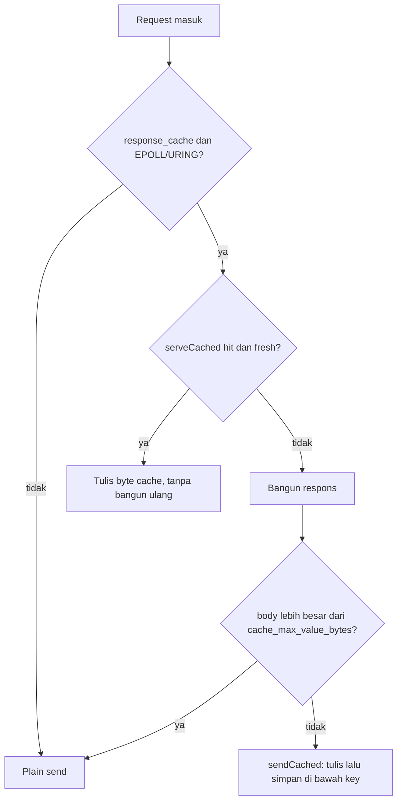

# README

<h1 align="center">
    <b><i>ZIX</i></b>
</h1>

<p align="center" style="color: #C3C3C3;font-color: #C3C3C3;">
    <b><i>Zero sIX; 06;</i></b>
</p>

<p align="center" style="color: #C3C3C3;font-color: #C3C3C3;">
    <i>Jaringan backend library & engine yang ditulis dalam Zig.</i>
</p>

<div align="center">
    
</div>

<p align="center" style="color: #C3C3C3;font-color: #C3C3C3;">
    <i>Di mana penghubung bertemu kehendak.</i>
</p>

<p align="center" style="color: #C3C3C3;font-color: #C3C3C3;">
    <i>Setiap byte dimiliki, setiap thread dipertimbangkan, setiap rute eksplisit.</i>
</p>

<p align="center" style="color: #C3C3C3;font-color: #C3C3C3;">
    <i>Tanpa cost tersembunyi. Hanya clean-metal dan kode yang transparan - terprediksi berdasarkan prinsip</i>
</p>

---

<p align="center" style="color: #C3C3C3;font-color: #C3C3C3;">
    <i>Kamu adalah pemikir. Pengutak-atik.. Perakit... Pembangun, Bukan hanya pengguna/programmer....</i>
</p>

<br>

# Daftar Isi

- [Dokumentasi](./README-id.md#dokumentasi)
- [Catatan Penting](./README-id.md#catatan-penting)
- [Catatan Kontribusi Penting](./README-id.md#catatan-kontribusi-penting)
- [Repositori](./README-id.md#repositori)
- [Alasan & Motivasi](./README-id.md#alasan-sebuah-motivasi)
- [Fitur Utama](./README-id.md#fitur-utama)
- [Konsistensi Config Server](./README-id.md#konsistensi-config-server)
- [Model Memori](./README-id.md#model-memori)
- [Persyaratan](./README-id.md#persyaratan)
- [Memulai](./README-id.md#memulai)
- [Build](./README-id.md#build)
- [Pengujian](./README-id.md#pengujian)
- [Contoh](./README-id.md#contoh)
    - [HTTP/1](./README-id.md#http1)
    - [Minimal](./README-id.md#contoh-minimal)
    - [Routing](./README-id.md#routing)
    - [Model Konkurensi](./README-id.md#model-konkurensi)
    - [Timeout](./README-id.md#timeout)
    - [Middleware](./README-id.md#middleware)
    - [WebSocket](./README-id.md#websocket)
    - [SSE](./README-id.md#sse-server-sent-events)
    - [HTTP Client](./README-id.md#http-client)
    - [File Statis & Unggah](./README-id.md#file-statis--unggah)
    - [Kapasitas Header Respons](./README-id.md#kapasitas-header-respons-headersize)
    - [Kapasitas Header Permintaan](./README-id.md#kapasitas-header-permintaan-requestheadersize)
    - [Kesadaran Cache Respons](./README-id.md#kesadaran-cache-respons-response_cache)
        - [Kapan menguntungkan](./README-id.md#kapan-menguntungkan)
        - [Aturan dan kondisi](./README-id.md#aturan-dan-kondisi)
    - [HTTP/2 h2c](./README-id.md#http2-h2c)
        - [gRPC h2c](./README-id.md#grpc-h2c)
    - [Raw TCP](./README-id.md#raw-tcp)
    - [FIX 4.x](./README-id.md#fix-4x)
    - [UDS (Unix Domain Sockets)](./README-id.md#uds-unix-domain-sockets)
    - [Channel](./README-id.md#channel)
    - [UDP](./README-id.md#udp)
    - [Logger](./README-id.md#logger)
- [Benchmark](./README-id.md#benchmark)

<br>

## Dokumentasi

| Dokumen | Keterangan |
| :- | :- |
| [`docs/hld-http-id.md`](docs/hld-http-id.md) | HTTP: tujuan, model runtime, API, router, WebSocket, SSE, model memori |
| [`docs/hld-http1-id.md`](docs/hld-http1-id.md) | HTTP/1: tujuan engine ramping, model dispatch, model handler, router, WebSocket, model memori |
| [`docs/hld-tcp-id.md`](docs/hld-tcp-id.md) | TCP stream mentah: tujuan, API, format frame, model dispatch |
| [`docs/hld-udp-id.md`](docs/hld-udp-id.md) | UDP: tujuan, model runtime, API, model paket, endianness, disconnect |
| [`docs/hld-uds-id.md`](docs/hld-uds-id.md) | UDS: tujuan, API, format frame, siklus hidup server/client |
| [`docs/hld-channel-id.md`](docs/hld-channel-id.md) | Channel: tujuan, model, API, persyaratan konkurensi, contoh |
| [`docs/hld-fix-id.md`](docs/hld-fix-id.md) | FIX 4.x: tujuan, gambaran protokol, lapisan sesi, model dispatch, konfigurasi |
| [`docs/hld-grpc-id.md`](docs/hld-grpc-id.md) | gRPC h2c: tujuan, arsitektur, API, 4 tipe RPC, codec, model dispatch |
| [`docs/hld-grpc-proxy-id.md`](docs/hld-grpc-proxy-id.md) | gRPC terminasi TLS via nginx dan haproxy |
| [`docs/hld-logger-id.md`](docs/hld-logger-id.md) | Logger: tujuan, API, metode log, format, rotasi file, pemasangan protokol |
| [`docs/hld-tls-id.md`](docs/hld-tls-id.md) | TLS: tujuan, version policy, Tls.Context, alur handshake, integrasi engine, client |
| [`docs/lld-http-id.md`](docs/lld-http-id.md) | HTTP: struktur data internal dan algoritma |
| [`docs/lld-http1-id.md`](docs/lld-http1-id.md) | HTTP/1: parsing internal, write helper, router, engine EPOLL, codec WebSocket |
| [`docs/lld-tcp-id.md`](docs/lld-tcp-id.md) | TCP: struktur data internal dan algoritma |
| [`docs/lld-udp-id.md`](docs/lld-udp-id.md) | UDP: struktur data internal dan algoritma |
| [`docs/lld-uds-id.md`](docs/lld-uds-id.md) | UDS: struktur server/client internal dan penanganan frame |
| [`docs/lld-fix-id.md`](docs/lld-fix-id.md) | FIX: struktur data internal dan algoritma serveConn |
| [`docs/lld-channel-id.md`](docs/lld-channel-id.md) | Channel: internal ring buffer, locking, algoritma send/recv |
| [`docs/lld-logger-id.md`](docs/lld-logger-id.md) | Logger: buffer tulis internal, spinlock, algoritma rotasi |
| [`docs/lld-tls-id.md`](docs/lld-tls-id.md) | TLS: internal wire / handshake / key-schedule / record, validate Tls.Context, jalur serve |
| [`docs/concurrency-id.md`](docs/concurrency-id.md) | Model dispatch: POOL, ASYNC, MIXED, EPOLL. Jumlah thread, kecocokan protokol. |
| [`docs/design-considerations-id.md`](docs/design-considerations-id.md) | Pertimbangan desain, design pattern, dan konvensi penamaan |
| [`docs/coding-guideline-id.md`](docs/coding-guideline-id.md) | Coding style: layout source, naming, anatomi file, doc comment, config, test, aturan prosa |
| [`docs/systems-thinking-id.md`](docs/systems-thinking-id.md) | Systems thinking: biaya eksplisit, alokasi terbatas, keterlibatan kernel, tooling measurement, gate dua-sisi |
| [`docs/adr-id.md`](docs/adr-id.md) | Architecture Decision Records |
| [`docs/headers-id.md`](docs/headers-id.md) | Kapasitas header respons: tingkatan, keamanan, penanganan error |
| [`docs/tests-id.md`](docs/tests-id.md) | Tingkatan pengujian (unit / integration / behaviour / edge) dan cara menjalankan |
<!-- | [`rnd/rfc/README.md`](rnd/rfc/README.md) | Checklist conformance MUST / MUST NOT berbasis RFC untuk raw HTTP/1.1, HTTP/2, HTTP/3, dan TLS 1.3 | -->

<br>

## Catatan Penting

Saat ini Zix berfokus pada Linux.

Dalam kondisi saat ini, zix tidak akan:
- Implementasi database driver.

<br>

## Catatan Kontribusi Penting

- Membantu Zig, membantu Zix.
- Zig harus menjadi ekosistemnya.
- Satu file, satu tanggung jawab.
- Selalu gunakan dan dorong penggunaan Zig dan std-nya.
- Setiap perubahan signifikan memerlukan RnD/PoC.
- Mencakup pengujian yang belum tercakup adalah kontribusi yang baik.
- Persempit pemikiran sistem lalu bersikap eksplisit.
- "Nice to have" dan "mungkin kita perlu ini" bersifat tersier.
- Selalu perbaiki dari sisi kita terlebih dahulu daripada dari sisi fitur Zig.
- Jika bias/ambigu, coba diskusikan. Minimal libatkan 1-2 entitas lain.
- Kamu dan timmu (Junior/Mid/Senior) menggunakan bahasa selain Inggris, kamu bisa berkontribusi dalam bahasa tersebut.

<br>

[Coding Guideline.](docs/coding-guideline-id.md)

[System Thinking Guideline.](docs/systems-thinking-id.md)

<br>

[Milestones.](https://codeberg.org/prothegee/zix/milestones)

[Buka isu.](https://codeberg.org/prothegee/zix/issues/new)

[Buka diskusi.](https://github.com/prothegee/zix/discussions)

<br>

## Repositori

- [Codeberg sebagai Utama](https://codeberg.org/prothegee/zix)
- [Github sebagai Mirror #1](https://github.com/prothegee/zix)

<br>

## Alasan.. Sebuah Motivasi...

<details close>
<summary>Pola Pikir:</summary>

```
Cara kita berpikir, adalah bagaimana sistem dimulai.
Waktu untuk membaca dan berpikir dari baris-baris yang ada,
membuat "kita" berpikir ulang, berdebat, dan mendekati alur program.

Ketika "generasi berikutnya" tidak mau belajar masa lalu dan masa kini. Apa yang akan terjadi?
Jika mereka tidak mau menggunakan/belajar/antusias tentang bahasa dan sistem build, mereka akan..?

Untuk menjadi modern dengan sedikit kerumitan, "keajaiban" harus lebih atau kurang?

Zig (juga bahasa pemrograman lain) dapat melengkapi program yang ada
dan mampu membuat program yang baik, tetapi ketika performa kritis pilihan kita sedikit/sulit.

Pekerjaan saya sebagian besar 80% backend dan 20% frontend.
Jadi sistem jaringan/komunikasi sangat penting di bagian saya.
Dari monolith, micro-service, hingga modular micro-service.

Di awal Zig (sebelum 0.16.x), saya menikmati bahasanya.
Zig fleksibel, tetapi "varian warna" membuat saya kembali ke Go & C++.
Jadi pada pertengahan 2025 rencananya hanya ide dan beberapa desain arsitektur.

Jadi ketika Zig 0.16.x dirilis, dan awal Maret 2026. Saya memulai langkah.
Sekarang saya bisa mendapatkan kembali transparansi, kendali yang lebih, dan pendekatan yang lebih eksplisit.
```

<!--
Mengapa bukan rust:
- Terlalu banyak "gunakan saja tokio/smol" membuat saya berpikir ulang.
- Kode Rust saya sebagai profesional masih 70% sync, sedikit async.
- Rust dalam kasus saya untuk melengkapi sistem yang ada, pembaca/penulis QR & Barcode menggantikan C++.
-->

</details>

<br>

<details open>

<summary>Prinsip-prinsip motivasi:</summary>

__*1. Eksplisit Daripada Implisit.*__

__*2. Modular & Dapat Dirawat.*__

__*3. Arsitektur Mengutamakan Performa.*__

__*4. Fitur Praktis, Siap Digunakan.*__

__*5. Model Konkurensi Modern yang Efisien.*__

__*6. Manajemen Memori yang Dapat Diprediksi dan Transparan.*__

> Kami mengutamakan kejelasan, kontrol, dan performa.

</details>

<br>

## Fitur Utama

__*1. Stack protokol lengkap dalam satu tempat:*__

Tcp (raw), Udp, Uds (Unix domain sockets), Http (HTTP/1.1), Http1 (varian
hot-path-optimized), Http2 (h2c), Http3 (HTTP/3 melalui QUIC), Grpc (gRPC melalui h2c), Fix
(FIX 4.x), plus Channel dan Logger.

> Satu model memori/threading yang koheren untuk backend monolith, micro-service, dan
modular-micro-service, alih-alih menggabungkan banyak library terpisah dengan
konvensi yang berbeda.

<br>

__*2. Library client di seluruh stack:*__

Setiap engine mengirimkan client yang cocok: `zix.Http.Client`, client gRPC, dan client `zix.Tcp`, `zix.Udp`, `zix.Uds`, dan `zix.Fix` mentah, plus client SSE (`sse_client`) dan WebSocket (`ws_client`) khusus.

> Panggil dan uji service-mu sendiri dengan library yang sama yang melayaninya, alih-alih mem-vendor client terpisah per protokol.

<br>

__*3. Lima model dispatch yang dapat dipilih:*__

- ASYNC (satu accept thread, io.async() per koneksi): latensi terendah pada beban moderat.
- POOL (N acceptor mendorong ke shared queue, M worker menangani secara sinkron): throughput mentah terbaik pada jumlah koneksi tinggi.
- MIXED (N acceptor masing-masing dispatch via io.async(), tanpa queue): seimbang.
- EPOLL (shared-nothing: setiap worker memiliki SO_REUSEPORT listener + epoll instance, level-triggered, tanpa antrian bersama): khusus Linux, terbaik untuk jumlah koneksi tinggi.
- URING (shared-nothing io_uring: topologi thread-per-core yang sama dengan EPOLL, tetapi completion-based sehingga sebagian besar transisi syscall di-batch ke dalam ring): khusus Linux.

> Strategi konkurensi adalah pilihan konfigurasi yang disengaja, bukan default implementasi. Http1, Http, Grpc, Fix, dan Http2 mengimplementasikan kelimanya secara native di Linux.

<br>

__*4. Arsitektur shared-nothing:*__

Di bawah `.EPOLL` dan `.URING` setiap worker memiliki listener SO_REUSEPORT pribadi, event loop-nya sendiri, slab koneksi, dan response cache, tanpa queue bersama, tanpa handoff fd antar-thread, dan tanpa locking. State dipartisi berdasarkan kepemilikan, bukan dijaga oleh mutex.

> Menskala dengan menambah worker independen, satu per core, jadi hot path tidak pernah berebut dan response cache lock-free berdasarkan kepemilikan.

<br>

__*5. Konfigurasi eksplisit dan flat:*__

Tanpa sub-config bertingkat: setiap field (mis. dispatch_model, max_response_headers: .MINIMAL, pool_size) berada di level teratas dan eksplisit.

> Dapat diprediksi sebagai prinsip. Kamu melihat persis apa yang server lakukan tanpa
menelusuri default yang diwariskan.

<br>

__*6. HTTP/1 zix.Http1 yang dioptimasi pada hot-path:*__

- Menghapus HeadParser, header Date yang di-cache secara thread-local, writeSimple yang dikonsolidasi, serveConn(fd, handler, opts), kapasitas response-header yang dapat dikonfigurasi.

> Memangkas jalur request umum tanpa mengorbankan API yang eksplisit.

<br>

__*7. Penanganan request HTTP yang composable:*__

Router comptime dengan parameter path (`matchParam`) yang dibagikan oleh `zix.Http` dan `zix.Http1`, rantai middleware eksplisit (`Middleware` / `NextFn`) pada `zix.Http`, static file serving, parsing multipart dan file upload (`MultipartParser`), dan parsing HTTP range request (`parseRange`) untuk partial content.

> Setiap bagian adalah bagian engine yang eksplisit dan opt-in, dengan pencocokan route diselesaikan saat compile time. Kamu menyusun hanya apa yang dibutuhkan sebuah request alih-alih mewarisi pipeline tetap.

<br>

__*8. WebSocket dan SSE (kedua engine HTTP):*__

WebSocket yang dikelola engine pada `zix.Http` dan `zix.Http1` (RFC 6455, ping auto-pong, close auto-echo, broadcast fan-out, write coalescing per-event di EPOLL), dan Server-Sent Events dengan client SSE yang cocok.

> Koneksi long-lived bergaya push ditangani oleh engine itu sendiri, bukan ditempelkan di dalam handler.

<br>

__*9. Multiplexed gRPC (h2c):*__

Multiplexed async epoll dengan resumable HTTP/2 state machine, blok reply HPACK yang di-cache saat comptime, initial window besar, buffered reads, max_streams=128 untuk menghindari REFUSED_STREAM burst. Context timeout (handler_timeout_ms, Route.timeout_ms, ctx.isExpired()).

> Keempat tipe RPC (unary, server streaming, client streaming, bidirectional)
dimultipleks melalui satu koneksi h2c tanpa thread per stream, dengan deadline client
dihormati end-to-end. Service internal berbicara gRPC secara langsung, tanpa TLS
terminator atau sidecar.

<br>

__*10. FIX 4.x:*__

FixContext, sebuah struct MsgType (47 konstanta), routing berbasis session, contoh trading.

> Pesan finansial domain-specific sebagai warga engine, bukan ditempelkan ke raw
TCP.

<br>

__*11. Channel (primitive konkurensi dan IPC bertipe):*__

`Channel(T)` bounded generik dengan `send` / `recv` / `close` dan semantik drain-after-close, dapat dipakai untuk fan-out in-process, worker pool, dan koordinasi antar-proses.

> Blok bangunan kecil dan bertipe untuk mengoordinasi kerja, primitive yang sama baik peer-nya thread maupun proses.

<br>

__*12. Logger yang sadar protokol:*__

Tipe log per protokol: conn (TCP), packet (UDP), frame (UDS), session (FIX), rpc (gRPC), access() khusus HTTP, Channel khusus system.

> Kosakata log cocok dengan unit kerja aktual pada setiap protokol.

<br>

__*13. Kesadaran Cache Respons:*__

Response cache opt-in per-worker (ADR-036) yang dibagikan oleh `zix.Http1`, `zix.Http`, dan `zix.Grpc`. Handler membangun respons sekali, engine menyimpannya di bawah key yang diturunkan dari request, dan request cocok berikutnya memutar ulang byte tersimpan tanpa rebuild dan tanpa re-serialization. Data oriented (structure of arrays plus satu flat payload slab), lock-free by ownership (satu instance per worker, tidak pernah dibagi), dengan TTL lazy on-access. Aktif di bawah model shared-nothing `.EPOLL` dan `.URING`.

> Alat yang kamu pakai secara sengaja, bukan layer tersembunyi. Menguntungkan di atas body ~4 KiB (JSON berat ~32 KiB terukur +34% throughput) dan zero-regression wash di bawahnya.

<br>

__*14. Dokumentasi multi-bahasa:*__

Setiap dokumen punya variannya sendiri.

> Dukungan: en - English, id - Bahasa

<br>

## Konsistensi Config Server

Setiap config server berbagi satu kosakata: konsep yang sama memakai nama field dan tipe yang sama di `zix.Tcp`, `zix.Http1`, `zix.Http`, `zix.Grpc`, dan `zix.Fix`. Memindahkan config antar protokol bersifat mekanis, bukan belajar ulang. Field berikut umum untuk semuanya:

| Field | Tipe | Arti |
| :- | :- | :- |
| `io` | `std.Io` | Backend I/O, wajib, harus hidup lebih lama dari server |
| `ip` | `[]const u8` | Alamat bind |
| `port` | `u16` | Port bind, harus bukan nol |
| `dispatch_model` | `DispatchModel` | `.ASYNC` (default), `.POOL`, `.MIXED`, `.EPOLL` |
| `kernel_backlog` | `u31` | Backlog listen TCP |
| `workers` | `usize` | Jumlah worker accept atau EPOLL, `0` memilih cpu_count |
| `pool_size` | `usize` | Jumlah pool thread untuk `.POOL`, `0` memilih formula |
| `logger` | `?*Logger` | Logger opsional, milik pemanggil |

Field buffer, timeout, dan cache memakai nama yang sama di mana pun protokol memiliki fitur tersebut:

| Field | Tipe | Ada di |
| :- | :- | :- |
| `max_recv_buf` | `usize` | `zix.Tcp`, `zix.Http1`, `zix.Http`, `zix.Uds` |
| `conn_timeout_ms` | `u32` | `zix.Http`, `zix.Fix` |
| `handler_timeout_ms` | `u32` | `zix.Http1`, `zix.Http`, `zix.Grpc`, `zix.Fix` |
| `response_cache` dan empat field `cache_*` | lihat [Kesadaran Cache Respons](#kesadaran-cache-respons-response_cache) | `zix.Http1`, `zix.Http`, `zix.Grpc` |
| `compression`, `compression_min_size`, `compression_max_out` | `bool` / `usize` / `usize` | `zix.Http1`, `zix.Http` |

Beberapa perbedaan disengaja, bukan drift:

- `zix.Http1` tidak punya `conn_timeout_ms`: ia tidak menjalankan timer thread connection-registry (lihat catatan Timeout di docs LLD HTTP/1).
- `zix.Grpc` mengukur data masuk dengan field spesifik protokol (`max_body`, `max_frame_size`, `max_header_scratch`) alih-alih `max_recv_buf`.
- Response compression (`compression*`) ada di `zix.Http1` dan `zix.Http`, engine yang melayani respons HTTP dengan negosiasi Accept-Encoding. `zix.Grpc` memakai kompresi `grpc-encoding` per-message miliknya sendiri, dan raw transport (`zix.Tcp`, `zix.Udp`, `zix.Uds`, `zix.Fix`) tidak punya negosiasi konten HTTP.
- `zix.Udp` (datagram) membawa `ip` / `port` / `logger` untuk jalur typed, plus knob jalur raw `dispatch_model` / `workers` / `reuse_address` / `recv_batch` / `send_batch` / `max_recv_buf` (ADR-049, dipakai `zix.Udp.Raw`). `zix.Uds` (local socket) membawa `kernel_backlog` / `max_recv_buf` / `logger` plus path socket-nya. Tiap engine hanya mengambil subset yang berlaku.

<br>

## Model Memori

### HTTP

| Cakupan | Allocator | Masa hidup |
| :- | :- | :- |
| Tabel rute | comptime (tanpa biaya heap) | N/A |
| Buffer I/O baca/tulis | `smp_allocator` | Koneksi |
| Alokasi per-permintaan (`ctx.allocator`) | `ArenaAllocator` per-koneksi, direset setiap permintaan | Permintaan |

Handler menerima `ctx.allocator`, sebuah arena yang direset di antara permintaan. Alokasi apa pun yang dibuat di dalam handler secara otomatis direklamasi di akhir permintaan tanpa panggilan `free`.

Rute dibuat dalam tipe server pada waktu kompilasi: tidak diperlukan allocator untuk penyimpanan rute.

### UDP

| Cakupan | Allocator | Masa hidup |
| :- | :- | :- |
| Daftar rekaman client | `config.allocator` (milik pemanggil) | Masa hidup proses server |
| Snapshot peer (broadcast) | `config.allocator` | Dispatch satu paket |
| Buffer terima | Stack | Satu iterasi loop terima |

`config.allocator` harus berupa general-purpose allocator (misalnya `std.heap.smp_allocator`). `ArenaAllocator` tidak cocok: snapshot peer broadcast dialokasikan dan dibebaskan per paket: `ArenaAllocator.free()` adalah no-op, sehingga snapshot menumpuk tanpa batas hingga server berhenti. Lihat [`docs/hld-udp-id.md`](docs/hld-udp-id.md) untuk penjelasan lengkap dan PoC.

Jalur raw (`zix.Udp.Raw`, ADR-049) mengalokasikan recv / send batch dan array worker-thread-nya dari `config.allocator` sekali saat startup, bukan per paket, jadi caveat arena tidak berlaku di sana.

### HTTP/2 dan gRPC

Keduanya menggunakan array stream per-koneksi yang dialokasikan heap (alokasi stack dari `max_streams` struct `Stream` akan meluap stack thread). Tidak ada allocator per-permintaan yang diekspos: handler menerima I/O frame mentah via `GrpcContext` (gRPC) atau `fd`/`sid` (HTTP/2).

Untuk detail memori lengkap lihat [`docs/hld-http-id.md`](docs/hld-http-id.md) dan [`docs/hld-udp-id.md`](docs/hld-udp-id.md). Untuk model threading lihat [`docs/concurrency-id.md`](docs/concurrency-id.md).

<br>

## Persyaratan

- [Zig](https://ziglang.org/):
    - [x] 0.16.x
    - [ ] 0.17.x (Experimental)

<br>

## Memulai

Ambil zix ke proyekmu:

Tambahkan ke `build.zig.zon`:
```zig
.{
    .name = .my_project,
    .version = "0.1.0",
    .fingerprint = 0x0, // required, zig prints a suggested value on first init
    .dependencies = .{},
    .paths = .{""},
}
```

Lalu lakukan:
```sh
zig fetch --save "https://codeberg.org/prothegee/zix/archive/MAJOR.MINOR.x.tar.gz"`.
```

<br>

Atau,

gunakan zig fetch langsung dengan source repo dan versi:
```sh
zig fetch --save "git+https://codeberg.org/prothegee/zix#main" # upstream
```

atau

```sh
# upstream vMAJOR.MINOR.x
zig fetch --save "git+https://codeberg.org/prothegee/zix#MAJOR.MINOR.x"
```

> Kamu juga bisa menggunakan mirror di `github.com/prothegee/zix`
>
> Untuk versi tertentu, gunakan `MAJOR.MINOR.x`, misalnya `#0.2.x` dan ganti `#main`

<br>

Tambahkan ke proyekmu (file `build.zig`):

```sh
const zix = b.dependency("zix", .{
    .target = target,
    .optimize = optimize,
});

exe.root_module.addImport("zix", zix.module("zix"));
```

<br>

## Build

zix dikonsumsi sebagai Zig module (source), bukan dikirim sebagai library prebuilt. Repositori mendefinisikan module `zix` dengan `b.addModule`, jadi tidak ada artifact `addStaticLibrary` atau `addSharedLibrary`. Menjalankan `zig build` sendirian menjalankan step `install` default tanpa ada yang diinstal: tidak ada `.a`, tidak ada `.so`, tidak ada apa pun di bawah `zig-out/lib`. Ia meng-compile module graph dan hanya berguna sebagai pengecekan cepat "apakah masih compile".

Entry point yang sebenarnya adalah step bernama. Daftarkan kapan saja dengan `zig build -l`:

| Step | Fungsinya |
| :- | :- |
| `zig build` | Hanya meng-compile module graph. Tidak ada artifact yang dihasilkan, karena zix adalah source module. |
| `zig build test-all` | Menjalankan tes unit, integration, behaviour, dan edge. |
| `zig build unit-test` | Menjalankan tes unit saja. Juga `integration-test`, `behaviour-test`, `edge-test`. |
| `zig build examples` | Membangun setiap example ke `zig-out/bin/`. |
| `zig build example-<group>` | Membangun satu grup example, misalnya `example-http1` atau `example-grpc`. |
| `zig build example-<name>` | Membangun dan menjalankan satu example, misalnya `example-http1_websocket`. |
| `zig build test-runner-<name>` | Menjalankan pengecekan integrasi server plus client, misalnya `test-runner-http1-epoll`. |
| `zig build test-runner-all` | Menjalankan setiap runner integrasi server plus client. |

Binary example yang dibangun ada di `zig-out/bin/`. Untuk membangun semua example, lalu menjalankan satu di background dan menghentikannya:

```sh
zig build examples                      # bangun setiap example ke zig-out/bin/
./zig-out/bin/example-http1_websocket & # jalankan satu di background
kill %1                                 # hentikan
```

Tidak ada output library `zig build install` dan tidak ada `-Doptimize` yang diperlukan untuk pengecekan compile biasa. Untuk mengonsumsi zix di proyek lain, ikuti Memulai di atas: ia ditambahkan sebagai dependency `build.zig.zon` dan diimpor dengan `exe.root_module.addImport("zix", zix.module("zix"))`, tidak pernah di-link sebagai system library.

<br>

## Pengujian

```sh
zig build unit-test        # pengujian unit (tes inline src/)
zig build integration-test # pengujian integrasi (komponen terhubung)
zig build behaviour-test   # pengujian behaviour (kontrak API yang dapat diamati)
zig build edge-test        # pengujian edge (kondisi batas dan jalur error)
zig build test-all         # semua di atas
```

`zig build` saja tidak menjalankan tes. Lihat [`docs/tests-id.md`](docs/tests-id.md) untuk detail cakupan lengkap.

<br>

## Contoh

Untuk contoh lebih lengkap lihat direktori `examples`.

Jalankan `zig build examples` untuk membangun semua contoh (baca `build.zig` untuk detail lebih lanjut).

### HTTP/1

Zix memiliki dua model API untuk HTTP/1, `zix.Http` dan `zix.Http1`.

`zix.Http` bergantung pada `std.http` Zig dan berfungsi sebagai pendekatan yang mudah, sedangkan `zix.Http1` tidak.

**Kapan digunakan:** pilih `zix.Http` saat kamu ingin API request/response yang lengkap (Request/Response/Context, arena per request, middleware, file statis). Pilih `zix.Http1` saat kamu ingin engine hot-path yang ramping dengan overhead per-request terendah dan bersedia bekerja pada level `fn(head, body, fd)`. Keduanya berbagi router comptime dan model dispatch yang sama.

<br>

### Contoh Minimal

Auto I/O (work-queue thread pool, default):
```zig
const std = @import("std");
const zix = @import("zix");

pub fn homeHandler(req: *zix.Http.Request, res: *zix.Http.Response, ctx: *zix.Http.Context) !void {
    _ = req; _ = ctx;
    try res.send("hello from zix");
}

pub fn main(process: std.process.Init) !void {
    var server = try zix.Http.Server.init(4096, &[_]zix.Http.Route{
        .{ .path = "/", .handler = homeHandler },
    }, .{
        .io   = process.io,
        .ip   = "127.0.0.1",
        .port = 9000,
    });
    defer server.deinit();
    try server.run();
}
```

Manual I/O (batas konkurensi eksplisit via `concurrent_limit`, dispatch `.ASYNC`):
```zig
pub fn main() !void {
    var threaded = std.Io.Threaded.init(std.heap.smp_allocator, .{
        .concurrent_limit = std.Io.Limit.limited(4), // pin ke 4 tugas concurrent
        // .concurrent_limit = .unlimited             // biarkan runtime memutuskan
    });
    defer threaded.deinit();

    var server = try zix.Http.Server.init(4096, &[_]zix.Http.Route{
        .{ .path = "/", .handler = homeHandler },
    }, .{
        .io             = threaded.io(),
        .ip             = "127.0.0.1",
        .port           = 9000,
        .dispatch_model = .ASYNC, // .ASYNC menggunakan io pemanggil secara langsung
    });
    defer server.deinit();
    try server.run();
}
```

**Contoh:**
- [examples/http_basic_1_async.zig](examples/http_basic_1_async.zig) - dispatch ASYNC
- [examples/http_basic_2_pool.zig](examples/http_basic_2_pool.zig) - dispatch POOL
- [examples/http_basic_3_mixed.zig](examples/http_basic_3_mixed.zig) - dispatch MIXED
- [examples/http_basic_4_epoll.zig](examples/http_basic_4_epoll.zig) - dispatch EPOLL
- [examples/http_basic_5_uring.zig](examples/http_basic_5_uring.zig) - dispatch URING (ring io_uring)
- [examples/http_manual_concurrent.zig](examples/http_manual_concurrent.zig) - kontrol konkurensi eksplisit via `Io.Threaded`
- [examples/http1_basic_1_async.zig](examples/http1_basic_1_async.zig) - `zix.Http1` mentah: dispatch ASYNC
- [examples/http1_basic_2_pool.zig](examples/http1_basic_2_pool.zig) - `zix.Http1` mentah: dispatch POOL
- [examples/http1_basic_3_mixed.zig](examples/http1_basic_3_mixed.zig) - `zix.Http1` mentah: dispatch MIXED
- [examples/http1_basic_4_epoll.zig](examples/http1_basic_4_epoll.zig) - `zix.Http1` mentah: dispatch EPOLL
- [examples/http1_basic_5_uring.zig](examples/http1_basic_5_uring.zig) - `zix.Http1` mentah: dispatch URING
- [examples/http1_json.zig](examples/http1_json.zig)
- [examples/http1_params.zig](examples/http1_params.zig)
- [examples/http1_paths.zig](examples/http1_paths.zig)
- [examples/http1_middleware.zig](examples/http1_middleware.zig)
- [examples/http1_cache.zig](examples/http1_cache.zig)
- [examples/http1_manual_concurrent.zig](examples/http1_manual_concurrent.zig)

**Kapan digunakan:** mulai dari sini untuk layanan HTTP biasa. Auto I/O (default) adalah jalur paling sederhana dan membiarkan runtime mengukur thread pool-nya sendiri. Beralih ke manual I/O dengan `concurrent_limit` hanya saat kamu harus membatasi konkurensi secara eksplisit: memori terbatas, anggaran worker tetap, atau load test deterministik.

<br>

### Routing

Rute didaftarkan pada waktu kompilasi via tabel rute yang diteruskan ke `Server.init`. Setiap entri `Route` memiliki `path`, `handler`, dan `kind` opsional (`.EXACT` secara default):

```zig
var server = try zix.Http.Server.init(4096, &[_]zix.Http.Route{
    .{ .path = "/about",           .handler = aboutHandler },
    // exact (default): hanya cocok dengan /about

    .{ .path = "/api",             .handler = apiHandler,    .kind = .PREFIX },
    // prefix: cocok dengan /api, /api/foo, /api/foo/bar, TIDAK /apiv2

    .{ .path = "/users/:id",       .handler = userHandler,   .kind = .PARAM },
    // param: cocok dengan /users/alice, menangkap id="alice"
    // baca di dalam handler: req.pathParam("id")

    .{ .path = "/:tenant/:branch", .handler = branchHandler, .kind = .PARAM },
    // multi-param: req.pathParam("tenant"), req.pathParam("branch")
}, .{ .ip = "127.0.0.1", .port = 9000 });
```

**Prioritas:**

```
exact  >  param  >  prefix (prefix lebih panjang mengalahkan yang lebih pendek)
```

Prioritas exact dan prefix tidak bergantung pada urutan pendaftaran. **Rute param adalah pengecualian**: ketika dua pola memiliki jumlah segmen yang sama dan keduanya cocok, entri pertama dalam tabel rute yang menang. Daftarkan pola yang lebih literal sebelum pola all-param dengan kedalaman yang sama:

```zig
var server = try zix.Http.Server.init(4096, &[_]zix.Http.Route{
    // Urutan yang benar: /path/user/:id menang untuk /path/user/alice
    .{ .path = "/path/user/:id",        .handler = userHandler,   .kind = .PARAM },
    .{ .path = "/path/:tenant/:branch", .handler = tenantHandler, .kind = .PARAM },
}, .{ ... });
```

| Terdaftar | Permintaan | Pemenang | Alasan |
| :- | :- | :- | :- |
| `/path/info` (exact) + `/path/:id` (param) | `/path/info` | `/path/info` | exact mengalahkan param |
| `/path/:id` (param) + `/path` (prefix) | `/path/alice` | `/path/:id` | param mengalahkan prefix |
| `/api/v2` + `/api` (keduanya prefix) | `/api/v2/foo` | `/api/v2` | prefix lebih panjang menang |
| `/path/user/:id` (ke-1) + `/path/:a/:b` (ke-2) | `/path/user/alice` | `/path/user/:id` | literal lebih banyak didaftarkan pertama |

**Pencocokan seperti Regex**: zix tidak memiliki mesin regex. Rute prefix (`.kind = .PREFIX`) mencakup path yang terdaftar dan sub-path di bawahnya. Pemfilteran tambahan dilakukan di dalam handler dengan operasi string biasa pada `req.path()`:

```zig
// Dalam tabel rute:
.{ .path = "/secret", .handler = secretHandler, .kind = .PREFIX },

// Di dalam secretHandler: ekstrak sub-path dan terapkan logika kustom
const sub = req.path()["/secret/".len..];  // misalnya "file.txt"
// cek ekstensi, kedalaman, query params, header, dll.
```

**Contoh:**
- [examples/http_params.zig](examples/http_params.zig) - penanganan parameter query dan form
- [examples/http_paths.zig](examples/http_paths.zig) - pola routing parameter path
- [examples/http_json.zig](examples/http_json.zig) - penanganan respons JSON

**Mesin `zix.Http1` mentah**: mesin tingkat rendah menyediakan `Router` comptime yang sama dengan jenis `.EXACT` / `.PREFIX` / `.PARAM` yang identik dan prioritas `exact > param > prefix` yang sama. Satu perbedaannya adalah penangkapan param: handler Http1 adalah `fn(head: *const ParsedHead, body, fd) void` tanpa `Request`, jadi param yang ditangkap dibaca dengan fungsi bebas `zix.Http1.pathParam("id")` (sebuah thread-local per-handler, model yang sama dengan `zix.Http1.setTimeout`, lihat ADR-029) alih-alih `req.pathParam("id")`:

```zig
const Router = zix.Http1.Router(&[_]zix.Http1.Route{
    .{ .path = "/",          .handler = homeHandler },
    .{ .path = "/secret",    .handler = secretHandler, .kind = .PREFIX },
    .{ .path = "/users/:id", .handler = userHandler,   .kind = .PARAM },
});

var server = zix.Http1.Server.init(Router.dispatch, .{ .ip = "0.0.0.0", .port = 9100 });

// di dalam userHandler:
const id = zix.Http1.pathParam("id") orelse return;
```

Penangkapan param per-rute dibatasi 8 param per pencocokan. Lihat ADR-033.

**Contoh:**
- [examples/http1_static.zig](examples/http1_static.zig) - rute prefix yang digunakan

**Kapan digunakan:** pakai route table comptime setiap kali sebuah layanan punya lebih dari satu endpoint. Pilih `.EXACT` untuk path tetap, `.PARAM` untuk id resource, dan `.PREFIX` untuk sub-tree atau fallthrough ke static serving. Daftarkan pola yang lebih literal sebelum pola all-param dengan kedalaman sama agar rute yang dimaksud menang.

<br>

### Model Konkurensi

Lima model dispatch, dipilih via `config.dispatch_model` (enum `DispatchModel`, default `.ASYNC`):

**`.POOL` (work-queue thread pool):**

N accept thread mendorong koneksi ke `ConnQueue` bersama. M pool thread mengambil dan menangani setiap koneksi secara sinkron dengan blocking I/O, tanpa overhead scheduler. Throughput terbaik di bawah jumlah koneksi tinggi. `SO_REUSEPORT` memungkinkan semua accept thread mendengarkan di port yang sama.

```zig
pub fn main(process: std.process.Init) !void {
    var server = try zix.Http.Server.init(4096, &[_]zix.Http.Route{
        .{ .path = "/", .handler = homeHandler },
    }, .{
        .io = process.io,
        // dispatch_model = .ASYNC (default, bisa dihilangkan)
        // workers        = 0  -> cpu_count (accept thread untuk .POOL/.MIXED; worker untuk .EPOLL)
        // pool_size      = 0  -> max(10, cpu_count * 2) pool thread (.POOL only; diabaikan oleh .EPOLL)
    });
```

**`.ASYNC` (accept tunggal, dispatch `io.async()`):**

Satu accept thread mendispatch setiap koneksi via `io.async()`. `workers` dan `pool_size` diabaikan. Diutamakan untuk SSE dan WebSocket (koneksi long-lived tidak menahan pool thread). Cocok juga untuk `concurrent_limit` eksplisit.

```zig
var server = try zix.Http.Server.init(4096, &[_]zix.Http.Route{
    .{ .path = "/", .handler = homeHandler },
}, .{
    .io             = process.io,
    .dispatch_model = .ASYNC,
});
```

**`.MIXED` (N accept thread, dispatch `io.async()`):**

N accept thread masing-masing mendispatch koneksi via `io.async()` secara langsung, tanpa `ConnQueue`. Throughput dan latensi seimbang. `pool_size` diabaikan.

```zig
var server = try zix.Http.Server.init(4096, &[_]zix.Http.Route{
    .{ .path = "/", .handler = homeHandler },
}, .{
    .io             = process.io,
    .dispatch_model = .MIXED,
});
```

**`.EPOLL` (shared-nothing epoll worker, khusus Linux):**

Setiap worker memiliki `SO_REUSEPORT` listener dan satu `epoll` instance tersendiri. Kernel mendistribusikan koneksi baru ke worker. Tidak ada antrian bersama, tidak ada mutex, tidak ada handoff fd antar thread. Level-triggered `EPOLLIN` menjaga koneksi tetap terdaftar setelah setiap request tanpa re-arm eksplisit. Koneksi keep-alive yang idle tidak menahan thread. Terbaik untuk request berumur pendek throughput tinggi di Linux. Build non-Linux otomatis fallback ke `.POOL`.

```zig
var server = try zix.Http.Server.init(4096, &[_]zix.Http.Route{
    .{ .path = "/", .handler = homeHandler },
}, .{
    .io             = process.io,
    .dispatch_model = .EPOLL,
    .workers        = 0, // 0 = cpu_count worker (default); pool_size diabaikan
});
```

**`.URING` (shared-nothing io_uring worker, khusus Linux):**

Topologi thread-per-core, shared-nothing yang sama dengan `.EPOLL` (satu `SO_REUSEPORT` listener dan satu ring per worker, tanpa antrian bersama), tetapi completion-based alih-alih readiness-based, sehingga sebagian besar transisi syscall di-batch ke dalam ring. Accept, recv, send, dan close semuanya berjalan di ring (`zix.Http1` me-ring close-nya via `prep_close`, ADR-041, jadi worker terus memanen completion lintas teardown koneksi di bawah churn). Diimplementasikan secara native oleh `zix.Http1`, `zix.Http`, `zix.Grpc`, `zix.Fix`, dan `zix.Http2`. Handler per-connection `zix.Tcp` tidak punya ring native dan melipat (fold) ke `.POOL` / `.EPOLL`. Build non-Linux fallback ke `.POOL`.

```zig
var server = try zix.Http.Server.init(4096, &[_]zix.Http.Route{
    .{ .path = "/", .handler = homeHandler },
}, .{
    .io             = process.io,
    .dispatch_model = .URING,
    .workers        = 0, // 0 = cpu_count worker (default); pool_size diabaikan
});
```

---

__*In the nutshell:*__
- Looking for high throughput? Use `.EPOLL` or `.URING`.
- Looking for consistent latency? Use `.ASYNC`.
- For non-linux user and looking for high throughput? Use `.POOL` or `.MIXED`.

> Dalam banyak kasus untuk throughput tinggi, URING umumnya unggul dalam efisiensi CPU & RAM,
> Namun dalam beberapa kasus, kinerjanya bisa berbeda, lihat bagian benchmark untuk referensi.

**Kapan digunakan:** model dispatch adalah satu knob yang membentuk ulang seluruh server. Pakai `.ASYNC` saat latensi dan koneksi berumur panjang (SSE, WebSocket) penting, `.POOL` / `.MIXED` untuk throughput mentah di platform mana pun, dan `.EPOLL` / `.URING` di Linux untuk jumlah koneksi tertinggi dengan biaya per-request terendah. Di kotak dev loopback keduanya seri pada throughput dan `.URING` menang terutama pada cache locality. Di mesin many-core, ring close (ADR-041) membuat `.URING` menjaga core-nya tetap sibuk lewat connection churn, di mana ia mencapai paritas atau lebih baik dari `.EPOLL` di setiap beban yang diukur dengan memori jauh lebih sedikit.

**Mengapa per-engine:** setiap engine mengimplementasikan model-model ini di `server.zig`-nya sendiri, bukan di belakang satu multiplexer bersama. Pemisahan ini disengaja dan justru merupakan optimasinya: ia membuat tiap engine menyetel hot path-nya sendiri. `zix.Http1` mengukir buffer koneksi dari slab contiguous demand-paged (tanpa heap call per-accept), sementara `zix.Grpc` dan `zix.Fix` memegang pointer heap per-koneksi karena koneksinya membawa state sesi h2 atau FIX. Hanya primitive byte-identical yang dibagikan (codec `user_data` `.URING` di `src/multiplexers/ring.zig`): bagikan primitive yang harus cocok, pertahankan dispatch loop per-engine. Lihat ADR-042.

> Beban kerja kita tidak sama, apa yang cocok untuk Anda mungkin tidak cocok untuk orang lain.
> Uji beban kerja Anda bila memungkinkan, mungkin dengan rasio 1:4 dari lingkungan produksi.
> Zix tidak akan mendikte pendekatan Anda.

Lihat [`docs/concurrency-id.md`](docs/concurrency-id.md) untuk detail arsitektur, jumlah thread, dan kapan sebaiknya memilih masing-masing model.

<br>

### Timeout

Dua lapisan timeout independen, keduanya dinonaktifkan secara default (`0`):

**`conn_timeout_ms`**: penjaga koneksi tingkat jaringan (Layer D). Thread timer menutup koneksi yang telah terbuka lebih lama dari ini tanpa selesai. Melindungi pool thread dari klien yang macet sebelum atau saat mengirim header. Efektif hanya di `.POOL`.

**`handler_timeout_ms`**: anggaran eksekusi per-handler (Layer B). Mengatur `ctx.deadline` sebelum setiap dispatch. Handler ikut serta dengan memanggil `ctx.isExpired()` di antara langkah-langkah yang mahal.

```zig
var server = try zix.Http.Server.init(4096, &[_]zix.Http.Route{
    .{ .path = "/slow", .handler = slowHandler },
}, .{
    .io                 = process.io,
    .ip                 = "127.0.0.1",
    .port               = 9000,
    .conn_timeout_ms    = 30_000, // tutup koneksi macet setelah 30 detik
    .handler_timeout_ms = 5_000,  // anggaran handler: 5 detik
});
```

Handler yang menggunakan anggaran:

```zig
pub fn slowHandler(req: *zix.Http.Request, res: *zix.Http.Response, ctx: *zix.Http.Context) !void {
    _ = req;

    doStep1(ctx.io);
    if (ctx.isExpired()) {
        res.setStatus(.REQUEST_TIMEOUT);
        return res.sendJson("{\"error\":\"timeout\"}");
    }

    doStep2(ctx.io);
    if (ctx.isExpired()) {
        res.setStatus(.REQUEST_TIMEOUT);
        return res.sendJson("{\"error\":\"timeout\"}");
    }

    try res.sendJson("{\"result\":\"ok\"}");
}
```

Untuk menimpa deadline di dalam handler (jendela lebih pendek atau lebih panjang dari anggaran global):

```zig
ctx.setTimeout(2_000); // timpa ke 2 detik dari sekarang terlepas dari cap global
```

`ctx.isExpired()` adalah no-op (selalu mengembalikan `false`) ketika `handler_timeout_ms == 0`. `ctx.timedOut()` adalah alias untuk `ctx.isExpired()`. `conn_timeout_ms` harus >= `handler_timeout_ms` agar koneksi tidak terputus sebelum handler dapat mengirim 408. Lihat `docs/adr-id.md` (ADR-018) untuk alasan desain.

**Contoh:**
- [examples/http_timeout_resp.zig](examples/http_timeout_resp.zig)
- [examples/http1_timeout_resp.zig](examples/http1_timeout_resp.zig) - `zix.Http1` mentah, memakai `zix.Http1.isExpired()` dan `zix.Http1.setTimeout()` (tanpa ctx, lihat ADR-029)

**Kapan digunakan:** setel `handler_timeout_ms` setiap kali handler bisa berjalan lama (panggilan eksternal, komputasi berat) dan kamu ingin ia keluar secara kooperatif dengan 408 alih-alih menahan thread. Tambahkan `conn_timeout_ms` di bawah `.POOL` untuk mengusir client yang stall sebelum menyelesaikan request. Biarkan keduanya 0 untuk trafik internal tepercaya dengan kerja terbatas.

<br>

### Middleware

Middleware disusun pada waktu kompilasi menggunakan fungsi wrapper. Setiap wrapper menerima `comptime next: zix.Http.HandlerFn` dan mengembalikan `HandlerFn` baru (tanpa alokasi heap, tanpa chain runner runtime).

```zig
fn withOriginCheck(comptime next: zix.Http.HandlerFn) zix.Http.HandlerFn {
    return struct {
        fn handle(req: *zix.Http.Request, res: *zix.Http.Response, ctx: *zix.Http.Context) anyerror!void {
            const origin = req.header("origin") orelse "";
            if (!isAllowedOrigin(origin)) {
                res.setStatus(.FORBIDDEN);
                try res.sendJson("{\"error\":\"forbidden origin\"}");
                return;
            }
            return next(req, res, ctx);
        }
    }.handle;
}

fn withBasicAuth(comptime next: zix.Http.HandlerFn) zix.Http.HandlerFn {
    return struct {
        fn handle(req: *zix.Http.Request, res: *zix.Http.Response, ctx: *zix.Http.Context) anyerror!void {
            // validasi Authorization: Basic <base64(user:pass)>
            // ...
            return next(req, res, ctx);
        }
    }.handle;
}
```

Susun dari kiri ke kanan, wrapper paling luar dijalankan pertama:

```zig
var server = try zix.Http.Server.init(4096, &[_]zix.Http.Route{
    // hanya pengecekan origin
    .{ .path = "/public",  .handler = withOriginCheck(publicHandler) },
    // pengecekan origin -> basic auth -> handler
    .{ .path = "/private", .handler = withOriginCheck(withBasicAuth(privateHandler)) },
}, .{ .io = process.io, .ip = "127.0.0.1", .port = 9008 });
```

```
# contoh curl
curl -H "Origin: http://localhost" "http://localhost:9008/public"                         # 200
curl "http://localhost:9008/public"                                                       # 403

curl -H "Origin: http://localhost" -u "admin:secret" "http://localhost:9008/private"      # 200
curl -H "Origin: http://localhost" "http://localhost:9008/private"                        # 401
curl "http://localhost:9008/private"                                                      # 403
```

**Contoh:**
- [examples/http_middleware.zig](examples/http_middleware.zig)

**Kapan digunakan:** susun middleware untuk perhatian lintas-sektoral yang membungkus banyak rute: auth, cek origin/CORS, rate limit, request logging. Karena rantai dibangun saat comptime tanpa heap dan tanpa runner runtime, biayanya nol per request, jadi pilih ini daripada boilerplate per-handler setiap kali guard yang sama berulang di banyak rute.

<br>

### WebSocket

Broadcast berbasis ruang melalui RFC 6455. Handler param mengupgrade koneksi dan memasuki loop frame per-task, tidak perlu thread terpisah.

```zig
var ws_rooms: zix.Http.WebSocket.RoomMap = undefined;

pub fn wsHandler(req: *zix.Http.Request, res: *zix.Http.Response, ctx: *zix.Http.Context) !void {
    const room_id = req.pathParam("room-id") orelse return;

    // Baca query param SEBELUM upgrade() (tidak tersedia setelah handshake 101).
    const display_name = req.queryParam("name") orelse "anonymous";

    // ekstrak Sec-WebSocket-Key dari header, lalu handshake
    var accept_buf: [64]u8 = undefined;
    const accept = try zix.Http.WebSocket.acceptKey(ws_key, &accept_buf);
    try zix.Http.WebSocket.upgrade(ctx.stream, ctx.io, accept); // menulis 101 secara langsung

    // heap-alokasi conn, bergabung ke ruang, keduanya dibersihkan via defer (LIFO)
    const conn = try std.heap.smp_allocator.create(zix.Http.WebSocket.Conn);
    conn.* = .{ .stream = ctx.stream, .io = ctx.io };
    defer std.heap.smp_allocator.destroy(conn);
    ws_rooms.join(room_id, conn, ctx.io);
    defer ws_rooms.leave(room_id, conn, ctx.io);  // berjalan sebelum destroy

    // loop frame:
    //   text/binary -> broadcast "[display_name] payload" ke ruang
    //   ping        -> pong
    //   close       -> echo frame close + break
    //   EOF / error -> frame close best-effort + break
    _ = display_name;
}

pub fn main(process: std.process.Init) !void {
    ws_rooms = zix.Http.WebSocket.RoomMap.init(std.heap.smp_allocator);
    defer ws_rooms.deinit();

    var server = try zix.Http.Server.init(4096, &[_]zix.Http.Route{
        .{ .path = "/ws/:room-id", .handler = wsHandler, .kind = .PARAM },
    }, .{ .io = process.io, .ip = "127.0.0.1", .port = 9008 });
    defer server.deinit();
    try server.run();
}
```

```
# Sambungkan dengan wscat atau websocat, ?name mengatur nama display broadcast
wscat    -c "ws://localhost:9008/ws/lobby?name=alice"
websocat    "ws://localhost:9008/ws/lobby?name=alice"

# ?name opsional, hilangkan untuk "anonymous"
wscat    -c "ws://localhost:9008/ws/lobby"
```

**Prioritas:** exact > param > prefix. `/ws/:room-id` adalah rute param, jadi `/ws/lobby` menangkap `room-id = "lobby"`.

`ctx.stream` adalah TCP stream mentah yang diekspos via `Context`. Server menetapkannya untuk **setiap** koneksi sebelum memanggil handler mana pun: handler HTTP mengabaikannya, handler WebSocket menggunakannya setelah upgrade 101.

**Menggabungkan HTTP, static, dan WebSocket dalam satu server**: daftarkan semua tipe handler bersamaan, routing menangani dispatch. Rute yang tidak cocok diteruskan ke static serving:

```zig
var server = try zix.Http.Server.init(4096, &[_]zix.Http.Route{
    .{ .path = "/",          .handler = homeHandler },
    .{ .path = "/api",       .handler = apiHandler,  .kind = .PREFIX },
    .{ .path = "/ws/:room-id", .handler = wsHandler, .kind = .PARAM },
}, .{
    .io         = process.io,
    .ip         = "127.0.0.1",
    .port       = 9008,
    .public_dir = "./public", // file statis untuk rute yang tidak cocok
});
```

**Contoh:**
- [examples/http_websocket.zig](examples/http_websocket.zig) - contoh lengkap yang berfungsi
- [examples/http_ws_client.zig](examples/http_ws_client.zig) - client yang cocok
- [examples/http1_websocket.zig](examples/http1_websocket.zig) - `zix.Http1.WebSocket` mentah, echo raw-fd
- [examples/http1_websocket_uring.zig](examples/http1_websocket_uring.zig) - pump WebSocket io_uring

**Kapan digunakan:** pakai WebSocket untuk push dua arah latensi rendah (chat, presence, dashboard live, state game). Pasangkan dengan `.ASYNC` agar koneksi berumur panjang tidak pernah menahan thread pool, dan gunakan `broadcast` build-once saat satu pesan menyebar ke satu room. Jika aliran data satu arah server-ke-client, pilih SSE: lebih sederhana dan reconnect native di browser.

**Build-once broadcast fanout**: pada jalur `zix.Http1` yang dikelola engine, `zix.Http1.WebSocket.broadcast(conns, opcode, payload)` men-serialize frame satu kali saja dan menulis byte yang sama ke setiap fd dalam room yang dikelola pemanggil, sehingga sebuah broadcast hanya berbiaya satu serialization tidak peduli berapa banyak member yang dijangkau. Write yang gagal ke peer mati dilewati (engine EPOLL memanen fd itu pada event berikutnya), dan jalur payload besar membangun header sekali dan menulis payload tanpa menyalinnya ke staging buffer. `zix.Http.WebSocket.RoomMap.broadcast` tingkat tinggi mengikuti bentuk build-once, fan-out yang sama dengan room registry yang dikelola server.

<br>

### SSE (Server-Sent Events)

Push satu arah dari server melalui HTTP/1.1: tanpa handshake WebSocket, reconnect `EventSource` native browser.

```zig
// GET /events: streaming "tick N" sekali per detik
pub fn eventsHandler(req: *zix.Http.Request, res: *zix.Http.Response, ctx: *zix.Http.Context) !void {
    _ = req;
    const sse = try res.stream(); // mengirim header SSE, mengembalikan SseWriter
    var i: u32 = 0;
    while (i < 10) : (i += 1) {
        var buf: [32]u8 = undefined;
        const msg = std.fmt.bufPrint(&buf, "tick {d}", .{i}) catch break;
        sse.writeEvent(msg) catch break;                                       // data: tick N\n\n
        std.Io.sleep(ctx.io, std.Io.Duration.fromMilliseconds(1000), .awake) catch break;
    }
    // handler selesai -> koneksi ditutup -> EventSource reconnect otomatis
}
```

| Metode `SseWriter` | Format wire |
| :- | :- |
| `writeEvent(data)` | `data: <data>\n\n` |
| `writeNamedEvent(event, data)` | `event: <event>\ndata: <data>\n\n` |
| `comment(text)` | `: <text>\n` (keepalive) |

**Model dispatch:** gunakan `.ASYNC`. Koneksi SSE bersifat long-lived: mereka akan menghabiskan blocking pool (`.POOL`) satu thread per stream yang terbuka. `.ASYNC` mendispatch setiap koneksi via `io.async()`, menjaga pool thread tetap bebas.

```zig
var server = try zix.Http.Server.init(4096, &[_]zix.Http.Route{
    .{ .path = "/events", .handler = eventsHandler },
}, .{
    .io             = process.io,
    .dispatch_model = .ASYNC, // diutamakan untuk SSE: koneksi long-lived tidak menahan pool thread
});
```

```sh
curl -N http://localhost:9010/events
```

**Contoh:**
- [examples/http_sse.zig](examples/http_sse.zig) - contoh lengkap dengan halaman HTML yang kompatibel dengan browser
- [examples/http_sse_client.zig](examples/http_sse_client.zig) - client yang cocok
- [examples/http1_sse.zig](examples/http1_sse.zig) - engine `zix.Http1` mentah

**Kapan digunakan:** pilih SSE untuk push server satu arah melalui HTTP biasa (stream progres, notifikasi, log tailing, metrik live) saat client tidak perlu mengirim frame balik. Lebih ringan dari WebSocket dan `EventSource` reconnect otomatis. Selalu jalankan di bawah `.ASYNC`. `.POOL` yang blocking akan membakar satu thread per stream terbuka.

<br>

### HTTP Client

`zix.Http.Client` membuat permintaan HTTP keluar. Setiap panggilan mengembalikan `ClientResponse` yang dimiliki pemanggil dan harus dilepas dengan `deinit()`.

```zig
var client = zix.Http.Client.init(.{
    .allocator         = arena.allocator(),
    .io                = process.io,
    .connect_timeout_ms = 5000,       // error.Timeout jika koneksi TCP memakan waktu > 5 detik
    .max_response_body  = 64 * 1024,  // error.BodyTooLarge jika body melebihi 64 KB
});
defer client.deinit();

// GET
var resp = try client.get("http://127.0.0.1:9000/", .{});
defer resp.deinit();
std.debug.print("{d}: {s}\n", .{ resp.status(), resp.body() });

// GET dengan inspeksi header
if (resp.header("content-type")) |ct| {
    std.debug.print("content-type: {s}\n", .{ct});
}

// POST dengan body dan header kustom
const extra = [_]std.http.Header{
    .{ .name = "X-Trace-Id", .value = "abc-123" },
};
var post_resp = try client.post("http://127.0.0.1:9000/api/items", .{
    .headers = &extra,
    .body    = "{\"name\":\"widget\"}",
});
defer post_resp.deinit();

// Timpa timeout koneksi per-permintaan
var fast = try client.get("http://127.0.0.1:9000/health", .{
    .connect_timeout_ms = 500,
});
defer fast.deinit();
```

| Shorthand metode | Mengirim body? |
| :- | :- |
| `client.get(url, opts)` | tidak |
| `client.head(url, opts)` | tidak |
| `client.post(url, opts)` | ya (Content-Length: 0 jika opts.body null) |
| `client.put(url, opts)` | ya |
| `client.patch(url, opts)` | ya |
| `client.delete(url, opts)` | tidak |
| `client.request(method, url, opts)` | tergantung metode |

| Error | Kondisi |
| :- | :- |
| `error.InvalidUrl` | URL tidak valid, skema tidak didukung, atau host tidak ada |
| `error.BodyTooLarge` | body respons melebihi `max_response_body` |
| `error.Timeout` | koneksi TCP melebihi `connect_timeout_ms` |

Redirect diikuti secara otomatis hingga `max_redirects` (default 3). Atur `follow_redirects = false` untuk menerima respons 3xx secara langsung.

`zix.Http.Client` yang sama bekerja terhadap server `zix.Http1` mentah via `.version = .HTTP_1` (selector versi, dengan `HTTP_2` dan `HTTP_3` direservasi, lihat ADR-028).

**Contoh:**
- [examples/http_client.zig](examples/http_client.zig)
- [examples/http1_client.zig](examples/http1_client.zig) - menyetel `.version = .HTTP_1`

[`docs/hld-http-id.md`](docs/hld-http-id.md) untuk detail.

**Kapan digunakan:** pakai `zix.Http.Client` untuk panggilan keluar dari handler atau tool mandiri: health check, request antar-service, webhook, atau mengambil endpoint yang diketahui. Setel `connect_timeout_ms` dan `max_response_body` untuk membatasi peer tak tepercaya, dan matikan `follow_redirects` saat kamu harus memeriksa 3xx sendiri.

<br>

### File Statis & Unggah

Atur `public_dir` di `HttpServerConfig` untuk mengaktifkan static file serving. `server.run()` mengembalikan `error.PublicDirNotFound` jika direktori tidak ada. Gunakan helper `createInitDirs` untuk membuat semua direktori yang diperlukan sebelum `Server.init`:

```zig
fn createInitDirs(io: std.Io) void {
    std.Io.Dir.cwd().createDirPath(io, "./public") catch {};
    std.Io.Dir.cwd().createDirPath(io, "./public/u") catch {};
}

pub fn main(process: std.process.Init) !void {
    createInitDirs(process.io); // idempoten, aman dipanggil setiap start

    var server = try zix.Http.Server.init(4096, &[_]zix.Http.Route{
        .{ .path = "/upload", .handler = uploadHandler },
    }, .{
        .io                = process.io,
        .ip                = "127.0.0.1",
        .port              = 9005,
        .public_dir        = "./public", // divalidasi saat run(); "" = dinonaktifkan
        .public_dir_upload = "u",
    });
```

- Rute yang tidak cocok diteruskan ke static serving dari `public_dir`.
- Range request (`Range: bytes=...`) -> `206 Partial Content` (RFC 7233).
- Directory traversal (`..`) ditolak.

**Unggah**: parse body multipart di dalam handler, opsional ganti nama sebelum menyimpan:

```zig
var parser = zix.Http.Multipart.init(ctx.allocator, boundary);
defer parser.deinit();
try parser.parse(try req.body());

if (parser.getField("file")) |f| {
    // kamu bisa mengganti nama file sebelum menyimpan dengan mengganti string filename, misalnya:
    //   const filename = "custom_name.txt"
    // atau membuatnya secara dinamis:
    //   const filename = try std.fmt.allocPrint(ctx.allocator, "{s}_{s}", .{ sessionid, f.filename orelse "upload" });
    const filename = f.filename orelse "upload";
    const path = try zix.utils.file.save(ctx.io, ctx.allocator, "./public/u", filename, f.data);
    _ = path; // dialokasikan arena, valid untuk permintaan ini
}
```

`zix.utils.file.save` membuat direktori tujuan jika diperlukan dan mengembalikan salinan path milik pemanggil.

```
# contoh curl: unggah file dengan metadata JSON
curl -X POST "http://localhost:9005/upload" \
  -F "file=@/path/to/file.txt" \
  -F 'data={"userid":0,"sessionid":"01944f5a-0000-7000-8000-000000000000"}'
```

**Contoh:**
- [examples/http_static.zig](examples/http_static.zig) - contoh lengkap yang berfungsi termasuk static serving, range request, dan unggah multipart

**Kapan digunakan:** aktifkan `public_dir` untuk menyajikan frontend hasil build, aset, atau unduhan dari server yang sama, dengan range request ditangani otomatis. Pakai jalur multipart untuk unggahan pengguna saat kamu mengontrol target penyimpanan. Untuk throughput statis sangat tinggi, CDN atau jalur berbasis `sendfile` tetap menang. Ini untuk kemudahan dan aset co-located, bukan CDN file massal.

<br>

### Kapasitas Header Respons (`HeaderSize`)

`HttpServerConfig.max_response_headers` mengontrol berapa banyak header kustom yang akan diterima `res.addHeader()` per respons. Pilih tingkatan yang sesuai dengan deployment-mu:

| Varian | Cap | Penggunaan umum |
| :- | :- | :- |
| `.MINIMAL` | 16 | **Default.** API internal sederhana, lingkungan terkontrol, handler polos |
| `.COMMON` | 32 | Sebagian besar aplikasi web, single proxy |
| `.LARGE` | 64 | CDN + proxy, load balancer, API berat CORS |
| `.EXTRA_LARGE` | 128 | k8s, service mesh, stack forwarding berat |
| `.{ .CUSTOM = N }` | N | Cap eksplisit, dialokasikan arena tepat N slot per permintaan |

```zig
var server = try zix.Http.Server.init(4096, &[_]zix.Http.Route{
    .{ .path = "/", .handler = homeHandler },
}, .{
    .max_response_headers = .LARGE,                // 64 header
    // .max_response_headers = .{ .CUSTOM = 48 },  // eksplisit
});
```

`addHeader()` mengembalikan `error.TooManyHeaders` ketika cap tercapai dan `error.InvalidHeaderName` / `error.InvalidHeaderValue` jika nama atau nilai mengandung CR atau LF (penjaga injeksi header).

`.{ .CUSTOM = N }` mengalokasikan tepat N slot dari arena per-permintaan (tanpa ceiling, tanpa clamping).

**Contoh:**
- [examples/http_xtra_headers.zig](examples/http_xtra_headers.zig) - demonstrasi yang berfungsi
- [examples/http1_xtra_headers.zig](examples/http1_xtra_headers.zig) - `zix.Http1` mentah, membangun header secara manual dengan penjaga injeksi CR/LF

[`docs/headers-id.md`](docs/headers-id.md) untuk panduan keamanan dan pemilihan tingkatan.

**Kapan digunakan:** naikkan `max_response_headers` hanya sejauh yang dibutuhkan deployment-mu. Pertahankan `.MINIMAL` untuk API internal, naik ke `.LARGE` / `.EXTRA_LARGE` di belakang CDN, proxy, atau stack CORS-heavy yang menambah banyak header forwarding. Cap yang lebih ketat adalah penjaga murah terhadap pertumbuhan header liar dan di-arena tepat sebesar tingkatan yang kamu pilih.

<br>

### Kapasitas Header Permintaan (`RequestHeaderSize`)

`HttpServerConfig.max_request_headers` mengontrol berapa banyak header yang diterima server per permintaan. Permintaan yang melebihi cap ditolak dengan `431 Request Header Fields Too Large`.

| Varian | Cap | Catatan |
| :- | :- | :- |
| `.MINIMAL` | 16 | API ketat, layanan internal |
| `.COMMON` | 32 | Sebagian besar aplikasi web |
| `.LARGE` | 64 | **Default.** Batas penyimpanan parser. CDN, proxy, API berat CORS |
| `.{ .CUSTOM = N }` | N (dibatasi 64) | Cap eksplisit nilai di atas 64 secara diam-diam dibatasi ke batas parser |

```zig
var server = try zix.Http.Server.init(4096, &[_]zix.Http.Route{
    .{ .path = "/", .handler = homeHandler },
}, .{
    .max_request_headers = .COMMON,                // 32 header
    // .max_request_headers = .{ .CUSTOM = 24 },   // eksplisit
});
```

Batas penyimpanan parser adalah 64: nilai `CUSTOM` di atas 64 secara diam-diam dibatasi. Lihat `zix.Http.RequestHeaderSize`.

**Kapan digunakan:** turunkan `max_request_headers` (`.MINIMAL` / `.COMMON`) pada layanan internal ketat untuk menolak blok header berlebih lebih awal dengan 431. Pertahankan default `.LARGE` untuk endpoint publik di belakang proxy yang sah menambah header. Plafon parser keras adalah 64, jadi `CUSTOM` di atas itu secara diam-diam dibatasi.

<br>

### Kesadaran Cache Respons (`response_cache`)

`zix.Http1`, `zix.Http`, dan `zix.Grpc` berbagi response cache per-worker yang opt-in (ADR-036). Handler membangun responnya sekali, engine menyimpannya di bawah sebuah key yang diturunkan dari request, dan request berikutnya yang cocok memutar ulang byte tersimpan tanpa membangun ulang. Sebuah hit melewati pembangunan body handler sekaligus serialization. Cache ini data oriented (structure of arrays plus satu payload slab datar), lock-free by ownership (satu instance per worker, tidak pernah dibagi), dan freshness memakai lazy on-access TTL.

Apa yang menjadi key dan nilai yang di-cache bergantung pada engine:

| Engine | Cache key | Nilai yang di-cache |
| :- | :- | :- |
| `zix.Http1`, `zix.Http` | method, path, query | respons HTTP yang sudah di-serialize penuh, ditulis verbatim |
| `zix.Grpc` (unary) | path, pesan request | pesan respons, di-frame ulang per stream (HPACK dan stream id tetap benar) |

Secara default fitur ini mati. Aktifkan pada dispatch model `.EPOLL` atau `.URING`:

```zig
var server = try zix.Http.Server.init(4096, &[_]zix.Http.Route{
    .{ .path = "/report", .handler = reportHandler },
}, .{
    .ip = "0.0.0.0",
    .port = 8080,
    .dispatch_model = .EPOLL,
    .response_cache = true,                  // aktifkan cache per-worker
    .cache_max_entries = 256,                // slot, dibulatkan turun ke pangkat dua
    .cache_max_value_bytes = 16 * 1024,      // batas respons per-slot
    .cache_ttl_ms = 1000,                    // freshness default
    // .cache_max_total_bytes = 4 * 1024 * 1024, // batas memori cache per-worker opsional
});
```

Sebuah miss membangun dan menyimpan respons, sebuah hit yang fresh disajikan verbatim:

```zig
fn reportHandler(req: *zix.Http.Request, res: *zix.Http.Response, _: *zix.Http.Context) !void {
    if (res.serveCached(req)) return;            // hit fresh: byte cache sudah ditulis

    const body = try buildExpensiveReport(req);  // hanya berjalan saat miss
    res.setContentType(.APPLICATION_JSON);
    try res.sendCached(req, body, 0);            // ttl 0 memakai cache_ttl_ms
}
```

Engine `zix.Http1` mentah mengekspos ide yang sama lewat `cacheLookup` dan `writeWithCache`.

Untuk handler gRPC unary, opt-in berada di call context. `ctx.serveCached` memutar ulang pesan reply tersimpan (di-frame ulang untuk stream saat ini dan diselesaikan dengan OK), dan `ctx.sendCached` mengirim sekaligus menyimpan reply. Aktifkan dengan nama field yang sama pada `GrpcServerConfig` (`response_cache`, `cache_max_entries`, dan seterusnya) di bawah `.EPOLL` atau `.URING`:

```zig
fn sayHello(_: []const zix.Http2.Header, ctx: *zix.Grpc.Context) void {
    if (ctx.serveCached("application/grpc")) return; // hit fresh: reply terkirim, stream selesai

    const reply = buildExpensiveReply(ctx.recvMessage()); // hanya berjalan saat miss
    ctx.sendCached("application/grpc", reply, 0);          // ttl 0 memakai cache_ttl_ms
    ctx.finish(.OK, "");
}
```

#### Kapan menguntungkan

Crossover yang terukur di loopback berkisar 4 KiB body respons. Di bawah itu biaya didominasi kernel dan cache impas. Di atasnya kerja yang dihemat tumbuh seiring ukuran body.

| Bentuk respons | Efek cache |
| :- | :- |
| Serialization yang berat komputasi (JSON besar, output yang dirender) di atas ~4 KiB | Kasus terbaik, gain besar (JSON berat ~32 KiB terukur +34% throughput) |
| Respons kecil di bawah ~2 KiB | Impas, terikat kernel, tanpa regresi |
| File statis yang dibaca dari disk | Marginal: OS page cache sudah menyajikan file dengan murah, lebih baik pakai sendfile atau splice |
| Body unik per-request (tanpa pengulangan key) | Tidak ada manfaat, setiap request miss |

#### Aturan dan kondisi

- Opt-in saja. Mati secara default, dan handler harus memanggil `res.serveCached` lalu `res.sendCached` (HTTP), `ctx.serveCached` lalu `ctx.sendCached` (gRPC), atau `cacheLookup` / `writeWithCache` milik `zix.Http1`.
- Hanya `.EPOLL` dan `.URING` di rilis ini. Dispatch model lain membiarkan cache tidak terpasang dan API menurun menjadi plain send.
- Untuk HTTP key adalah method, path, dan query: dua request yang hanya berbeda query string adalah entri yang berbeda, dan Anda tidak boleh mem-cache respons yang bervariasi pada header atau cookie. Untuk gRPC key adalah path plus pesan request, sehingga hanya request yang identik yang hit.
- Cache hanya yang aman diputar ulang selama jendela TTL. Untuk HTTP byte yang sama (termasuk `Date` yang ditangkap) disajikan sampai entri kedaluwarsa, jadi jaga `cache_ttl_ms` tetap pendek untuk konten yang sensitif waktu.
- Respons lebih besar dari `cache_max_value_bytes` melewati cache dan jatuh kembali ke plain send. Untuk gRPC batas ini berlaku pada pesan respons. Jaga tetap ramping agar hanya respons di atas crossover yang menempati slot.
- Memori per-worker adalah `cache_max_entries * cache_max_value_bytes`, dikali jumlah worker, secara opsional dibatasi oleh `cache_max_total_bytes`.

**Mengapa hanya `.EPOLL` / `.URING`:** cache adalah instance thread-local, tidak pernah dibagi dan tidak pernah dikunci (lock-free by ownership). Invariant itu hanya berlaku saat satu thread milik zix memasang cache (alokasi, set, free saat keluar) dan menjadi satu-satunya thread yang menyentuhnya. Worker shared-nothing `.EPOLL` dan worker `.URING` one-thread-per-ring sama-sama memenuhinya.

| Model | Menjalankan handler di | Status cache |
| :- | :- | :- |
| `.EPOLL` | worker thread shared-nothing milik zix, satu per core | terpasang: lifecycle bersih, satu thread pemilik, jalur yang di-benchmark |
| `.URING` | ring worker shared-nothing milik zix, satu per core | terpasang: lifecycle satu-thread-pemilik yang sama dengan `.EPOLL` |
| `.POOL` | pool thread milik zix | layak dan aman, tetapi setiap thread akan memegang cache-nya sendiri (hit rate lebih rendah, N kali memori), sehingga ditunda, tidak dipasang |
| `.ASYNC`, `.MIXED` | task `io.async()` di executor pool `std.Io`, bukan milik zix | tidak terpasang: tidak ada hook pasang per-thread, dan task tidak ditambatkan ke satu thread, sehingga cache bersama akan butuh lock dan merusak desain lock-free |

Di model mana pun perilakunya aman, hanya tidak aktif: saat cache tidak terpasang, `response_cache = true` dan pemanggilan `serveCached` / `sendCached` menurun menjadi plain send (tanpa error, tanpa caching).



**Kapan digunakan:** nyalakan cache untuk respons panas, berulang, komputasi-berat di atas ~4 KiB (laporan ter-render, agregat JSON besar) yang disajikan di bawah `.EPOLL` atau `.URING`. Biarkan mati untuk respons kecil yang kernel-bound, body unik per-request, atau apa pun yang bervariasi pada header atau cookie, di mana ia tidak menambah manfaat. Baca aturan di atas sebelum men-cache apa pun yang sensitif waktu.

Lihat ADR-036 untuk rasional desain dan angka terukur.

<br>

### HTTP/2

`zix.Http2` adalah server HTTP/2 yang berdiri sendiri: h2c (cleartext) secara default, atau h2 over TLS saat sebuah `Tls.Context` dipasang (ALPN menegosiasikan h2, yang diwajibkan browser untuk HTTP/2). Ia juga merupakan transport h2c yang dijalankan oleh `zix.Grpc`.

**Kapan digunakan:** jangkau `zix.Http2` secara langsung saat kamu butuh framing HTTP/2 mentah (h2c atau h2-over-TLS) tanpa semantik gRPC, misalnya endpoint h2 untuk browser atau client h2. Untuk trafik web biasa `zix.Http1` / `zix.Http` memimpin benchmark, dan untuk RPC pakai `zix.Grpc` (yang berjalan di atas engine ini).

<br>

#### gRPC h2c

`zix.Grpc` adalah server dan client gRPC melalui h2c. Rute didaftarkan pada waktu kompilasi. Semua 4 tipe RPC didukung (unary, server streaming, client streaming, bidirectional).

```zig
const std = @import("std");
const zix = @import("zix");

fn sayHelloHandler(
    headers: []const zix.Http2.Header,
    ctx:     *zix.Grpc.Context,
) void {
    _ = headers;
    const req = ctx.recvMessage() orelse {
        ctx.finish(.INVALID_ARGUMENT, "no message");
        return;
    };
    // decode req (proto3), encode balasan
    var reply: [256]u8 = undefined;
    const n = zix.Grpc.encodeString(1, "Hello!", &reply);
    ctx.sendMessage("application/grpc+proto", reply[0..n]);
    ctx.finish(.OK, "");
}

pub fn main(process: std.process.Init) !void {
    var server = try zix.Grpc.Server.init(
        &[_]zix.Grpc.Route{
            .{ .path = "/helloworld.Greeter/SayHello", .handler = sayHelloHandler },
        },
        .{
            .io   = process.io,
            .ip   = "127.0.0.1",
            .port = 8083,
        },
    );
    defer server.deinit();
    try server.run();
}
```

```sh
# Uji dengan grpcurl
grpcurl -plaintext -d '{"name":"world"}' 127.0.0.1:8083 helloworld.Greeter/SayHello
```

**HandlerFn:** `fn(headers: []const zix.Http2.Header, ctx: *zix.Grpc.Context) void`

- Path diselesaikan oleh tabel rute sebelum handler dipanggil.
- `ctx.recvMessage()` mengembalikan setiap pesan client yang di-buffer atau `null` jika selesai.
- `ctx.sendMessage(content_type, data)` mengirim frame DATA respons (panggilan pertama juga mengirim HEADERS).
- `ctx.finish(status, message)` mengirim trailer grpc-status. Harus dipanggil tepat sekali.
- Route unary (`is_server_streaming = false`, default) di-dispatch secara sinkron pada connection thread. Route server-streaming memerlukan `is_server_streaming = true` pada entri `Route` dan masing-masing berjalan pada thread tersendiri.

**GrpcClient:**

```zig
var client = try zix.Grpc.Client.connect(.{
    .ip   = "127.0.0.1",
    .port = 8083,
}, process.io);
defer client.deinit();

// Unary convenience
var buf: [4096]u8 = undefined;
const resp = try client.unary(
    "/helloworld.Greeter/SayHello",
    "application/grpc+proto",
    request_bytes,
    &buf,
);
```

**Codec protobuf minimal** (tidak memerlukan codegen untuk skema sederhana):

```zig
var out: [256]u8 = undefined;
var pos: usize = 0;
pos += zix.Grpc.encodeString(1, "world",  out[pos..]); // field 1: string
pos += zix.Grpc.encodeInt32( 2, 42,       out[pos..]); // field 2: int32
pos += zix.Grpc.encodeDouble(3, 1.5,      out[pos..]); // field 3: double
// kirim out[0..pos] sebagai payload pesan gRPC
```

**Model dispatch:** `.ASYNC` (default), `.POOL`, `.MIXED`, `.EPOLL` (khusus Linux). Model gRPC EPOLL adalah multiplexed event loop shared-nothing: setiap worker memiliki `SO_REUSEPORT` listener dan satu epoll instance tersendiri, dan menjalankan banyak koneksi h2 non-blocking melalui resumable HTTP/2 state machine. `pool_size` adalah jumlah worker (0 = cpu_count). Non-Linux otomatis fallback ke `.POOL`. Lihat [`docs/concurrency-id.md`](docs/concurrency-id.md) untuk detail.

**Timeout context:** Tiga input, yang paling ketat menang:

```zig
var server = try zix.Grpc.Server.init(
    &[_]zix.Grpc.Route{
        // cap per-rute 3 detik, memperketat cap global 5 detik
        .{ .path = "/helloworld.Greeter/SayHello", .handler = sayHelloHandler, .timeout_ms = 3_000 },
        // cap per-rute 10 detik, cap global 5 detik tetap menang. Echo mengirim N respons sehingga is_server_streaming = true
        .{ .path = "/helloworld.Greeter/Echo", .handler = echoHandler, .timeout_ms = 10_000, .is_server_streaming = true },
    },
    .{
        .io                = process.io,
        .ip                = "127.0.0.1",
        .port              = 8083,
        .handler_timeout_ms = 5_000, // cap global, juga digabungkan dengan Route.timeout_ms dan header grpc-timeout
    },
);
```

Handler memeriksa `ctx.isExpired()` di antara langkah-langkah. Timpa `ctx.deadline_ns` secara langsung untuk perpanjangan per-panggilan: `ctx.deadline_ns = zix.Grpc.wallClockNs() + 30 * std.time.ns_per_s`. Contoh `grpc_timeout.zig` di bawah menunjukkan demo lengkap.

**Contoh:**
- [examples/grpc_server_1_async.zig](examples/grpc_server_1_async.zig) - Server gRPC: dispatch ASYNC
- [examples/grpc_server_2_pool.zig](examples/grpc_server_2_pool.zig) - Server gRPC: dispatch POOL
- [examples/grpc_server_3_mixed.zig](examples/grpc_server_3_mixed.zig) - Server gRPC: dispatch MIXED
- [examples/grpc_server_4_epoll.zig](examples/grpc_server_4_epoll.zig) - Server gRPC: dispatch EPOLL (Linux-only)
- [examples/grpc_server_5_uring.zig](examples/grpc_server_5_uring.zig) - Server gRPC: dispatch URING (Linux-only, io_uring)
- [examples/grpc_client.zig](examples/grpc_client.zig) - Client gRPC: unary dan streaming
- [examples/grpc_multi_server.zig](examples/grpc_multi_server.zig) + [examples/grpc_multi_client.zig](examples/grpc_multi_client.zig) - satu port, dua layanan
- [examples/grpc_location_server_1_async.zig](examples/grpc_location_server_1_async.zig) - Layanan lokasi: dispatch ASYNC
- [examples/grpc_location_server_2_pool.zig](examples/grpc_location_server_2_pool.zig) - Layanan lokasi: dispatch POOL
- [examples/grpc_location_server_3_mixed.zig](examples/grpc_location_server_3_mixed.zig) - Layanan lokasi: dispatch MIXED
- [examples/grpc_location_server_4_epoll.zig](examples/grpc_location_server_4_epoll.zig) - Layanan lokasi: dispatch EPOLL (Linux-only)
- [examples/grpc_location_client.zig](examples/grpc_location_client.zig) - Client layanan lokasi
- [examples/grpc_timeout.zig](examples/grpc_timeout.zig) - Timeout konteks: global, per-rute, override

**Kapan digunakan:** pakai `zix.Grpc` untuk RPC antar-service internal saat kamu ingin metode bertipe, streaming, dan deadline tanpa mendirikan TLS terminator atau sidecar (h2c berbicara plaintext di jaringan tepercaya). Keempat bentuk RPC dimultipleks melalui satu koneksi, jadi pilih ini daripada framing TCP buatan tangan untuk request/response terstruktur antar service-mu sendiri. Pasang proxy di depan (lihat dokumen proxy TLS) saat ia harus melintasi batas tak tepercaya.

Lihat [`docs/hld-grpc-id.md`](docs/hld-grpc-id.md) untuk dokumentasi lengkap termasuk semua 4 pola tipe RPC dan setup proxy TLS.

<br>

### TLS (https / h2)

Server Http1 dan Http2 melayani cleartext secara default. Pasang sebuah `zix.Tls.Context` untuk opt-in ke TLS di jalur ber-gate, membiarkan engine cleartext tidak tersentuh. Context memuat cert / key dan memvalidasi policy sekali saat startup, lalu tiap koneksi memakainya ulang. Untuk Http2 dan gRPC, model `.EPOLL` / `.URING` menterminasi TLS di dispatch worker dan memultipleks banyak koneksi per core (ADR-052), jadi https tidak men-spawn thread per koneksi.

```zig
var tls = try zix.Tls.Context.init(allocator, io, .{
    .cert_path = "examples/tls/certs/ecdsa_p256_cert.pem",
    .key_path  = "examples/tls/certs/ecdsa_p256_key.pem",
    .alpn      = &.{ .HTTP_1_1 }, // .H2 untuk server Http2
});
defer tls.deinit();

var server = zix.Http1.Server.init(handler, .{ .io = io, .ip = "127.0.0.1", .port = 9060, .tls = &tls });
```

Dua path wajib diisi, sisanya default ke postur aman (floor TLS 1.2, 1.3 diutamakan, ECDHE-only). `Tls.Context.Config` juga mengekspos `min_version` / `max_version`, `curves`, `ciphers`, `prefer_server_ciphers`, dan `hsts_max_age_s`. Curve dan cipher divalidasi ke set yang diimplementasi, jadi value yang tidak didukung adalah error saat startup.

- [examples/tls/tls_http1_basic.zig](examples/tls/tls_http1_basic.zig) - https/1.1
- [examples/tls/tls_http2_basic.zig](examples/tls/tls_http2_basic.zig) - h2 over TLS
- [examples/tls/tls_http1_ed25519.zig](examples/tls/tls_http1_ed25519.zig) - server cert Ed25519

<br>

### Raw TCP

`zix.Tcp` adalah server dan client TCP stream mentah. Handler dibakukan ke dalam tipe server pada `init` dan `io` adalah field config, sehingga `run()` tidak menerima argumen (ADR-038, ADR-039). Handler per-connection memiliki stream dan berjalan di bawah `.ASYNC` / `.POOL` / `.MIXED` / `.EPOLL`. Untuk ring `.URING` yang completion-based ada jalur callback per-frame terpisah, `initFramed`. Format frame default: length prefix big-endian 4 byte.

```zig
const std = @import("std");
const zix = @import("zix");

fn myHandler(stream: std.Io.net.Stream, io: std.Io) void {
    defer stream.close(io);
    var rbuf: [4100]u8 = undefined;
    var rdr = stream.reader(io, &rbuf);
    var buf: [4096]u8 = undefined;
    while (true) {
        const len = rdr.interface.takeVarInt(u32, .big, 4) catch return;
        if (len == 0 or len > buf.len) return;
        rdr.interface.readSliceAll(buf[0..len]) catch return;
        const msg = buf[0..len];
        _ = msg; // proses msg
        // tulis respons dengan stream.writer()
    }
}

pub fn main(process: std.process.Init) !void {
    // handler dibakukan pada init; io ada di config; run() tidak menerima argumen
    var server = try zix.Tcp.Server.init(myHandler, .{
        .io   = process.io,
        .ip   = "127.0.0.1",
        .port = 9300,
        .dispatch_model = .ASYNC,
    });
    defer server.deinit();
    try server.run();
    // default echo bawaan eksplisit: zix.Tcp.Server.init(zix.Tcp.echoHandler, .{ ... })
}
```

**Callback per-frame (ring `.URING`):** ketika handler tidak perlu memiliki koneksi, daftarkan sebuah `FrameFn` yang dipanggil engine sekali per frame ter-decode. Ini satu-satunya jalur yang berjalan native di ring io_uring:

```zig
fn onFrame(payload: []const u8, fd: std.posix.fd_t) void {
    _ = payload; // engine memiliki koneksi; balas pada fd
    _ = fd;
}

var server = try zix.Tcp.Server.initFramed(onFrame, .{
    .io   = process.io,
    .ip   = "127.0.0.1",
    .port = 9304,
    .dispatch_model = .URING,
});
defer server.deinit();
try server.run();
```

**Format frame:** `[u32 big-endian payload_len][payload bytes]`. Baik `echoHandler` bawaan maupun `TcpClient.sendMsg`/`recvMsg` menggunakan format ini.

**TcpClient:**

```zig
var client = try zix.Tcp.Client.connect(.{
    .ip   = "127.0.0.1",
    .port = 9300,
}, io);
defer client.deinit(io);

try client.sendMsg(io, "hello");
var buf: [4096]u8 = undefined;
const reply = try client.recvMsg(io, &buf);
```

**Override argumen CLI** (tanpa rebuild): `initArgs` / `initFramedArgs` adalah `init` / `initFramed` plus parsing `--ip` / `--port` dari `process.minimal.args`, sehingga satu binary yang sudah di-build bisa bind ke address atau port berbeda. Contoh memakai `init` / `initFramed` polos. Pakai varian `Args` hanya saat kamu ingin override runtime.

```zig
var server = try zix.Tcp.Server.initArgs(myHandler, .{ .io = process.io, .ip = "127.0.0.1", .port = 9300 }, process.minimal.args);
var client = try zix.Tcp.Client.connectArgs(.{ .ip = "127.0.0.1", .port = 9300 }, io, process.minimal.args);
```

**Kapan digunakan:** pakai `zix.Tcp` ketika kamu memiliki protokol wire-nya sendiri: framing biner kustom, RPC privat, proxy, atau probe di mana overhead HTTP/gRPC tidak diinginkan. Pakai handler per-connection (`init`) untuk sesi stateful, request/response atau streaming di mana handler menggerakkan socket. Pakai callback per-frame `initFramed` ketika kerjanya stateless per frame dan kamu ingin ring `.URING` (engine memiliki koneksi, callback tidak pernah blocking). Jika hanya butuh IPC same-host, pilih `zix.Uds`. Jika butuh request routing atau browser, pilih `zix.Http1` / `zix.Http`.

**Contoh:**
- [examples/tcp_server_1_async.zig](examples/tcp_server_1_async.zig)
- [examples/tcp_server_2_pool.zig](examples/tcp_server_2_pool.zig)
- [examples/tcp_server_3_mixed.zig](examples/tcp_server_3_mixed.zig)
- [examples/tcp_server_4_epoll.zig](examples/tcp_server_4_epoll.zig)
- [examples/tcp_server_5_uring.zig](examples/tcp_server_5_uring.zig)
- [examples/tcp_client.zig](examples/tcp_client.zig)

[`docs/hld-tcp-id.md`](docs/hld-tcp-id.md) untuk detail.

<br>

### FIX 4.x

`zix.Fix` adalah server dan client lapisan sesi FIX 4.x. Framing SOH-delimited (0x01). Penanganan sesi (Logon/Logout/Heartbeat) sudah built-in. Pesan aplikasi didispatch ke router comptime atau di-echo ketika tidak ada rute yang terdaftar.

Mode echo (tanpa routing):

```zig
const std = @import("std");
const zix = @import("zix");

pub fn main(process: std.process.Init) !void {
    var server = try zix.Fix.Server.init(&.{}, .{
        .io                   = process.io,
        .ip                   = "127.0.0.1",
        .port                 = 9500,
        .comp_id              = "SERVER",
        .dispatch_model       = .ASYNC,
        .heartbeat_timeout_ms = 30_000, // 0 = dinonaktifkan (default)
    });
    defer server.deinit();
    try server.run();
}
```

Mode router (dispatch pesan aplikasi):

```zig
fn handleNewOrder(fields: []const zix.Fix.Field, ctx: *zix.Fix.Context) void {
    if (ctx.isExpired()) return;
    const symbol = zix.Fix.getField(fields, .Symbol) orelse return;
    ctx.sendMessage(zix.Fix.MsgType.ExecutionReport, &[_]zix.Fix.BuildField{
        .{ .tag = .Symbol, .value = symbol },
        .{ .tag = .OrdStatus, .value = "0" },
    });
}

var server = try zix.Fix.Server.init(
    &[_]zix.Fix.Route{
        .{ .msg_type = zix.Fix.MsgType.NewOrderSingle, .handler = handleNewOrder, .timeout_ms = 500 },
    },
    .{
        .io                    = process.io,
        .ip                    = "0.0.0.0",
        .port                  = 9500,
        .comp_id               = "BROKER",
        .dispatch_model        = .ASYNC,
        .handler_timeout_ms    = 200,
        .connection_timeout_ms = 60_000,
    },
);
```

`FixClient`:

```zig
var client = try zix.Fix.Client.connect(.{
    .ip             = "127.0.0.1",
    .port           = 9500,
    .comp_id        = "CLIENT",
    .target_comp_id = "SERVER",
}, io);
defer client.deinit(io);

try client.logon(io, 30);
try client.sendMessage(io, zix.Fix.MsgType.NewOrderSingle, &[_]zix.Fix.BuildField{
    .{ .tag = .ClOrdID,  .value = "order-001" },
    .{ .tag = .Symbol,   .value = "AAPL" },
    .{ .tag = .Side,     .value = "1" },
    .{ .tag = .OrderQty, .value = "100" },
});
const msg = try client.recvMessage(io);
_ = msg;
try client.logout(io);
```

**Pesan sesi ditangani otomatis:**

| MsgType (tag 35) | Aksi server |
| :- | :- |
| `A` (Logon) | Balas dengan Logon, CompID ditukar |
| `5` (Logout) | Balas dengan Logout, lalu tutup |
| `0` (Heartbeat) | Balas dengan Heartbeat |
| `1` (TestRequest) | Balas dengan Heartbeat |
| lainnya (routes non-kosong) | Dispatch ke handler rute yang sesuai |
| lainnya (routes kosong) | Echo tanpa perubahan |

**`zix.Fix.MsgType`**: namespace struct berisi 47 konstanta string compile-time untuk nilai MsgType FIX (FIX 4.0-4.4). Gunakan konstanta bernama daripada string mentah: `MsgType.NewOrderSingle` (`"D"`), `MsgType.ExecutionReport` (`"8"`), `MsgType.Logon` (`"A"`), dll.

**Model dispatch:** `.ASYNC` (default, sesi FIX bersifat long-lived), `.POOL`, `.MIXED`, `.EPOLL` (khusus Linux: satu epoll accept loop, pool worker menahan setiap koneksi untuk seluruh hidupnya). Non-Linux otomatis fallback ke `.POOL`.

**Kapan digunakan:** pakai `zix.Fix` saat kamu berintegrasi dengan counterparty finansial melalui FIX 4.x: order entry, execution report, sesi market-data. Mekanika sesi (Logon/Logout/Heartbeat/TestRequest, penanganan sequence) sudah built-in, jadi kamu hanya menulis handler pesan aplikasi. Pakai mode echo untuk harness konformansi dan mode router untuk logika trading nyata. Untuk protokol non-finansial pakai `zix.Tcp`.

**Contoh:**
- [examples/fix_server_1_async.zig](examples/fix_server_1_async.zig)
- [examples/fix_server_2_pool.zig](examples/fix_server_2_pool.zig)
- [examples/fix_server_3_mixed.zig](examples/fix_server_3_mixed.zig)
- [examples/fix_server_4_epoll.zig](examples/fix_server_4_epoll.zig)
- [examples/fix_server_5_uring.zig](examples/fix_server_5_uring.zig)
- [examples/fix_server_trading.zig](examples/fix_server_trading.zig)
- [examples/fix_client.zig](examples/fix_client.zig)
- [examples/fix_client_raw.zig](examples/fix_client_raw.zig)
- [examples/fix_client_trading.zig](examples/fix_client_trading.zig)

[`docs/hld-fix-id.md`](docs/hld-fix-id.md) untuk detail.

<br>

### UDS (Unix Domain Sockets)

IPC dalam host yang sama melalui Unix stream socket. Server menerima koneksi dan mendispatch masing-masing sebagai tugas concurrent. Kedua sisi menggunakan format frame dengan length prefix 4 byte.

```zig
// Proses A: server UDS (penyedia data)
pub fn main(process: std.process.Init) !void {
    // handler dibakukan pada init; io ada di config; run() tidak menerima argumen (ADR-039)
    var server = try zix.Uds.Server.init(zix.Uds.echoHandler, .{
        .io        = process.io,
        .path      = "/tmp/app.sock",
        .allocator = std.heap.smp_allocator,
    });
    defer server.deinit();
    try server.run();
    // handler kustom: zix.Uds.Server.init(myHandler, .{ .io = process.io, ... })
}
```

```zig
// Proses B: client UDS (konsumer)
var client = try zix.Uds.Client.connect(.{ .path = "/tmp/app.sock" }, io);
defer client.deinit(io);

try client.sendMsg(io, "get");              // mengirim [u32 len][payload]
var buf: [4096]u8 = undefined;
const reply = try client.recvMsg(io, &buf); // membaca [u32 len][payload]
```

Handler kustom: menerima stream mentah secara langsung, dilewatkan ke `init`:

```zig
fn myHandler(stream: std.Io.net.Stream, io: std.Io) void {
    defer stream.close(io);
    // baca/tulis frame menggunakan stream.reader() dan stream.writer()
}

var server = try zix.Uds.Server.init(myHandler, .{
    .io        = process.io,
    .path      = "/tmp/app.sock",
    .allocator = std.heap.smp_allocator,
});
defer server.deinit();
try server.run();
```

**Format frame:** `[u32 payload_len, native LE, 4 bytes][payload bytes]`. Frame dengan payload > `max_msg_len` (default 4096) menutup koneksi.

**Kapan digunakan:** pilih UDS untuk IPC same-host antar proses yang bekerja sama (sidecar, agen lokal, helper berprivilese) saat kamu ingin semantik stream tanpa port TCP atau network stack. Lebih cepat dan lebih aman dari TCP loopback (izin filesystem menjaga socket). Antar host, pakai `zix.Tcp`.

**Contoh:**
- [examples/uds_server.zig](examples/uds_server.zig) - contoh lengkap yang berfungsi
- [examples/uds_http.zig](examples/uds_http.zig) - contoh lengkap yang berfungsi (HTTP over UDS)
- [examples/uds_client.zig](examples/uds_client.zig) - client UDS length-prefixed
- [examples/http_uds_client.zig](examples/http_uds_client.zig) - client HTTP/1.1-over-UDS

[`docs/hld-uds-id.md`](docs/hld-uds-id.md) untuk detail.

<br>

### Channel

Pengiriman pesan dalam proses yang aman untuk fiber dan bertipe. Antrian ring buffer yang menghubungkan tugas producer dan consumer (OS thread atau fiber `io.concurrent`) dalam proses yang sama.

```zig
const MyChan = zix.Channel(u32);

// kapasitas 8: send memblokir saat penuh, recv memblokir saat kosong
var ch = try MyChan.init(std.heap.smp_allocator, 8);
defer ch.deinit();

// producer (berjalan di thread/task-nya sendiri)
try ch.send(io, 42);
ch.close(io); // sinyal selesai: receiver menguras, lalu mendapatkan error.Closed

// consumer (berjalan di thread/task-nya sendiri)
while (true) {
    const v = ch.recv(io) catch break; // error.Closed ketika channel dikuras dan ditutup
    // proses v
}
```

`send` dan `recv` memerlukan `io` yang valid di thread pemanggil. Setiap OS thread memerlukan `std.Io`-nya sendiri (misalnya dari `std.Io.Threaded`):

```zig
var threaded = std.Io.Threaded.init(std.heap.smp_allocator, .{});
defer threaded.deinit();
const io = threaded.io();

const t = try std.Thread.spawn(.{}, workerFn, .{ &ch, io });
t.join();
```

**Contoh:**
- [examples/channel_basic.zig](examples/channel_basic.zig) - producer/consumer: dua OS thread, Channel(u32)
- [examples/channel_worker_pool.zig](examples/channel_worker_pool.zig) - fan-out: satu producer, banyak consumer worker
- [examples/channel_pipeline.zig](examples/channel_pipeline.zig) - pipeline multi-tahap: backpressure mengalir ke hulu
- [examples/channel_ipc_a.zig](examples/channel_ipc_a.zig) + [examples/channel_ipc_b.zig](examples/channel_ipc_b.zig) - pasangan koordinasi antar-proses
- [examples/uds_http.zig](examples/uds_http.zig) - HTTP + UDS + Channel: pola integrasi penuh

**Kapan digunakan:** pakai `Channel` untuk mengoper pesan bertipe antar task dalam satu proses: producer/consumer, worker pool fan-out, atau pipeline ber-backpressure. Ring berbatas menerapkan backpressure untukmu (send blocking saat penuh), yang membuatnya primitif tepat untuk memisahkan producer cepat dari consumer yang lebih lambat. Untuk pesan lintas-proses, pasangkan dengan UDS.

Untuk detail desain lihat [`docs/hld-channel-id.md`](docs/hld-channel-id.md).

<br>

### UDP

Dua mode. Typed `zix.Udp.Server(Packet)` adalah server messaging yang aman tipe: pengguna mendefinisikan `extern struct` paket mereka sendiri, dan zix menangani endianness, validasi ukuran, dan konkurensi. Raw `zix.Udp.Raw(handler)` (ADR-049) melayani datagram variable-length tanpa struct tetap, dengan batching `recvmmsg` / `sendmmsg` dan worker SO_REUSEPORT per-core.

```zig
const std = @import("std");
const zix = @import("zix");

const Packet = extern struct {
    id:       [16]u8,
    kind:     i32,
    register: u32,
    position: [3]f64,
};

const MyServer = zix.Udp.Server(Packet);

pub fn main(process: std.process.Init) !void {
    var server = try MyServer.init(.{
        .io         = process.io,
        .allocator  = std.heap.smp_allocator,
        .ip         = "127.0.0.1",
        .port       = 9100,
        .port_mode  = .REQUIRED,
        .endianness = .LITTLE,
        .broadcast  = true,   // relay setiap paket ke semua client yang terhubung
        .auto_ack   = false,
        .disconnect_timeout_ms = 5000,
        .poll_timeout_ms       = 2000,
    });
    defer server.deinit();
    try server.run();
}
```

Client (send + receive concurrent):

```zig
const MyClient = zix.Udp.Client(Packet);

pub fn main(process: std.process.Init) !void {
    const io = process.io;
    var client = try MyClient.init(.{
        .server_ip   = "127.0.0.1",
        .server_port = 9100,
        .bind_port   = 9101,
        .port_mode   = .REQUIRED,
        .endianness  = .LITTLE,
        .send_every  = 1000,
    }, io);
    defer client.deinit();

    // spawn tugas receive bersamaan dengan loop send
    _ = io.concurrent(receiveLoop, .{&client}) catch {};

    const p = Packet{ .id = [_]u8{0} ** 16, .kind = 1, .register = 0, .position = .{ 0.0, 0.0, 0.0 } };
    while (true) {
        client.send(p) catch {};
        try std.Io.sleep(io, std.Io.Duration.fromMilliseconds(1000), .awake);
    }
}
```

Mode raw-bytes (datagram variable-length, tanpa struct tetap):

```zig
fn handler(dg: []const u8, peer: *const std.Io.net.IpAddress, sink: *zix.Udp.Sink) void {
    sink.reply(dg); // echo back to the sender
}

const Echo = zix.Udp.Raw(handler);

pub fn main(process: std.process.Init) !void {
    var server = try Echo.init(.{
        .io        = process.io,
        .allocator = std.heap.smp_allocator,
        .ip        = "0.0.0.0",
        .port      = 9064,
        .dispatch_model = .EPOLL, // worker SO_REUSEPORT per-core (.ASYNC = satu worker)
    });
    defer server.deinit();
    try server.run();
}
```

**Kapan digunakan:** pakai UDP saat kamu ingin datagram fire-and-forget latensi rendah: telemetri, state game, discovery, heartbeat, atau broadcast/relay ke banyak peer, menerima pengiriman best-effort. Pakai typed `Server(Packet)` untuk kontrak `extern struct` tetap, raw `Raw(handler)` untuk payload byte sembarang dan jalur batched per-core. Jika kamu butuh urutan, retransmisi, atau payload besar, pakai `zix.Tcp`.

**Contoh:**
- [examples/udp_server.zig](examples/udp_server.zig) - server typed, contoh lengkap dengan broadcast dan port yang dapat dikonfigurasi
- [examples/udp_client.zig](examples/udp_client.zig) - client yang cocok
- [examples/udp_raw_echo.zig](examples/udp_raw_echo.zig) - server echo raw-bytes (batching recvmmsg / sendmmsg, dispatch model)

[`docs/hld-udp-id.md`](docs/hld-udp-id.md) untuk detail.

<br>

### Logger

Logger file terstruktur dengan logging event per-protokol otomatis. Thread-safe: aman dipanggil dari OS thread latar belakang.

```zig
const std = @import("std");
const zix = @import("zix");

// Logger tidak membuat save_path secara otomatis, tanggung jawab pemanggil.
// Mengabaikan "already exists" secara diam-diam, aman dipanggil setiap start.
fn createLogDir(io: std.Io) void {
    std.Io.Dir.cwd().createDirPath(io, "./logs") catch {};
}

pub fn main(process: std.process.Init) !void {
    var arena = std.heap.ArenaAllocator.init(std.heap.smp_allocator);
    defer arena.deinit();

    createLogDir(process.io);

    var logger = try zix.Logger.init(arena.allocator(), .{
        .save_path      = "./logs",
        .save_file      = "app",
        .save_min_level = .INFO,
        .console        = .ALWAYS,
    });
    defer logger.deinit();

    // Event sistem: komponen mana saja, level mana saja
    logger.system(.INFO,  "startup", "listening on {d}", .{9000});
    logger.system(.ERROR, "db",      "connect failed: {}", .{error.ConnectionRefused});

    // Pasangkan ke server HTTP untuk logging akses per-permintaan otomatis
    var server = try zix.Http.Server.init(4096, &[_]zix.Http.Route{
        .{ .path = "/", .handler = homeHandler },
    }, .{
        .io     = process.io,
        .ip     = "127.0.0.1",
        .port   = 9000,
        .logger = &logger,
    });
    defer server.deinit();
    try server.run();
}
```

File log ditulis ke `save_path/YYYY-MM-DD/save_file-NNNNNN.log`. Setiap baris adalah rekaman yang diakhiri newline:

```
# Format event sistem:
2026-05-16 12:34:56.789 INFO   [startup] listening on 9000
2026-05-16 12:34:56.789 ERROR  [db] connect failed: ConnectionRefused

# Format akses HTTP (2xx/3xx=INFO, 4xx=WARN, 5xx=ERROR, lainnya=DEBUG):
2026-05-16 12:34:56.789 INFO   GET /api/users 200 512 "MyBot/2.0" "http://example.com"
2026-05-16 12:34:56.789 WARN   GET /missing 404 0 "-" "-"
2026-05-16 12:34:56.789 ERROR  POST /crash 500 0 "-" "-"

# Penutupan stream gRPC:
2026-05-25 10:15:33.201 INFO   [grpc:rpc] 127.0.0.1:56789 /helloworld.Greeter/SayHello status=0 recv=16 sent=22 dur=1ms
```

| Field config | Default | Keterangan |
| :- | :- | :- |
| `console` | `.OFF` | Mode konsol: `.OFF`, `.DEBUG_ONLY` (hanya debug build), `.ALWAYS` |
| `console_min_level` | `.INFO` | Level minimum untuk output konsol |
| `save_path` | `""` | Root direktori untuk file log. Harus sudah ada. `""` menonaktifkan file logging |
| `save_file` | `"log"` | Nama file dasar. `"log"` menulis `log-000000.log`, `log-000001.log`, ... |
| `save_min_level` | `.INFO` | Level minimum untuk output file |
| `max_lines` | 1.000.000 | Baris per file sebelum berotasi ke nomor urut berikutnya |

**Metode log per-protokol:**

| Metode | Dipanggil otomatis oleh | Format baris |
| :- | :- | :- |
| `system(level, component, fmt, args)` | semua server (lifecycle) | `DATE TIME LEVEL  [component] message` |
| `access(method, path, status, bytes, ua, origin)` | server HTTP | `DATE TIME LEVEL  METHOD PATH STATUS BYTES "UA" "ORIGIN"` |
| `conn(peer, dur_ms, err)` | server TCP | `DATE TIME LEVEL  [tcp:conn] PEER dur=NNNms ERR` |
| `packet(dir, peer, size, err)` | server UDP | `DATE TIME LEVEL  [udp:pkt] DIRECTION PEER size=N ERR` |
| `frame(dir, sock_path, size, err)` | UDS (manual) | `DATE TIME LEVEL  [uds:frame] DIRECTION SOCKPATH size=N ERR` |
| `session(msg_type, sender, target, seq, state)` | server FIX | `DATE TIME LEVEL  [fix:sess] 35=TYPE sender=S target=T seq=N STATE` |
| `rpc(peer, path, grpc_status, recv, sent, dur_ms)` | server gRPC | `DATE TIME LEVEL  [grpc:rpc] PEER PATH status=N recv=N sent=N dur=Nms` |

Level: `.DEBUG`(0) `.INFO`(1) `.WARN`(2) `.ERROR`(3). Backend file menggunakan write buffer 64 KB yang di-flush saat rollover tanggal, rotasi urutan, `logger.flush()` eksplisit, atau `logger.deinit()`.

Pasangkan logger ke server mana saja dengan mengatur `logger: &logger` di konfigurasinya. Lihat [`docs/hld-logger-id.md`](docs/hld-logger-id.md) untuk dokumentasi lengkap.

**Kapan digunakan:** pasangkan `Logger` ke server mana saja di produksi untuk log file terstruktur yang berotasi dengan baris event per-protokol, dan panggil `logger.system()` untuk event lifecycle dan error milikmu. Mode console menjaga output development tetap terbaca sementara file tetap otoritatif. Aman dipanggil dari OS thread background, jadi satu logger bisa melayani seluruh proses.

<br>

## Benchmark

Website: https://www.http-arena.com <br>
Project repo: https://github.com/MDA2AV/HttpArena <br>

<div align="left">
    <a href="https://www.http-arena.com/#sort=rps:-1&type=engine&tuned=0" target="_blank" rel="noopener noreferrer">
        
    </a>
</div>
<br>
<div align="left">
    <a href="https://www.http-arena.com/#scope=ws&type=engine&tuned=0" target="_blank" rel="noopener noreferrer">
        
    </a>
</div>
<br>
<div align="left">
    <a href="https://www.http-arena.com/#scope=grpc&type=engine&tuned=0" target="_blank" rel="noopener noreferrer">
        
    </a>
</div>
<br>

> Ketika pengukuran performa tidak dipersempit, asumsi beban kerja kita tidak bisa diukur,
> perilaku CPU 8-12 core berbeda dengan 32-64 core. Berkat proyek HttpArena, zix bisa diukur pada beban kerja besar.

> Benchmark historis disimpan di dalam direktori `docs/benchmark`.

<br>

## Rangkuman

```
Sebuah surgical backend library & engine dengan wiring tools.
Yang akan memberikan Anda kinerja, efisiensi, dan transparansi.
```

<br>

## AI Policies

- __*Anda boleh menggunakannya sebagai alat Anda sendiri.*__
- __*Keputusan dan penilaian akhir ada di pihak kami (Anda dan pengelola).*__

<br>

---

###### end of readme
