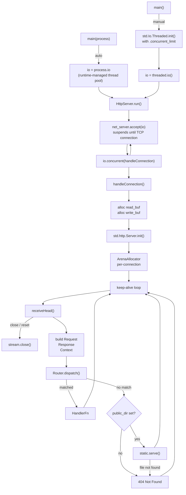
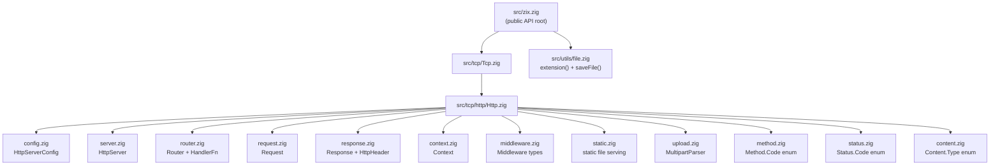
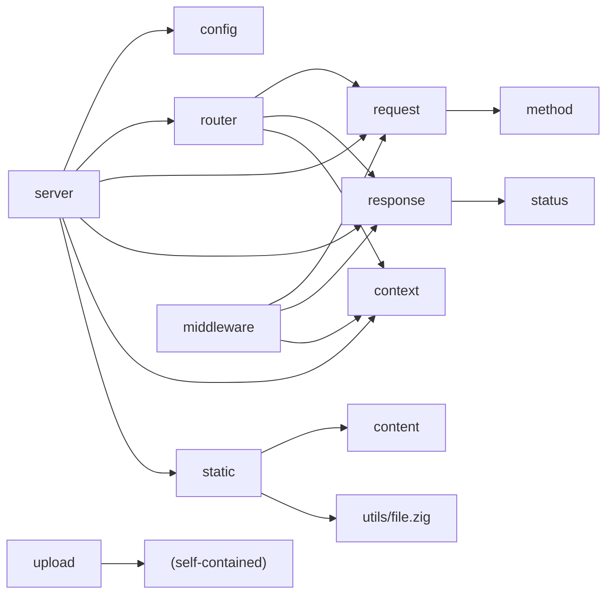
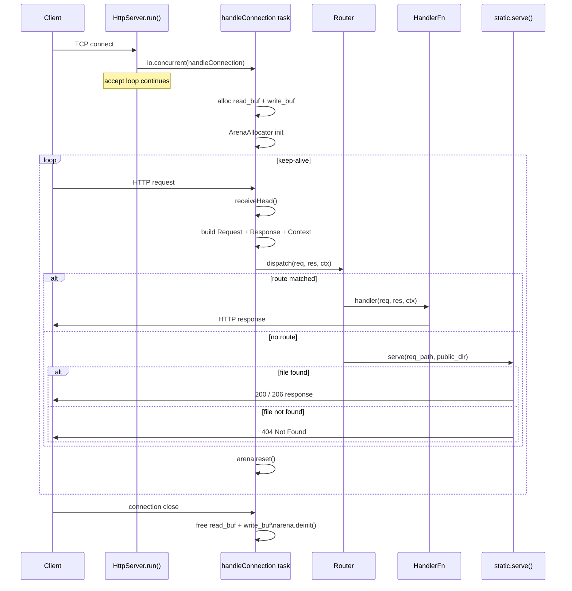
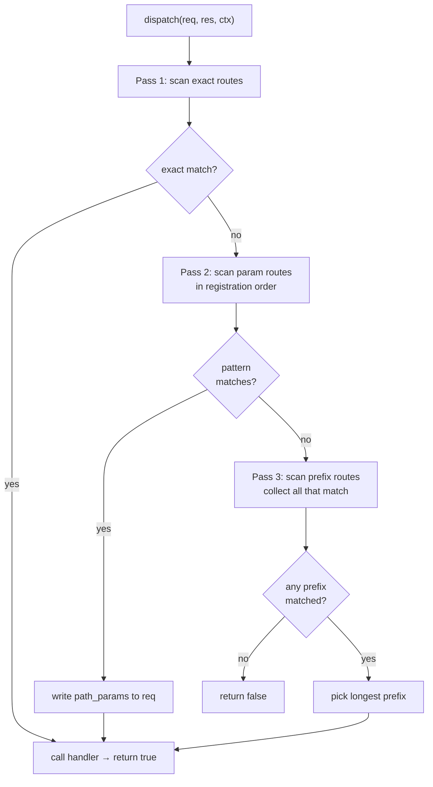
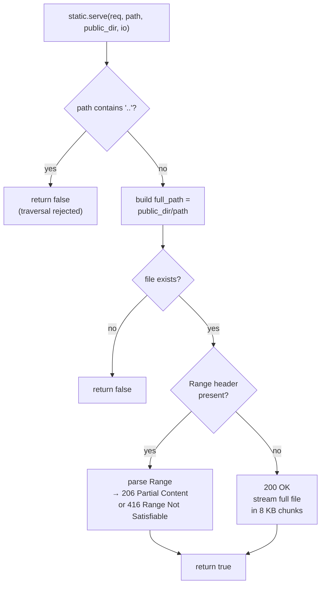
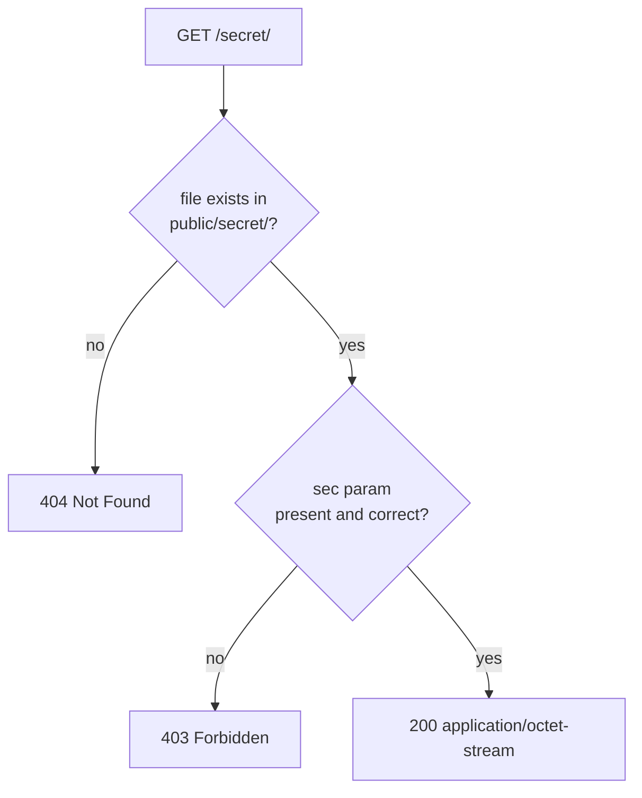
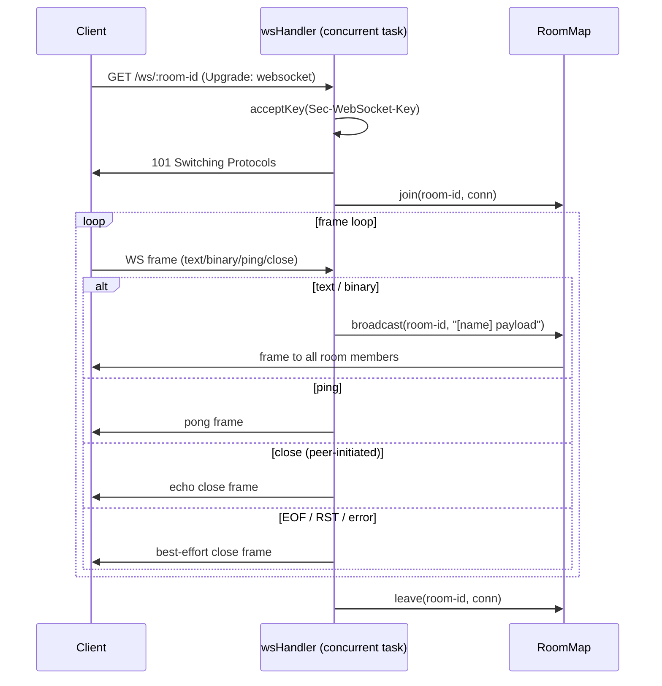
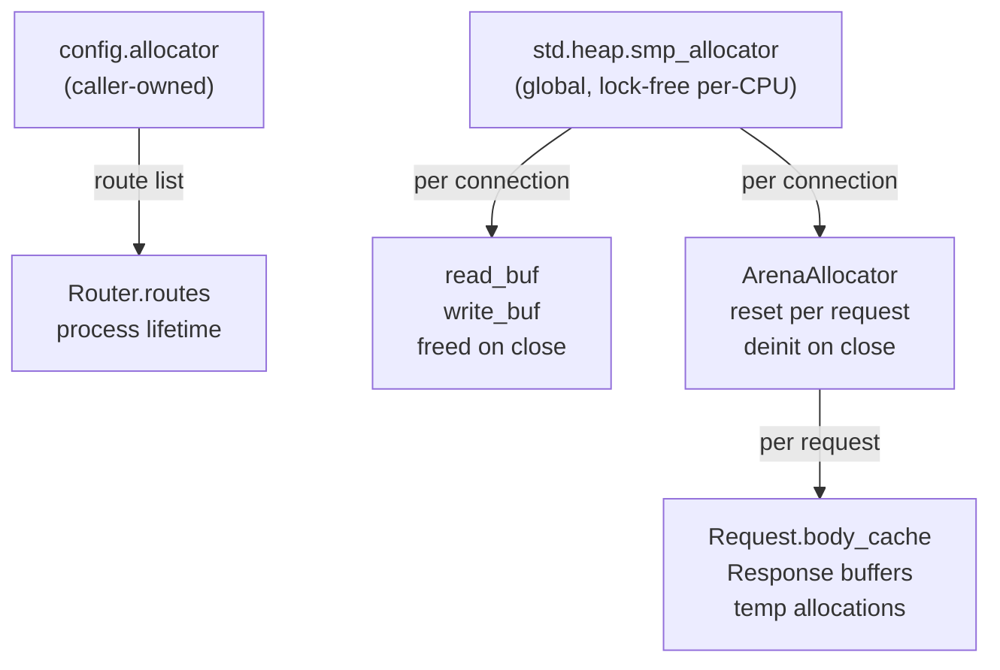

# HLD — zix

A micro net-frame-work to complement network library, built on Zig 0.16.x.

---

## Goals

- Keep-alive on by default.
- Reusable, modular, high-performance network library.
- Separation of concern: one file = one responsibility.
- Data Oriented Design — flat arrays, minimal indirection.
- Not framework-magic: explicit handler registration, no reflection.

---

## Runtime Model



Two I/O modes are supported:
- **Auto** (`main(process: std.process.Init)` — use `process.io`): the runtime manages the thread pool, concurrency defaults to CPU count − 1.
- **Manual** (`main() !void` — create `std.Io.Threaded` explicitly): caller controls `.concurrent_limit` (`.unlimited` or `std.Io.Limit.limited(n)`).

Either way, `HttpServer` receives an opaque `std.Io` value — it does not own or deinit the backend. Each accepted connection is dispatched as a concurrent task via `io.concurrent(handleConnection)`, suspending on I/O without busy-waiting.

---

## Source Layout



---

## Module Dependencies



---

## Public API  (`import("zix")`)

| Symbol | Type | Description |
| :-     | :-   | :-          |
| `HttpServerConfig` | `struct` | Server configuration (see below) |
| `HttpServer` | `struct` | Server lifecycle: init / registerHandler / registerPrefixHandler / registerParamHandler / run |
| `Request` | `struct` | Per-request reader: method, path, query, header, body |
| `Response` | `struct` | Per-request writer: send, sendJson, noContent, addHeader |
| `Context` | `struct` | Per-request context: io, allocator, stream (raw TCP — always set by server), response_sent |
| `HandlerFn` | `type` | `*const fn(*Request, *Response, *Context) anyerror!void` |
| `HttpHeader` | `struct` | `{ name: []const u8, value: []const u8 }` |
| `HttpContentType` | `enum` | Alias for `Tcp.Http.Content.Type`, type-safe MIME representation |
| `HeaderSize` | `union(enum)` | Custom response header cap: `.MINIMAL`(16) `.COMMON`(32) `.LARGE`(64) `.EXTRA_LARGE`(128) `.{ .CUSTOM = N }` — see docs/headers.md |
| `MultipartParser` | `struct` | Parse `multipart/form-data` bodies, access fields via `getField(name)` |
| `MultipartField` | `struct` | `{ name, filename, content_type, data, is_file }` |
| `utils.file.saveFile` | `fn` | Write bytes to `dir/filename`, creates directory if needed, returns arena-allocated path copy. Access as `zix.utils.file.saveFile` |
| `WebSocket` | `namespace` | Frame parsing, handshake, room broadcast — see WebSocket section |
| `WebSocket.Opcode` | `enum` | continuation text binary close ping pong |
| `WebSocket.Frame` | `struct` | `{ fin, opcode, payload }` |
| `WebSocket.Conn` | `struct` | Heap-allocated per-connection handle `{ stream, io }` |
| `WebSocket.RoomMap` | `struct` | Named room registry: init / join / leave / broadcast / deinit |
| `WebSocket.parseFrame` | `fn` | Parse one frame from a byte buffer, returns `?ParseResult` |
| `WebSocket.buildFrame` | `fn` | Serialize a server→client frame (unmasked) |
| `WebSocket.acceptKey` | `fn` | Compute `Sec-WebSocket-Accept` from `Sec-WebSocket-Key` |
| `WebSocket.upgrade` | `fn` | Write `101 Switching Protocols` directly onto `ctx.stream` |
| `Tcp.Http.Method.Code` | `enum` | GET HEAD POST PUT DELETE PATCH OPTIONS TRACE CONNECT |
| `Tcp.Http.Status.Code` | `enum` | Full HTTP 1xx–5xx status codes |
| `Tcp.Http.Content.Type` | `enum` | MIME type enum with `.asString()` |
| `Tcp.Http.Content.typeFromExtension` | `fn` | File extension → `Content.Type` enum, case-insensitive, falls back to `.APPLICATION_OCTET_STREAM` |
| `Tcp.Http.Content.fromExtension` | `fn` | File extension → MIME string (delegates to `typeFromExtension().asString()`), falls back to `application/octet-stream` |

---

## HttpServerConfig

```zig
pub const HttpServerConfig = struct {
    io:                   std.Io,           // external I/O backend (std.Io.Threaded or process.io)
    allocator:            std.mem.Allocator, // used for router's route list
    ip:                   []const u8,
    port:                 u16,
    max_kernel_backlog:   usize = 1024 * 4, // TCP listen() backlog
    max_client_request:   usize = 1024 * 4, // read buffer per connection  (heap)
    max_allocator_size:   usize = 1024 * 4, // per-connection arena backing size
    max_client_response:  usize = 1024 * 4, // write buffer per connection (heap)
    max_response_headers: HeaderSize = .COMMON, // custom header cap; arena-allocated per request to exactly this size
    public_dir:           []const u8 = "",  // static file root, "" = disabled
    public_dir_upload:    []const u8 = "u", // upload subdir under public_dir
    response_timeout_ms:  u32 = 30_000,     // reserved for future timeout enforcement
};
```

The caller owns the `io` backend and `allocator` — `HttpServer` does not call `deinit` on either.

The backing buffer is arena-allocated per request to exactly `max_response_headers.value()` slots — no fixed ceiling, no clamping. For tier selection and security guidance see [`docs/headers.md`](headers.md).

---

## Connection Lifecycle



---

## Request

Wraps `*std.http.Server.Request` + a `*std.Io.Reader` for body reading.

| Method | Returns | Notes |
| :-     | :-      | :-    |
| `method()` | `Method.Code` | Mapped from `std.http.Method` |
| `path()` | `[]const u8` | Target stripped of query string |
| `query()` | `[]const u8` | Raw query string after `?` |
| `queryParam(key)` | `?[]const u8` | Single key from query string |
| `queryParams(allocator)` | `![]QueryParam` | All query params as a slice, bare keys have `value = null` |
| `pathSegments(allocator)` | `![][]const u8` | Non-empty path segments split by `/`, `"/a/b"` → `["a","b"]` |
| `pathParam(name)` | `?[]const u8` | Named capture from a param route, `null` if name not captured |
| `header(name)` | `?[]const u8` | Case-insensitive header lookup |
| `body()` | `![]const u8` | Reads `Content-Length` bytes, cached after first call |

---

## Response

Buffers response state, writes on `send()` or equivalent.

| Method | Notes |
| :-     | :-    |
| `setStatus(Status.Code)` | Default: `.OK` |
| `setContentType(Content.Type)` | Default: `.TEXT_PLAIN` |
| `setKeepAlive(bool)` | Default: `true` |
| `addHeader(name, value)` | Up to `max_response_headers` extra headers (default 32), rejects CR/LF in name or value |
| `send(body)` | Writes full HTTP/1.1 response + flushes |
| `sendJson(body)` | Sets `content_type = "application/json"`, then `send` |
| `noContent()` | Sets status `.NO_CONTENT`, sends empty body |

Response is written to `req.server.out` (the underlying `std.Io.Writer`). The 4 KB header buffer limits combined header size, `error.BufferTooSmall` is returned if exceeded.

---

## Router

### Registration — three explicit functions

Each function communicates intent at the call site:

| Function | Pattern example | Behaviour |
| :-       | :-              | :-        |
| `registerHandler(path, h)` | `"/about"` | Exact — matches only when the full path equals `path` |
| `registerPrefixHandler(prefix, h)` | `"/api"` | Prefix — matches `prefix` and any sub-path, NOT partial segments |
| `registerParamHandler(pattern, h)` | `"/users/:id"` | Parameterized — `:name` segments are captured, literals must match exactly |

```zig
server.registerHandler("/about", aboutHandler);
server.registerPrefixHandler("/api", apiHandler);        // /api, /api/foo, /api/foo/bar — NOT /apiv2
server.registerParamHandler("/users/:id", userHandler);  // req.pathParam("id") → "alice"
server.registerParamHandler("/:tenant/:branch", branchHandler);
```

### Dispatch — priority rules

```
Pass 1 — exact routes       first exact match wins           (registration order irrelevant)
Pass 2 — param routes       first matching pattern wins      (registration order matters here)
Pass 3 — prefix routes      longest matching prefix wins     (registration order irrelevant)

exact  >  param  >  prefix (longer prefix beats shorter prefix)
```

Passes 1 and 3 are fully deterministic regardless of registration order. **Pass 2 is the exception**: when two param patterns have the same segment count and both could match the same request, the one registered first wins. Register more-literal patterns (more fixed segments) before all-param patterns of equal depth.



### Priority table

| Registered routes | Request | Winner | Reason |
| :-                | :-      | :-     | :-     |
| `/path/info` (exact) + `/path/:id` (param) + `/path` (prefix) | `/path/info` | `/path/info` | exact beats all |
| `/path/:id` (param) + `/path` (prefix) | `/path/alice` | `/path/:id` | param beats prefix |
| `/api/v2` (prefix) + `/api` (prefix) | `/api/v2/foo` | `/api/v2` | longer prefix wins |
| `/path` (prefix) | `/pathfoo` | — no match | boundary check: next char must be `/` or end |
| `/path/user/:id` (param, reg. 1st) + `/path/:a/:b` (param, reg. 2nd) | `/path/user/alice` | `/path/user/:id` | more literals registered first |
| `/path/:a/:b` (param, reg. 1st) + `/path/user/:id` (param, reg. 2nd) | `/path/user/alice` | `/path/:a/:b` | ⚠ wrong order — all-param wins unexpectedly |

### Regex-Like Matching

zix has no regex engine. Use `registerPrefixHandler` as the equivalent of `/prefix/(.*)` — it covers the prefix itself and any sub-path beneath it. Further filtering is done inside the handler with plain string operations on `req.path()`.

| Regex intent | zix equivalent |
| :- | :- |
| `/secret/(.*)` | `registerPrefixHandler("/secret", h)` — sub-path via `req.path()[len("/secret")+1..]` |
| `/files/.*\.pdf` | prefix handler on `/files`, then check `std.mem.endsWith(u8, sub, ".pdf")` in handler |
| `/v[0-9]+/.*` | prefix handler on `/v`, then `std.fmt.parseInt` on the next segment in handler |

The handler always receives the full `req.path()`, so any match logic that can be expressed as string operations can be applied — extension checks, numeric version parsing, sub-path depth limits, etc.

### Path parameters

In a handler registered with `registerParamHandler`, read captures via `req.pathParam(name)`:

```zig
pub fn userHandler(req: *zix.Request, res: *zix.Response, ctx: *zix.Context) !void {
    const id = req.pathParam("id") orelse {
        res.setStatus(.BAD_REQUEST);
        try res.sendJson("{\"error\":\"missing id\"}");
        return;
    };
    // use id ...
}
```

`req.pathParam` returns `null` if the name was not captured (e.g., the handler was reached via an exact or prefix route).

---

## Static File Serving  (`static.zig`)



- If `public_dir` is non-empty, `HttpServer.run()` validates the directory exists at startup — returns `error.PublicDirNotFound` if not. Use `std.Io.Dir.cwd().createDirPath(io, dir)` in a `createInitDirs` helper (called before `HttpServer.init`) to create required directories idempotently.
- Directory traversal (`..`) rejected.
- MIME type resolved from file extension.
- `Range` header supported → `206 Partial Content` (RFC 7233).

---

## Upload  (`upload.zig` + `utils/file.zig`)

`MultipartParser` — parses `multipart/form-data` body into `[]MultipartField`. Defined in `upload.zig`.  
`saveFile(io, allocator, dir, filename, data)` — writes bytes to `dir/filename`, creates the directory if it does not exist, returns a caller-owned copy of the full path. Defined in `utils/file.zig` (file I/O utility, not HTTP-specific).

Not wired into the server automatically, handlers call these directly.

```zig
var parser = zix.MultipartParser.init(ctx.allocator, boundary);
defer parser.deinit();
try parser.parse(try req.body());

if (parser.getField("file")) |f| {
    // you can rename file first before save by replacing the filename string, e.g.:
    //   const filename = "custom_name.txt";
    // or build it dynamically:
    //   const filename = try std.fmt.allocPrint(ctx.allocator, "{s}_{s}", .{ sessionid, f.filename orelse "upload" });
    const filename = f.filename orelse "upload";
    const path = try zix.utils.file.saveFile(ctx.io, ctx.allocator, "./public/u", filename, f.data);
    // path is arena-allocated valid for this request
}
```

---

## Access-Controlled File Serving

A prefix handler can gate files behind a required query param. The key rule: **check file existence before the param** so that the auth requirement is not revealed for paths that do not exist.



| Request | File exists | `sec=abc123` | Response |
| :- | :- | :- | :- |
| `/secret/file.txt?sec=abc123` | yes | yes | 200 |
| `/secret/file.txt` | yes | no | 403 |
| `/secret/file.txt?sec=wrong` | yes | no | 403 |
| `/secret/missing.txt?sec=abc123` | no | — | 404 |

Registration:
```zig
server.registerPrefixHandler("/secret", secretHandler);
```

The param name (`sec`) and accepted value (`abc123`) are top-level constants — swap for a header, session token, or any other mechanism without changing the handler logic.

---

## WebSocket  (`websocket.zig`)

Room-based broadcast over RFC 6455 WebSocket, implemented on top of the raw TCP stream that the HTTP server already holds.



### Context.stream

`ctx.stream` exposes the raw `std.Io.net.Stream` for the current TCP connection. The server **always** sets it before calling any handler — it is not exclusive to WebSocket routes:

```zig
// server.zig — every connection, every handler type
var ctx = Context{ .io = io, .allocator = allocator, .stream = stream };
```

- **HTTP handlers** — receive a valid `ctx.stream` and must not use it. The HTTP keep-alive loop owns the stream.
- **WebSocket handlers** — use `ctx.stream` after `WebSocket.upgrade()` hands off the connection from HTTP to the frame loop.

The `= undefined` field default in `context.zig` is never reached at runtime, it exists so the struct literal compiles when constructing `Context` manually (e.g. in tests). If you construct `Context` outside the server you should set `stream` explicitly.

### Combining HTTP, Static, and WebSocket

All three can coexist in a single `HttpServer`. Registration order does not affect routing, priority rules handle dispatch:

```zig
// Regular HTTP handlers
server.registerHandler("/", homeHandler);
server.registerPrefixHandler("/api", apiHandler);

// WebSocket upgrade handler — param route so :room-id is captured
server.registerParamHandler("/ws/:room-id", wsHandler);

// Static file serving — no handler registration, set public_dir in config.
// Any request that matches no route falls through to static.serve().
```

`/ws/lobby` is captured by the param route (param > prefix). Requests for `/style.css` find no route match and fall through to `public_dir` static serving. Exact and prefix HTTP routes resolve independently of the WebSocket param route.

### Handler pattern

```zig
// Register as a param route so :room-id is captured
server.registerParamHandler("/ws/:room-id", wsHandler);

pub fn wsHandler(req: *zix.Request, res: *zix.Response, ctx: *zix.Context) !void {
    const room_id = req.pathParam("room-id") orelse return;

    // 1. Read query params BEFORE upgrade() — they are unavailable after the handshake.
    const display_name = req.queryParam("name") orelse "anonymous";

    // 2. Extract Sec-WebSocket-Key and validate Upgrade header
    var ws_key: ?[]const u8 = null;
    var it = req.inner.iterateHeaders();
    while (it.next()) |h| {
        if (std.ascii.eqlIgnoreCase(h.name, "sec-websocket-key")) ws_key = h.value;
    }

    // 3. Handshake
    var accept_buf: [64]u8 = undefined;
    const accept = try zix.WebSocket.acceptKey(ws_key.?, &accept_buf);
    try zix.WebSocket.upgrade(ctx.stream, ctx.io, accept);

    // 4. Register connection
    const conn = try std.heap.smp_allocator.create(zix.WebSocket.Conn);
    conn.* = .{ .stream = ctx.stream, .io = ctx.io };
    defer std.heap.smp_allocator.destroy(conn);
    ws_rooms.join(room_id, conn, ctx.io);
    defer ws_rooms.leave(room_id, conn, ctx.io);  // runs before destroy (LIFO)

    // 5. Frame loop — read (single-syscall), dispatch, compact
    _ = display_name; // used in broadcast prefix: "[display_name] payload"
    // ...
}
```

### RoomMap lifecycle

| Call | When |
| :- | :- |
| `RoomMap.init(smp_allocator)` | once in `main()` before `server.run()` |
| `join(room, conn, io)` | at the start of each WS handler |
| `leave(room, conn, io)` | deferred immediately after join |
| `broadcast(room, msg, io)` | on each text/binary frame |
| `RoomMap.deinit()` | process shutdown (deferred in main) |

### Frame read loop

```
1. Writer.fixed(frame_buf[buf_used..]) + reader.stream(&tw, .unlimited)
       — one readv syscall, returns immediately with whatever arrived
2. parseFrame(accumulated, &payload_buf)
       — returns ParseResult or null (incomplete frame, loop again)
3. dispatch on opcode:
       text / binary  → broadcast "[name] payload" to room
       ping           → pong frame back to sender
       close          → echo close frame, set clean_close=true, break
4. compact buffer (memmove unprocessed bytes to front)
5. on loop exit without clean_close (EOF / RST / error):
       best-effort close frame sent so peer is notified
```

Dead connections (write failure in broadcast) are silently skipped, they are cleaned up when their own handler's `leave` defer fires.

---

## Middleware  (`middleware.zig`)

The `Middleware` type and `NextFn` are defined. The server has no built-in chain runner — middleware is composed at comptime using wrapper functions that return a `HandlerFn`. This avoids heap allocation and keeps each middleware as a plain, inspectable function.

```zig
pub const NextFn     = *const fn (*Request, *Response, *Context) anyerror!void;
pub const Middleware = struct {
    name:   []const u8,
    handle: *const fn (*Request, *Response, *Context, NextFn) anyerror!void,
};
```

### Comptime wrapper pattern

```zig
fn withOriginCheck(comptime next: zix.HandlerFn) zix.HandlerFn {
    return struct {
        fn handle(req: *zix.Request, res: *zix.Response, ctx: *zix.Context) anyerror!void {
            const origin = req.header("origin") orelse "";
            if (!isAllowedOrigin(origin)) {
                res.setStatus(.FORBIDDEN);
                try res.sendJson("{\"error\":\"forbidden origin\"}");
                return; // short-circuit — next is not called
            }
            return next(req, res, ctx);
        }
    }.handle;
}

fn withBasicAuth(comptime next: zix.HandlerFn) zix.HandlerFn {
    return struct {
        fn handle(req: *zix.Request, res: *zix.Response, ctx: *zix.Context) anyerror!void {
            // validate Authorization: Basic <base64(user:pass)>
            // ...
            return next(req, res, ctx);
        }
    }.handle;
}
```

Compose left-to-right — the outermost wrapper runs first:

```zig
// origin check only
server.registerHandler("/public",  withOriginCheck(publicHandler));

// origin check → basic auth → handler
server.registerHandler("/private", withOriginCheck(withBasicAuth(privateHandler)));
```

Each unique `next` value generates a distinct wrapper function at comptime, no runtime closure or heap allocation is needed. See `examples/server_middleware.zig` for a full working example.

---

## Memory Model



| Scope | Allocator | Lifetime |
| :-    | :-        | :-       |
| Router route list | `config.allocator` | Process lifetime |
| Read/write I/O buffers | `smp_allocator` | Connection lifetime |
| Per-request allocations | Per-connection `ArenaAllocator` (reset each request) | Request lifetime |
| WebSocket `Conn` + room list entries | `smp_allocator` | WS session lifetime |

---

## Not Yet Implemented

| Feature | Location |
| :-      | :-       |
| Middleware chain runner | `middleware.zig` |
| Response timeout enforcement | `config.response_timeout_ms` reserved |
| UDP support | `src/udp/` (reserved) |
| HTTP/2 / TLS | out of scope |

---

## Performance Reference

Current `HttpServer` uses the `io.concurrent` pattern. See `rnd/server_model_1.zig`

<br>

---

###### end of HLD
