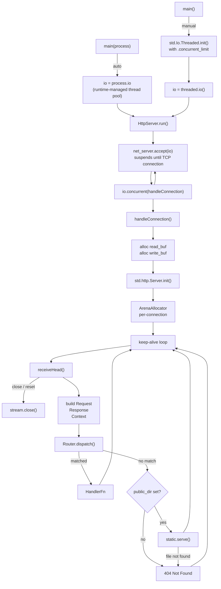
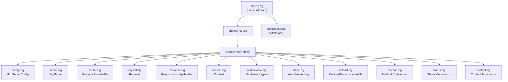
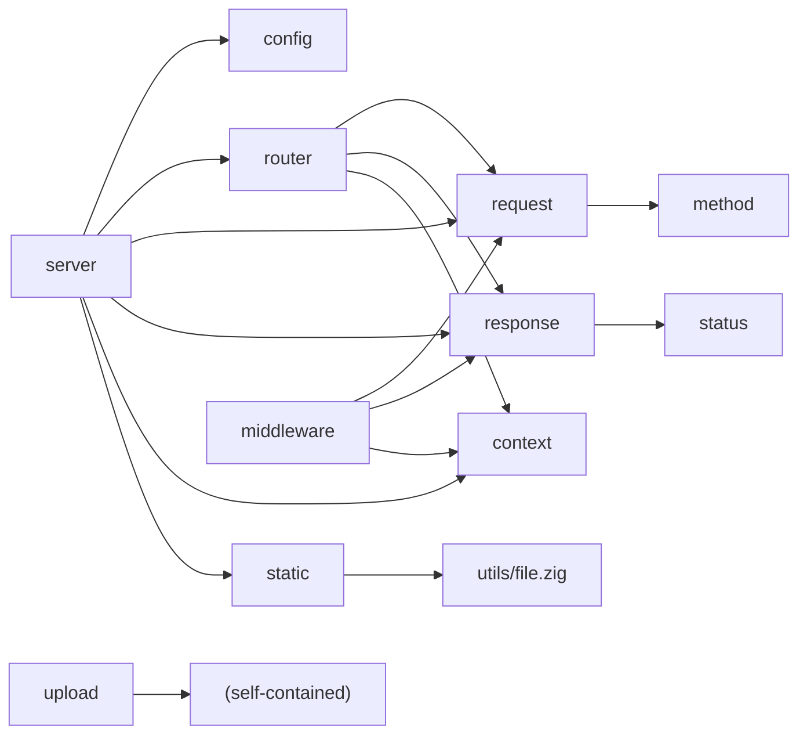
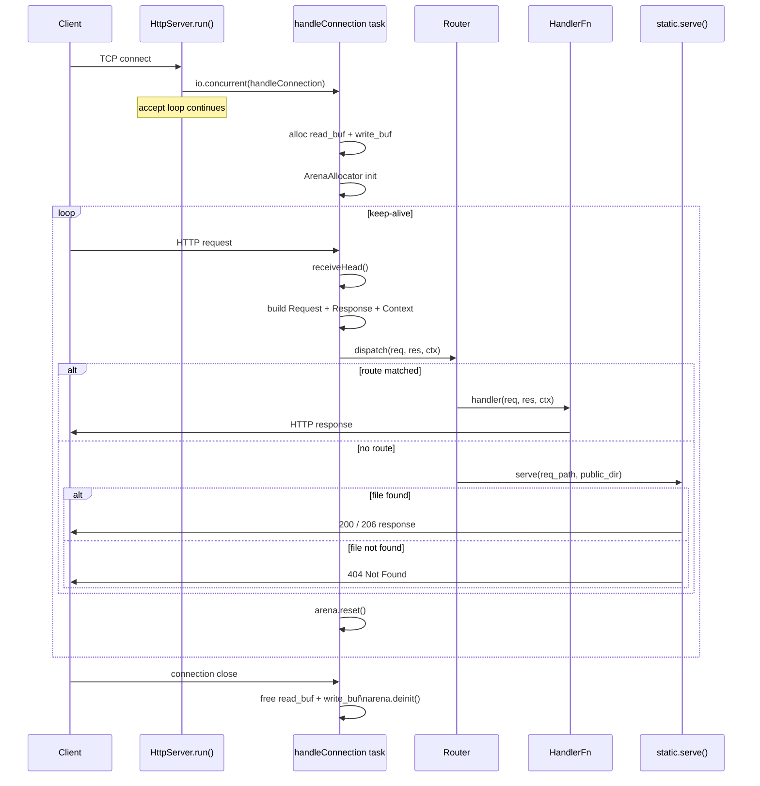
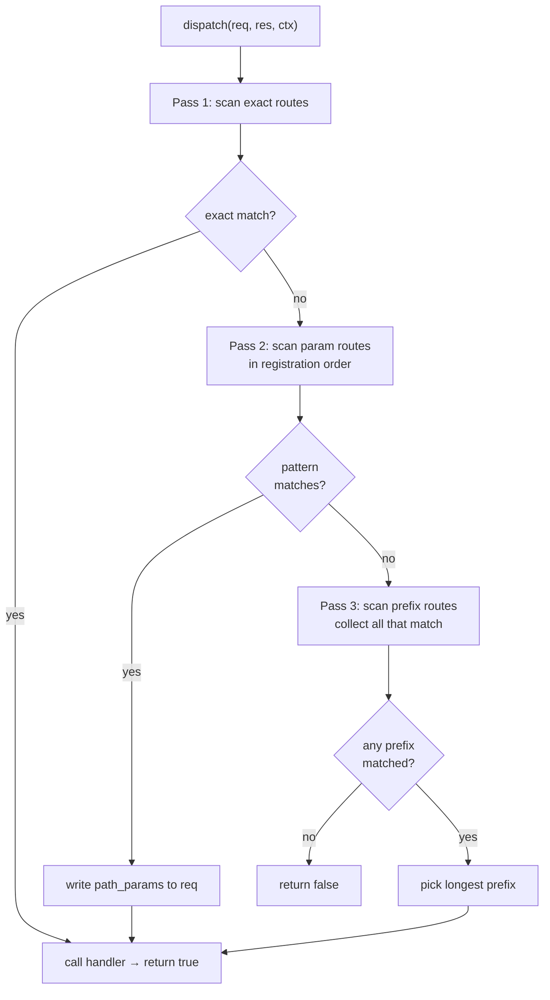
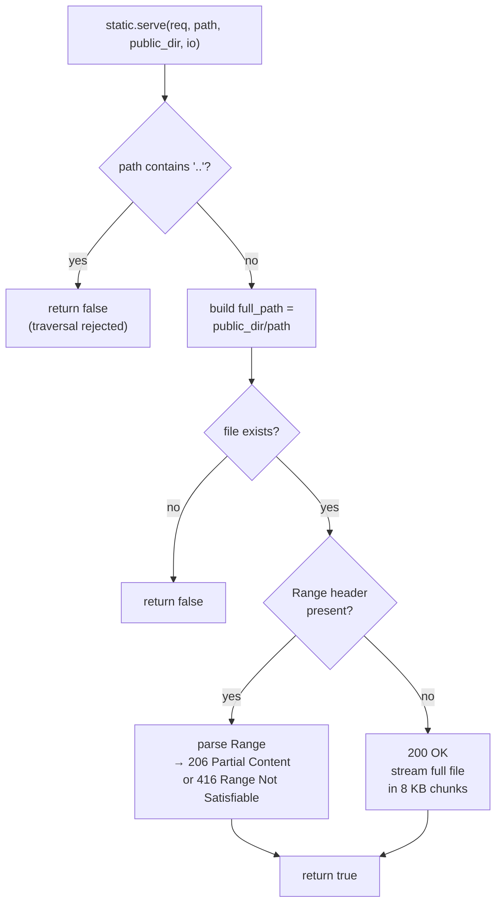
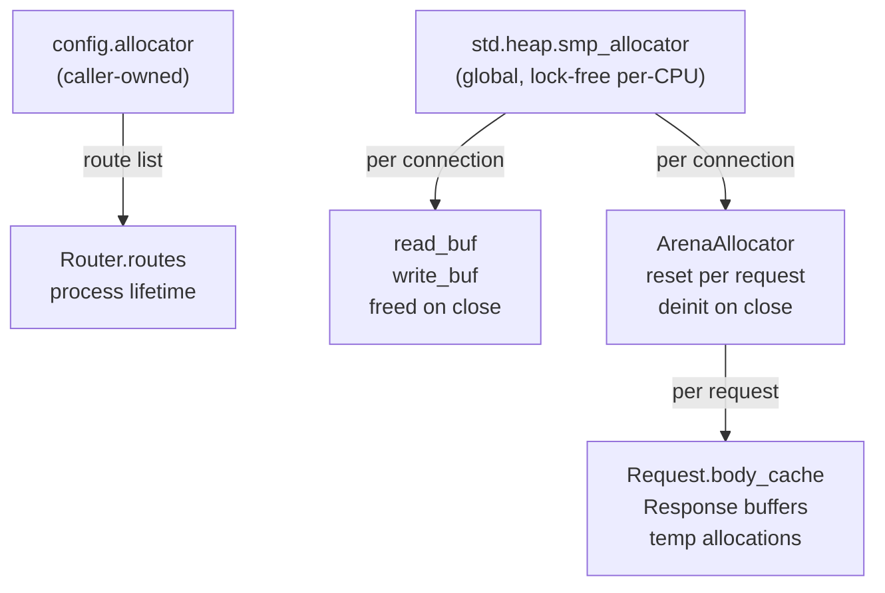

# HLD — zix

A micro net-frame-work to complement network library, built on Zig 0.16.x.

---

## Goals

- Keep-alive on by default.
- Reusable, modular, high-performance network library.
- Separation of concern: one file = one responsibility.
- Data Oriented Design — flat arrays, minimal indirection.
- Not framework-magic: explicit handler registration, no reflection.

---

## Runtime Model



Two I/O modes are supported:
- **Auto** (`main(process: std.process.Init)` — use `process.io`): the runtime manages the thread pool; concurrency defaults to CPU count − 1.
- **Manual** (`main() !void` — create `std.Io.Threaded` explicitly): caller controls `.concurrent_limit` (`.unlimited` or `std.Io.Limit.limited(n)`).

Either way, `HttpServer` receives an opaque `std.Io` value — it does not own or deinit the backend. Each accepted connection is dispatched as a concurrent task via `io.concurrent(handleConnection)`, suspending on I/O without busy-waiting.

---

## Source Layout



---

## Module Dependencies



---

## Public API  (`import("zix")`)

| Symbol | Type | Description |
| :-     | :-   | :-          |
| `HttpServerConfig` | `struct` | Server configuration (see below) |
| `HttpServer` | `struct` | Server lifecycle: init / registerHandler / registerPrefixHandler / registerParamHandler / run |
| `Request` | `struct` | Per-request reader: method, path, query, header, body |
| `Response` | `struct` | Per-request writer: send, sendJson, noContent, addHeader |
| `Context` | `struct` | Per-request context: io, allocator, response_sent |
| `HandlerFn` | `type` | `*const fn(*Request, *Response, *Context) anyerror!void` |
| `HttpHeader` | `struct` | `{ name: []const u8, value: []const u8 }` |
| `Tcp.Http.Method.Code` | `enum` | GET HEAD POST PUT DELETE PATCH OPTIONS TRACE CONNECT |
| `Tcp.Http.Status.Code` | `enum` | Full HTTP 1xx–5xx status codes |
| `Tcp.Http.Content.Type` | `enum` | MIME type enum with `.asString()` |

---

## HttpServerConfig

```zig
pub const HttpServerConfig = struct {
    io:                   std.Io,           // external I/O backend (std.Io.Threaded or process.io)
    allocator:            std.mem.Allocator, // used for router's route list
    ip:                   []const u8,
    port:                 u16,
    max_kernel_backlog:   usize = 1024 * 4, // TCP listen() backlog
    max_client_request:   usize = 1024 * 4, // read buffer per connection  (heap)
    max_allocator_size:   usize = 1024 * 4, // per-connection arena backing size
    max_client_response:  usize = 1024 * 4, // write buffer per connection (heap)
    public_dir:           []const u8 = "",  // static file root; "" = disabled
    public_dir_upload:    []const u8 = "u", // upload subdir under public_dir
    response_timeout_ms:  u32 = 30_000,     // reserved for future timeout enforcement
};
```

The caller owns the `io` backend and `allocator` — `HttpServer` does not call `deinit` on either.

---

## Connection Lifecycle



---

## Request

Wraps `*std.http.Server.Request` + a `*std.Io.Reader` for body reading.

| Method | Returns | Notes |
| :-     | :-      | :-    |
| `method()` | `Method.Code` | Mapped from `std.http.Method` |
| `path()` | `[]const u8` | Target stripped of query string |
| `query()` | `[]const u8` | Raw query string after `?` |
| `queryParam(key)` | `?[]const u8` | Single key from query string |
| `queryParams(allocator)` | `![]QueryParam` | All query params as a slice; bare keys have `value = null` |
| `pathSegments(allocator)` | `![][]const u8` | Non-empty path segments split by `/`; `"/a/b"` → `["a","b"]` |
| `pathParam(name)` | `?[]const u8` | Named capture from a param route; `null` if name not captured |
| `header(name)` | `?[]const u8` | Case-insensitive header lookup |
| `body()` | `![]const u8` | Reads `Content-Length` bytes; cached after first call |

---

## Response

Buffers response state; writes on `send()` or equivalent.

| Method | Notes |
| :-     | :-    |
| `setStatus(Status.Code)` | Default: `.OK` |
| `setContentType([]const u8)` | Default: `"text/plain"` |
| `setKeepAlive(bool)` | Default: `true` |
| `addHeader(name, value)` | Up to 32 extra headers |
| `send(body)` | Writes full HTTP/1.1 response + flushes |
| `sendJson(body)` | Sets `content_type = "application/json"`, then `send` |
| `noContent()` | Sets status `.NO_CONTENT`, sends empty body |

Response is written to `req.server.out` (the underlying `std.Io.Writer`). The 4 KB header buffer limits combined header size; `error.BufferTooSmall` is returned if exceeded.

---

## Router

### Registration — three explicit functions

Each function communicates intent at the call site:

| Function | Pattern example | Behaviour |
| :-       | :-              | :-        |
| `registerHandler(path, h)` | `"/about"` | Exact — matches only when the full path equals `path` |
| `registerPrefixHandler(prefix, h)` | `"/api"` | Prefix — matches `prefix` and any sub-path; NOT partial segments |
| `registerParamHandler(pattern, h)` | `"/users/:id"` | Parameterized — `:name` segments are captured; literals must match exactly |

```zig
server.registerHandler("/about", aboutHandler);
server.registerPrefixHandler("/api", apiHandler);        // /api, /api/foo, /api/foo/bar — NOT /apiv2
server.registerParamHandler("/users/:id", userHandler);  // req.pathParam("id") → "alice"
server.registerParamHandler("/:tenant/:branch", branchHandler);
```

### Dispatch — priority rules

```
Pass 1 — exact routes       first exact match wins           (registration order irrelevant)
Pass 2 — param routes       first matching pattern wins      (registration order matters here)
Pass 3 — prefix routes      longest matching prefix wins     (registration order irrelevant)

exact  >  param  >  prefix (longer prefix beats shorter prefix)
```

Passes 1 and 3 are fully deterministic regardless of registration order. **Pass 2 is the exception**: when two param patterns have the same segment count and both could match the same request, the one registered first wins. Register more-literal patterns (more fixed segments) before all-param patterns of equal depth.



### Priority table

| Registered routes | Request | Winner | Reason |
|---|---|---|---|
| `/path/info` (exact) + `/path/:id` (param) + `/path` (prefix) | `/path/info` | `/path/info` | exact beats all |
| `/path/:id` (param) + `/path` (prefix) | `/path/alice` | `/path/:id` | param beats prefix |
| `/api/v2` (prefix) + `/api` (prefix) | `/api/v2/foo` | `/api/v2` | longer prefix wins |
| `/path` (prefix) | `/pathfoo` | — no match | boundary check: next char must be `/` or end |
| `/path/user/:id` (param, reg. 1st) + `/path/:a/:b` (param, reg. 2nd) | `/path/user/alice` | `/path/user/:id` | more literals registered first |
| `/path/:a/:b` (param, reg. 1st) + `/path/user/:id` (param, reg. 2nd) | `/path/user/alice` | `/path/:a/:b` | ⚠ wrong order — all-param wins unexpectedly |

### Path parameters

In a handler registered with `registerParamHandler`, read captures via `req.pathParam(name)`:

```zig
pub fn userHandler(req: *zix.Request, res: *zix.Response, ctx: *zix.Context) !void {
    const id = req.pathParam("id") orelse {
        res.setStatus(.BAD_REQUEST);
        try res.sendJson("{\"error\":\"missing id\"}");
        return;
    };
    // use id ...
}
```

`req.pathParam` returns `null` if the name was not captured (e.g., the handler was reached via an exact or prefix route).

---

## Static File Serving  (`static.zig`)



- Directory traversal (`..`) rejected.
- MIME type resolved from file extension.
- `Range` header supported → `206 Partial Content` (RFC 7233).

---

## Upload  (`upload.zig`)

`MultipartParser` — parses `multipart/form-data` body into `[]MultipartField`.  
`saveFile(io, dir, filename, data)` — writes a field's data to `dir/filename`.

Not wired into the server automatically; handlers call these directly.

---

## Middleware  (`middleware.zig`)

Types defined, chain runner not yet implemented.

```zig
pub const NextFn    = *const fn (*Request, *Response, *Context) anyerror!void;
pub const Middleware = struct {
    name:   []const u8,
    handle: *const fn (*Request, *Response, *Context, NextFn) anyerror!void,
};
```

---

## Memory Model



| Scope | Allocator | Lifetime |
|-------|-----------|----------|
| Router route list | `config.allocator` | Process lifetime |
| Read/write I/O buffers | `smp_allocator` | Connection lifetime |
| Per-request allocations | Per-connection `ArenaAllocator` (reset each request) | Request lifetime |
| WebSocket rooms (future) | `smp_allocator` | Connection lifetime |

---

## Not Yet Implemented

| Feature | Location |
|---------|----------|
| Middleware chain runner | `middleware.zig` |
| WebSocket upgrade + room broadcast | `websocket.zig` (planned) |
| Response timeout enforcement | `config.response_timeout_ms` reserved |
| UDP support | `src/udp/` (reserved) |
| HTTP/2 / TLS | out of scope |

---

## Performance Reference  (from `rnd/`)

Current `HttpServer` uses the `io.concurrent` pattern.

<br>

---

###### end of HLD
