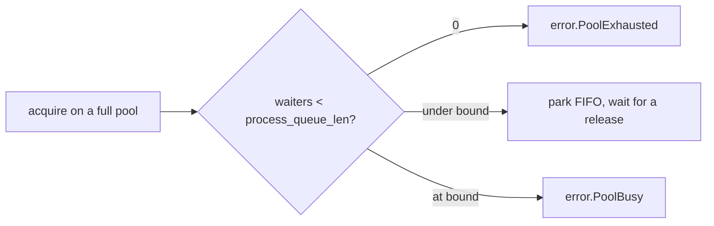

# postgrez Config Reference

What every `postgrez.Config` field means, and how changing it affects a running process. One flat config is shared by `Conn`, `Pool`, and `Executor`: the connection reads the top group, the pool and executor add the rest. Each field lists its default, what it controls, and the tuning trade-offs. A deeper section at the end works the arithmetic behind the two load-bearing knobs, `max_pending_replies` and `process_queue_len`.

## How to read the columns

A cell is left blank when it does not apply (a required handle has no tuning trade-off).

| column | meaning |
| :- | :- |
| field | the config struct field name |
| default | the value used when the field is omitted |
| controls | what the field does |
| perf impact | where it sits (hot path, per-conn, pool, startup) and which metric it moves |
| how to tweak | direction of change for a goal |
| if lower | consequence of a smaller value |
| if higher | consequence of a larger value |
| knob consequence | the main risk if it is misconfigured |

## Config (`postgrez.Config`)

| field | default | controls | perf impact | how to tweak | if lower | if higher | knob consequence |
| :- | :- | :- | :- | :- | :- | :- | :- |
| ip | `127.0.0.1` | server host, IP literal or hostname | startup (a hostname adds a lookup) | set the database host | | | a hostname goes through the hosts and DNS lookup |
| port | `5432` | server port | | set the database port | | | |
| user | required | role name | | set the login role | | | the connect fails without it |
| password | `""` | role password | | set for password, SCRAM, or SCRAM-PLUS auth | | | empty only works with trust auth |
| database | null | database name | | set the target database | | | null uses the user name as the database |
| application_name | `postgrez` | value reported to the server (pg_stat_activity) | startup only | set to label the connection | | | cosmetic, aids server-side observability |
| conn_timeout_ms | `10000` | connect plus startup bound in ms, 0 disables | startup latency guard | lower to fail fast on an unreachable host | connect gives up sooner | a dead host blocks longer | 0 waits indefinitely on a black-hole host |
| protocol_version | `.AUTO` | startup protocol selector | startup | leave `.AUTO` | | | `.AUTO` negotiates 3.2 with a 3.0 fallback |
| tls | `.OFF` | TLS behavior: `.OFF`, `.PREFER`, `.REQUIRE` | a separate perf band (handshake plus per-record AEAD) | `.REQUIRE` over an untrusted network | | | `.PREFER` continues cleartext when refused, `.REQUIRE` fails |
| dispatch_model | `.ASYNC` | transport that multiplexes socket I/O: `.ASYNC` (Executor), `.EPOLL`, `.URING` | picks the execution model, not a hot-path knob | leave `.ASYNC` for the pooled Executor, pick `.EPOLL` or `.URING` for the single-thread multiplexed transport | | | `.EPOLL` and `.URING` are cleartext only, so keep tls = `.OFF` for them |
| max_pending_replies | `16` | replies one connection may owe (pipeline and `sendRows` batch bound), 0 = no bound | hot: batch depth per round trip | match to the batch you pipeline (see the sizing section) | shallower batches, more round trips | a stalled server grows the send buffer | 0 removes the shed, an unbounded producer can grow memory |
| process_queue_len | `0` | pool only: parked-acquire bound, 0 = no parking | acquire behavior under a full pool | set to worker count plus a margin (see the sizing section) | acquire sheds instead of parking | more threads park (block) instead of shedding | 0 sheds `error.PoolExhausted` at once, beyond the bound sheds `error.PoolBusy` |
| pool_size | `6` | pool only: connections per pool | throughput is roughly `pool_size / round_trip` | raise for more concurrent queries (see the sizing section) | queries queue on the pool | more server backends and memory | each connection is one server backend, stay under the server `max_connections` |
| retry_max | `3` | pool only: connect attempts per acquire beyond the first | acquire latency on a flaky connect | raise for a flaky network | acquire gives up on connect sooner | acquire retries longer before failing | total attempts is `retry_max + 1` |
| retry_delay_ms | `250` | pool only: delay between connect retries | acquire latency during retries | lower for faster retry, raise to back off | tighter retry loop | slower recovery, gentler on the server | the delay applies between attempts, not before the first |

## Sizing max_pending_replies and process_queue_len

These two knobs decide how much work is in flight at once. The rest of this section is the arithmetic behind their defaults and how to pick better values for a workload.

### The base rate of one connection

A synchronous connection does one query per round trip: send the request, wait, read the reply. Its ceiling is:

```
queries_per_second_per_connection = 1 / round_trip_latency
```

At a 0.3 ms round trip that is about 3,300 queries per second on one connection. To go faster you must put more than one operation in flight, and Little's law says how much:

```
in_flight = arrival_rate x latency
```

To sustain `N` queries per second at latency `L`, you need `N x L` operations in flight. There are two ways to get there, and the two knobs map to them.

### max_pending_replies: more in flight on one connection

Pipelining puts several executions on one connection behind a single Sync. Without it, `K` queries cost `K` round trips and about `2K` socket syscalls (a send and a receive each). Pipelined at depth `K`:

```
syscalls  : about 2K   ->  about 2   (one send of all K, one Sync plus one receive burst)
wall time : K x round_trip  ->  round_trip + K x server_exec
```

The round-trip cost is paid once for the whole batch instead of once per query. `max_pending_replies` is the depth bound: `sendRows` past the bound sheds `error.QueueFull` so a runaway producer cannot grow the send buffer without limit.

- Set it to the batch depth you actually pipeline. The default 16 matches the `Executor` `batch_max`.
- Too low serializes the batch into more round trips.
- Too high lets a stalled server buffer an unbounded number of queued Bind and Execute messages, which is memory growth.
- 0 removes the bound entirely: only do this when the producer is self-limiting.

### process_queue_len: what happens when the pool is full

`process_queue_len` bounds how many `acquire` callers may park (block) on a fully-held pool:



- 0 means no parking: a full pool sheds `error.PoolExhausted` immediately. Choose this when you want backpressure to reach the caller at once.
- `N` parks up to `N` acquires FIFO and hands each released connection directly to the oldest waiter. Beyond `N`, acquire sheds `error.PoolBusy`. Choose this when a brief stall should wait rather than fail.
- Rule of thumb: the worker count plus a small margin, so a transient stall parks and a real overload still sheds. The `Executor` sets it to `workers + 64` (the margin covers the `runInline` path).

### pool_size: how many connections

Each pooled connection is one server-side backend, so the total `pool_size` across every client must stay under the server `max_connections`. When queries are independent, the pool throughput ceiling is:

```
pool_throughput = pool_size / round_trip_latency
```

Widen the pool to raise the ceiling, up to the point where the server or the CPU is the limit rather than the connection count.

### Putting it together

The two levers are complementary: pipeline to amortize the round trip on one connection (`max_pending_replies`), widen the pool to run more connections in parallel (`pool_size`), and bound the overflow (`process_queue_len`). The `Executor` does both at once: it auto-sizes the worker count to `min(cpu_count x 8, hint / 2)` floored at 16 and capped at 128, sets `pool_size` to the worker count, pipelines each batch up to `max_pending_replies`, and bounds parked acquires with `process_queue_len`.

## Notes

- Required fields (`user`) have no default and must be set.
- `max_pending_replies` applies per connection, to both the `Pipeline` and the `sendRows` batch API.
- `process_queue_len`, `pool_size`, `retry_max`, and `retry_delay_ms` matter only for `Pool` (and therefore `Executor`), a bare `Conn` ignores them.
- The `Executor` overrides `pool_size` and `process_queue_len` from its computed worker count, the rest of the config is the caller's.
