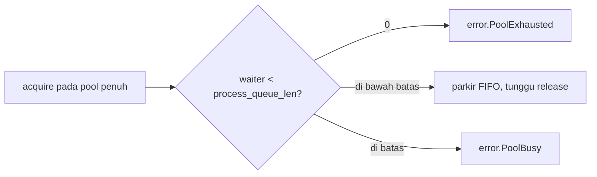

# Rujukan Config postgrez

Arti tiap field `postgrez.Config`, dan bagaimana mengubahnya memengaruhi proses yang berjalan. Satu config flat dipakai bersama oleh `Conn`, `Pool`, dan `Executor`: koneksi membaca grup atas, pool dan executor memakai sisanya. Tiap field mencantumkan default-nya, apa yang dikendalikannya, dan trade-off penyetelannya. Bagian lebih dalam di akhir mengerjakan aritmetika di balik dua knob paling menentukan, `max_pending_replies` dan `process_queue_len`.

## Cara membaca kolom

Sel dikosongkan bila tidak berlaku (handle wajib tidak punya trade-off penyetelan).

| kolom | arti |
| :- | :- |
| field | nama field struct config |
| default | nilai yang dipakai saat field dihilangkan |
| controls | apa yang dilakukan field |
| perf impact | di mana ia berada (hot path, per-conn, pool, startup) dan metrik apa yang digesernya |
| how to tweak | arah perubahan untuk sebuah tujuan |
| if lower | konsekuensi nilai lebih kecil |
| if higher | konsekuensi nilai lebih besar |
| knob consequence | risiko utama bila salah setel |

## Config (`postgrez.Config`)

| field | default | controls | perf impact | how to tweak | if lower | if higher | knob consequence |
| :- | :- | :- | :- | :- | :- | :- | :- |
| ip | `127.0.0.1` | host server, IP literal atau hostname | startup (hostname menambah lookup) | setel host database | | | hostname melewati lookup hosts dan DNS |
| port | `5432` | port server | | setel port database | | | |
| user | wajib | nama role | | setel role login | | | connect gagal tanpa ini |
| password | `""` | password role | | setel untuk auth password, SCRAM, atau SCRAM-PLUS | | | kosong hanya jalan dengan trust auth |
| database | null | nama database | | setel database target | | | null memakai nama user sebagai database |
| application_name | `postgrez` | nilai yang dilaporkan ke server (pg_stat_activity) | startup saja | setel untuk melabeli koneksi | | | kosmetik, membantu observability sisi server |
| conn_timeout_ms | `10000` | batas connect plus startup dalam ms, 0 menonaktifkan | penjaga latency startup | turunkan agar gagal cepat pada host tak terjangkau | connect menyerah lebih cepat | host mati memblokir lebih lama | 0 menunggu tanpa batas pada host black-hole |
| protocol_version | `.AUTO` | pemilih protocol startup | startup | biarkan `.AUTO` | | | `.AUTO` menegosiasi 3.2 dengan fallback 3.0 |
| tls | `.OFF` | perilaku TLS: `.OFF`, `.PREFER`, `.REQUIRE` | band perf terpisah (handshake plus AEAD per record) | `.REQUIRE` di jaringan tak tepercaya | | | `.PREFER` lanjut cleartext saat ditolak, `.REQUIRE` gagal |
| dispatch_model | `.ASYNC` | transport yang me-multiplex I/O socket: `.ASYNC` (Executor), `.EPOLL`, `.URING` | memilih execution model, bukan knob hot path | biarkan `.ASYNC` untuk Executor ber-pool, pilih `.EPOLL` atau `.URING` untuk transport multiplexed satu thread | | | `.EPOLL` dan `.URING` cleartext saja, jadi jaga tls = `.OFF` untuk keduanya |
| max_pending_replies | `16` | reply yang boleh tertunggak satu koneksi (batas pipeline dan batch `sendRows`), 0 = tanpa batas | hot: kedalaman batch per round trip | cocokkan ke batch yang Anda pipeline (lihat bagian sizing) | batch lebih dangkal, lebih banyak round trip | server yang macet menumbuhkan send buffer | 0 menghapus shed, producer tanpa batas bisa menumbuhkan memori |
| process_queue_len | `0` | pool saja: batas acquire yang parkir, 0 = tanpa parkir | perilaku acquire saat pool penuh | setel ke jumlah worker plus margin (lihat bagian sizing) | acquire shed alih-alih parkir | lebih banyak thread parkir (blokir) alih-alih shed | 0 shed `error.PoolExhausted` seketika, melewati batas shed `error.PoolBusy` |
| pool_size | `6` | pool saja: jumlah koneksi per pool | throughput kira-kira `pool_size / round_trip` | naikkan untuk lebih banyak query bersamaan (lihat bagian sizing) | query mengantre di pool | lebih banyak backend server dan memori | tiap koneksi adalah satu backend server, tetap di bawah `max_connections` server |
| retry_max | `3` | pool saja: percobaan connect per acquire di luar yang pertama | latency acquire pada connect yang labil | naikkan untuk jaringan labil | acquire menyerah connect lebih cepat | acquire retry lebih lama sebelum gagal | total percobaan adalah `retry_max + 1` |
| retry_delay_ms | `250` | pool saja: jeda antar retry connect | latency acquire selama retry | turunkan untuk retry lebih cepat, naikkan untuk back off | loop retry lebih rapat | pemulihan lebih lambat, lebih lembut ke server | jeda berlaku antar percobaan, bukan sebelum yang pertama |

## Menyetel max_pending_replies dan process_queue_len

Dua knob ini menentukan seberapa banyak kerja yang in-flight sekaligus. Sisa bagian ini adalah aritmetika di balik default-nya dan cara memilih nilai yang lebih baik untuk sebuah workload.

### Laju dasar satu koneksi

Koneksi sinkron melakukan satu query per round trip: kirim request, tunggu, baca reply. Batas atasnya:

```
queries_per_second_per_connection = 1 / round_trip_latency
```

Pada round trip 0.3 ms itu sekitar 3.300 query per detik pada satu koneksi. Untuk lebih cepat Anda harus menaruh lebih dari satu operasi in-flight, dan Little's law menyatakan berapa banyak:

```
in_flight = arrival_rate x latency
```

Untuk menopang `N` query per detik pada latency `L`, Anda butuh `N x L` operasi in-flight. Ada dua cara mencapainya, dan kedua knob memetakannya.

### max_pending_replies: lebih banyak in-flight pada satu koneksi

Pipelining menaruh beberapa eksekusi pada satu koneksi di belakang satu Sync. Tanpa itu, `K` query berbiaya `K` round trip dan sekitar `2K` syscall socket (satu send dan satu receive tiap query). Di-pipeline pada kedalaman `K`:

```
syscall   : sekitar 2K   ->  sekitar 2   (satu send seluruh K, satu Sync plus satu burst receive)
wall time : K x round_trip  ->  round_trip + K x server_exec
```

Biaya round trip dibayar sekali untuk seluruh batch alih-alih sekali per query. `max_pending_replies` adalah batas kedalaman: `sendRows` melewati batas shed `error.QueueFull` sehingga producer liar tak bisa menumbuhkan send buffer tanpa batas.

- Setel ke kedalaman batch yang benar-benar Anda pipeline. Default 16 cocok dengan `batch_max` `Executor`.
- Terlalu rendah men-serialize batch menjadi lebih banyak round trip.
- Terlalu tinggi membiarkan server yang macet mem-buffer sejumlah Bind dan Execute tanpa batas, itu pertumbuhan memori.
- 0 menghapus batas sepenuhnya: lakukan hanya bila producer membatasi diri.

### process_queue_len: apa yang terjadi saat pool penuh

`process_queue_len` membatasi berapa banyak pemanggil `acquire` yang boleh parkir (blokir) pada pool yang penuh dipegang:



- 0 berarti tanpa parkir: pool penuh shed `error.PoolExhausted` seketika. Pilih ini saat Anda ingin backpressure langsung sampai ke pemanggil.
- `N` memarkir hingga `N` acquire FIFO dan menyerahkan tiap koneksi yang di-release langsung ke waiter tertua. Melewati `N`, acquire shed `error.PoolBusy`. Pilih ini saat macet sesaat sebaiknya menunggu bukan gagal.
- Aturan praktis: jumlah worker plus margin kecil, jadi macet sesaat parkir dan overload sungguhan tetap shed. `Executor` menyetelnya ke `workers + 64` (margin menutupi jalur `runInline`).

### pool_size: berapa koneksi

Tiap koneksi pool adalah satu backend sisi server, jadi total `pool_size` di seluruh client harus tetap di bawah `max_connections` server. Ketika query independen, batas atas throughput pool adalah:

```
pool_throughput = pool_size / round_trip_latency
```

Lebarkan pool untuk menaikkan batasnya, hingga titik di mana server atau CPU yang jadi batas alih-alih jumlah koneksi.

### Menggabungkannya

Kedua tuas saling melengkapi: pipeline untuk mengamortisasi round trip pada satu koneksi (`max_pending_replies`), lebarkan pool untuk menjalankan lebih banyak koneksi paralel (`pool_size`), dan batasi luapan (`process_queue_len`). `Executor` melakukan keduanya sekaligus: ia meng-auto-size jumlah worker ke `min(cpu_count x 8, hint / 2)` dengan lantai 16 dan batas atas 128, menyetel `pool_size` ke jumlah worker, mem-pipeline tiap batch hingga `max_pending_replies`, dan membatasi acquire parkir dengan `process_queue_len`.

## Catatan

- Field wajib (`user`) tidak punya default dan harus diisi.
- `max_pending_replies` berlaku per koneksi, untuk `Pipeline` maupun API batch `sendRows`.
- `process_queue_len`, `pool_size`, `retry_max`, dan `retry_delay_ms` hanya penting untuk `Pool` (dan karenanya `Executor`), sebuah `Conn` telanjang mengabaikannya.
- `Executor` menimpa `pool_size` dan `process_queue_len` dari jumlah worker yang dihitungnya, sisa config adalah milik pemanggil.
