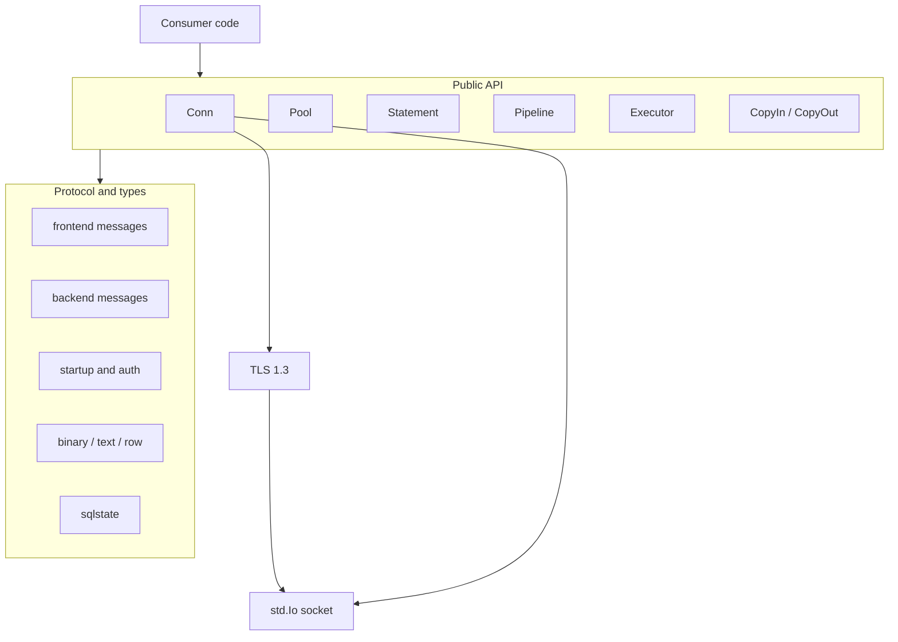
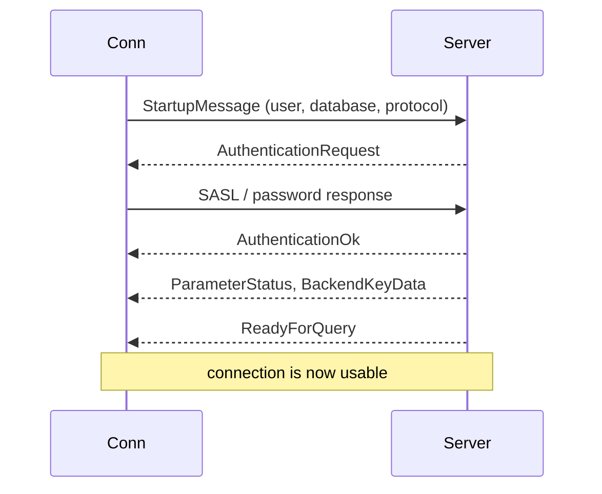
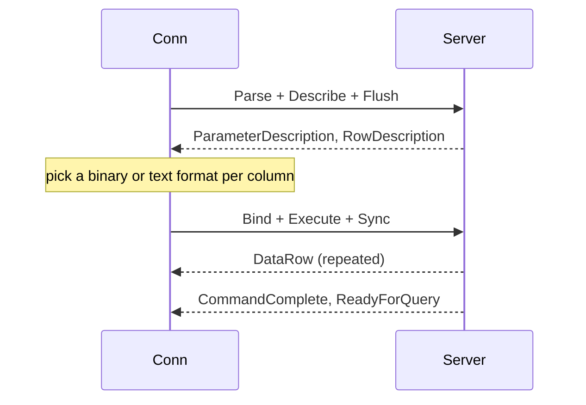
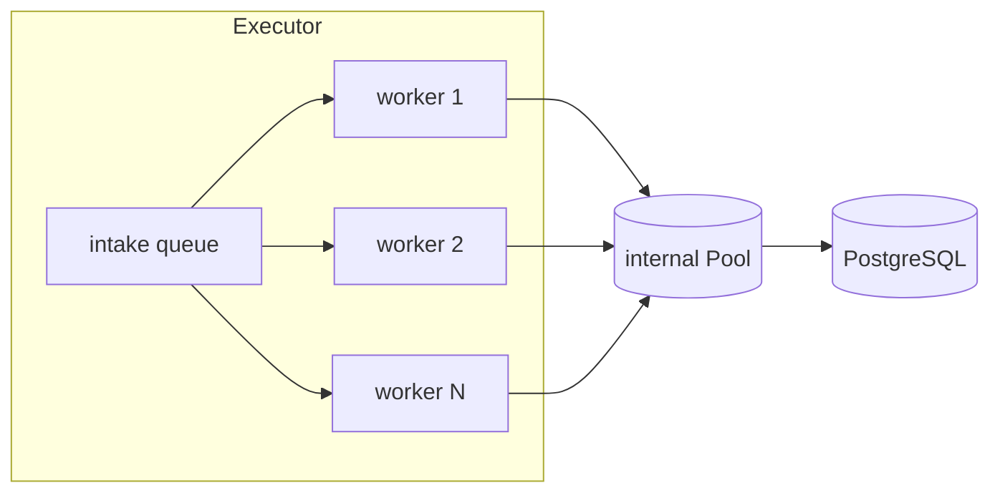
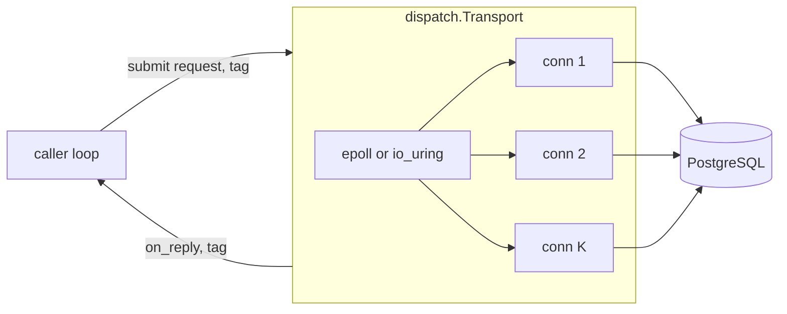

# postgrez high-level design

## Scope

postgrez is a PostgreSQL client library in pure Zig, standard library only. It speaks the frontend and backend wire protocol directly, no libpq, no C. This document covers the shape of the driver: the layers, the components, the connection lifecycle, and the concurrency model. The wire-level detail is in `lld-en.md`.

## Layers

- `Conn` is the core: one TCP (or TLS) connection with a send buffer and a per-query arena.
- `Pool`, `Statement`, `Pipeline`, `Executor`, `CopyIn`, `CopyOut` are features layered on `Conn`.
- The protocol layer encodes frontend messages and decodes backend messages, the types layer encodes and decodes values, `sqlstate` maps server error codes.
- TLS wraps the socket when the config or the URL asks for it.

## Components

| Component | Responsibility |
| :- | :- |
| `conn.zig` | connect, startup, auth, the simple and extended query flows, `Result` and `Row` decoding, LISTEN and NOTIFY |
| `pool.zig` | a thread-safe pool of connections with a bounded FIFO waiter queue |
| `statement.zig` | prepared statements plus the `sendRows` and `awaitRows` batch API |
| `pipeline.zig` | queue several statements behind one Sync, one round trip |
| `executor.zig` | a batching fleet: intake queue, worker threads, pool, per-connection statement cache (the ASYNC dispatch model) |
| `dispatch/` | the EPOLL and URING dispatch: one thread that multiplexes non-blocking connections and pipelines requests |
| `copy.zig` | COPY IN and COPY OUT streaming |
| `protocol/` | frontend and backend message framing, startup |
| `auth/` | SCRAM, SCRAM-PLUS channel binding, cleartext |
| `types/` | binary and text value codecs, row mapping into a struct |
| `tls/` | the TLS client (shared design with the zix TLS stack) |
| `sqlstate.zig` | the SQLSTATE enum and the captured server error |
| `url.zig` | `DATABASE_URL` parsing into a `Config` |

## Connection lifecycle

When TLS is on, an SSLRequest and the handshake precede the StartupMessage. A hostname resolves through the hosts and DNS lookup before the socket connects.

## Query flow

A simple `exec` uses the simple query path. `query`, `queryRow`, and `rows` use the extended path so values come back binary-first:

A prepared statement pays the Parse and Describe once, then every execution is Bind, Execute, Sync.

## Concurrency model

postgrez is shared-nothing at the connection level:

- A `Conn` is single-owner. One thread drives one connection at a time, there is no lock inside a connection.
- A `Pool` is thread-safe. `acquire` hands out an idle connection, connects an empty slot, or parks the caller on a bounded FIFO waiter queue. `release` hands the connection back, directly to the oldest waiter when one is parked. `discard` destroys a broken connection so the slot reconnects on the next acquire.
- An `Executor` owns worker threads over one internal pool. Each worker holds one connection per batch, so the workers never share a connection.

The executor answers the question a synchronous, thread-per-core server asks: how do many concurrent database requests share connections and round trips without one blocking thread per request. A worker drains up to a batch of jobs per wakeup and pipelines them on one connection, so throughput scales with the pool, not with the caller thread count.

## Dispatch model

`Config.dispatch_model` picks how the driver multiplexes socket I/O across connections. The wire protocol is the same in every model, only the socket pump changes.

| model | shape | best when |
| :- | :- | :- |
| `.ASYNC` | the Executor: a thread pool of blocking connections, one round trip in flight per worker | the default, a caller that wants a job queue plus per-connection prepared-statement caching |
| `.EPOLL` | one thread that owns non-blocking connections and pipelines many requests per connection, on epoll | one owner driving many connections without a thread per in-flight request |
| `.URING` | the same single-thread multiplex on io_uring | the same as EPOLL, with io_uring submission and completion queues in place of epoll |

`.ASYNC` is the Executor above. `.EPOLL` and `.URING` are `dispatch.Transport`: it reuses `Conn` for the connect and the SCRAM handshake, then runs the pipelined loop on the raw connection fd. The caller stages a request (the `frontend` helpers build the bytes) under a routing tag, and `dispatch.Transport` calls back with the raw reply (the `backend` decoder reads it) in submit order per connection. So the protocol is shared with the blocking path, only the socket pump changes.

`dispatch.Line` is the reactor-less sibling for a caller that owns its own event loop (zix.Http1's `.URING` external watch): one connection, `submit` stages, the caller `flush`es once per batch (`pump` flushes too) so many requests leave in one write, `pump` reads and delivers framed replies, and the caller watches the fd for readability itself. A closed peer surfaces as `error.ConnectionClosed` from `pump`.

`.EPOLL` and `.URING` are cleartext only: the raw-fd loop cannot drive a TLS session, so pair them with `tls = .OFF`. The blocking `Conn`, `Pool`, and `Executor` path keeps TLS.

## Prepared-statement caching in the executor

Prepared statements belong to the connection that parsed them. The executor keeps a side table keyed by connection, so a statement is prepared once and reused across batches on that connection. When a connection is discarded after a transport failure, its cached statements are closed with it and the next acquire reconnects clean.

## TLS

The TLS client follows the same TLS 1.3 design used across the zix stack (RFC 8446, no 1.2 fallback), the handshake runs before the PostgreSQL startup. SCRAM-PLUS channel binding hashes the server certificate, so it applies only to SHA-256 signed certificates.

## Design decisions

- Binary-first values: the extended path describes each result column and decodes binary when the driver has a binary codec, text otherwise. Parameters encode binary when the argument type matches the described OID, text when it does not (PostgreSQL casts text into any type).
- Shared-nothing pool: no connection is ever touched by two threads at once, so a connection needs no internal lock. The pool lock guards only the slot and waiter bookkeeping.
- Explicit lifetimes: `acquire` and `release` are explicit, results live in the connection's per-query arena and stay valid until the next query on that connection.
