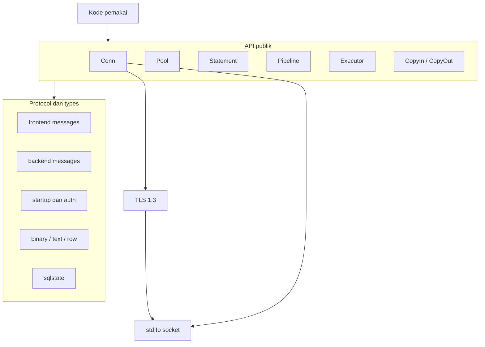
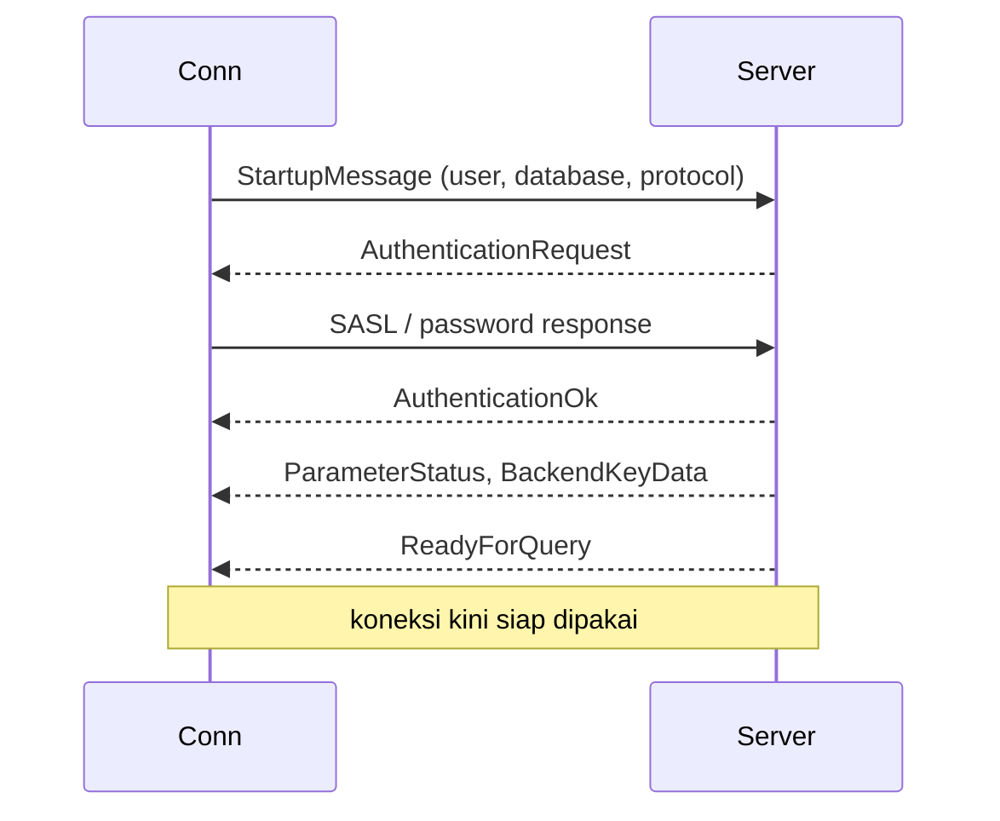
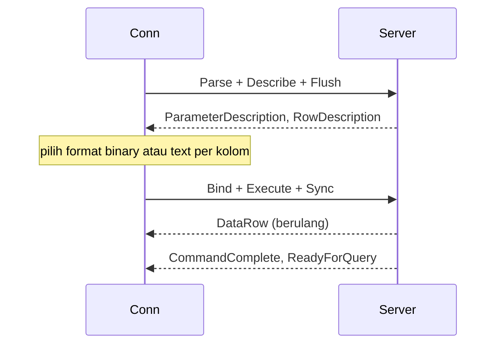
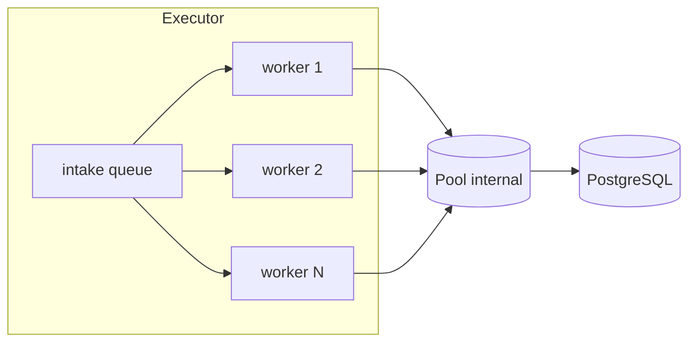
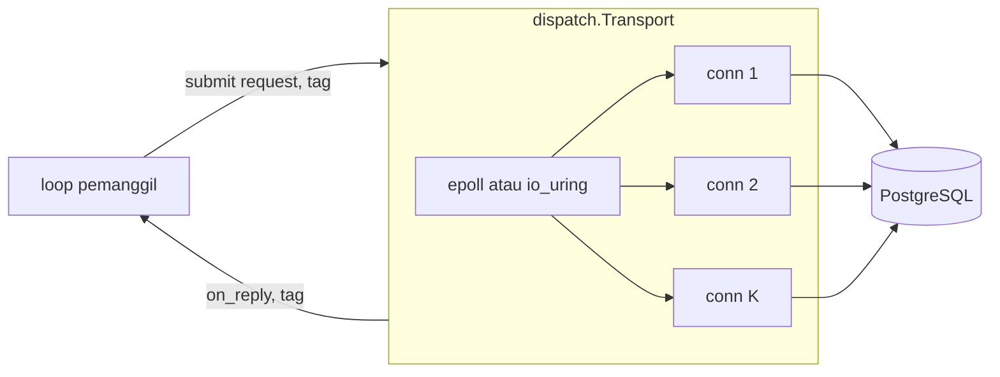

# Desain tingkat tinggi postgrez

## Ruang lingkup

postgrez adalah library klien PostgreSQL murni Zig, hanya memakai standard library. Ia berbicara langsung dengan wire protocol frontend dan backend, tanpa libpq, tanpa C. Dokumen ini membahas bentuk driver: layer-nya, komponennya, siklus hidup koneksi, dan model concurrency. Detail wire-level ada di `lld-id.md`.

## Layer

- `Conn` adalah inti: satu koneksi TCP (atau TLS) dengan send buffer dan arena per query.
- `Pool`, `Statement`, `Pipeline`, `Executor`, `CopyIn`, `CopyOut` adalah fitur di atas `Conn`.
- Layer protocol meng-encode frontend message dan men-decode backend message, layer types meng-encode dan men-decode nilai, `sqlstate` memetakan kode error server.
- TLS membungkus socket ketika config atau URL memintanya.

## Komponen

| Komponen | Tanggung jawab |
| :- | :- |
| `conn.zig` | connect, startup, auth, alur query simple dan extended, decoding `Result` dan `Row`, LISTEN dan NOTIFY |
| `pool.zig` | pool koneksi thread-safe dengan antrean waiter FIFO yang terbatas |
| `statement.zig` | prepared statement plus API batch `sendRows` dan `awaitRows` |
| `pipeline.zig` | antre beberapa statement di belakang satu Sync, satu round trip |
| `executor.zig` | fleet batching: intake queue, worker thread, pool, cache statement per koneksi (dispatch model ASYNC) |
| `dispatch/` | dispatch EPOLL dan URING: satu thread yang me-multiplex koneksi non-blocking dan mem-pipeline request |
| `copy.zig` | streaming COPY IN dan COPY OUT |
| `protocol/` | framing message frontend dan backend, startup |
| `auth/` | SCRAM, channel binding SCRAM-PLUS, cleartext |
| `types/` | codec nilai binary dan text, mapping row ke struct |
| `tls/` | klien TLS (desain bersama dengan stack TLS zix) |
| `sqlstate.zig` | enum SQLSTATE dan error server yang ditangkap |
| `url.zig` | parsing `DATABASE_URL` menjadi `Config` |

## Siklus hidup koneksi

Ketika TLS aktif, SSLRequest dan handshake mendahului StartupMessage. Sebuah hostname di-resolve lewat lookup hosts dan DNS sebelum socket connect.

## Alur query

`exec` sederhana memakai jalur simple query. `query`, `queryRow`, dan `rows` memakai jalur extended sehingga nilai kembali binary-first:

Prepared statement membayar Parse dan Describe sekali, lalu tiap eksekusi hanya Bind, Execute, Sync.

## Model concurrency

postgrez bersifat shared-nothing pada tingkat koneksi:

- Sebuah `Conn` dimiliki satu pihak. Satu thread menggerakkan satu koneksi pada satu waktu, tidak ada lock di dalam koneksi.
- Sebuah `Pool` bersifat thread-safe. `acquire` memberikan koneksi idle, meng-connect slot kosong, atau memarkir pemanggil di antrean waiter FIFO yang terbatas. `release` mengembalikan koneksi, langsung ke waiter tertua bila ada yang parkir. `discard` menghancurkan koneksi rusak sehingga slot connect ulang pada acquire berikutnya.
- Sebuah `Executor` memiliki worker thread di atas satu pool internal. Tiap worker memegang satu koneksi per batch, jadi worker tidak pernah berbagi koneksi.

Executor menjawab pertanyaan yang dihadapi server sinkron thread-per-core: bagaimana banyak request database yang bersamaan berbagi koneksi dan round trip tanpa satu thread yang memblokir per request. Satu worker menguras hingga satu batch job per wakeup lalu mem-pipeline-nya di satu koneksi, jadi throughput naik mengikuti pool, bukan mengikuti jumlah thread pemanggil.

## Dispatch model

`Config.dispatch_model` memilih cara driver me-multiplex I/O socket lintas koneksi. Wire protocol sama di setiap model, hanya socket pump yang berubah.

| model | bentuk | terbaik saat |
| :- | :- | :- |
| `.ASYNC` | Executor: thread pool koneksi blocking, satu round trip in flight per worker | default, pemanggil yang mau job queue plus caching prepared statement per koneksi |
| `.EPOLL` | satu thread yang memiliki koneksi non-blocking dan mem-pipeline banyak request per koneksi, di atas epoll | satu owner yang menggerakkan banyak koneksi tanpa satu thread per request in flight |
| `.URING` | multiplex satu thread yang sama di atas io_uring | sama seperti EPOLL, dengan submission dan completion queue io_uring menggantikan epoll |

`.ASYNC` adalah Executor di atas. `.EPOLL` dan `.URING` adalah `dispatch.Transport`: ia memakai ulang `Conn` untuk connect dan handshake SCRAM, lalu menjalankan loop pipelined di atas fd koneksi mentah. Pemanggil men-stage sebuah request (helper `frontend` membangun byte-nya) di bawah routing tag, dan `dispatch.Transport` callback dengan reply mentah (decoder `backend` membacanya) dalam urutan submit per koneksi. Jadi protocol dibagi dengan jalur blocking, hanya socket pump yang berubah.

`dispatch.Line` adalah saudara tanpa reactor untuk pemanggil yang memiliki event loop sendiri (external watch `.URING` zix.Http1): satu koneksi, `submit` men-stage, pemanggil melakukan `flush` sekali per batch (`pump` juga flush) sehingga banyak request keluar dalam satu write, `pump` membaca dan mengantar reply yang sudah ter-frame, dan pemanggil sendiri yang mengawasi fd untuk readable. Peer yang tertutup muncul sebagai `error.ConnectionClosed` dari `pump`.

`.EPOLL` dan `.URING` cleartext saja: loop raw-fd tidak bisa menggerakkan sesi TLS, jadi pasangkan dengan `tls = .OFF`. Jalur `Conn`, `Pool`, dan `Executor` blocking tetap memakai TLS.

## Cache prepared statement di executor

Prepared statement milik koneksi yang mem-parse-nya. Executor menyimpan tabel samping berkunci koneksi, jadi sebuah statement di-prepare sekali dan dipakai ulang antar batch pada koneksi itu. Ketika koneksi di-discard setelah kegagalan transport, statement yang di-cache ikut ditutup bersamanya dan acquire berikutnya connect ulang dari bersih.

## TLS

Klien TLS memakai desain TLS 1.3 yang sama dengan seluruh stack zix (RFC 8446, tanpa fallback 1.2), handshake berjalan sebelum startup PostgreSQL. Channel binding SCRAM-PLUS meng-hash sertifikat server, jadi hanya berlaku untuk sertifikat bertanda tangan SHA-256.

## Keputusan desain

- Nilai binary-first: jalur extended men-describe tiap kolom hasil dan men-decode binary bila driver punya codec binary, text bila tidak. Parameter meng-encode binary bila tipe argumen cocok dengan OID yang di-describe, text bila tidak (PostgreSQL meng-cast text ke tipe apa pun).
- Pool shared-nothing: tidak ada koneksi yang disentuh dua thread sekaligus, jadi koneksi tidak butuh lock internal. Lock pool hanya menjaga pembukuan slot dan waiter.
- Lifetime eksplisit: `acquire` dan `release` eksplisit, hasil hidup di arena per query koneksi dan tetap valid hingga query berikutnya pada koneksi itu.
