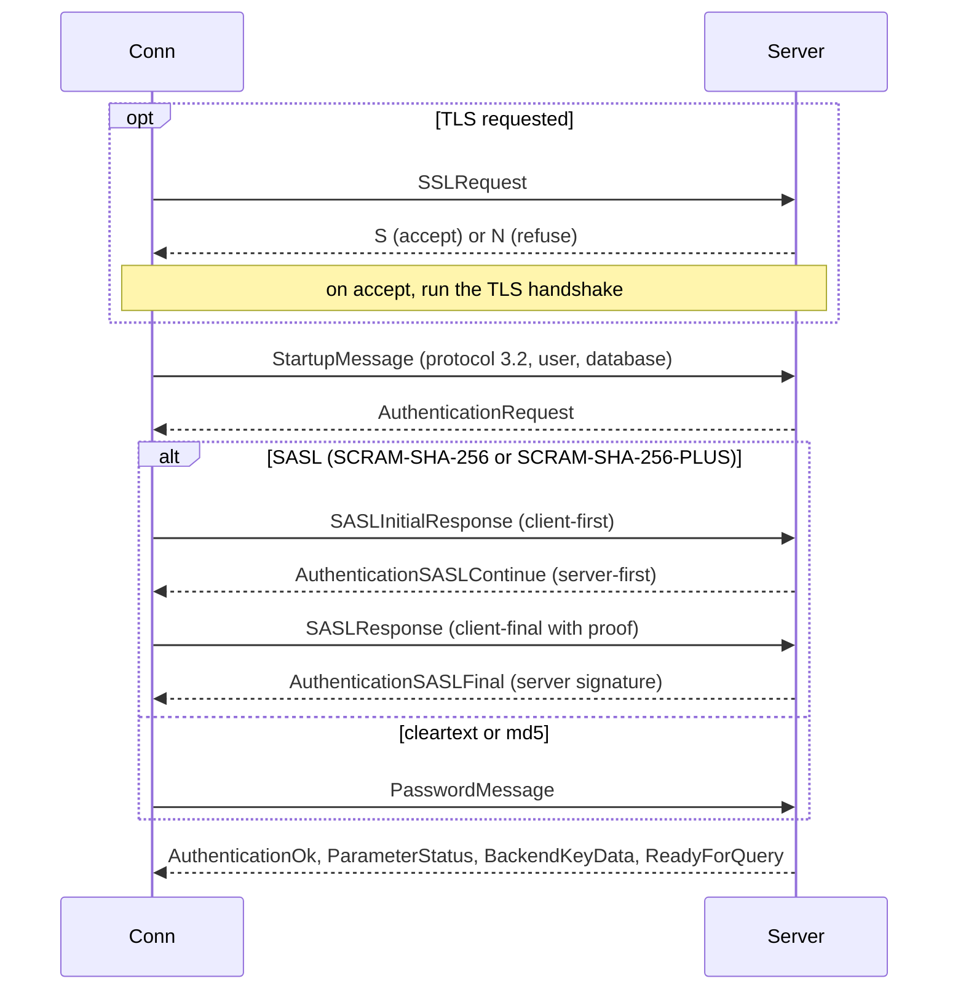
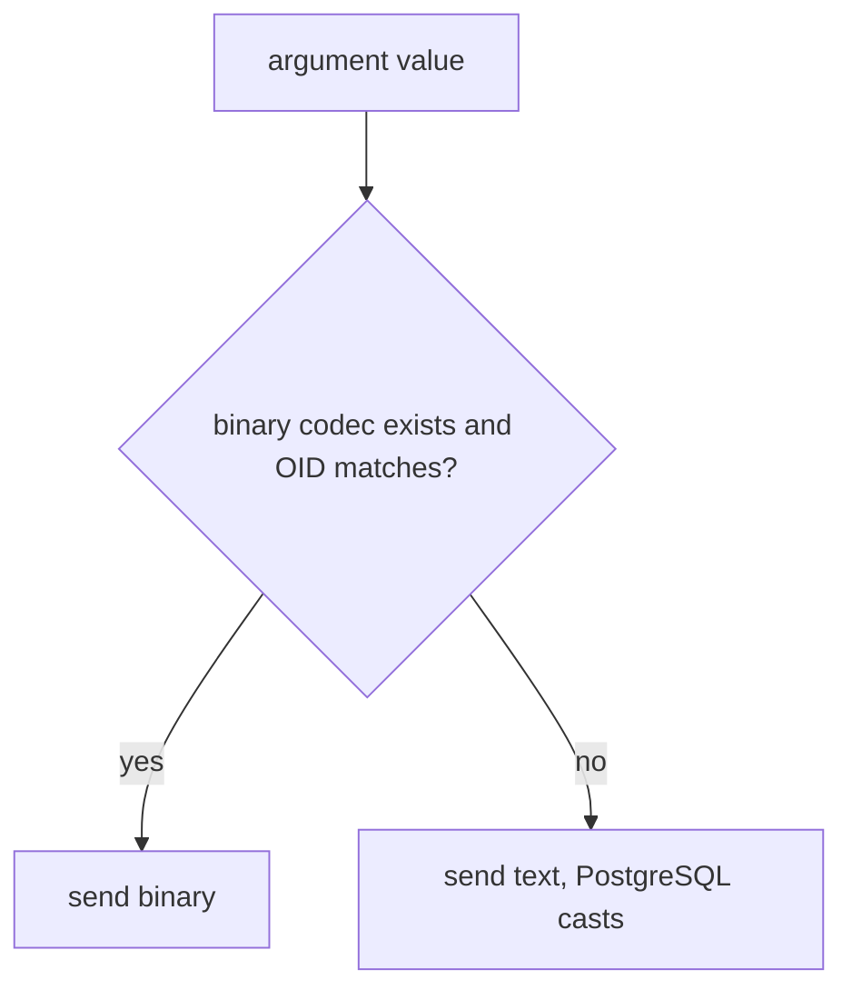
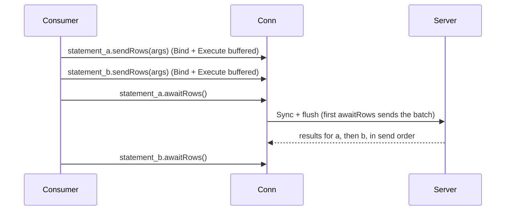
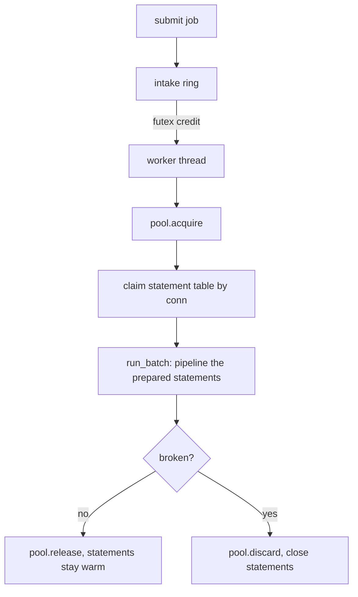
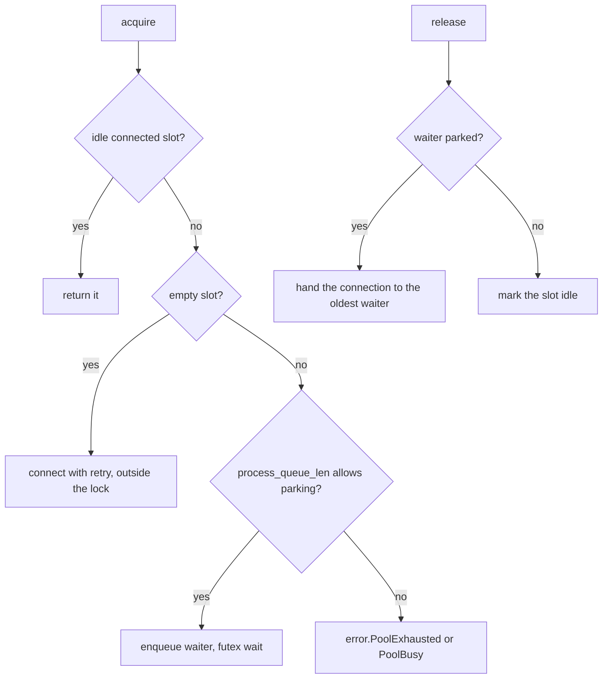

# postgrez low-level design

This document covers the wire-level and internal detail. For the shape of the driver read `hld-en.md` first.

## Message framing

Every backend message is a one-byte type tag, a four-byte big-endian length (the length counts itself but not the tag), then the body. Frontend messages follow the same layout, except the startup message which has no tag. The driver reads a message by tag, dispatches on it, and returns a decoded `BackendMessage` union.

## Startup and authentication

- SCRAM is a sans-IO state machine, the RFC 7677 test vectors pass.
- SCRAM-PLUS channel binding is `SHA-256(server certificate DER)`, so it applies only to SHA-256 signed certificates.
- The negotiated protocol is 3.2 on PostgreSQL 15 and newer, with an in-place 3.0 fallback.

## Value encoding

Parameters encode binary-first with a per-parameter text fallback:

The described parameter OID from Parse plus Describe decides. When the type-picked OID matches the described one (or inference left it open) the driver sends binary, otherwise it sends the text form. This is why a Zig `i64` bound to an `int2` column falls back to text.

Result columns decode by their described format: binary when the driver has a binary decoder for the type, text otherwise. `Row.get(T, index)` reads one cell, `parseRow(T, ...)` maps a whole row into a struct by column order.

## Query paths

| Call | Path | Round trips |
| :- | :- | :- |
| `exec` | simple query | 1 |
| `query`, `queryRow`, `rows` | extended (Parse, Describe, Bind, Execute, Sync) | 1 after describe |
| `Statement.rows` and friends | Bind, Execute, Sync (describe already paid) | 1 |
| `Statement.sendRows` + `awaitRows` | many Bind and Execute behind one Sync | 1 per batch |
| `Pipeline.add` + `sync` | many statements behind one Sync | 1 per batch |

On an error the extended path drains to the next ReadyForQuery so the connection stays usable. A server error captures its SQLSTATE and message into `lastServerError` and surfaces as `error.ServerError`.

## Prepared statements

`prepare` sends Parse plus Describe plus Sync under a fresh server-side name (`postgrez_N`), then caches the parameter OIDs, the result columns, and their formats in the statement arena. `deinit` closes the server-side statement best effort. Executions reuse the cached metadata, so they skip the describe round.

## The batch API

`sendRows` and `awaitRows` pipeline several executions of one connection behind a single Sync:

Rules the connection enforces through `batch_pending`, `batch_flushed`, and `batch_aborted`:

- `max_pending_replies` bounds the queue, `sendRows` past the bound sheds `error.QueueFull`.
- The first `awaitRows` appends Sync and flushes, so one send and one receive burst cover the whole batch.
- Results arrive in send order: call `awaitRows` on the statement that queued that execution, and drive each `Result` to the end (or `deinit`) before the next `awaitRows`.
- After a failed statement the server discards the rest until Sync, so the remaining `awaitRows` return `error.BatchAborted`.
- A prepare clears the connection send buffer, so all prepares must precede the first `sendRows` of a batch.

## Executor internals

The executor is the batching fleet the HTTP entry and any high-throughput consumer share.

- Intake ring: a fixed-size ring guarded by a spinlock. Each queued job adds one futex credit to `pending`, workers consume credits and pop jobs. A full ring makes `submit` return false so the caller sheds.
- Worker loop: a worker blocks on the futex for the first job, then drains up to `batch_max` more without blocking, so a batch fills as deep as the arrival rate allows.
- Statement cache: a `Table` per pooled connection holds `[statement_count]?Statement`. `Batch.statement(slot, sql)` prepares on first use and reuses after, keyed by the held connection.
- Sizing: `workers = 0` computes `min(cpu_count x 8, hint / 2)` floored at 16, capped at 128. A fleet far wider than the CPU budget collapses into single-job batches, so the cap matters. The internal pool is `pool_size = workers`, `process_queue_len = workers + margin`.
- Lifecycle: `submit` queues for a worker, `runInline` runs one job on the caller thread (for a request whose connection is about to close, where a deferred write would race the close). `deinit` stops the workers (a shutdown flag plus a futex wake, with a `pending` bump to defeat a lost wakeup), then closes the connections.
- Diagnostics: with `stats` on, `snapshot()` returns and resets the queue high-water, the batch-fill histogram, and the batch counts and wall time.

## Pool internals

- A spinlock guards the slot and waiter bookkeeping, the connect itself runs outside the lock.
- `release` hands a healthy connection directly to the oldest parked waiter (the slot stays held through the handoff), or marks it idle.
- `discard` frees a broken slot, granting it to a waiter (who reconnects) or leaving it for the next acquire.
- Beyond the waiter bound `acquire` sheds `error.PoolBusy`, with parking off it sheds `error.PoolExhausted`.

## Error taxonomy

| Error | Meaning | Recovery |
| :- | :- | :- |
| `error.ServerError` | the server reported an error, captured in `lastServerError` | the connection stays usable |
| transport errors (`error.ConnectionClosed` and similar) | the socket failed | discard the connection |
| `error.QueueFull` | a batch or pipeline hit `max_pending_replies` | await the queued results first |
| `error.BatchAborted` | an earlier statement of the batch failed | drain the rest, retry the batch |
| `error.PoolExhausted` | the pool is full and parking is off | retry later or raise `process_queue_len` |
| `error.PoolBusy` | the waiter queue is full | retry later or raise `process_queue_len` |
| `error.ParamCountMismatch` | args and the statement disagree | fix the argument count |

## Config reference

See the README config table for the full field list. The load-bearing choices:

- `max_pending_replies`: the in-flight bound on one connection. Set it to the batch depth you pipeline. Too low serializes the batch, too high lets a stalled server grow the send buffer.
- `process_queue_len`: the parked-acquire bound on the pool. A rule of thumb is the worker count plus a small margin, so a transient stall parks and a real overload sheds.
- `pool_size`: connections per pool. Throughput is roughly `pool_size / round_trip_latency`, widen the pool to raise it.
