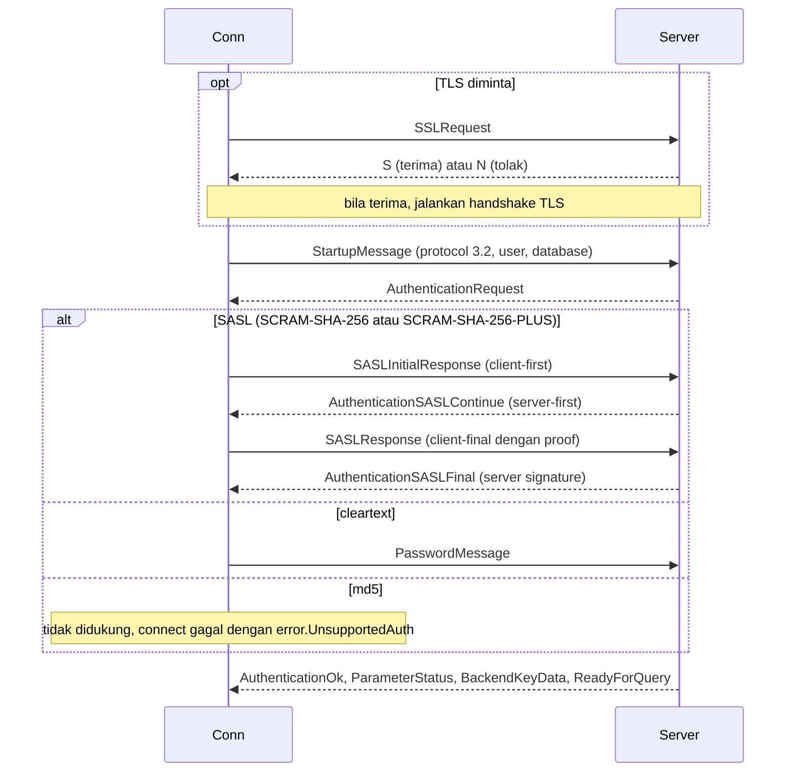
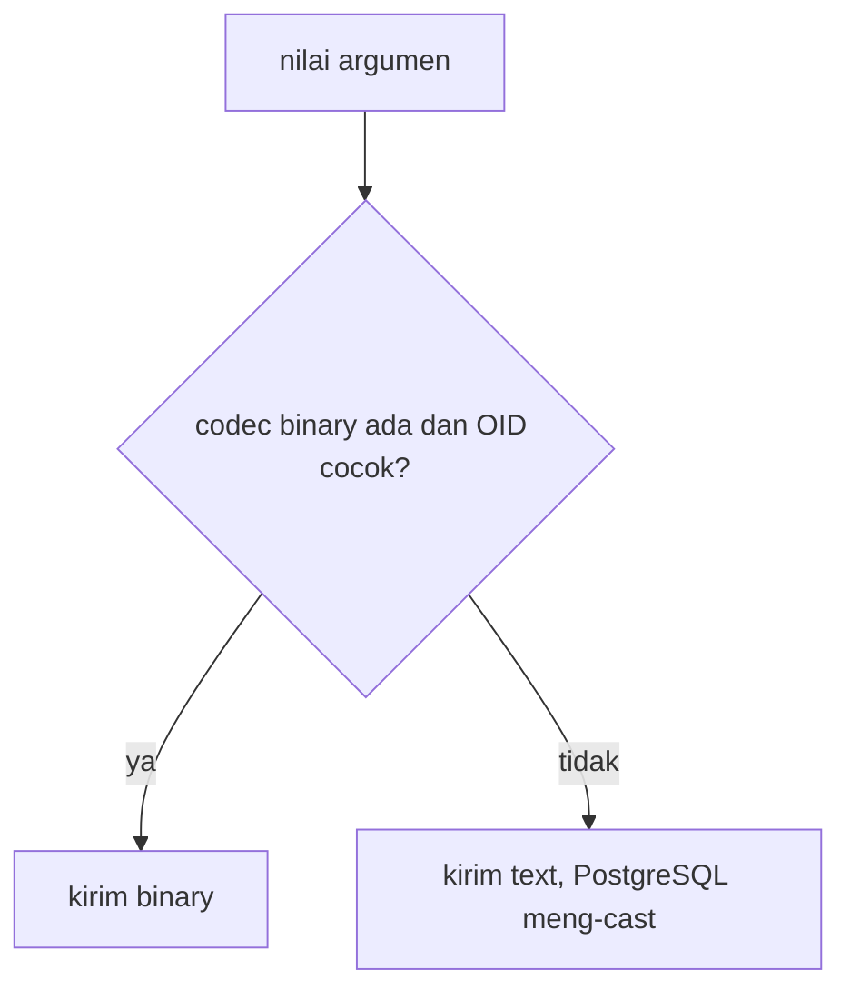
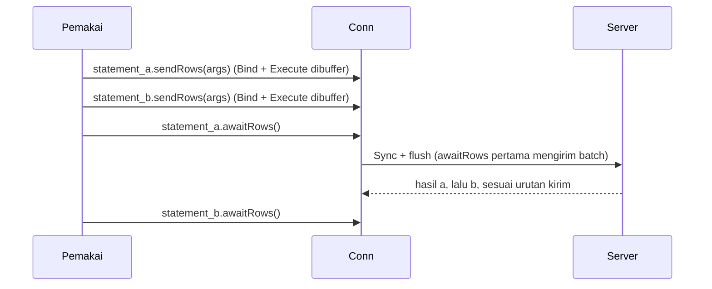
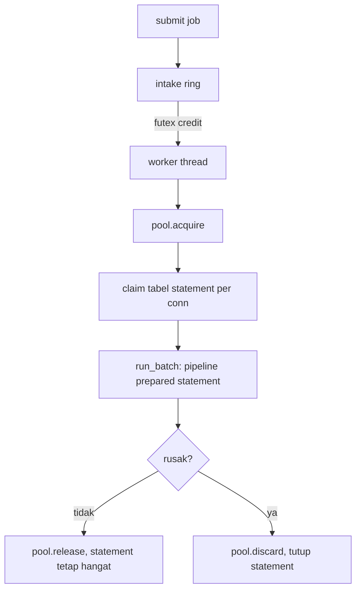

# Desain tingkat rendah postgrez

Dokumen ini membahas detail wire-level dan internal. Untuk bentuk driver baca `hld-id.md` lebih dulu.

## Framing message

Setiap backend message adalah satu byte tag tipe, empat byte panjang big-endian (panjang menghitung dirinya tetapi bukan tag), lalu body. Frontend message memakai tata letak sama, kecuali startup message yang tanpa tag. Driver membaca message per tag, men-dispatch berdasarkannya, dan mengembalikan union `BackendMessage` yang sudah di-decode.

## Startup dan autentikasi

- SCRAM adalah state machine sans-IO, vektor uji RFC 7677 lolos.
- Channel binding SCRAM-PLUS adalah `SHA-256(sertifikat server DER)`, jadi hanya berlaku untuk sertifikat bertanda tangan SHA-256.
- Protocol yang dinegosiasi adalah 3.2 pada PostgreSQL 15 ke atas, dengan fallback 3.0 di tempat.

## Encoding nilai

Parameter meng-encode binary-first dengan fallback text per parameter:

OID parameter yang di-describe dari Parse plus Describe yang menentukan. Ketika OID pilihan tipe cocok dengan yang di-describe (atau inference membiarkannya terbuka) driver mengirim binary, selain itu ia mengirim bentuk text. Inilah sebabnya `i64` Zig yang di-bind ke kolom `int2` jatuh ke text.

Kolom hasil di-decode menurut format yang di-describe: binary bila driver punya decoder binary untuk tipe itu, text bila tidak. `Row.get(T, index)` membaca satu cell, `parseRow(T, ...)` memetakan satu row penuh ke struct menurut urutan kolom.

## Jalur query

| Panggilan | Jalur | Round trip |
| :- | :- | :- |
| `exec` | simple query | 1 |
| `query`, `queryRow`, `rows` | extended (Parse, Describe, Bind, Execute, Sync) | 1 setelah describe |
| `Statement.rows` dan sejenisnya | Bind, Execute, Sync (describe sudah dibayar) | 1 |
| `Statement.sendRows` + `awaitRows` | banyak Bind dan Execute di belakang satu Sync | 1 per batch |
| `Pipeline.add` + `sync` | banyak statement di belakang satu Sync | 1 per batch |

Pada error, jalur extended menguras hingga ReadyForQuery berikutnya sehingga koneksi tetap bisa dipakai. Sebuah error server menangkap SQLSTATE dan pesannya ke `lastServerError` dan muncul sebagai `error.ServerError`.

## Prepared statement

`prepare` mengirim Parse plus Describe plus Sync dengan nama sisi server yang baru (`postgrez_N`), lalu men-cache OID parameter, kolom hasil, dan formatnya di arena statement. `deinit` menutup statement sisi server secara best effort. Eksekusi memakai ulang metadata yang di-cache, jadi melewati ronde describe.

## API batch

`sendRows` dan `awaitRows` mem-pipeline beberapa eksekusi satu koneksi di belakang satu Sync:

Aturan yang ditegakkan koneksi lewat `batch_pending`, `batch_flushed`, dan `batch_aborted`:

- `max_pending_replies` membatasi antrean, `sendRows` melewati batas shed `error.QueueFull`.
- `awaitRows` pertama menambah Sync dan flush, jadi satu kirim dan satu burst terima mencakup seluruh batch.
- Hasil datang sesuai urutan kirim: panggil `awaitRows` pada statement yang mengantre eksekusi itu, dan giring tiap `Result` sampai habis (atau `deinit`) sebelum `awaitRows` berikutnya.
- Setelah sebuah statement gagal, server membuang sisanya hingga Sync, jadi `awaitRows` sisanya mengembalikan `error.BatchAborted`.
- Sebuah prepare membersihkan send buffer koneksi, jadi semua prepare harus mendahului `sendRows` pertama sebuah batch.

## Internal executor

Executor adalah fleet batching yang dipakai bersama oleh entry HTTP dan pemakai throughput tinggi mana pun.

- Intake ring: ring berukuran tetap yang dijaga spinlock. Tiap job yang diantre menambah satu futex credit ke `pending`, worker mengonsumsi credit dan mem-pop job. Ring penuh membuat `submit` mengembalikan false sehingga pemanggil shed.
- Worker loop: worker memblokir di futex untuk job pertama, lalu menguras hingga `batch_max` job lagi tanpa memblokir, jadi sebuah batch terisi sedalam laju kedatangan mengizinkan.
- Cache statement: satu `Table` per koneksi pool menyimpan `[statement_count]?Statement`. `Batch.statement(slot, sql)` mem-prepare pada pemakaian pertama dan memakai ulang sesudahnya, berkunci koneksi yang dipegang.
- Sizing: `workers = 0` menghitung `min(cpu_count x 8, hint / 2)` dengan lantai 16, batas atas 128. Fleet yang jauh lebih lebar dari budget CPU runtuh menjadi batch satu job, jadi batasnya penting. Pool internal adalah `pool_size = workers`, `process_queue_len = workers + margin`.
- Siklus hidup: `submit` mengantre untuk worker, `runInline` menjalankan satu job di thread pemanggil (untuk request yang koneksinya akan segera ditutup, di mana tulisan yang ditunda akan berlomba dengan penutupan). `deinit` menghentikan worker (flag shutdown plus futex wake, dengan bump `pending` untuk mematahkan lost wakeup), lalu menutup koneksi.
- Diagnostik: dengan `stats` aktif, `snapshot()` mengembalikan dan mereset high-water antrean, histogram isi batch, serta hitungan dan waktu wall batch.

## Internal pool

```mermaid
flowchart TB
    acq[acquire] --> idle{slot idle terhubung?}
    idle -->|ya| hand[kembalikan]
    idle -->|tidak| empty{slot kosong?}
    empty -->|ya| conn[connect dengan retry, di luar lock]
    empty -->|tidak| park{process_queue_len izinkan parkir?}
    park -->|ya| wait[antre waiter, futex wait]
    park -->|tidak| shed[error.PoolExhausted atau PoolBusy]
    rel[release] --> waiter{ada waiter parkir?}
    waiter -->|ya| grant[serahkan koneksi ke waiter tertua]
    waiter -->|tidak| back[tandai slot idle]
```

- Sebuah spinlock menjaga pembukuan slot dan waiter, connect-nya sendiri berjalan di luar lock.
- `release` menyerahkan koneksi sehat langsung ke waiter parkir tertua (slot tetap dipegang lewat handoff), atau menandainya idle.
- `discard` membebaskan slot rusak, memberikannya ke waiter (yang connect ulang) atau membiarkannya untuk acquire berikutnya.
- Melewati batas waiter `acquire` shed `error.PoolBusy`, dengan parkir mati ia shed `error.PoolExhausted`.

## Taksonomi error

| Error | Arti | Pemulihan |
| :- | :- | :- |
| `error.ServerError` | server melaporkan error, tertangkap di `lastServerError` | koneksi tetap bisa dipakai |
| error transport (`error.ConnectionClosed` dan sejenisnya) | socket gagal | discard koneksi |
| `error.QueueFull` | batch atau pipeline mencapai `max_pending_replies` | await hasil yang antre dulu |
| `error.BatchAborted` | statement lebih awal dalam batch gagal | uras sisanya, ulangi batch |
| `error.PoolExhausted` | pool penuh dan parkir mati | ulang nanti atau naikkan `process_queue_len` |
| `error.PoolBusy` | antrean waiter penuh | ulang nanti atau naikkan `process_queue_len` |
| `error.ParamCountMismatch` | args dan statement tidak cocok | perbaiki jumlah argumen |

## Rujukan config

Lihat tabel config di README untuk daftar field lengkap. Pilihan yang menentukan:

- `max_pending_replies`: batas in-flight pada satu koneksi. Setel ke kedalaman batch yang Anda pipeline. Terlalu rendah men-serialize batch, terlalu tinggi membiarkan server yang macet menumbuhkan send buffer.
- `process_queue_len`: batas acquire parkir pada pool. Aturan praktis adalah jumlah worker plus margin kecil, jadi macet sesaat memarkir dan overload sungguhan shed.
- `pool_size`: jumlah koneksi per pool. Throughput kira-kira `pool_size / latency_round_trip`, lebarkan pool untuk menaikkannya.
