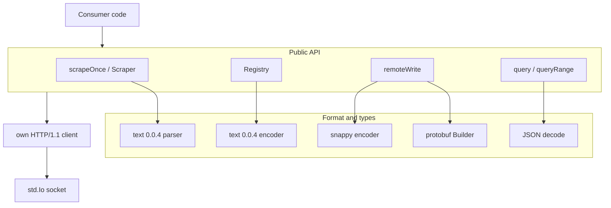
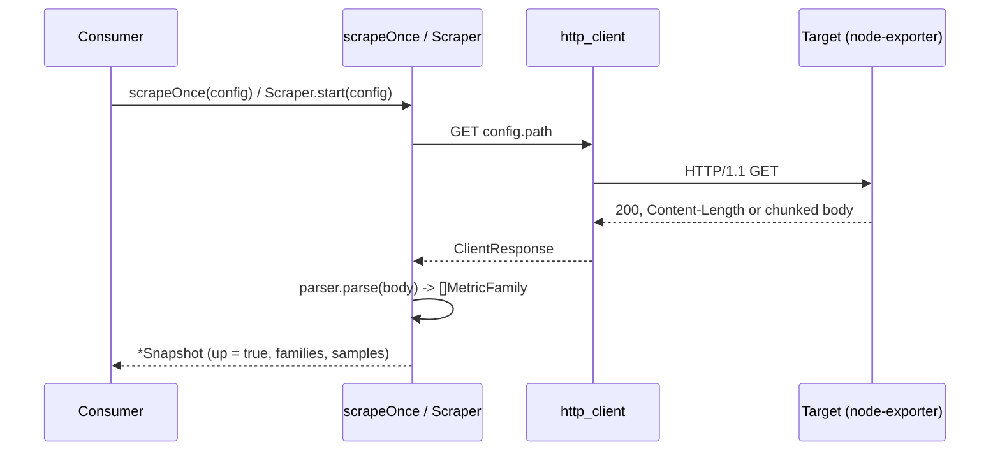
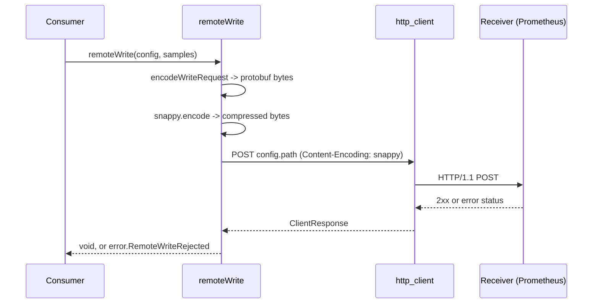
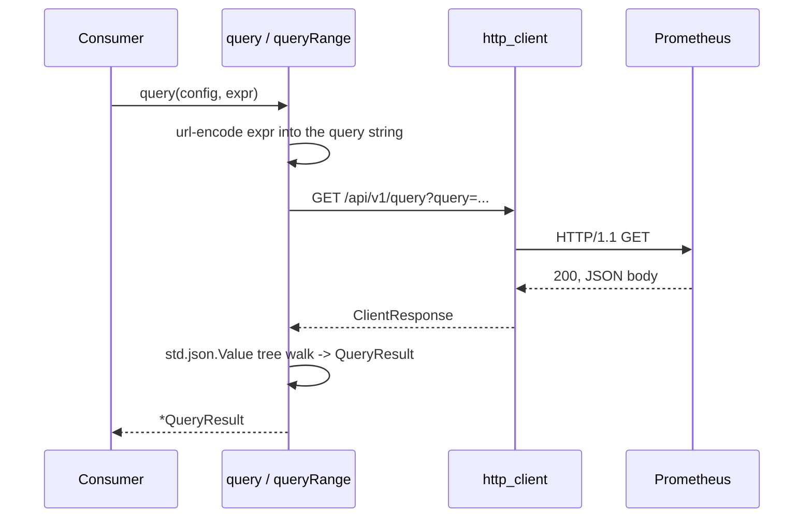

# prometheuz high-level design

## Scope

prometheuz is a Prometheus and node-exporter driver in pure Zig, standard library only. It covers four surfaces: pulling metrics (Prometheus text exposition format 0.0.4), pushing metrics (`remote_write`, protobuf plus snappy), querying (PromQL over HTTP JSON), and an app-authored metric registry for values that never come from a scrape. This document covers the shape of the driver: the layers, the components, the four flows, and the concurrency model. The wire-level detail is in `lld-en.md`.

## Layers



- `scrapeOnce`/`Scraper`, `Registry`, `remoteWrite`, `query`/`queryRange` are the four independent public surfaces. None of them depend on the others.
- The format layer encodes and decodes the wire shapes each surface needs: text 0.0.4 both directions, protobuf plus snappy for `remote_write`, JSON for query responses.
- Every surface that talks over the network goes through the same `http_client.zig`, the driver's own HTTP/1.1 client.

## Components

| Component | Responsibility |
| :- | :- |
| `config.zig` | `ScrapeConfig`, `WriteConfig`, `QueryConfig` - flat, per-surface configs |
| `url.zig` | parse an `http://` target URL into the matching config |
| `sample.zig` | `MetricType`, `Label`, `Sample`, `MetricFamily`, plus allocation-free `bucket`/`quantile`/`sumSample`/`countSample` helpers |
| `parser.zig` | the text 0.0.4 parser: HELP/TYPE, multi-line histogram and summary families, label escaping, special floats |
| `snapshot.zig` | `Snapshot`, a refcounted parsed scrape result |
| `scrape.zig` | `scrapeOnce`: one GET plus parse, captures a failure instead of throwing |
| `scraper.zig` | `Scraper`: a background poller thread, RCU-style publish and read |
| `registry.zig` | `Registry`, `Counter`, `Gauge`, `CounterVec`, `GaugeVec` - the app-authored metrics |
| `expose.zig` | the text 0.0.4 encoder, the inverse of `parser.zig` |
| `protobuf.zig` | a minimal varint and length-delimited encoder for the `remote_write` `WriteRequest` schema |
| `snappy.zig` | a literals-only snappy block encoder |
| `remote_write.zig` | POST samples as a protobuf `WriteRequest`, snappy-compressed |
| `query.zig` | PromQL instant and ranged query, JSON response decode |
| `http_client.zig` | the driver's own minimal HTTP/1.1 client |

## Own HTTP/1.1 client, not zix.Http.Client

`http_client.zig` is a standalone HTTP/1.1 client, not a reuse of `zix.Http.Client`. Two blockers rule that out for a standalone package (the same constraint `postgrez` and `rediz` already carry: no dependency back onto zix itself):

- `zix.Http.Client`'s `client_config.zig` needs `zon_options`, which only the root `build.zig` injects.
- `zix.Http.Client`'s `client.zig` unconditionally imports `h2_client.zig`, which drags in `zix.Tls` and HTTP/2.

`http_client.zig` mirrors `zix.Http.Client`'s public shape (`get`/`post`, a `ClientResponse` with `status()`/`header()`/`body()`/`deinit()`) without importing it, the same technique `zix.Http.Client` itself uses for its `requestUds` path: connect, write the request bytes raw, read the response head up to `"\r\n\r\n"`, parse the status line and framing, then read the body.

Cleartext only, GET and POST only. Two body-framing modes: `Content-Length` and chunked transfer-encoding. Chunked support was not in the original scope, it was added after live validation against a real node-exporter: Go's `net/http` (what node-exporter is built on) sends `Transfer-Encoding: chunked` with no `Content-Length` for its `/metrics` response, so a client that only understood `Content-Length` failed against a real target from the first request. `connect_timeout_ms` is accepted on every config for API-shape parity but not yet enforced: this Zig version's `std.Io.Threaded.netConnectIpPosix` panics on a timeout request rather than erroring, the same "stored, not yet applied" shape `zix.Http.Client` itself carries for some of its own timeouts.

## Scrape flow



A failed connect, a non-200 status, or a parse error never throws out of `scrapeOnce`: it comes back as a `Snapshot` with `up = false` and `last_error` set, so a bad target is observable through the returned value, not an error the caller must catch.

## remote_write flow



Each `Sample` becomes one `TimeSeries`: its name travels as the conventional `__name__` label (the same convention real Prometheus uses), its own labels follow, one `Sample` point carries the value and timestamp (stamped with the current wall-clock time when the sample has none).

## Query flow



The response decodes through a dynamic `std.json.Value` tree, not a typed struct parse: a PromQL point is `[timestamp_number, "value_string"]`, a shape a fixed struct cannot describe cleanly. `query` populates `result_type = .vector`, `queryRange` populates `.matrix`, only the matching field of `QueryResult` is non-empty.

## App-authored registry (Registry)

```mermaid
flowchart TB
    reg[Registry]
    cv[CounterVec]
    gv[GaugeVec]
    cell[Counter / Gauge cell]
    hot[caller: .with(label_values).inc / .add / .set]

    reg --> cv
    reg --> gv
    cv --> cell
    gv --> cell
    hot -->|first time: allocate + lock| cell
    hot -->|warm: CAS loop, no lock| cell
```

A `Counter`/`Gauge` cell stores a bit-cast `f64` inside an `atomic.Value(u64)` (std has no atomic float primitive), so `add()` is a CAS loop. `CounterVec` and `GaugeVec` are one generic `Vec(Cell, metric_type)` shape: a `StringHashMapUnmanaged` from a joined label-value key to a heap-allocated cell, guarded by a spinlock (`atomic.Value(bool)`, the same idiom `Scraper` and `postgrez.Pool` use) around lookup and insertion only. Once a label combination is warm, recording a value never allocates, never locks, and never blocks: only `.with()`'s first call for a brand-new combination touches the lock.

`.with()` never returns an error to the caller. An allocation failure on a brand-new label combination falls back to a shared discard cell rather than propagating into the app's hot path: a metrics call is not allowed to be the reason a request fails.

`Registry.snapshot()` flattens every recorded cell into `[]Sample` (the push path, feeds `remoteWrite`), `Registry.families()` builds `[]MetricFamily` (the pull path, feeds `expose()` for the app's own `GET /metrics` route).

## Concurrency model

- `Scraper` publish and read is RCU-style: a spinlock guards only the published-pointer swap and the refcount bump, the scrape's own network I/O runs outside the lock, so a reader calling `latest()` never waits on an in-flight scrape.
- `Snapshot` is refcounted (`atomic.Value(u32)`): `retain()` before handing it to another reader, `release()`/`deinit()` when done, the arena frees only once the count reaches zero.
- `Registry`'s per-`Vec` spinlock guards cell creation only, not cell updates: two threads incrementing the same warm `Counter` race only on the CAS loop inside `addBits`, never on the lock.

## Containers and examples

`containers/node-exporter/` and `containers/prometheus/` (repo root) follow the same pattern `postgrez`/`rediz` use for their own containers: `build.zig` builds the image, replaces any old container, runs it detached with an explicit host port publish. `zig build test-runner` owns both containers' lifecycle for the 9 one-shot examples under `examples/`.

`examples/registry_live_demo.zig` is the one long-running exception: it registers a counter, loops forever pushing and querying it back so a browser open on the printed Prometheus URL shows the value update live, and self-manages its own docker network plus node-exporter and prometheus containers (check-alive, start-if-missing, teardown only what it started on `SIGINT`). It is not part of `zig build test-runner`: a demo with no exit condition has no "done" marker to check.

## Design decisions

- **Four independent surfaces, no shared config**: a scrape target, a remote_write receiver, and a query API endpoint are three different servers in a real deployment, so `ScrapeConfig`/`WriteConfig`/`QueryConfig` stay separate flat structs rather than one struct with fields that do not apply to every surface.
- **Own HTTP/1.1 client**: see the section above. Cleartext-only for v1, no `tls` field anywhere in `config.zig` until a TLS-capable client lands.
- **Snapshot is immutable and refcounted**, never mutated in place: a `Scraper` publishing a fresh snapshot every interval cannot invalidate a `Snapshot` a reader is still walking.
- **Registry never throws on the hot path**: recording a metric value must never be the reason application logic fails, so `.with()` degrades to a discard cell under memory pressure instead of returning an error.
- **snappy is literals-only**: a real LZ77 matcher is deferred. The encoding is spec-valid (a snappy decoder must accept an all-literal stream) and real Prometheus servers decode it correctly, the v1 scope cut is compression ratio, not correctness. remote_write payloads this driver pushes (a scrape or a registry snapshot) are modest, so this keeps the encoder small and easy to verify.
- **PromQL responses decode through a dynamic JSON tree**, not a typed struct: the point shape (`[timestamp_number, "value_string"]`) does not map cleanly onto `std.json`'s typed parse.
