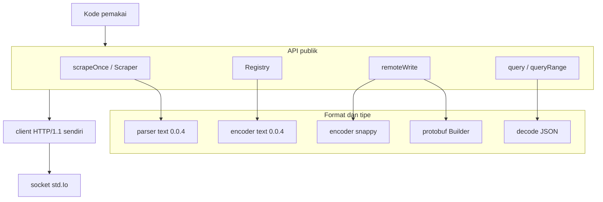
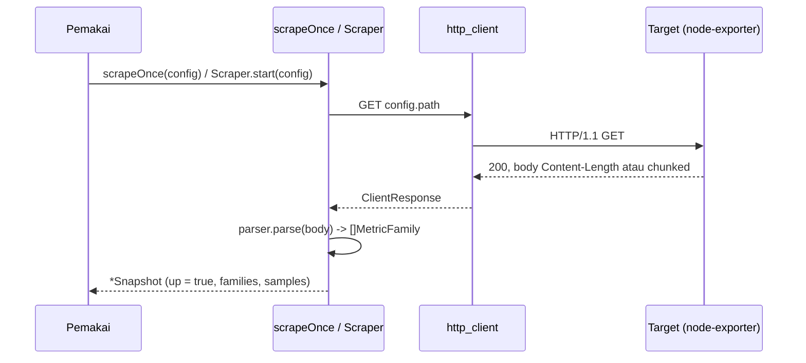
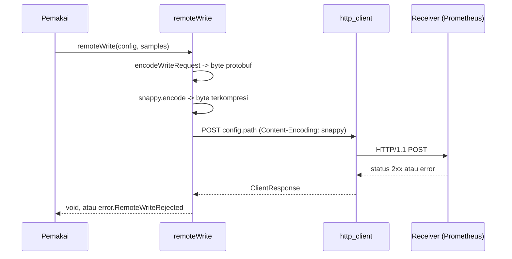
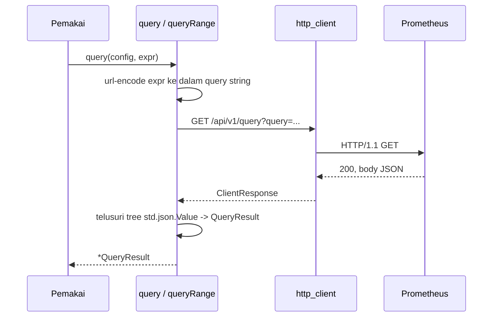

# Desain tingkat tinggi prometheuz

## Cakupan

prometheuz adalah driver Prometheus dan node-exporter murni Zig, hanya memakai standard library. Mencakup empat permukaan: menarik metrik (Prometheus text exposition format 0.0.4), mendorong metrik (`remote_write`, protobuf plus snappy), query (PromQL lewat HTTP JSON), dan registry metrik yang ditulis aplikasi untuk nilai yang tidak pernah berasal dari scrape. Dokumen ini mencakup bentuk driver: layer, komponen, empat flow, dan model concurrency. Detail wire-level ada di `lld-id.md`.

## Layer



- `scrapeOnce`/`Scraper`, `Registry`, `remoteWrite`, `query`/`queryRange` adalah empat permukaan publik independen. Tidak ada satu pun yang bergantung pada yang lain.
- Layer format meng-encode dan men-decode bentuk wire yang dibutuhkan tiap permukaan: text 0.0.4 dua arah, protobuf plus snappy untuk `remote_write`, JSON untuk response query.
- Setiap permukaan yang berkomunikasi lewat jaringan melewati `http_client.zig` yang sama, client HTTP/1.1 milik driver sendiri.

## Komponen

| Komponen | Tanggung jawab |
| :- | :- |
| `config.zig` | `ScrapeConfig`, `WriteConfig`, `QueryConfig` - config flat per-permukaan |
| `url.zig` | parse URL target `http://` menjadi config yang sesuai |
| `sample.zig` | `MetricType`, `Label`, `Sample`, `MetricFamily`, plus helper `bucket`/`quantile`/`sumSample`/`countSample` tanpa alokasi |
| `parser.zig` | parser text 0.0.4: HELP/TYPE, family histogram dan summary multi-line, escaping label, float khusus |
| `snapshot.zig` | `Snapshot`, hasil scrape yang di-parse dan ber-refcount |
| `scrape.zig` | `scrapeOnce`: satu GET plus parse, menangkap kegagalan alih-alih melempar error |
| `scraper.zig` | `Scraper`: thread poller latar belakang, publish dan read gaya RCU |
| `registry.zig` | `Registry`, `Counter`, `Gauge`, `CounterVec`, `GaugeVec` - metrik yang ditulis aplikasi |
| `expose.zig` | encoder text 0.0.4, kebalikan dari `parser.zig` |
| `protobuf.zig` | encoder varint dan length-delimited minimal untuk schema `WriteRequest` `remote_write` |
| `snappy.zig` | encoder block snappy literal saja |
| `remote_write.zig` | POST sample sebagai `WriteRequest` protobuf, terkompresi snappy |
| `query.zig` | query PromQL instant dan ranged, decode response JSON |
| `http_client.zig` | client HTTP/1.1 minimal milik driver sendiri |

## Client HTTP/1.1 sendiri, bukan zix.Http.Client

`http_client.zig` adalah client HTTP/1.1 standalone, bukan pemakaian ulang `zix.Http.Client`. Ada dua penghalang yang menyingkirkan opsi itu untuk paket standalone (batasan yang sama yang sudah dibawa `postgrez` dan `rediz`: tidak boleh bergantung balik ke zix sendiri):

- `client_config.zig` milik `zix.Http.Client` butuh `zon_options`, yang hanya disuntikkan oleh `build.zig` di root.
- `client.zig` milik `zix.Http.Client` selalu meng-import `h2_client.zig`, yang menyeret masuk `zix.Tls` dan HTTP/2.

`http_client.zig` meniru bentuk publik `zix.Http.Client` (`get`/`post`, `ClientResponse` dengan `status()`/`header()`/`body()`/`deinit()`) tanpa meng-import-nya, teknik yang sama dipakai `zix.Http.Client` sendiri di jalur `requestUds`-nya: connect, tulis byte request mentah, baca head response sampai `"\r\n\r\n"`, parse status line dan framing, lalu baca body.

Cleartext saja, GET dan POST saja. Dua mode framing body: `Content-Length` dan chunked transfer-encoding. Dukungan chunked tidak ada di cakupan awal, ditambahkan setelah validasi langsung terhadap node-exporter asli: node-exporter mengirim `Transfer-Encoding: chunked` tanpa `Content-Length` untuk response `/metrics`-nya, sehingga client yang hanya memahami `Content-Length` gagal terhadap target asli sejak request pertama. `connect_timeout_ms` diterima di setiap config demi kesamaan bentuk API tapi belum diberlakukan: `std.Io.Threaded.netConnectIpPosix` versi Zig ini panic pada permintaan timeout alih-alih mengembalikan error, bentuk "tersimpan, belum diterapkan" yang sama yang dibawa `zix.Http.Client` sendiri untuk sebagian timeout-nya.

## Flow scrape



Connect yang gagal, status non-200, atau error parse tidak pernah dilempar keluar dari `scrapeOnce`: hasilnya kembali sebagai `Snapshot` dengan `up = false` dan `last_error` terisi, sehingga target yang bermasalah bisa diamati lewat nilai yang dikembalikan, bukan error yang harus ditangkap pemanggil.

## Flow remote_write



Setiap `Sample` menjadi satu `TimeSeries`: namanya berjalan sebagai label `__name__` konvensional (konvensi yang sama dipakai Prometheus asli), label miliknya sendiri mengikuti, satu titik `Sample` membawa nilai dan timestamp (dicap dengan waktu wall-clock saat itu bila sample tidak punya timestamp).

## Flow query



Response di-decode lewat tree `std.json.Value` dinamis, bukan parse struct typed: satu titik PromQL berbentuk `[angka_timestamp, "string_nilai"]`, bentuk yang tidak bisa dideskripsikan struct tetap secara bersih. `query` mengisi `result_type = .vector`, `queryRange` mengisi `.matrix`, hanya field yang sesuai pada `QueryResult` yang terisi.

## Registry yang ditulis aplikasi (Registry)

```mermaid
flowchart TB
    reg[Registry]
    cv[CounterVec]
    gv[GaugeVec]
    cell[Cell Counter / Gauge]
    hot[pemanggil: .with(label_values).inc / .add / .set]

    reg --> cv
    reg --> gv
    cv --> cell
    gv --> cell
    hot -->|pertama kali: alokasi + lock| cell
    hot -->|sudah ada: CAS loop, tanpa lock| cell
```

Cell `Counter`/`Gauge` menyimpan `f64` yang di-bit-cast di dalam `atomic.Value(u64)` (std tidak punya primitive float atomic), sehingga `add()` adalah CAS loop. `CounterVec` dan `GaugeVec` adalah satu bentuk generic `Vec(Cell, metric_type)`: `StringHashMapUnmanaged` dari key gabungan nilai label ke cell yang dialokasikan di heap, dijaga spinlock (`atomic.Value(bool)`, idiom yang sama dipakai `Scraper` dan `postgrez.Pool`) hanya di sekitar lookup dan insert. Begitu kombinasi label sudah ada, mencatat nilai tidak pernah alokasi, tidak pernah lock, dan tidak pernah blocking: hanya panggilan pertama `.with()` untuk kombinasi baru yang menyentuh lock.

`.with()` tidak pernah mengembalikan error ke pemanggil. Kegagalan alokasi pada kombinasi label baru jatuh ke cell discard bersama alih-alih merambat ke hot path aplikasi: pemanggilan metrik tidak boleh menjadi alasan sebuah request gagal.

`Registry.snapshot()` meratakan setiap cell yang tercatat menjadi `[]Sample` (jalur push, masuk ke `remoteWrite`), `Registry.families()` membangun `[]MetricFamily` (jalur pull, masuk ke `expose()` untuk route `GET /metrics` milik aplikasi sendiri).

## Model concurrency

- Publish dan read `Scraper` bergaya RCU: spinlock hanya menjaga swap pointer yang diterbitkan dan penambahan refcount, I/O jaringan milik scrape sendiri berjalan di luar lock, sehingga pembaca yang memanggil `latest()` tidak pernah menunggu scrape yang sedang berjalan.
- `Snapshot` ber-refcount (`atomic.Value(u32)`): `retain()` sebelum menyerahkannya ke pembaca lain, `release()`/`deinit()` setelah selesai, arena hanya dibebaskan saat count mencapai nol.
- Spinlock per-`Vec` milik `Registry` hanya menjaga pembuatan cell, bukan pembaruan cell: dua thread yang meng-increment `Counter` yang sama yang sudah ada hanya bersaing pada CAS loop di dalam `addBits`, tidak pernah pada lock.

## Container dan example

`containers/node-exporter/` dan `containers/prometheus/` (root repo) mengikuti pola yang sama dipakai `postgrez`/`rediz` untuk container mereka sendiri: `build.zig` membangun image, mengganti container lama, menjalankannya detached dengan publish host port eksplisit. `zig build test-runner` memegang siklus hidup kedua container untuk 9 example sekali jalan di bawah `examples/`.

`examples/registry_live_demo.zig` adalah satu pengecualian yang berjalan terus-menerus: ia mendaftarkan sebuah counter, loop selamanya push dan query balik nilainya sehingga browser yang dibuka pada URL Prometheus yang dicetak menunjukkan nilainya update secara live, dan memegang siklus hidup docker network serta container node-exporter dan prometheus miliknya sendiri (cek-hidup, start-jika-belum-ada, teardown hanya yang ia mulai sendiri saat `SIGINT`). Ia bukan bagian dari `zig build test-runner`: demo tanpa kondisi keluar tidak punya marker "done" untuk dicek.

## Keputusan desain

- **Empat permukaan independen, tanpa config bersama**: target scrape, receiver remote_write, dan endpoint API query adalah tiga server berbeda pada deployment nyata, sehingga `ScrapeConfig`/`WriteConfig`/`QueryConfig` tetap struct flat terpisah alih-alih satu struct dengan field yang tidak berlaku untuk semua permukaan.
- **Client HTTP/1.1 sendiri**: lihat bagian di atas. Cleartext saja untuk v1, tidak ada field `tls` di `config.zig` sampai client yang mendukung TLS hadir.
- **Snapshot bersifat immutable dan ber-refcount**, tidak pernah dimutasi di tempat: `Scraper` yang menerbitkan snapshot segar setiap interval tidak bisa membatalkan `Snapshot` yang masih ditelusuri pembaca.
- **Registry tidak pernah melempar error di hot path**: mencatat nilai metrik tidak boleh pernah menjadi alasan logika aplikasi gagal, sehingga `.with()` turun ke cell discard di bawah tekanan memori alih-alih mengembalikan error.
- **snappy literal saja**: matcher LZ77 asli ditunda. Encoding-nya spec-valid (decoder snappy harus menerima stream all-literal) dan server Prometheus asli men-decode-nya dengan benar, potongan cakupan v1 ada di rasio kompresi, bukan kebenaran. Payload remote_write yang didorong driver ini (satu scrape atau snapshot registry) berukuran sedang, sehingga ini menjaga encoder tetap kecil dan mudah diverifikasi.
- **Response PromQL di-decode lewat tree JSON dinamis**, bukan parse struct typed: bentuk titik (`[angka_timestamp, "string_nilai"]`) tidak bisa dipetakan dengan bersih ke parse typed `std.json`.
