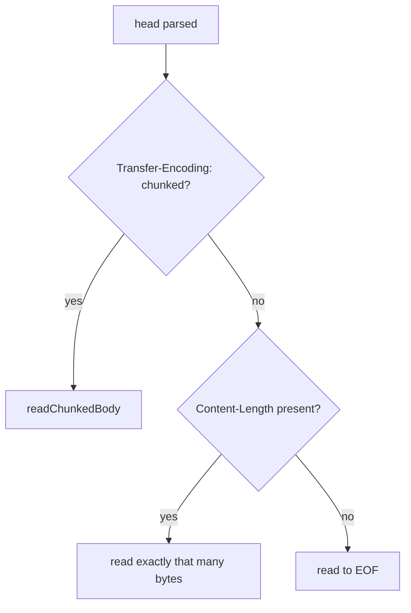

# prometheuz low-level design

This document covers the wire-level and internal detail. For the shape of the driver read `hld-en.md` first.

## HTTP/1.1 framing (`http_client.zig`)

The client writes the request line, `Host`, `Connection: close`, any caller headers, then `Content-Length` and the body (empty body sends `Content-Length: 0`). It reads the response in two phases:

1. Read into a fixed `HEAD_SCAN_BUF` (8192 bytes) until `"\r\n\r\n"` is found. `error.InvalidResponse` if the head never terminates within that buffer, `error.ConnectionClosed` if the peer closes first.
2. Parse the status line and, from the head, `Content-Length` and `Transfer-Encoding`. Then read the body by whichever framing the response declared:



`Connection: close` on every request means EOF-framing (no `Content-Length`, no chunked) is well-defined: the socket closing is the end of the body.

### Chunked decoding

Real requirement, not speculative: node-exporter's Go server (`net/http`) sends `Transfer-Encoding: chunked` with no `Content-Length` for `/metrics`, so this path is exercised by the driver's most basic example. `readChunkedBody` maintains a small `carry` buffer seeded with whatever body bytes were already read into the head-scan buffer, then loops:

1. `takeLine` - read up to the next `\r\n`, pulling more bytes from the socket into `carry` as needed. That line is the chunk-size line: a `;` extension suffix is stripped before parsing the size as hex.
2. Size `0` ends the body (trailer headers, if any, are read but not preserved - the socket closes right after regardless).
3. `takeExact` - read exactly `chunk_size` bytes, append to the output, then `takeExact` the trailing 2-byte CRLF and discard it.

`fillMore` is the only function that calls `std.posix.read` directly. `takeLine`/`takeExact` both loop on it until they have enough buffered. This keeps the chunk-boundary bookkeeping in one place regardless of how the socket happens to fragment the reads.

### The `@min` narrow-type pitfall

Both the chunked reader and the `Content-Length` reader touch a `usize`-sensitive accumulator (`body_received`/`written`). `@min(a, b)` over operands where one traces back to a comptime-bounded source can infer a type narrower than `usize`, which then silently wraps on the accumulating `+=`. This bit the `Content-Length` path during live validation (see the root plan doc's bug log) and is now guarded with an explicit `const initial: usize = @min(...)` annotation. Any future `@min`/`@max` added to this file should get the same explicit annotation before it feeds a loop accumulator or a shift.

## Text exposition format 0.0.4 (`parser.zig`)

Line-oriented: split on `\n`, trim a trailing `\r`, skip blank lines.

| Line shape | Handling |
| :- | :- |
| `# HELP <name> <text>` | flushes the current family builder, starts a new one, HELP text unescaped (`\\`, `\n`, not `\"` - HELP is never quoted) |
| `# TYPE <name> <type>` | sets `metric_type` on the current builder if the name matches, otherwise flushes and starts a new one |
| `# ...` (anything else) | plain comment, ignored |
| `name{labels} value [timestamp]` or `name value [timestamp]` | one sample, appended to the current builder when `matchesFamily` accepts it, otherwise flushes and starts an untyped one-sample family |

`matchesFamily(sample_name, family_name, family_type)` is what lets `_bucket`/`_sum`/`_count` (histogram) and `_sum`/`_count` (summary) lines stay grouped under their base family name without HELP/TYPE repeating it per line - an exact name match always matches, a suffix match only applies for `.histogram`/`.summary` families.

Label parsing (`parseLabels`) walks `name="value"` pairs separated by `,`/space, honoring backslash-escaped quotes inside a value so a literal `"` or `}` in a label value does not end the block early (`findClosingBrace` does the same in-quote tracking for the outer `{...}`). `unescapeText` handles `\\`, `\n`, and (label values only) `\"`, returning the input slice unmodified when there is nothing to unescape (the common case, no extra allocation).

`parseSampleValue` accepts `+Inf`/`Inf`/`-Inf`/`Nan`/`NaN` alongside `std.fmt.parseFloat`, matching what a real Prometheus target emits for those metrics.

## App-authored registry text encoding (`expose.zig`)

The inverse of `parser.zig`: for each family, one `# HELP`/`# TYPE` pair, then one line per sample. `writeEscaped` mirrors the parser's unescape rules in reverse: `\` and `\n` always, `"` only for label values (matching that HELP text is never quoted on the way in either). `writeValue` writes `Nan`/`+Inf`/`-Inf` for the corresponding `f64` special values instead of what `{d}` would otherwise print. `expose()` and `parser.parse()` round-trip: encoding a `Registry`'s state and re-parsing it back reproduces the same samples (tested directly).

## remote_write wire format

`WriteRequest`, matching real Prometheus's protobuf schema:

```
WriteRequest    { repeated TimeSeries timeseries = 1 }
TimeSeries      { repeated Label labels = 1; repeated Sample samples = 2 }
Label           { string name = 1; string value = 2 }
Sample          { double value = 1; int64 timestamp = 2 }
```

`protobuf.zig`'s `Builder` implements only what this schema needs: `writeString`/`writeMessage` (wire type 2, tag + varint length + bytes), `writeDouble` (wire type 1, little-endian fixed64), `writeInt64` (wire type 0, plain varint of the two's-complement bit pattern, not zigzag `sint64`). `remote_write.zig` builds bottom-up: one `Label` message per label (the metric name first, as the conventional `__name__` label), one `Sample` message for the point, both nested into one `TimeSeries` message, one `TimeSeries` per input `Sample`, all nested into the outer `WriteRequest`.

The encoded `WriteRequest` bytes are then snappy-compressed (`snappy.zig`) before the POST. `snappy.zig` writes a varint uncompressed-length preamble, then splits the input into literal elements of at most 60 bytes (`MAX_LITERAL_CHUNK`), each with a one-byte tag `(chunk_len - 1) << 2` (wire type `00` = literal, so every tag fits one byte). This is spec-valid but not compressing: it never emits a copy/back-reference element, real snappy decoders accept an all-literal stream by design. See `hld-en.md`'s design decisions for why this is a deliberate v1 scope cut rather than a defect.

`checkStatus` accepts any 2xx, everything else (including a network failure) surfaces as `error.RemoteWriteRejected` or the underlying transport error.

## PromQL response decode (`query.zig`)

```json
{"status":"success","data":{"resultType":"vector","result":[
  {"metric":{"__name__":"up","job":"prometheus"},"value":[1435781451.781,"1"]}
]}}
```

`parseResponse` parses the body with `std.json.parseFromSliceLeaky(std.json.Value, arena, body, .{})`, then walks the tree by hand (`jsonObject`/`jsonArray`/`jsonString`/`jsonNumber` helpers) rather than a typed struct parse: a PromQL point is a two-element JSON array `[number, "string"]` (the value travels as a string to preserve full float precision), which a fixed struct shape cannot describe. `"status": "error"` in the body (a well-formed but failed query) surfaces as `error.QueryFailed`, same as a non-200 HTTP status. A body that fails to parse as JSON, or has an unexpected shape at any step, surfaces as `error.InvalidResponse`.

`resultType: "vector"` populates `QueryResult.vector` (`[]VectorEntry`, one `(metric labels, timestamp, value)` per series), `"matrix"` populates `.matrix` (`[]MatrixEntry`, one `(metric labels, []Point)` per series - a `queryRange` call, one point per step). `"scalar"`/`"string"` results set `result_type` but leave both slices empty (no example or caller in this driver needs them decoded further yet).

Query expressions URL-encode through `urlEncodeAppend`: alphanumerics and `-_.~` pass through unreserved, everything else becomes `%XX`.

## Error taxonomy

| Error | Surface | Meaning |
| :- | :- | :- |
| `Snapshot.up = false`, `.last_error` set | `scrapeOnce`/`Scraper` | scrape failed (connect, non-200, parse) - observed through the value, never thrown |
| `error.InvalidSample` | `parser.parse` | malformed label block, value, or timestamp |
| `error.UnsupportedScheme` | `url.zig` | target URL is not `http://` |
| `error.InvalidUrl` | `url.zig` | malformed host or port in a target URL |
| `error.ConnectionClosed` | `http_client` | peer closed before a full head or body arrived |
| `error.InvalidResponse` | `http_client` | no `"\r\n\r\n"` within `HEAD_SCAN_BUF`, or a malformed chunk size line |
| `error.BodyTooLarge` | `http_client` | response body exceeded `max_response_body` |
| `error.RemoteWriteRejected` | `remote_write` | receiver returned a non-2xx status |
| `error.QueryFailed` | `query`/`queryRange` | non-200 response, or `"status": "error"` in an otherwise well-formed body |
| `error.InvalidResponse` | `query`/`queryRange` | malformed JSON, or an unexpected shape in an otherwise-valid JSON body |

## Config reference

See `config-en.md` for the full field list per config (`ScrapeConfig`, `WriteConfig`, `QueryConfig`) and their defaults.
