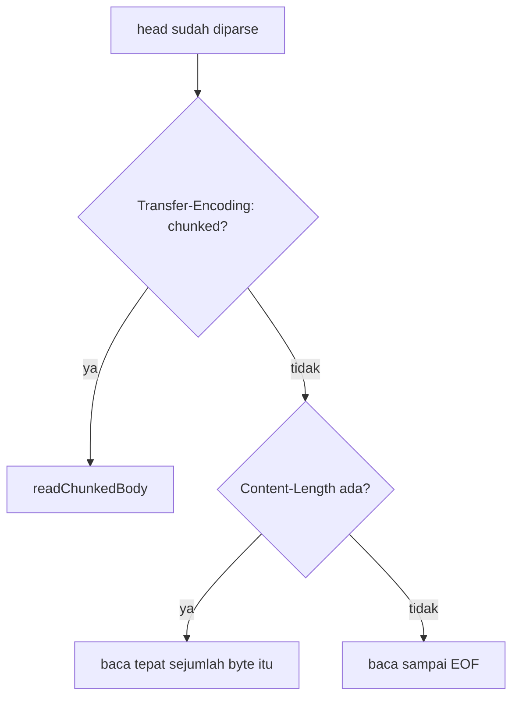

# Desain tingkat rendah prometheuz

Dokumen ini mencakup detail wire-level dan internal. Untuk bentuk driver baca `hld-id.md` dulu.

## Framing HTTP/1.1 (`http_client.zig`)

Client menulis request line, `Host`, `Connection: close`, header milik pemanggil, lalu `Content-Length` dan body (body kosong mengirim `Content-Length: 0`). Ia membaca response dalam dua fase:

1. Baca ke `HEAD_SCAN_BUF` tetap (8192 byte) sampai `"\r\n\r\n"` ditemukan. `error.InvalidResponse` bila head tidak pernah berakhir dalam buffer itu, `error.ConnectionClosed` bila peer menutup lebih dulu.
2. Parse status line dan, dari head, `Content-Length` dan `Transfer-Encoding`. Lalu baca body sesuai framing yang dideklarasikan response:



`Connection: close` pada setiap request membuat framing EOF (tanpa `Content-Length`, tanpa chunked) terdefinisi dengan baik: socket yang tertutup adalah akhir dari body.

### Decoding chunked

Kebutuhan nyata, bukan spekulatif: server Go milik node-exporter (`net/http`) mengirim `Transfer-Encoding: chunked` tanpa `Content-Length` untuk `/metrics`, sehingga jalur ini dilewati example paling dasar milik driver. `readChunkedBody` memegang buffer `carry` kecil yang diisi dengan byte body yang sudah terbaca ke buffer head-scan, lalu loop:

1. `takeLine` - baca sampai `\r\n` berikutnya, menarik lebih banyak byte dari socket ke `carry` sesuai kebutuhan. Baris itu adalah baris ukuran chunk: akhiran extension `;` dibuang dulu sebelum ukurannya diparse sebagai hex.
2. Ukuran `0` mengakhiri body (header trailer, bila ada, dibaca tapi tidak disimpan - socket tetap tertutup segera setelahnya).
3. `takeExact` - baca tepat `chunk_size` byte, tambahkan ke output, lalu `takeExact` 2 byte CRLF penutup dan buang.

`fillMore` adalah satu-satunya fungsi yang memanggil `std.posix.read` langsung, `takeLine`/`takeExact` keduanya loop memanggilnya sampai cukup ter-buffer. Ini menjaga pembukuan batas chunk di satu tempat terlepas dari bagaimana socket kebetulan memecah pembacaan.

### Jebakan tipe sempit `@min`

Baik reader chunked maupun reader `Content-Length` menyentuh akumulator sensitif-`usize` (`body_received`/`written`). `@min(a, b)` atas operand di mana salah satunya berasal dari sumber comptime-bounded bisa menyimpulkan tipe lebih sempit dari `usize`, yang kemudian secara diam-diam wrap pada `+=` yang mengakumulasi. Ini pernah menggigit jalur `Content-Length` saat validasi langsung (lihat log bug pada plan doc di root) dan sekarang dijaga dengan anotasi eksplisit `const initial: usize = @min(...)`. `@min`/`@max` apa pun yang ditambahkan ke file ini di masa depan sebaiknya mendapat anotasi eksplisit yang sama sebelum hasilnya masuk ke akumulator loop atau shift.

## Text exposition format 0.0.4 (`parser.zig`)

Berbasis baris: split pada `\n`, trim `\r` di akhir, lewati baris kosong.

| Bentuk baris | Penanganan |
| :- | :- |
| `# HELP <name> <text>` | flush family builder saat ini, mulai yang baru, text HELP di-unescape (`\\`, `\n`, bukan `\"` - HELP tidak pernah dikutip) |
| `# TYPE <name> <type>` | set `metric_type` pada builder saat ini bila nama cocok, kalau tidak flush dan mulai yang baru |
| `# ...` (selain itu) | komentar biasa, diabaikan |
| `name{labels} value [timestamp]` atau `name value [timestamp]` | satu sample, ditambahkan ke builder saat ini bila `matchesFamily` menerimanya, kalau tidak flush dan mulai family untyped satu-sample |

`matchesFamily(sample_name, family_name, family_type)` adalah yang membuat baris `_bucket`/`_sum`/`_count` (histogram) dan `_sum`/`_count` (summary) tetap terkelompok di bawah nama family dasarnya tanpa HELP/TYPE mengulanginya per baris - kecocokan nama persis selalu cocok, kecocokan suffix hanya berlaku untuk family `.histogram`/`.summary`.

Parsing label (`parseLabels`) menelusuri pasangan `name="value"` yang dipisah `,`/spasi, menghormati quote yang di-escape backslash di dalam value sehingga `"` atau `}` literal di dalam nilai label tidak mengakhiri block lebih awal (`findClosingBrace` melakukan pelacakan in-quote yang sama untuk `{...}` luar). `unescapeText` menangani `\\`, `\n`, dan (nilai label saja) `\"`, mengembalikan slice input tanpa perubahan bila tidak ada yang perlu di-unescape (kasus umum, tanpa alokasi tambahan).

`parseSampleValue` menerima `+Inf`/`Inf`/`-Inf`/`Nan`/`NaN` di samping `std.fmt.parseFloat`, sesuai dengan yang dikeluarkan target Prometheus asli untuk metrik-metrik itu.

## Encoding text registry yang ditulis aplikasi (`expose.zig`)

Kebalikan dari `parser.zig`: untuk tiap family, satu pasang `# HELP`/`# TYPE`, lalu satu baris per sample. `writeEscaped` mencerminkan aturan unescape parser secara terbalik: `\` dan `\n` selalu, `"` hanya untuk nilai label (sesuai bahwa text HELP tidak pernah dikutip pada jalur masuknya juga). `writeValue` menulis `Nan`/`+Inf`/`-Inf` untuk nilai `f64` khusus yang bersangkutan alih-alih apa yang akan dicetak `{d}`. `expose()` dan `parser.parse()` round-trip: meng-encode state `Registry` lalu mem-parse-nya kembali menghasilkan sample yang sama (diuji langsung).

## Format wire remote_write

`WriteRequest`, sesuai schema protobuf Prometheus asli:

```
WriteRequest    { repeated TimeSeries timeseries = 1 }
TimeSeries      { repeated Label labels = 1; repeated Sample samples = 2 }
Label           { string name = 1; string value = 2 }
Sample          { double value = 1; int64 timestamp = 2 }
```

`Builder` milik `protobuf.zig` hanya mengimplementasikan yang dibutuhkan schema ini: `writeString`/`writeMessage` (wire type 2, tag + panjang varint + byte), `writeDouble` (wire type 1, fixed64 little-endian), `writeInt64` (wire type 0, varint biasa dari pola bit two's-complement, bukan encoding zigzag `sint64`). `remote_write.zig` membangun dari bawah ke atas: satu pesan `Label` per label (nama metrik lebih dulu, sebagai label `__name__` konvensional), satu pesan `Sample` untuk titiknya, keduanya bersarang ke dalam satu pesan `TimeSeries`, satu `TimeSeries` per `Sample` input, semuanya bersarang ke dalam `WriteRequest` luar.

Byte `WriteRequest` yang sudah di-encode lalu dikompres snappy (`snappy.zig`) sebelum POST. `snappy.zig` menulis preamble panjang-tak-terkompresi bervarint, lalu memecah input menjadi elemen literal maksimal 60 byte (`MAX_LITERAL_CHUNK`), masing-masing dengan tag satu-byte `(chunk_len - 1) << 2` (wire type `00` = literal, sehingga setiap tag muat satu byte). Ini spec-valid tapi tidak mengompres: tidak pernah mengeluarkan elemen copy/back-reference, decoder snappy asli menerima stream all-literal secara desain. Lihat keputusan desain di `hld-id.md` untuk alasan ini adalah potongan cakupan v1 yang disengaja, bukan defect.

`checkStatus` menerima status 2xx apa pun, selain itu (termasuk kegagalan jaringan) muncul sebagai `error.RemoteWriteRejected` atau error transport yang mendasarinya.

## Decode response PromQL (`query.zig`)

```json
{"status":"success","data":{"resultType":"vector","result":[
  {"metric":{"__name__":"up","job":"prometheus"},"value":[1435781451.781,"1"]}
]}}
```

`parseResponse` mem-parse body dengan `std.json.parseFromSliceLeaky(std.json.Value, arena, body, .{})`, lalu menelusuri tree-nya secara manual (helper `jsonObject`/`jsonArray`/`jsonString`/`jsonNumber`) alih-alih parse struct typed: satu titik PromQL adalah array JSON dua elemen `[number, "string"]` (nilainya berjalan sebagai string demi menjaga presisi float penuh), bentuk yang tidak bisa dideskripsikan struct tetap. `"status": "error"` di body (query yang well-formed tapi gagal) muncul sebagai `error.QueryFailed`, sama seperti status HTTP non-200, body yang gagal diparse sebagai JSON, atau punya bentuk tak terduga di langkah mana pun, muncul sebagai `error.InvalidResponse`.

`resultType: "vector"` mengisi `QueryResult.vector` (`[]VectorEntry`, satu `(label metric, timestamp, value)` per series), `"matrix"` mengisi `.matrix` (`[]MatrixEntry`, satu `(label metric, []Point)` per series - panggilan `queryRange`, satu titik per step). Hasil `"scalar"`/`"string"` mengatur `result_type` tapi membiarkan kedua slice kosong (belum ada contoh atau pemanggil di driver ini yang butuh keduanya di-decode lebih lanjut).

Ekspresi query di-URL-encode lewat `urlEncodeAppend`: alfanumerik dan `-_.~` lewat tanpa perubahan, selain itu menjadi `%XX`.

## Taksonomi error

| Error | Permukaan | Arti |
| :- | :- | :- |
| `Snapshot.up = false`, `.last_error` terisi | `scrapeOnce`/`Scraper` | scrape gagal (connect, non-200, parse) - diamati lewat nilainya, tidak pernah dilempar |
| `error.InvalidSample` | `parser.parse` | block label, value, atau timestamp yang malformed |
| `error.UnsupportedScheme` | `url.zig` | URL target bukan `http://` |
| `error.InvalidUrl` | `url.zig` | host atau port yang malformed di URL target |
| `error.ConnectionClosed` | `http_client` | peer menutup sebelum head atau body penuh tiba |
| `error.InvalidResponse` | `http_client` | tidak ada `"\r\n\r\n"` dalam `HEAD_SCAN_BUF`, atau baris ukuran chunk yang malformed |
| `error.BodyTooLarge` | `http_client` | body response melebihi `max_response_body` |
| `error.RemoteWriteRejected` | `remote_write` | receiver mengembalikan status non-2xx |
| `error.QueryFailed` | `query`/`queryRange` | response non-200, atau `"status": "error"` pada body yang sebenarnya well-formed |
| `error.InvalidResponse` | `query`/`queryRange` | JSON malformed, atau bentuk tak terduga pada body JSON yang sebenarnya valid |

## Referensi config

Lihat `config-id.md` untuk daftar field lengkap per config (`ScrapeConfig`, `WriteConfig`, `QueryConfig`) dan default-nya.
