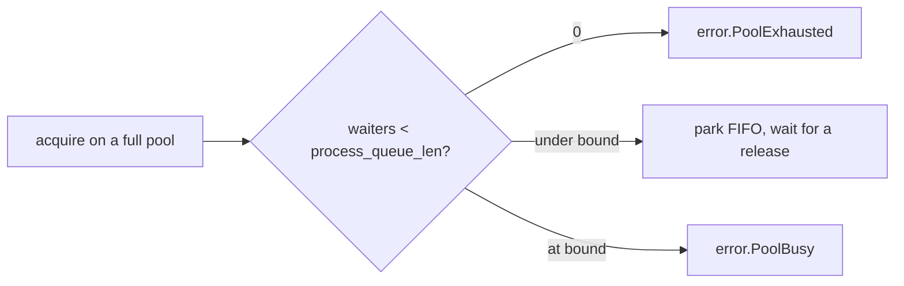

# rediz Config Reference

What every `rediz.Config` field means, and how changing it affects a running process. One flat config is shared by `Conn` and `Pool`: the connection reads the top group, the pool adds the rest. Each field lists its default, what it controls, and the tuning trade-offs. A deeper section at the end works the arithmetic behind the two load-bearing knobs, `max_pending_replies` and `process_queue_len`.

## How to read the columns

A cell is left blank when it does not apply (a required handle has no tuning trade-off).

| column | meaning |
| :- | :- |
| field | the config struct field name |
| default | the value used when the field is omitted |
| controls | what the field does |
| perf impact | where it sits (hot path, per-conn, pool, startup) and which metric it moves |
| how to tweak | direction of change for a goal |
| if lower | consequence of a smaller value |
| if higher | consequence of a larger value |
| knob consequence | the main risk if it is misconfigured |

## Config (`rediz.Config`)

| field | default | controls | perf impact | how to tweak | if lower | if higher | knob consequence |
| :- | :- | :- | :- | :- | :- | :- | :- |
| ip | `127.0.0.1` | server host, IP literal or hostname | startup (a hostname adds a lookup) | set the Redis host | | | a hostname goes through the hosts and DNS lookup |
| port | `6379` | server port | | set the Redis port | | | |
| user | `""` | ACL user, empty uses the default user | | set for ACL auth | | | empty uses the default user |
| password | `""` | password, empty means no auth | | set for AUTH | | | empty skips authentication |
| database | `0` | SELECT index after the handshake | one SELECT at connect | set a non-default database | | | 0 stays on the default database |
| client_name | `rediz` | CLIENT name set through HELLO (RESP3), null = none | startup only | set to label the connection | | | cosmetic, aids server-side observability, RESP3 path only |
| conn_timeout_ms | `10000` | connect plus handshake bound in ms, 0 disables | startup latency guard | lower to fail fast on an unreachable host | connect gives up sooner | a dead host blocks longer | 0 waits indefinitely on a black-hole host |
| protocol_version | `.AUTO` | wire protocol: `.AUTO`, `.RESP2`, `.RESP3` | startup | leave `.AUTO` | | | `.AUTO` sends HELLO 3 and falls back to RESP2 when refused |
| tls | `.OFF` | TLS behavior: `.OFF`, `.REQUIRE` | a separate perf band (handshake plus per-record AEAD) | `.REQUIRE` over an untrusted network (or a `rediss://` URL) | | | a Redis TLS port is TLS from the first byte, there is no in-band upgrade |
| max_pending_replies | `16` | replies one connection may owe: the pipeline bound and the outstanding-deferred bound, 0 = no bound | hot: batch depth and deferred backpressure | match to the batch you pipeline (see the sizing section) | shallower batches, more round trips | a stalled server grows the send buffer | 0 removes the bound, an unbounded producer can grow memory |
| process_queue_len | `0` | pool only: parked-acquire bound, 0 = no parking | acquire behavior under a full pool | set to worker count plus a margin (see the sizing section) | acquire sheds instead of parking | more threads park (block) instead of shedding | 0 sheds `error.PoolExhausted` at once, beyond the bound sheds `error.PoolBusy` |
| pool_size | `6` | pool only: connections per pool | throughput is roughly `pool_size / round_trip` | raise for more concurrent commands (see the sizing section) | commands queue on the pool | more server connections and memory | each connection is one server-side client, stay under the server `maxclients` |
| retry_max | `3` | pool only: connect attempts per acquire beyond the first | acquire latency on a flaky connect | raise for a flaky network | acquire gives up on connect sooner | acquire retries longer before failing | total attempts is `retry_max + 1` |
| retry_delay_ms | `250` | pool only: delay between connect retries | acquire latency during retries | lower for faster retry, raise to back off | tighter retry loop | slower recovery, gentler on the server | the delay applies between attempts, not before the first |

## Sizing max_pending_replies and process_queue_len

These two knobs decide how much work is in flight at once. The rest of this section is the arithmetic behind their defaults and how to pick better values for a workload.

### The base rate of one connection

A synchronous connection does one command per round trip: send, wait, read the reply. Its ceiling is:

```
commands_per_second_per_connection = 1 / round_trip_latency
```

At a 0.2 ms round trip that is about 5,000 commands per second on one connection. To go faster you must put more than one command in flight, and Little's law says how much:

```
in_flight = arrival_rate x latency
```

To sustain `N` commands per second at latency `L`, you need `N x L` commands in flight. rediz offers two ways to get there, both governed by these knobs.

### max_pending_replies for pipelining

A pipeline puts several commands on one connection behind a single flush. Without it, `K` commands cost `K` round trips and about `2K` socket syscalls. Pipelined at depth `K`:

```
syscalls  : about 2K   ->  about 2   (one send of all K, one receive burst)
wall time : K x round_trip  ->  round_trip + K x server_exec
```

`max_pending_replies` is the depth bound: `Pipeline.add` past the bound sheds `error.QueueFull`, so a runaway producer cannot grow the send buffer without limit. Set it to the batch depth you actually pipeline. Too low serializes into more round trips, too high lets a stalled server buffer unbounded, 0 removes the bound.

### max_pending_replies for the deferred write-behind path

The same knob bounds the deferred path. `setDeferred` and `delDeferred` send the command now but do not wait for the reply, they record one owed reply that drains before the next reply-reading call. For a write-behind mirror this removes the reply-wait from the hot path:

```
cache fill without deferred : GET(miss) + query + SET        -> SET costs a full round trip on the hot path
cache fill with deferred    : GET(miss) + query + SET-deferred -> the SET reply piggybacks on the next read, no extra wait
```

The owed-reply count is bounded by `max_pending_replies` (0 acts as one at a time), so the connection drains at the bound instead of growing memory when the server stalls. A server error in the drain is counted into `deferredErrorCount`, not thrown, a transport error is thrown so the caller drops the connection. This keeps a mirror off the request latency path without an extra thread.

### process_queue_len: what happens when the pool is full

`process_queue_len` bounds how many `acquire` callers may park (block) on a fully-held pool:



- 0 means no parking: a full pool sheds `error.PoolExhausted` at once. Choose this for immediate backpressure to the caller.
- `N` parks up to `N` acquires FIFO and hands each released connection to the oldest waiter. Beyond `N`, acquire sheds `error.PoolBusy`.
- Rule of thumb: the worker count plus a small margin, so a transient stall parks and a real overload sheds.

### pool_size: how many connections

Each pooled connection is one server-side client, so the total `pool_size` across every client must stay under the server `maxclients`. When commands are independent, the pool throughput ceiling is:

```
pool_throughput = pool_size / round_trip_latency
```

Note that a per-worker single connection with the deferred path is often enough for a write-behind mirror: one connection per thread with no lock is the shared-nothing ideal, and the deferred path already keeps the reply-wait off the hot path. Widen the pool when a single connection per worker cannot keep up with independent commands.

## Notes

- No field is strictly required: `user` and `password` default to empty (no auth), the rest have working defaults.
- `max_pending_replies` applies per connection, to both the `Pipeline` and the deferred write-behind queue.
- `process_queue_len`, `pool_size`, `retry_max`, and `retry_delay_ms` matter only for `Pool`, a bare `Conn` ignores them.
- A Redis TLS port speaks TLS from the first byte, so `tls = .REQUIRE` (or `rediss://`) is per-port, there is no `.PREFER` mode.
