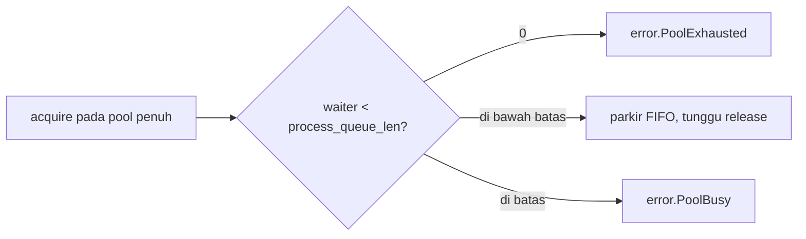

# Rujukan Config rediz

Arti tiap field `rediz.Config`, dan bagaimana mengubahnya memengaruhi proses yang berjalan. Satu config flat dipakai bersama oleh `Conn` dan `Pool`: koneksi membaca grup atas, pool memakai sisanya. Tiap field mencantumkan default-nya, apa yang dikendalikannya, dan trade-off penyetelannya. Bagian lebih dalam di akhir mengerjakan aritmetika di balik dua knob paling menentukan, `max_pending_replies` dan `process_queue_len`.

## Cara membaca kolom

Sel dikosongkan bila tidak berlaku (handle wajib tidak punya trade-off penyetelan).

| kolom | arti |
| :- | :- |
| field | nama field struct config |
| default | nilai yang dipakai saat field dihilangkan |
| controls | apa yang dilakukan field |
| perf impact | di mana ia berada (hot path, per-conn, pool, startup) dan metrik apa yang digesernya |
| how to tweak | arah perubahan untuk sebuah tujuan |
| if lower | konsekuensi nilai lebih kecil |
| if higher | konsekuensi nilai lebih besar |
| knob consequence | risiko utama bila salah setel |

## Config (`rediz.Config`)

| field | default | controls | perf impact | how to tweak | if lower | if higher | knob consequence |
| :- | :- | :- | :- | :- | :- | :- | :- |
| ip | `127.0.0.1` | host server, IP literal atau hostname | startup (hostname menambah lookup) | setel host Redis | | | hostname melewati lookup hosts dan DNS |
| port | `6379` | port server | | setel port Redis | | | |
| user | `""` | ACL user, kosong memakai user default | | setel untuk ACL auth | | | kosong memakai user default |
| password | `""` | password, kosong berarti tanpa auth | | setel untuk AUTH | | | kosong melewati autentikasi |
| database | `0` | indeks SELECT setelah handshake | satu SELECT saat connect | setel database non-default | | | 0 tetap di database default |
| client_name | `rediz` | nama CLIENT lewat HELLO (RESP3), null = tidak ada | startup saja | setel untuk melabeli koneksi | | | kosmetik, membantu observability sisi server, jalur RESP3 saja |
| conn_timeout_ms | `10000` | batas connect plus handshake dalam ms, 0 menonaktifkan | penjaga latency startup | turunkan agar gagal cepat pada host tak terjangkau | connect menyerah lebih cepat | host mati memblokir lebih lama | 0 menunggu tanpa batas pada host black-hole |
| protocol_version | `.AUTO` | wire protocol: `.AUTO`, `.RESP2`, `.RESP3` | startup | biarkan `.AUTO` | | | `.AUTO` mengirim HELLO 3 dan fallback ke RESP2 saat ditolak |
| tls | `.OFF` | perilaku TLS: `.OFF`, `.REQUIRE` | band perf terpisah (handshake plus AEAD per record) | `.REQUIRE` di jaringan tak tepercaya (atau URL `rediss://`) | | | port TLS Redis adalah TLS dari byte pertama, tidak ada upgrade in-band |
| max_pending_replies | `16` | reply yang boleh tertunggak satu koneksi: batas pipeline dan batas deferred tertunggak, 0 = tanpa batas | hot: kedalaman batch dan backpressure deferred | cocokkan ke batch yang Anda pipeline (lihat bagian sizing) | batch lebih dangkal, lebih banyak round trip | server yang macet menumbuhkan send buffer | 0 menghapus batas, producer tanpa batas bisa menumbuhkan memori |
| process_queue_len | `0` | pool saja: batas acquire yang parkir, 0 = tanpa parkir | perilaku acquire saat pool penuh | setel ke jumlah worker plus margin (lihat bagian sizing) | acquire shed alih-alih parkir | lebih banyak thread parkir (blokir) alih-alih shed | 0 shed `error.PoolExhausted` seketika, melewati batas shed `error.PoolBusy` |
| pool_size | `6` | pool saja: jumlah koneksi per pool | throughput kira-kira `pool_size / round_trip` | naikkan untuk lebih banyak command bersamaan (lihat bagian sizing) | command mengantre di pool | lebih banyak koneksi server dan memori | tiap koneksi adalah satu client sisi server, tetap di bawah `maxclients` server |
| retry_max | `3` | pool saja: percobaan connect per acquire di luar yang pertama | latency acquire pada connect yang labil | naikkan untuk jaringan labil | acquire menyerah connect lebih cepat | acquire retry lebih lama sebelum gagal | total percobaan adalah `retry_max + 1` |
| retry_delay_ms | `250` | pool saja: jeda antar retry connect | latency acquire selama retry | turunkan untuk retry lebih cepat, naikkan untuk back off | loop retry lebih rapat | pemulihan lebih lambat, lebih lembut ke server | jeda berlaku antar percobaan, bukan sebelum yang pertama |

## Menyetel max_pending_replies dan process_queue_len

Dua knob ini menentukan seberapa banyak kerja yang in-flight sekaligus. Sisa bagian ini adalah aritmetika di balik default-nya dan cara memilih nilai yang lebih baik untuk sebuah workload.

### Laju dasar satu koneksi

Koneksi sinkron melakukan satu command per round trip: kirim, tunggu, baca reply. Batas atasnya:

```
commands_per_second_per_connection = 1 / round_trip_latency
```

Pada round trip 0.2 ms itu sekitar 5.000 command per detik pada satu koneksi. Untuk lebih cepat Anda harus menaruh lebih dari satu command in-flight, dan Little's law menyatakan berapa banyak:

```
in_flight = arrival_rate x latency
```

Untuk menopang `N` command per detik pada latency `L`, Anda butuh `N x L` command in-flight. rediz menawarkan dua cara mencapainya, keduanya diatur knob ini.

### max_pending_replies untuk pipelining

Sebuah pipeline menaruh beberapa command pada satu koneksi di belakang satu flush. Tanpa itu, `K` command berbiaya `K` round trip dan sekitar `2K` syscall socket. Di-pipeline pada kedalaman `K`:

```
syscall   : sekitar 2K   ->  sekitar 2   (satu send seluruh K, satu burst receive)
wall time : K x round_trip  ->  round_trip + K x server_exec
```

`max_pending_replies` adalah batas kedalaman: `Pipeline.add` melewati batas shed `error.QueueFull`, sehingga producer liar tak bisa menumbuhkan send buffer tanpa batas. Setel ke kedalaman batch yang benar-benar Anda pipeline. Terlalu rendah men-serialize menjadi lebih banyak round trip, terlalu tinggi membiarkan server yang macet mem-buffer tanpa batas, 0 menghapus batas.

### max_pending_replies untuk jalur deferred write-behind

Knob yang sama membatasi jalur deferred. `setDeferred` dan `delDeferred` mengirim command sekarang tetapi tidak menunggu reply, keduanya mencatat satu reply tertunggak yang menguras sebelum panggilan pembaca-reply berikutnya. Untuk mirror write-behind ini melepas tunggu-reply dari hot path:

```
isi cache tanpa deferred : GET(miss) + query + SET          -> SET berbiaya satu round trip penuh di hot path
isi cache dengan deferred: GET(miss) + query + SET-deferred  -> reply SET membonceng pembacaan berikutnya, tanpa tunggu tambahan
```

Hitungan reply tertunggak dibatasi `max_pending_replies` (0 berlaku sebagai satu per satu), jadi koneksi menguras pada batas alih-alih menumbuhkan memori saat server macet. Error server dalam drain dihitung ke `deferredErrorCount`, bukan dilempar, error transport dilempar agar pemanggil melepas koneksi. Ini menjaga mirror lepas dari jalur latency request tanpa thread tambahan.

### process_queue_len: apa yang terjadi saat pool penuh

`process_queue_len` membatasi berapa banyak pemanggil `acquire` yang boleh parkir (blokir) pada pool yang penuh dipegang:



- 0 berarti tanpa parkir: pool penuh shed `error.PoolExhausted` seketika. Pilih ini untuk backpressure langsung ke pemanggil.
- `N` memarkir hingga `N` acquire FIFO dan menyerahkan tiap koneksi yang di-release ke waiter tertua. Melewati `N`, acquire shed `error.PoolBusy`.
- Aturan praktis: jumlah worker plus margin kecil, jadi macet sesaat parkir dan overload sungguhan shed.

### pool_size: berapa koneksi

Tiap koneksi pool adalah satu client sisi server, jadi total `pool_size` di seluruh client harus tetap di bawah `maxclients` server. Ketika command independen, batas atas throughput pool adalah:

```
pool_throughput = pool_size / round_trip_latency
```

Perhatikan bahwa satu koneksi per worker dengan jalur deferred sering sudah cukup untuk mirror write-behind: satu koneksi per thread tanpa lock adalah ideal shared-nothing, dan jalur deferred sudah menjaga tunggu-reply lepas dari hot path. Lebarkan pool ketika satu koneksi per worker tak sanggup mengejar command independen.

## Catatan

- Tidak ada field yang wajib mutlak: `user` dan `password` default kosong (tanpa auth), sisanya punya default yang bekerja.
- `max_pending_replies` berlaku per koneksi, untuk `Pipeline` maupun antrean deferred write-behind.
- `process_queue_len`, `pool_size`, `retry_max`, dan `retry_delay_ms` hanya penting untuk `Pool`, sebuah `Conn` telanjang mengabaikannya.
- Port TLS Redis berbicara TLS dari byte pertama, jadi `tls = .REQUIRE` (atau `rediss://`) bersifat per port, tidak ada mode `.PREFER`.
