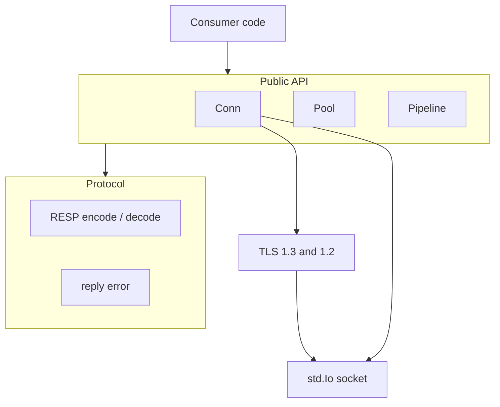
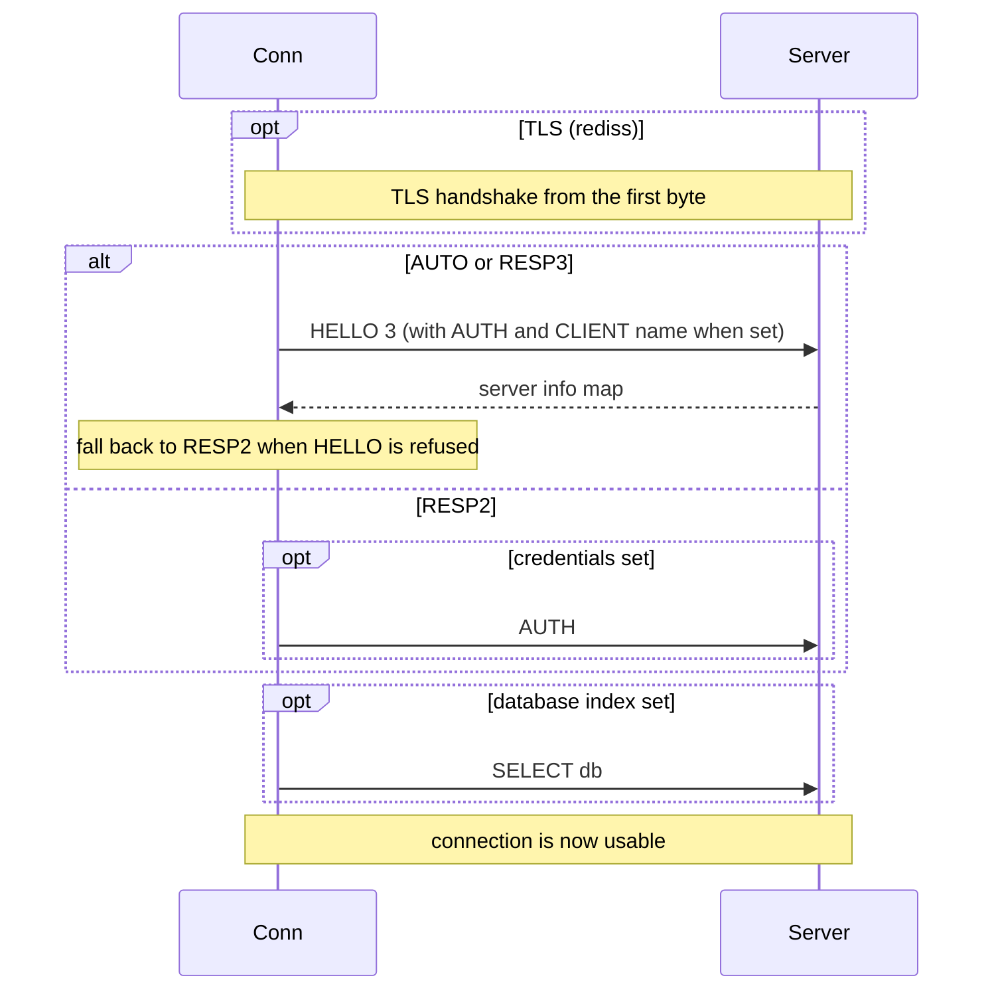
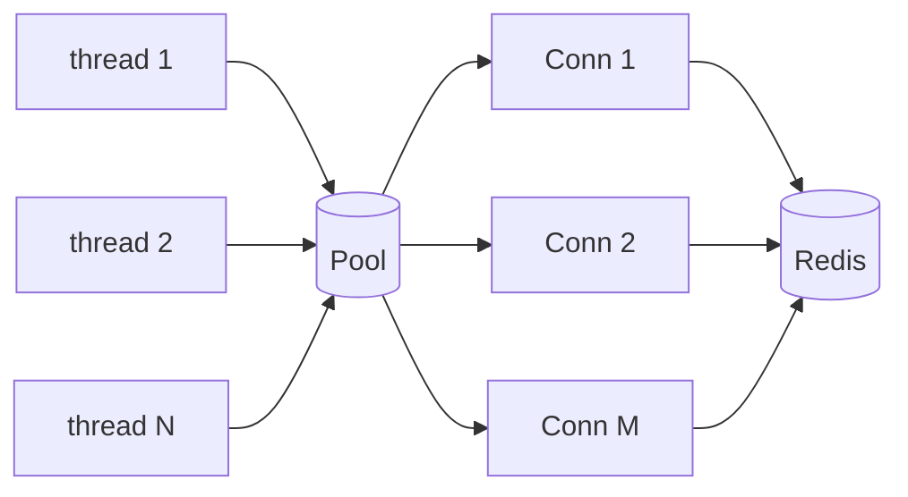
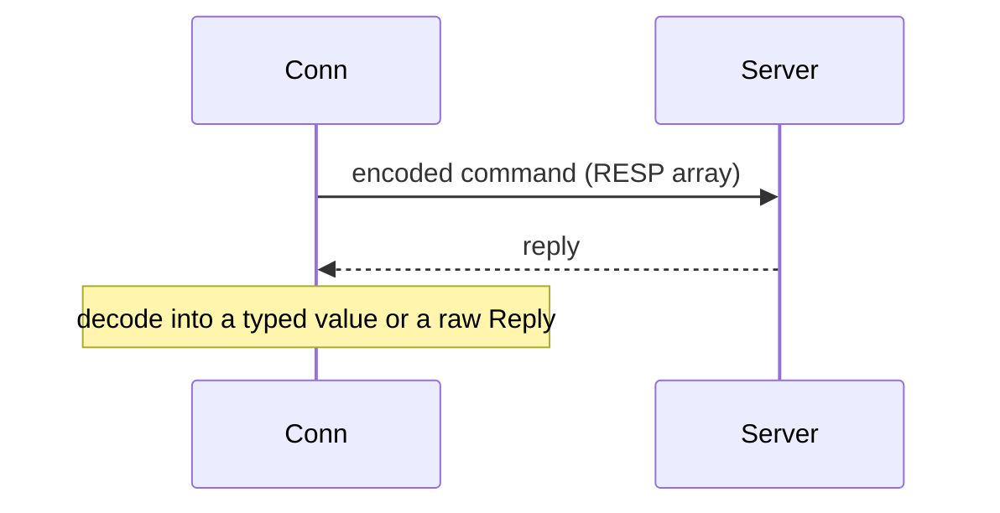
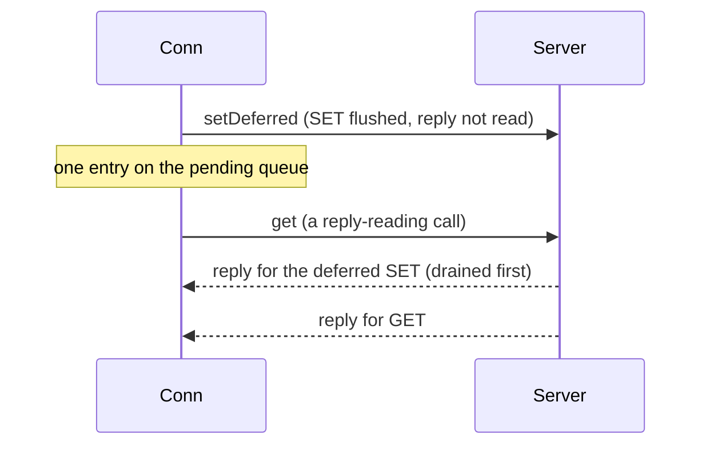

# rediz high-level design

## Scope

rediz is a Redis client library in pure Zig, standard library only. It speaks the RESP protocol directly, no hiredis, no C. This document covers the layers, the components, the connection lifecycle, and the concurrency model. The wire-level detail is in `lld-en.md`.

## Layers

- `Conn` is the core: one TCP (or TLS) connection with a send buffer and a per-reply arena.
- `Pool` and `Pipeline` are features layered on `Conn`.
- The protocol layer encodes commands and decodes RESP2 and RESP3 replies, `reply_error` classifies error replies.
- TLS wraps the socket when the config or a `rediss://` URL asks for it.

## Components

| Component | Responsibility |
| :- | :- |
| `conn.zig` | connect, HELLO handshake, the typed command helpers, the raw `command`, the deferred write-behind path |
| `pool.zig` | a thread-safe pool of connections with a bounded FIFO waiter queue |
| `pipeline.zig` | queue several commands behind one flush, one round trip |
| `protocol/resp.zig` | RESP2 and RESP3 encode and decode, the `Reply` union |
| `reply_error.zig` | the error prefix enum and the captured server error |
| `tls/` | the TLS client (shared design with the zix TLS stack) |
| `url.zig` | `REDIS_URL` parsing into a `Config` |

## Connection lifecycle

A Redis TLS port speaks TLS from the first byte, there is no in-band upgrade, so it is either on or off for a given port.

## Concurrency model

rediz is shared-nothing at the connection level, the same model as the PostgreSQL side:

- A `Conn` is single-owner. One thread drives one connection at a time, there is no lock inside a connection.
- A `Pool` is thread-safe. `acquire` hands out an idle connection, connects an empty slot, or parks the caller on a bounded FIFO waiter queue. `release` hands the connection back, directly to the oldest waiter when one is parked. `discard` destroys a broken connection so the slot reconnects on the next acquire.

## Command and reply flow

RESP is a strict request and reply protocol: replies arrive in command order. rediz uses this for two shapes.

Synchronous command: send, read the reply, decode it.

Deferred write-behind: send the command, do not read, drain owed replies before the next read.

## The deferred write-behind path

The deferred path exists for the mirror pattern: a cache fill or invalidation that must reach the server but whose reply the caller does not need on the hot path. Each deferred call encodes and flushes the command, then records that one reply is owed. Before any reply-reading call the connection drains the owed replies first, since RESP replies come back strictly in order. The outstanding count is bounded by `max_pending_replies`, so a stalled server drains at the bound rather than growing memory. This keeps a write-behind mirror off the request latency path without an extra thread.

## TLS

The TLS client is the same design used across the zix stack: TLS 1.3 with a 1.2 fallback. A `rediss://` URL or `tls = .REQUIRE` runs the handshake from the first byte on the connection.

## Design decisions

- Typed helpers over a raw escape hatch: the common commands have typed methods, `command(args)` sends any command and returns a raw `Reply`, so nothing is out of reach.
- RESP3 with a RESP2 fallback: HELLO 3 negotiates RESP3, a refusal falls back in place, so the driver runs against Redis 7 and 8 with no version-only dependency.
- Deferred replies as data, not exceptions: a failed command in a pipeline or a drain comes back as an error reply value, so one bad command never aborts the rest of a batch.
