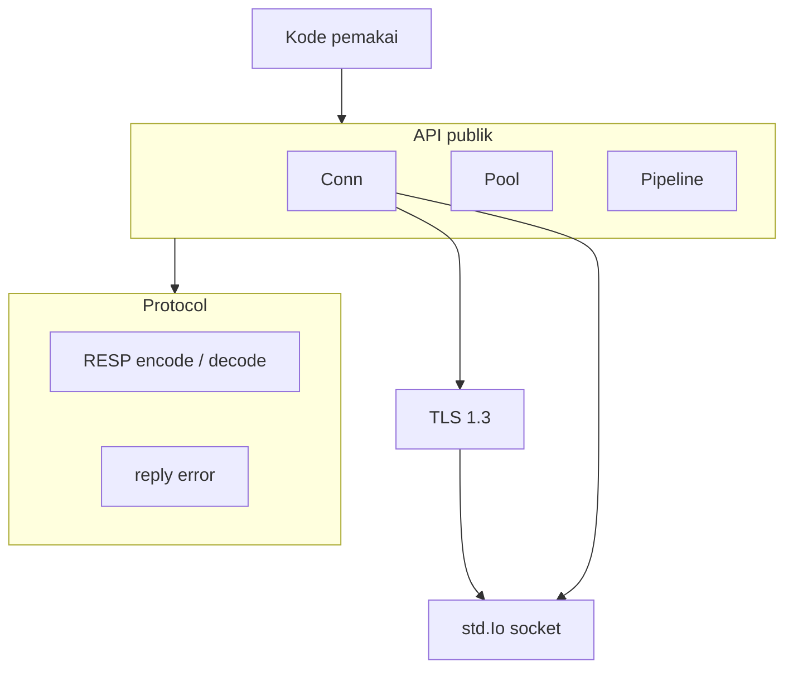
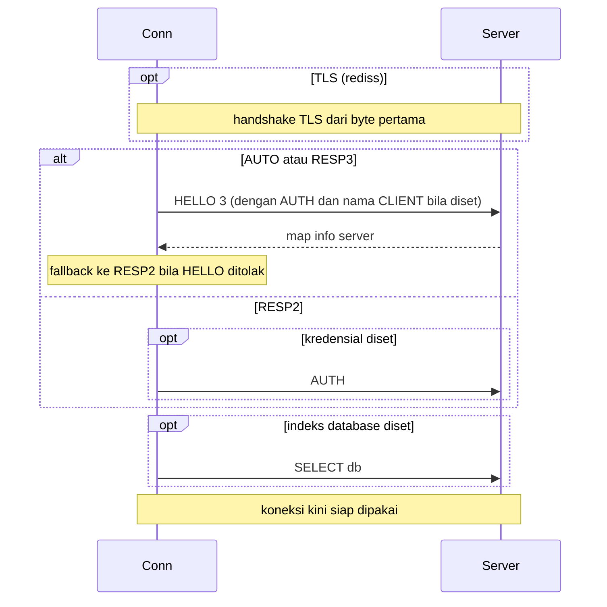
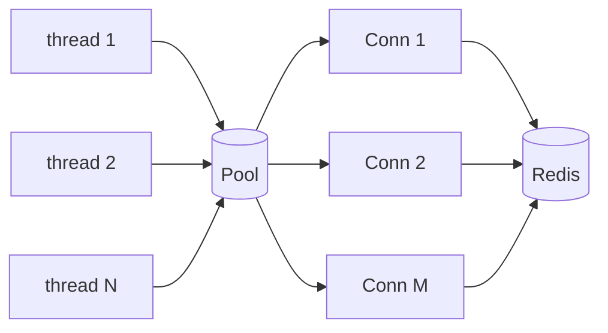
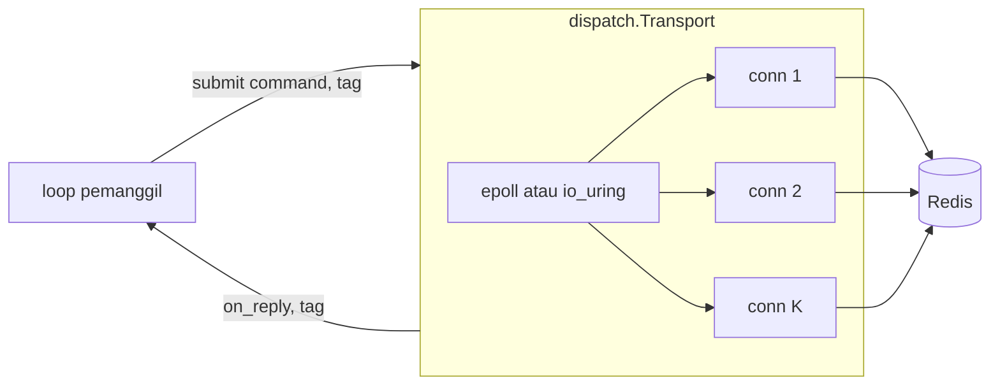
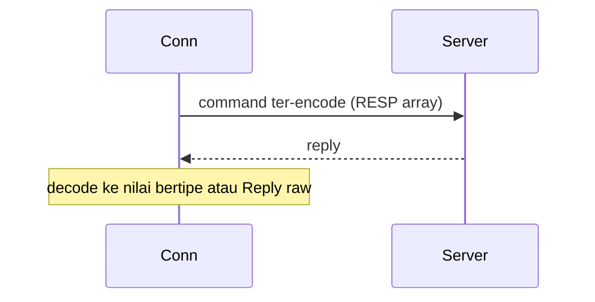
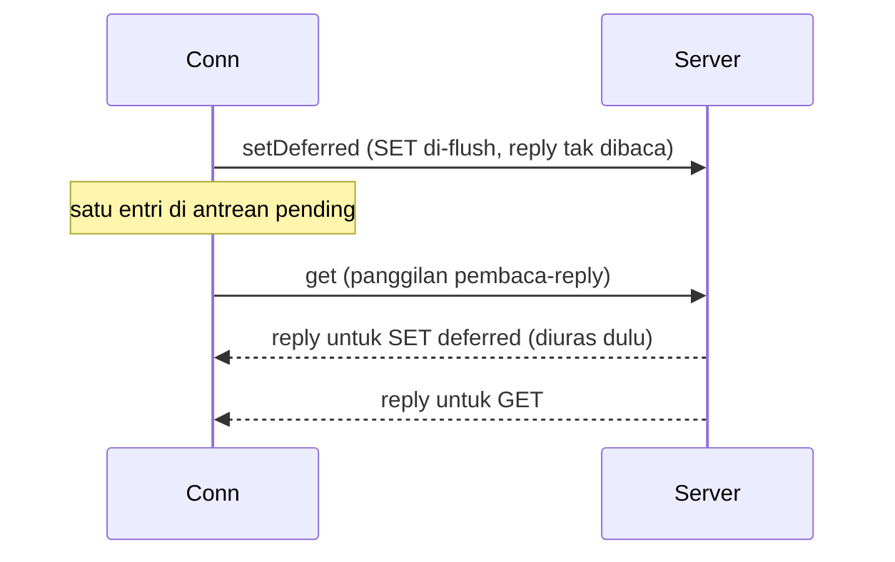

# Desain tingkat tinggi rediz

## Ruang lingkup

rediz adalah library klien Redis murni Zig, hanya memakai standard library. Ia berbicara langsung dengan protocol RESP, tanpa hiredis, tanpa C. Dokumen ini membahas layer, komponen, siklus hidup koneksi, dan model concurrency. Detail wire-level ada di `lld-id.md`.

## Layer

- `Conn` adalah inti: satu koneksi TCP (atau TLS) dengan send buffer dan arena per reply.
- `Pool` dan `Pipeline` adalah fitur di atas `Conn`.
- Layer protocol meng-encode command dan men-decode reply RESP2 dan RESP3, `reply_error` mengklasifikasi reply error.
- TLS membungkus socket ketika config atau URL `rediss://` memintanya.

## Komponen

| Komponen | Tanggung jawab |
| :- | :- |
| `conn.zig` | connect, handshake HELLO, helper command bertipe, `command` raw, jalur deferred write-behind |
| `pool.zig` | pool koneksi thread-safe dengan antrean waiter FIFO yang terbatas |
| `pipeline.zig` | antre beberapa command di belakang satu flush, satu round trip |
| `dispatch/` | dispatch EPOLL dan URING: satu thread yang me-multiplex koneksi non-blocking dan mem-pipeline command |
| `protocol/resp.zig` | encode dan decode RESP2 dan RESP3, union `Reply` |
| `reply_error.zig` | enum prefix error dan error server yang ditangkap |
| `tls/` | klien TLS (desain bersama dengan stack TLS zix) |
| `url.zig` | parsing `REDIS_URL` menjadi `Config` |

## Siklus hidup koneksi

Sebuah port TLS Redis berbicara TLS dari byte pertama, tidak ada upgrade in-band, jadi ia aktif atau mati untuk port tertentu.

## Model concurrency

rediz bersifat shared-nothing pada tingkat koneksi, model yang sama dengan sisi PostgreSQL:

- Sebuah `Conn` dimiliki satu pihak. Satu thread menggerakkan satu koneksi pada satu waktu, tidak ada lock di dalam koneksi.
- Sebuah `Pool` bersifat thread-safe. `acquire` memberikan koneksi idle, meng-connect slot kosong, atau memarkir pemanggil di antrean waiter FIFO yang terbatas. `release` mengembalikan koneksi, langsung ke waiter tertua bila ada yang parkir. `discard` menghancurkan koneksi rusak sehingga slot connect ulang pada acquire berikutnya.

## Dispatch model

`Config.dispatch_model` memilih cara driver me-multiplex I/O socket lintas koneksi. Wire protocol sama di setiap model, hanya socket pump yang berubah.

| model | bentuk | terbaik saat |
| :- | :- | :- |
| `.ASYNC` | Pool: koneksi blocking, satu round trip in flight per koneksi yang dipegang | default, thread yang acquire dan release satu koneksi per unit kerja |
| `.EPOLL` | satu thread yang memiliki koneksi non-blocking dan mem-pipeline banyak command per koneksi, di atas epoll | satu owner yang menggerakkan banyak koneksi tanpa satu thread per command in flight |
| `.URING` | multiplex satu thread yang sama di atas io_uring | sama seperti EPOLL, dengan submission dan completion queue io_uring menggantikan epoll |

`.ASYNC` adalah Pool di atas. `.EPOLL` dan `.URING` adalah `dispatch.Transport`: ia memakai ulang `Conn` untuk connect dan handshake RESP, lalu menjalankan loop pipelined di atas fd koneksi mentah. Pemanggil men-stage sebuah command (encoder `resp` membangun byte-nya) di bawah routing tag, dan `dispatch.Transport` callback dengan reply mentah (decoder `resp` membacanya) dalam urutan submit per koneksi. Jadi protocol dibagi dengan jalur blocking, hanya socket pump yang berubah.

Ini adalah write-behind mirror dalam bentuk idealnya: transport mem-pipeline banyak command fire-and-forget per koneksi dengan CPU jauh lebih kecil dari satu round trip per koneksi. `.EPOLL` dan `.URING` cleartext saja: loop raw-fd tidak bisa menggerakkan sesi TLS, jadi pasangkan dengan `tls = .OFF`. Jalur `Conn` dan `Pool` blocking tetap memakai TLS.

## Alur command dan reply

RESP adalah protocol request dan reply yang ketat: reply datang sesuai urutan command. rediz memakai ini untuk dua bentuk.

Command sinkron: kirim, baca reply-nya, decode.

Deferred write-behind: kirim command, jangan baca, uras reply yang tertunggak sebelum pembacaan berikutnya.

## Jalur deferred write-behind

Jalur deferred ada untuk pola mirror: pengisian cache atau invalidasi yang harus sampai ke server tetapi reply-nya tidak dibutuhkan pemanggil di jalur latency. Tiap panggilan deferred meng-encode dan flush command, lalu mencatat bahwa satu reply tertunggak. Sebelum panggilan pembaca-reply mana pun, koneksi menguras reply yang tertunggak lebih dulu, karena reply RESP kembali dalam urutan ketat. Hitungan tertunggak dibatasi `max_pending_replies`, jadi server yang macet menguras pada batas alih-alih menumbuhkan memori. Ini menjaga mirror write-behind lepas dari jalur latency request tanpa thread tambahan.

## TLS

Klien TLS memakai desain TLS 1.3 yang sama dengan seluruh stack zix (RFC 8446, tanpa fallback 1.2). URL `rediss://` atau `tls = .REQUIRE` menjalankan handshake dari byte pertama pada koneksi.

## Keputusan desain

- Helper bertipe di atas jalan pintas raw: command umum punya method bertipe, `command(args)` mengirim command apa pun dan mengembalikan `Reply` raw, jadi tidak ada yang tak terjangkau.
- RESP3 dengan fallback RESP2: HELLO 3 menegosiasi RESP3, penolakan jatuh di tempat, jadi driver berjalan terhadap Redis 7 dan 8 tanpa ketergantungan khusus versi.
- Reply deferred sebagai data, bukan exception: command yang gagal dalam pipeline atau drain kembali sebagai nilai reply error, jadi satu command buruk tak pernah membatalkan sisa batch.
