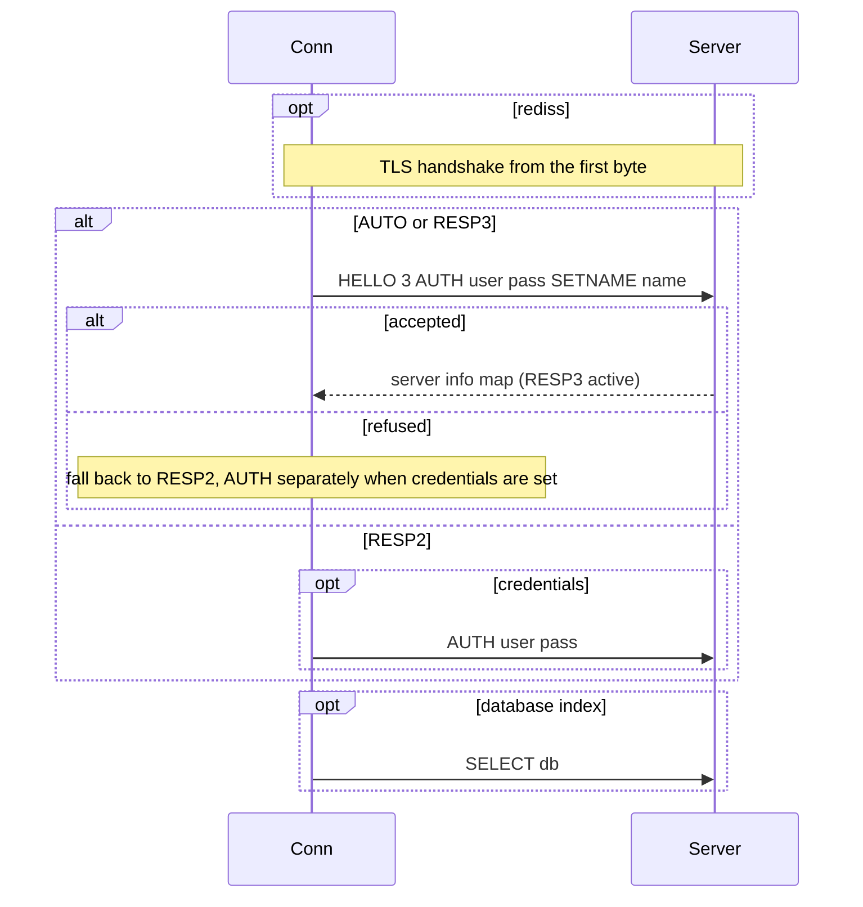
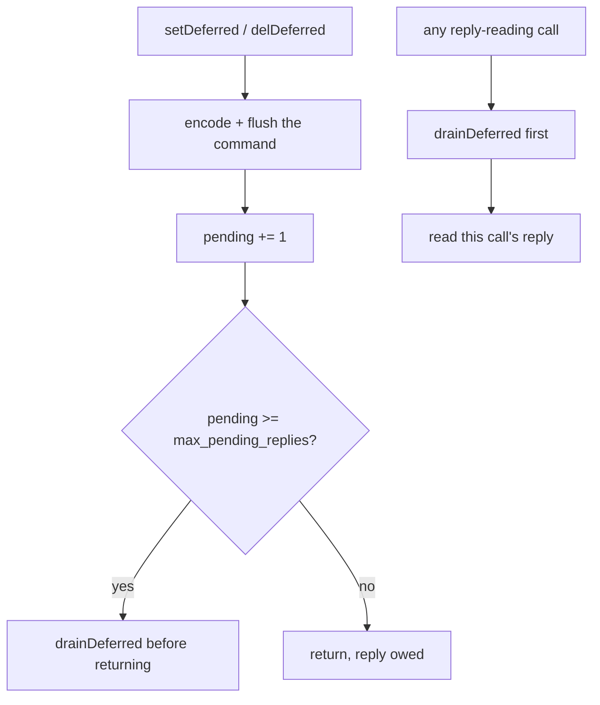
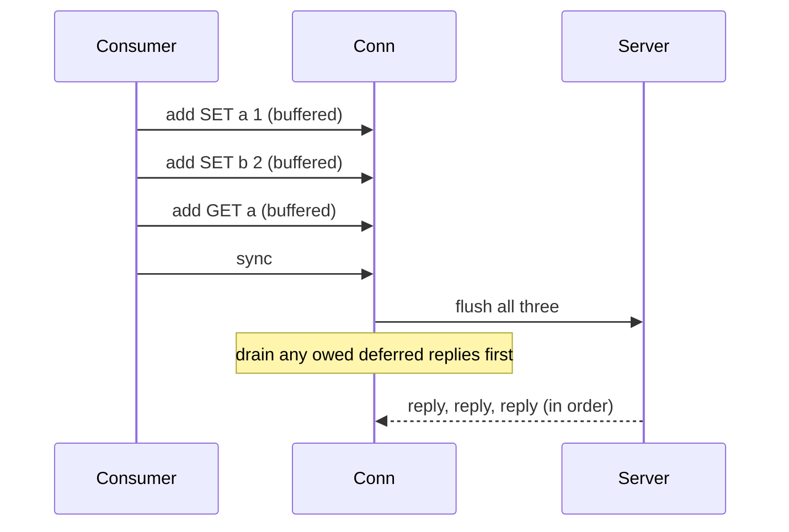
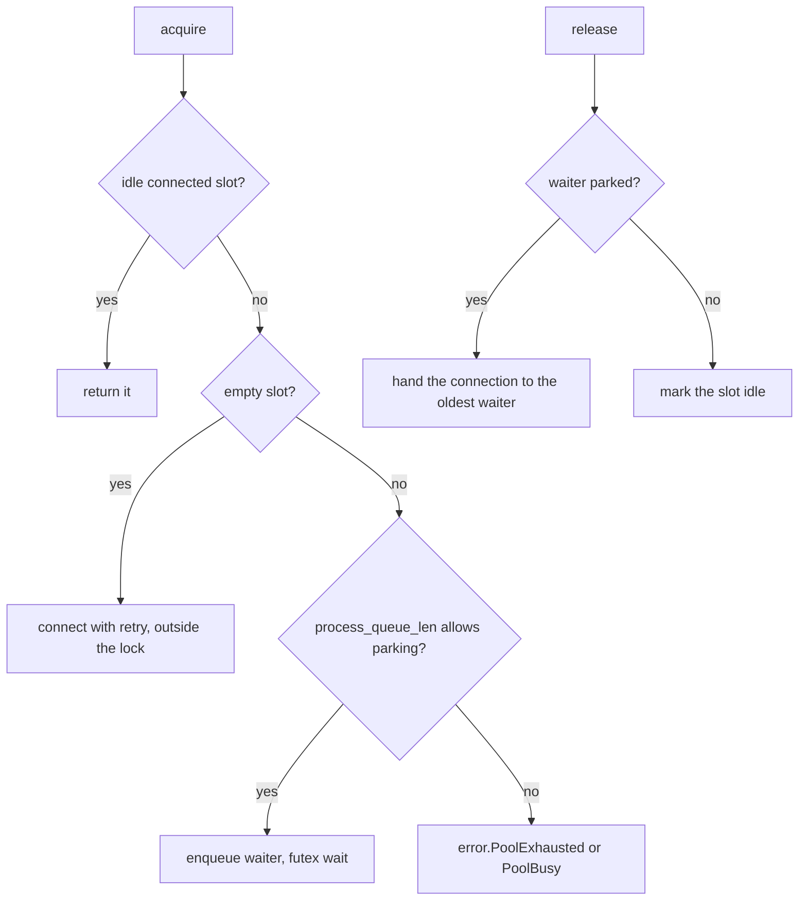

# rediz low-level design

This document covers the wire-level and internal detail. For the shape of the driver read `hld-en.md` first.

## RESP framing

A command is encoded as a RESP array of bulk strings: the array header `*N`, then for each argument a bulk header `$len` and the bytes, each line terminated by CRLF. Replies are decoded by their first byte.

| First byte | RESP type | Decoded as |
| :- | :- | :- |
| `+` | simple string | `simple` |
| `-` | error | `err` |
| `:` | integer | `integer` |
| `$` | bulk string | `bulk` or `null` |
| `*` | array | `array` |
| `_` | null (RESP3) | `null` |
| `#` | boolean (RESP3) | `boolean` |
| `,` | double (RESP3) | `double` |
| `(` | big number (RESP3) | `big_number` |
| `!` | bulk error (RESP3) | `bulk_err` |
| `=` | verbatim (RESP3) | `verbatim` |
| `%` | map (RESP3) | `map` |
| `~` | set (RESP3) | `set` |
| `>` | push (RESP3) | `push` |

The `Reply` union carries every one of these. `isOk`, `isErr`, and `errLine` are the common predicates.

## Handshake

- `.AUTO` sends HELLO 3 and falls back to RESP2 on refusal.
- `.RESP3` sends HELLO 3 and fails the connect on refusal.
- `.RESP2` skips HELLO and uses legacy AUTH when credentials are set.

## Typed helpers

Each typed method encodes a fixed command, sends it, and decodes the reply into a Zig value:

| Method | Command | Returns |
| :- | :- | :- |
| `set` | SET with EX / PX / NX / XX from `SetOptions` | `bool` (false when NX or XX blocked it) |
| `get` | GET | `?[]const u8` |
| `del` | DEL | `u64` removed |
| `incr`, `decr`, `incrBy` | INCR family | `i64` |
| `mget` | MGET | `[]?[]const u8` |
| `mset` | MSET | void |
| `expire`, `pexpire`, `persist` | TTL control | `bool` |
| `ttl`, `pttl` | TTL query | `i64` |
| `setJson`, `getJson` | SET / GET with JSON encode and decode | `bool` / `?T` |

`command(args)` sends any command as a RESP array and returns the raw `Reply`, so a command without a typed helper is still reachable.

## Deferred write-behind

- The command is fully encoded into the send buffer before returning, no per-command state is kept beyond the owed-reply count.
- `drainDeferred` reads and discards every owed reply. A server error reply is captured into `lastServerError` and counted into `deferredErrorCount`, not thrown. A transport error is thrown so the caller drops the connection.
- The bound is `max_pending_replies` (0 acts as one at a time), so backpressure is automatic and memory stays flat.
- `pendingDeferred` and `deferredErrorCount` expose the state for diagnostics.

This is plain ordered request and reply, lazily drained. There is no CLIENT REPLY and no RESP3-only machinery, so it holds on Redis 7.

## Pipelining

`pipeline()` returns a `Pipeline` bound to the connection. `add(args)` encodes one command into the send buffer, `sync()` flushes once and reads one reply per queued command in `add` order.

- `add` past `max_pending_replies` sheds `error.QueueFull`.
- A failed command comes back as its `.err` reply value, so draining the rest continues.
- Deferred replies owed before the pipeline drain ahead of the batch replies.
- No other command runs on the connection between `begin` and `sync`.

## Pool internals

- A spinlock guards the slot and waiter bookkeeping, the connect runs outside the lock.
- `release` hands a healthy connection directly to the oldest parked waiter (the slot stays held through the handoff), or marks it idle.
- `discard` frees a broken slot, granting it to a waiter or leaving it for the next acquire.
- Beyond the waiter bound `acquire` sheds `error.PoolBusy`, with parking off it sheds `error.PoolExhausted`.

## Error taxonomy

| Error | Meaning | Recovery |
| :- | :- | :- |
| error reply (`.err`) | the server rejected the command, in `lastServerError` | the connection stays usable |
| transport errors | the socket failed | discard the connection |
| `error.QueueFull` | a pipeline hit `max_pending_replies` | sync the queued commands first |
| `error.PoolExhausted` | the pool is full and parking is off | retry later or raise `process_queue_len` |
| `error.PoolBusy` | the waiter queue is full | retry later or raise `process_queue_len` |

## Config reference

See the README config table for the full field list. The load-bearing choices:

- `max_pending_replies`: the in-flight bound on one connection, for both pipelining and the deferred queue. Set it to the batch depth you pipeline. Too low serializes, too high lets a stalled server grow the send buffer.
- `process_queue_len`: the parked-acquire bound on the pool. A rule of thumb is the worker count plus a small margin.
- `pool_size`: connections per pool. Throughput is roughly `pool_size / round_trip_latency`.
