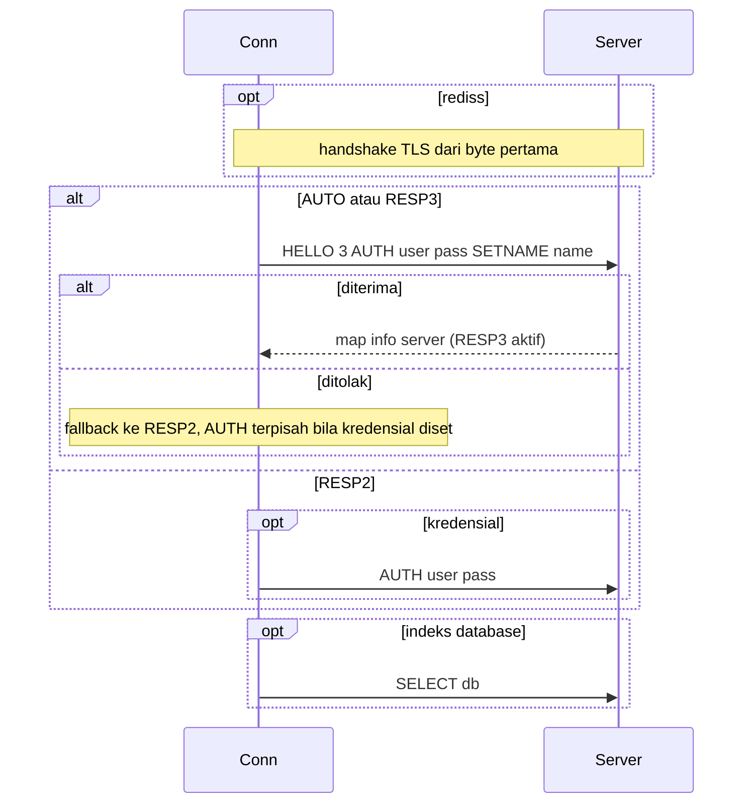
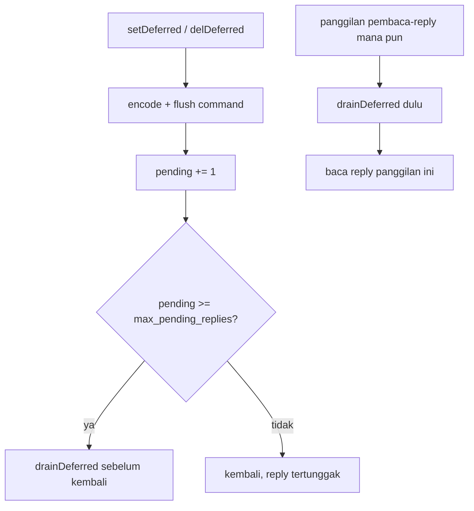
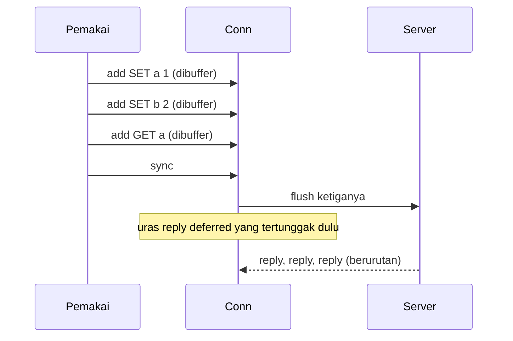
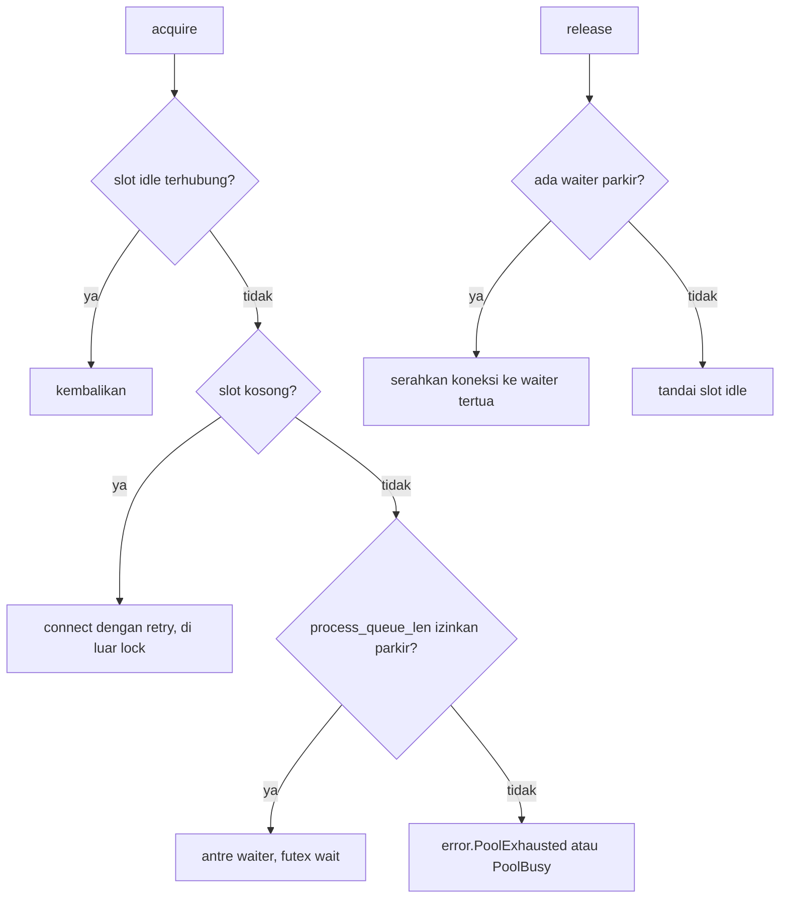

# Desain tingkat rendah rediz

Dokumen ini membahas detail wire-level dan internal. Untuk bentuk driver baca `hld-id.md` lebih dulu.

## Framing RESP

Sebuah command di-encode sebagai RESP array dari bulk string: header array `*N`, lalu untuk tiap argumen header bulk `$len` dan byte-nya, tiap baris ditutup CRLF. Reply di-decode berdasarkan byte pertamanya.

| Byte pertama | Tipe RESP | Di-decode sebagai |
| :- | :- | :- |
| `+` | simple string | `simple` |
| `-` | error | `err` |
| `:` | integer | `integer` |
| `$` | bulk string | `bulk` atau `null` |
| `*` | array | `array` |
| `_` | null (RESP3) | `null` |
| `#` | boolean (RESP3) | `boolean` |
| `,` | double (RESP3) | `double` |
| `(` | big number (RESP3) | `big_number` |
| `!` | bulk error (RESP3) | `bulk_err` |
| `=` | verbatim (RESP3) | `verbatim` |
| `%` | map (RESP3) | `map` |
| `~` | set (RESP3) | `set` |
| `>` | push (RESP3) | `push` |

Union `Reply` membawa tiap-tiap ini. `isOk`, `isErr`, dan `errLine` adalah predikat umumnya.

## Handshake

- `.AUTO` mengirim HELLO 3 dan fallback ke RESP2 saat ditolak.
- `.RESP3` mengirim HELLO 3 dan menggagalkan connect saat ditolak.
- `.RESP2` melewati HELLO dan memakai AUTH legacy ketika kredensial diset.

## Helper bertipe

Tiap method bertipe meng-encode command tetap, mengirimnya, dan men-decode reply ke nilai Zig:

| Method | Command | Kembalian |
| :- | :- | :- |
| `set` | SET dengan EX / PX / NX / XX dari `SetOptions` | `bool` (false ketika NX atau XX menahannya) |
| `get` | GET | `?[]const u8` |
| `del` | DEL | `u64` terhapus |
| `incr`, `decr`, `incrBy` | keluarga INCR | `i64` |
| `mget` | MGET | `[]?[]const u8` |
| `mset` | MSET | void |
| `expire`, `pexpire`, `persist` | kontrol TTL | `bool` |
| `ttl`, `pttl` | kueri TTL | `i64` |
| `setJson`, `getJson` | SET / GET dengan encode dan decode JSON | `bool` / `?T` |

`command(args)` mengirim command apa pun sebagai RESP array dan mengembalikan `Reply` raw, jadi command tanpa helper bertipe tetap terjangkau.

## Deferred write-behind

- Command di-encode penuh ke send buffer sebelum kembali, tidak ada state per command yang disimpan selain hitungan reply-tertunggak.
- `drainDeferred` membaca dan membuang tiap reply tertunggak. Reply error server ditangkap ke `lastServerError` dan dihitung ke `deferredErrorCount`, bukan dilempar. Error transport dilempar agar pemanggil melepas koneksi.
- Batasnya `max_pending_replies` (0 berlaku sebagai satu per satu), jadi backpressure otomatis dan memori tetap datar.
- `pendingDeferred` dan `deferredErrorCount` mengekspos state untuk diagnostik.

Ini request dan reply berurutan biasa, diuras secara malas. Tidak ada CLIENT REPLY dan tidak ada mesin khusus RESP3, jadi ia berlaku pada Redis 7.

## Pipelining

`pipeline()` mengembalikan `Pipeline` yang terikat ke koneksi. `add(args)` meng-encode satu command ke send buffer, `sync()` flush sekali dan membaca satu reply per command antre sesuai urutan `add`.

- `add` melewati `max_pending_replies` shed `error.QueueFull`.
- Command yang gagal kembali sebagai nilai reply `.err`-nya, jadi menguras sisanya berlanjut.
- Reply deferred yang tertunggak sebelum pipeline diuras mendahului reply batch.
- Tidak ada command lain yang berjalan pada koneksi antara `begin` dan `sync`.

## Internal pool

- Sebuah spinlock menjaga pembukuan slot dan waiter, connect berjalan di luar lock.
- `release` menyerahkan koneksi sehat langsung ke waiter parkir tertua (slot tetap dipegang lewat handoff), atau menandainya idle.
- `discard` membebaskan slot rusak, memberikannya ke waiter atau membiarkannya untuk acquire berikutnya.
- Melewati batas waiter `acquire` shed `error.PoolBusy`, dengan parkir mati ia shed `error.PoolExhausted`.

## Taksonomi error

| Error | Arti | Pemulihan |
| :- | :- | :- |
| reply error (`.err`) | server menolak command, ada di `lastServerError` | koneksi tetap bisa dipakai |
| error transport | socket gagal | discard koneksi |
| `error.QueueFull` | pipeline mencapai `max_pending_replies` | sync command yang antre dulu |
| `error.PoolExhausted` | pool penuh dan parkir mati | ulang nanti atau naikkan `process_queue_len` |
| `error.PoolBusy` | antrean waiter penuh | ulang nanti atau naikkan `process_queue_len` |

## Rujukan config

Lihat tabel config di README untuk daftar field lengkap. Pilihan yang menentukan:

- `max_pending_replies`: batas in-flight pada satu koneksi, untuk pipelining maupun antrean deferred. Setel ke kedalaman batch yang Anda pipeline. Terlalu rendah men-serialize, terlalu tinggi membiarkan server yang macet menumbuhkan send buffer.
- `process_queue_len`: batas acquire parkir pada pool. Aturan praktis adalah jumlah worker plus margin kecil.
- `pool_size`: jumlah koneksi per pool. Throughput kira-kira `pool_size / latency_round_trip`.
