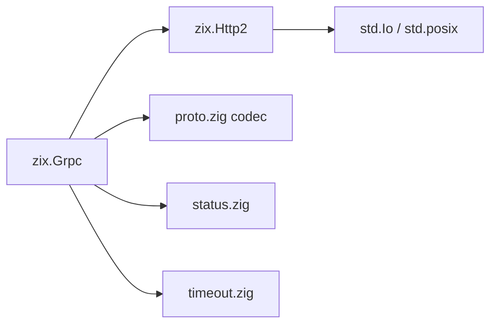
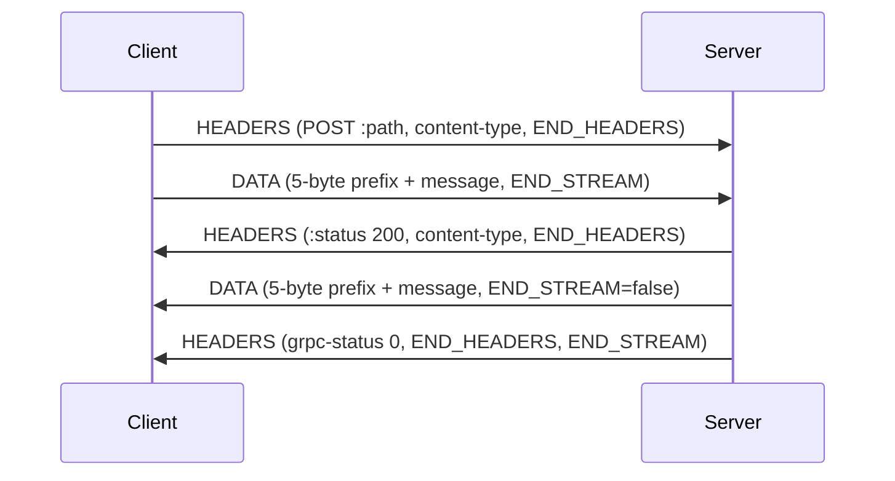
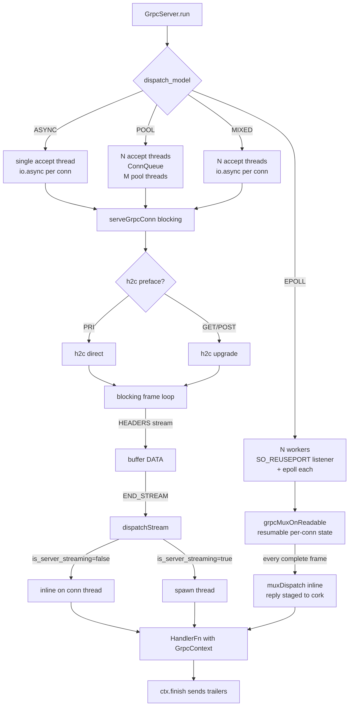
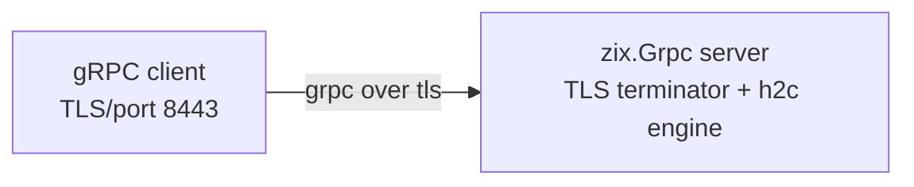

# gRPC h2c High-Level Design: zix.Grpc

## Goals

- gRPC h2c (HTTP/2 cleartext) server and client implemented without C FFI.
- All 4 RPC types: unary, server streaming, client streaming, bidirectional streaming.
- All 5 dispatch models: ASYNC (default), POOL, MIXED, EPOLL (Linux-only), URING (Linux-only).
- Minimal protobuf codec (varint + LEN wire types) for payload encoding without codegen.
- grpc-timeout header parsing, grpc-status trailer serialization.
- Native TLS (TLS 1.3 / 1.2, ALPN h2) via a `Tls.Context`, additive over the h2c default. A reverse proxy (nginx, haproxy) stays an option for offloading.

## Architecture



`zix.Grpc` builds on top of `zix.Http2`. The gRPC frame loop (`serveGrpcConn`) replicates the h2c stream loop from `zix.Http2.serveConn` with a different handler signature (`GrpcContext` instead of raw body bytes) to support streaming without inter-thread queues.

## Source Layout

| File | Role |
| :- | :- |
| `src/tcp/http2/grpc/Grpc.zig` | namespace: all public re-exports |
| `src/tcp/http2/grpc/core.zig` | `GrpcContext`, `HandlerFn`, `serveGrpcConn` (blocking models), `GrpcMuxConn` + `grpcMuxOnReadable` (multiplexed `.EPOLL`), `parsePath`, `detectContentType`, `wallClockNs`, `computeDeadline`, `peerStr` |
| `src/tcp/http2/grpc/config.zig` | `GrpcServerConfig`, `GrpcClientConfig` |
| `src/tcp/http2/grpc/server.zig` | `GrpcServer`: ASYNC, POOL, MIXED (blocking pool), EPOLL (multiplexed `epollMuxWorker` + `GrpcConnTable`) |
| `src/tcp/http2/grpc/client.zig` | `GrpcClient`: openStream, sendMessage, endStream, recvResponse, unary |
| `src/tcp/http2/grpc/frame.zig` | `GrpcPrefix` struct, `readGrpcPrefix`, `writeGrpcPrefix`, `send*`/`build*` frame helpers (`buildGrpcHeaders`/`buildGrpcDataHeader`/`buildGrpcTrailer`/`buildGrpcError`), comptime cached reply blocks |
| `src/tcp/http2/grpc/proto.zig` | `WT_*` wire type constants, `encodeVarint`, `decodeVarint`, `encodeString`, `encodeInt32`, `encodeDouble`, `decodeDouble`, `MessageReader` |
| `src/tcp/http2/grpc/status.zig` | `GrpcStatus` enum (u8), OK=0 to UNAUTHENTICATED=16 |
| `src/tcp/http2/grpc/timeout.zig` | `parseTimeout`: grpc-timeout header parser |

## Public API

| Symbol | Notes |
| :- | :- |
| `zix.Grpc.Server` | `init(comptime routes, config)!Self`, `deinit()`, `run()!void` |
| `zix.Grpc.Client` | `connect(config, io)!Self`, `deinit()`, `openStream`, `sendMessage`, `endStream`, `recvResponse`, `unary` |
| `zix.Grpc.Context` | `recvMessage()`, `sendHeaders()`, `sendMessage()`, `finish()`, `isExpired()` |
| `zix.Grpc.HandlerFn` | `*const fn (headers: []const zix.Http2.Header, ctx: *zix.Grpc.Context) void` |
| `zix.Grpc.Route` | `struct { path: []const u8, handler: HandlerFn, timeout_ms: u32 = 0, is_server_streaming: bool = false }` |
| `zix.Grpc.Router(routes)` | comptime zero-size type: `dispatch(path, headers, ctx)` (sends UNIMPLEMENTED if no route matches) |
| `zix.Grpc.ServerConfig` | see config fields below |
| `zix.Grpc.ClientConfig` | `ip`, `port` |
| `zix.Grpc.DispatchModel` | ASYNC=0 (default), POOL=1, MIXED=2, EPOLL=3 (Linux-only), URING=4 (Linux-only) |
| `zix.Grpc.Status` | enum(u8): OK=0 ... UNAUTHENTICATED=16 |
| `zix.Grpc.ContentType` | PROTO, JSON, UNKNOWN |
| `zix.Grpc.ServeOpts` | `GrpcServeOpts`: per-connection options passed to `serveConn` |
| `zix.Grpc.Path` | `package_service: []const u8`, `method: []const u8` |
| `zix.Grpc.Prefix` | `compress: bool`, `msg_len: u32` |
| `zix.Grpc.readPrefix` | `fn(body: []const u8) error{TooShort}!Prefix` |
| `zix.Grpc.writePrefix` | `fn(buf: *[5]u8, compress: bool, msg_len: u32) void` |
| `zix.Grpc.sendHeaders` | `fn(fd, sid, content_type) !void`: send initial HEADERS (no END_STREAM) |
| `zix.Grpc.sendData` | `fn(fd, sid, msg) !void`: send DATA with 5-byte gRPC prefix |
| `zix.Grpc.sendTrailer` | `fn(fd, sid, grpc_status, grpc_message) !void`: send trailer HEADERS (END_STREAM) |
| `zix.Grpc.sendError` | `fn(fd, sid, grpc_status, grpc_message) !void`: trailers-only error, no DATA frame |
| `zix.Grpc.parsePath` | `fn(path: []const u8) ?Path` |
| `zix.Grpc.detectContentType` | `fn(headers: []const Header) ContentType` |
| `zix.Grpc.parseTimeout` | `fn(value: []const u8) ?u64` (nanoseconds) |
| `zix.Grpc.serveConn` | `fn(comptime routes, fd, opts) void`: direct connection entry point |
| `zix.Grpc.ClientResponse` | `union(enum) { data: []const u8, status: GrpcStatus }` |
| `zix.Grpc.wallClockNs` | `fn() u64`: current wall-clock time in nanoseconds (CLOCK_REALTIME). Used to override `ctx.deadline_ns` at runtime. |

## GrpcServerConfig Fields

| Field | Default | Description |
| :- | :- | :- |
| `io` | required | caller-provided `std.Io` backend |
| `ip` | required | bind address |
| `port` | required | listen port, 0 -> `error.PortNotConfigured` |
| `dispatch_model` | `.ASYNC` | `.ASYNC`, `.POOL`, `.MIXED`, `.EPOLL`, or `.URING` (the last two Linux-only, native) |
| `kernel_backlog` | 1024 | `listen()` backlog |
| `workers` | 0 | 0 -> cpu_count accept threads (POOL and MIXED) |
| `pool_size` | 0 | POOL: 0 -> max(10, cpu_count * 2) pool threads. EPOLL: 0 -> cpu_count multiplexing workers |
| `max_streams` | 16 | max concurrent HTTP/2 streams per connection |
| `max_frame_size` | 16384 | advertised max HTTP/2 frame size |
| `max_header_scratch` | 4096 | HPACK decode scratch buffer per connection |
| `max_body` | 65536 | max total gRPC body buffered per stream (all DATA frames) |
| `logger` | `null` | optional `*zix.Logger`, when set, logs each stream close via `rpc()` and startup/shutdown via `system()` |
| `handler_timeout_ms` | 0 | global handler timeout cap (ms), 0 = disabled. Combined with `Route.timeout_ms` and `grpc-timeout` header at dispatch |

## Handler Pattern

Routes are registered at compile time via `Server.init`. The handler receives request headers and a `GrpcContext`, the path is already resolved by the route table.

```zig
fn echoHandler(
    headers: []const zix.Http2.Header,
    ctx:     *zix.Grpc.Context,
) void {
    _ = headers;
    while (ctx.recvMessage()) |msg| {
        ctx.sendMessage("application/grpc+proto", msg);
    }
    ctx.finish(zix.Grpc.Status.OK, "");
}

var server = try zix.Grpc.Server.init(
    &[_]zix.Grpc.Route{
        .{ .path = "/pkg.Svc/Echo", .handler = echoHandler, .is_server_streaming = true },
    },
    .{ .io = io, .ip = "127.0.0.1", .port = 8083 },
);
defer server.deinit();
try server.run();
```

Key rules:
- `ctx.finish()` must always be called before returning. It sends the grpc-status trailer.
- `ctx.sendMessage()` sends initial response HEADERS on the first call. Do not call `ctx.sendHeaders()` manually if using `sendMessage`.
- `ctx.recvMessage()` returns `null` when all client messages are consumed (client sent END_STREAM).
- Unary routes (`is_server_streaming = false`, the default) dispatch synchronously on the connection thread. Server-streaming routes (`is_server_streaming = true`) each run on a dedicated thread sharing a connection-level write mutex.
- The server buffers all client DATA before dispatching the handler.
- `parsePath` and path-based dispatch inside the handler are not needed: the route table handles that.

## Context Timeout

Three inputs determine `ctx.deadline_ns` at dispatch time:

| Input | Where | Notes |
| :- | :- | :- |
| `GrpcServerConfig.handler_timeout_ms` | config | global cap (0 = disabled) |
| `Route.timeout_ms` | comptime route table | per-route default (0 = use global cap) |
| `grpc-timeout` header | client request | parsed by `parseTimeout` (takes effect if tighter) |

`ctx.deadline_ns: ?u64` is the tightest of all three (CLOCK_REALTIME nanoseconds). `null` means no deadline. `Router.dispatch` applies `Route.timeout_ms` after the global deadline is set, so per-route timeout only tightens, never loosens.

Handlers check the deadline explicitly:

```zig
fn slowHandler(headers: []const zix.Http2.Header, ctx: *zix.Grpc.Context) void {
    _ = headers;
    if (ctx.isExpired()) {
        ctx.finish(zix.Grpc.Status.DEADLINE_EXCEEDED, "");
        return;
    }
    const msg = ctx.recvMessage() orelse {
        ctx.finish(zix.Grpc.Status.INVALID_ARGUMENT, "no message");
        return;
    };
    ctx.sendMessage("application/grpc+proto", msg);
    ctx.finish(zix.Grpc.Status.OK, "");
}
```

Handler deadline override pattern (canonical):

```zig
ctx.deadline_ns = wallClockNs() + 60 * std.time.ns_per_s; // extend to 60 s from now
ctx.deadline_ns = null; // disable for this call
```

Risks on override:
- Extending past the client `grpc-timeout` wastes work on a dead connection.
- `null` disables all enforcement.
- Extending without first calling `ctx.isExpired()` silently continues past an already-expired deadline.

Per-route timeout example:

```zig
var server = try zix.Grpc.Server.init(
    &[_]zix.Grpc.Route{
        .{ .path = "/svc.Svc/FastOp", .handler = fastHandler, .timeout_ms = 500    },
        .{ .path = "/svc.Svc/SlowOp", .handler = slowHandler, .timeout_ms = 30_000 },
    },
    .{ .io = process.io, .ip = "127.0.0.1", .port = 8083, .handler_timeout_ms = 5000 },
);
```

## All 4 RPC Types

Unary and client-streaming handlers use `is_server_streaming = false` (the default). Server-streaming and bidirectional handlers must set `is_server_streaming = true` on their `Route` entry to prevent deadlock under flow-control backpressure.

### Unary (1 request, 1 response)

```zig
fn unaryHandler(headers: []const zix.Http2.Header, ctx: *zix.Grpc.Context) void {
    _ = headers;
    const req = ctx.recvMessage() orelse {
        ctx.finish(zix.Grpc.Status.INVALID_ARGUMENT, "no message");
        return;
    };
    ctx.sendMessage("application/grpc+proto", req);
    ctx.finish(zix.Grpc.Status.OK, "");
}
```

### Server Streaming (1 request, N responses)

```zig
fn serverStreamHandler(headers: []const zix.Http2.Header, ctx: *zix.Grpc.Context) void {
    _ = headers;
    _ = ctx.recvMessage();
    ctx.sendMessage("application/grpc+proto", "result-1");
    ctx.sendMessage("application/grpc+proto", "result-2");
    ctx.sendMessage("application/grpc+proto", "result-3");
    ctx.finish(zix.Grpc.Status.OK, "");
}
```

### Client Streaming (N requests, 1 response)

```zig
fn clientStreamHandler(headers: []const zix.Http2.Header, ctx: *zix.Grpc.Context) void {
    _ = headers;
    var count: usize = 0;
    while (ctx.recvMessage()) |_| count += 1;
    var buf: [32]u8 = undefined;
    const reply = std.fmt.bufPrint(&buf, "got {d}", .{count}) catch "got ?";
    ctx.sendMessage("application/grpc+proto", reply);
    ctx.finish(zix.Grpc.Status.OK, "");
}
```

### Bidirectional Streaming (N requests, M responses)

```zig
fn bidiHandler(headers: []const zix.Http2.Header, ctx: *zix.Grpc.Context) void {
    _ = headers;
    while (ctx.recvMessage()) |msg| {
        ctx.sendMessage("application/grpc+proto", msg);
    }
    ctx.finish(zix.Grpc.Status.OK, "");
}
```

Note: all client messages are buffered before the handler is called. True interleaved bidirectional streaming (server sends before client finishes) would require a different architecture. The buffered design covers all 4 patterns for bounded message sizes.

## GrpcClient Usage

```zig
var client = try zix.Grpc.Client.connect(.{
    .ip   = "127.0.0.1",
    .port = 8083,
}, process.io);
defer client.deinit();

// Unary convenience
var buf: [4096]u8 = undefined;
const resp = try client.unary(
    "/helloworld.Greeter/SayHello",
    "application/grpc+proto",
    request_bytes,
    &buf,
);

// Manual streaming
const sid = try client.openStream("/svc.Svc/Echo", "application/grpc+proto");
try client.sendMessage(sid, "msg1");
try client.sendMessage(sid, "msg2");
try client.endStream(sid);

var rbuf: [4096]u8 = undefined;
while (true) {
    const r = try client.recvResponse(sid, &rbuf);
    switch (r) {
        .data   => |d| { _ = d; },
        .status => |s| { _ = s; break; },
    }
}
```

## Wire Protocol



### gRPC 5-byte message prefix

```
+----------+-------------------------------+
| Compress | Message Length (4 bytes, BE)  |
|  Flag(1) |                               |
+----------+-------------------------------+
| Message payload                          |
+------------------------------------------+
```

Compress flag is always 0 (compression not implemented).

### Error path (trailers-only)

When the handler calls `ctx.finish(status, msg)` without sending any data, the server sends a single HEADERS frame with `:status 200`, `content-type`, `grpc-status`, and `grpc-message` with `FLAG_END_STREAM`. HTTP `:status` is always 200 per the gRPC wire protocol, the actual gRPC error is in the `grpc-status` trailer. `content-type` is always included per the gRPC spec to ensure client compatibility.

## Dispatch Models

| Model | Accept threads | Connection dispatch | Notes |
| :- | :- | :- | :- |
| `.ASYNC` (default) | 1 | `io.async()` per connection | preferred for unbounded or long-lived streams |
| `.POOL` | cpu_count | shared `ConnQueue` + blocking pool | workers and pool_size apply |
| `.MIXED` | cpu_count | `io.async()` per accept thread | no ConnQueue, pool_size ignored |
| `.EPOLL` | per worker | multiplexed event loop (Linux only) | highest throughput, see below |
| `.URING` | per worker | multiplexed io_uring loop (Linux only) | same shape as `.EPOLL`, completion-based |

MIXED accept threads use `.{}` default stack size (system default ~8MB) to prevent stack overflow when `io.async()` falls back to inline execution.

`.EPOLL` is Linux-specific. On non-Linux platforms, `.EPOLL` falls back to `.POOL` automatically. `.URING` is the same shared-nothing multiplexed design on the io_uring ring (`runUring`, ADR-037 Phase 4): completion-based instead of readiness-based, `pool_size` workers (0 = cpu_count), Linux-only, and also falls back to `.POOL` on non-Linux.

### `.EPOLL` is multiplexed and shared-nothing

`.EPOLL` does not park one thread per connection. It runs `pool_size` worker threads (0 = cpu count), each owning a private `SO_REUSEPORT` listener, its own epoll instance, and a private fd-indexed connection table. The kernel load-balances new connections across the per-worker listeners, so there is no accept thread, no shared queue, and no cross-thread fd handoff. One worker drives many non-blocking connections through a resumable HTTP/2 state machine (`GrpcMuxConn`), so concurrency is bounded by connection count, not by thread count. Each worker's `epoll_wait` drains up to `EPOLL_MAX_EVENTS` (512) ready events per call (ADR-032). The low-level design is in `lld-grpc-en.md`.

Two consequences differ from the other models:

- `pool_size` is the multiplexing worker count for `.EPOLL` (the optimal value is around cpu count), not a blocking pool size. Oversubscribing it only adds scheduler churn.
- Every route, including server-streaming, is dispatched inline on the worker (no per-stream thread). A streaming handler runs on the event loop, so it must be bounded - a long-running or unbounded stream blocks the other connections on that worker. Use `.ASYNC` for unbounded streaming. The per-stream thread spawn still applies to server-streaming routes under `.ASYNC`, `.POOL`, and `.MIXED`.

The advertised `max_streams` must be at least the client's concurrent-stream count. A client (for example a benchmark with 100 parallel streams per connection) opens streams optimistically before it sees the server SETTINGS, and any beyond `max_streams` are answered with `REFUSED_STREAM`.

## Lifecycle



## Minimal Protobuf Codec

`proto.zig` provides wire-type constants and encode/decode primitives for proto3. No `.proto` file compiler or generated code is required for simple schemas.

| Function | Notes |
| :- | :- |
| `encodeVarint(buf, value)` | encodes u64 as 1-10 bytes, returns bytes written |
| `decodeVarint(buf)` | returns `{value: u64, consumed: usize}` or error |
| `encodeString(field_number, s, buf)` | LEN wire type (2), returns bytes written |
| `encodeInt32(field_number, val, buf)` | VARINT wire type (0), returns bytes written |
| `encodeDouble(field_number, val, buf)` | I64 wire type (1), 8-byte little-endian IEEE 754, returns bytes written |
| `decodeDouble(payload)` | reads `*const [8]u8`, returns `f64` |
| `MessageReader.init(buf)` | wraps a serialized message buffer |
| `MessageReader.next()` | returns `?ProtoField` with `field_number`, `wire_type`, `payload` |

Example encoding a `HelloRequest { string name = 1; }`:

```zig
var out: [256]u8 = undefined;
const n = zix.Grpc.encodeString(1, "world", &out);
// send out[0..n] as the gRPC message payload
```

## TLS

`zix.Grpc` serves h2c (cleartext) by default. Setting `tls: ?*Tls.Context` on the config opts into gRPC over TLS 1.3 (ALPN h2): a per-connection terminator runs the same h2c engine behind a decrypted socketpair (the shared `tcp/tls/h2_terminator.zig`, also used by Http2), driving the gRPC mux state machine over the plaintext. The cert / key / policy live in the `Tls.Context` (ADR-047), reused across engines.



A reverse proxy stays an alternative when TLS offload, routing, or sharing a port with other services is wanted. See [`docs/hld-grpc-proxy.md`](hld-grpc-proxy.md) for nginx and haproxy configuration examples.

## Examples

| File | Pattern |
| :- | :- |
| `examples/grpc_server_1_async.zig` | ASYNC dispatch: SayHello and Echo handlers, port 8083 |
| `examples/grpc_server_2_pool.zig` | POOL dispatch: SayHello and Echo handlers, port 8083 |
| `examples/grpc_server_3_mixed.zig` | MIXED dispatch: SayHello and Echo handlers, port 8083 |
| `examples/grpc_server_4_epoll.zig` | EPOLL dispatch (Linux-only): SayHello and Echo handlers, port 8083 |
| `examples/grpc_client.zig` | unary call and manual streaming demo, port 8083 |
| `examples/grpc_timeout.zig` | context timeout demo: handler_timeout_ms, Route.timeout_ms, ctx.isExpired(), ctx.deadline_ns override, port 8084 |
| `examples/grpc_location_server_1_async.zig` | ASYNC, location.Location/SendLocationAndSave, port 10101, logger wired |
| `examples/grpc_location_server_2_pool.zig` | POOL, port 10101 |
| `examples/grpc_location_server_3_mixed.zig` | MIXED, port 10101 |
| `examples/grpc_location_client.zig` | location service client: encodes double fields, decodes bool response |
| `examples/grpc_multi_server.zig` | ASYNC, helloworld.Greeter + location.Location on one port (10102), logger wired |
| `examples/grpc_multi_client.zig` | calls both services on one connection, port 10102 |
| `examples/protobuf/helloworld.proto` | proto3 schema for helloworld.Greeter/SayHello |
| `examples/protobuf/location.proto` | proto3 schema for location.Location/SendLocationAndSave |

## Tests

| Tier | File | Count |
| :- | :- | :- |
| unit | inline in `src/tcp/http2/grpc/*.zig` via `refAllDecls` | ~40 |
| integration | `tests/integration/grpc/server_test.zig` | 9 |
| behaviour | `tests/behaviour/grpc/config_test.zig` | 7 |
| edge | `tests/edge/grpc/server_test.zig` | 13 |

Ports: integration 18200-18206, edge 18220-18221.

---

###### end of hld-grpc
