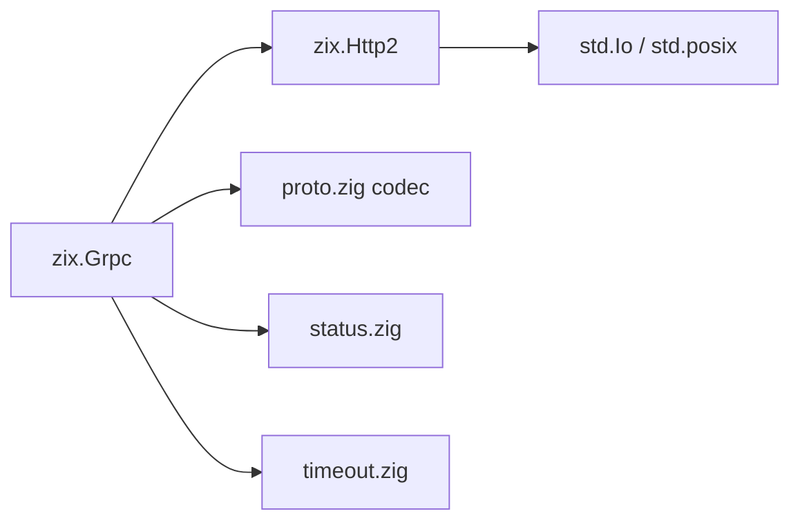
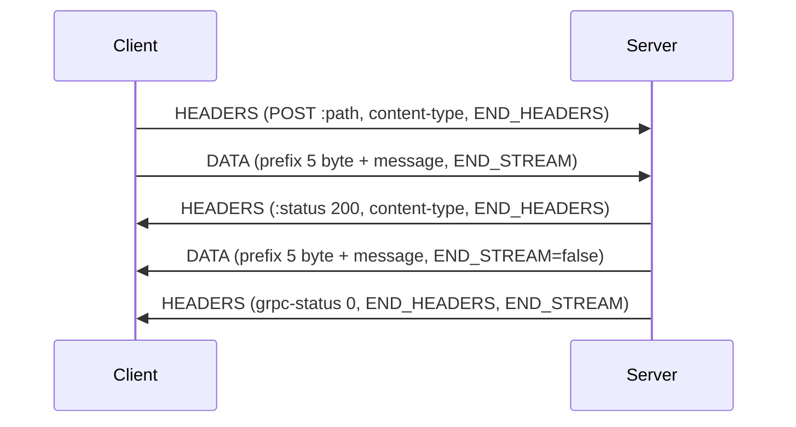
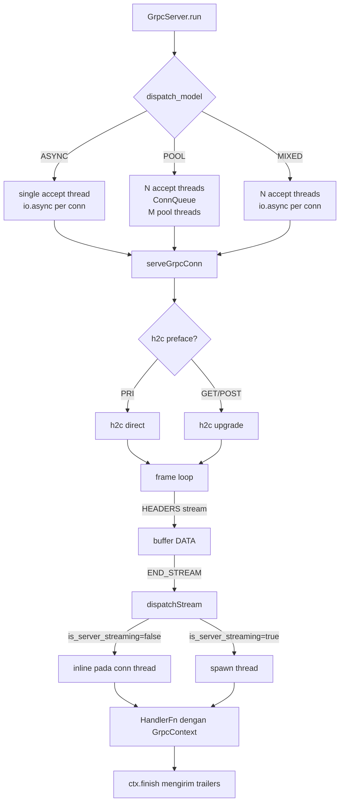
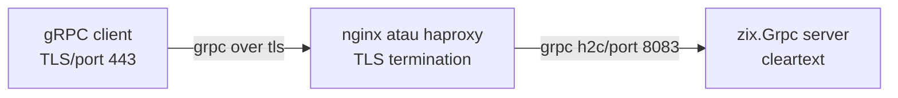

# gRPC h2c — Desain Tingkat Tinggi: zix.Grpc

## Tujuan

- Server dan client gRPC h2c (HTTP/2 cleartext) diimplementasikan tanpa C FFI.
- Semua 4 tipe RPC: unary, server streaming, client streaming, bidirectional streaming.
- Semua 4 model dispatch: ASYNC (default), POOL, MIXED, EPOLL (hanya Linux).
- Codec protobuf minimal (tipe wire varint + LEN) untuk encoding payload tanpa codegen.
- Parsing header grpc-timeout; serialisasi trailer grpc-status.
- TLS didelegasikan ke reverse proxy (nginx, haproxy). Backend berbicara h2c saja.

## Arsitektur



`zix.Grpc` dibangun di atas `zix.Http2`. Frame loop gRPC (`serveGrpcConn`) mereplikasi h2c stream loop dari `zix.Http2.serveConn` dengan tanda tangan handler yang berbeda — `GrpcContext` bukan byte body mentah — untuk mendukung streaming tanpa antrian antar thread.

## Struktur Berkas

| Berkas | Peran |
| :- | :- |
| `src/tcp/http2/grpc/Grpc.zig` | namespace — semua re-export publik |
| `src/tcp/http2/grpc/core.zig` | `GrpcContext`, `HandlerFn`, `serveGrpcConn`, `parsePath`, `detectContentType`, `wallClockNs`, `computeDeadline`, `peerStr` |
| `src/tcp/http2/grpc/config.zig` | `GrpcServerConfig`, `GrpcClientConfig` |
| `src/tcp/http2/grpc/server.zig` | `GrpcServer` — dispatch ASYNC, POOL, MIXED, EPOLL |
| `src/tcp/http2/grpc/client.zig` | `GrpcClient` — openStream, sendMessage, endStream, recvResponse, unary |
| `src/tcp/http2/grpc/frame.zig` | struct `GrpcPrefix`, `readGrpcPrefix`, `writeGrpcPrefix`, `sendGrpcHeaders`, `sendGrpcData`, `sendGrpcTrailer`, `sendGrpcError` |
| `src/tcp/http2/grpc/proto.zig` | konstanta tipe wire `WT_*`, `encodeVarint`, `decodeVarint`, `encodeString`, `encodeInt32`, `encodeDouble`, `decodeDouble`, `MessageReader` |
| `src/tcp/http2/grpc/status.zig` | enum `GrpcStatus` (u8), OK=0 sampai UNAUTHENTICATED=16 |
| `src/tcp/http2/grpc/timeout.zig` | `parseTimeout` — parser header grpc-timeout |

## API Publik

| Simbol | Catatan |
| :- | :- |
| `zix.Grpc.Server` | `init(comptime routes, config)!Self`, `deinit()`, `run()!void` |
| `zix.Grpc.Client` | `connect(config, io)!Self`, `deinit()`, `openStream`, `sendMessage`, `endStream`, `recvResponse`, `unary` |
| `zix.Grpc.Context` | `recvMessage()`, `sendHeaders()`, `sendMessage()`, `finish()`, `isExpired()` |
| `zix.Grpc.HandlerFn` | `*const fn (headers: []const zix.Http2.Header, ctx: *zix.Grpc.Context) void` |
| `zix.Grpc.Route` | `struct { path: []const u8, handler: HandlerFn, timeout_ms: u32 = 0, is_server_streaming: bool = false }` |
| `zix.Grpc.Router(routes)` | tipe zero-size comptime: `dispatch(path, headers, ctx)` — mengirim UNIMPLEMENTED jika tidak ada route yang cocok |
| `zix.Grpc.ServerConfig` | lihat field konfigurasi di bawah |
| `zix.Grpc.ClientConfig` | `ip`, `port` |
| `zix.Grpc.DispatchModel` | ASYNC=0 (default), POOL=1, MIXED=2, EPOLL=3 (hanya Linux) |
| `zix.Grpc.Status` | enum(u8): OK=0 ... UNAUTHENTICATED=16 |
| `zix.Grpc.ContentType` | PROTO, JSON, UNKNOWN |
| `zix.Grpc.ServeOpts` | `GrpcServeOpts` — opsi per koneksi yang diteruskan ke `serveConn` |
| `zix.Grpc.Path` | `package_service: []const u8`, `method: []const u8` |
| `zix.Grpc.Prefix` | `compress: bool`, `msg_len: u32` |
| `zix.Grpc.readPrefix` | `fn(body: []const u8) error{TooShort}!Prefix` |
| `zix.Grpc.writePrefix` | `fn(buf: *[5]u8, compress: bool, msg_len: u32) void` |
| `zix.Grpc.sendHeaders` | `fn(fd, sid, content_type) !void` — kirim HEADERS awal (tanpa END_STREAM) |
| `zix.Grpc.sendData` | `fn(fd, sid, msg) !void` — kirim DATA dengan prefix gRPC 5 byte |
| `zix.Grpc.sendTrailer` | `fn(fd, sid, grpc_status, grpc_message) !void` — kirim HEADERS trailer (END_STREAM) |
| `zix.Grpc.sendError` | `fn(fd, sid, grpc_status, grpc_message) !void` — error trailers-only, tanpa frame DATA |
| `zix.Grpc.parsePath` | `fn(path: []const u8) ?Path` |
| `zix.Grpc.detectContentType` | `fn(headers: []const Header) ContentType` |
| `zix.Grpc.parseTimeout` | `fn(value: []const u8) ?u64` (nanodetik) |
| `zix.Grpc.serveConn` | `fn(comptime routes, fd, opts) void` — titik masuk koneksi langsung |
| `zix.Grpc.ClientResponse` | `union(enum) { data: []const u8, status: GrpcStatus }` |
| `zix.Grpc.wallClockNs` | `fn() u64` — waktu wall-clock saat ini dalam nanodetik (CLOCK_REALTIME). Digunakan untuk menimpa `ctx.deadline_ns` saat runtime. |

## Field GrpcServerConfig

| Field | Default | Deskripsi |
| :- | :- | :- |
| `io` | wajib | backend `std.Io` yang disediakan pemanggil |
| `ip` | wajib | alamat bind |
| `port` | wajib | port listen; 0 -> `error.PortNotConfigured` |
| `dispatch_model` | `.ASYNC` | `.ASYNC`, `.POOL`, `.MIXED`, atau `.EPOLL` (hanya Linux; native) |
| `kernel_backlog` | 1024 | backlog `listen()` |
| `workers` | 0 | 0 -> cpu_count accept thread (POOL dan MIXED) |
| `pool_size` | 0 | 0 -> max(10, cpu_count * 2) pool thread (hanya POOL) |
| `max_streams` | 16 | maksimum stream HTTP/2 konkuren per koneksi |
| `max_frame_size` | 16384 | ukuran frame HTTP/2 maksimum yang diiklankan |
| `max_header_scratch` | 4096 | buffer scratch decode HPACK per koneksi |
| `max_body` | 65536 | total maksimum body gRPC yang di-buffer per stream (semua frame DATA) |
| `logger` | `null` | `*zix.Logger` opsional; jika diatur, mencatat setiap penutupan stream melalui `rpc()` dan startup/shutdown melalui `system()` |
| `handler_timeout_ms` | 0 | batas timeout handler global (ms); 0 = dinonaktifkan. Digabungkan dengan `Route.timeout_ms` dan header `grpc-timeout` saat dispatch |

## Pola Handler

Route didaftarkan saat kompilasi melalui `Server.init`. Handler menerima header request dan `GrpcContext` — path sudah diselesaikan oleh tabel route.

```zig
fn echoHandler(
    headers: []const zix.Http2.Header,
    ctx:     *zix.Grpc.Context,
) void {
    _ = headers;
    while (ctx.recvMessage()) |msg| {
        ctx.sendMessage("application/grpc+proto", msg);
    }
    ctx.finish(zix.Grpc.Status.OK, "");
}

var server = try zix.Grpc.Server.init(
    &[_]zix.Grpc.Route{
        .{ .path = "/pkg.Svc/Echo", .handler = echoHandler, .is_server_streaming = true },
    },
    .{ .io = io, .ip = "127.0.0.1", .port = 8083 },
);
defer server.deinit();
try server.run();
```

Aturan penting:
- `ctx.finish()` harus selalu dipanggil sebelum return. Fungsi ini mengirim trailer grpc-status.
- `ctx.sendMessage()` mengirim HEADERS respons awal pada panggilan pertama. Jangan memanggil `ctx.sendHeaders()` secara manual jika menggunakan `sendMessage`.
- `ctx.recvMessage()` mengembalikan `null` saat semua pesan client telah dikonsumsi (client mengirim END_STREAM).
- Route unary (`is_server_streaming = false`, default) di-dispatch secara sinkron pada connection thread. Route server-streaming (`is_server_streaming = true`) masing-masing berjalan pada thread tersendiri yang berbagi write mutex tingkat koneksi.
- Server mem-buffer semua DATA client sebelum melakukan dispatch handler.
- `parsePath` dan dispatch berbasis path di dalam handler tidak diperlukan — tabel route menangani hal tersebut.

## Deadline Konteks

Tiga input menentukan `ctx.deadline_ns` saat dispatch:

| Input | Lokasi | Catatan |
| :- | :- | :- |
| `GrpcServerConfig.handler_timeout_ms` | config | batas global; 0 = dinonaktifkan |
| `Route.timeout_ms` | tabel route comptime | default per route; 0 = gunakan batas global |
| header `grpc-timeout` | request client | di-parse oleh `parseTimeout`; berlaku jika lebih ketat |

`ctx.deadline_ns: ?u64` adalah yang paling ketat dari ketiganya (nanodetik CLOCK_REALTIME). `null` berarti tidak ada deadline. `Router.dispatch` menerapkan `Route.timeout_ms` setelah deadline global diatur — sehingga timeout per route hanya memperketat, tidak pernah memperlunak.

Handler memeriksa deadline secara eksplisit:

```zig
fn slowHandler(headers: []const zix.Http2.Header, ctx: *zix.Grpc.Context) void {
    _ = headers;
    if (ctx.isExpired()) {
        ctx.finish(zix.Grpc.Status.DEADLINE_EXCEEDED, "");
        return;
    }
    const msg = ctx.recvMessage() orelse {
        ctx.finish(zix.Grpc.Status.INVALID_ARGUMENT, "no message");
        return;
    };
    ctx.sendMessage("application/grpc+proto", msg);
    ctx.finish(zix.Grpc.Status.OK, "");
}
```

Pola penimpaan deadline handler (kanonik):

```zig
ctx.deadline_ns = wallClockNs() + 60 * std.time.ns_per_s; // perpanjang ke 60 detik dari sekarang
ctx.deadline_ns = null; // nonaktifkan untuk panggilan ini
```

Risiko saat menimpa:
- Memperpanjang melewati `grpc-timeout` client membuang pekerjaan pada koneksi yang sudah mati.
- `null` menonaktifkan semua penegakan deadline.
- Memperpanjang tanpa terlebih dahulu memanggil `ctx.isExpired()` secara diam-diam melanjutkan melewati deadline yang sudah kedaluwarsa.

Contoh timeout per route:

```zig
var server = try zix.Grpc.Server.init(
    &[_]zix.Grpc.Route{
        .{ .path = "/svc.Svc/FastOp", .handler = fastHandler, .timeout_ms = 500    },
        .{ .path = "/svc.Svc/SlowOp", .handler = slowHandler, .timeout_ms = 30_000 },
    },
    .{ .io = process.io, .ip = "127.0.0.1", .port = 8083, .handler_timeout_ms = 5000 },
);
```

## Semua 4 Tipe RPC

Handler unary dan client-streaming menggunakan `is_server_streaming = false` (default). Handler server-streaming dan bidirectional harus menetapkan `is_server_streaming = true` pada entri `Route` untuk mencegah deadlock di bawah backpressure flow-control.

### Unary (1 request, 1 respons)

```zig
fn unaryHandler(headers: []const zix.Http2.Header, ctx: *zix.Grpc.Context) void {
    _ = headers;
    const req = ctx.recvMessage() orelse {
        ctx.finish(zix.Grpc.Status.INVALID_ARGUMENT, "no message");
        return;
    };
    ctx.sendMessage("application/grpc+proto", req);
    ctx.finish(zix.Grpc.Status.OK, "");
}
```

### Server Streaming (1 request, N respons)

```zig
fn serverStreamHandler(headers: []const zix.Http2.Header, ctx: *zix.Grpc.Context) void {
    _ = headers;
    _ = ctx.recvMessage();
    ctx.sendMessage("application/grpc+proto", "result-1");
    ctx.sendMessage("application/grpc+proto", "result-2");
    ctx.sendMessage("application/grpc+proto", "result-3");
    ctx.finish(zix.Grpc.Status.OK, "");
}
```

### Client Streaming (N request, 1 respons)

```zig
fn clientStreamHandler(headers: []const zix.Http2.Header, ctx: *zix.Grpc.Context) void {
    _ = headers;
    var count: usize = 0;
    while (ctx.recvMessage()) |_| count += 1;
    var buf: [32]u8 = undefined;
    const reply = std.fmt.bufPrint(&buf, "got {d}", .{count}) catch "got ?";
    ctx.sendMessage("application/grpc+proto", reply);
    ctx.finish(zix.Grpc.Status.OK, "");
}
```

### Bidirectional Streaming (N request, M respons)

```zig
fn bidiHandler(headers: []const zix.Http2.Header, ctx: *zix.Grpc.Context) void {
    _ = headers;
    while (ctx.recvMessage()) |msg| {
        ctx.sendMessage("application/grpc+proto", msg);
    }
    ctx.finish(zix.Grpc.Status.OK, "");
}
```

Catatan: semua pesan client di-buffer sebelum handler dipanggil. Bidirectional streaming yang benar-benar saling bergantian (server mengirim sebelum client selesai) membutuhkan arsitektur yang berbeda. Desain berbasis buffer mencakup semua 4 pola untuk ukuran pesan yang terbatas.

## Penggunaan GrpcClient

```zig
var client = try zix.Grpc.Client.connect(.{
    .ip   = "127.0.0.1",
    .port = 8083,
}, process.io);
defer client.deinit();

// Convenience unary
var buf: [4096]u8 = undefined;
const resp = try client.unary(
    "/helloworld.Greeter/SayHello",
    "application/grpc+proto",
    request_bytes,
    &buf,
);

// Manual streaming
const sid = try client.openStream("/svc.Svc/Echo", "application/grpc+proto");
try client.sendMessage(sid, "msg1");
try client.sendMessage(sid, "msg2");
try client.endStream(sid);

var rbuf: [4096]u8 = undefined;
while (true) {
    const r = try client.recvResponse(sid, &rbuf);
    switch (r) {
        .data   => |d| { _ = d; },
        .status => |s| { _ = s; break; },
    }
}
```

## Protokol Wire



### Prefix pesan gRPC 5 byte

```
+----------+-------------------------------+
| Compress | Message Length (4 byte, BE)   |
|  Flag(1) |                               |
+----------+-------------------------------+
| Message payload                          |
+------------------------------------------+
```

Flag compress selalu 0 (kompresi belum diimplementasikan).

### Jalur error (trailers-only)

Saat handler memanggil `ctx.finish(status, msg)` tanpa mengirim data apa pun, server mengirim satu frame HEADERS dengan `:status 200`, `content-type`, `grpc-status`, dan `grpc-message` dengan `FLAG_END_STREAM`. HTTP `:status` selalu 200 sesuai protokol wire gRPC; error gRPC yang sebenarnya ada di trailer `grpc-status`. `content-type` selalu disertakan sesuai spesifikasi gRPC untuk memastikan kompatibilitas client.

## Model Dispatch

| Model | Accept thread | Dispatch koneksi | Catatan |
| :- | :- | :- | :- |
| `.ASYNC` (default) | 1 | `io.async()` per koneksi | direkomendasikan untuk gRPC (stream berumur panjang) |
| `.POOL` | cpu_count | `ConnQueue` bersama + pool blocking | workers dan pool_size berlaku |
| `.MIXED` | cpu_count | `io.async()` per accept thread | tanpa ConnQueue; pool_size diabaikan |
| `.EPOLL` | 1 | event loop epoll (hanya Linux) | tanpa pool thread; beban kerja Linux throughput tinggi |

Accept thread MIXED menggunakan ukuran stack default `.{}` (default sistem ~8MB) untuk mencegah stack overflow saat `io.async()` jatuh kembali ke eksekusi inline.

`.EPOLL` spesifik Linux. Pada platform non-Linux, `.EPOLL` otomatis jatuh kembali ke `.POOL`.

## Siklus Hidup



## Codec Protobuf Minimal

`proto.zig` menyediakan konstanta tipe wire dan primitif encode/decode untuk proto3. Tidak diperlukan compiler berkas `.proto` maupun kode yang di-generate untuk skema sederhana.

| Fungsi | Catatan |
| :- | :- |
| `encodeVarint(buf, value)` | encode u64 menjadi 1-10 byte; mengembalikan byte yang ditulis |
| `decodeVarint(buf)` | mengembalikan `{value: u64, consumed: usize}` atau error |
| `encodeString(field_number, s, buf)` | tipe wire LEN (2); mengembalikan byte yang ditulis |
| `encodeInt32(field_number, val, buf)` | tipe wire VARINT (0); mengembalikan byte yang ditulis |
| `encodeDouble(field_number, val, buf)` | tipe wire I64 (1); IEEE 754 little-endian 8 byte; mengembalikan byte yang ditulis |
| `decodeDouble(payload)` | membaca `*const [8]u8`; mengembalikan `f64` |
| `MessageReader.init(buf)` | membungkus buffer pesan yang telah diserialisasi |
| `MessageReader.next()` | mengembalikan `?ProtoField` dengan `field_number`, `wire_type`, `payload` |

Contoh encoding `HelloRequest { string name = 1; }`:

```zig
var out: [256]u8 = undefined;
const n = zix.Grpc.encodeString(1, "world", &out);
// kirim out[0..n] sebagai payload pesan gRPC
```

## TLS

`zix.Grpc` hanya berbicara h2c. Untuk TLS pada lingkungan produksi, tempatkan nginx atau haproxy di depan:



Lihat [`docs/hld-grpc-proxy.md`](hld-grpc-proxy.md) untuk contoh konfigurasi nginx dan haproxy.

## Contoh

| Berkas | Pola |
| :- | :- |
| `examples/grpc_server_1_async.zig` | dispatch ASYNC: handler SayHello dan Echo, port 8083 |
| `examples/grpc_server_2_pool.zig` | dispatch POOL: handler SayHello dan Echo, port 8083 |
| `examples/grpc_server_3_mixed.zig` | dispatch MIXED: handler SayHello dan Echo, port 8083 |
| `examples/grpc_server_4_epoll.zig` | dispatch EPOLL (hanya Linux): handler SayHello dan Echo, port 8083 |
| `examples/grpc_client.zig` | demo unary call dan manual streaming, port 8083 |
| `examples/grpc_timeout.zig` | demo context timeout: handler_timeout_ms, Route.timeout_ms, ctx.isExpired(), penimpaan ctx.deadline_ns, port 8084 |
| `examples/grpc_location_server_1_async.zig` | ASYNC, location.Location/SendLocationAndSave, port 10101, logger terhubung |
| `examples/grpc_location_server_2_pool.zig` | POOL, port 10101 |
| `examples/grpc_location_server_3_mixed.zig` | MIXED, port 10101 |
| `examples/grpc_location_client.zig` | client layanan lokasi — encode field double, decode respons bool |
| `examples/grpc_multi_server.zig` | ASYNC, helloworld.Greeter + location.Location pada satu port (10102), logger terhubung |
| `examples/grpc_multi_client.zig` | memanggil kedua layanan pada satu koneksi, port 10102 |
| `examples/protobuf/helloworld.proto` | skema proto3 untuk helloworld.Greeter/SayHello |
| `examples/protobuf/location.proto` | skema proto3 untuk location.Location/SendLocationAndSave |

## Pengujian

| Tier | Berkas | Jumlah |
| :- | :- | :- |
| unit | inline di `src/tcp/http2/grpc/*.zig` melalui `refAllDecls` | ~40 |
| integration | `tests/integration/grpc/server_test.zig` | 9 |
| behaviour | `tests/behaviour/grpc/config_test.zig` | 7 |
| edge | `tests/edge/grpc/server_test.zig` | 13 |

Port: integration 18200-18206, edge 18220-18221.

---

###### end of hld-grpc
