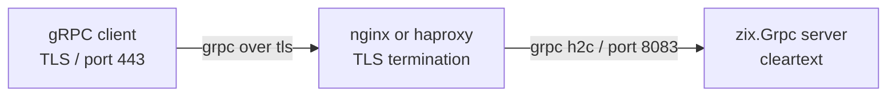

# gRPC h2c — TLS termination via nginx and haproxy

`zix.Grpc` speaks h2c (HTTP/2 cleartext). TLS termination is delegated to a reverse proxy in front of the Zig server. External gRPC clients connect over TLS (h2 / gRPC+TLS); the proxy forwards as h2c to the Zig backend.

## Architecture



## nginx

Requires nginx compiled with `--with-http_v2_module` and `--with-http_ssl_module` (standard in most distributions).

### Minimal config

```nginx
server {
    listen 443 ssl http2;
    server_name example.com;

    ssl_certificate     /etc/ssl/certs/example.com.crt;
    ssl_certificate_key /etc/ssl/private/example.com.key;
    ssl_protocols       TLSv1.2 TLSv1.3;
    ssl_ciphers         HIGH:!aNULL:!MD5;

    location / {
        grpc_pass grpc://127.0.0.1:8083;

        # Timeouts for long-lived streaming RPCs.
        grpc_read_timeout  3600s;
        grpc_send_timeout  3600s;
        grpc_connect_timeout 5s;
    }
}
```

Key directives:

| Directive | Notes |
| :- | :- |
| `listen 443 ssl http2` | Enable TLS and HTTP/2 on the frontend |
| `grpc_pass grpc://` | Forward as h2c (cleartext) to the backend |
| `grpc_pass grpcs://` | Forward as h2 (TLS) to the backend (not needed here) |
| `grpc_read_timeout` | Increase for server-streaming and bidirectional RPCs |
| `grpc_send_timeout` | Increase for client-streaming RPCs |

### Health check endpoint (optional)

```nginx
location /grpc.health.v1.Health/Check {
    grpc_pass grpc://127.0.0.1:8083;
}
```

### Multiple backends (load balancing)

```nginx
upstream grpc_backend {
    server 127.0.0.1:8083;
    server 127.0.0.1:8084;
    keepalive 16;
}

server {
    ...
    location / {
        grpc_pass grpc://grpc_backend;
    }
}
```

## haproxy

Requires haproxy 2.0 or later for full HTTP/2 / gRPC support.

### Minimal config

```haproxy
global
    maxconn 4096

defaults
    mode    http
    timeout connect 5s
    timeout client  3600s
    timeout server  3600s
    option  http-server-close

frontend grpc_tls
    bind *:443 ssl crt /etc/ssl/private/example.com.pem alpn h2,http/1.1
    default_backend grpc_backend

backend grpc_backend
    server zix 127.0.0.1:8083 proto h2
```

Key settings:

| Setting | Notes |
| :- | :- |
| `bind *:443 ssl crt` | TLS with ALPN advertising h2 |
| `alpn h2,http/1.1` | Let clients negotiate HTTP/2 via ALPN |
| `proto h2` | Send h2c (cleartext HTTP/2) to the backend |
| `timeout client 3600s` | Required for long-lived streaming RPCs |
| `timeout server 3600s` | Required for long-lived streaming RPCs |

### Multiple backends (load balancing)

```haproxy
backend grpc_backend
    balance roundrobin
    server zix1 127.0.0.1:8083 proto h2
    server zix2 127.0.0.1:8084 proto h2
```

### gRPC-specific ACLs (route by path)

```haproxy
frontend grpc_tls
    bind *:443 ssl crt /etc/ssl/private/example.com.pem alpn h2,http/1.1
    acl is_greeter  path_beg /helloworld.Greeter/
    acl is_echo     path_beg /echo.EchoService/
    use_backend greeter_backend if is_greeter
    use_backend echo_backend    if is_echo
    default_backend grpc_backend
```

## TLS certificate notes

For development, generate a self-signed cert:

```sh
openssl req -x509 -newkey ec -pkeyopt ec_paramgen_curve:P-256 \
  -keyout key.pem -out cert.pem -days 365 -nodes -subj "/CN=localhost"
```

haproxy expects cert + key in a single PEM file:

```sh
cat cert.pem key.pem > /etc/ssl/private/example.com.pem
```

nginx uses separate files (`ssl_certificate` and `ssl_certificate_key`).

## Streaming RPC timeout guidance

| RPC type | Recommended timeout |
| :- | :- |
| Unary | 30-60s |
| Server streaming | 3600s (or stream duration) |
| Client streaming | 3600s (or stream duration) |
| Bidirectional | 3600s (or session duration) |

Set `grpc-timeout` in the client request to propagate deadlines end-to-end. `zix.Grpc.parseTimeout` parses the header value on the server side.
