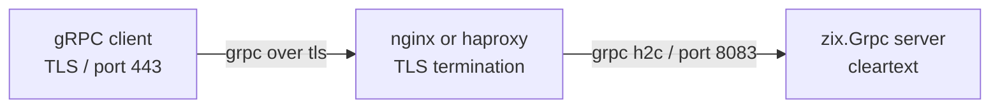

# gRPC h2c Terminasi TLS via nginx dan haproxy

`zix.Grpc` melayani TLS native (setel `tls: ?*Tls.Context`, lihat [`docs/hld-grpc-id.md`](hld-grpc-id.md)). Terminasi TLS di reverse proxy adalah opsi ketika offload, routing, atau berbagi port dengan service lain diinginkan: server Zig lalu berjalan h2c (HTTP/2 cleartext) di belakang proxy, client eksternal terhubung melalui TLS (h2 / gRPC+TLS), dan proxy meneruskan sebagai h2c ke backend.

## Arsitektur



## nginx

Membutuhkan nginx yang dikompilasi dengan `--with-http_v2_module` dan `--with-http_ssl_module` (sudah tersedia di sebagian besar distribusi).

### Konfigurasi Minimal

```nginx
server {
    listen 443 ssl http2;
    server_name example.com;

    ssl_certificate     /etc/ssl/certs/example.com.crt;
    ssl_certificate_key /etc/ssl/private/example.com.key;
    ssl_protocols       TLSv1.2 TLSv1.3;
    ssl_ciphers         HIGH:!aNULL:!MD5;

    location / {
        grpc_pass grpc://127.0.0.1:8083;

        # Timeouts untuk streaming RPC yang berumur panjang.
        grpc_read_timeout  3600s;
        grpc_send_timeout  3600s;
        grpc_connect_timeout 5s;
    }
}
```

Direktif utama:

| Direktif | Catatan |
| :- | :- |
| `listen 443 ssl http2` | Mengaktifkan TLS dan HTTP/2 di frontend |
| `grpc_pass grpc://` | Meneruskan sebagai h2c (cleartext) ke backend |
| `grpc_pass grpcs://` | Meneruskan sebagai h2 (TLS) ke backend (tidak diperlukan di sini) |
| `grpc_read_timeout` | Naikkan nilai untuk server-streaming dan bidirectional RPC |
| `grpc_send_timeout` | Naikkan nilai untuk client-streaming RPC |

### Endpoint Health Check (opsional)

```nginx
location /grpc.health.v1.Health/Check {
    grpc_pass grpc://127.0.0.1:8083;
}
```

### Multiple Backend (load balancing)

```nginx
upstream grpc_backend {
    server 127.0.0.1:8083;
    server 127.0.0.1:8084;
    keepalive 16;
}

server {
    ...
    location / {
        grpc_pass grpc://grpc_backend;
    }
}
```

## haproxy

Membutuhkan haproxy 2.0 atau lebih baru untuk dukungan penuh HTTP/2 dan gRPC.

### Konfigurasi Minimal

```haproxy
global
    maxconn 4096

defaults
    mode    http
    timeout connect 5s
    timeout client  3600s
    timeout server  3600s
    option  http-server-close

frontend grpc_tls
    bind *:443 ssl crt /etc/ssl/private/example.com.pem alpn h2,http/1.1
    default_backend grpc_backend

backend grpc_backend
    server zix 127.0.0.1:8083 proto h2
```

Pengaturan utama:

| Pengaturan | Catatan |
| :- | :- |
| `bind *:443 ssl crt` | TLS dengan ALPN yang mengiklankan h2 |
| `alpn h2,http/1.1` | Memungkinkan client bernegosiasi HTTP/2 via ALPN |
| `proto h2` | Mengirim h2c (cleartext HTTP/2) ke backend |
| `timeout client 3600s` | Diperlukan untuk streaming RPC yang berumur panjang |
| `timeout server 3600s` | Diperlukan untuk streaming RPC yang berumur panjang |

### Multiple Backend (load balancing)

```haproxy
backend grpc_backend
    balance roundrobin
    server zix1 127.0.0.1:8083 proto h2
    server zix2 127.0.0.1:8084 proto h2
```

### ACL Spesifik gRPC (route berdasarkan path)

```haproxy
frontend grpc_tls
    bind *:443 ssl crt /etc/ssl/private/example.com.pem alpn h2,http/1.1
    acl is_greeter  path_beg /helloworld.Greeter/
    acl is_echo     path_beg /echo.EchoService/
    use_backend greeter_backend if is_greeter
    use_backend echo_backend    if is_echo
    default_backend grpc_backend
```

## Catatan Sertifikat TLS

Untuk pengembangan, buat sertifikat self-signed:

```sh
openssl req -x509 -newkey ec -pkeyopt ec_paramgen_curve:P-256 \
  -keyout key.pem -out cert.pem -days 365 -nodes -subj "/CN=localhost"
```

haproxy mengharapkan cert dan key dalam satu berkas PEM:

```sh
cat cert.pem key.pem > /etc/ssl/private/example.com.pem
```

nginx menggunakan berkas terpisah (`ssl_certificate` dan `ssl_certificate_key`).

## Panduan Timeout untuk Streaming RPC

| Tipe RPC | Timeout yang Disarankan |
| :- | :- |
| Unary | 30-60s |
| Server streaming | 3600s (atau durasi stream) |
| Client streaming | 3600s (atau durasi stream) |
| Bidirectional | 3600s (atau durasi sesi) |

Atur `grpc-timeout` di request client untuk meneruskan deadline dari ujung ke ujung. `zix.Grpc.parseTimeout` mem-parsing nilai header tersebut di sisi server.
