# HLD: zix.Http

HTTP server and client built on Zig 0.16.x `std.Io`.

---

## Goals

### Server
- Explicit over implicit: no magic, every behavior named in config or registration.
- One file, one responsibility.
- Minimal indirection on the hot path.
- No hidden allocations inside handlers.
- Predictable routing: deterministic dispatch priority.

### Client
- Explicit config: allocator, io, timeouts, body cap, redirect policy all named.
- Typed response: status code, header lookup, body bytes all owned by the caller.
- Named errors: `InvalidUrl`, `BodyTooLarge` surface before the caller has to inspect stdlib errors.
- No hidden allocations: every allocation uses the caller-supplied allocator.

---

## Runtime Model

Five dispatch models, selected via `config.dispatch_model` (`DispatchModel` enum). Required: the caller must set it explicitly (no default).

### .POOL: Work-Queue Thread Pool

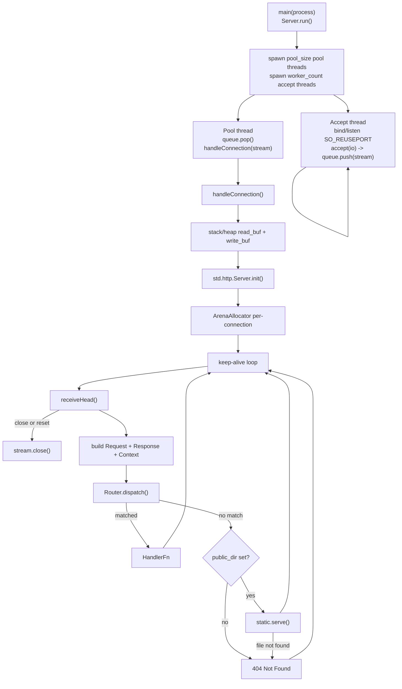

- Accept threads only call `accept()` and push to the shared `ConnQueue`. They never handle I/O.
- Pool threads pop and handle each connection with synchronous blocking I/O (no `io.async()` overhead).
- Default: cpu_count accept threads, `max(10, cpu_count * 2)` pool threads.
- `workers` and `pool_size` tune thread counts, see `HttpServerConfig`.

### .ASYNC: Single Accept, io.async() Dispatch

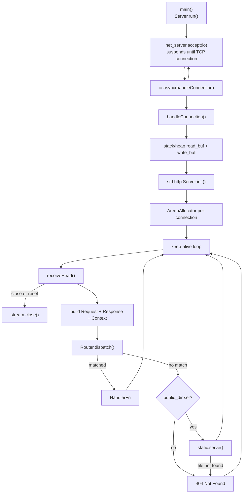

- One accept thread, each connection dispatched as a concurrent task via `io.async()`.
- `workers` and `pool_size` are ignored.
- Preferred for SSE and WebSocket: long-lived connections do not hold pool threads.

### .MIXED: N Accept Threads, io.async() Dispatch

- N accept threads (default cpu_count, `SO_REUSEPORT`). Each dispatches connections via `io.async()` directly, no `ConnQueue`.
- `pool_size` is ignored. `workers` controls accept thread count.
- Balanced throughput and latency, higher jitter than `.POOL` under saturation.

### .EPOLL: Shared-Nothing epoll Workers (Linux-only)

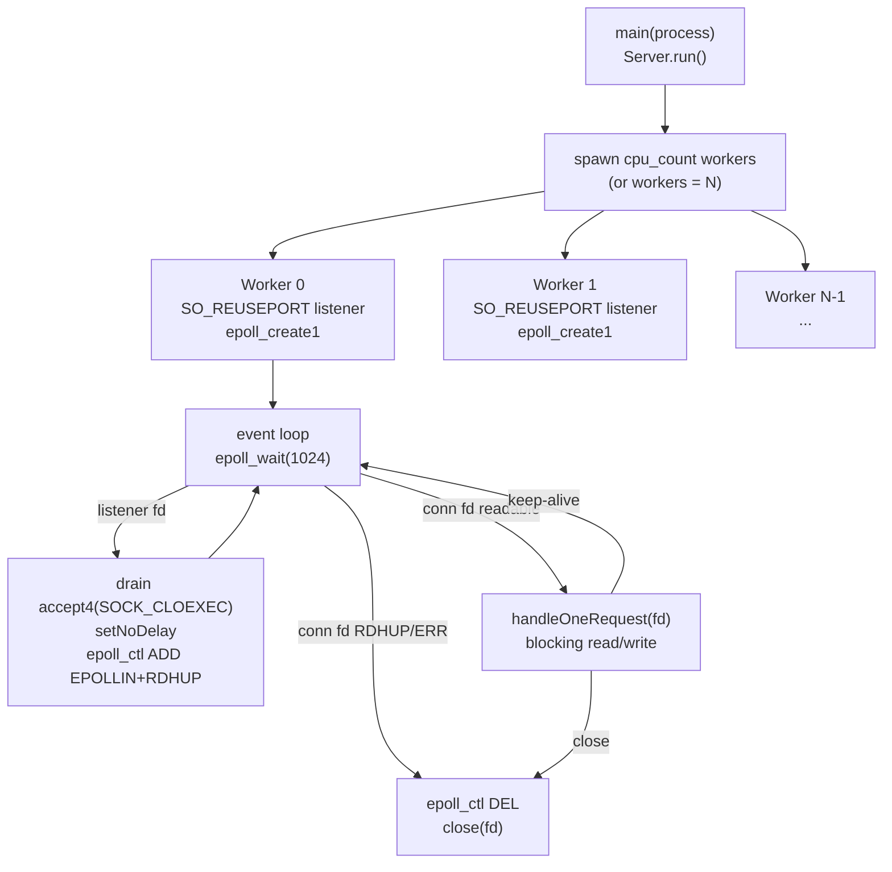

- Each worker owns one `SO_REUSEPORT` listener and one `epoll` instance. The kernel distributes new connections across workers with no shared queue.
- Level-triggered `EPOLLIN`: connections stay registered after each request and re-fire when new data arrives. No explicit re-arm.
- Blocking fds: `handleOneRequest` does a synchronous recv/parse/send, then returns the worker to `epoll_wait`.
- `workers` controls worker count (0 = cpu_count). `pool_size` is ignored.
- Best for high-throughput short-lived requests on Linux. Not suitable for SSE or WebSocket (blocking reads would park the worker).
- Non-Linux builds fall back to `.POOL` automatically.

### .URING: Shared-Nothing io_uring Workers (Linux-only)

Same thread-per-core, shared-nothing topology as `.EPOLL` (one `SO_REUSEPORT` listener and one ring per worker, no shared queue), but completion-based instead of readiness-based: accepts, reads, and writes are submitted as SQEs and reaped as CQEs, so most syscall transitions are batched into the ring (`self.runUring(io)`, ADR-037 Phase 4).

- `workers` controls worker count (0 = cpu_count). `pool_size` is ignored.
- Best for sustained, pipelined load where the batched ring amortizes syscalls. On loopback it matches `.EPOLL` on throughput and wins mainly on cache locality. On a many-core box the ring close (`prep_close`, ADR-041, native to `zix.Http1` for now) keeps the worker reaping completions through connection churn, where `.URING` reaches parity or better at a fraction of the memory.
- Like `.EPOLL`, the per-connection serve is blocking once a request is ready, so it is not suited to SSE or WebSocket.
- Non-Linux builds fall back to `.POOL` automatically.

`zix.Http.Server` receives an opaque `std.Io` value and does not own or deinit the backend. See [`docs/concurrency.md`](concurrency.md) for thread count details and model comparison.

---

## Source Layout

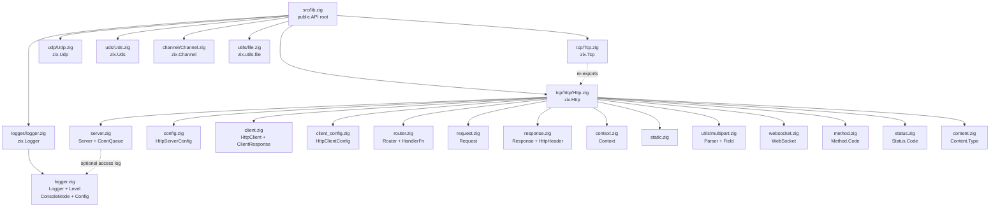

---

## Module Dependencies

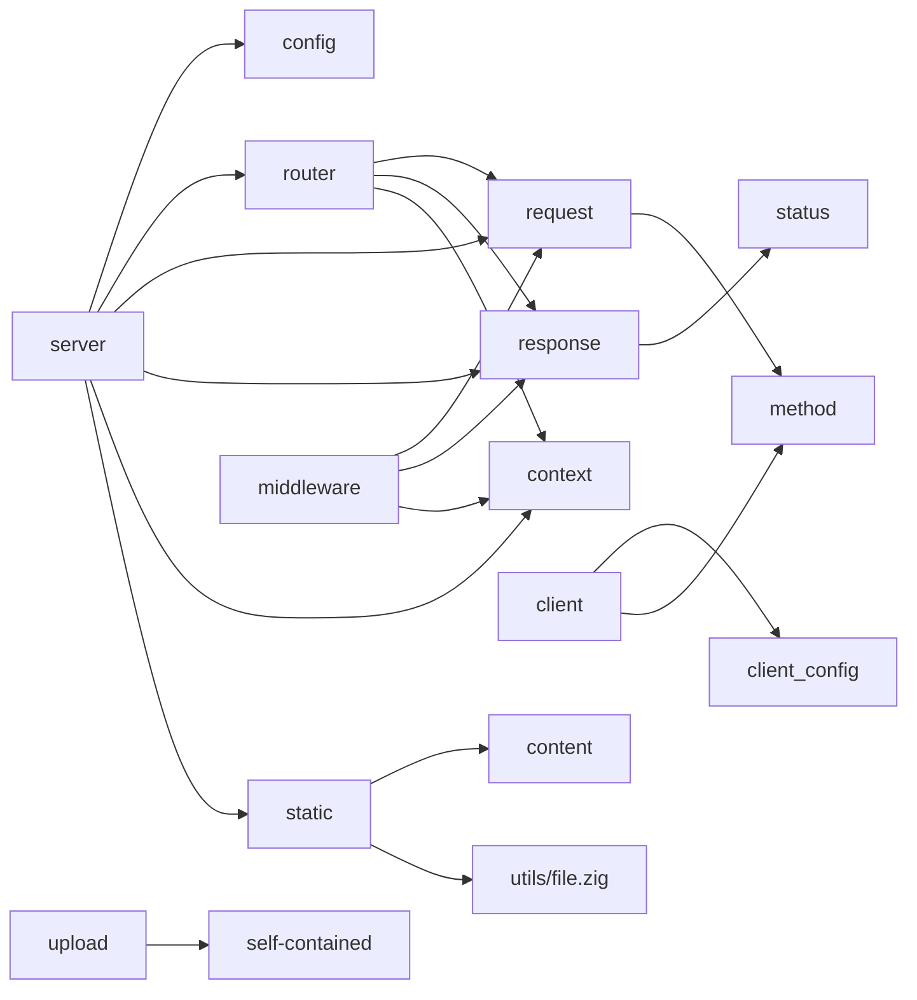

---

## Public API

Access via `const zix = @import("zix");`

| Symbol | Type | Description |
| :- | :- | :- |
| `zix.Http.Server` | struct | Lifecycle: `init(comptime routes, config)` / `deinit()` / `run()` |
| `zix.Http.ServerConfig` | struct | Server configuration (see HttpServerConfig section) |
| `zix.Http.Client` | struct | HTTP client: `init` / `deinit` / `get` / `head` / `post` / `put` / `delete` / `patch` / `request` |
| `zix.Http.ClientConfig` | struct | Client configuration (see HttpClientConfig section) |
| `zix.Http.ClientResponse` | struct | Parsed response: `status` / `header` / `iterateHeaders` / `body` / `deinit` |
| `zix.Http.ClientRequestOpts` | struct | Per-request options: `headers`, `body`, `connect_timeout_ms` override |
| `zix.Http.Request` | struct | Per-request reader: method, path, query, header, body |
| `zix.Http.Response` | struct | Per-request writer: send, sendJson, noContent, addHeader, stream |
| `zix.Http.SseWriter` | struct | SSE event writer returned by `res.sendStream()`: writeEvent, writeNamedEvent, comment |
| `zix.Http.Context` | struct | Per-request context: io, allocator, stream (raw TCP), deadline (optional handler budget), logger (optional logger pointer) |
| `zix.Logger` | struct | File and console logger: `init` / `deinit` / `flush` / `system` / `access` |
| `zix.Logger.Config` | struct | Logger configuration: console, save_path (must exist, caller creates it), save_file, min levels, max_lines |
| `zix.Logger.Level` | enum(u8) | `DEBUG`(0) `INFO`(1) `WARN`(2) `ERROR`(3) |
| `zix.Logger.ConsoleMode` | enum(u8) | `OFF`(0) `DEBUG_ONLY`(1) `ALWAYS`(2) |
| `zix.Http.HandlerFn` | type | `*const fn(*Request, *Response, *Context) anyerror!void` |
| `zix.Http.Header` | struct | `{ name: []const u8, value: []const u8 }` |
| `zix.Tcp.DispatchModel` | enum(u8) | Dispatch model: `.ASYNC`(0) `.POOL`(1) `.MIXED`(2) `.EPOLL`(3, Linux-only natively, non-Linux and non-HTTP/Grpc protocols use `.POOL` automatically) `.URING`(4, Linux-only io_uring, same automatic `.POOL` fallback off Linux) |
| `zix.Http.RequestHeaderSize` | union(enum) | Request header cap: `.MINIMAL`(16) `.COMMON`(32) `.LARGE`(64) `.{ .CUSTOM = N }` |
| `zix.Http.default_user_agent` | `[]const u8` | Client user agent string from `build.zig.zon` (e.g. `"zix/0.1.0"`) |
| `zix.Http.HeaderSize` | union(enum) | Response header cap: `.MINIMAL`(16) `.COMMON`(32) `.LARGE`(64) `.EXTRA_LARGE`(128) `.{ .CUSTOM = N }` |
| `zix.Http.ContentType` | enum | Type-safe MIME representation |
| `zix.Http.Content` | namespace | `typeFromExtension(ext)`, `fromExtension(ext)` |
| `zix.Http.Multipart` | struct | Parse `multipart/form-data` bodies (alias of `zix.utils.multipart.Parser`) |
| `zix.Http.MultipartField` | struct | `{ name, filename, content_type, data, is_file }` (alias of `zix.utils.multipart.Field`) |
| `zix.Http.WebSocket` | namespace | Frame parsing, handshake, room broadcast |
| `zix.Http.WebSocket.Opcode` | enum | continuation text binary close ping pong |
| `zix.Http.WebSocket.Frame` | struct | `{ fin, opcode, payload }` |
| `zix.Http.WebSocket.Conn` | struct | Per-connection handle `{ stream, io }` |
| `zix.Http.WebSocket.RoomMap` | struct | Named room registry: init / join / leave / broadcast / deinit |
| `zix.Http.WebSocket.parseFrame` | fn | Parse one frame from a byte buffer, returns `?ParseResult` |
| `zix.Http.WebSocket.buildFrame` | fn | Serialize a server-to-client frame (unmasked) |
| `zix.Http.WebSocket.acceptKey` | fn | Compute `Sec-WebSocket-Accept` from `Sec-WebSocket-Key` |
| `zix.Http.WebSocket.upgrade` | fn | Write `101 Switching Protocols` onto `ctx.stream` |
| `zix.Http.WebSocket.serveTls` | fn | WebSocket over TLS (wss): encrypted `101` + engine-driven inline frame loop (ADR-055) |
| `zix.Http.WebSocket.send` | fn | Send one server frame, sink-coalesced (used from an `on_frame` callback over TLS) |
| `zix.utils.file.save` | fn | Write bytes to `dir/filename`, creates directory if needed |
| `zix.Tcp.Http.Method.Code` | enum | GET HEAD POST PUT DELETE PATCH OPTIONS TRACE CONNECT |
| `zix.Tcp.Http.Status.Code` | enum | Full HTTP 1xx--5xx status codes |

---

## HttpServerConfig

```zig
pub const HttpServerConfig = struct {
    io:                   std.Io,                         // caller-provided io backend, required, must outlive the server
    ip:                   []const u8,
    port:                 u16,
    dispatch_model:       DispatchModel,    // required: ASYNC, POOL, MIXED, EPOLL, or URING (EPOLL/URING Linux-only)
    kernel_backlog:   usize             = 1024 * 4,  // TCP listen() backlog
    max_recv_buf:   usize             = 1024 * 4,  // read buffer per connection
    large_body_rcvbuf:    usize             = 0,          // SO_RCVBUF on the large-body/upload path, 0 = kernel default
    compress:             bool              = false,      // gzip / deflate / brotli negotiation, opt-in via resp.sendNegotiated (.EPOLL/.URING)
    compression_min_size: usize             = 256,        // skip bodies under this floor
    compression_max_out:  usize             = 256 * 1024, // codec-agnostic compressed-output cap
    max_allocator_size:   usize             = 1024 * 4,  // per-connection arena backing size
    max_request_headers:  RequestHeaderSize = .LARGE,    // request header cap, requests exceeding -> 431
    max_response_headers: HeaderSize        = .MINIMAL,  // custom response header cap, arena-allocated per request
    public_dir:           []const u8        = "",         // static file root, "" disables static serving
    public_dir_upload:    []const u8        = "u",        // upload subdir under public_dir
    conn_timeout_ms:      u32               = 0,          // Layer D: connection guard. 0 = disabled; .POOL only
    handler_timeout_ms:   u32               = 0,          // Layer B: handler budget. 0 = disabled; ctx.isExpired() / ctx.timedOut()
    workers:              usize             = 0,          // 0 = cpu_count; accept threads for .POOL/.MIXED, workers for .EPOLL; ignored by .ASYNC
    pool_size:            usize             = 0,          // 0 = max(10, cpu_count * 2); .POOL only (ignored by .EPOLL, .MIXED, .ASYNC)
    tls:                  ?*zix.Tls.Context = null,       // non-null serves this engine over TLS (native https), else cleartext
    tls_port:             u16               = 0,          // dual-listener companion port, 0 = single-listener; see docs/hld-tls-en.md
    logger:               ?*zix.Logger      = null,       // access logger. null = no HTTP access logging
};
```

The listing above is abbreviated: the full field reference (compression, response cache, uring tuning, REUSEPORT steering) lives in [`docs/zix-config-en.md`](zix-config-en.md).

The caller owns `io`: `zix.Http.Server` does not call `deinit` on it. The route table is passed as a comptime argument to `Server.init`: no runtime allocation for routing.

For header cap selection and security guidance see [`docs/headers.md`](headers.md).

---

## Connection Lifecycle

`.POOL` (pool thread handles connection synchronously):

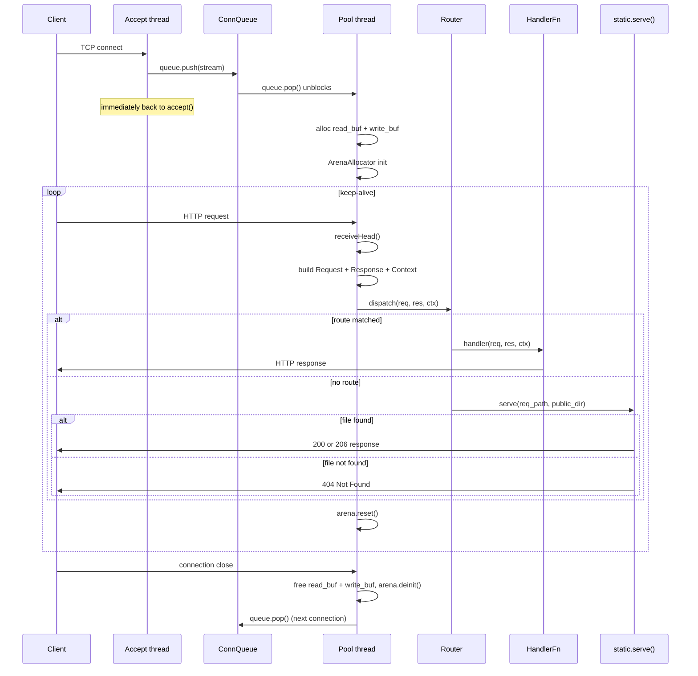

---

## Request

Wraps `*std.http.Server.Request` and a `*std.Io.Reader` for body reading.

| Method | Returns | Notes |
| :- | :- | :- |
| `method()` | `Method.Code` | Mapped from `std.http.Method` |
| `path()` | `[]const u8` | Target stripped of query string |
| `query()` | `[]const u8` | Raw query string after `?` |
| `queryParam(key)` | `?[]const u8` | Single key from query string |
| `queryParams(allocator)` | `![]QueryParam` | All query params bare keys have `value = null` |
| `pathSegments(allocator)` | `![][]const u8` | Non-empty segments split by `/` |
| `pathParam(name)` | `?[]const u8` | Named capture from param route, null if not captured |
| `header(name)` | `?[]const u8` | Case-insensitive lookup. Lazy O(1) index built on first call |
| `body()` | `![]const u8` | Reads body: `Content-Length` bytes or chunked transfer decoded. Cached after first call. |

---

## Response

Buffers response state, writes on `send()` or equivalent.

| Method | Notes |
| :- | :- |
| `setStatus(Status.Code)` | Default: `.OK` |
| `setContentType(Content.Type)` | Opt-in header omitted unless explicitly set |
| `setKeepAlive(bool)` | Opt-in header omitted unless explicitly set |
| `addHeader(name, value)` | Up to `max_response_headers` extra headers rejects CR/LF |
| `send(body)` | Writes full HTTP/1.1 response and flushes |
| `sendJson(body)` | Sets `content_type = application/json`, then `send` |
| `sendText(body)` | Sets `content_type = text/plain`, then `send` |
| `sendRaw(bytes)` | Writes caller-owned wire bytes verbatim, no serialization |
| `sendNoContent()` | Sets status `.NO_CONTENT`, sends empty body |
| `sendStream()` | Sends SSE headers (no `Content-Length`), returns `SseWriter`, and sets `streaming = true` so the keep-alive loop exits after the handler returns |
| `sendFromCache(req)` | `true` on a fresh cache hit (already written), else `false` |
| `sendCached(req, body, ttl_ms)` | Sends `body`, then stores it under the request key for later `sendFromCache` hits |
| `sendNegotiated(req, body)` | Sends `body` compressed per `Accept-Encoding` (opt-in via `setCompression`), else identical to `send` |

Response is written to the underlying `std.Io.Writer`. The 4 KB header buffer limits combined header size, `error.BufferTooSmall` is returned if exceeded.

### Automatic headers emitted by send()

`send()` always emits `Content-Length` and `Date`. `Content-Type` and `Connection` are emitted only when the handler explicitly sets them:

| Header | Value | Emitted? |
| :- | :- | :- |
| `Content-Type` | from `setContentType()` | only if `setContentType()` was called (skipped for 204) |
| `Content-Length` | `body.len` | always (skipped for 204 No Content per RFC 7230) |
| `Connection` | `keep-alive` or `close` | only if `setKeepAlive()` was called |
| `Date` | RFC 7231 UTC timestamp | always |

**`Connection` logic** (emitted only when the handler calls `setKeepAlive()`):
- Omitted entirely if `setKeepAlive()` was never called.
- `keep-alive` when `setKeepAlive(true)` was called **and** `req.head.keep_alive` (parsed from the client's `Connection` request header) is true.
- `close` if the handler called `setKeepAlive(false)` **or** the client sent `Connection: close`.

**`Date` logic** (cross-platform, proxy-aware):
1. `server.zig` scans request headers once before dispatch for a proxy-forwarded `Date` value. If found, stores it in `res.date_cache`.
2. Otherwise `res.date_cache` is set from the global atomic date cache (updated by a timer thread every 500 ms in `.POOL`, or by the accept loop in `.ASYNC`): one atomic load per request, no clock syscall.
3. `send()` reads `res.date_cache` directly, no header scan at send time.
4. Format as IMF-fixdate: `Thu, 08 May 2026 12:34:56 GMT`.

---

## Router

### Registration: comptime route table

Routes are passed at compile time as the second argument to `Server.init`. Each `Route` has a `path`, a `handler`, and an optional `kind` (`RouteKind = .EXACT` by default):

| `kind` | Pattern example | Behaviour |
| :- | :- | :- |
| `.EXACT` (default) | `"/about"` | Matches only when the full path equals `path` |
| `.PREFIX` | `"/api"` | Matches `path` and any sub-path, NOT partial segments |
| `.PARAM` | `"/users/:id"` | `:name` segments captured, literals must match exactly |

```zig
var server = zix.Http.Server.init(&[_]zix.Http.Route{
    .{ .path = "/about",           .handler = aboutHandler },
    .{ .path = "/api",             .handler = apiHandler,    .kind = .PREFIX },
    .{ .path = "/users/:id",       .handler = userHandler,   .kind = .PARAM },
    .{ .path = "/:tenant/:branch", .handler = branchHandler, .kind = .PARAM },
}, .{ .ip = "127.0.0.1", .port = 9000 });
```

Handler accesses the captured segment via `req.pathParam("id")`. Prefix sub-path is read via `req.path()["/api".len..]`.

### Dispatch: priority rules

```
Pass 1: exact routes   O(1) hash map lookup            (registration order irrelevant)
Pass 2: param routes   first matching pattern wins      (registration order matters)
Pass 3: prefix routes  longest matching prefix wins     (registration order irrelevant)

exact > param > prefix (longer prefix beats shorter prefix)
```

Passes 1 and 3 are deterministic regardless of registration order. **Pass 2 is the exception**: when two param patterns have the same segment count and both match, the first-registered wins. Register more-literal patterns before all-param patterns of equal depth.

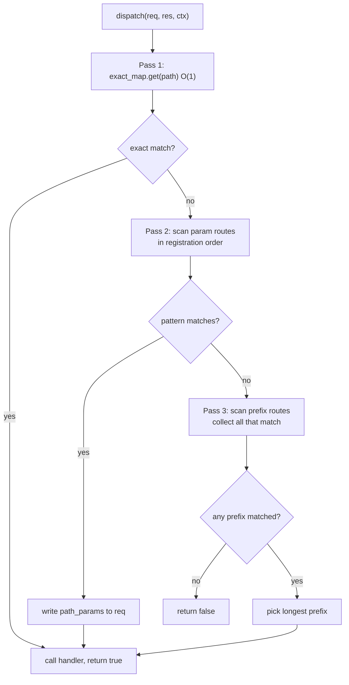

### Priority table

| Registered routes | Request | Winner | Reason |
| :- | :- | :- | :- |
| `/path/info` (exact) + `/path/:id` (param) | `/path/info` | `/path/info` | exact beats all |
| `/path/:id` (param) + `/path` (prefix) | `/path/alice` | `/path/:id` | param beats prefix |
| `/api/v2` (prefix) + `/api` (prefix) | `/api/v2/foo` | `/api/v2` | longer prefix wins |
| `/path` (prefix) | `/pathfoo` | no match | next char must be `/` or end |
| `/path/user/:id` (reg. 1st) + `/path/:a/:b` (reg. 2nd) | `/path/user/alice` | `/path/user/:id` | more literals registered first |
| `/path/:a/:b` (reg. 1st) + `/path/user/:id` (reg. 2nd) | `/path/user/alice` | `/path/:a/:b` | wrong order, all-param wins unexpectedly |

### Regex-like matching

zix has no regex engine. Use `kind = .PREFIX` to match a path prefix. Additional filtering is done inside the handler on `req.path()`.

| Regex intent | zix equivalent |
| :- | :- |
| `/secret/(.*)` | `.PREFIX` route on `"/secret"`, sub-path via `req.path()["/secret".len..]` |
| `/files/.*\.pdf` | `.PREFIX` route on `"/files"`, check `std.mem.endsWith(u8, sub, ".pdf")` in handler |
| `/v[0-9]+/.*` | `.PREFIX` route on `"/v"`, parse next segment with `std.fmt.parseInt` |

---

## Static File Serving

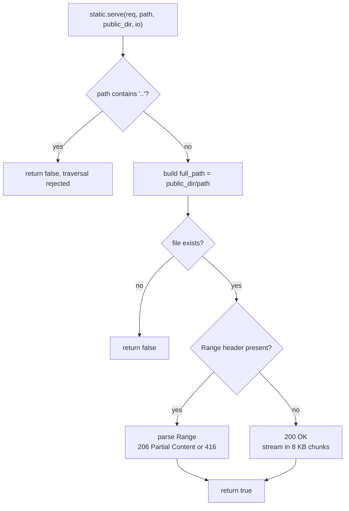

- If `public_dir` is non-empty, `Http.Server.run()` validates the directory at startup.
- Directory traversal (`..`) rejected.
- MIME type resolved from file extension via `zix.Http.Content.typeFromExtension`.
- `Range` header supported: `206 Partial Content` (RFC 7233).

---

## Upload

`zix.utils.multipart.Parser` parses `multipart/form-data` bodies into fields (also exposed as the alias `zix.Http.Multipart`). `zix.utils.file.save` writes bytes to disk. Neither is wired into the server automatically (handlers call them directly).

```zig
var parser = zix.utils.multipart.Parser.init(ctx.allocator, boundary);
defer parser.deinit();
try parser.parse(try req.body());

if (parser.getField("file")) |f| {
    const filename = f.filename orelse "upload";
    const path = try zix.utils.file.save(ctx.io, ctx.allocator, "./public/u", filename, f.data);
    _ = path; // arena-allocated, valid for this request
}
```

---

## Access-Controlled File Serving

Check file existence before the param so the auth requirement is not revealed for non-existent paths.

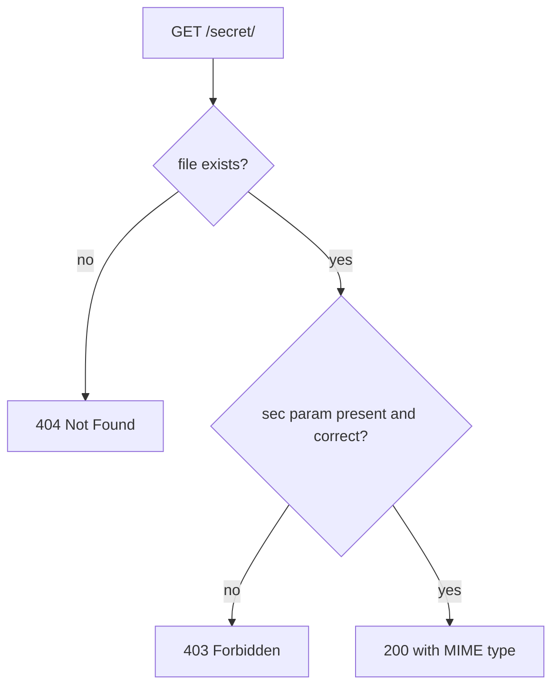

| Request | File exists | sec=abc123 | Response |
| :- | :- | :- | :- |
| `/secret/file.txt?sec=abc123` | yes | yes | 200 |
| `/secret/file.txt` | yes | no | 403 |
| `/secret/missing.txt?sec=abc123` | no | n/a | 404 |

---

## WebSocket

Room-based broadcast over RFC 6455, implemented on the raw TCP stream the HTTP server already holds.

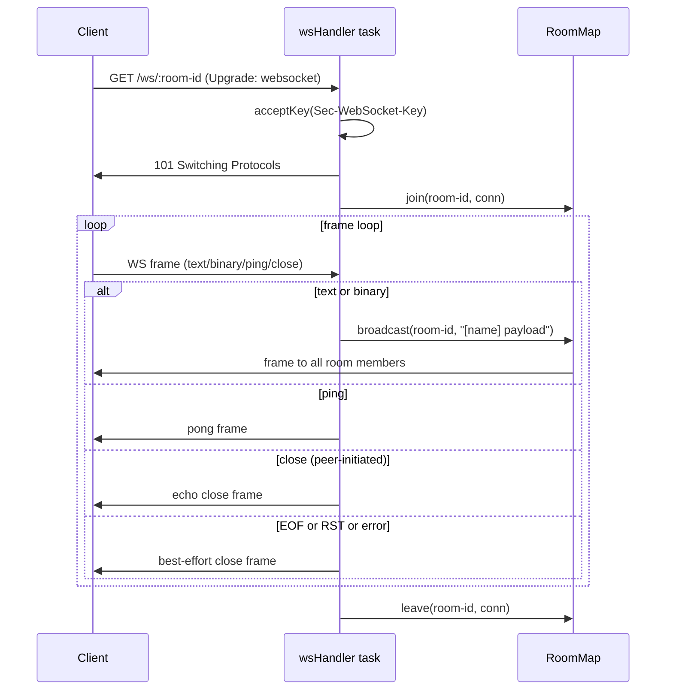

### Context.stream

`ctx.stream` is the raw `std.Io.net.Stream` for the current TCP connection. The server always sets it before calling any handler.

- **HTTP handlers**: receive a valid `ctx.stream` and must not use it.
- **WebSocket handlers**: use `ctx.stream` after `zix.Http.WebSocket.upgrade()` hands off the connection.

### Context.isExpired / timedOut: handler execution budget (Layer B)

When `config.handler_timeout_ms > 0`, the server sets `ctx.deadline` before each handler dispatch. Handlers opt in by calling `ctx.isExpired()` between expensive steps and returning a 408 early rather than blocking the pool thread. `ctx.timedOut()` is an alias for `ctx.isExpired()`.

```zig
pub fn slowHandler(req: *zix.Http.Request, res: *zix.Http.Response, ctx: *zix.Http.Context) !void {
    _ = req;

    doStep1(ctx.io); // e.g. DB query, external call
    if (ctx.isExpired()) {
        res.setStatus(.REQUEST_TIMEOUT);
        return res.sendJson("{\"error\":\"timeout\"}");
    }

    doStep2(ctx.io);
    if (ctx.isExpired()) {
        res.setStatus(.REQUEST_TIMEOUT);
        return res.sendJson("{\"error\":\"timeout\"}");
    }

    try res.sendJson("{\"result\":\"ok\"}");
}
```

`ctx.isExpired()` is always safe to call: it returns `false` when `deadline` is null (i.e. `handler_timeout_ms == 0`). The check is a single clock read and compare, no syscall is issued when the deadline has not passed.

`ctx.setTimeout(ms)` mutates `ctx.deadline` in place to `now + ms`. Use this inside a handler to override the server-wide budget with a shorter or longer window:

```zig
ctx.setTimeout(2_000); // this handler caps itself to 2s regardless of global budget
```

`ctx.withTimeout(ms)` and `ctx.withDeadline(ts)` return a modified copy of ctx with a new deadline (non-mutating, for sub-budget patterns without changing the receiver's deadline).

For the network-level connection guard (Layer D, `conn_timeout_ms`) see ADR-018.

### Handler pattern

```zig
var server = zix.Http.Server.init(&[_]zix.Http.Route{
    .{ .path = "/ws/:room-id", .handler = wsHandler, .kind = .PARAM },
}, .{ .io = process.io, .ip = "127.0.0.1", .port = 9000, .dispatch_model = .ASYNC });

pub fn wsHandler(req: *zix.Http.Request, res: *zix.Http.Response, ctx: *zix.Http.Context) !void {
    const room_id = req.pathParam("room-id") orelse return;
    const display_name = req.queryParam("name") orelse "anonymous";

    // extract Sec-WebSocket-Key before upgrade
    var ws_key: ?[]const u8 = null;
    var it = req.inner.iterateHeaders();
    while (it.next()) |h| {
        if (std.ascii.eqlIgnoreCase(h.name, "sec-websocket-key")) ws_key = h.value;
    }

    var accept_buf: [64]u8 = undefined;
    const accept = try zix.Http.WebSocket.acceptKey(ws_key.?, &accept_buf);
    try zix.Http.WebSocket.upgrade(ctx.stream, ctx.io, accept);

    const conn = try std.heap.smp_allocator.create(zix.Http.WebSocket.Conn);
    conn.* = .{ .stream = ctx.stream, .io = ctx.io };
    defer std.heap.smp_allocator.destroy(conn);
    ws_rooms.join(room_id, conn, ctx.io);
    defer ws_rooms.leave(room_id, conn, ctx.io);

    _ = display_name; // used in frame loop broadcast prefix
    // frame loop: read, dispatch, compact buffer ...
}
```

### RoomMap lifecycle

| Call | When |
| :- | :- |
| `RoomMap.init(smp_allocator)` | once in `main()` before `server.run()` |
| `join(room, conn, io)` | start of each WS handler |
| `leave(room, conn, io)` | deferred immediately after join |
| `broadcast(room, msg, io)` | each text/binary frame |
| `RoomMap.deinit()` | process shutdown |

---

## SSE (Server-Sent Events)

One-way server push over HTTP/1.1. The client uses the browser's `EventSource` API or `curl -N`. No upgrade handshake is required.

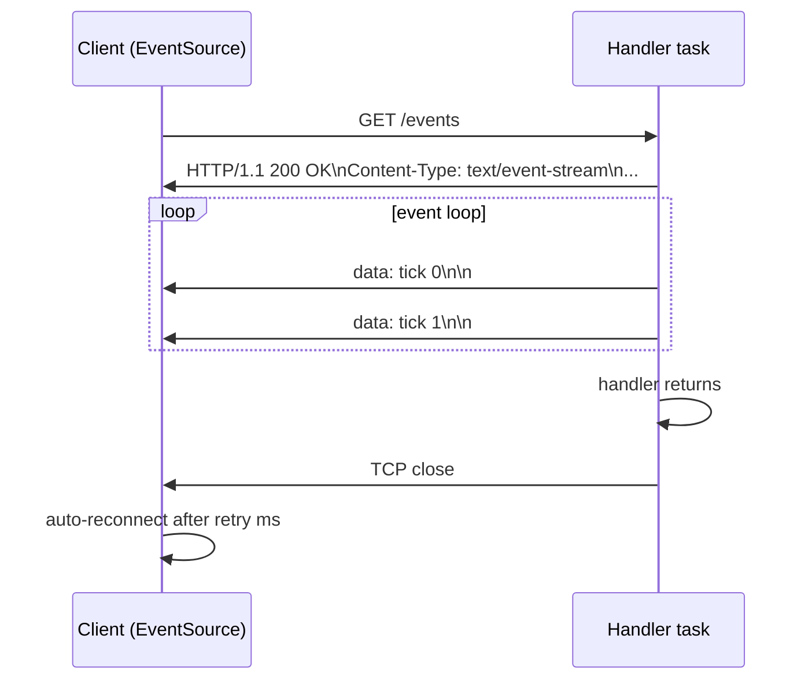

### res.sendStream()

`res.sendStream()` (renamed from `stream()`, ADR-062) sends the SSE response headers (no `Content-Length`) and returns an `SseWriter`. The connection stays open while the handler writes events. When the handler returns, `handleConnection` sees `res.streaming == true` and closes the connection instead of looping for the next request.

| `SseWriter` method | Wire format |
| :- | :- |
| `writeEvent(data)` | `data: <data>\n\n` |
| `writeNamedEvent(event, data)` | `event: <event>\ndata: <data>\n\n` |
| `comment(text)` | `: <text>\n` |

### Concurrency requirement

SSE connections are long-lived. `.POOL`'s blocking thread pool would be exhausted (one thread per open stream, blocked for the full stream duration). `.ASYNC` is preferred: each connection runs as a concurrent task via `io.async()` without occupying a pool thread.

### Handler pattern

```zig
pub fn eventsHandler(req: *zix.Http.Request, res: *zix.Http.Response, ctx: *zix.Http.Context) !void {
    _ = req;
    const sse = try res.sendStream();
    var i: u32 = 0;
    while (i < 10) : (i += 1) {
        var buf: [32]u8 = undefined;
        const msg = std.fmt.bufPrint(&buf, "tick {d}", .{i}) catch break;
        sse.writeEvent(msg) catch break;
        std.Io.sleep(ctx.io, std.Io.Duration.fromMilliseconds(1000), .awake) catch break;
    }
}
```

See `examples/http_sse.zig`.

---

## Middleware

Composed at comptime using wrapper functions. No heap allocation, no runtime chain runner.

```zig
fn withOriginCheck(comptime next: zix.Http.HandlerFn) zix.Http.HandlerFn {
    return struct {
        fn handle(req: *zix.Http.Request, res: *zix.Http.Response, ctx: *zix.Http.Context) anyerror!void {
            const origin = req.header("origin") orelse "";
            if (!isAllowedOrigin(origin)) {
                res.setStatus(.FORBIDDEN);
                try res.sendJson("{\"error\":\"forbidden origin\"}");
                return;
            }
            return next(req, res, ctx);
        }
    }.handle;
}
```

Compose left-to-right: the outermost wrapper runs first. Routes are registered at compile time via `Server.init`:

```zig
var server = zix.Http.Server.init(&[_]zix.Http.Route{
    .{ .path = "/public",  .handler = withOriginCheck(publicHandler) },
    .{ .path = "/private", .handler = withOriginCheck(withBasicAuth(privateHandler)) },
}, .{ .io = process.io, .ip = "127.0.0.1", .port = 9000 });
```

Each unique `next` value generates a distinct function at comptime. See `examples/http_middleware.zig`.

---

## Memory Model

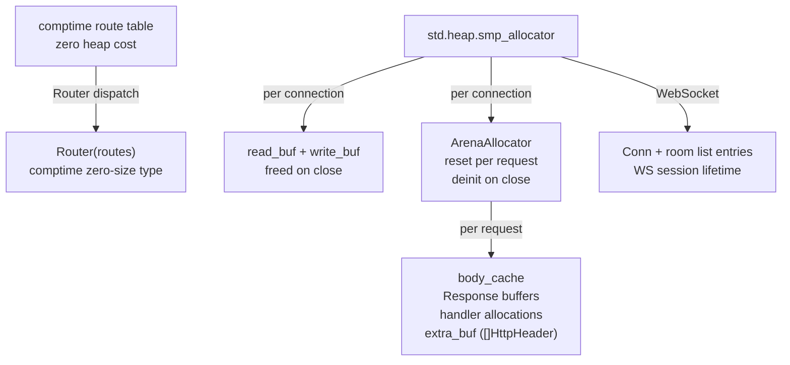

| Scope | Allocator | Lifetime | Arena suitable? |
| :- | :- | :- | :- |
| Route table | comptime (zero heap cost) | Process | n/a (comptime constant, no allocation) |
| Read/write I/O buffers | `smp_allocator` | Connection | No (individually freed on connection close) |
| Per-request allocations | Per-connection `ArenaAllocator` reset each request | Request | Yes (by design) |
| WebSocket `Conn` + room entries | `smp_allocator` | WS session | No (individually freed on session end) |

---

## Http Client

`zix.Http.Client` wraps `std.http.Client` with explicit config, named errors, and a caller-owned `ClientResponse`.

### HttpClientConfig

```zig
pub const HttpClientConfig = struct {
    allocator:           std.mem.Allocator, // owns response body + head copies
    io:                  std.Io,            // event-loop backend, not owned by client
    connect_timeout_ms:  u32 = 0,          // 0 = no timeout. enforced via connectTcpOptions
    response_timeout_ms: u32 = 0,          // 0 = no timeout. v1: stored, not yet enforced
    read_timeout_ms:     u32 = 0,          // 0 = no timeout. v1: stored, not yet enforced
    max_response_body:   usize = 1024 * 1024 * 4, // error.BodyTooLarge when exceeded
    follow_redirects:    bool = true,
    max_redirects:       u8   = 3,
    h2_max_read_rounds:  usize = 4096,                       // HTTP/2 client read-loop bound, max frame-read rounds
    user_agent:          []const u8 = zon_options.user_agent, // library version string (e.g. "zix/0.1.0"); "" omits
    version:             Version = .HTTP_1,                  // .HTTP_1 (std client) or .HTTP_2 (h2 over TLS 1.3, https only)
    tls_ca_path:         ?[]const u8 = null,                 // extra CA PEM for https. null = system roots
    tls_verify:          bool = true,                        // verify server cert chain + hostname on https
};
```

### Request lifecycle

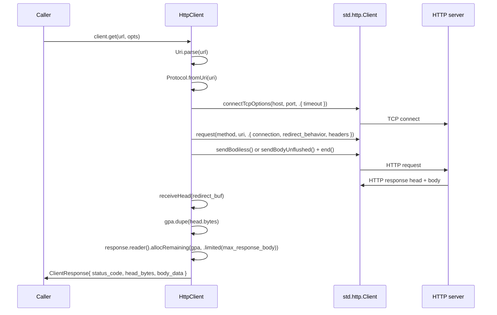

### Named errors

| Error | When |
| :- | :- |
| `error.InvalidUrl` | `Uri.parse` fails, unsupported scheme, or missing host |
| `error.BodyTooLarge` | response body exceeds `max_response_body` bytes |
| `error.Timeout` | TCP connect exceeded `connect_timeout_ms` (from `std.Io`) |

Other errors from `std.http.Client` propagate unchanged (OutOfMemory, ConnectionRefused, etc.).

### ClientResponse memory

`ClientResponse` owns two heap allocations, both using `config.allocator`:

| Field | Source | Must free? |
| :- | :- | :- |
| `head_bytes: []u8` | `gpa.dupe(response.head.bytes)` | Yes, via `deinit()` |
| `body_data: []u8` | `body_reader.allocRemaining(gpa, ...)` | Yes if len > 0, via `deinit()` |

Call `resp.deinit()` to release both. After `deinit()`, all slices returned by `status()`, `header()`, `body()` are invalid.

### Redirect handling

- `follow_redirects: true` (default): `std.http.Client` follows up to `max_redirects` hops automatically. Each hop opens a new connection.
- `follow_redirects: false`: `ClientResponse` carries the 3xx response directly (the caller reads `header("location")`).
- Body-bearing methods (POST, PUT, PATCH) that receive a redirect return `error.RedirectRequiresResend` (std behavior).

### Deferred features

| Feature | Status |
| :- | :- |
| `response_timeout_ms` enforcement | v1: field stored, not yet applied |
| `read_timeout_ms` enforcement | v1: field stored, not yet applied |
| TLS / HTTPS (client) | https via `version = .HTTP_2` (h2 over TLS 1.3, `h2_client.zig`), trusting the server cert through `tls_ca_path` / `tls_verify`. The HTTP/1 client path is cleartext |
| Connection pool keep-alive reuse | inherited from `std.http.Client` pool (enabled by default) |

---

## Not Yet Implemented

| Feature | Location | Note |
| :- | :- | :- |
| Middleware chain runner | deleted (ADR-062) | Comptime wrapper composition is the middleware idiom, see `examples/http_middleware.zig` |
| response/read timeout enforcement (client) | `client.zig` | Config fields stored. IO-level wiring deferred |

TLS for this server (native https, opt-in via `config.tls`, dual listener via `config.tls_port`) is implemented, see [`docs/hld-tls-en.md`](hld-tls-en.md).

For UDP design see [`docs/hld-udp.md`](hld-udp.md). For UDS see [`docs/hld-uds.md`](hld-uds.md).

---

###### end of hld-http
