# HLD: zix.Http

HTTP server dan client yang dibangun di atas `std.Io` Zig 0.16.x.

---

## Tujuan

### Server
- Eksplisit lebih utama dari implisit: tidak ada magic, setiap perilaku dinamai dalam config atau registrasi.
- Satu berkas, satu tanggung jawab.
- Indirection minimal pada hot path.
- Tidak ada alokasi tersembunyi di dalam handler.
- Routing yang dapat diprediksi: prioritas dispatch bersifat deterministik.

### Client
- Konfigurasi eksplisit: allocator, io, timeout, batas body, dan kebijakan redirect semuanya dinamai.
- Response bertipe: status code, pencarian header, dan bytes body semuanya dimiliki oleh pemanggil.
- Error yang dinamai: `InvalidUrl`, `BodyTooLarge` muncul sebelum pemanggil harus memeriksa error stdlib.
- Tidak ada alokasi tersembunyi: setiap alokasi menggunakan allocator yang disuplai pemanggil.

---

## Model Runtime

Lima model dispatch, dipilih melalui `config.dispatch_model` (enum `DispatchModel`). Wajib: pemanggil harus menyetelnya secara eksplisit (tidak ada default).

### .POOL: Work-Queue Thread Pool

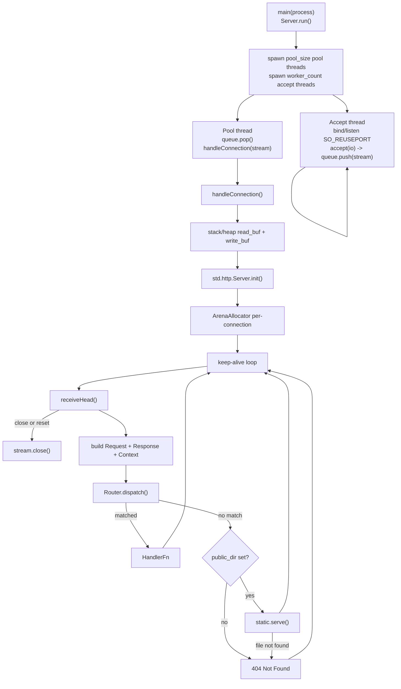

- Accept thread hanya memanggil `accept()` dan mendorong koneksi ke `ConnQueue` yang dipakai bersama. Accept thread tidak pernah menangani I/O.
- Pool thread mengambil dan menangani setiap koneksi dengan I/O blocking sinkron (tanpa overhead `io.async()`).
- Default: cpu_count accept thread, `max(10, cpu_count * 2)` pool thread.
- `workers` dan `pool_size` mengatur jumlah thread. Lihat `HttpServerConfig`.

### .ASYNC: Accept Tunggal, Dispatch io.async()

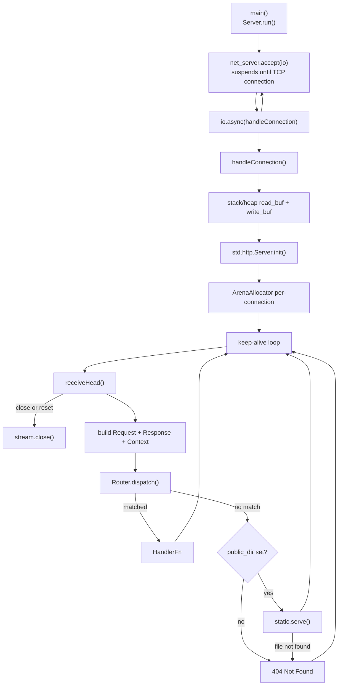

- Satu accept thread. Setiap koneksi di-dispatch sebagai task konkuren melalui `io.async()`.
- `workers` dan `pool_size` diabaikan.
- Direkomendasikan untuk SSE dan WebSocket: koneksi berumur panjang tidak menahan pool thread.

### .MIXED: N Accept Thread, Dispatch io.async()

- N accept thread (default cpu_count, `SO_REUSEPORT`). Setiap thread men-dispatch koneksi langsung melalui `io.async()` tanpa `ConnQueue`.
- `pool_size` diabaikan. `workers` mengontrol jumlah accept thread.
- Throughput dan latency seimbang. Jitter lebih tinggi dibanding `.POOL` saat saturasi.

### .EPOLL: Shared-Nothing epoll Worker (Linux-only)

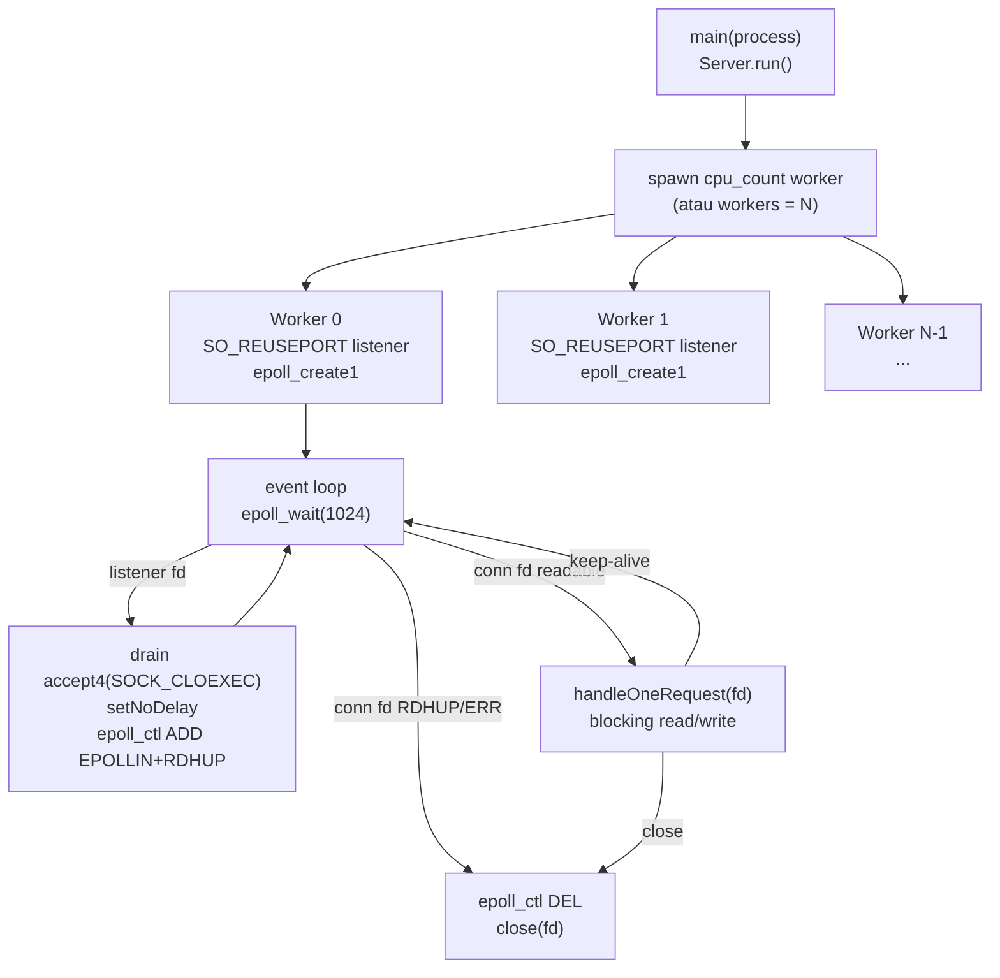

- Setiap worker memiliki satu `SO_REUSEPORT` listener dan satu `epoll` instance. Kernel mendistribusikan koneksi baru ke worker tanpa antrian bersama.
- Level-triggered `EPOLLIN`: koneksi tetap terdaftar setelah setiap request dan re-fires saat data baru tiba. Tidak perlu re-arm eksplisit.
- Fd blocking: `handleOneRequest` melakukan recv/parse/send secara sinkron, lalu mengembalikan worker ke `epoll_wait`.
- `workers` mengontrol jumlah worker (0 = cpu_count). `pool_size` diabaikan.
- Terbaik untuk request berumur pendek throughput tinggi di Linux. Tidak cocok untuk SSE atau WebSocket (blocking read akan menahan worker).
- Build non-Linux otomatis fallback ke `.POOL`.

### .URING: Worker io_uring Shared-Nothing (Linux-only)

Topologi thread-per-core, shared-nothing yang sama dengan `.EPOLL` (satu `SO_REUSEPORT` listener dan satu ring per worker, tanpa queue bersama), tetapi completion-based alih-alih readiness-based: accept, read, dan write disubmit sebagai SQE dan dipanen sebagai CQE, sehingga sebagian besar transisi syscall di-batch ke dalam ring (`self.runUring(io)`, ADR-037 Fase 4).

- `workers` mengontrol jumlah worker (0 = cpu_count). `pool_size` diabaikan.
- Terbaik untuk beban sustained dan pipelined di mana ring yang di-batch mengamortisasi syscall. Di loopback setara `.EPOLL` pada throughput dan menang terutama pada cache locality. Di mesin many-core, ring close (`prep_close`, ADR-041, native ke `zix.Http1` untuk saat ini) membuat worker terus memanen completion lewat connection churn, di mana `.URING` mencapai paritas atau lebih baik dengan memori jauh lebih sedikit.
- Seperti `.EPOLL`, serve per-connection bersifat blocking begitu request siap, jadi tidak cocok untuk SSE atau WebSocket.
- Build non-Linux otomatis fallback ke `.POOL`.

`zix.Http.Server` menerima nilai `std.Io` yang opak dan tidak memiliki atau memanggil deinit pada backend tersebut. Lihat [`docs/concurrency-id.md`](concurrency-id.md) untuk detail jumlah thread dan perbandingan model.

---

## Struktur Berkas

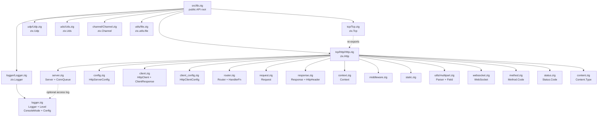

---

## Dependensi Modul

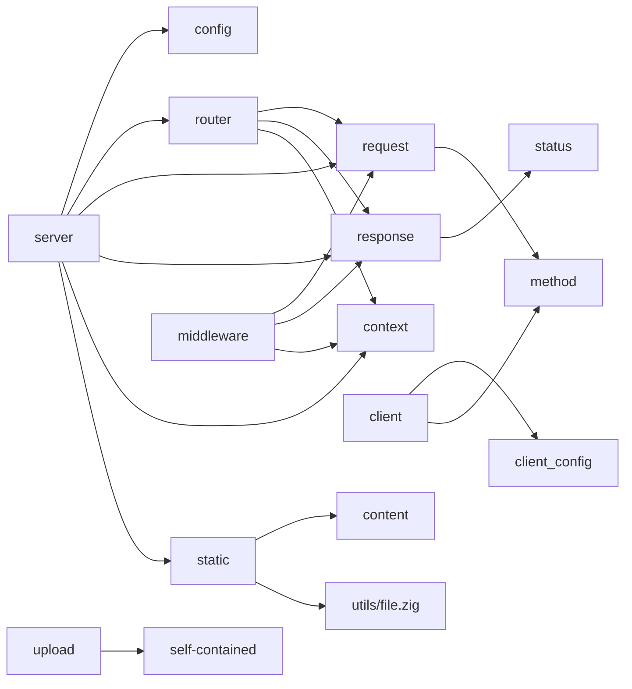

---

## API Publik

Diakses melalui `const zix = @import("zix");`

| Simbol | Tipe | Deskripsi |
| :- | :- | :- |
| `zix.Http.Server` | struct | Siklus hidup: `init(comptime stack_threshold, comptime routes, config)` / `deinit()` / `run()` |
| `zix.Http.ServerConfig` | struct | Konfigurasi server (lihat bagian HttpServerConfig) |
| `zix.Http.Client` | struct | HTTP client: `init` / `deinit` / `get` / `head` / `post` / `put` / `delete` / `patch` / `request` |
| `zix.Http.ClientConfig` | struct | Konfigurasi client (lihat bagian HttpClientConfig) |
| `zix.Http.ClientResponse` | struct | Response yang telah di-parse: `status` / `header` / `iterateHeaders` / `body` / `deinit` |
| `zix.Http.ClientRequestOpts` | struct | Opsi per-request: `headers`, `body`, override `connect_timeout_ms` |
| `zix.Http.Request` | struct | Reader per-request: method, path, query, header, body |
| `zix.Http.Response` | struct | Writer per-request: send, sendJson, noContent, addHeader, stream |
| `zix.Http.SseWriter` | struct | Penulis event SSE yang dikembalikan oleh `res.stream()`: writeEvent, writeNamedEvent, comment |
| `zix.Http.Context` | struct | Konteks per-request: io, allocator, stream (TCP mentah), deadline (anggaran handler opsional), logger (pointer logger opsional) |
| `zix.Logger` | struct | Logger berkas dan konsol: `init` / `deinit` / `flush` / `system` / `access` |
| `zix.Logger.Config` | struct | Konfigurasi logger: console, save_path (harus sudah ada, dibuat oleh pemanggil), save_file, level minimum, max_lines |
| `zix.Logger.Level` | enum(u8) | `DEBUG`(0) `INFO`(1) `WARN`(2) `ERROR`(3) |
| `zix.Logger.ConsoleMode` | enum(u8) | `OFF`(0) `DEBUG_ONLY`(1) `ALWAYS`(2) |
| `zix.Http.HandlerFn` | type | `*const fn(*Request, *Response, *Context) anyerror!void` |
| `zix.Http.Header` | struct | `{ name: []const u8, value: []const u8 }` |
| `zix.Tcp.DispatchModel` | enum(u8) | Model dispatch: `.ASYNC`(0) `.POOL`(1) `.MIXED`(2) `.EPOLL`(3, native Linux saja. Non-Linux dan protokol selain HTTP/Grpc menggunakan `.POOL` secara otomatis) `.URING`(4, io_uring Linux saja, fallback `.POOL` otomatis yang sama di luar Linux) |
| `zix.Http.RequestHeaderSize` | union(enum) | Batas header request: `.MINIMAL`(16) `.COMMON`(32) `.LARGE`(64) `.{ .CUSTOM = N }` |
| `zix.Http.default_user_agent` | `[]const u8` | String user agent client dari `build.zig.zon` (contoh: `"zix/0.1.0"`) |
| `zix.Http.HeaderSize` | union(enum) | Batas header response: `.MINIMAL`(16) `.COMMON`(32) `.LARGE`(64) `.EXTRA_LARGE`(128) `.{ .CUSTOM = N }` |
| `zix.Http.ContentType` | enum | Representasi MIME bertipe aman |
| `zix.Http.Content` | namespace | `typeFromExtension(ext)`, `fromExtension(ext)` |
| `zix.Http.Multipart` | struct | Parse body `multipart/form-data` (alias dari `zix.utils.multipart.Parser`) |
| `zix.Http.MultipartField` | struct | `{ name, filename, content_type, data, is_file }` (alias dari `zix.utils.multipart.Field`) |
| `zix.Http.WebSocket` | namespace | Parsing frame, handshake, broadcast room |
| `zix.Http.WebSocket.Opcode` | enum | continuation text binary close ping pong |
| `zix.Http.WebSocket.Frame` | struct | `{ fin, opcode, payload }` |
| `zix.Http.WebSocket.Conn` | struct | Handle per-koneksi `{ stream, io }` |
| `zix.Http.WebSocket.RoomMap` | struct | Registri room bernama: init / join / leave / broadcast / deinit |
| `zix.Http.WebSocket.parseFrame` | fn | Parse satu frame dari buffer byte, mengembalikan `?ParseResult` |
| `zix.Http.WebSocket.buildFrame` | fn | Serialisasi frame server-ke-client (tanpa mask) |
| `zix.Http.WebSocket.acceptKey` | fn | Hitung `Sec-WebSocket-Accept` dari `Sec-WebSocket-Key` |
| `zix.Http.WebSocket.upgrade` | fn | Tulis `101 Switching Protocols` ke `ctx.stream` |
| `zix.Http.WebSocket.serveTls` | fn | WebSocket melalui TLS (wss): `101` terenkripsi + inline frame loop engine-driven (ADR-055) |
| `zix.Http.WebSocket.send` | fn | Kirim satu server frame, ter-coalesce sink (dipakai dari callback `on_frame` melalui TLS) |
| `zix.utils.file.save` | fn | Tulis bytes ke `dir/filename`, membuat direktori bila belum ada |
| `zix.Tcp.Http.Method.Code` | enum | GET HEAD POST PUT DELETE PATCH OPTIONS TRACE CONNECT |
| `zix.Tcp.Http.Status.Code` | enum | Status code HTTP lengkap 1xx--5xx |

---

## HttpServerConfig

```zig
pub const HttpServerConfig = struct {
    io:                   std.Io,                         // backend io dari pemanggil, wajib, harus outlive server
    ip:                   []const u8,
    port:                 u16,
    dispatch_model:       DispatchModel,    // required: ASYNC, POOL, MIXED, EPOLL, or URING (EPOLL/URING Linux-only)
    kernel_backlog:   usize             = 1024 * 4,  // TCP listen() backlog
    max_recv_buf:   usize             = 1024 * 4,  // read buffer per connection
    large_body_rcvbuf:    usize             = 0,          // SO_RCVBUF pada jalur large-body/upload, 0 = default kernel
    compress:             bool              = false,      // negosiasi gzip / deflate / brotli, opt-in via resp.sendNegotiated (.EPOLL/.URING)
    compression_min_size: usize             = 256,        // lewati body di bawah floor ini
    compression_max_out:  usize             = 256 * 1024, // cap output terkompresi codec-agnostic
    max_allocator_size:   usize             = 1024 * 4,  // per-connection arena backing size
    max_client_response:  usize             = 1024 * 4,  // write buffer per connection
    max_request_headers:  RequestHeaderSize = .LARGE,    // request header cap, requests exceeding -> 431
    max_response_headers: HeaderSize        = .MINIMAL,  // custom response header cap, arena-allocated per request
    public_dir:           []const u8        = "",         // static file root, "" disables static serving
    public_dir_upload:    []const u8        = "u",        // upload subdir under public_dir
    conn_timeout_ms:      u32               = 0,          // Layer D: connection guard. 0 = disabled; .POOL only
    handler_timeout_ms:   u32               = 0,          // Layer B: handler budget. 0 = disabled; ctx.isExpired() / ctx.timedOut()
    workers:              usize             = 0,          // 0 = cpu_count; accept threads untuk .POOL/.MIXED, workers untuk .EPOLL; diabaikan oleh .ASYNC
    pool_size:            usize             = 0,          // 0 = max(10, cpu_count * 2); .POOL only (diabaikan oleh .EPOLL, .MIXED, .ASYNC)
    logger:               ?*zix.Logger      = null,       // access logger. null = no HTTP access logging
};
```

Pemanggil memiliki `io`: `zix.Http.Server` tidak memanggil `deinit` padanya. Tabel route dioper sebagai argumen comptime ke `Server.init` sehingga tidak ada alokasi runtime untuk routing.

Untuk panduan pemilihan batas header dan keamanan, lihat [`docs/headers.md`](headers.md).

---

## Siklus Hidup Koneksi

`.POOL` (pool thread menangani koneksi secara sinkron):

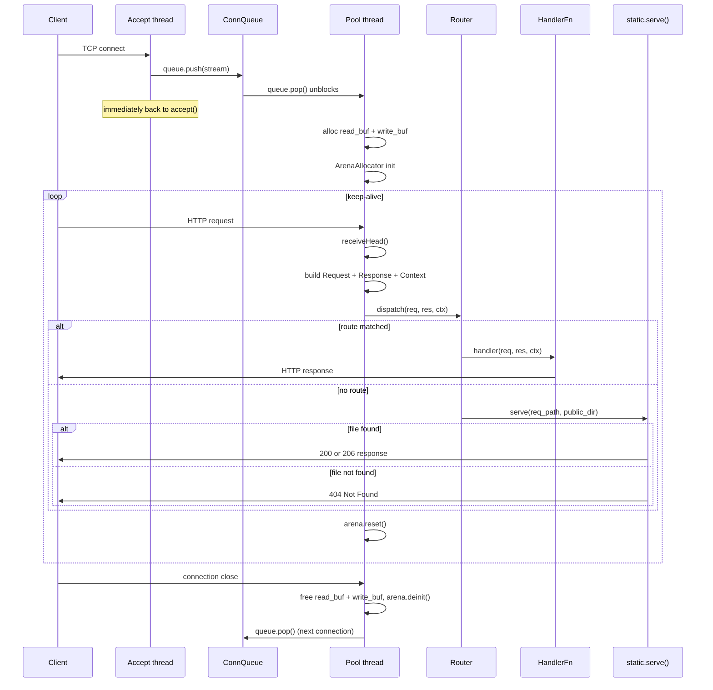

---

## Request

Membungkus `*std.http.Server.Request` dan `*std.Io.Reader` untuk pembacaan body.

| Method | Mengembalikan | Catatan |
| :- | :- | :- |
| `method()` | `Method.Code` | Dipetakan dari `std.http.Method` |
| `path()` | `[]const u8` | Target tanpa query string |
| `query()` | `[]const u8` | Raw query string setelah `?` |
| `queryParam(key)` | `?[]const u8` | Satu key dari query string |
| `queryParams(allocator)` | `![]QueryParam` | Semua query param. Key tanpa nilai memiliki `value = null` |
| `pathSegments(allocator)` | `![][]const u8` | Segmen tidak kosong yang dipisahkan oleh `/` |
| `pathParam(name)` | `?[]const u8` | Capture bernama dari param route. null bila tidak ditangkap |
| `header(name)` | `?[]const u8` | Pencarian case-insensitive. Indeks O(1) dibangun pada pemanggilan pertama |
| `body()` | `![]const u8` | Membaca body: bytes `Content-Length` atau chunked transfer yang sudah di-decode. Di-cache setelah pemanggilan pertama. |

---

## Response

Menyangga status response dan menulis saat `send()` atau padanannya dipanggil.

| Method | Catatan |
| :- | :- |
| `setStatus(Status.Code)` | Default: `.OK` |
| `setContentType(Content.Type)` | Header opt-in, tidak dikirim kecuali diset secara eksplisit |
| `setKeepAlive(bool)` | Header opt-in, tidak dikirim kecuali diset secara eksplisit |
| `addHeader(name, value)` | Hingga `max_response_headers` header tambahan. CR/LF ditolak |
| `send(body)` | Menulis response HTTP/1.1 penuh dan flush |
| `sendJson(body)` | Menetapkan `content_type = application/json`, lalu memanggil `send` |
| `noContent()` | Menetapkan status `.NO_CONTENT`, mengirim body kosong |
| `stream()` | Mengirim header SSE (tanpa `Content-Length`), mengembalikan `SseWriter`. Menetapkan `streaming = true` sehingga loop keep-alive keluar setelah handler kembali |

Response ditulis ke `std.Io.Writer` yang mendasarinya. Buffer header 4 KB membatasi ukuran header gabungan. `error.BufferTooSmall` dikembalikan jika terlampaui.

### Header otomatis yang dikirim oleh send()

`send()` selalu mengirim `Content-Length` dan `Date`. `Content-Type` dan `Connection` hanya dikirim bila handler menetapkannya secara eksplisit:

| Header | Nilai | Dikirim? |
| :- | :- | :- |
| `Content-Type` | dari `setContentType()` | hanya bila `setContentType()` dipanggil (dilewati untuk 204) |
| `Content-Length` | `body.len` | selalu (dilewati untuk 204 No Content sesuai RFC 7230) |
| `Connection` | `keep-alive` atau `close` | hanya bila `setKeepAlive()` dipanggil |
| `Date` | timestamp UTC RFC 7231 | selalu |

**Logika `Connection`** (dikirim hanya bila handler memanggil `setKeepAlive()`):
- Tidak dikirim sama sekali bila `setKeepAlive()` tidak pernah dipanggil.
- `keep-alive` bila `setKeepAlive(true)` dipanggil **dan** `req.head.keep_alive` (di-parse dari header request `Connection` client) bernilai true.
- `close` bila handler memanggil `setKeepAlive(false)` **atau** client mengirim `Connection: close`.

**Logika `Date`** (lintas platform, sadar proxy):
1. `server.zig` memindai header request satu kali sebelum dispatch untuk nilai `Date` yang diteruskan proxy. Bila ditemukan, disimpan di `res.date_cache`.
2. Bila tidak ada, `res.date_cache` diisi dari cache date atomik global (diperbarui oleh timer thread setiap 500 ms pada `.POOL`, atau oleh accept loop pada `.ASYNC`). Satu atomic load per request, tanpa syscall clock.
3. `send()` membaca `res.date_cache` langsung tanpa pemindaian header saat pengiriman.
4. Format IMF-fixdate: `Thu, 08 May 2026 12:34:56 GMT`.

---

## Routing

### Registrasi: tabel route comptime

Route dioper saat kompilasi sebagai argumen kedua ke `Server.init`. Setiap `Route` memiliki `path`, sebuah `handler`, dan `kind` opsional (`RouteKind = .EXACT` sebagai default):

| `kind` | Contoh pola | Perilaku |
| :- | :- | :- |
| `.EXACT` (default) | `"/about"` | Cocok hanya bila path penuh sama dengan `path` |
| `.PREFIX` | `"/api"` | Cocok dengan `path` dan sub-path apapun, BUKAN segmen parsial |
| `.PARAM` | `"/users/:id"` | Segmen `:name` ditangkap, literal harus cocok persis |

```zig
var server = try zix.Http.Server.init(4096, &[_]zix.Http.Route{
    .{ .path = "/about",           .handler = aboutHandler },
    .{ .path = "/api",             .handler = apiHandler,    .kind = .PREFIX },
    .{ .path = "/users/:id",       .handler = userHandler,   .kind = .PARAM },
    .{ .path = "/:tenant/:branch", .handler = branchHandler, .kind = .PARAM },
}, .{ .ip = "127.0.0.1", .port = 9000 });
```

Handler mengakses segmen yang ditangkap melalui `req.pathParam("id")`. Sub-path prefix dibaca melalui `req.path()["/api".len..]`.

### Dispatch: aturan prioritas

```
Pass 1: exact routes   pencarian hash map O(1)          (urutan registrasi tidak relevan)
Pass 2: param routes   pola pertama yang cocok menang   (urutan registrasi penting)
Pass 3: prefix routes  prefix terpanjang yang cocok menang  (urutan registrasi tidak relevan)

exact > param > prefix (prefix lebih panjang mengalahkan prefix lebih pendek)
```

Pass 1 dan 3 bersifat deterministik terlepas dari urutan registrasi. **Pass 2 adalah pengecualian**: bila dua pola param memiliki jumlah segmen yang sama dan keduanya cocok, yang terdaftar pertama menang. Daftarkan pola yang lebih literal sebelum pola all-param dengan kedalaman yang sama.

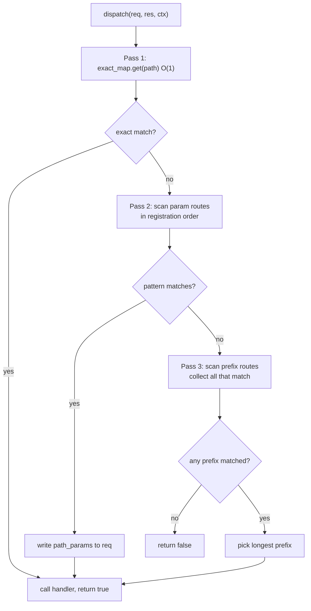

### Tabel prioritas

| Route yang terdaftar | Request | Pemenang | Alasan |
| :- | :- | :- | :- |
| `/path/info` (exact) + `/path/:id` (param) | `/path/info` | `/path/info` | exact mengalahkan semua |
| `/path/:id` (param) + `/path` (prefix) | `/path/alice` | `/path/:id` | param mengalahkan prefix |
| `/api/v2` (prefix) + `/api` (prefix) | `/api/v2/foo` | `/api/v2` | prefix lebih panjang menang |
| `/path` (prefix) | `/pathfoo` | tidak ada cocok | karakter berikutnya harus `/` atau akhir string |
| `/path/user/:id` (reg. ke-1) + `/path/:a/:b` (reg. ke-2) | `/path/user/alice` | `/path/user/:id` | lebih banyak literal terdaftar pertama |
| `/path/:a/:b` (reg. ke-1) + `/path/user/:id` (reg. ke-2) | `/path/user/alice` | `/path/:a/:b` | urutan salah, all-param menang secara tak terduga |

### Pencocokan mirip regex

zix tidak memiliki regex engine. Gunakan `kind = .PREFIX` untuk mencocokkan prefix path. Penyaringan tambahan dilakukan di dalam handler pada `req.path()`.

| Maksud regex | Padanan zix |
| :- | :- |
| `/secret/(.*)` | Route `.PREFIX` pada `"/secret"`, sub-path via `req.path()["/secret".len..]` |
| `/files/.*\.pdf` | Route `.PREFIX` pada `"/files"`, periksa `std.mem.endsWith(u8, sub, ".pdf")` di handler |
| `/v[0-9]+/.*` | Route `.PREFIX` pada `"/v"`, parse segmen berikutnya dengan `std.fmt.parseInt` |

---

## Berkas Statis

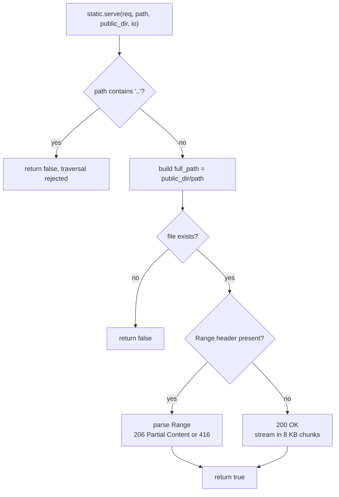

- Bila `public_dir` tidak kosong, `Http.Server.run()` memvalidasi direktori saat startup.
- Directory traversal (`..`) ditolak.
- Tipe MIME diselesaikan dari ekstensi berkas melalui `zix.Http.Content.typeFromExtension`.
- Header `Range` didukung: `206 Partial Content` (RFC 7233).

---

## Upload

`zix.utils.multipart.Parser` mem-parse body `multipart/form-data` menjadi field (juga tersedia sebagai alias `zix.Http.Multipart`). `zix.utils.file.save` menulis bytes ke disk. Keduanya tidak dihubungkan ke server secara otomatis (handler memanggilnya langsung).

```zig
var parser = zix.utils.multipart.Parser.init(ctx.allocator, boundary);
defer parser.deinit();
try parser.parse(try req.body());

if (parser.getField("file")) |f| {
    const filename = f.filename orelse "upload";
    const path = try zix.utils.file.save(ctx.io, ctx.allocator, "./public/u", filename, f.data);
    _ = path; // arena-allocated, valid for this request
}
```

---

## Serving Berkas dengan Kontrol Akses

Periksa keberadaan berkas sebelum param agar persyaratan autentikasi tidak terungkap untuk path yang tidak ada.

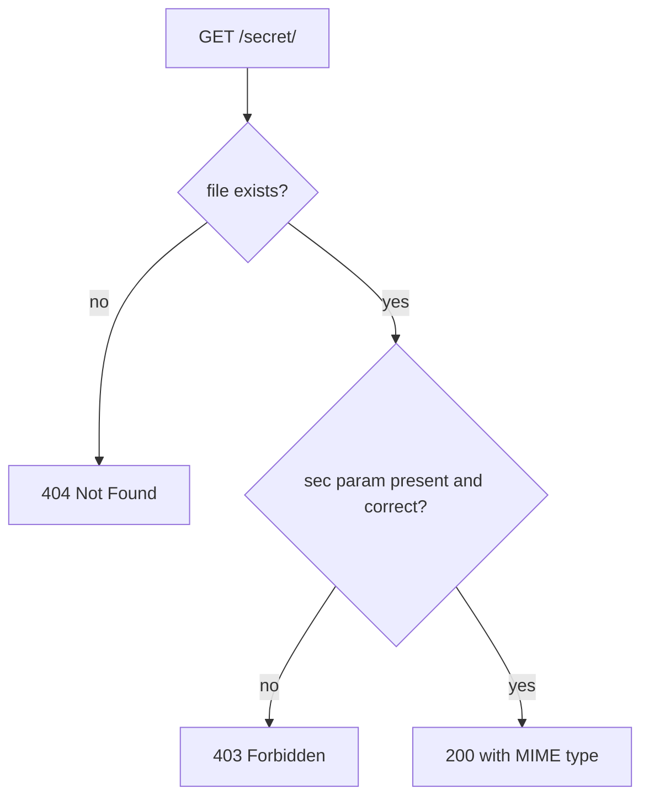

| Request | Berkas ada | sec=abc123 | Response |
| :- | :- | :- | :- |
| `/secret/file.txt?sec=abc123` | ya | ya | 200 |
| `/secret/file.txt` | ya | tidak | 403 |
| `/secret/missing.txt?sec=abc123` | tidak | n/a | 404 |

---

## WebSocket

Broadcast berbasis room mengikuti RFC 6455, diimplementasikan di atas TCP stream mentah yang sudah dipegang server HTTP.

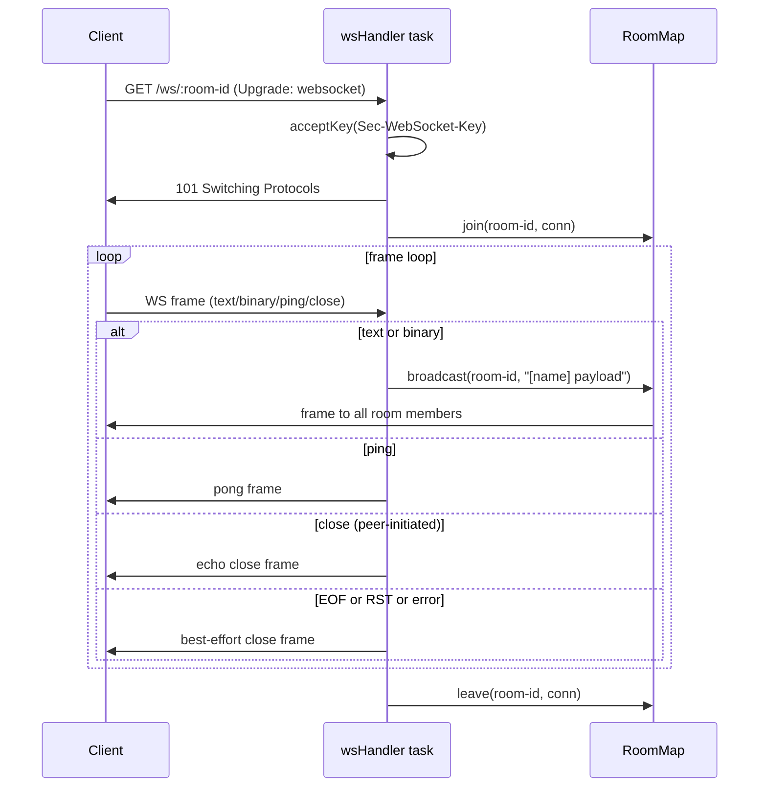

### Context.stream

`ctx.stream` adalah `std.Io.net.Stream` mentah untuk koneksi TCP yang aktif. Server selalu menetapkannya sebelum memanggil handler apapun.

- **HTTP handler**: menerima `ctx.stream` yang valid dan tidak boleh menggunakannya.
- **WebSocket handler**: menggunakan `ctx.stream` setelah `zix.Http.WebSocket.upgrade()` menyerahkan koneksi.

### Context.isExpired / timedOut: anggaran eksekusi handler (Layer B)

Bila `config.handler_timeout_ms > 0`, server menetapkan `ctx.deadline` sebelum setiap dispatch handler. Handler opt-in dengan memanggil `ctx.isExpired()` di antara langkah-langkah yang mahal dan mengembalikan 408 lebih awal alih-alih memblokir pool thread. `ctx.timedOut()` adalah alias dari `ctx.isExpired()`.

```zig
pub fn slowHandler(req: *zix.Http.Request, res: *zix.Http.Response, ctx: *zix.Http.Context) !void {
    _ = req;

    doStep1(ctx.io); // e.g. DB query, external call
    if (ctx.isExpired()) {
        res.setStatus(.REQUEST_TIMEOUT);
        return res.sendJson("{\"error\":\"timeout\"}");
    }

    doStep2(ctx.io);
    if (ctx.isExpired()) {
        res.setStatus(.REQUEST_TIMEOUT);
        return res.sendJson("{\"error\":\"timeout\"}");
    }

    try res.sendJson("{\"result\":\"ok\"}");
}
```

`ctx.isExpired()` selalu aman dipanggil: mengembalikan `false` bila `deadline` null (yaitu `handler_timeout_ms == 0`). Pemeriksaan adalah satu kali baca dan bandingkan clock, tanpa syscall bila deadline belum terlampaui.

`ctx.setTimeout(ms)` mengubah `ctx.deadline` di tempat menjadi `now + ms`. Gunakan ini di dalam handler untuk menimpa anggaran global server dengan jendela yang lebih pendek atau lebih panjang:

```zig
ctx.setTimeout(2_000); // this handler caps itself to 2s regardless of global budget
```

`ctx.withTimeout(ms)` dan `ctx.withDeadline(ts)` mengembalikan salinan ctx yang dimodifikasi dengan deadline baru (non-mutating, untuk pola sub-anggaran tanpa mengubah deadline penerima).

Untuk connection guard level jaringan (Layer D, `conn_timeout_ms`) lihat ADR-018.

### Pola handler

```zig
var server = try zix.Http.Server.init(4096, &[_]zix.Http.Route{
    .{ .path = "/ws/:room-id", .handler = wsHandler, .kind = .PARAM },
}, .{ .io = process.io, .ip = "127.0.0.1", .port = 9000, .dispatch_model = .ASYNC });

pub fn wsHandler(req: *zix.Http.Request, res: *zix.Http.Response, ctx: *zix.Http.Context) !void {
    const room_id = req.pathParam("room-id") orelse return;
    const display_name = req.queryParam("name") orelse "anonymous";

    // extract Sec-WebSocket-Key before upgrade
    var ws_key: ?[]const u8 = null;
    var it = req.inner.iterateHeaders();
    while (it.next()) |h| {
        if (std.ascii.eqlIgnoreCase(h.name, "sec-websocket-key")) ws_key = h.value;
    }

    var accept_buf: [64]u8 = undefined;
    const accept = try zix.Http.WebSocket.acceptKey(ws_key.?, &accept_buf);
    try zix.Http.WebSocket.upgrade(ctx.stream, ctx.io, accept);

    const conn = try std.heap.smp_allocator.create(zix.Http.WebSocket.Conn);
    conn.* = .{ .stream = ctx.stream, .io = ctx.io };
    defer std.heap.smp_allocator.destroy(conn);
    ws_rooms.join(room_id, conn, ctx.io);
    defer ws_rooms.leave(room_id, conn, ctx.io);

    _ = display_name; // used in frame loop broadcast prefix
    // frame loop: read, dispatch, compact buffer ...
}
```

### Siklus hidup RoomMap

| Panggilan | Kapan |
| :- | :- |
| `RoomMap.init(smp_allocator)` | satu kali di `main()` sebelum `server.run()` |
| `join(room, conn, io)` | awal setiap WS handler |
| `leave(room, conn, io)` | di-defer segera setelah join |
| `broadcast(room, msg, io)` | setiap frame text/binary |
| `RoomMap.deinit()` | proses shutdown |

---

## SSE (Server-Sent Events)

Push server satu arah melalui HTTP/1.1. Client menggunakan API `EventSource` browser atau `curl -N`. Tidak diperlukan handshake upgrade.

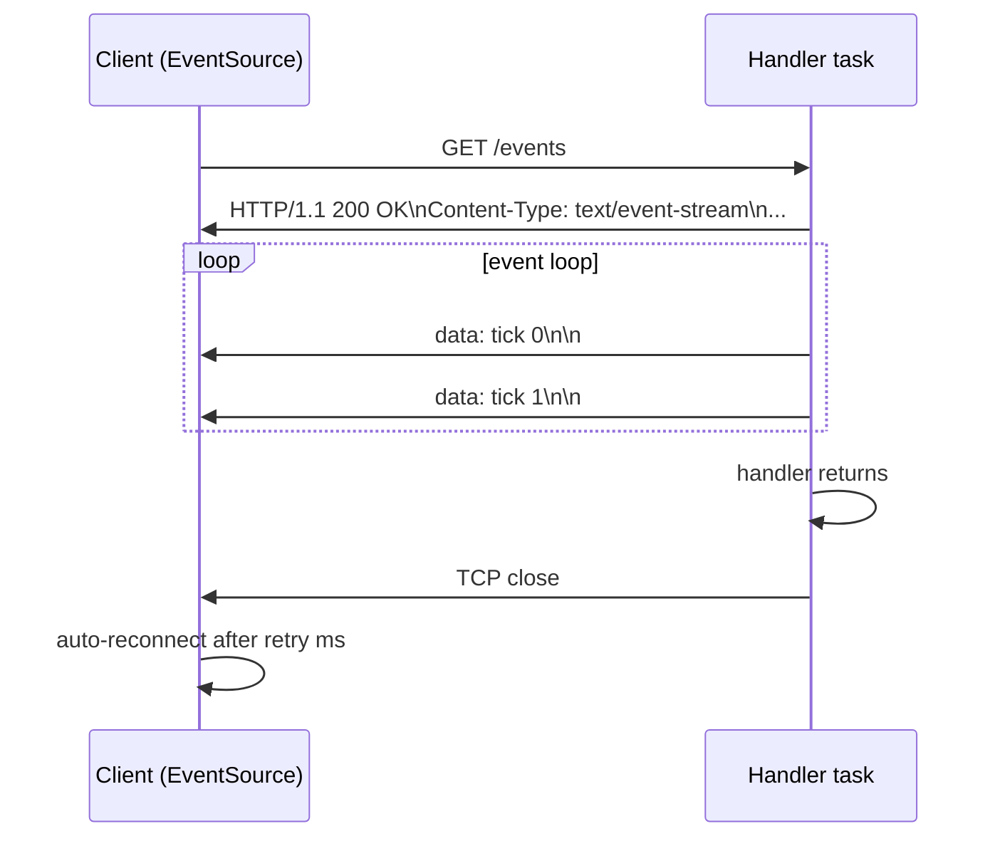

### res.stream()

`res.stream()` mengirim header response SSE (tanpa `Content-Length`) dan mengembalikan `SseWriter`. Koneksi tetap terbuka selama handler menulis event. Saat handler kembali, `handleConnection` melihat `res.streaming == true` dan menutup koneksi alih-alih mengulang untuk request berikutnya.

| Method `SseWriter` | Format wire |
| :- | :- |
| `writeEvent(data)` | `data: <data>\n\n` |
| `writeNamedEvent(event, data)` | `event: <event>\ndata: <data>\n\n` |
| `comment(text)` | `: <text>\n` |

### Persyaratan konkurensi

Koneksi SSE berumur panjang. Thread pool blocking milik `.POOL` akan habis (satu thread per stream terbuka, diblokir selama durasi penuh stream). `.ASYNC` lebih disarankan: setiap koneksi berjalan sebagai task konkuren melalui `io.async()` tanpa menempati pool thread.

### Pola handler

```zig
pub fn eventsHandler(req: *zix.Http.Request, res: *zix.Http.Response, ctx: *zix.Http.Context) !void {
    _ = req;
    const sse = try res.stream();
    var i: u32 = 0;
    while (i < 10) : (i += 1) {
        var buf: [32]u8 = undefined;
        const msg = std.fmt.bufPrint(&buf, "tick {d}", .{i}) catch break;
        sse.writeEvent(msg) catch break;
        std.Io.sleep(ctx.io, std.Io.Duration.fromMilliseconds(1000), .awake) catch break;
    }
}
```

Lihat `examples/http_sse.zig`.

---

## Middleware

Disusun saat comptime menggunakan fungsi wrapper. Tidak ada alokasi heap, tidak ada runtime chain runner.

```zig
fn withOriginCheck(comptime next: zix.Http.HandlerFn) zix.Http.HandlerFn {
    return struct {
        fn handle(req: *zix.Http.Request, res: *zix.Http.Response, ctx: *zix.Http.Context) anyerror!void {
            const origin = req.header("origin") orelse "";
            if (!isAllowedOrigin(origin)) {
                res.setStatus(.FORBIDDEN);
                try res.sendJson("{\"error\":\"forbidden origin\"}");
                return;
            }
            return next(req, res, ctx);
        }
    }.handle;
}
```

Susun dari kiri ke kanan: wrapper paling luar berjalan pertama. Route didaftarkan saat kompilasi melalui `Server.init`:

```zig
var server = try zix.Http.Server.init(4096, &[_]zix.Http.Route{
    .{ .path = "/public",  .handler = withOriginCheck(publicHandler) },
    .{ .path = "/private", .handler = withOriginCheck(withBasicAuth(privateHandler)) },
}, .{ .io = process.io, .ip = "127.0.0.1", .port = 9000 });
```

Setiap nilai `next` yang unik menghasilkan fungsi tersendiri saat comptime. Lihat `examples/http_middleware.zig`.

---

## Model Memori

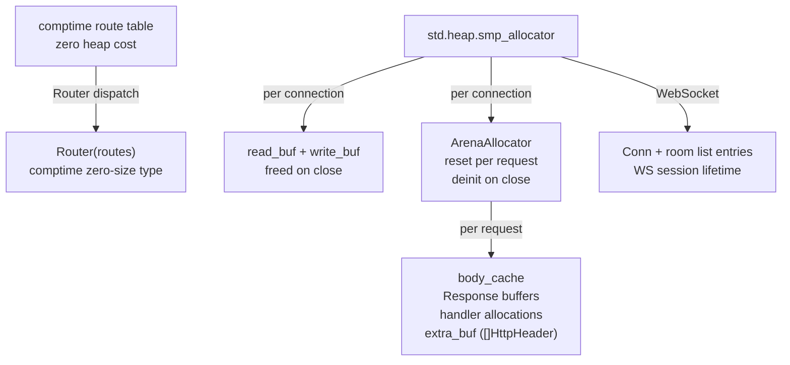

| Cakupan | Allocator | Masa hidup | Cocok untuk Arena? |
| :- | :- | :- | :- |
| Tabel route | comptime (tanpa biaya heap) | Proses | n/a: konstanta comptime, tidak ada alokasi |
| Buffer I/O baca/tulis | `smp_allocator` | Koneksi | Tidak: dibebaskan secara individual saat koneksi ditutup |
| Alokasi per-request | `ArenaAllocator` per-koneksi yang direset setiap request | Request | Ya: sudah by design |
| `Conn` WebSocket + entri room | `smp_allocator` | Sesi WS | Tidak: dibebaskan secara individual saat sesi berakhir |

---

## Http Client

`zix.Http.Client` membungkus `std.http.Client` dengan konfigurasi eksplisit, error yang dinamai, dan `ClientResponse` yang dimiliki pemanggil.

### HttpClientConfig

```zig
pub const HttpClientConfig = struct {
    allocator:           std.mem.Allocator, // owns response body + head copies
    io:                  std.Io,            // event-loop backend, not owned by client
    connect_timeout_ms:  u32 = 0,          // 0 = no timeout. enforced via connectTcpOptions
    response_timeout_ms: u32 = 0,          // 0 = no timeout. v1: stored, not yet enforced
    read_timeout_ms:     u32 = 0,          // 0 = no timeout. v1: stored, not yet enforced
    max_response_body:   usize = 1024 * 1024 * 4, // error.BodyTooLarge when exceeded
    follow_redirects:    bool = true,
    max_redirects:       u8   = 3,
    h2_max_read_rounds:  usize = 4096,                       // bound read-loop client HTTP/2, max frame-read rounds
    user_agent:          []const u8 = zon_options.user_agent, // library version string (e.g. "zix/0.1.0"); "" omits
    version:             Version = .HTTP_1,                  // .HTTP_1 (std client) atau .HTTP_2 (h2 over TLS 1.3, https saja)
    tls_ca_path:         ?[]const u8 = null,                 // CA PEM tambahan untuk https. null = system roots
    tls_verify:          bool = true,                        // verifikasi chain cert server + hostname pada https
};
```

### Siklus hidup request

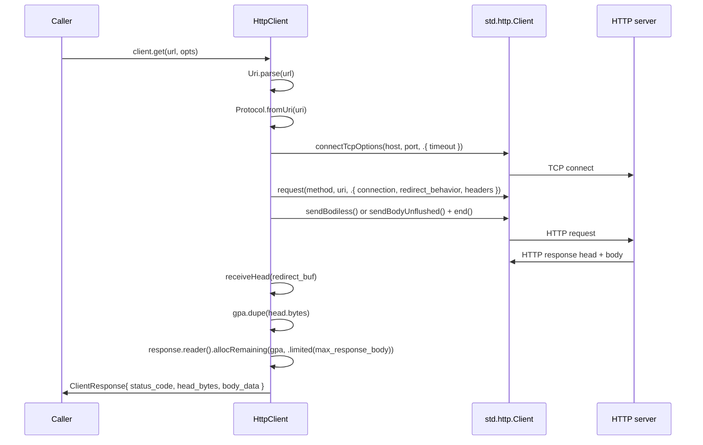

### Error yang dinamai

| Error | Kapan |
| :- | :- |
| `error.InvalidUrl` | `Uri.parse` gagal, skema tidak didukung, atau host tidak ada |
| `error.BodyTooLarge` | body response melebihi `max_response_body` bytes |
| `error.Timeout` | koneksi TCP melebihi `connect_timeout_ms` (dari `std.Io`) |

Error lain dari `std.http.Client` diteruskan tanpa perubahan (OutOfMemory, ConnectionRefused, dll.).

### Memori ClientResponse

`ClientResponse` memiliki dua alokasi heap, keduanya menggunakan `config.allocator`:

| Field | Sumber | Perlu dibebaskan? |
| :- | :- | :- |
| `head_bytes: []u8` | `gpa.dupe(response.head.bytes)` | Ya, melalui `deinit()` |
| `body_data: []u8` | `body_reader.allocRemaining(gpa, ...)` | Ya bila len > 0, melalui `deinit()` |

Panggil `resp.deinit()` untuk melepas keduanya. Setelah `deinit()`, semua slice yang dikembalikan oleh `status()`, `header()`, `body()` tidak lagi valid.

### Penanganan redirect

- `follow_redirects: true` (default): `std.http.Client` mengikuti hingga `max_redirects` hop secara otomatis. Setiap hop membuka koneksi baru.
- `follow_redirects: false`: `ClientResponse` membawa response 3xx langsung (pemanggil membaca `header("location")`).
- Method yang membawa body (POST, PUT, PATCH) yang menerima redirect mengembalikan `error.RedirectRequiresResend` (perilaku std).

### Fitur yang ditangguhkan

| Fitur | Status |
| :- | :- |
| Penerapan `response_timeout_ms` | v1: field tersimpan, belum diterapkan |
| Penerapan `read_timeout_ms` | v1: field tersimpan, belum diterapkan |
| TLS / HTTPS (client) | https via `version = .HTTP_2` (h2 over TLS 1.3, `h2_client.zig`), mempercayai cert server lewat `tls_ca_path` / `tls_verify`. Jalur client HTTP/1 bersifat cleartext |
| Reuse koneksi keep-alive pool | diwarisi dari pool `std.http.Client` (aktif secara default) |

---

## Belum Diimplementasikan

| Fitur | Lokasi | Catatan |
| :- | :- | :- |
| Chain runner middleware | `middleware.zig` | Pola wrapper comptime adalah pendekatan saat ini |
| TLS (server high-level ini) | proxy-terminated secara desain: jalankan nginx / haproxy di depan (lihat [`docs/hld-proxy-id.md`](hld-proxy-id.md)). Untuk TLS in-process pakai `zix.Http1` (native https/1.1), `zix.Http2` (native h2 over TLS), atau `zix.Grpc`, yang semuanya melayani TLS langsung. | n/a |
| Penerapan timeout response/baca (client) | `client.zig` | Field konfigurasi tersimpan. Pemasangan level IO ditangguhkan |

Untuk desain UDP lihat [`docs/hld-udp-id.md`](hld-udp-id.md). Untuk UDS lihat [`docs/hld-uds-id.md`](hld-uds-id.md).

---

###### end of hld-http
