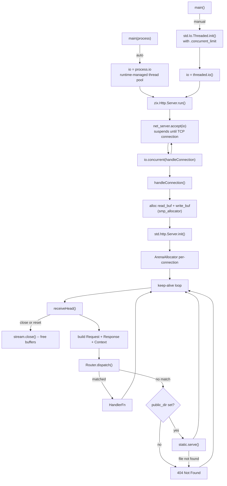
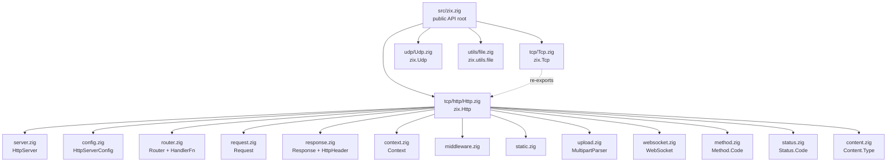
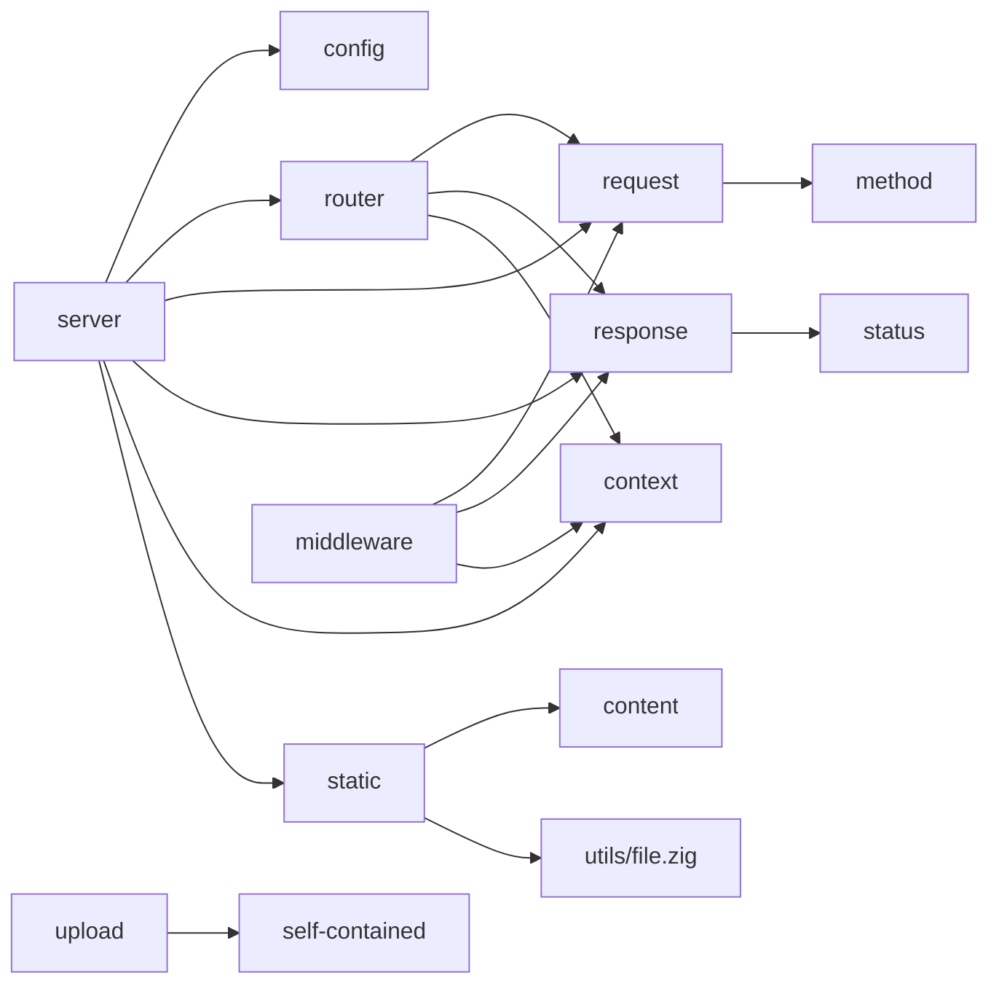
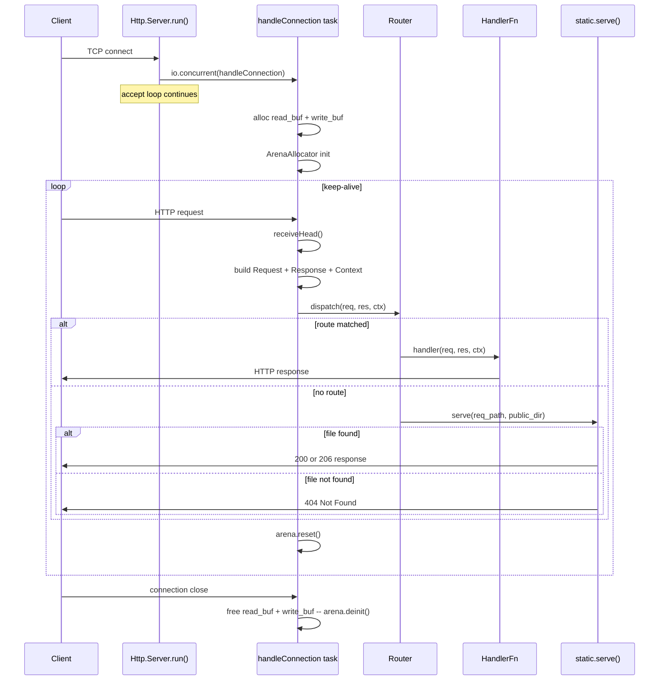
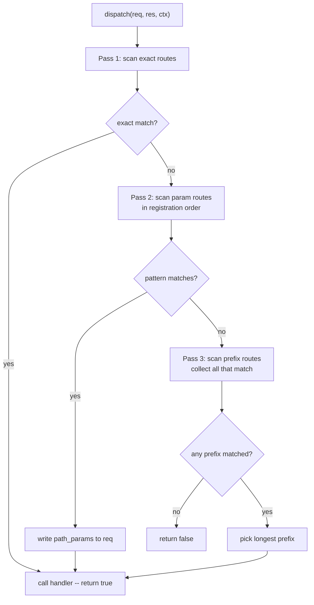
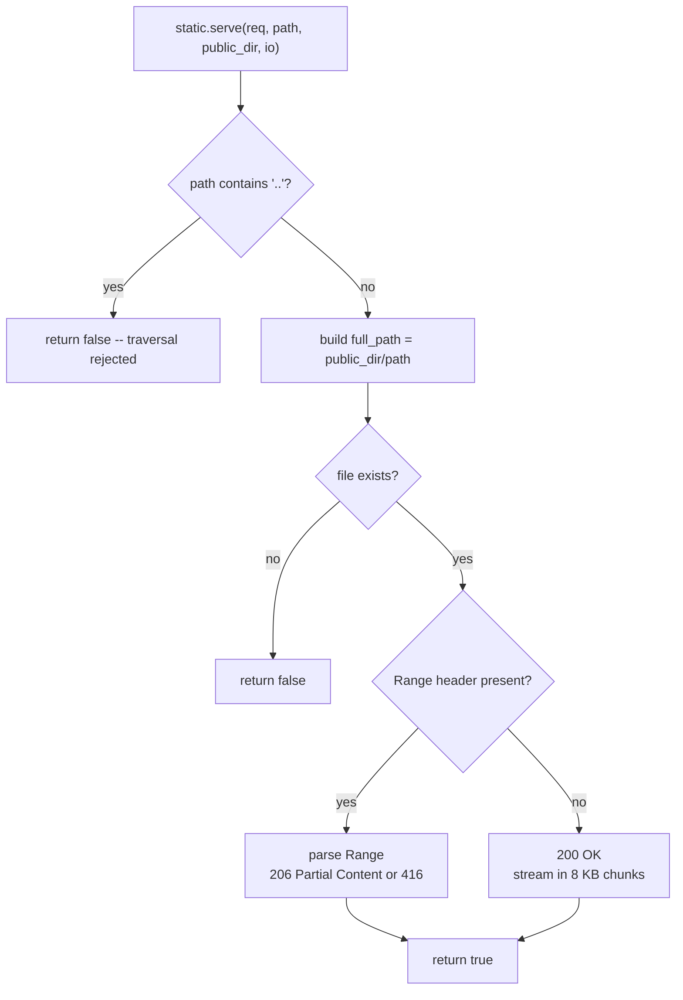
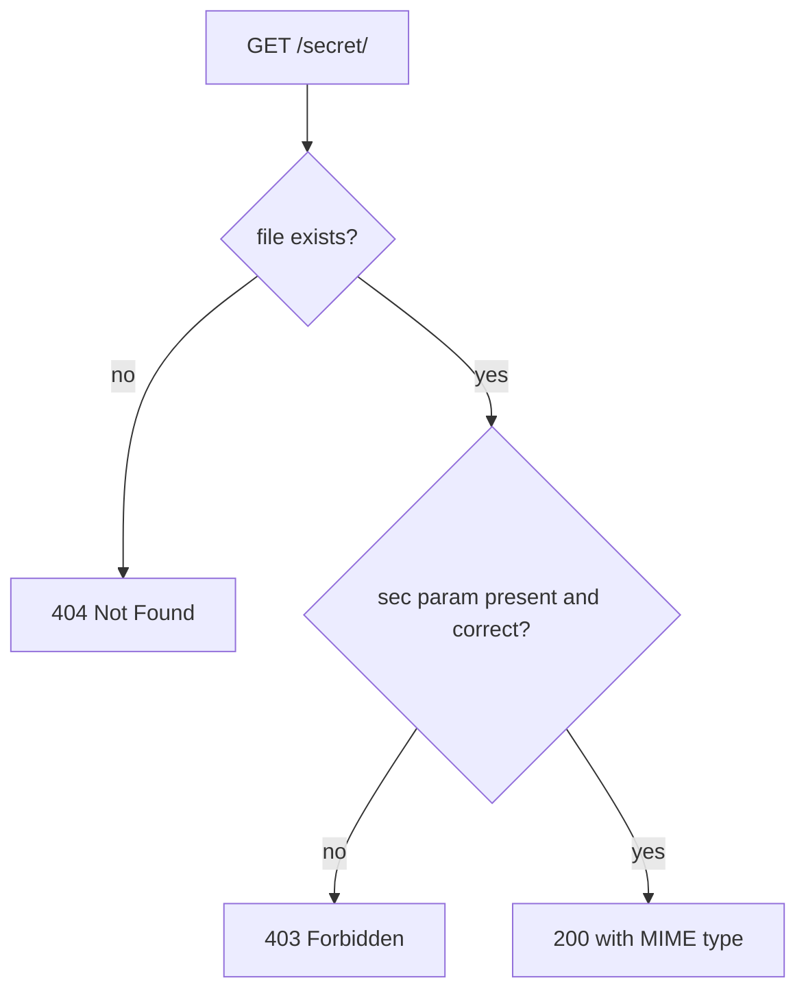
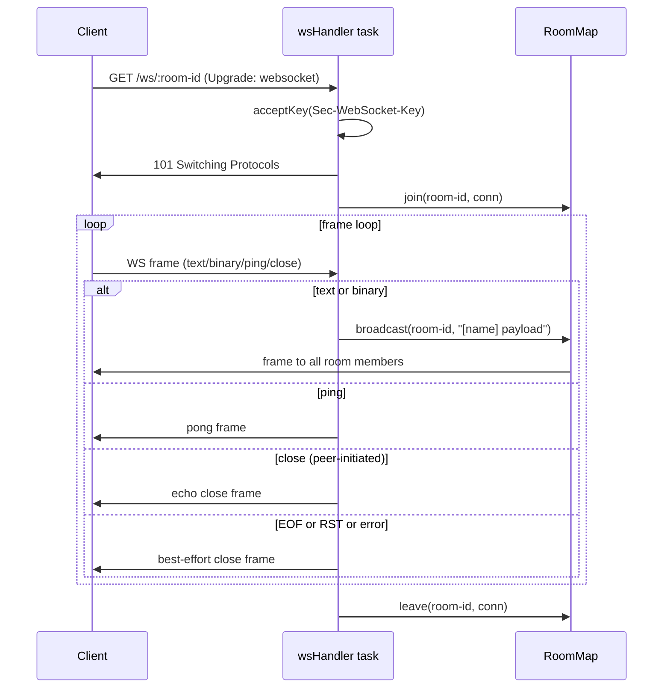
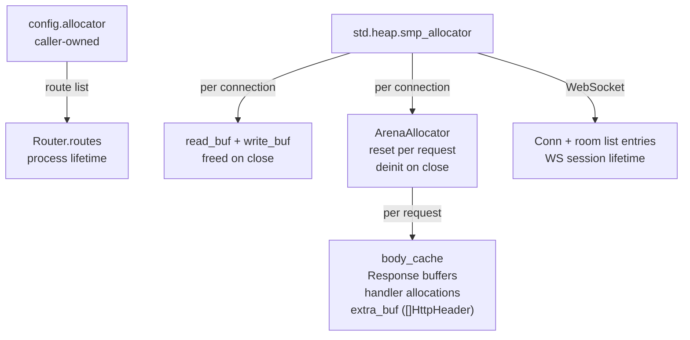

# HLD -- zix.Http

HTTP server built on Zig 0.16.x `std.Io`.

---

## Goals

- Explicit over implicit -- no magic, every behavior named in config or registration.
- One file, one responsibility.
- Data-Oriented Design: flat arrays, minimal indirection.
- No hidden allocations inside handlers.
- Predictable routing: deterministic dispatch priority.

---

## Runtime Model



Two I/O modes:
- **Auto** -- `main(process: std.process.Init)`, use `process.io`. Runtime manages the thread pool.
- **Manual** -- `main() !void`, create `std.Io.Threaded` explicitly. Caller controls `.concurrent_limit`.

`zix.Http.Server` receives an opaque `std.Io` value and does not own or deinit the backend. Each accepted connection runs as a concurrent task via `io.concurrent(handleConnection)`, suspending on I/O without busy-waiting.

---

## Source Layout



---

## Module Dependencies



---

## Public API

Access via `const zix = @import("zix");`

| Symbol | Type | Description |
| :- | :- | :- |
| `zix.Http.Server` | struct | Lifecycle: `init` / `registerHandler` / `registerPrefixHandler` / `registerParamHandler` / `run` |
| `zix.Http.ServerConfig` | struct | Server configuration -- see HttpServerConfig section |
| `zix.Http.Request` | struct | Per-request reader: method, path, query, header, body |
| `zix.Http.Response` | struct | Per-request writer: send, sendJson, noContent, addHeader |
| `zix.Http.Context` | struct | Per-request context: io, allocator, stream (raw TCP) |
| `zix.Http.HandlerFn` | type | `*const fn(*Request, *Response, *Context) anyerror!void` |
| `zix.Http.Header` | struct | `{ name: []const u8, value: []const u8 }` |
| `zix.Http.HeaderSize` | union(enum) | Response header cap: `.MINIMAL`(16) `.COMMON`(32) `.LARGE`(64) `.EXTRA_LARGE`(128) `.{ .CUSTOM = N }` |
| `zix.Http.ContentType` | enum | Type-safe MIME representation |
| `zix.Http.Content` | namespace | `typeFromExtension(ext)`, `fromExtension(ext)` |
| `zix.Http.Multipart` | struct | Parse `multipart/form-data` bodies |
| `zix.Http.MultipartField` | struct | `{ name, filename, content_type, data, is_file }` |
| `zix.Http.WebSocket` | namespace | Frame parsing, handshake, room broadcast |
| `zix.Http.WebSocket.Opcode` | enum | continuation text binary close ping pong |
| `zix.Http.WebSocket.Frame` | struct | `{ fin, opcode, payload }` |
| `zix.Http.WebSocket.Conn` | struct | Per-connection handle `{ stream, io }` |
| `zix.Http.WebSocket.RoomMap` | struct | Named room registry: init / join / leave / broadcast / deinit |
| `zix.Http.WebSocket.parseFrame` | fn | Parse one frame from a byte buffer, returns `?ParseResult` |
| `zix.Http.WebSocket.buildFrame` | fn | Serialize a server-to-client frame (unmasked) |
| `zix.Http.WebSocket.acceptKey` | fn | Compute `Sec-WebSocket-Accept` from `Sec-WebSocket-Key` |
| `zix.Http.WebSocket.upgrade` | fn | Write `101 Switching Protocols` onto `ctx.stream` |
| `zix.utils.file.saveFile` | fn | Write bytes to `dir/filename`, creates directory if needed |
| `zix.Tcp.Http.Method.Code` | enum | GET HEAD POST PUT DELETE PATCH OPTIONS TRACE CONNECT |
| `zix.Tcp.Http.Status.Code` | enum | Full HTTP 1xx--5xx status codes |

---

## HttpServerConfig

```zig
pub const HttpServerConfig = struct {
    io:                   std.Io,            // external I/O backend -- not owned by server
    allocator:            std.mem.Allocator, // used for router route list
    ip:                   []const u8,
    port:                 u16,
    max_kernel_backlog:   usize    = 1024 * 4, // TCP listen() backlog
    max_client_request:   usize    = 1024 * 4, // read buffer per connection (heap)
    max_allocator_size:   usize    = 1024 * 4, // per-connection arena backing size
    max_client_response:  usize    = 1024 * 4, // write buffer per connection (heap)
    max_response_headers: HeaderSize = .COMMON, // custom header cap; arena-allocated per request
    public_dir:           []const u8 = "",   // static file root; "" disables static serving
    public_dir_upload:    []const u8 = "u",  // upload subdir under public_dir
    response_timeout_ms:  u32      = 30_000, // reserved for future timeout enforcement
};
```

The caller owns `io` and `allocator` -- `zix.Http.Server` does not call `deinit` on either.

`ArenaAllocator` is suitable for `allocator`: routes are append-only and never individually freed during the server's lifetime. The entire arena is deinited together with `server.deinit()`, freeing all route storage in one shot. This is the recommended pattern in the README examples.

For header cap selection and security guidance see [`docs/headers.md`](headers.md).

---

## Connection Lifecycle



---

## Request

Wraps `*std.http.Server.Request` and a `*std.Io.Reader` for body reading.

| Method | Returns | Notes |
| :- | :- | :- |
| `method()` | `Method.Code` | Mapped from `std.http.Method` |
| `path()` | `[]const u8` | Target stripped of query string |
| `query()` | `[]const u8` | Raw query string after `?` |
| `queryParam(key)` | `?[]const u8` | Single key from query string |
| `queryParams(allocator)` | `![]QueryParam` | All query params; bare keys have `value = null` |
| `pathSegments(allocator)` | `![][]const u8` | Non-empty segments split by `/` |
| `pathParam(name)` | `?[]const u8` | Named capture from param route; null if not captured |
| `header(name)` | `?[]const u8` | Case-insensitive header lookup |
| `body()` | `![]const u8` | Reads `Content-Length` bytes, cached after first call |

---

## Response

Buffers response state, writes on `send()` or equivalent.

| Method | Notes |
| :- | :- |
| `setStatus(Status.Code)` | Default: `.OK` |
| `setContentType(Content.Type)` | Default: `.TEXT_PLAIN` |
| `setKeepAlive(bool)` | Default: `true` |
| `addHeader(name, value)` | Up to `max_response_headers` extra headers; rejects CR/LF |
| `send(body)` | Writes full HTTP/1.1 response and flushes |
| `sendJson(body)` | Sets `content_type = application/json`, then `send` |
| `noContent()` | Sets status `.NO_CONTENT`, sends empty body |

Response is written to the underlying `std.Io.Writer`. The 4 KB header buffer limits combined header size; `error.BufferTooSmall` is returned if exceeded.

### Automatic headers emitted by send()

`send()` always emits these headers before any custom headers added via `addHeader()`:

| Header | Value | Source |
| :- | :- | :- |
| `Content-Type` | from `setContentType()` | default `.TEXT_PLAIN` |
| `Content-Length` | `body.len` | computed |
| `Connection` | `keep-alive` or `close` | see below |
| `Date` | RFC 7231 UTC timestamp | see below |

**`Connection` logic** — close if either side requests it:
- `keep-alive` when both `self.keep_alive` (handler default `true`) and `req.head.keep_alive` (parsed from the client's `Connection` request header) are true.
- `close` if the handler called `setKeepAlive(false)` **or** the client sent `Connection: close`.

**`Date` logic** — cross-platform, proxy-aware:
1. Walk request headers for a proxy-forwarded `Date` value; if found, use it verbatim.
2. Otherwise call `std.Io.Clock.real.now(self.io).toSeconds()` — wall-clock UTC, translated from the OS native epoch on all platforms (Linux, macOS, Windows).
3. Format as IMF-fixdate: `Thu, 08 May 2026 12:34:56 GMT`.

---

## Router

### Registration -- three explicit functions

| Function | Pattern example | Behaviour |
| :- | :- | :- |
| `registerHandler(path, h)` | `"/about"` | Exact -- matches only when the full path equals `path` |
| `registerPrefixHandler(prefix, h)` | `"/api"` | Prefix -- matches `prefix` and any sub-path; NOT partial segments |
| `registerParamHandler(pattern, h)` | `"/users/:id"` | Param -- `:name` segments captured; literals must match exactly |

```zig
server.registerHandler("/about", aboutHandler);
server.registerPrefixHandler("/api", apiHandler);        // /api /api/foo -- NOT /apiv2
server.registerParamHandler("/users/:id", userHandler);  // req.pathParam("id")
server.registerParamHandler("/:tenant/:branch", branchHandler);
```

### Dispatch -- priority rules

```
Pass 1 -- exact routes:   first exact match wins           (registration order irrelevant)
Pass 2 -- param routes:   first matching pattern wins      (registration order matters)
Pass 3 -- prefix routes:  longest matching prefix wins     (registration order irrelevant)

exact > param > prefix (longer prefix beats shorter prefix)
```

Passes 1 and 3 are deterministic regardless of registration order. **Pass 2 is the exception**: when two param patterns have the same segment count and both match, the first-registered wins. Register more-literal patterns before all-param patterns of equal depth.



### Priority table

| Registered routes | Request | Winner | Reason |
| :- | :- | :- | :- |
| `/path/info` (exact) + `/path/:id` (param) | `/path/info` | `/path/info` | exact beats all |
| `/path/:id` (param) + `/path` (prefix) | `/path/alice` | `/path/:id` | param beats prefix |
| `/api/v2` (prefix) + `/api` (prefix) | `/api/v2/foo` | `/api/v2` | longer prefix wins |
| `/path` (prefix) | `/pathfoo` | no match | next char must be `/` or end |
| `/path/user/:id` (reg. 1st) + `/path/:a/:b` (reg. 2nd) | `/path/user/alice` | `/path/user/:id` | more literals registered first |
| `/path/:a/:b` (reg. 1st) + `/path/user/:id` (reg. 2nd) | `/path/user/alice` | `/path/:a/:b` | wrong order -- all-param wins unexpectedly |

### Regex-like matching

zix has no regex engine. Use `registerPrefixHandler` as `/prefix/(.*)`. Additional filtering is done inside the handler on `req.path()`.

| Regex intent | zix equivalent |
| :- | :- |
| `/secret/(.*)` | prefix handler; sub-path via `req.path()[len("/secret")+1..]` |
| `/files/.*\.pdf` | prefix handler on `/files`; check `std.mem.endsWith(u8, sub, ".pdf")` in handler |
| `/v[0-9]+/.*` | prefix handler on `/v`; parse next segment with `std.fmt.parseInt` |

---

## Static File Serving



- If `public_dir` is non-empty, `Http.Server.run()` validates the directory at startup.
- Directory traversal (`..`) rejected.
- MIME type resolved from file extension via `zix.Http.Content.typeFromExtension`.
- `Range` header supported -- `206 Partial Content` (RFC 7233).

---

## Upload

`zix.Http.Multipart` parses `multipart/form-data` bodies into fields. `zix.utils.file.saveFile` writes bytes to disk. Neither is wired into the server automatically -- handlers call them directly.

```zig
var parser = zix.Http.Multipart.init(ctx.allocator, boundary);
defer parser.deinit();
try parser.parse(try req.body());

if (parser.getField("file")) |f| {
    const filename = f.filename orelse "upload";
    const path = try zix.utils.file.saveFile(ctx.io, ctx.allocator, "./public/u", filename, f.data);
    _ = path; // arena-allocated; valid for this request
}
```

---

## Access-Controlled File Serving

Check file existence before the param so the auth requirement is not revealed for non-existent paths.



| Request | File exists | sec=abc123 | Response |
| :- | :- | :- | :- |
| `/secret/file.txt?sec=abc123` | yes | yes | 200 |
| `/secret/file.txt` | yes | no | 403 |
| `/secret/missing.txt?sec=abc123` | no | -- | 404 |

---

## WebSocket

Room-based broadcast over RFC 6455, implemented on the raw TCP stream the HTTP server already holds.



### Context.stream

`ctx.stream` is the raw `std.Io.net.Stream` for the current TCP connection. The server always sets it before calling any handler.

- **HTTP handlers** -- receive a valid `ctx.stream` and must not use it.
- **WebSocket handlers** -- use `ctx.stream` after `zix.Http.WebSocket.upgrade()` hands off the connection.

### Handler pattern

```zig
server.registerParamHandler("/ws/:room-id", wsHandler);

pub fn wsHandler(req: *zix.Http.Request, res: *zix.Http.Response, ctx: *zix.Http.Context) !void {
    const room_id = req.pathParam("room-id") orelse return;
    const display_name = req.queryParam("name") orelse "anonymous";

    // extract Sec-WebSocket-Key before upgrade
    var ws_key: ?[]const u8 = null;
    var it = req.inner.iterateHeaders();
    while (it.next()) |h| {
        if (std.ascii.eqlIgnoreCase(h.name, "sec-websocket-key")) ws_key = h.value;
    }

    var accept_buf: [64]u8 = undefined;
    const accept = try zix.Http.WebSocket.acceptKey(ws_key.?, &accept_buf);
    try zix.Http.WebSocket.upgrade(ctx.stream, ctx.io, accept);

    const conn = try std.heap.smp_allocator.create(zix.Http.WebSocket.Conn);
    conn.* = .{ .stream = ctx.stream, .io = ctx.io };
    defer std.heap.smp_allocator.destroy(conn);
    ws_rooms.join(room_id, conn, ctx.io);
    defer ws_rooms.leave(room_id, conn, ctx.io);

    _ = display_name; // used in frame loop broadcast prefix
    // frame loop: read, dispatch, compact buffer ...
}
```

### RoomMap lifecycle

| Call | When |
| :- | :- |
| `RoomMap.init(smp_allocator)` | once in `main()` before `server.run()` |
| `join(room, conn, io)` | start of each WS handler |
| `leave(room, conn, io)` | deferred immediately after join |
| `broadcast(room, msg, io)` | each text/binary frame |
| `RoomMap.deinit()` | process shutdown |

---

## Middleware

Composed at comptime using wrapper functions. No heap allocation, no runtime chain runner.

```zig
fn withOriginCheck(comptime next: zix.Http.HandlerFn) zix.Http.HandlerFn {
    return struct {
        fn handle(req: *zix.Http.Request, res: *zix.Http.Response, ctx: *zix.Http.Context) anyerror!void {
            const origin = req.header("origin") orelse "";
            if (!isAllowedOrigin(origin)) {
                res.setStatus(.FORBIDDEN);
                try res.sendJson("{\"error\":\"forbidden origin\"}");
                return;
            }
            return next(req, res, ctx);
        }
    }.handle;
}
```

Compose left-to-right -- the outermost wrapper runs first:

```zig
server.registerHandler("/public",  withOriginCheck(publicHandler));
server.registerHandler("/private", withOriginCheck(withBasicAuth(privateHandler)));
```

Each unique `next` value generates a distinct function at comptime. See `examples/http_middleware.zig`.

---

## Memory Model



| Scope | Allocator | Lifetime | Arena suitable? |
| :- | :- | :- | :- |
| Router route list | `config.allocator` | Process | Yes — append-only; freed via `server.deinit()` |
| Read/write I/O buffers | `smp_allocator` | Connection | No — individually freed on connection close |
| Per-request allocations | Per-connection `ArenaAllocator` reset each request | Request | Yes — by design |
| WebSocket `Conn` + room entries | `smp_allocator` | WS session | No — individually freed on session end |

---

## Not Yet Implemented

| Feature | Location | Note |
| :- | :- | :- |
| Middleware chain runner | `middleware.zig` | Comptime wrapper pattern is the current approach |
| Response timeout enforcement | `config.response_timeout_ms` | Field reserved, not yet enforced |
| HTTP/2 / TLS | out of scope | |

For UDP design see [`docs/hld-udp.md`](hld-udp.md). For UDS see [`docs/hld-uds.md`](hld-uds.md).

---

###### end of hld-http
