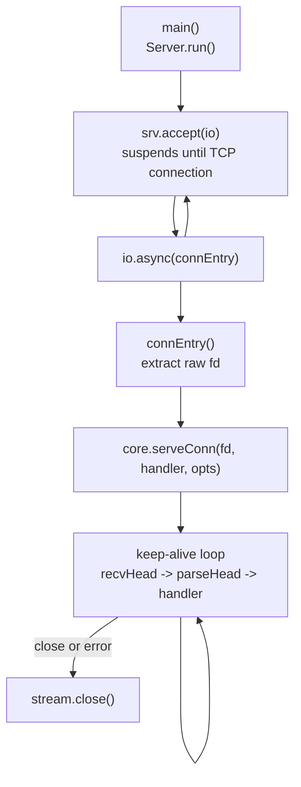
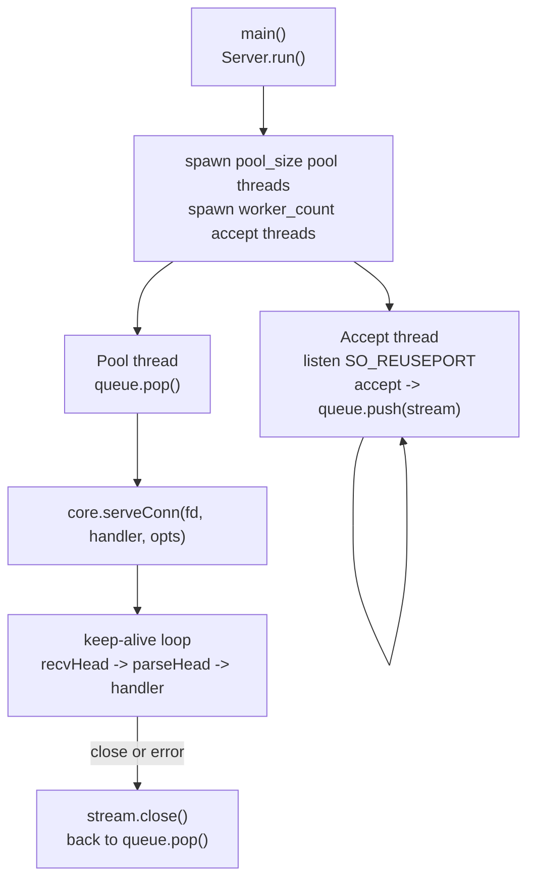
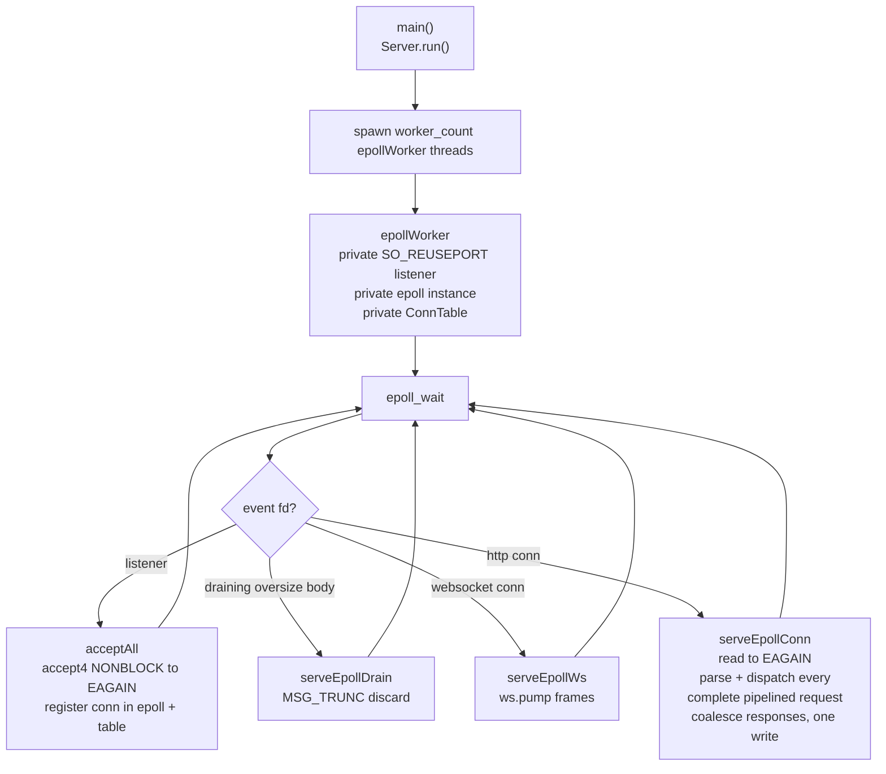
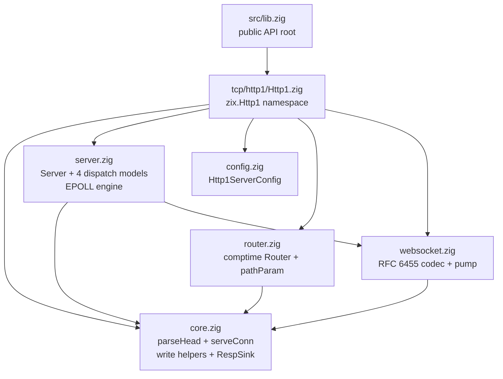
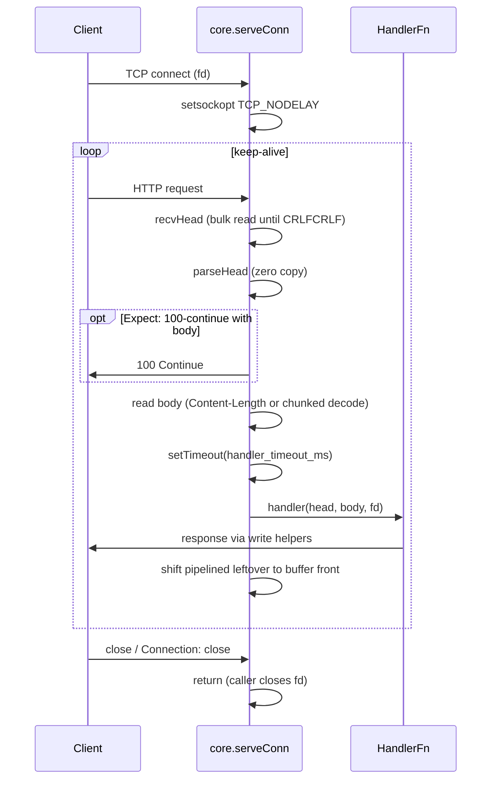
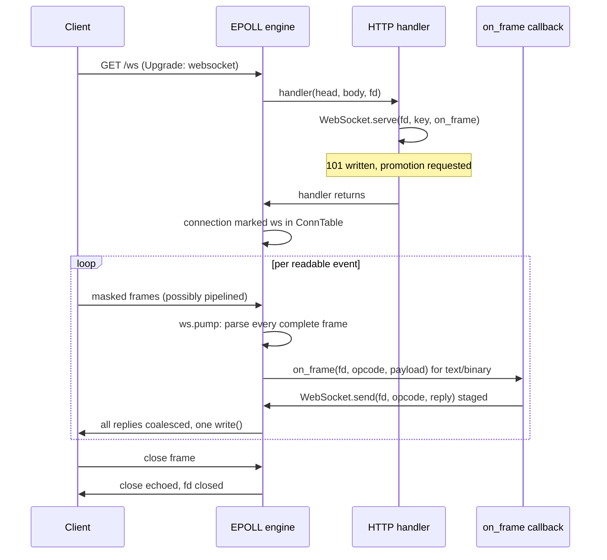

# HLD: zix.Http1

Lean HTTP/1.x server engine on raw fd I/O. Zero-allocation request parsing and response writing on caller-owned buffers, no `std.http` dependency.

---

## Goals

- Zero heap allocation on the hot path: parse and write operate on stack or pre-allocated buffers.
- No request/response objects: the handler receives a parsed head plus body slice and writes to the fd directly through write helpers.
- Comptime everything: the handler is baked into the server type, the route table is partitioned at compile time.
- Raw `std.posix` I/O on the data path: `std.Io` is used only for listen/accept plumbing.
- Minimal surface: one handler signature, a small set of write helpers, an optional comptime router.

---

## Positioning: zix.Http1 vs zix.Http

Both are HTTP/1.1 servers. `zix.Http` is the full-featured layer, `zix.Http1` is the lean engine.

| Aspect | `zix.Http` | `zix.Http1` |
| :- | :- | :- |
| Handler signature | `fn(*Request, *Response, *Context) !void` | `fn(*const ParsedHead, []const u8, fd) void` |
| Request parsing | `std.http.Server` | own zero-copy `parseHead` |
| Per-request allocator | per-connection arena | none (caller-owned buffers) |
| Response writing | buffered `Response` object | direct fd write helpers |
| Static files / multipart / SSE writer | built in | not built in (handlers compose from helpers) |
| Routing | comptime route table | comptime route table (optional, handler can be bare) |
| WebSocket | handler-owned frame loop | engine-owned frame pump (.EPOLL) |
| Dispatch models | ASYNC, POOL, MIXED, EPOLL | ASYNC, POOL, MIXED, EPOLL |

Use `zix.Http` when handlers need an allocator, static file serving, or the richer request/response API. Use `zix.Http1` when raw throughput and predictable per-request cost matter more than convenience.

---

## Runtime Model

Four dispatch models, selected via `config.dispatch_model` (`DispatchModel` enum). Default: `.ASYNC`.

### .ASYNC: Single Accept, io.async() Dispatch



- One accept thread, each connection dispatched as a concurrent task via `io.async()`.
- `workers` and `pool_size` are ignored.

### .POOL: Work-Queue Thread Pool



- Accept threads only push accepted streams into a shared ring-buffer `ConnQueue`.
- Pool threads pop and serve each connection synchronously.
- Default: cpu_count accept threads, `max(10, cpu_count * 2)` pool threads.

### .MIXED: N Accept Threads, io.async() Dispatch

- N accept threads (default cpu_count, `SO_REUSEPORT`), each dispatches connections via `io.async()` directly, no `ConnQueue`.
- `pool_size` is ignored. `workers` controls accept thread count.

### .EPOLL: Shared-Nothing Event Loop (Linux only)



- Each worker owns a private listener, epoll instance, and connection table. The kernel load-balances new connections across the per-worker listeners (`SO_REUSEPORT`), so there is no accept thread, no shared queue, and no cross-thread fd handoff.
- Pipelined requests arriving in one readable event are all parsed and dispatched in that pass, and their responses are coalesced into a single `write()` via a per-event response sink.
- On non-Linux targets `.EPOLL` falls back to `.POOL` with a logged notice.
- This is the only model that honors engine-owned WebSocket promotion (see WebSocket section).

---

## Source Layout



---

## Public API

Access via `const zix = @import("zix");`

| Symbol | Type | Description |
| :- | :- | :- |
| `zix.Http1.Server` | struct | `init(comptime handler, config)` returns the server, then `run()` / `deinit()` |
| `zix.Http1.Server.initRaw` | fn | `initRaw(comptime raw, config)`: register a `RawFn` that owns the connection fd directly |
| `zix.Http1.ServerConfig` | struct | Server configuration (see Http1ServerConfig section) |
| `zix.Http1.DispatchModel` | enum(u8) | `.ASYNC`(0) `.POOL`(1) `.MIXED`(2) `.EPOLL`(3, Linux-only natively) |
| `zix.Http1.HandlerFn` | type | `*const fn(head: *const ParsedHead, body: []const u8, fd: std.posix.fd_t) void` |
| `zix.Http1.RawFn` | type | Raw handler given the fd and parsed head, owns the wire directly (custom framing, streaming) |
| `zix.Http1.ParsedHead` | struct | Zero-copy parsed request head (method, path, query, headers, flags) |
| `zix.Http1.Header` | struct | `{ name: []const u8, value: []const u8 }` |
| `zix.Http1.Range` | struct | `{ start: u64, end: u64 }` from `parseRange` |
| `zix.Http1.ServeOpts` | struct | `serveConn` options: `nodelay`, `handler_timeout_ms` |
| `zix.Http1.ConnOutcome` | enum | `.keep_alive` or `.close` (EPOLL one-shot result) |
| `zix.Http1.Route` | struct | `{ path, handler, kind = .EXACT }` |
| `zix.Http1.RouteKind` | enum(u8) | `.EXACT` `.PREFIX` `.PARAM` |
| `zix.Http1.Router` | fn | `Router(comptime routes) type`, exposes `dispatch` usable as a HandlerFn |
| `zix.Http1.PathParam` | struct | One captured `:param` (name, value) |
| `zix.Http1.pathParam` | fn | Look up a captured param inside a handler |
| `zix.Http1.WebSocket` | namespace | RFC 6455 codec: `parseFrame` / `buildFrame` / `acceptKey` / `upgrade` / `send` / `serve` / `pump` |
| `zix.Http1.WsFrameFn` | type | Per-frame callback for an engine-owned WebSocket |
| `zix.Http1.setTimeout` | fn | Arm or shorten the per-handler deadline (thread-local) |
| `zix.Http1.isExpired` | fn | Whether the current handler's deadline has passed |
| `zix.Http1.parseHead` | fn | Parse a complete request head from a buffer (zero copy) |
| `zix.Http1.getHeader` | fn | Case-insensitive header lookup on a ParsedHead |
| `zix.Http1.queryParam` | fn | Linear scan for one query parameter by exact name |
| `zix.Http1.percentDecode` | fn | Percent-decode a buffer in place |
| `zix.Http1.parseRange` | fn | Parse `bytes=start-end` into a `Range` |
| `zix.Http1.fdWriteAll` | fn | Write all bytes to fd (sink-aware, handles EINTR/EAGAIN) |
| `zix.Http1.flushPending` | fn | Flush staged response bytes before raw fd writes (pipelining order) |
| `zix.Http1.writeSimple` | fn | Full response with Content-Length body |
| `zix.Http1.writeSimpleNoBody` | fn | Headers-only response (HEAD method) |
| `zix.Http1.writeJson` | fn | `writeSimple` shorthand with `application/json` |
| `zix.Http1.writeGzip` | fn | gzip-compressed response via `std.compress.flate` |
| `zix.Http1.writeChunkedStart` | fn | Start a `Transfer-Encoding: chunked` response |
| `zix.Http1.writeChunk` | fn | Write one chunk |
| `zix.Http1.writeChunkedEnd` | fn | Terminate the chunked body |
| `zix.Http1.writeRange` | fn | 206 Partial Content or 416 based on a Range header value |
| `zix.Http1.write100Continue` | fn | Send `100 Continue` before reading a large body |

---

## Http1ServerConfig

```zig
pub const Http1ServerConfig = struct {
    io:                 std.Io,                // from process.io, listen/accept plumbing only
    ip:                 []const u8,
    port:               u16,                   // must be non-zero
    dispatch_model:     DispatchModel = .ASYNC,
    kernel_backlog:     u31   = 1024,          // TCP listen() backlog
    max_recv_buf:       usize = 16 * 1024,     // per-connection buffer (.EPOLL only, see note)
    ws_recv_buf:        usize = 0,             // .EPOLL WebSocket buffer, 0 = max_recv_buf
    max_gzip_out:       usize = 256 * 1024,    // informational: writeGzip uses core.GZIP_OUT_SIZE
    max_headers:        u8    = 16,            // informational: parse cap is core.MAX_HEADERS
    workers:            usize = 0,             // 0 = cpu_count accept threads, ignored by .ASYNC
    pool_size:          usize = 0,             // 0 = max(10, cpu_count * 2), .POOL only
    handler_timeout_ms: u32   = 0,             // per-handler budget, 0 = disabled
    send_date_header:   bool  = true,          // emit Date header, false saves 37 bytes/response
    logger:             ?*Logger = null,       // lifecycle lines only, see Logging section
};
```

Note: under `.ASYNC` / `.POOL` / `.MIXED` the connection loop uses fixed stack buffers (`core.BUF_SIZE` = 16 KB header buffer, 8 KB body buffer). `max_recv_buf` sizes the per-connection buffer under `.EPOLL` only. `max_gzip_out` and `max_headers` currently mirror the compile-time caps `core.GZIP_OUT_SIZE` and `core.MAX_HEADERS` and are not read at runtime.

Note: `ws_recv_buf` sizes the per-connection buffer for a connection promoted to WebSocket under `.EPOLL`. `0` falls back to `max_recv_buf`. Set it larger than `max_recv_buf` to give a WebSocket connection more room to accumulate pipelined frames before the engine compacts and re-reads on a fill.

Note: `send_date_header` defaults to `true` for RFC 7231 compliance. Set `false` on hot paths where the client does not consume `Date` to drop the header (37 bytes per response). The managed write helpers honor the flag.

### Timeouts

`zix.Http1` exposes one timeout, `handler_timeout_ms`, the per-handler execution budget. When non-zero, the server arms a thread-local deadline before each dispatch. The handler opts in by calling `zix.Http1.isExpired()` between expensive steps and responding early, or shortens its own budget with `zix.Http1.setTimeout()`. This is the same Layer B budget as `zix.Http`'s `handler_timeout_ms`.

`zix.Http1` has no `conn_timeout_ms`. This is deliberate, not an omission.

- The connection-lifetime guard in `zix.Http` (`conn_timeout_ms`, Layer D) is enforced by a `ConnRegistry` plus a background timer thread that shuts down connections exceeding the configured lifetime. `zix.Http1` is the lean, zero-alloc engine and carries none of that standing infrastructure: the handler is `fn(head, body, fd) void` with no `Request` / `Response` / registry to track a connection against, and no socket-level receive timeout (`setNoDelay` and `SO_BUSY_POLL` are the only socket options set).
- Under `.EPOLL`, the model `zix.Http1` is tuned for, an idle keep-alive connection holds no thread, just one epoll slot and its buffer. The main reason `conn_timeout_ms` exists in `zix.Http` (reclaiming pool threads parked on slow or idle connections) does not apply to the shared-nothing level-triggered loop.

| Timeout | `zix.Http` | `zix.Http1` | Mechanism |
| :- | :- | :- | :- |
| `handler_timeout_ms` | yes | yes | thread-local deadline armed per dispatch, handler-opt-in |
| `conn_timeout_ms` | yes (`.POOL`) | no | `ConnRegistry` + background timer thread (Http only) |

If connection-lifetime enforcement under `.EPOLL` is ever needed, the natural fit is an idle-deadline sweep over the per-worker `ConnTable` (no extra thread), not a port of Http's timer-thread `ConnRegistry`.

---

## Handler Model

```zig
fn home(head: *const zix.Http1.ParsedHead, body: []const u8, fd: std.posix.fd_t) void {
    _ = body;

    if (zix.Http1.queryParam(head, "name")) |name| {
        _ = name; // slices into the receive buffer, valid only for this call
    }

    zix.Http1.writeSimple(fd, 200, "text/plain", "hello") catch {};
}

var server = zix.Http1.Server.init(home, .{
    .io = process.io,
    .ip = "0.0.0.0",
    .port = 8080,
});
try server.run();
```

- The handler is a comptime argument: it is baked into the server type, there is no dynamic registration after init.
- All slices in `head` and `body` point into the receive buffer and are valid only for the duration of the call.
- The handler returns `void`: errors are handled inside the handler (typically `catch {}` on write helpers, the connection closes on broken pipe anyway).
- The handler may be a bare function, a `Router(routes).dispatch`, or a middleware chain composed at comptime.

### ParsedHead

| Field | Type | Notes |
| :- | :- | :- |
| `method` | `[]const u8` | Verb as sent (`"GET"`, `"POST"`, ...) |
| `path` | `[]const u8` | Target stripped of query string |
| `query` | `[]const u8` | Raw query string after `?`, `""` if absent |
| `headers` | `[MAX_HEADERS]Header` | First `header_count` entries valid |
| `header_count` | `usize` | Parsed header count (cap 16, exceeding returns 400) |
| `version_minor` | `u8` | 1 for HTTP/1.1, 0 for HTTP/1.0 |
| `keep_alive` | `bool` | Version default, overridden by `Connection` header |
| `content_length` | `u64` | 0 when absent or unparseable |
| `chunked_request` | `bool` | `Transfer-Encoding: chunked` present |
| `expect_continue` | `bool` | `Expect: 100-continue` present |

---

## Connection Lifecycle (.ASYNC / .POOL / .MIXED)



Error responses written by the engine itself: `431` when the header block exceeds the receive buffer, `400` when `parseHead` fails. Both close the connection. The router (when used) writes `404` for unmatched paths.

---

## Router

### Registration: comptime route table

```zig
const Routes = zix.Http1.Router(&[_]zix.Http1.Route{
    .{ .path = "/",          .handler = home },
    .{ .path = "/api",       .handler = api,  .kind = .PREFIX },
    .{ .path = "/users/:id", .handler = user, .kind = .PARAM },
});

var server = zix.Http1.Server.init(Routes.dispatch, .{ .io = process.io, .ip = "0.0.0.0", .port = 8080 });
```

| `kind` | Pattern example | Behaviour |
| :- | :- | :- |
| `.EXACT` (default) | `"/about"` | Matches only when the full path equals `path` |
| `.PREFIX` | `"/api"` | Matches `path` and any sub-path on a `/` boundary |
| `.PARAM` | `"/users/:id"` | `:name` segments captured, literals must match exactly |

### Dispatch: priority rules

```
Pass 1: exact routes   O(1) comptime StaticStringMap     (registration order irrelevant)
Pass 2: param routes   first matching pattern wins        (registration order matters)
Pass 3: prefix routes  longest matching prefix wins       (registration order irrelevant)

exact > param > prefix (longer prefix beats shorter prefix)
```

Routes are partitioned by kind at compile time: exact paths into a `StaticStringMap`, param and prefix routes into comptime arrays walked with `inline for`. Unmatched paths get `404 text/plain` from `dispatch` itself.

### Path params

`pathParam("id")` inside the handler returns the captured segment. Captures live in a thread-local store (max 8 per route) and are valid only for the dispatch call, the same lifetime as the request slices.

---

## Handler Budget: setTimeout / isExpired

When `config.handler_timeout_ms > 0` the engine arms a thread-local deadline before each dispatch. Handlers opt in by calling `zix.Http1.isExpired()` between expensive steps:

```zig
fn slow(head: *const zix.Http1.ParsedHead, body: []const u8, fd: std.posix.fd_t) void {
    _ = head;
    _ = body;

    doStep1();
    if (zix.Http1.isExpired()) {
        zix.Http1.writeJson(fd, 408, "{\"error\":\"timeout\"}") catch {};
        return;
    }

    doStep2();
    zix.Http1.writeJson(fd, 200, "{\"result\":\"ok\"}") catch {};
}
```

- `isExpired()` is always safe: it returns `false` when no deadline is armed. The check is one `clock_gettime` plus a compare.
- `setTimeout(ms)` re-arms the deadline for the current handler (shorten or extend), `setTimeout(0)` clears it.
- The deadline is thread-local, mirroring the one-request-per-worker execution model. There is no Context object to carry it.

---

## WebSocket: Engine-Owned Connections

`zix.Http1.WebSocket` is an RFC 6455 codec plus an engine-owned connection model. The handler completes the handshake and registers a per-frame callback, then returns. The engine drives the frame loop from its event loop, so no worker is ever parked on a single connection.



- `WebSocket.serve(fd, key, on_frame)` computes the accept key, writes `101 Switching Protocols`, and requests promotion via a thread-local handoff slot that the engine reads right after the handler returns.
- Ping is auto-ponged and close is auto-echoed by the engine. The callback only ever sees text and binary frames.
- Frames sent during one pump pass coalesce into a single `write()`.
- Promotion is honored under `.EPOLL` only. Under `.ASYNC` / `.POOL` / `.MIXED` the handoff is cleared and the connection ends after the handler returns (use `zix.Http` for handler-owned WebSocket loops on those models).

See `examples/http1_websocket.zig`.

---

## Logging

`config.logger` receives server lifecycle lines only (listening notices, EPOLL fallback). When null, lifecycle lines go to `std.debug.print`.

Per-request access logging is the handler's responsibility: the Http1 handler writes to the fd directly and returns `void`, so the engine cannot observe response status or byte counts. Call `logger.access()` inside the handler where the final status and size are known.

---

## Memory Model

| Scope | Storage | Lifetime |
| :- | :- | :- |
| Route table | comptime (zero heap cost) | Process |
| Receive + body buffers (.ASYNC/.POOL/.MIXED) | stack of the serving thread/task (16 KB + 8 KB) | Connection |
| Per-connection buffer (.EPOLL) | `smp_allocator`, `max_recv_buf` bytes | Connection |
| Body + output staging (.EPOLL) | `smp_allocator`, 16 KB each, per worker | Worker thread |
| gzip scratch (`writeGzip`) | `smp_allocator` (256 KB out + flate window + compressor) | One call |
| Handler allocations | none provided (bring your own allocator if needed) | n/a |

---

## Known Limits

| Limit | Behaviour |
| :- | :- |
| Request headers | Max 16 (`core.MAX_HEADERS`). Exceeding returns `400` (parse error path) |
| Header block size | Max 16 KB (`core.BUF_SIZE`, or `max_recv_buf` under .EPOLL). Exceeding returns `431` and closes |
| Body under .ASYNC/.POOL/.MIXED | Buffered up to 8 KB. A larger Content-Length body is truncated to 8 KB, the remainder corrupts the next keep-alive request |
| Body under .EPOLL | Must fit `max_recv_buf` minus the head. A larger body dispatches the handler with an empty body slice, then the engine drains the remainder off the socket (`MSG_TRUNC`) keeping the connection usable |
| Chunked request body | Decoded into the body buffer, excess discarded |
| HTTP versions | HTTP/1.0 and HTTP/1.1 only, anything else is `400` |
| TLS | Out of scope, terminate TLS at the proxy layer (same policy as `zix.Http`) |

Endpoints that accept large uploads should rely on `head.content_length` and stream from the fd themselves, or run under `.EPOLL` where the oversize path is well-defined.

For the full-featured HTTP layer see [`docs/hld-http-en.md`](hld-http-en.md). For implementation details see [`docs/lld-http1-en.md`](lld-http1-en.md).

---

###### end of hld-http1
