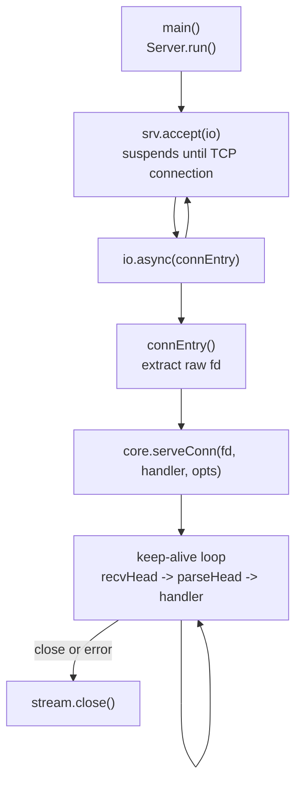
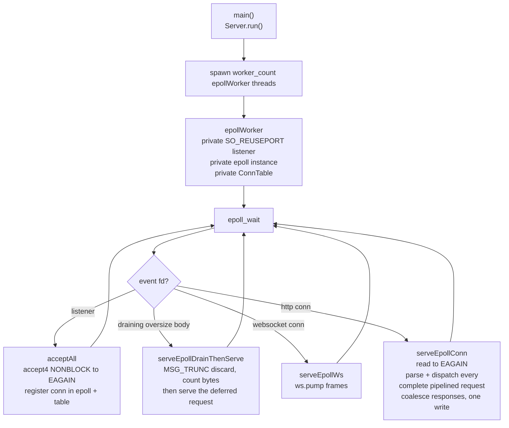
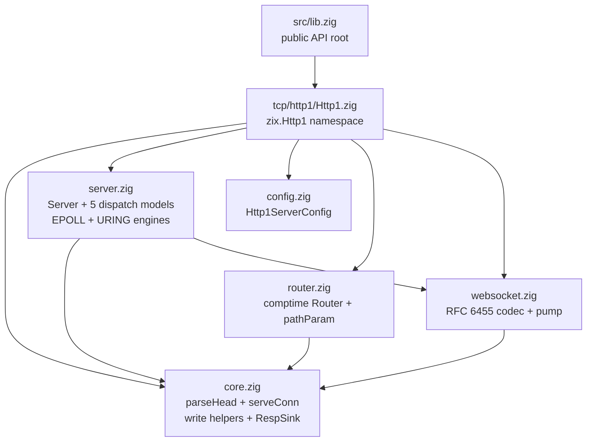
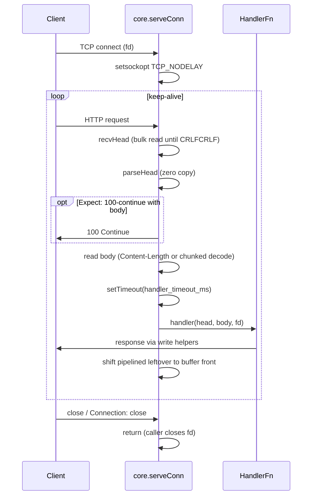
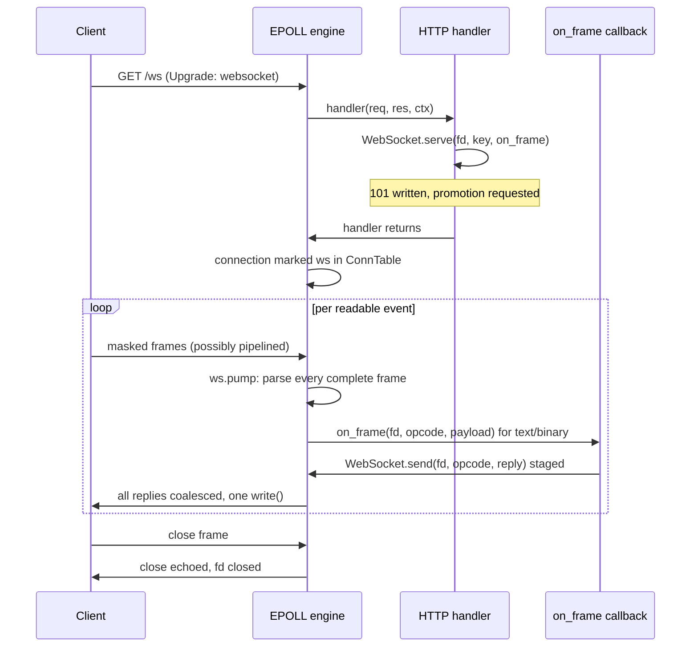

# HLD: zix.Http1

Lean HTTP/1.x server engine on raw fd I/O. Zero-allocation request parsing and response writing on caller-owned buffers, no `std.http` dependency.

---

## Goals

- Zero heap allocation on the hot path: parse and write operate on stack or pre-allocated buffers.
- The handler trio (`Request`, `Response`, `Context`) is built per request from stack-cheap views over those buffers: `Response` delegates to the direct fd write helpers, so ergonomics cost no wire change (ADR-062).
- Comptime everything: the handler is baked into the server type, the route table is partitioned at compile time.
- Raw `std.posix` I/O on the data path: `std.Io` is used only for listen/accept plumbing.
- Minimal surface: one handler signature, a small set of write helpers, an optional comptime router.

---

## Positioning: zix.Http1 vs zix.Http

Both are HTTP/1.1 servers. `zix.Http` is the full-featured layer, `zix.Http1` is the lean engine.

| Aspect | `zix.Http` | `zix.Http1` |
| :- | :- | :- |
| Handler signature | `fn(*Request, *Response, *Context) anyerror!void` | `fn(*Request, *Response, *Context) anyerror!void` (same trio, ADR-062) |
| Request parsing | own parser (`parser.zig`) | own zero-copy `parseHead` (`parser.zig` copy) |
| Request body | lazy socket read in `body()` | engine-delivered slice (drained + dechunked before invoke) |
| Per-request allocator | per-connection arena | per-request arena (`ctx.allocator`, reset per dispatch) |
| Response writing | buffered `Response` object | `Response` builder delegating to direct fd write helpers |
| Static files / multipart / SSE writer | built in | `public_dir` static fallback with an optional open-file cache (ADR-064), shared `Multipart`, `SseWriter` |
| Routing | runtime handler via `Router(routes).dispatch` (ADR-063, not baked into the type) | comptime route table (optional, handler can be bare) |
| WebSocket | handler-owned frame loop | engine-owned frame pump (every model) |
| Dispatch models | ASYNC, EPOLL, URING | ASYNC, EPOLL, URING |

The trio surface is caller-identical across both engines (a compile-time parity test in `src/lib.zig` enforces it). Use `zix.Http` when handlers need the richer client-facing layer. Use `zix.Http1` when raw throughput and predictable per-request cost matter more: the trio is views plus an arena reset, and the escape hatch (`ctx.fd` plus the `*FD` write helpers) keeps the raw path open.

---

## Runtime Model

Three dispatch models, selected via `config.dispatch_model` (`DispatchModel` enum). Required: the caller must set it explicitly (no default). `.EPOLL` and `.URING` are Linux-only, and `run()` rejects them off Linux with `error.ZixDispatchModelUnsupported` rather than silently serving a different model (ADR-065).

### .ASYNC: Single Accept, io.async() Dispatch


```mermaid
flowchart TD
    MAIN["main()\nServer.run()"] --> ACC["srv.accept(io)\nsuspends until TCP connection"]
    ACC --> DISP["io.async(connEntry)"]
    DISP --> ACC
    DISP --> CONN["connEntry()\nextract raw fd"]
    CONN --> SERVE["core.serveConn(fd, handler, opts)"]
    SERVE --> LOOP["keep-alive loop\nrecvHead -> parseHead -> handler"]
    LOOP --> LOOP
    LOOP -->|close or error| Z["stream.close()"]
```

- One accept thread, each connection dispatched as a concurrent task via `io.async()`.
- `workers` is ignored (there is always exactly one accept thread).
- The only model available on every platform, so it is the model every non-Linux target uses.

### .EPOLL: Shared-Nothing Event Loop (Linux only)


```mermaid
flowchart TD
    MAIN["main()\nServer.run()"] --> SPAWN["spawn worker_count epollWorker threads"]
    SPAWN --> W["epollWorker\nprivate SO_REUSEPORT listener\nprivate epoll instance\nprivate ConnTable"]
    W --> WAIT["epoll_wait"]
    WAIT --> EV{"event fd?"}
    EV -->|listener| ACCEPT["acceptAll\naccept4 NONBLOCK to EAGAIN\nregister conn in epoll + table"]
    EV -->|draining oversize body| DRAIN["serveEpollDrainThenServe\nMSG_TRUNC discard, count bytes\nthen serve the deferred request"]
    EV -->|websocket conn| WS["serveEpollWs\nws.pump frames"]
    EV -->|http conn| HTTP["serveEpollConn\nread to EAGAIN\nparse + dispatch every\ncomplete pipelined request\ncoalesce responses, one write"]
    ACCEPT --> WAIT
    DRAIN --> WAIT
    WS --> WAIT
    HTTP --> WAIT
```

- Each worker owns a private listener, epoll instance, and connection table. The kernel load-balances new connections across the per-worker listeners (`SO_REUSEPORT`), so there is no accept thread, no shared queue, and no cross-thread fd handoff.
- Pipelined requests arriving in one readable event are all parsed and dispatched in that pass, and their responses are coalesced into a single `write()` via a per-event response sink.
- Off Linux, `run()` returns `error.ZixDispatchModelUnsupported` after logging which model was rejected: pick `.ASYNC` there.
- This is the only model that honors engine-owned WebSocket promotion (see WebSocket section).

### .URING: Shared-Nothing io_uring Event Loop (Linux only)

`zix.Http1` is the reference engine for the io_uring path (ADR-037). Same shared-nothing, thread-per-core topology as `.EPOLL` (private `SO_REUSEPORT` listener and one ring per worker), but completion-based: accept, recv, send, and close are submitted as SQEs and reaped as CQEs, so most syscall transitions are batched into the ring. The WebSocket pump also runs natively on the ring (BufferGroup). Off Linux, `run()` returns `error.ZixDispatchModelUnsupported`, and when io_uring itself is unavailable on a Linux host the engine folds to the `.EPOLL` loop with a logged notice. On loopback it matches `.EPOLL` on throughput and wins mainly on per-request cache locality.

Teardown also rings the close (`prep_close`, ADR-041) instead of a synchronous `linux.close`, so the worker keeps reaping completions across connection teardowns. On the 64-core box this is the difference under connection churn: with the synchronous close the ring barely engaged its cores under reconnect storms, with the ring close it fills them and reaches parity or better on every cell at a fraction of the memory. The shared io_uring `OpKind` and ring helpers live in `src/multiplexers/ring.zig`. See ADR-041 for the measurement.

---

## Source Layout


```mermaid
graph TD
    zix["src/lib.zig\npublic API root"] --> Http1["tcp/http1/Http1.zig\nzix.Http1 namespace"]

    Http1 --> core["core.zig\nparseHead + serveConn\nwrite helpers + RespSink"]
    Http1 --> server["server.zig\nServer + 5 dispatch models\nEPOLL + URING engines"]
    Http1 --> config["config.zig\nHttp1ServerConfig"]
    Http1 --> router["router.zig\ncomptime Router + pathParam"]
    Http1 --> websocket["websocket.zig\nRFC 6455 codec + pump"]

    server --> core
    server --> websocket
    router --> core
    websocket --> core
```

---

## Public API

Access via `const zix = @import("zix");`

| Symbol | Type | Description |
| :- | :- | :- |
| `zix.Http1.Server` | struct | `init(comptime handler, config)` returns the server, then `run()` / `deinit()` (the single entry, ADR-062) |
| `zix.Http1.ServerConfig` | struct | Server configuration (see Http1ServerConfig section) |
| `zix.Http1.DispatchModel` | enum(u8) | `.ASYNC`(0, portable) `.EPOLL`(1, Linux-only) `.URING`(2, Linux-only) |
| `zix.Http1.HandlerFn` | type | `*const fn(req: *Request, res: *Response, ctx: *Context) anyerror!void` (the trio, ADR-062) |
| `zix.Http1.Request` | struct | Zero-copy request view: `method()`, `path()`, `query()`, `queryParam`, `header`, `pathParam`, `body()`, `bodyReceived()`, `bodyComplete()`, `keepAlive`, `pathSegments`, `queryParams`, `fromRaw` |
| `zix.Http1.Response` | struct | Response builder over the fd writers: `setStatus`, `setContentType`, `setKeepAlive`, `addHeader`, `send`, `sendJson`, `sendText`, `sendRaw`, `sendNoContent`, `sendFromCache`, `sendCached`, `sendNegotiated`, `sendStream`, plus the `sent` flag |
| `zix.Http1.Context` | struct | io, per-request arena allocator, fd escape hatch, `withDeadline` |
| `zix.Http1.Method` / `Status` / `Content` / `ContentType` | namespaces | Typed trio surface (`setStatus(Status.Code)`, `setContentType(Content.Type)`, `req.method()` returns `Method.Code`), identical across both engines. `Method.Code` includes `QUERY` (RFC 10008). `Content.typeFromString` / `typeFromHeader` return `?Type`, null meaning the value names no type the table knows. Each namespace has one lookup per direction: `stringFromEnum(value)` for the string (`value.asString()` is the same function spelled as a method call), and `codeFromString` / `typeFromString` for the value |
| `zix.Http1.Header` / `HeaderSize` | struct / enum | `addHeader` entry and its capacity class (`max_response_headers`) |
| `zix.Http1.Multipart` / `MultipartField` | struct | Shared multipart parser |
| `zix.Http1.SseWriter` | struct | SSE event writer returned by `res.sendStream()` |
| `zix.Http1.ParsedHead` | struct | Zero-copy parsed request head (method, path, query, raw_headers, flags, accept_encoding span) |
| `zix.Http1.Range` | struct | `{ start: u64, end: u64 }` from `parseRange` |
| `zix.Http1.ServeOpts` | struct | `serveConn` options: `nodelay`, `handler_timeout_ms` |
| `zix.Http1.ConnOutcome` | enum | `.keep_alive` or `.close` (EPOLL one-shot result) |
| `zix.Http1.Route` | struct | `{ path, handler, kind = .EXACT }` |
| `zix.Http1.RouteKind` | enum(u8) | `.EXACT` `.PREFIX` `.PARAM` |
| `zix.Http1.Router` | fn | `Router(comptime routes) type`, exposes `dispatch` usable as a HandlerFn |
| `zix.Http1.PathParam` | struct | One captured `:param` (name, value) |
| `zix.Http1.pathParam` | fn | Look up a captured param inside a handler |
| `zix.Http1.WebSocket` | namespace | RFC 6455 codec: `parseFrame` / `buildFrame` / `acceptKey` / `upgrade` / `send` / `serve` / `pump` |
| `zix.Http1.WsFrameFn` | type | Per-frame callback for an engine-owned WebSocket |
| `zix.Http1.setTimeout` | fn | Arm or shorten the per-handler deadline (thread-local) |
| `zix.Http1.isExpired` | fn | Whether the current handler's deadline has passed |
| `zix.Http1.parseHead` | fn | Parse a complete request head from a buffer (zero copy). `error.ZixUnknownMethod` for a method this engine does not implement, `error.ZixInvalidRequest` for a malformed request line |
| `zix.Http1.parseErrorResponse` | fn | The response bytes for a failed parse: 501 for `error.ZixUnknownMethod`, 400 otherwise |
| `zix.Http1.getHeader` | fn | Case-insensitive header lookup on a ParsedHead |
| `zix.Http1.acceptEncoding` | fn | Accept-Encoding value for a ParsedHead: O(1) from the parse-pass span, getHeader fallback otherwise |
| `zix.Http1.setCache` | fn | Install or clear the per-worker response cache |
| `zix.Http1.setExternalHandler` | fn | Register the per-worker callback for external fd readability (`.URING` driver sockets) |
| `zix.Http1.uringWatchFd` | fn | Arm a multishot readable watch for a foreign fd on the worker's own ring |
| `zix.Http1.queryParam` | fn | Linear scan for one query parameter by exact name |
| `zix.Http1.percentDecode` | fn | Percent-decode a buffer in place |
| `zix.Http1.parseRange` | fn | Parse `bytes=start-end` into a `Range` |
| `zix.Http1.writeAllFD` | fn | Write all bytes to fd (sink-aware, handles EINTR/EAGAIN) |
| `zix.Http1.responseReserve` | fn | Reserve an in-place render region on the response sink (body bytes written once) |
| `zix.Http1.responseCommit` | fn | Seal a reserved render, the engine builds the simple header in front of the body |
| `zix.Http1.flushPending` | fn | Flush staged response bytes before raw fd writes (pipelining order) |
| `zix.Http1.beginStream` | fn | Begin a streaming response (SSE), detaches the sink so writes flush per event (cleartext + TLS) |
| `zix.Http1.sendSimpleFD` | fn | Full response with Content-Length body |
| `zix.Http1.sendSimpleNoBodyFD` | fn | Headers-only response (HEAD method) |
| `zix.Http1.sendJsonFD` | fn | `sendSimpleFD` shorthand with `application/json` |
| `zix.Http1.sendGzipFD` | fn | gzip-compressed response (in-tree `flate_fast` for bodies under 64 KiB, `std.compress.flate` above) |
| `zix.Http1.sendChunkedStartFD` | fn | Start a `Transfer-Encoding: chunked` response |
| `zix.Http1.sendChunkFD` | fn | Write one chunk |
| `zix.Http1.sendChunkedEndFD` | fn | Terminate the chunked body |
| `zix.Http1.sendRangeFD` | fn | 206 Partial Content or 416 based on a Range header value |
| `zix.Http1.send100ContinueFD` | fn | Send `100 Continue` manually on the raw path (the engine already answers `Expect: 100-continue` on every dispatch model) |

---

## Http1ServerConfig

```zig
pub const Http1ServerConfig = struct {
    io:                 std.Io,                // from process.io, listen/accept plumbing only
    ip:                 []const u8,
    port:               u16,                   // must be non-zero
    dispatch_model:     DispatchModel,
    kernel_backlog:     u31   = 1024,          // TCP listen() backlog
    max_recv_buf:       usize = 6 * 1024,      // per-connection buffer, every model (see note)
    large_body_rcvbuf:  usize = 0,             // SO_RCVBUF on the large-body (upload) path only, 0 = kernel default
    max_request_body:   usize = 8 * 1024 * 1024, // declared Content-Length cap, past it the engine answers 413 (0 = no check)
    ws_recv_buf:        usize = 0,             // WebSocket buffer (.EPOLL recv, .URING frame-accumulation), 0 = max_recv_buf
    compress:             bool  = false,        // enable gzip / deflate / brotli negotiation, opt-in via res.sendNegotiated / core.sendNegotiateFD (every model)
    compression_min_size: usize = 256,           // skip bodies under this floor
    compression_max_out:  usize = 256 * 1024,    // codec-agnostic compressed-output cap, was max_gzip_out
    max_response_headers: HeaderSize = .MINIMAL, // addHeader capacity class (ADR-062)
    conn_timeout_ms:    u32   = 0,             // connection lifetime, .ASYNC only (no-op on .EPOLL/.URING)
    workers:            usize = 0,             // 0 = cpu_count accept threads, ignored by .ASYNC
    handler_timeout_ms: u32   = 0,             // per-handler budget, 0 = disabled
    send_date_header:   bool  = true,          // emit Date header, false saves 37 bytes/response
    tls:                ?*Tls.Context = null,  // non-null serves HTTP/1.1 over TLS (native https), else cleartext
    logger:             ?*Logger = null,       // lifecycle lines only, see Logging section
};
```

The listing above is abbreviated: the full field reference (cache, uring tuning, TLS dual listener, steering) lives in [`docs/zix-config-en.md`](zix-config-en.md).

Note: under `.ASYNC` the connection loop borrows the pool thread's receive + body buffer pair (`core.threadConnBufs`), each `max_recv_buf` bytes, reused by every connection that thread serves. `max_recv_buf` therefore sizes the per-connection buffer under every dispatch model (a direct `core.serveConn` caller that leaves `ServeOpts.max_recv_buf` at 0 gets `core.BUF_SIZE` = 16 KB). `large_body_rcvbuf` sets `SO_RCVBUF` on the large-body (upload) path only, leaving small-request cells on the kernel default. `tls` opts into native https: when non-null the server serves HTTP/1.1 over TLS on a gated path, otherwise cleartext. The `compress`, `compression_min_size`, and `compression_max_out` fields (the last renamed from `max_gzip_out`) are read at runtime under every dispatch model: a handler opts in with `res.sendNegotiated` (or `core.sendNegotiateFD` on the raw path). The `core.sendGzipFD` helper uses the compile-time `core.GZIP_OUT_SIZE`. A declared Content-Length past `max_request_body` is refused with `413` before the body is read (0 disables the check), and a chunked body is bounded by the receive buffer instead, since it declares no length up front.

Note: `ws_recv_buf` sizes the per-connection WebSocket buffer. Under `.EPOLL` it sizes the recv buffer; under `.URING` it sizes the frame-accumulation buffer (`conn.buf`) and the unmask scratch, independent of the small request `max_recv_buf`. `0` falls back to `max_recv_buf`. Set it larger than `max_recv_buf` to give a WebSocket connection more room to accumulate a deep pipelined burst before the engine compacts and re-reads on a fill.

Note: `send_date_header` defaults to `true` for RFC 7231 compliance. Set `false` on hot paths where the client does not consume `Date` to drop the header (37 bytes per response). The managed write helpers honor the flag.

### Timeouts

`zix.Http1` exposes one timeout, `handler_timeout_ms`, the per-handler execution budget. When non-zero, the server arms a thread-local deadline before each dispatch. The handler opts in by calling `zix.Http1.isExpired()` between expensive steps and responding early, or shortens its own budget with `zix.Http1.setTimeout()`. This is the same Layer B budget as `zix.Http`'s `handler_timeout_ms`.

`conn_timeout_ms` (ADR-062) is the connection-lifetime guard, a port of `zix.Http`'s Layer D: a `ConnRegistry` plus a background timer thread shuts down connections exceeding the configured lifetime. It is active on the blocking model (`.ASYNC`), where a slow or idle connection parks a task. On `.EPOLL` and `.URING` it is a documented no-op: their event loops own connection lifetime, and an idle keep-alive connection holds no thread, just one slot and its buffer.

| Timeout | `zix.Http` | `zix.Http1` | Mechanism |
| :- | :- | :- | :- |
| `handler_timeout_ms` | yes | yes | thread-local deadline armed per dispatch, handler-opt-in |
| `conn_timeout_ms` | yes | yes (`.ASYNC`) | `ConnRegistry` + background timer thread |

If connection-lifetime enforcement under `.EPOLL` / `.URING` is ever needed, the natural fit is an idle-deadline sweep over the per-worker table (no extra thread), not the timer-thread `ConnRegistry`.

---

## Handler Model

```zig
fn home(req: *zix.Http1.Request, res: *zix.Http1.Response, ctx: *zix.Http1.Context) anyerror!void {
    _ = ctx;

    if (req.queryParam("name")) |name| {
        _ = name; // slices into the receive buffer, valid only for this call
    }

    res.setContentType(.TEXT_PLAIN);

    try res.send("hello");
}

var server = zix.Http1.Server.init(home, .{
    .io = process.io,
    .ip = "0.0.0.0",
    .port = 8080,
    .dispatch_model = .EPOLL,
});
try server.run();
```

- The handler is a comptime argument: it is baked into the server type, there is no dynamic registration after init.
- The trio is built per request by `core.invokeHandler`: `Request` is a zero-copy view (all slices point into the receive buffer, valid only for the call), `Response` delegates to the fd write helpers byte-identically, `Context` carries io, the per-request arena, and the fd escape hatch.
- A handler error is completed by the engine as one 500, only when nothing was sent yet (`Response.sent`). The house idiom is `try res.foo(...)`, never `return res.foo(...)`.
- The handler may be a bare function, a `Router(routes).dispatch`, or a comptime wrapper chain (the middleware idiom, see `examples/http1_middleware.zig`).

### ParsedHead

| Field | Type | Notes |
| :- | :- | :- |
| `method` | `[]const u8` | Verb as sent (`"GET"`, `"POST"`, ...) |
| `path` | `[]const u8` | Target stripped of query string |
| `query` | `[]const u8` | Raw query string after `?`, `""` if absent |
| `raw_headers` | `[]const u8` | Raw header block, scanned on demand via `getHeader` (no count cap) |
| `version_minor` | `u8` | 1 for HTTP/1.1, 0 for HTTP/1.0 |
| `keep_alive` | `bool` | Version default, overridden by `Connection` header |
| `content_length` | `u64` | 0 when absent or unparseable |
| `chunked_request` | `bool` | `Transfer-Encoding: chunked` present |
| `expect_continue` | `bool` | `Expect: 100-continue` present |
| `accept_encoding` | `HeaderSpan` | Accept-Encoding value span captured in the parse pass, read via `acceptEncoding()` |

---

## QUERY Method (RFC 10008)

QUERY is safe and idempotent like `GET`, and carries content like `POST`. It exists for a question too large or too structured to fit a URL query string, and because it changes nothing a client may retry it freely.

The engine parses and classifies it. Deciding which content types a route accepts stays with the handler: the engine cannot know a route's schema without new config, and a rare method must not add a branch to the hot path.

| Requirement (RFC 10008) | Where it is met |
| :- | :- |
| Section 2: refuse a request whose content type is missing or inconsistent | Handler, from `req.header("content-type")` and `Content.typeFromHeader` |
| Section 2.1: never sniff the content | `Content.typeFromHeader` reports no match for a type the table does not name, it never inspects the body |
| Section 2.7: the cache key must incorporate the request content | The key is `hash(method, path, query)` and carries no content, so a QUERY response is never stored. Caching a QUERY response is a MAY, so refusing is conformant |
| Section 3: `Accept-Query` | Written by the handler as a plain header value. A server only ever emits one, so no RFC 9651 parser is needed |

Method tokens are matched exactly, per RFC 9110 section 9.1. Both HTTP/1 engines read the same table (`Method.codeFromString`), so `query` in lowercase is not the QUERY method on either one: it names a method neither engine implements, and the answer is 501.

Statuses a handler picks from, per section 2.1:

| Case | Status |
| :- | :- |
| No `Content-Type` at all | 400 |
| A `Content-Type` this route does not accept | 415, with `Accept-Query` naming what it does accept |
| Content the route accepts but cannot answer | 422 |
| An `Accept` the route cannot satisfy | 406 |

Content types the table names for query content: `application/sql`, `application/jsonpath`, `application/graphql`, `application/x-www-form-urlencoded`, `multipart/form-data`.

`examples/http1_query.zig` (port 9079) and `examples/http_query.zig` (port 9080) carry the handler-side pattern: the status map above, the `Accept-Query` header, and a route that accepts two types and answers one. `tests/runner/checks_query.zig` drives both on the wire.

Client note: `zix.Http.Client` cannot put a QUERY on the wire over TCP, because it wraps `std.http.Client` and `std.http.Method` is a closed set that predates RFC 10008. It reports `error.UnsupportedMethod` before opening a socket. `requestUds` writes its own request line, so that path does carry QUERY. Both engines serve QUERY regardless of which client sent it.

---

## Connection Lifecycle (.ASYNC)


```mermaid
sequenceDiagram
    participant Client
    participant Serve as core.serveConn
    participant Handler as HandlerFn

    Client->>Serve: TCP connect (fd)
    Serve->>Serve: setsockopt TCP_NODELAY

    loop keep-alive
        Client->>Serve: HTTP request
        Serve->>Serve: recvHead (bulk read until CRLFCRLF)
        Serve->>Serve: parseHead (zero copy)
        opt Expect: 100-continue with body
            Serve->>Client: 100 Continue
        end
        Serve->>Serve: read body (Content-Length or chunked decode)
        Serve->>Serve: setTimeout(handler_timeout_ms)
        Serve->>Handler: handler(head, body, fd)
        Handler->>Client: response via write helpers
        Serve->>Serve: shift pipelined leftover to buffer front
    end

    Client->>Serve: close / Connection: close
    Serve->>Serve: return (caller closes fd)
```

Error responses written by the engine itself: `431` when the header block exceeds the receive buffer, `501` when the method is one this engine does not implement, `400` when the request line is malformed or a chunked body cannot be framed, `413` when a declared body crosses `max_request_body` (or a chunked body outgrows the buffer). All of them close the connection. The router (when used) writes `404` for unmatched paths.

---

## Router

### Registration: comptime route table

```zig
const Routes = zix.Http1.Router(&[_]zix.Http1.Route{
    .{ .path = "/",          .handler = home },
    .{ .path = "/api",       .handler = api,  .kind = .PREFIX },
    .{ .path = "/users/:id", .handler = user, .kind = .PARAM },
});

var server = zix.Http1.Server.init(Routes.dispatch, .{ .io = process.io, .ip = "0.0.0.0", .port = 8080 });
```

| `kind` | Pattern example | Behaviour |
| :- | :- | :- |
| `.EXACT` (default) | `"/about"` | Matches only when the full path equals `path` |
| `.PREFIX` | `"/api"` | Matches `path` and any sub-path on a `/` boundary |
| `.PARAM` | `"/users/:id"` | `:name` segments captured, literals must match exactly |

### Dispatch: priority rules

```
Pass 1: exact routes   O(1) comptime StaticStringMap     (registration order irrelevant)
Pass 2: param routes   first matching pattern wins        (registration order matters)
Pass 3: prefix routes  longest matching prefix wins       (registration order irrelevant)

exact > param > prefix (longer prefix beats shorter prefix)
```

Routes are partitioned by kind at compile time: exact paths into a `StaticStringMap`, param and prefix routes into comptime arrays walked with `inline for`. Unmatched paths get `404 text/plain` from `dispatch` itself.

### Path params

`pathParam("id")` inside the handler returns the captured segment. Captures live in a thread-local store (max 8 per route) and are valid only for the dispatch call, the same lifetime as the request slices.

---

## Handler Budget: setTimeout / isExpired

When `config.handler_timeout_ms > 0` the engine arms a thread-local deadline before each dispatch. Handlers opt in by calling `zix.Http1.isExpired()` between expensive steps:

```zig
fn slow(req: *zix.Http1.Request, res: *zix.Http1.Response, ctx: *zix.Http1.Context) anyerror!void {
    _ = req;
    _ = ctx;

    doStep1();
    if (zix.Http1.isExpired()) {
        res.setStatus(.REQUEST_TIMEOUT);
        try res.sendJson("{\"error\":\"timeout\"}");
        return;
    }

    doStep2();

    try res.sendJson("{\"result\":\"ok\"}");
}
```

- `isExpired()` is always safe: it returns `false` when no deadline is armed. The check is one `clock_gettime` plus a compare.
- `setTimeout(ms)` re-arms the deadline for the current handler (shorten or extend), `setTimeout(0)` clears it, and `ctx.withDeadline` is the trio-side wrapper.
- The deadline is thread-local, mirroring the one-request-per-worker execution model.

---

## WebSocket: Engine-Owned Connections

`zix.Http1.WebSocket` is an RFC 6455 codec plus an engine-owned connection model. The handler completes the handshake and registers a per-frame callback, then returns. The engine drives the frame loop from its event loop, so no worker is ever parked on a single connection.


```mermaid
sequenceDiagram
    participant C as Client
    participant E as EPOLL engine
    participant H as HTTP handler
    participant F as on_frame callback

    C->>E: GET /ws (Upgrade: websocket)
    E->>H: handler(req, res, ctx)
    H->>H: WebSocket.serve(fd, key, on_frame)
    Note over H: 101 written, promotion requested
    H->>E: handler returns
    E->>E: connection marked ws in ConnTable

    loop per readable event
        C->>E: masked frames (possibly pipelined)
        E->>E: ws.pump: parse every complete frame
        E->>F: on_frame(fd, opcode, payload) for text/binary
        F->>E: WebSocket.send(fd, opcode, reply) staged
        E->>C: all replies coalesced, one write()
    end

    C->>E: close frame
    E->>C: close echoed, fd closed
```

- `WebSocket.serve(fd, key, on_frame)` computes the accept key, writes `101 Switching Protocols`, and requests promotion via a thread-local handoff slot that the engine reads right after the handler returns.
- Ping is auto-ponged and close is auto-echoed by the engine. The callback only ever sees text and binary frames.
- Frames sent during one pump pass coalesce into a single `write()`.
- Promotion is honored under `.EPOLL` only. Under `.ASYNC` the handoff is cleared and the connection ends after the handler returns (use `zix.Http` for handler-owned WebSocket loops on that model).
- Over TLS (`config.tls`, the thread-per-connection path), call `WebSocket.serveTls(fd, key, on_frame)` instead (ADR-055): the `101` and every frame encrypt through the ADR-054 stream sink, and the https thread runs the frame loop inline over the TLS session. Rooms / broadcast are cleartext-only (per-session encryption), so wss is per-connection.

See `examples/http1_websocket.zig` (cleartext) and `examples/tls/tls_http1_ws.zig` (wss).

---

## Logging

`config.logger` receives server lifecycle lines only (listening notices, EPOLL fallback). When null, lifecycle lines print to stderr only in Debug builds and are silent in release builds (so a release server with no logger emits no lifecycle output).

Per-request access logging is the handler's responsibility: the response bytes go to the fd through the write helpers, so the engine does not observe response status or byte counts centrally. Call `logger.access()` inside the handler where the final status and size are known.

---

## Memory Model

| Scope | Storage | Lifetime |
| :- | :- | :- |
| Route table | comptime (zero heap cost) | Process |
| Receive + body buffers (.ASYNC) | pool-thread pair (`threadConnBufs`), each `max_recv_buf` bytes, grown only, reused across the thread's connections | Pool thread |
| Per-connection buffer (.EPOLL) | per-worker slab, compact page-aligned slots, `max_recv_buf` bytes usable | Connection |
| Per-connection recv + send buffers (.URING) | per-worker mmap'd stride slab, compact slots, THP opted out | Connection |
| Body + output staging (.EPOLL) | `smp_allocator`, per worker | Worker thread |
| Compression scratch (gzip / negotiate) | one lazily mmap'd per-worker block, reused across calls | Worker thread |
| Per-request arena (`ctx.allocator`) | per worker (event loops) or per connection (blocking models), reset per dispatch | Request |
| Handler allocations | `ctx.allocator` (arena), or bring your own | Request |

---

## Known Limits

| Limit | Behaviour |
| :- | :- |
| Header block size | Max `max_recv_buf` bytes on every dispatch model (default 6 KB, a direct `serveConn` caller gets `core.BUF_SIZE` = 16 KB). Exceeding returns `431` and closes |
| Body under .ASYNC | The handler sees at most `max_recv_buf` bytes of body. A larger Content-Length body has its remainder drained off the socket so the keep-alive connection stays usable: `req.bodyReceived()` reports the counted total, `req.bodyComplete()` whether the peer sent it all |
| Body under .EPOLL / .URING | Must fit `max_recv_buf` minus the head. A larger body keeps the connection usable by draining the remainder off the socket (`MSG_TRUNC`): both models defer the handler until the drain finishes, then run it with the counted total in `req.bodyReceived()` and an empty body slice |
| Declared body past `max_request_body` | Refused with `413` before any body byte is read or drained, on every dispatch model (default 8 MiB, 0 disables the check) |
| Large request body (uploads) | The drain widens the receive window via `large_body_rcvbuf` (SO_RCVBUF), see [`docs/zix-config-en.md`](zix-config-en.md) |
| Chunked request body | Decoded into the body buffer. A frame the decoder cannot walk answers `400`, a chunked body past the buffer answers `413` (chunked declares no length up front, so the buffer stands in for `max_request_body`) |
| HTTP versions | HTTP/1.0 and HTTP/1.1 only, anything else is `400` |
| TLS | Native https/1.1 (TLS 1.3 + 1.2), opt-in via `config.tls`, on its own perf band. `.ASYNC` terminates per connection in a worker thread, `.EPOLL` / `.URING` in an event-driven epoll-mux worker. See [`docs/hld-tls-en.md`](hld-tls-en.md) |

Endpoints that accept large uploads read `req.bodyReceived()` on every dispatch model (the drained bytes are counted, not buffered) and `req.bodyComplete()` to tell a finished upload from one the peer cut short.

For the full-featured HTTP layer see [`docs/hld-http-en.md`](hld-http-en.md). For implementation details see [`docs/lld-http1-en.md`](lld-http1-en.md).

---

###### end of hld-http1
