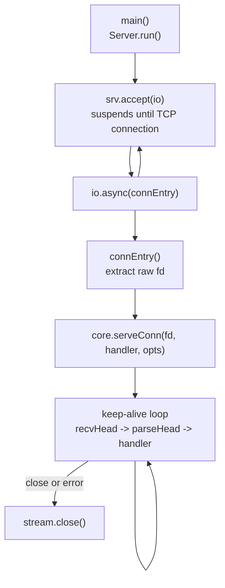
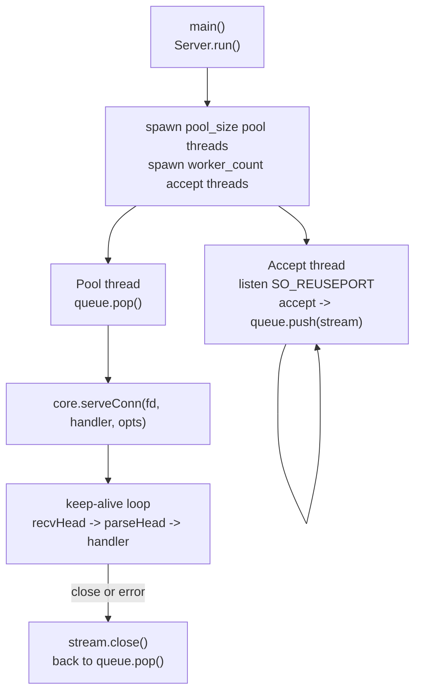
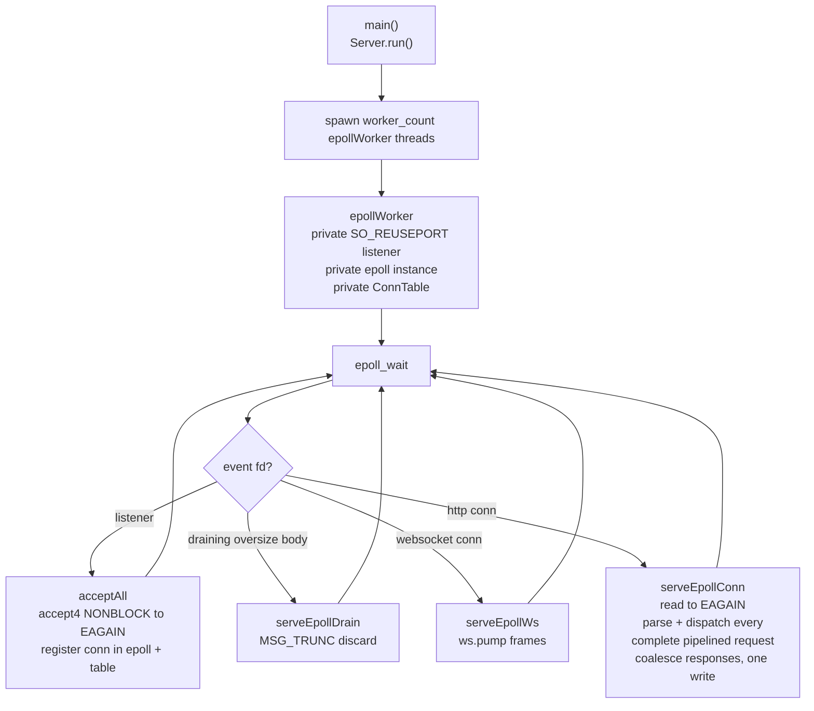

# HLD: zix.Http1

Engine server HTTP/1.x ramping di atas raw fd I/O. Parsing request dan penulisan response tanpa alokasi pada buffer milik pemanggil, tanpa dependensi `std.http`.

---

## Tujuan

- Nol alokasi heap pada hot path: parse dan write beroperasi pada buffer stack atau buffer yang dialokasikan di muka.
- Tanpa objek request/response: handler menerima head hasil parse plus slice body, lalu menulis langsung ke fd melalui write helper.
- Comptime untuk semuanya: handler dibakukan ke dalam tipe server, tabel route dipartisi saat kompilasi.
- Raw `std.posix` I/O pada jalur data: `std.Io` hanya dipakai untuk plumbing listen/accept.
- Permukaan API minimal: satu signature handler, sekumpulan kecil write helper, dan router comptime yang opsional.

---

## Posisi: zix.Http1 vs zix.Http

Keduanya server HTTP/1.1. `zix.Http` adalah lapisan berfitur lengkap, `zix.Http1` adalah engine ramping.

| Aspek | `zix.Http` | `zix.Http1` |
| :- | :- | :- |
| Signature handler | `fn(*Request, *Response, *Context) !void` | `fn(*const ParsedHead, []const u8, fd) void` |
| Parsing request | `std.http.Server` | `parseHead` zero-copy milik sendiri |
| Allocator per-request | arena per-connection | tidak ada (buffer milik pemanggil) |
| Penulisan response | objek `Response` ter-buffer | write helper langsung ke fd |
| Static files / multipart / SSE writer | built in | tidak built in (handler merangkai dari helper) |
| Routing | tabel route comptime | tabel route comptime (opsional, handler boleh polos) |
| WebSocket | frame loop milik handler | frame pump milik engine (.EPOLL) |
| Model dispatch | ASYNC, POOL, MIXED, EPOLL | ASYNC, POOL, MIXED, EPOLL |

Pakai `zix.Http` saat handler membutuhkan allocator, static file serving, atau API request/response yang lebih kaya. Pakai `zix.Http1` saat raw throughput dan biaya per-request yang terprediksi lebih penting daripada kenyamanan.

---

## Model Runtime

Lima model dispatch, dipilih melalui `config.dispatch_model` (enum `DispatchModel`). Default: `.ASYNC`.

### .ASYNC: Accept Tunggal, Dispatch io.async()



- Satu accept thread, setiap koneksi di-dispatch sebagai task konkuren melalui `io.async()`.
- `workers` dan `pool_size` diabaikan.

### .POOL: Work-Queue Thread Pool



- Accept thread hanya mendorong stream hasil accept ke `ConnQueue` (ring buffer) yang dipakai bersama.
- Pool thread mengambil dan melayani setiap koneksi secara sinkron.
- Default: cpu_count accept thread, `max(10, cpu_count * 2)` pool thread.

### .MIXED: N Accept Thread, Dispatch io.async()

- N accept thread (default cpu_count, `SO_REUSEPORT`), masing-masing men-dispatch koneksi langsung melalui `io.async()`, tanpa `ConnQueue`.
- `pool_size` diabaikan. `workers` mengontrol jumlah accept thread.

### .EPOLL: Event Loop Shared-Nothing (khusus Linux)



- Setiap worker memiliki listener pribadi, instance epoll pribadi, dan connection table pribadi. Kernel menyeimbangkan koneksi baru di antara listener per-worker (`SO_REUSEPORT`), sehingga tidak ada accept thread, tidak ada queue bersama, dan tidak ada perpindahan fd antar thread.
- Request pipelined yang tiba dalam satu readable event semuanya di-parse dan di-dispatch dalam satu pass, dan response-nya digabung menjadi satu `write()` melalui response sink per-event.
- Pada target non-Linux `.EPOLL` jatuh kembali ke `.POOL` dengan notice yang dicatat di log.
- Ini satu-satunya model yang menghormati promosi WebSocket milik engine (lihat bagian WebSocket).

### .URING: Event Loop io_uring Shared-Nothing (khusus Linux)

`zix.Http1` adalah engine referensi untuk jalur io_uring (ADR-037). Topologi shared-nothing, thread-per-core yang sama dengan `.EPOLL` (listener `SO_REUSEPORT` pribadi dan satu ring per worker), tetapi completion-based: accept, recv, send, dan close disubmit sebagai SQE dan dipanen sebagai CQE, sehingga sebagian besar transisi syscall di-batch ke dalam ring. Pump WebSocket juga berjalan native di ring (BufferGroup). Di non-Linux melipat ke `.POOL`. Di loopback setara `.EPOLL` pada throughput dan menang terutama pada cache locality per-request.

Teardown juga me-ring close-nya (`prep_close`, ADR-041) alih-alih `linux.close` sinkron, jadi worker terus memanen completion lintas teardown koneksi. Di mesin 64-core inilah pembedanya di bawah connection churn: dengan close sinkron ring nyaris tidak mengaktifkan core-nya di bawah reconnect storm, dengan ring close ia mengisinya dan mencapai paritas atau lebih baik di setiap cell dengan memori jauh lebih sedikit. `OpKind` io_uring bersama dan helper ring berada di `src/multiplexers/ring.zig`. Lihat ADR-041 untuk pengukurannya.

---

## Struktur Berkas


---

## API Publik

Diakses melalui `const zix = @import("zix");`

| Simbol | Tipe | Deskripsi |
| :- | :- | :- |
| `zix.Http1.Server` | struct | `init(comptime handler, config)` mengembalikan server, lalu `run()` / `deinit()` |
| `zix.Http1.Server.initRaw` | fn | `initRaw(comptime raw, config)`: mendaftarkan `RawFn` yang memiliki fd koneksi secara langsung |
| `zix.Http1.ServerConfig` | struct | Konfigurasi server (lihat bagian Http1ServerConfig) |
| `zix.Http1.DispatchModel` | enum(u8) | `.ASYNC`(0) `.POOL`(1) `.MIXED`(2) `.EPOLL`(3, native hanya di Linux) |
| `zix.Http1.HandlerFn` | type | `*const fn(head: *const ParsedHead, body: []const u8, fd: std.posix.fd_t) void` |
| `zix.Http1.RawFn` | type | Handler raw yang diberi fd dan head hasil parse, memiliki wire langsung (framing kustom, streaming) |
| `zix.Http1.ParsedHead` | struct | Head request hasil parse zero-copy (method, path, query, headers, flags) |
| `zix.Http1.Header` | struct | `{ name: []const u8, value: []const u8 }` |
| `zix.Http1.Range` | struct | `{ start: u64, end: u64 }` dari `parseRange` |
| `zix.Http1.ServeOpts` | struct | Opsi `serveConn`: `nodelay`, `handler_timeout_ms` |
| `zix.Http1.ConnOutcome` | enum | `.keep_alive` atau `.close` (hasil one-shot EPOLL) |
| `zix.Http1.Route` | struct | `{ path, handler, kind = .EXACT }` |
| `zix.Http1.RouteKind` | enum(u8) | `.EXACT` `.PREFIX` `.PARAM` |
| `zix.Http1.Router` | fn | `Router(comptime routes) type`, mengekspos `dispatch` yang dapat dipakai sebagai HandlerFn |
| `zix.Http1.PathParam` | struct | Satu `:param` yang tertangkap (name, value) |
| `zix.Http1.pathParam` | fn | Mencari param yang tertangkap dari dalam handler |
| `zix.Http1.WebSocket` | namespace | Codec RFC 6455: `parseFrame` / `buildFrame` / `acceptKey` / `upgrade` / `send` / `serve` / `pump` |
| `zix.Http1.WsFrameFn` | type | Callback per-frame untuk WebSocket milik engine |
| `zix.Http1.setTimeout` | fn | Memasang atau memperpendek deadline per-handler (thread-local) |
| `zix.Http1.isExpired` | fn | Apakah deadline handler saat ini sudah lewat |
| `zix.Http1.parseHead` | fn | Parse head request lengkap dari buffer (zero copy) |
| `zix.Http1.getHeader` | fn | Pencarian header case-insensitive pada ParsedHead |
| `zix.Http1.queryParam` | fn | Pemindaian linear satu query parameter berdasarkan nama persis |
| `zix.Http1.percentDecode` | fn | Percent-decode buffer secara in place |
| `zix.Http1.parseRange` | fn | Parse `bytes=start-end` menjadi `Range` |
| `zix.Http1.fdWriteAll` | fn | Menulis semua byte ke fd (sadar sink, menangani EINTR/EAGAIN) |
| `zix.Http1.flushPending` | fn | Flush byte response yang masih tertahan sebelum raw fd write (urutan pipelining) |
| `zix.Http1.writeSimple` | fn | Response lengkap dengan body Content-Length |
| `zix.Http1.writeSimpleNoBody` | fn | Response headers saja (method HEAD) |
| `zix.Http1.writeJson` | fn | Singkatan `writeSimple` dengan `application/json` |
| `zix.Http1.writeGzip` | fn | Response terkompresi gzip via `std.compress.flate` |
| `zix.Http1.writeChunkedStart` | fn | Memulai response `Transfer-Encoding: chunked` |
| `zix.Http1.writeChunk` | fn | Menulis satu chunk |
| `zix.Http1.writeChunkedEnd` | fn | Mengakhiri body chunked |
| `zix.Http1.writeRange` | fn | 206 Partial Content atau 416 berdasarkan nilai header Range |
| `zix.Http1.write100Continue` | fn | Mengirim `100 Continue` sebelum membaca body besar |

---

## Http1ServerConfig

```zig
pub const Http1ServerConfig = struct {
    io:                 std.Io,                // dari process.io, hanya plumbing listen/accept
    ip:                 []const u8,
    port:               u16,                   // harus non-zero
    dispatch_model:     DispatchModel = .ASYNC,
    kernel_backlog:     u31   = 1024,          // backlog listen() TCP
    max_recv_buf:       usize = 16 * 1024,     // buffer per-connection (.EPOLL saja, lihat catatan)
    ws_recv_buf:        usize = 0,             // buffer WebSocket .EPOLL, 0 = max_recv_buf
    compression:          bool  = false,        // enable negosiasi gzip, opt-in via core.writeNegotiated (.EPOLL/.URING)
    compression_min_size: usize = 256,           // lewati body di bawah floor ini
    compression_max_out:  usize = 256 * 1024,    // cap output terkompresi codec-agnostic, dulu max_gzip_out
    max_headers:        u8    = 16,            // informasional: batas parse adalah core.MAX_HEADERS
    workers:            usize = 0,             // 0 = cpu_count accept thread, diabaikan .ASYNC
    pool_size:          usize = 0,             // 0 = max(10, cpu_count * 2), .POOL saja
    handler_timeout_ms: u32   = 0,             // budget per-handler, 0 = nonaktif
    send_date_header:   bool  = true,          // kirim header Date, false hemat 37 byte/response
    logger:             ?*Logger = null,       // baris lifecycle saja, lihat bagian Logging
};
```

Catatan: pada `.ASYNC` / `.POOL` / `.MIXED` loop koneksi memakai buffer stack berukuran tetap (`core.BUF_SIZE` = 16 KB untuk header, 8 KB untuk body). `max_recv_buf` menentukan ukuran buffer per-connection hanya pada `.EPOLL`. Field `compression`, `compression_min_size`, dan `compression_max_out` (yang terakhir di-rename dari `max_gzip_out`) dibaca saat runtime pada `.EPOLL` dan `.URING`: handler opt-in dengan memanggil `core.writeNegotiated` alih-alih `writeSimple`. Helper lama `core.writeGzip` masih memakai konstanta compile-time `core.GZIP_OUT_SIZE`, dan `max_headers` tetap informasional, mencerminkan `core.MAX_HEADERS`.

Catatan: `ws_recv_buf` menentukan ukuran buffer per-connection untuk koneksi yang dipromosikan ke WebSocket pada `.EPOLL`. `0` jatuh ke `max_recv_buf`. Set lebih besar dari `max_recv_buf` untuk memberi koneksi WebSocket ruang lebih mengakumulasi frame pipelined sebelum engine compact dan re-read saat fill.

Catatan: `send_date_header` default `true` untuk kepatuhan RFC 7231. Set `false` pada jalur panas di mana klien tidak mengonsumsi `Date` untuk membuang header (37 byte per response). Write helper terkelola menghormati flag ini.

### Timeout

`zix.Http1` mengekspos satu timeout, `handler_timeout_ms`, budget eksekusi per-handler. Saat non-zero, server memasang deadline thread-local sebelum setiap dispatch. Handler ikut serta dengan memanggil `zix.Http1.isExpired()` di antara langkah mahal dan merespons lebih awal, atau memperpendek budget-nya sendiri dengan `zix.Http1.setTimeout()`. Ini budget Layer B yang sama dengan `handler_timeout_ms` milik `zix.Http`.

`zix.Http1` tidak memiliki `conn_timeout_ms`. Ini disengaja, bukan kelalaian.

- Guard masa hidup koneksi pada `zix.Http` (`conn_timeout_ms`, Layer D) ditegakkan oleh `ConnRegistry` plus background timer thread yang menutup koneksi melebihi masa hidup terkonfigurasi. `zix.Http1` adalah engine ramping zero-alloc dan tidak membawa infrastruktur tetap itu: handler-nya `fn(head, body, fd) void` tanpa `Request` / `Response` / registry untuk melacak koneksi, dan tanpa receive timeout level-socket (`setNoDelay` dan `SO_BUSY_POLL` adalah satu-satunya opsi socket yang dipasang).
- Pada `.EPOLL`, model yang menjadi target tuning `zix.Http1`, koneksi keep-alive idle tidak menahan thread, hanya satu slot epoll dan buffernya. Alasan utama `conn_timeout_ms` ada pada `zix.Http` (mengklaim ulang pool thread yang tertahan pada koneksi lambat atau idle) tidak berlaku untuk loop level-triggered shared-nothing.

| Timeout | `zix.Http` | `zix.Http1` | Mekanisme |
| :- | :- | :- | :- |
| `handler_timeout_ms` | ya | ya | deadline thread-local dipasang per dispatch, opt-in handler |
| `conn_timeout_ms` | ya (`.POOL`) | tidak | `ConnRegistry` + background timer thread (Http saja) |

Jika penegakan masa hidup koneksi pada `.EPOLL` suatu saat dibutuhkan, yang paling cocok adalah sweep idle-deadline atas `ConnTable` per-worker (tanpa thread tambahan), bukan port `ConnRegistry` timer-thread milik Http.

---

## Model Handler

```zig
fn home(head: *const zix.Http1.ParsedHead, body: []const u8, fd: std.posix.fd_t) void {
    _ = body;

    if (zix.Http1.queryParam(head, "name")) |name| {
        _ = name; // slice ke receive buffer, hanya valid selama pemanggilan ini
    }

    zix.Http1.writeSimple(fd, 200, "text/plain", "hello") catch {};
}

var server = zix.Http1.Server.init(home, .{
    .io = process.io,
    .ip = "0.0.0.0",
    .port = 8080,
});
try server.run();
```

- Handler adalah argumen comptime: dibakukan ke dalam tipe server, tidak ada registrasi dinamis setelah init.
- Semua slice di `head` dan `body` menunjuk ke receive buffer dan hanya valid selama pemanggilan berlangsung.
- Handler mengembalikan `void`: error ditangani di dalam handler (biasanya `catch {}` pada write helper, koneksi toh akan ditutup saat broken pipe).
- Handler boleh berupa fungsi polos, `Router(routes).dispatch`, atau rantai middleware yang dirangkai saat comptime.

### ParsedHead

| Field | Tipe | Catatan |
| :- | :- | :- |
| `method` | `[]const u8` | Verb apa adanya (`"GET"`, `"POST"`, ...) |
| `path` | `[]const u8` | Target tanpa query string |
| `query` | `[]const u8` | Query string mentah setelah `?`, `""` jika tidak ada |
| `headers` | `[MAX_HEADERS]Header` | Entri valid sebanyak `header_count` pertama |
| `header_count` | `usize` | Jumlah header ter-parse (batas 16, melebihi mengembalikan 400) |
| `version_minor` | `u8` | 1 untuk HTTP/1.1, 0 untuk HTTP/1.0 |
| `keep_alive` | `bool` | Default berdasarkan versi, ditimpa header `Connection` |
| `content_length` | `u64` | 0 saat tidak ada atau tidak bisa di-parse |
| `chunked_request` | `bool` | Ada `Transfer-Encoding: chunked` |
| `expect_continue` | `bool` | Ada `Expect: 100-continue` |

---

## Siklus Hidup Koneksi (.ASYNC / .POOL / .MIXED)


Response error yang ditulis engine sendiri: `431` saat blok header melebihi receive buffer, `400` saat `parseHead` gagal. Keduanya menutup koneksi. Router (bila dipakai) menulis `404` untuk path yang tidak cocok.

---

## Router

### Registrasi: tabel route comptime

```zig
const Routes = zix.Http1.Router(&[_]zix.Http1.Route{
    .{ .path = "/",          .handler = home },
    .{ .path = "/api",       .handler = api,  .kind = .PREFIX },
    .{ .path = "/users/:id", .handler = user, .kind = .PARAM },
});

var server = zix.Http1.Server.init(Routes.dispatch, .{ .io = process.io, .ip = "0.0.0.0", .port = 8080 });
```

| `kind` | Contoh pattern | Perilaku |
| :- | :- | :- |
| `.EXACT` (default) | `"/about"` | Cocok hanya jika path penuh sama dengan `path` |
| `.PREFIX` | `"/api"` | Cocok dengan `path` dan sub-path apa pun pada batas `/` |
| `.PARAM` | `"/users/:id"` | Segmen `:name` ditangkap, literal harus cocok persis |

### Dispatch: aturan prioritas

```
Pass 1: exact routes   StaticStringMap comptime O(1)     (urutan registrasi tidak berpengaruh)
Pass 2: param routes   pattern pertama yang cocok menang  (urutan registrasi berpengaruh)
Pass 3: prefix routes  prefix terpanjang yang cocok menang (urutan registrasi tidak berpengaruh)

exact > param > prefix (prefix lebih panjang mengalahkan yang lebih pendek)
```

Route dipartisi berdasarkan kind saat kompilasi: path exact masuk `StaticStringMap`, route param dan prefix masuk array comptime yang ditelusuri dengan `inline for`. Path yang tidak cocok mendapat `404 text/plain` dari `dispatch` sendiri.

### Path params

`pathParam("id")` di dalam handler mengembalikan segmen yang tertangkap. Hasil tangkapan hidup di penyimpanan thread-local (maksimum 8 per route) dan hanya valid selama pemanggilan dispatch, sama dengan masa hidup slice request.

---

## Budget Handler: setTimeout / isExpired

Saat `config.handler_timeout_ms > 0` engine memasang deadline thread-local sebelum setiap dispatch. Handler ikut serta dengan memanggil `zix.Http1.isExpired()` di antara langkah-langkah yang mahal:

```zig
fn slow(head: *const zix.Http1.ParsedHead, body: []const u8, fd: std.posix.fd_t) void {
    _ = head;
    _ = body;

    doStep1();
    if (zix.Http1.isExpired()) {
        zix.Http1.writeJson(fd, 408, "{\"error\":\"timeout\"}") catch {};
        return;
    }

    doStep2();
    zix.Http1.writeJson(fd, 200, "{\"result\":\"ok\"}") catch {};
}
```

- `isExpired()` selalu aman dipanggil: mengembalikan `false` saat tidak ada deadline terpasang. Pengecekannya satu `clock_gettime` plus satu perbandingan.
- `setTimeout(ms)` memasang ulang deadline untuk handler saat ini (memperpendek atau memperpanjang), `setTimeout(0)` menghapusnya.
- Deadline bersifat thread-local, mengikuti model eksekusi satu-request-per-worker. Tidak ada objek Context yang membawanya.

---

## WebSocket: Koneksi Milik Engine

`zix.Http1.WebSocket` adalah codec RFC 6455 plus model koneksi milik engine. Handler menyelesaikan handshake dan mendaftarkan callback per-frame, lalu return. Engine menggerakkan frame loop dari event loop-nya, sehingga tidak pernah ada worker yang terparkir pada satu koneksi.


- `WebSocket.serve(fd, key, on_frame)` menghitung accept key, menulis `101 Switching Protocols`, dan meminta promosi melalui slot handoff thread-local yang dibaca engine tepat setelah handler return.
- Ping otomatis dibalas pong dan close otomatis digema oleh engine. Callback hanya pernah menerima frame text dan binary.
- Frame yang dikirim dalam satu pass pump digabung menjadi satu `write()`.
- Promosi hanya dihormati pada `.EPOLL`. Pada `.ASYNC` / `.POOL` / `.MIXED` handoff dibersihkan dan koneksi berakhir setelah handler return (pakai `zix.Http` untuk loop WebSocket milik handler pada model-model itu).

Lihat `examples/http1_websocket.zig`.

---

## Logging

`config.logger` hanya menerima baris lifecycle server (notice listening, fallback EPOLL). Saat null, baris lifecycle dicetak ke stderr hanya pada Debug build dan diam pada release build (server release tanpa logger tidak mengeluarkan output lifecycle).

Access logging per-request adalah tanggung jawab handler: handler Http1 menulis langsung ke fd dan mengembalikan `void`, sehingga engine tidak dapat mengamati status response atau jumlah byte. Panggil `logger.access()` di dalam handler di titik status akhir dan ukurannya diketahui.

---

## Model Memori

| Lingkup | Penyimpanan | Masa hidup |
| :- | :- | :- |
| Tabel route | comptime (nol biaya heap) | Proses |
| Buffer receive + body (.ASYNC/.POOL/.MIXED) | stack thread/task yang melayani (16 KB + 8 KB) | Koneksi |
| Buffer per-connection (.EPOLL) | `smp_allocator`, `max_recv_buf` byte | Koneksi |
| Staging body + output (.EPOLL) | `smp_allocator`, masing-masing 16 KB, per worker | Worker thread |
| Scratch gzip (`writeGzip`) | `smp_allocator` (256 KB out + flate window + compressor) | Satu pemanggilan |
| Alokasi handler | tidak disediakan (bawa allocator sendiri bila perlu) | n/a |

---

## Batasan yang Diketahui

| Batas | Perilaku |
| :- | :- |
| Header request | Maksimum 16 (`core.MAX_HEADERS`). Melebihi mengembalikan `400` (jalur parse error) |
| Ukuran blok header | Maksimum 16 KB (`core.BUF_SIZE`, atau `max_recv_buf` pada .EPOLL). Melebihi mengembalikan `431` dan menutup |
| Body pada .ASYNC/.POOL/.MIXED | Di-buffer sampai 8 KB. Body Content-Length yang lebih besar terpotong di 8 KB, sisanya merusak request keep-alive berikutnya |
| Body pada .EPOLL | Harus muat di `max_recv_buf` dikurangi head. Body yang lebih besar men-dispatch handler dengan slice body kosong, lalu engine membuang sisanya dari socket (`MSG_TRUNC`) sehingga koneksi tetap dapat dipakai |
| Body request chunked | Di-decode ke body buffer, kelebihan dibuang |
| Versi HTTP | Hanya HTTP/1.0 dan HTTP/1.1, selain itu `400` |
| TLS | Di luar lingkup, terminasi TLS di lapisan proxy (kebijakan yang sama dengan `zix.Http`) |

Endpoint yang menerima upload besar sebaiknya mengandalkan `head.content_length` dan melakukan streaming dari fd sendiri, atau berjalan pada `.EPOLL` yang jalur oversize-nya terdefinisi dengan baik.

Untuk lapisan HTTP berfitur lengkap lihat [`docs/hld-http-id.md`](hld-http-id.md). Untuk detail implementasi lihat [`docs/lld-http1-id.md`](lld-http1-id.md).

---

###### end of hld-http1
