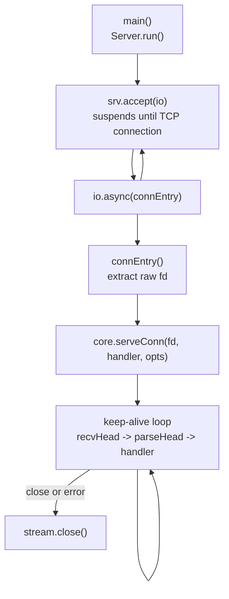
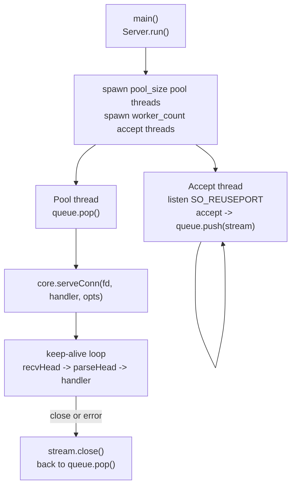
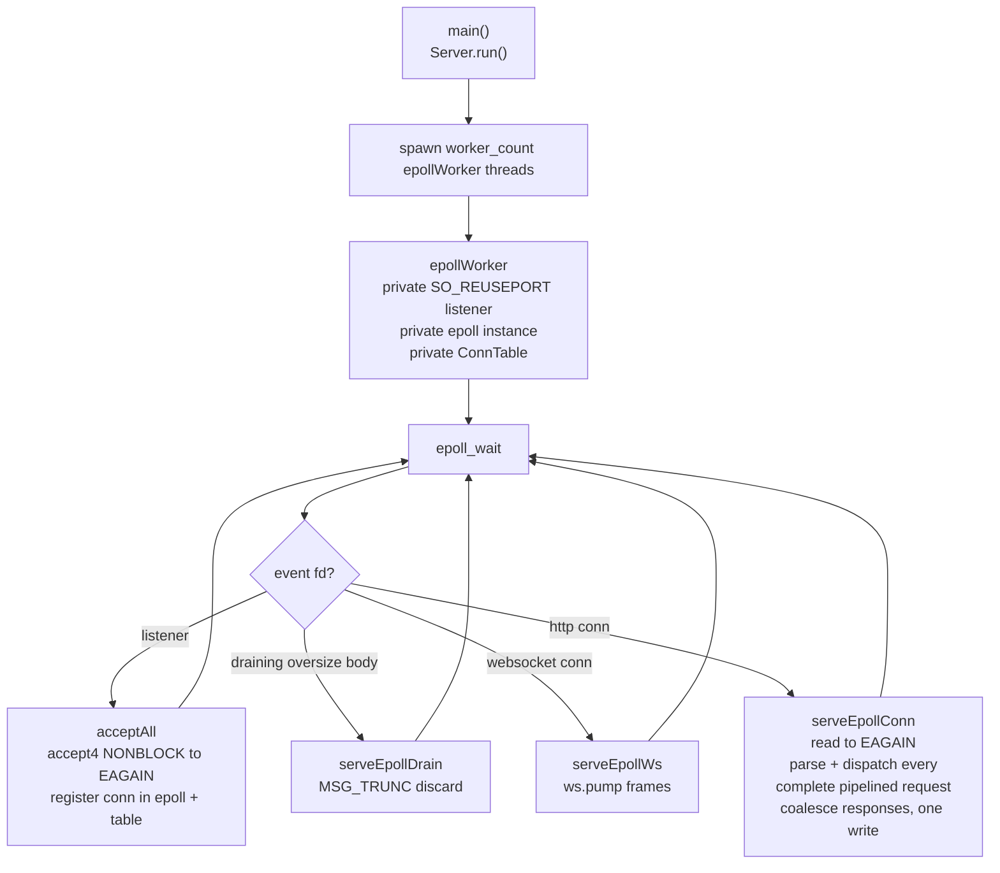
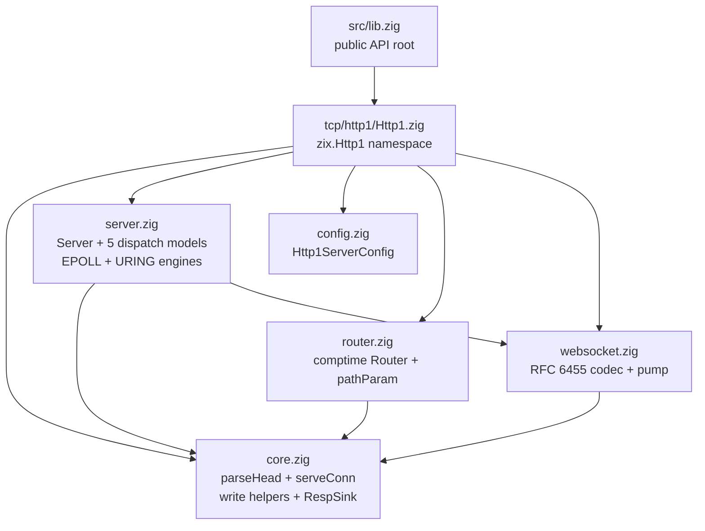
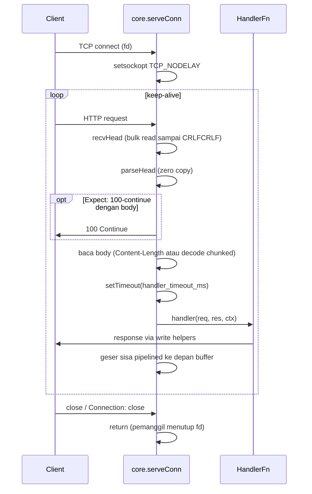
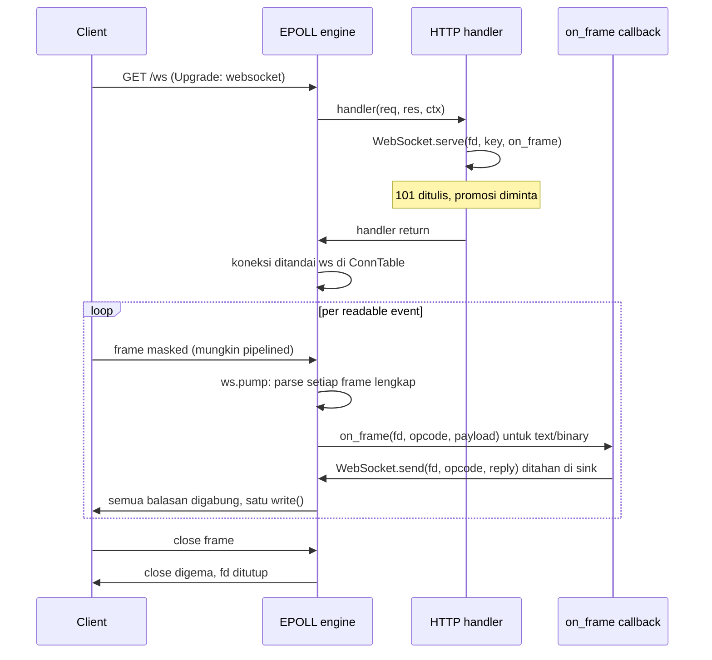

# HLD: zix.Http1

Engine server HTTP/1.x ramping di atas raw fd I/O. Parsing request dan penulisan response tanpa alokasi pada buffer milik pemanggil, tanpa dependensi `std.http`.

---

## Tujuan

- Nol alokasi heap pada hot path: parse dan write beroperasi pada buffer stack atau buffer yang dialokasikan di muka.
- Trio handler (`Request`, `Response`, `Context`) dibangun per request dari view murah di stack atas buffer itu: `Response` mendelegasikan ke write helper fd langsung, jadi ergonomi tidak mengubah wire (ADR-062).
- Comptime untuk semuanya: handler dibakukan ke dalam tipe server, tabel route dipartisi saat kompilasi.
- Raw `std.posix` I/O pada jalur data: `std.Io` hanya dipakai untuk plumbing listen/accept.
- Permukaan API minimal: satu signature handler, sekumpulan kecil write helper, dan router comptime yang opsional.

---

## Posisi: zix.Http1 vs zix.Http

Keduanya server HTTP/1.1. `zix.Http` adalah lapisan berfitur lengkap, `zix.Http1` adalah engine ramping.

| Aspek | `zix.Http` | `zix.Http1` |
| :- | :- | :- |
| Signature handler | `fn(*Request, *Response, *Context) anyerror!void` | `fn(*Request, *Response, *Context) anyerror!void` (trio yang sama, ADR-062) |
| Parsing request | parser milik sendiri (`parser.zig`) | `parseHead` zero-copy milik sendiri (salinan `parser.zig`) |
| Body request | baca socket lazy di `body()` | slice yang diantar engine (di-drain + di-dechunk sebelum invoke) |
| Allocator per-request | arena per-connection | arena per-request (`ctx.allocator`, di-reset per dispatch) |
| Penulisan response | objek `Response` ter-buffer | builder `Response` yang mendelegasikan ke write helper fd langsung |
| Static files / multipart / SSE writer | built in | fallback static `public_dir`, `Multipart` bersama, `SseWriter` |
| Routing | tabel route comptime | tabel route comptime (opsional, handler boleh polos) |
| WebSocket | frame loop milik handler | frame pump milik engine (.EPOLL / .URING) |
| Model dispatch | ASYNC, POOL, MIXED, EPOLL, URING | ASYNC, POOL, MIXED, EPOLL, URING |

Permukaan trio identik bagi caller di kedua engine (test paritas compile-time di `src/lib.zig` menegakkannya). Pakai `zix.Http` saat handler membutuhkan lapisan client-facing yang lebih kaya. Pakai `zix.Http1` saat raw throughput dan biaya per-request yang terprediksi lebih penting: trio hanyalah view plus reset arena, dan escape hatch (`ctx.fd` plus write helper `*FD`) menjaga jalur raw tetap terbuka.

---

## Model Runtime

Lima model dispatch, dipilih melalui `config.dispatch_model` (enum `DispatchModel`). Wajib: pemanggil harus menyetelnya secara eksplisit (tidak ada default).

### .ASYNC: Accept Tunggal, Dispatch io.async()



- Satu accept thread, setiap koneksi di-dispatch sebagai task konkuren melalui `io.async()`.
- `workers` dan `pool_size` diabaikan.

### .POOL: Work-Queue Thread Pool



- Accept thread hanya mendorong stream hasil accept ke `ConnQueue` (ring buffer) yang dipakai bersama.
- Pool thread mengambil dan melayani setiap koneksi secara sinkron.
- Default: cpu_count accept thread, `max(10, cpu_count * 2)` pool thread.

### .MIXED: N Accept Thread, Dispatch io.async()

- N accept thread (default cpu_count, `SO_REUSEPORT`), masing-masing men-dispatch koneksi langsung melalui `io.async()`, tanpa `ConnQueue`.
- `pool_size` diabaikan. `workers` mengontrol jumlah accept thread.

### .EPOLL: Event Loop Shared-Nothing (khusus Linux)



- Setiap worker memiliki listener pribadi, instance epoll pribadi, dan connection table pribadi. Kernel menyeimbangkan koneksi baru di antara listener per-worker (`SO_REUSEPORT`), sehingga tidak ada accept thread, tidak ada queue bersama, dan tidak ada perpindahan fd antar thread.
- Request pipelined yang tiba dalam satu readable event semuanya di-parse dan di-dispatch dalam satu pass, dan response-nya digabung menjadi satu `write()` melalui response sink per-event.
- Pada target non-Linux `.EPOLL` jatuh kembali ke `.POOL` dengan notice yang dicatat di log.
- Ini satu-satunya model yang menghormati promosi WebSocket milik engine (lihat bagian WebSocket).

### .URING: Event Loop io_uring Shared-Nothing (khusus Linux)

`zix.Http1` adalah engine referensi untuk jalur io_uring (ADR-037). Topologi shared-nothing, thread-per-core yang sama dengan `.EPOLL` (listener `SO_REUSEPORT` pribadi dan satu ring per worker), tetapi completion-based: accept, recv, send, dan close disubmit sebagai SQE dan dipanen sebagai CQE, sehingga sebagian besar transisi syscall di-batch ke dalam ring. Pump WebSocket juga berjalan native di ring (BufferGroup). Di non-Linux melipat ke `.POOL`. Di loopback setara `.EPOLL` pada throughput dan menang terutama pada cache locality per-request.

Teardown juga me-ring close-nya (`prep_close`, ADR-041) alih-alih `linux.close` sinkron, jadi worker terus memanen completion lintas teardown koneksi. Di mesin 64-core inilah pembedanya di bawah connection churn: dengan close sinkron ring nyaris tidak mengaktifkan core-nya di bawah reconnect storm, dengan ring close ia mengisinya dan mencapai paritas atau lebih baik di setiap cell dengan memori jauh lebih sedikit. `OpKind` io_uring bersama dan helper ring berada di `src/multiplexers/ring.zig`. Lihat ADR-041 untuk pengukurannya.

---

## Struktur Berkas



---

## API Publik

Diakses melalui `const zix = @import("zix");`

| Simbol | Tipe | Deskripsi |
| :- | :- | :- |
| `zix.Http1.Server` | struct | `init(comptime handler, config)` mengembalikan server, lalu `run()` / `deinit()` (pintu tunggal, ADR-062) |
| `zix.Http1.ServerConfig` | struct | Konfigurasi server (lihat bagian Http1ServerConfig) |
| `zix.Http1.DispatchModel` | enum(u8) | `.ASYNC`(0) `.POOL`(1) `.MIXED`(2) `.EPOLL`(3, native hanya di Linux) `.URING`(4, native hanya di Linux) |
| `zix.Http1.HandlerFn` | type | `*const fn(req: *Request, res: *Response, ctx: *Context) anyerror!void` (trio, ADR-062) |
| `zix.Http1.Request` | struct | View request zero-copy: `method()`, `path()`, `query()`, `queryParam`, `header`, `pathParam`, `body()`, `keepAlive`, `pathSegments`, `queryParams`, `fromRaw` |
| `zix.Http1.Response` | struct | Builder response di atas writer fd: `setStatus`, `setContentType`, `setKeepAlive`, `addHeader`, `send`, `sendJson`, `sendText`, `sendRaw`, `sendNoContent`, `sendFromCache`, `sendCached`, `sendNegotiated`, `sendStream`, plus flag `sent` |
| `zix.Http1.Context` | struct | io, arena allocator per-request, escape hatch fd, `withDeadline` |
| `zix.Http1.Method` / `Status` / `Content` / `ContentType` | namespace | Permukaan trio bertipe (`setStatus(Status.Code)`, `setContentType(Content.Type)`, `req.method()` mengembalikan `Method.Code`), identik di kedua engine |
| `zix.Http1.Header` / `HeaderSize` | struct / enum | Entri `addHeader` dan kelas kapasitasnya (`max_response_headers`) |
| `zix.Http1.Multipart` / `MultipartField` | struct | Parser multipart bersama |
| `zix.Http1.SseWriter` | struct | Writer event SSE yang dikembalikan `res.sendStream()` |
| `zix.Http1.ParsedHead` | struct | Head request hasil parse zero-copy (method, path, query, raw_headers, flags, span accept_encoding) |
| `zix.Http1.Range` | struct | `{ start: u64, end: u64 }` dari `parseRange` |
| `zix.Http1.ServeOpts` | struct | Opsi `serveConn`: `nodelay`, `handler_timeout_ms` |
| `zix.Http1.ConnOutcome` | enum | `.keep_alive` atau `.close` (hasil one-shot EPOLL) |
| `zix.Http1.Route` | struct | `{ path, handler, kind = .EXACT }` |
| `zix.Http1.RouteKind` | enum(u8) | `.EXACT` `.PREFIX` `.PARAM` |
| `zix.Http1.Router` | fn | `Router(comptime routes) type`, mengekspos `dispatch` yang dapat dipakai sebagai HandlerFn |
| `zix.Http1.PathParam` | struct | Satu `:param` yang tertangkap (name, value) |
| `zix.Http1.pathParam` | fn | Mencari param yang tertangkap dari dalam handler |
| `zix.Http1.WebSocket` | namespace | Codec RFC 6455: `parseFrame` / `buildFrame` / `acceptKey` / `upgrade` / `send` / `serve` / `pump` |
| `zix.Http1.WsFrameFn` | type | Callback per-frame untuk WebSocket milik engine |
| `zix.Http1.setTimeout` | fn | Memasang atau memperpendek deadline per-handler (thread-local) |
| `zix.Http1.isExpired` | fn | Apakah deadline handler saat ini sudah lewat |
| `zix.Http1.parseHead` | fn | Parse head request lengkap dari buffer (zero copy) |
| `zix.Http1.getHeader` | fn | Pencarian header case-insensitive pada ParsedHead |
| `zix.Http1.acceptEncoding` | fn | Nilai Accept-Encoding sebuah ParsedHead: O(1) dari span parse-pass, fallback getHeader selain itu |
| `zix.Http1.setCache` | fn | Memasang atau melepas response cache per-worker |
| `zix.Http1.setExternalHandler` | fn | Mendaftarkan callback per-worker untuk readability fd eksternal (socket driver `.URING`) |
| `zix.Http1.uringWatchFd` | fn | Memasang watch readable multishot untuk fd asing di ring milik worker |
| `zix.Http1.queryParam` | fn | Pemindaian linear satu query parameter berdasarkan nama persis |
| `zix.Http1.percentDecode` | fn | Percent-decode buffer secara in place |
| `zix.Http1.parseRange` | fn | Parse `bytes=start-end` menjadi `Range` |
| `zix.Http1.writeAllFD` | fn | Menulis semua byte ke fd (sadar sink, menangani EINTR/EAGAIN) |
| `zix.Http1.responseReserve` | fn | Reserve region render di tempat pada response sink (byte body ditulis sekali) |
| `zix.Http1.responseCommit` | fn | Menyegel render hasil reserve, engine membangun header sederhana di depan body |
| `zix.Http1.flushPending` | fn | Flush byte response yang masih tertahan sebelum raw fd write (urutan pipelining) |
| `zix.Http1.beginStream` | fn | Memulai response streaming (SSE), melepas sink jadi write flush per event (cleartext + TLS) |
| `zix.Http1.sendSimpleFD` | fn | Response lengkap dengan body Content-Length |
| `zix.Http1.sendSimpleNoBodyFD` | fn | Response headers saja (method HEAD) |
| `zix.Http1.sendJsonFD` | fn | Singkatan `sendSimpleFD` dengan `application/json` |
| `zix.Http1.sendGzipFD` | fn | Response terkompresi gzip (`flate_fast` in-tree untuk body di bawah 64 KiB, `std.compress.flate` di atasnya) |
| `zix.Http1.sendChunkedStartFD` | fn | Memulai response `Transfer-Encoding: chunked` |
| `zix.Http1.sendChunkFD` | fn | Menulis satu chunk |
| `zix.Http1.sendChunkedEndFD` | fn | Mengakhiri body chunked |
| `zix.Http1.sendRangeFD` | fn | 206 Partial Content atau 416 berdasarkan nilai header Range |
| `zix.Http1.send100ContinueFD` | fn | Mengirim `100 Continue` sebelum membaca body besar |

---

## Http1ServerConfig

```zig
pub const Http1ServerConfig = struct {
    io:                 std.Io,                // dari process.io, hanya plumbing listen/accept
    ip:                 []const u8,
    port:               u16,                   // harus non-zero
    dispatch_model:     DispatchModel,
    kernel_backlog:     u31   = 1024,          // backlog listen() TCP
    max_recv_buf:       usize = 6 * 1024,      // buffer per-connection (.EPOLL / .URING, lihat catatan)
    large_body_rcvbuf:  usize = 0,             // SO_RCVBUF khusus jalur body besar (upload), 0 = default kernel
    ws_recv_buf:        usize = 0,             // buffer WebSocket (.EPOLL recv, .URING frame-accumulation), 0 = max_recv_buf
    compress:             bool  = false,        // enable negosiasi gzip / deflate / brotli, opt-in via res.sendNegotiated / core.sendNegotiateFD (.EPOLL/.URING)
    compression_min_size: usize = 256,           // lewati body di bawah floor ini
    compression_max_out:  usize = 256 * 1024,    // cap output terkompresi codec-agnostic, dulu max_gzip_out
    max_response_headers: HeaderSize = .MINIMAL, // kelas kapasitas addHeader (ADR-062)
    conn_timeout_ms:    u32   = 0,             // masa hidup koneksi, hanya .ASYNC/.POOL/.MIXED (no-op di .EPOLL/.URING)
    workers:            usize = 0,             // 0 = cpu_count accept thread, diabaikan .ASYNC
    pool_size:          usize = 0,             // 0 = max(10, cpu_count * 2), .POOL saja
    handler_timeout_ms: u32   = 0,             // budget per-handler, 0 = nonaktif
    send_date_header:   bool  = true,          // kirim header Date, false hemat 37 byte/response
    tls:                ?*Tls.Context = null,  // non-null menyajikan HTTP/1.1 di atas TLS (native https), selain itu cleartext
    logger:             ?*Logger = null,       // baris lifecycle saja, lihat bagian Logging
};
```

Listing di atas diringkas: referensi field lengkap (cache, tuning uring, dual listener TLS, steering) ada di [`docs/zix-config-id.md`](zix-config-id.md).

Catatan: pada `.ASYNC` / `.POOL` / `.MIXED` loop koneksi memakai buffer stack berukuran tetap (`core.BUF_SIZE` = 16 KB untuk header, 8 KB untuk body). `max_recv_buf` menentukan ukuran buffer per-connection pada `.EPOLL` dan `.URING`. `large_body_rcvbuf` menyetel `SO_RCVBUF` hanya pada jalur body besar (upload), membiarkan cell request kecil pada default kernel. `tls` opt-in ke native https: saat non-null server menyajikan HTTP/1.1 di atas TLS pada jalur ter-gate, selain itu cleartext. Field `compress`, `compression_min_size`, dan `compression_max_out` (yang terakhir di-rename dari `max_gzip_out`) dibaca saat runtime pada `.EPOLL` dan `.URING`: handler opt-in dengan `res.sendNegotiated` (atau `core.sendNegotiateFD` di jalur raw). Helper `core.sendGzipFD` memakai konstanta compile-time `core.GZIP_OUT_SIZE`.

Catatan: `ws_recv_buf` menentukan ukuran buffer per-connection WebSocket. Pada `.EPOLL` menentukan ukuran buffer recv; pada `.URING` menentukan ukuran buffer frame-accumulation (`conn.buf`) dan scratch unmask, independen dari `max_recv_buf` request yang kecil. `0` jatuh ke `max_recv_buf`. Set lebih besar dari `max_recv_buf` untuk memberi koneksi WebSocket ruang lebih mengakumulasi burst pipelined yang dalam sebelum engine compact dan re-read saat fill.

Catatan: `send_date_header` default `true` untuk kepatuhan RFC 7231. Set `false` pada jalur panas di mana klien tidak mengonsumsi `Date` untuk membuang header (37 byte per response). Write helper terkelola menghormati flag ini.

### Timeout

`zix.Http1` mengekspos satu timeout, `handler_timeout_ms`, budget eksekusi per-handler. Saat non-zero, server memasang deadline thread-local sebelum setiap dispatch. Handler ikut serta dengan memanggil `zix.Http1.isExpired()` di antara langkah mahal dan merespons lebih awal, atau memperpendek budget-nya sendiri dengan `zix.Http1.setTimeout()`. Ini budget Layer B yang sama dengan `handler_timeout_ms` milik `zix.Http`.

`conn_timeout_ms` (ADR-062) adalah guard masa hidup koneksi, port dari Layer D milik `zix.Http`: `ConnRegistry` plus background timer thread menutup koneksi yang melebihi masa hidup terkonfigurasi. Aktif pada model blocking (`.ASYNC`, `.POOL`, `.MIXED`), tempat koneksi lambat atau idle menahan thread atau task. Pada `.EPOLL` dan `.URING` ia no-op terdokumentasi: event loop-nya memiliki umur koneksi, dan koneksi keep-alive idle tidak menahan thread, hanya satu slot dan buffernya.

| Timeout | `zix.Http` | `zix.Http1` | Mekanisme |
| :- | :- | :- | :- |
| `handler_timeout_ms` | ya | ya | deadline thread-local dipasang per dispatch, opt-in handler |
| `conn_timeout_ms` | ya | ya (`.ASYNC` / `.POOL` / `.MIXED`) | `ConnRegistry` + background timer thread |

Jika penegakan masa hidup koneksi pada `.EPOLL` / `.URING` suatu saat dibutuhkan, yang paling cocok adalah sweep idle-deadline atas tabel per-worker (tanpa thread tambahan), bukan `ConnRegistry` timer-thread.

---

## Model Handler

```zig
fn home(req: *zix.Http1.Request, res: *zix.Http1.Response, ctx: *zix.Http1.Context) anyerror!void {
    _ = ctx;

    if (req.queryParam("name")) |name| {
        _ = name; // slice ke receive buffer, hanya valid selama pemanggilan ini
    }

    res.setContentType(.TEXT_PLAIN);

    try res.send("hello");
}

var server = zix.Http1.Server.init(home, .{
    .io = process.io,
    .ip = "0.0.0.0",
    .port = 8080,
    .dispatch_model = .EPOLL,
});
try server.run();
```

- Handler adalah argumen comptime: dibakukan ke dalam tipe server, tidak ada registrasi dinamis setelah init.
- Trio dibangun per request oleh `core.invokeHandler`: `Request` adalah view zero-copy (semua slice menunjuk ke receive buffer, hanya valid selama pemanggilan), `Response` mendelegasikan ke write helper fd secara byte-identik, `Context` membawa io, arena per-request, dan escape hatch fd.
- Handler yang error dilengkapi engine dengan satu 500, hanya bila belum ada yang terkirim (`Response.sent`). Idiom rumahnya `try res.foo(...)`, tidak pernah `return res.foo(...)`.
- Handler boleh berupa fungsi polos, `Router(routes).dispatch`, atau rantai wrapper comptime (idiom middleware, lihat `examples/http1_middleware.zig`).

### ParsedHead

| Field | Tipe | Catatan |
| :- | :- | :- |
| `method` | `[]const u8` | Verb apa adanya (`"GET"`, `"POST"`, ...) |
| `path` | `[]const u8` | Target tanpa query string |
| `query` | `[]const u8` | Query string mentah setelah `?`, `""` jika tidak ada |
| `raw_headers` | `[]const u8` | Blok header mentah, dipindai sesuai kebutuhan via `getHeader` (tanpa batas jumlah) |
| `version_minor` | `u8` | 1 untuk HTTP/1.1, 0 untuk HTTP/1.0 |
| `keep_alive` | `bool` | Default berdasarkan versi, ditimpa header `Connection` |
| `content_length` | `u64` | 0 saat tidak ada atau tidak bisa di-parse |
| `chunked_request` | `bool` | Ada `Transfer-Encoding: chunked` |
| `expect_continue` | `bool` | Ada `Expect: 100-continue` |
| `accept_encoding` | `HeaderSpan` | Span nilai Accept-Encoding yang ditangkap parse pass, dibaca via `acceptEncoding()` |

---

## Siklus Hidup Koneksi (.ASYNC / .POOL / .MIXED)



Response error yang ditulis engine sendiri: `431` saat blok header melebihi receive buffer, `400` saat `parseHead` gagal. Keduanya menutup koneksi. Router (bila dipakai) menulis `404` untuk path yang tidak cocok.

---

## Router

### Registrasi: tabel route comptime

```zig
const Routes = zix.Http1.Router(&[_]zix.Http1.Route{
    .{ .path = "/",          .handler = home },
    .{ .path = "/api",       .handler = api,  .kind = .PREFIX },
    .{ .path = "/users/:id", .handler = user, .kind = .PARAM },
});

var server = zix.Http1.Server.init(Routes.dispatch, .{ .io = process.io, .ip = "0.0.0.0", .port = 8080 });
```

| `kind` | Contoh pattern | Perilaku |
| :- | :- | :- |
| `.EXACT` (default) | `"/about"` | Cocok hanya jika path penuh sama dengan `path` |
| `.PREFIX` | `"/api"` | Cocok dengan `path` dan sub-path apa pun pada batas `/` |
| `.PARAM` | `"/users/:id"` | Segmen `:name` ditangkap, literal harus cocok persis |

### Dispatch: aturan prioritas

```
Pass 1: exact routes   StaticStringMap comptime O(1)     (urutan registrasi tidak berpengaruh)
Pass 2: param routes   pattern pertama yang cocok menang  (urutan registrasi berpengaruh)
Pass 3: prefix routes  prefix terpanjang yang cocok menang (urutan registrasi tidak berpengaruh)

exact > param > prefix (prefix lebih panjang mengalahkan yang lebih pendek)
```

Route dipartisi berdasarkan kind saat kompilasi: path exact masuk `StaticStringMap`, route param dan prefix masuk array comptime yang ditelusuri dengan `inline for`. Path yang tidak cocok mendapat `404 text/plain` dari `dispatch` sendiri.

### Path params

`pathParam("id")` di dalam handler mengembalikan segmen yang tertangkap. Hasil tangkapan hidup di penyimpanan thread-local (maksimum 8 per route) dan hanya valid selama pemanggilan dispatch, sama dengan masa hidup slice request.

---

## Budget Handler: setTimeout / isExpired

Saat `config.handler_timeout_ms > 0` engine memasang deadline thread-local sebelum setiap dispatch. Handler ikut serta dengan memanggil `zix.Http1.isExpired()` di antara langkah-langkah yang mahal:

```zig
fn slow(req: *zix.Http1.Request, res: *zix.Http1.Response, ctx: *zix.Http1.Context) anyerror!void {
    _ = req;
    _ = ctx;

    doStep1();
    if (zix.Http1.isExpired()) {
        res.setStatus(.REQUEST_TIMEOUT);
        try res.sendJson("{\"error\":\"timeout\"}");
        return;
    }

    doStep2();

    try res.sendJson("{\"result\":\"ok\"}");
}
```

- `isExpired()` selalu aman dipanggil: mengembalikan `false` saat tidak ada deadline terpasang. Pengecekannya satu `clock_gettime` plus satu perbandingan.
- `setTimeout(ms)` memasang ulang deadline untuk handler saat ini (memperpendek atau memperpanjang), `setTimeout(0)` menghapusnya, dan `ctx.withDeadline` adalah pembungkus sisi trio.
- Deadline bersifat thread-local, mengikuti model eksekusi satu-request-per-worker.

---

## WebSocket: Koneksi Milik Engine

`zix.Http1.WebSocket` adalah codec RFC 6455 plus model koneksi milik engine. Handler menyelesaikan handshake dan mendaftarkan callback per-frame, lalu return. Engine menggerakkan frame loop dari event loop-nya, sehingga tidak pernah ada worker yang terparkir pada satu koneksi.



- `WebSocket.serve(fd, key, on_frame)` menghitung accept key, menulis `101 Switching Protocols`, dan meminta promosi melalui slot handoff thread-local yang dibaca engine tepat setelah handler return.
- Ping otomatis dibalas pong dan close otomatis digema oleh engine. Callback hanya pernah menerima frame text dan binary.
- Frame yang dikirim dalam satu pass pump digabung menjadi satu `write()`.
- Promosi hanya dihormati pada `.EPOLL`. Pada `.ASYNC` / `.POOL` / `.MIXED` handoff dibersihkan dan koneksi berakhir setelah handler return (pakai `zix.Http` untuk loop WebSocket milik handler pada model-model itu).
- Melalui TLS (`config.tls`, jalur thread-per-koneksi), panggil `WebSocket.serveTls(fd, key, on_frame)` (ADR-055): `101` dan tiap frame dienkripsi lewat ADR-054 stream sink, dan thread https menjalankan frame loop inline atas TLS session. Rooms / broadcast hanya cleartext (enkripsi per-session), jadi wss bersifat per-koneksi.

Lihat `examples/http1_websocket.zig` (cleartext) dan `examples/tls/tls_http1_ws.zig` (wss).

---

## Logging

`config.logger` hanya menerima baris lifecycle server (notice listening, fallback EPOLL). Saat null, baris lifecycle dicetak ke stderr hanya pada Debug build dan diam pada release build (server release tanpa logger tidak mengeluarkan output lifecycle).

Access logging per-request adalah tanggung jawab handler: handler Http1 menulis langsung ke fd dan mengembalikan `void`, sehingga engine tidak dapat mengamati status response atau jumlah byte. Panggil `logger.access()` di dalam handler di titik status akhir dan ukurannya diketahui.

---

## Model Memori

| Lingkup | Penyimpanan | Masa hidup |
| :- | :- | :- |
| Tabel route | comptime (nol biaya heap) | Proses |
| Buffer receive + body (.ASYNC/.POOL/.MIXED) | stack thread/task yang melayani (16 KB + 8 KB) | Koneksi |
| Buffer per-connection (.EPOLL) | slab per-worker, slot kompak page-aligned, `max_recv_buf` byte terpakai | Koneksi |
| Buffer recv + send per-connection (.URING) | slab stride mmap per-worker, slot kompak, THP di-opt-out | Koneksi |
| Staging body + output (.EPOLL) | `smp_allocator`, per worker | Worker thread |
| Scratch kompresi (gzip / negotiate) | satu blok mmap lazy per-worker, dipakai ulang antar pemanggilan | Worker thread |
| Arena per-request (`ctx.allocator`) | per worker (event loop) atau per koneksi (model blocking), di-reset per dispatch | Request |
| Alokasi handler | `ctx.allocator` (arena), atau bawa sendiri | Request |

---

## Batasan yang Diketahui

| Batas | Perilaku |
| :- | :- |
| Ukuran blok header | Maksimum 16 KB (`core.BUF_SIZE`, atau `max_recv_buf` pada .EPOLL). Melebihi mengembalikan `431` dan menutup |
| Body pada .ASYNC/.POOL/.MIXED | Handler melihat sampai 8 KB (`ASYNC_BODY_CHUNK`). Body Content-Length yang lebih besar sisanya dibuang dari socket agar koneksi keep-alive tetap dapat dipakai (handler membaca `head.content_length`, bukan byte-nya) |
| Body pada .EPOLL / .URING | Harus muat di `max_recv_buf` dikurangi head. Body yang lebih besar menjaga koneksi tetap dapat dipakai dengan membuang sisanya dari socket (`MSG_TRUNC`): `.EPOLL` men-dispatch handler lebih dulu dengan slice body kosong, `.URING` men-drain dan menghitung lebih dulu, lalu handler berjalan dengan total terhitung di `req.bodyReceived()` |
| Body request besar (upload) | Drain melebarkan receive window via `large_body_rcvbuf` (SO_RCVBUF), lihat [`docs/zix-config-id.md`](zix-config-id.md) |
| Body request chunked | Di-decode ke body buffer, kelebihan dibuang |
| Versi HTTP | Hanya HTTP/1.0 dan HTTP/1.1, selain itu `400` |
| TLS | https/1.1 native (TLS 1.3 + 1.2), opt-in via `config.tls`, pada perf band-nya sendiri. `.ASYNC` / `.POOL` / `.MIXED` melakukan terminasi per koneksi di worker thread, `.EPOLL` / `.URING` di worker epoll-mux event-driven. Lihat [`docs/hld-tls-id.md`](hld-tls-id.md) |

Endpoint yang menerima upload besar membaca `req.bodyReceived()` pada `.URING` (byte yang dibuang dihitung, tidak di-buffer). Model lain tidak membawa hitungan itu, jadi di sana tetap mengandalkan `head.content_length`.

Untuk lapisan HTTP berfitur lengkap lihat [`docs/hld-http-id.md`](hld-http-id.md). Untuk detail implementasi lihat [`docs/lld-http1-id.md`](lld-http1-id.md).

---

###### end of hld-http1
