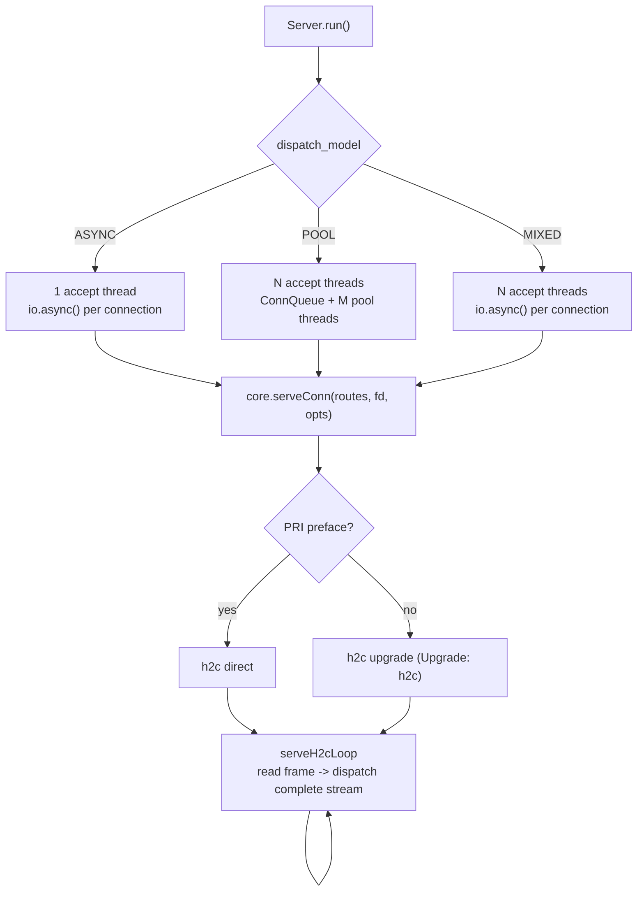
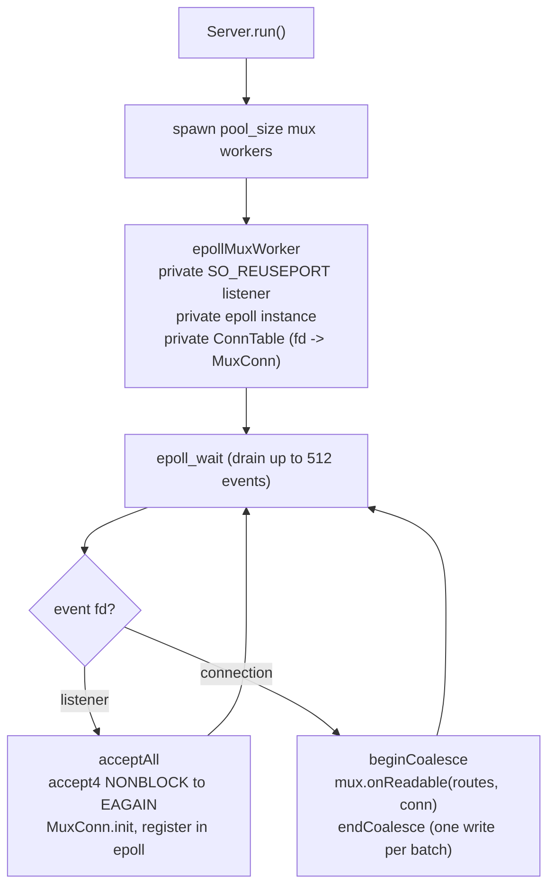
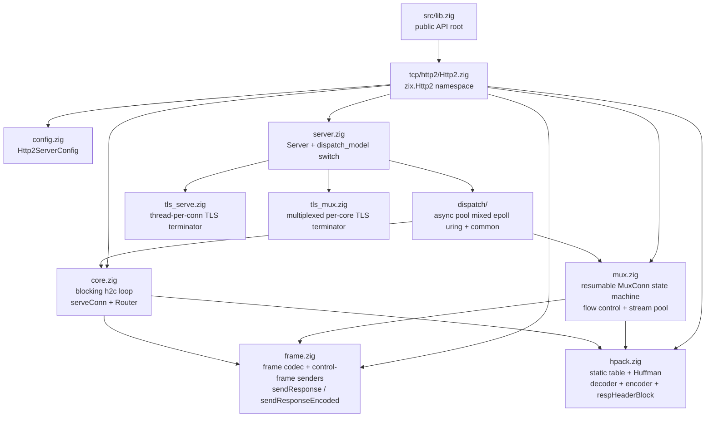
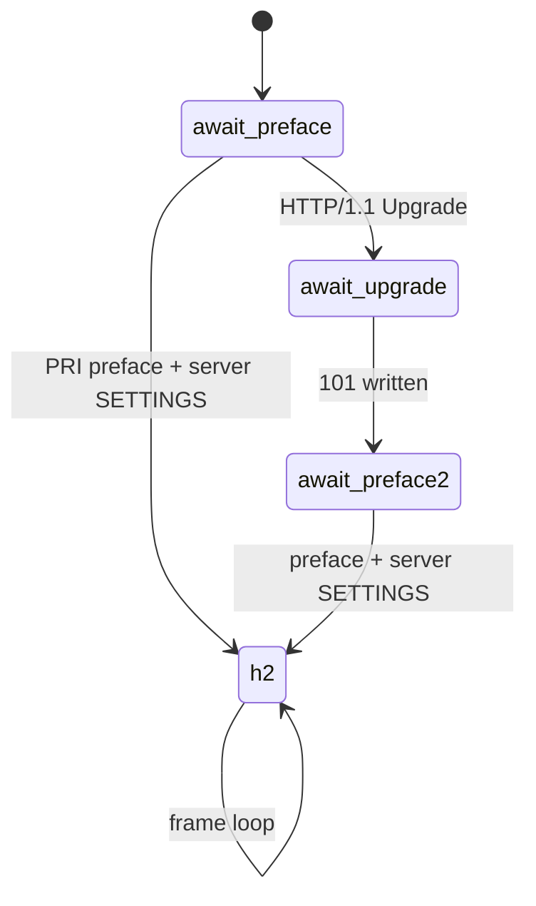

# HLD: zix.Http2

Pure-Zig HTTP/2 (h2c) server engine: frame codec, HPACK, and a resumable multiplexed state machine on raw fd I/O, no `std.http` in the frame path.

---

## Goals

- Pure-Zig h2c: frame codec plus HPACK (static table, dynamic table, Huffman) with no C FFI and no `std.http` in the frame path.
- One handler per completed stream: the handler receives the method, decoded headers, body slice, fd, and stream id, and writes frames straight to the fd.
- Multiplexed by construction: the `.EPOLL` / `.URING` models drive many connections and many concurrent streams from one worker thread through a resumable state machine, with no thread per stream.
- Comptime route table baked into the server type, zero heap for routing.
- Raw `std.posix` I/O on the data path: `std.Io` is used only for listen/accept plumbing.
- Native TLS (ALPN h2) additive over the h2c default, so cleartext dispatch is untouched.

---

## Positioning: zix.Http2 vs zix.Http1 vs zix.Grpc

All three are raw-fd engines with the same five dispatch models and a comptime route table. They differ in protocol and handler shape.

| Aspect | `zix.Http1` | `zix.Http2` | `zix.Grpc` |
| :- | :- | :- | :- |
| Protocol | HTTP/1.1 | HTTP/2 h2c | gRPC over HTTP/2 h2c |
| Handler signature | `fn(head, body, fd)` | `fn(method, headers, body, fd, sid)` | `fn(headers, *Context)` |
| Concurrency per connection | one request at a time (pipelined) | many concurrent streams | many concurrent streams |
| Header codec | raw text parse | HPACK | HPACK |
| Per-request allocator / context | none | none | `GrpcContext` (recv / send / finish) |
| Streaming responses | chunked / SSE helpers | flow-controlled DATA (`sendResponseStream`) | `ctx.sendMessage` |
| Layer relationship | standalone | standalone | builds on `zix.Http2` |

Use `zix.Http2` for browser-grade or prior-knowledge HTTP/2 with raw frame control. Use `zix.Grpc` when the payload is gRPC (it reuses this engine's frame and HPACK layers). Use `zix.Http1` when one request per connection is enough.

---

## Runtime Model

Five dispatch models, selected via `config.dispatch_model` (`DispatchModel` enum). Required: the caller must set it explicitly (no default).

### .ASYNC / .POOL / .MIXED: Thread-per-connection over the blocking core

These three share `core.serveConn`: one thread (or `io.async` task) owns a connection for its whole lifetime and runs the blocking h2c loop (`serveH2cLoop`), reading one frame at a time and dispatching each completed stream inline. They differ only in how connections are accepted and handed to a serving thread, the same split as `zix.Http1`.



- `.ASYNC`: one accept thread, each connection dispatched as a concurrent `io.async` task. `workers` and `pool_size` are ignored.
- `.POOL`: `workers` accept threads push accepted streams into a shared `ConnQueue`, `pool_size` pool threads pop and serve each connection synchronously.
- `.MIXED`: `workers` accept threads (`SO_REUSEPORT`) each dispatch via `io.async` directly, no `ConnQueue`. `pool_size` is ignored.

### .EPOLL: Shared-Nothing Multiplexed Event Loop (Linux only)



- Each worker owns a private listener, epoll instance, and fd-indexed `ConnTable`. The kernel load-balances new connections across the per-worker `SO_REUSEPORT` listeners, so there is no accept thread, no shared queue, and no cross-thread fd handoff.
- One worker drives many non-blocking connections through the resumable h2 state machine in `mux.zig`, one `MuxConn` per fd, so concurrency is bounded by connection count, not thread count.
- Every frame a readable batch writes (HEADERS plus DATA per stream, times the streams in the batch) coalesces into a single `write()` through a per-worker sink (`beginCoalesce` / `endCoalesce`), instead of one write per frame.
- `pool_size` is the mux worker count (0 = cpu count). A handler runs inline on the worker, so it must stay bounded: a long handler blocks that worker's other connections.
- On non-Linux targets `.EPOLL` falls back to `.POOL` with a logged notice.

### .URING: Shared-Nothing io_uring Event Loop (Linux only)

Same shared-nothing, one-listener-per-worker topology as `.EPOLL`, but completion-based: a multishot accept and one recv per connection are submitted as SQEs and reaped as CQEs (ADR-037 Phase 4). Each recv fills the connection's read accumulator, then `mux.processRing` drives the same resumable state machine. The handler still writes its reply straight to the (non-blocking) fd, batched by the same coalescing sink.

`.URING` probes io_uring once at startup (`initUringRing`). When the ring is unavailable (an old kernel, a seccomp sandbox, or an `RLIMIT_MEMLOCK` cap too low for the ring), it folds to the `.EPOLL` shared-nothing loop, so selecting `.URING` never strands the server right after binding. Off Linux it folds to `.POOL`.

---

## Source Layout



---

## Public API

Access via `const zix = @import("zix");`

| Symbol | Type | Description |
| :- | :- | :- |
| `zix.Http2.Server` | struct | `init(comptime routes, config)`, then `run()` / `deinit()` |
| `zix.Http2.ServerConfig` | struct | Server configuration (see Http2ServerConfig section) |
| `zix.Http2.DispatchModel` | enum(u8) | `.ASYNC`(0) `.POOL`(1) `.MIXED`(2) `.EPOLL`(3, Linux-only natively) `.URING`(4, Linux-only natively) |
| `zix.Http2.HandlerFn` | type | `*const fn(method: []const u8, headers: []const Header, body: []const u8, fd: std.posix.fd_t, sid: u31) void` |
| `zix.Http2.Route` | struct | `{ path, handler, kind = .EXACT }` |
| `zix.Http2.RouteKind` | enum(u8) | `.EXACT` `.PREFIX` |
| `zix.Http2.Router` | fn | `Router(comptime routes) type`, resolves a path to a handler (used by the engine) |
| `zix.Http2.ServeOpts` | struct | Per-connection serve options built from the config |
| `zix.Http2.serveConn` | fn | `serveConn(comptime routes, fd, opts)`: direct blocking connection entry point |
| `zix.Http2.Header` | struct | `{ name: []const u8, value: []const u8 }` decoded request header |
| `zix.Http2.sendResponse` | fn | `sendResponse(fd, sid, status, content_type, body)`: HEADERS plus DATA, END_STREAM on the last frame (immediate, unmetered) |
| `zix.Http2.sendResponseEncoded` | fn | `sendResponse` plus a `content-encoding` header (serve a precompressed body) |
| `zix.Http2.sendResponseStream` | fn | Flow-controlled send for a large, caller-owned body (paces by WINDOW_UPDATE, body must outlive the stream) |
| `zix.Http2.serveCached` / `sendCached` / `cacheTtl` | fn | Per-worker response cache (ADR-036), opt-in via `response_cache` (`.EPOLL` / `.URING`) |
| `zix.Http2.HpackEncoder` / `HpackDecoder` / `HpackEntry` | type | HPACK codec types |
| `zix.Http2.huffEncode` / `huffDecode` | fn | HPACK Huffman codec |
| `zix.Http2.respHeaderBlock` | fn | Encode a cached `[:status, content-type, content-encoding, content-length]` block |
| `zix.Http2.FrameHeader` + `parseFrameHeader` / `writeFrameHeader` / `encodeFrameHeader` / `readFrameHeader` | type / fn | Frame-header codec for custom framing |
| `zix.Http2.sendSettings` / `sendSettingsAck` / `sendPingAck` / `sendGoaway` / `sendRstStream` / `sendWindowUpdate` | fn | Control-frame senders |
| `zix.Http2.FRAME_TYPE_*` / `FLAG_*` / `ERR_*` / `SETTINGS_*` | const | RFC 7540 frame, flag, error, and settings constants |
| `zix.Http2.PREFACE` / `HPACK_STATIC` | const | Connection preface string, HPACK static table |

---

## Http2ServerConfig

Key fields (the full table is in [`docs/zix-config-en.md`](zix-config-en.md)):

```zig
pub const Http2ServerConfig = struct {
    io:             std.Io,        // listen/accept plumbing only, must outlive the server
    ip:             []const u8,
    port:           u16,           // must be non-zero
    dispatch_model: DispatchModel, // required, no default
    kernel_backlog: u31   = 1024,
    workers:        usize = 0,     // 0 = cpu_count accept threads, ignored by .ASYNC
    pool_size:      usize = 0,     // .POOL: 0 = max(10, cpu_count*2). .EPOLL/.URING: 0 = cpu_count workers
    worker_stack_size_bytes: usize = 512 * 1024,
    busy_poll_us:   u32   = 0,     // SO_BUSY_POLL spin window (.EPOLL/.URING), 0 = unset
    max_streams:    u32   = 128,   // advertised SETTINGS_MAX_CONCURRENT_STREAMS
    max_frame_size: u32   = 16384, // advertised SETTINGS_MAX_FRAME_SIZE
    max_header_scratch: usize = 4096,       // HPACK decode scratch per connection
    max_body:       usize = 16384, // max request body buffered per stream (truncated over this)
    max_recv_buf:   usize = 32 * 1024,      // per-connection read-buffer floor (.EPOLL/.URING)
    tls_write_buf_initial_bytes: usize = 16 * 1024,
    response_cache: bool  = false, // per-worker response cache (ADR-036), .EPOLL/.URING
    tls:            ?*Tls.Context = null,   // non-null serves h2 over TLS (ALPN h2), else h2c cleartext
    logger:         ?*Logger = null,        // lifecycle lines only, see Logging section
};
```

Note: `pool_size` is overloaded by model. Under `.POOL` it is the blocking pool-thread count. Under `.EPOLL` / `.URING` it is the mux worker count (0 = cpu count), and oversubscribing it only adds scheduler churn. `max_recv_buf` is a floor: the mux read accumulator is sized to the larger of it and one max frame, so a larger floor cuts `read()` and buffer compaction for big frames. `tls` opts into h2 over TLS: when non-null the server serves on a gated TLS path (the cleartext dispatch models are untouched), and for HTTP/2 the context's ALPN should include `.H2`. The `response_cache` and `cache_*` fields configure the opt-in per-worker cache (ADR-036), read at runtime under `.EPOLL` and `.URING`.

`zix.Http2` has no per-handler or per-connection timeout field. The handler owns its frame I/O and returns `void`, so a deadline would have no context object to hang on. `zix.Grpc`, which builds on this engine, adds `handler_timeout_ms` and a `GrpcContext` deadline for the gRPC handler model.

---

## Handler Model

```zig
fn home(
    method:  []const u8,
    headers: []const zix.Http2.Header,
    body:    []const u8,
    fd:      std.posix.fd_t,
    sid:     u31,
) void {
    _ = method;
    _ = headers;
    _ = body;

    zix.Http2.sendResponse(fd, sid, 200, "text/plain", "hello") catch {};
}

var server = zix.Http2.Server.init(
    &[_]zix.Http2.Route{
        .{ .path = "/", .handler = home },
    },
    .{ .io = process.io, .ip = "0.0.0.0", .port = 8082, .dispatch_model = .EPOLL },
);
defer server.deinit();
try server.run();
```

- Routes are a comptime argument to `Server.init`: they are baked into the server type, there is no dynamic registration after init.
- The handler is called once per completed stream (END_HEADERS plus END_STREAM). `method`, `headers`, and `body` all point into per-stream buffers and are valid only for the duration of the call.
- There is no per-request allocator or context object. The handler writes frames to the fd through the response helpers and returns `void`: errors are handled inline (typically `catch {}`, the connection closes on a broken pipe anyway).
- Responses go out through `frame.sendResponse` (small, immediate), `frame.sendResponseEncoded` (a precompressed body with `content-encoding`), or `mux.sendResponseStream` (a large, process-lifetime body paced by flow control).
- The engine resolves the path to a handler through the comptime `Router` before the call, so the handler does not parse or match the path itself.

---

## Multiplexed State Machine

The `.EPOLL` / `.URING` models drive `mux.zig`, one `MuxConn` per fd. The read accumulator (`rbuf`, tracked by `rstart` / `rend`) persists across readable events and holds a partial frame until the rest arrives, so a worker can resume a connection mid-frame and drive many connections from one thread.

A connection advances through preface phases, then a frame loop:



Inside the `.h2` phase the frame loop reads a 9-byte header, waits for the full payload to arrive in `rbuf` (returning `keep_alive` when it has not), then dispatches by type:

- SETTINGS: apply the peer's header-table size and initial window (adjusting every open stream's send window per RFC 7540 6.9.2), then ACK and grant a connection-level WINDOW_UPDATE.
- HEADERS / CONTINUATION: claim a stream slot, HPACK-decode the block into the stream's headers, and dispatch when END_HEADERS plus END_STREAM are seen.
- DATA: return WINDOW_UPDATE for the connection and stream, copy the payload into the stream body (capped by `max_body`), and dispatch on END_STREAM.
- WINDOW_UPDATE: grow the connection or stream send window and resume any parked response body.
- RST_STREAM: release the stream slot. PING: reply with an ACK. GOAWAY: close the connection.

A protocol violation (stream id 0 where illegal, an oversize frame, a bad preface) sends GOAWAY or RST_STREAM. The blocking `core.serveH2cLoop` runs the same protocol over blocking reads with a per-connection stream array instead of the pooled slots.

---

## HPACK

`hpack.zig` is a full HPACK codec with no external dependency.

- Request decoder: the 61-entry static table plus a dynamic table (up to 128 entries) backed by a connection-lifetime buffer (`dyn_buf`, 8 KB) with size-bounded eviction and in-place compaction. Indexed and literal values are copied into the caller's per-stream scratch, so decoded header slices stay stable even after the scratch is reused for the next stream. Huffman-coded strings are decoded on the fly.
- Response encoder: stateless (static table plus literal-without-indexing, never the dynamic table or a size update), so a given header block is byte-identical on every connection.
- `respHeaderBlock`: encodes `[:status, content-type, content-encoding, content-length]`. Because the encoder is stateless, the `[:status, content-type, content-encoding]` prefix is cached per distinct triple (an append-only, lock-free-read cache) and only the varying `content-length` is re-encoded per call, so a hot response path skips the repeated static-table scans and the Huffman encode of the same content-type.

---

## Flow Control

Send-side flow control follows RFC 7540 6.9. Each `MuxConn` carries a connection-level send window, and each open stream carries its own send window, both starting at 65535 (adjusted by the peer's advertised initial window).

- `pumpBody` sends DATA capped by `min(connection window, stream window, max_frame_size)`. What does not fit is parked on the stream (`pending_body`, `pending_end`) and the stream slot stays borrowed. END_STREAM rides the final frame only once the whole body has gone out.
- A WINDOW_UPDATE resumes parked work: `resumeStream` for a stream-level grant, `resumeAll` for a connection-level grant. The slot is freed once its body fully drains.
- `sendResponseStream(fd, sid, status, content_type, content_encoding, body)` is the public entry. The body is referenced, not copied, so it must outlive the stream (a process-lifetime cache, not a per-request scratch buffer). With no active connection context (the blocking non-mux serve paths) it falls back to an immediate, unmetered send.
- Inbound DATA returns a WINDOW_UPDATE for both the connection and the stream so the peer keeps sending.

---

## h2 over TLS

Setting `config.tls` (a `*Tls.Context`) opts into HTTP/2 over TLS (TLS 1.3 with a 1.2 fallback, ALPN h2). The `server.zig` `run()` switch picks one of two terminators by `dispatch_model`:

- `.EPOLL` / `.URING`: `tls_mux.runTlsMux`. One `SO_REUSEPORT` epoll worker per core terminates TLS in place via a resumable session (`tcp/tls/tls_session.zig`) and multiplexes many connections per worker, with no socketpair and no thread per connection. The resumable h2 mux consumes the decrypted plaintext, and its reply frames are encrypted back into TLS records through the thread-local frame write hook. Outbound ciphertext that does not fit is staged per connection and flushed on the next EPOLLOUT, so a slow client never parks the worker.
- `.ASYNC` / `.POOL` / `.MIXED`: `tls_serve.runTls`. An accept loop hands each connection to its own worker thread, which runs the shared terminator (`tcp/tls/h2_terminator.zig`) with an inline-mux driver that drives the same resumable mux directly over the decrypted stream (one thread per connection, no socketpair). This path also serves TLS 1.2.

The write hook (`frame.write_hook`) is the shared mechanism: the mux writes plaintext through `frame.writeAllFD`, and the hook seals it into records on the TLS path (the same hook batches frames into one write per readable batch on the cleartext `.EPOLL` / `.URING` path). The cert / key / policy live in the `Tls.Context` (ADR-047), reused across engines. TLS runs on its own performance band. See [`docs/hld-tls-en.md`](hld-tls-en.md).

---

## Logging

`config.logger` receives server lifecycle lines only (listening notices, io_uring fallback, non-Linux fallback) via `logger.system()`. When null, lifecycle lines print to stderr only in Debug builds and are silent in release builds.

Per-stream access logging is the handler's responsibility: the handler owns its frame I/O and returns `void`, so the engine cannot observe the response status or byte count. Call `logger.access()` inside the handler where the final status and size are known.

---

## Memory Model

| Scope | Storage | Lifetime |
| :- | :- | :- |
| Route table | comptime (zero heap cost) | Process |
| Frame payload + stream array (.ASYNC/.POOL/.MIXED) | `smp_allocator`: one payload buffer plus `max_streams` inline `Stream` slots (each carries its own body and header-scratch buffers) | Connection |
| Per-connection MuxConn (.EPOLL/.URING) | `smp_allocator`: read accumulator (`max_recv_buf` floor) plus a `max_streams`-wide `*MuxStream` pointer array and slot flags | Connection |
| Open stream state (.EPOLL/.URING) | per-worker thread-local `MuxStream` pool (free-list), each slot's `max_body` and `max_header_scratch` buffers reused across borrows | Concurrent stream (returned to the pool on close) |
| HPACK dynamic table | inline in the connection's decoder (`dyn_buf`, 8 KB) | Connection |
| Per-worker response cache (opt-in) | `smp_allocator`, `cache_max_entries` * `cache_max_value_bytes` per worker | Worker thread |
| Handler allocations | none provided (bring your own allocator if needed) | n/a |

The `.EPOLL` / `.URING` mux borrows each stream slot from a per-worker thread-local pool (a free-list of `MuxStream`), so resident stream memory tracks the number of concurrent streams on that worker, not connections times `max_streams`. An idle connection holds only its `max_streams`-wide pointer array and its read buffer, not `max_streams` full stream buffers. A closed stream returns its slot (buffers retained) to the pool for the next borrow, so the steady state does no per-stream allocation. The blocking `.ASYNC` / `.POOL` / `.MIXED` path instead reserves a per-connection inline `Stream` array up front.

---

## Known Limits

| Limit | Behaviour |
| :- | :- |
| Request body per stream | Buffered up to `max_body` (16 KB default). A larger body is truncated to `max_body` (the handler sees the capped slice), while flow-control WINDOW_UPDATEs are still returned so the stream stays in spec |
| Concurrent streams | Advertised as `max_streams` (`SETTINGS_MAX_CONCURRENT_STREAMS`). A stream opened beyond it is answered with `REFUSED_STREAM`, so the advertised value must be at least the peer's concurrent-stream count |
| h2c upgrade (.EPOLL/.URING) | Served minimally on the mux path: `101` then the connection preface, the request carried on stream 1 is not served. Prior-knowledge clients (the common h2c case) are unaffected. The blocking `.ASYNC` / `.POOL` / `.MIXED` models serve the upgraded stream-1 request |
| Header block scratch | `max_header_scratch` per connection (4 KB default). A header set that overflows it is answered with `COMPRESSION_ERROR` and RST_STREAM |
| Frame size | A frame larger than `max_frame_size` plus slack is a `FRAME_SIZE_ERROR` and closes the connection with GOAWAY |
| TLS | h2 over TLS (TLS 1.3 + 1.2, ALPN h2), opt-in via `config.tls`, on its own perf band. `.EPOLL` / `.URING` terminate in an event-driven epoll-mux worker, `.ASYNC` / `.POOL` / `.MIXED` per connection in a worker thread. See [`docs/hld-tls-en.md`](hld-tls-en.md) |

Endpoints that need a large request body should read it in DATA frames within `max_body`, or move the bulk transfer to a streaming design (the buffered model covers bounded bodies).

For implementation details see [`docs/lld-http2-en.md`](lld-http2-en.md). For the TLS terminator see [`docs/hld-tls-en.md`](hld-tls-en.md).

---

###### end of hld-http2
