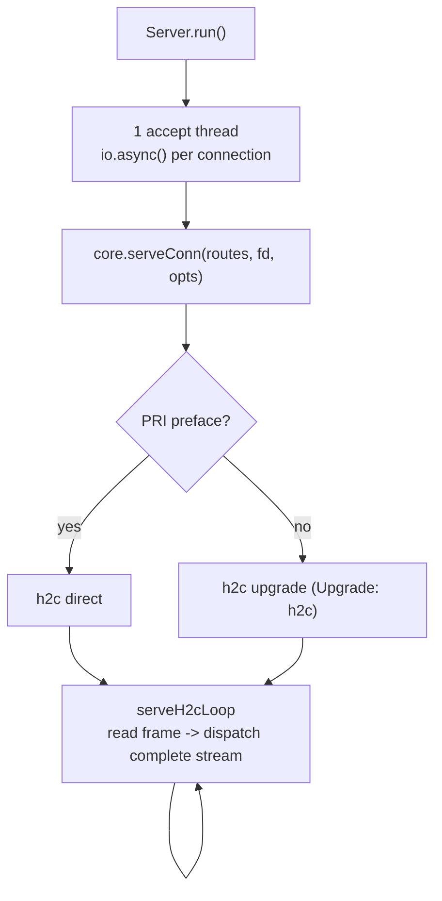
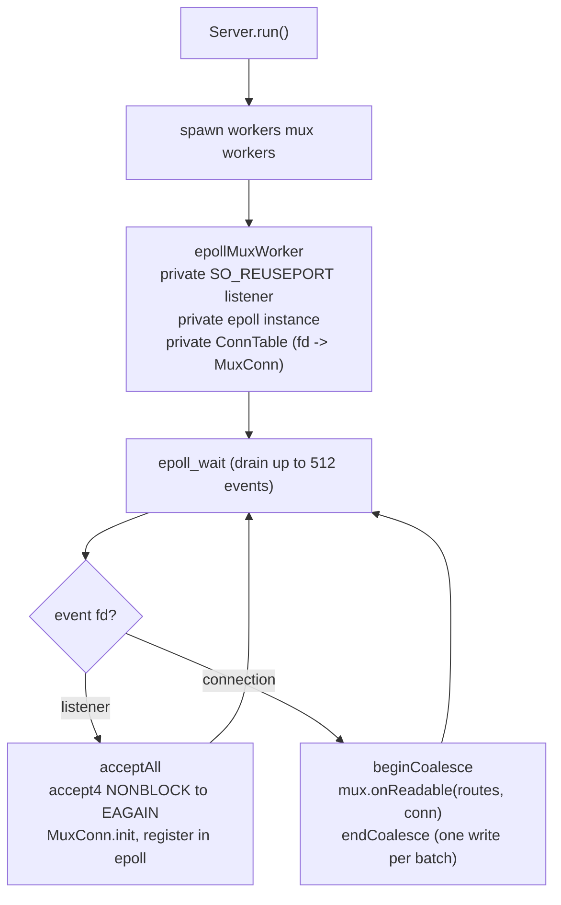
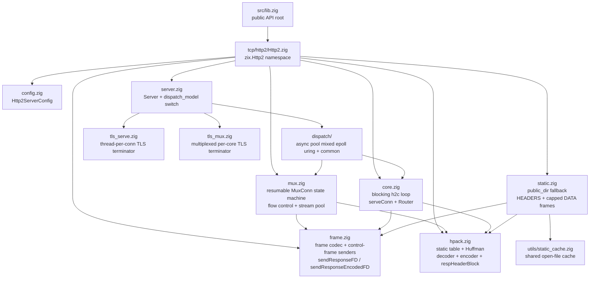
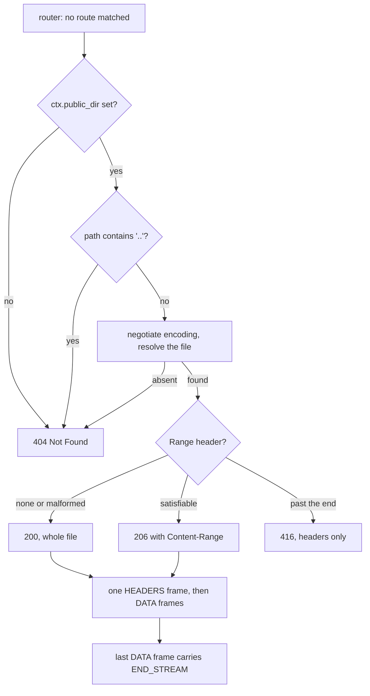
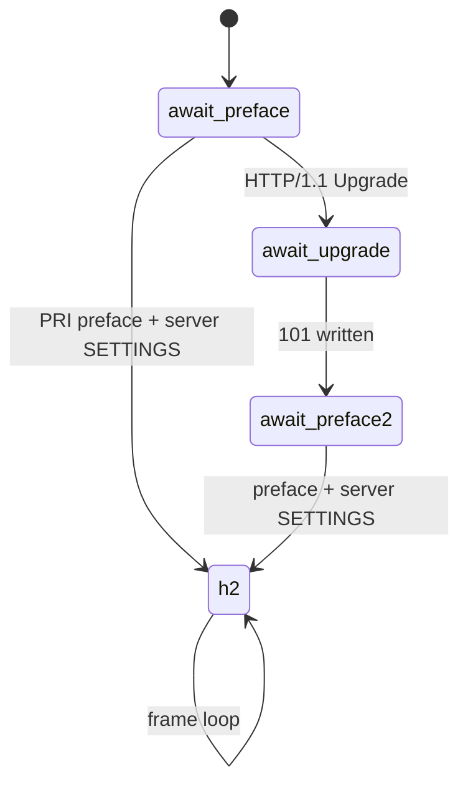

# HLD: zix.Http2

Pure-Zig HTTP/2 (h2c) server engine: frame codec, HPACK, and a resumable multiplexed state machine on raw fd I/O, no `std.http` in the frame path.

---

## Goals

- Pure-Zig h2c: frame codec plus HPACK (static table, dynamic table, Huffman) with no C FFI and no `std.http` in the frame path.
- One handler per completed stream: the handler receives the `req`/`res`/`ctx` trio (ADR-063), `Response` writing straight to the fd underneath.
- Multiplexed by construction: the `.EPOLL` / `.URING` models drive many connections and many concurrent streams from one worker thread through a resumable state machine, with no thread per stream.
- Router built at comptime, `Server.init` takes a runtime handler (ADR-063), zero heap for routing.
- Raw `std.posix` I/O on the data path: `std.Io` is used only for listen/accept plumbing.
- Native TLS (ALPN h2) additive over the h2c default, so cleartext dispatch is untouched.

---

## Positioning: zix.Http2 vs zix.Http1 vs zix.Grpc

All three are raw-fd engines with the same three dispatch models and (since ADR-063) the same `req`/`res`/`ctx` handler trio. `zix.Http1` and `zix.Grpc` still bake routing into the `Server` type at comptime, `zix.Http2`'s `Server` takes a runtime handler built from a comptime `Router` (see `Server.init` shape below). They differ in protocol and what each `Response` / `Context` exposes for it.

| Aspect | `zix.Http1` | `zix.Http2` | `zix.Grpc` |
| :- | :- | :- | :- |
| Protocol | HTTP/1.1 | HTTP/2 h2c | gRPC over HTTP/2 h2c |
| Handler signature | `fn(*Request, *Response, *Context) anyerror!void` (trio, ADR-062) | `fn(*Request, *Response, *Context) anyerror!void` (trio, ADR-063) | `fn(*Request, *Response, *Context) anyerror!void` (trio, ADR-063) |
| Concurrency per connection | one request at a time (pipelined) | many concurrent streams | many concurrent streams |
| Header codec | raw text parse | HPACK | HPACK |
| Per-request allocator / context | per-request arena via `Context` | per-request stack arena via `Context` | per-request stack arena via `Context` |
| Streaming responses | chunked / SSE helpers | flow-controlled DATA (`sendResponseStreamFD`, raw escape hatch) | `res.sendMessage` |
| Handler error policy | auto-500 when nothing sent | auto-500 when nothing sent | passes through silently (`catch {}`, current wire behavior kept) |
| `Server.init` shape | `init(handler, config)`, `Router(routes).dispatch` | `init(handler, config)`, `Router(routes).dispatch` | `init(Router(routes), config)` (the one exception: the engine must see `Route.is_server_streaming` before dispatch) |
| Layer relationship | standalone | standalone | builds on `zix.Http2` |

Use `zix.Http2` for browser-grade or prior-knowledge HTTP/2 with raw frame control. Use `zix.Grpc` when the payload is gRPC (it reuses this engine's frame and HPACK layers). Use `zix.Http1` when one request per connection is enough.

---

## Runtime Model

Three dispatch models, selected via `config.dispatch_model` (`DispatchModel` enum). Required: the caller must set it explicitly (no default). `.EPOLL` and `.URING` are Linux-only, and `run()` rejects them off Linux with `error.DispatchModelUnsupported` (ADR-065).

### .ASYNC: Thread-per-connection over the blocking core

One `io.async` task owns a connection for its whole lifetime and runs the blocking h2c loop (`serveH2cLoop`), reading one frame at a time and dispatching each completed stream inline. This is the portable model, the same shape as `zix.Http1`.


```mermaid
flowchart TD
    MAIN["Server.run()"] --> A["1 accept thread\nio.async() per connection"]
    A --> SERVE["core.serveConn(routes, fd, opts)"]
    SERVE --> PRE{"PRI preface?"}
    PRE -->|yes| DIRECT["h2c direct"]
    PRE -->|no| UP["h2c upgrade (Upgrade: h2c)"]
    DIRECT --> LOOP["serveH2cLoop\nread frame -> dispatch complete stream"]
    UP --> LOOP
    LOOP --> LOOP
```

- One accept thread, each connection dispatched as a concurrent `io.async` task. `workers` is ignored.
- The only model available on every platform, so it is the model every non-Linux target uses.

### .EPOLL: Shared-Nothing Multiplexed Event Loop (Linux only)


```mermaid
flowchart TD
    MAIN["Server.run()"] --> SPAWN["spawn workers mux workers"]
    SPAWN --> W["epollMuxWorker\nprivate SO_REUSEPORT listener\nprivate epoll instance\nprivate ConnTable (fd -> MuxConn)"]
    W --> WAIT["epoll_wait (drain up to 512 events)"]
    WAIT --> EV{"event fd?"}
    EV -->|listener| ACCEPT["acceptAll\naccept4 NONBLOCK to EAGAIN\nMuxConn.init, register in epoll"]
    EV -->|connection| READ["beginCoalesce\nmux.onReadable(routes, conn)\nendCoalesce (one write per batch)"]
    ACCEPT --> WAIT
    READ --> WAIT
```

- Each worker owns a private listener, epoll instance, and fd-indexed `ConnTable`. The kernel load-balances new connections across the per-worker `SO_REUSEPORT` listeners, so there is no accept thread, no shared queue, and no cross-thread fd handoff.
- One worker drives many non-blocking connections through the resumable h2 state machine in `mux.zig`, one `MuxConn` per fd, so concurrency is bounded by connection count, not thread count.
- Every frame a readable batch writes (HEADERS plus DATA per stream, times the streams in the batch) coalesces into a single `write()` through a per-worker sink (`beginCoalesce` / `endCoalesce`), instead of one write per frame.
- `workers` is the mux worker count (0 = cpu count). A handler runs inline on the worker, so it must stay bounded: a long handler blocks that worker's other connections.
- Off Linux, `run()` returns `error.DispatchModelUnsupported` after logging which model was rejected: pick `.ASYNC` there.

### .URING: Shared-Nothing io_uring Event Loop (Linux only)

Same shared-nothing, one-listener-per-worker topology as `.EPOLL`, but completion-based: a multishot accept and one recv per connection are submitted as SQEs and reaped as CQEs (ADR-037 Phase 4). Each recv fills the connection's read accumulator, then `mux.processRing` drives the same resumable state machine. The handler still writes its reply straight to the (non-blocking) fd, batched by the same coalescing sink.

`.URING` probes io_uring once at startup (`initUringRing`). When the ring is unavailable (an old kernel, a seccomp sandbox, or an `RLIMIT_MEMLOCK` cap too low for the ring), it folds to the `.EPOLL` shared-nothing loop, so selecting `.URING` never strands the server right after binding. That is a runtime capability gap on Linux. Off Linux the model is rejected outright with `error.DispatchModelUnsupported`.

---

## Source Layout


```mermaid
graph TD
    zix["src/lib.zig\npublic API root"] --> Http2["tcp/http2/Http2.zig\nzix.Http2 namespace"]

    Http2 --> core["core.zig\nblocking h2c loop\nserveConn + Router"]
    Http2 --> mux["mux.zig\nresumable MuxConn state machine\nflow control + stream pool"]
    Http2 --> frame["frame.zig\nframe codec + control-frame senders\nsendResponseFD / sendResponseEncodedFD"]
    Http2 --> hpack["hpack.zig\nstatic table + Huffman\ndecoder + encoder + respHeaderBlock"]
    Http2 --> config["config.zig\nHttp2ServerConfig"]
    Http2 --> server["server.zig\nServer + dispatch_model switch"]
    Http2 --> static["static.zig\npublic_dir fallback\nHEADERS + capped DATA frames"]

    server --> dispatch["dispatch/\nasync pool mixed epoll uring + common"]
    server --> tls_serve["tls_serve.zig\nthread-per-conn TLS terminator"]
    server --> tls_mux["tls_mux.zig\nmultiplexed per-core TLS terminator"]

    dispatch --> core
    dispatch --> mux
    mux --> frame
    mux --> hpack
    core --> frame
    core --> hpack
    static --> frame
    static --> hpack
    static --> static_cache["utils/static_cache.zig\nshared open-file cache"]
```

---

## Public API

Access via `const zix = @import("zix");`

| Symbol | Type | Description |
| :- | :- | :- |
| `zix.Http2.Server` | struct | `init(handler, config)`, then `run()` / `deinit()` (ADR-063: `handler` is a runtime `HandlerFn`, not a comptime route table) |
| `zix.Http2.ServerConfig` | struct | Server configuration (see Http2ServerConfig section) |
| `zix.Http2.DispatchModel` | enum(u8) | `.ASYNC`(0, portable) `.EPOLL`(1, Linux-only) `.URING`(2, Linux-only) |
| `zix.Http2.HandlerFn` | type | `*const fn(req: *Request, res: *Response, ctx: *Context) anyerror!void` (ADR-063 trio, mirrors Http1/ADR-062) |
| `zix.Http2.Route` | struct | `{ path, handler, kind = .EXACT }` |
| `zix.Http2.RouteKind` | enum(u8) | `.EXACT` `.PREFIX` (no `.PARAM` this pass) |
| `zix.Http2.Router` | fn | `Router(comptime routes) type`, returns a type whose `dispatch` matches `HandlerFn` exactly (usable directly as the `Server.init` handler); unmatched paths get a 404 `text/plain` |
| `zix.Http2.Request` | struct | `{ method, path, query, headers, body }`, zero-copy view over the stream's decoded headers/body, plus `header(name)` and `queryParam(name)` |
| `zix.Http2.Response` | struct | Thin builder over `frame.sendResponseFD` / `sendResponseEncodedFD`: `setStatus` / `setContentType` / `send` / `sendJson` / `sendText` / `sendNoContent`, all `!void`. `sent: bool` guards the auto-500 |
| `zix.Http2.Context` | struct | `fd`, `sid`, `deadline_ns` + `withTimeout` / `setTimeout` / `withDeadline` / `isExpired` / `timedOut`, `io`, and a stack-arena `allocator` (`FixedBufferAllocator`, no heap call) |
| `zix.Http2.ServeOpts` | struct | Per-connection serve options built from the config |
| `zix.Http2.serveConn` | fn | `serveConn(handler, fd, opts, io)`: direct blocking connection entry point |
| `zix.Http2.Header` | struct | `{ name: []const u8, value: []const u8 }` decoded request header |
| `zix.Http2.sendResponseFD` | fn | `sendResponseFD(fd, sid, status, content_type, body)`: HEADERS plus DATA, END_STREAM on the last frame (immediate, unmetered) |
| `zix.Http2.sendResponseEncodedFD` | fn | `sendResponseFD` plus a `content-encoding` header (serve a precompressed body) |
| `zix.Http2.sendResponseStreamFD` | fn | Flow-controlled send for a large, caller-owned body (paces by WINDOW_UPDATE, body must outlive the stream) |
| `zix.Http2.serveCached` / `sendCachedFD` / `cacheTtl` | fn | Per-worker response cache (ADR-036), opt-in via `response_cache` (`.EPOLL` / `.URING`) |
| `zix.Http2.HpackEncoder` / `HpackDecoder` / `HpackEntry` | type | HPACK codec types |
| `zix.Http2.huffEncode` / `huffDecode` | fn | HPACK Huffman codec |
| `zix.Http2.respHeaderBlock` | fn | Encode a cached `[:status, content-type, content-encoding, content-length]` block |
| `zix.Http2.FrameHeader` + `parseFrameHeader` / `writeFrameHeader` / `encodeFrameHeader` / `readFrameHeader` | type / fn | Frame-header codec for custom framing |
| `zix.Http2.sendSettingsFD` / `sendSettingsAckFD` / `sendPingAckFD` / `sendGoawayFD` / `sendRstStreamFD` / `sendWindowUpdateFD` | fn | Control-frame senders |
| `zix.Http2.FRAME_TYPE_*` / `FLAG_*` / `ERR_*` / `SETTINGS_*` | const | RFC 7540 frame, flag, error, and settings constants |
| `zix.Http2.PREFACE` / `HPACK_STATIC` | const | Connection preface string, HPACK static table |

---

## Http2ServerConfig

Key fields (the full table is in [`docs/zix-config-en.md`](zix-config-en.md)):

```zig
pub const Http2ServerConfig = struct {
    io:             std.Io,        // listen/accept plumbing only, must outlive the server
    ip:             []const u8,
    port:           u16,           // must be non-zero
    dispatch_model: DispatchModel, // required, no default
    kernel_backlog: u31   = 1024,
    workers:        usize = 0,     // 0 = cpu_count accept threads, ignored by .ASYNC
    workers:        usize = 0,     // .EPOLL/.URING: 0 = cpu_count mux workers. Ignored by .ASYNC
    worker_stack_size_bytes: usize = 512 * 1024,
    busy_poll_us:   u32   = 0,     // SO_BUSY_POLL spin window (.EPOLL/.URING), 0 = unset
    max_streams:    u32   = 128,   // advertised SETTINGS_MAX_CONCURRENT_STREAMS
    max_frame_size: u32   = 16384, // advertised SETTINGS_MAX_FRAME_SIZE
    max_header_scratch: usize = 4096,       // HPACK decode scratch per connection
    max_body:       usize = 16384, // max request body buffered per stream (a body past this sheds the stream with 413)
    max_recv_buf:   usize = 32 * 1024,      // per-connection read-buffer floor (.EPOLL/.URING)
    tls_write_buf_initial_bytes: usize = 16 * 1024,
    response_cache: bool  = false, // per-worker response cache (ADR-036), every model
    handler_timeout_ms: u32 = 0,   // global deadline seeded onto Context.deadline_ns, 0 = no deadline
    public_dir:     []const u8 = "",        // static file root, "" disables static serving
    public_dir_cache_ttl_ms:      u32 = 0,  // 0 = never cached, the shipped default
    public_dir_cache_max_entries: u32 = 256,// static cache slots, one per file plus its siblings
    tls:            ?*Tls.Context = null,   // non-null serves h2 over TLS (ALPN h2), else h2c cleartext
    logger:         ?*Logger = null,        // lifecycle lines only, see Logging section
};
```

Note: `workers` is the mux worker count under `.EPOLL` / `.URING` (0 = cpu count), and oversubscribing it only adds scheduler churn. `.ASYNC` ignores it. `max_recv_buf` is a floor: the mux read accumulator is sized to the larger of it and one max frame, so a larger floor cuts `read()` and buffer compaction for big frames. `tls` opts into h2 over TLS: when non-null the server serves on a gated TLS path (the cleartext dispatch models are untouched), and for HTTP/2 the context's ALPN should include `.H2`. The `response_cache` and `cache_*` fields configure the opt-in per-worker cache (ADR-036), read at runtime under `.EPOLL` and `.URING`.

`handler_timeout_ms` (ADR-063) is the global deadline: seeded onto `Context.deadline_ns` at dispatch, 0 leaves no deadline. A handler may tighten or clear its own via `ctx.setTimeout` / `withDeadline`, checked with `ctx.isExpired()` between steps (the engine never interrupts a running handler, this is opt-in).

---

## Handler Model

```zig
fn home(req: *zix.Http2.Request, res: *zix.Http2.Response, ctx: *zix.Http2.Context) !void {
    _ = req;
    _ = ctx;

    try res.sendText("hello");
}

const router = zix.Http2.Router(&[_]zix.Http2.Route{
    .{ .path = "/", .handler = home },
});

var server = zix.Http2.Server.init(
    router.dispatch,
    .{ .io = process.io, .ip = "0.0.0.0", .port = 8082, .dispatch_model = .EPOLL },
);
defer server.deinit();
try server.run();
```

- `Server.init` takes a runtime `handler: HandlerFn` (ADR-063), built via `Router(&[_]Route{...}).dispatch`. Routes themselves stay comptime (baked into the router type), but the server no longer bakes the route table into its own type, so `Server` is one concrete struct, not a generic.
- The handler is called once per completed stream (END_HEADERS plus END_STREAM), via `core.invokeHandler` which builds the trio and dispatches. `req.method`, `req.headers`, and `req.body` all point into per-stream buffers and are valid only for the duration of the call.
- `ctx.allocator` is a per-request stack arena (`FixedBufferAllocator`, no heap call), `ctx.io` carries the connection's `std.Io`, and `ctx.deadline_ns` / `isExpired()` cover Layer B timeouts (see `handler_timeout_ms` above).
- The handler returns `anyerror!void`. On error, `invokeHandler` auto-completes one 500 (`frame.sendResponseFD(fd, sid, 500, "text/plain", "Internal Server Error")`), but only when `!res.sent`, so a partially sent response is never corrupted.
- Responses go out through `Response.send` / `sendJson` / `sendText` / `sendNoContent`, thin builders over the same `frame.sendResponseFD` / `sendResponseEncodedFD` writers as before (byte-identical wire, ADR-063 changed only what wraps the call). A large, process-lifetime body still uses the raw `mux.sendResponseStreamFD` escape hatch directly (paced by flow control), not wrapped by `Response`.
- The engine resolves the path to a handler through `Router(routes).dispatch` before the call (EXACT then longest-PREFIX match, unmatched paths try the static fallback below and then get 404 `text/plain`), so the handler does not parse or match the path itself.

---

## Static File Serving

`public_dir` (ADR-064) serves an unmatched route as a file before the 404. Empty (the default) disables it, and a missing directory fails at `run()` with `error.PublicDirNotFound` rather than 404-ing every file request at runtime.


```mermaid
flowchart TD
    A["router: no route matched"] --> B{"ctx.public_dir set?"}
    B -->|no| Z["404 Not Found"]
    B -->|yes| C{"path contains '..'?"}
    C -->|yes| Z
    C -->|no| D["negotiate encoding, resolve the file"]
    D -->|absent| Z
    D -->|found| E{"Range header?"}
    E -->|none or malformed| F["200, whole file"]
    E -->|satisfiable| G["206 with Content-Range"]
    E -->|past the end| H["416, headers only"]
    F --> I["one HEADERS frame, then DATA frames"]
    G --> I
    I --> J["last DATA frame carries END_STREAM"]
```

- One HEADERS frame carries the status, content type, `content-length`, `accept-ranges`, and `content-range` when the response is a 206. An empty file closes the stream on HEADERS with no DATA at all.
- DATA frames are capped at the **peer's** `SETTINGS_MAX_FRAME_SIZE`, not at this server's `max_frame_size`. The two are different values: `max_frame_size` is what this server advertises it will accept, and sizing outbound frames by it is what a conforming peer answers with `FRAME_SIZE_ERROR`. The peer value arrives from the mux, from SETTINGS frames mid-connection, or from the base64 `HTTP2-Settings` header on an h2c upgrade.
- Range (RFC 7233) is served: 206 for a satisfiable range, 416 with `Content-Range: bytes */length` for a well-formed range past the end, and a malformed header is ignored so the whole file is sent, which is what section 3.1 asks for. A multi-range header answers the first range only.
- Both the cached and uncached paths are built, so `public_dir` behaves the same whether or not `public_dir_cache_ttl_ms` is set. With it set, a repeat request costs a hash lookup instead of an open plus a stat, and `.br` / `.gz` siblings are resolved once at insert instead of probed per request. Every cached variant header carries `Vary: Accept-Encoding`.
- Zero copy (`sendfile`) is always refused on this engine, cleartext included, because the mux coalescing hook (`frame.write_hook`) is installed on every batch and a direct socket write would put the body ahead of frames already staged. The body is cut from a resident snapshot instead.
- Static sends use the same unmetered `frame.sendResponseFD` path `Response.send` uses, not the window-paced `mux.sendResponseStreamFD`. That is consistent with the rest of the engine and is worth revisiting alongside that path rather than separately.
- `public_dir_upload` is not offered here. `zix.Http2` has no upload handler convention, unlike `zix.Http` and `zix.Http1`.

---

## Multiplexed State Machine

The `.EPOLL` / `.URING` models drive `mux.zig`, one `MuxConn` per fd. The read accumulator (`rbuf`, tracked by `rstart` / `rend`) persists across readable events and holds a partial frame until the rest arrives, so a worker can resume a connection mid-frame and drive many connections from one thread.

A connection advances through preface phases, then a frame loop:


```mermaid
stateDiagram-v2
    [*] --> await_preface
    await_preface --> h2: PRI preface + server SETTINGS
    await_preface --> await_upgrade: HTTP/1.1 Upgrade
    await_upgrade --> await_preface2: 101 written
    await_preface2 --> h2: preface + server SETTINGS
    h2 --> h2: frame loop
```

Inside the `.h2` phase the frame loop reads a 9-byte header, waits for the full payload to arrive in `rbuf` (returning `keep_alive` when it has not), then dispatches by type:

- SETTINGS: apply the peer's header-table size and initial window (adjusting every open stream's send window per RFC 7540 6.9.2), then ACK and grant a connection-level WINDOW_UPDATE.
- HEADERS / CONTINUATION: claim a stream slot, HPACK-decode the block into the stream's headers, and dispatch when END_HEADERS plus END_STREAM are seen.
- DATA: return WINDOW_UPDATE for the connection and stream, copy the payload into the stream body, and dispatch on END_STREAM. A body past `max_body` sheds the stream with a 413 and END_STREAM instead of truncating, crediting only the connection window for the discarded bytes.
- WINDOW_UPDATE: grow the connection or stream send window and resume any parked response body.
- RST_STREAM: release the stream slot. PING: reply with an ACK. GOAWAY: close the connection.

A protocol violation (stream id 0 where illegal, an oversize frame, a bad preface) sends GOAWAY or RST_STREAM. The blocking `core.serveH2cLoop` runs the same protocol over blocking reads with a per-connection stream array instead of the pooled slots.

---

## HPACK

`hpack.zig` is a full HPACK codec with no external dependency.

- Request decoder: the 61-entry static table plus a dynamic table (up to 128 entries) backed by a connection-lifetime buffer (`dyn_buf`, 8 KB) with size-bounded eviction and in-place compaction. Indexed and literal values are copied into the caller's per-stream scratch, so decoded header slices stay stable even after the scratch is reused for the next stream. Huffman-coded strings are decoded on the fly.
- Response encoder: stateless (static table plus literal-without-indexing, never the dynamic table or a size update), so a given header block is byte-identical on every connection.
- `respHeaderBlock`: encodes `[:status, content-type, content-encoding, content-length]`. Because the encoder is stateless, the `[:status, content-type, content-encoding]` prefix is cached per distinct triple (an append-only, lock-free-read cache) and only the varying `content-length` is re-encoded per call, so a hot response path skips the repeated static-table scans and the Huffman encode of the same content-type.

---

## Flow Control

Send-side flow control follows RFC 7540 6.9. Each `MuxConn` carries a connection-level send window, and each open stream carries its own send window, both starting at 65535 (adjusted by the peer's advertised initial window).

- `pumpBody` sends DATA capped by `min(connection window, stream window, max_frame_size)`. What does not fit is parked on the stream (`pending_body`, `pending_end`) and the stream slot stays borrowed. END_STREAM rides the final frame only once the whole body has gone out.
- A WINDOW_UPDATE resumes parked work: `resumeStream` for a stream-level grant, `resumeAll` for a connection-level grant. The slot is freed once its body fully drains.
- `sendResponseStreamFD(fd, sid, status, content_type, content_encoding, body)` is the public entry. The body is referenced, not copied, so it must outlive the stream (a process-lifetime cache, not a per-request scratch buffer). With no active connection context (the blocking non-mux serve paths) it falls back to an immediate, unmetered send.
- Inbound DATA returns a WINDOW_UPDATE for both the connection and the stream so the peer keeps sending.

---

## h2 over TLS

Setting `config.tls` (a `*Tls.Context`) opts into HTTP/2 over TLS (TLS 1.3 with a 1.2 fallback, ALPN h2). The `server.zig` `run()` switch picks one of two terminators by `dispatch_model`:

- `.EPOLL` / `.URING`: `tls_mux.runTlsMux`. One `SO_REUSEPORT` epoll worker per core terminates TLS in place via a resumable session (`tcp/tls/tls_session.zig`) and multiplexes many connections per worker, with no socketpair and no thread per connection. The resumable h2 mux consumes the decrypted plaintext, and its reply frames are encrypted back into TLS records through the thread-local frame write hook. Outbound ciphertext that does not fit is staged per connection and flushed on the next EPOLLOUT, so a slow client never parks the worker.
- `.ASYNC`: `tls_serve.runTls`. An accept loop hands each connection to its own worker thread, which runs the shared terminator (`tcp/tls/h2_terminator.zig`) with an inline-mux driver that drives the same resumable mux directly over the decrypted stream (one thread per connection, no socketpair). This path also serves TLS 1.2.

The write hook (`frame.write_hook`) is the shared mechanism: the mux writes plaintext through `frame.writeAllFD`, and the hook seals it into records on the TLS path (the same hook batches frames into one write per readable batch on the cleartext `.EPOLL` / `.URING` path). The cert / key / policy live in the `Tls.Context` (ADR-047), reused across engines. TLS runs on its own performance band. See [`docs/hld-tls-en.md`](hld-tls-en.md).

---

## Logging

`config.logger` receives server lifecycle lines only (listening notices, io_uring fallback, non-Linux fallback) via `logger.system()`. When null, lifecycle lines print to stderr only in Debug builds and are silent in release builds.

Per-stream access logging is the handler's responsibility: the handler owns its frame I/O and returns `void`, so the engine cannot observe the response status or byte count. Call `logger.access()` inside the handler where the final status and size are known.

---

## Memory Model

| Scope | Storage | Lifetime |
| :- | :- | :- |
| Route table | comptime (zero heap cost) | Process |
| Frame payload + stream array (.ASYNC) | `smp_allocator`: one payload buffer plus `max_streams` inline `Stream` slots (each carries its own body and header-scratch buffers) | Connection |
| Per-connection MuxConn (.EPOLL/.URING) | `smp_allocator`: read accumulator (`max_recv_buf` floor) plus a `max_streams`-wide `*MuxStream` pointer array and slot flags | Connection |
| Open stream state (.EPOLL/.URING) | per-worker thread-local `MuxStream` pool (free-list), each slot's `max_body` and `max_header_scratch` buffers reused across borrows | Concurrent stream (returned to the pool on close) |
| HPACK dynamic table | inline in the connection's decoder (`dyn_buf`, 8 KB) | Connection |
| Per-worker response cache (opt-in) | `smp_allocator`, `cache_max_entries` * `cache_max_value_bytes` per worker | Worker thread |
| Handler allocations | `ctx.allocator`: a stack `FixedBufferAllocator` (`CTX_ARENA_BYTES`, no heap call), reset per request | Request |
| Static file cache (opt-in) | one demand-paged mapping shared by every worker and every HTTP engine in the process, `public_dir_cache_max_entries` slots holding an open file, its size, and its prerendered header | Process |

The `.EPOLL` / `.URING` mux borrows each stream slot from a per-worker thread-local pool (a free-list of `MuxStream`), so resident stream memory tracks the number of concurrent streams on that worker, not connections times `max_streams`. An idle connection holds only its `max_streams`-wide pointer array and its read buffer, not `max_streams` full stream buffers. A closed stream returns its slot (buffers retained) to the pool for the next borrow, so the steady state does no per-stream allocation. The blocking `.ASYNC` path instead reserves a per-connection inline `Stream` array up front.

---

## Known Limits

| Limit | Behaviour |
| :- | :- |
| Request body per stream | Buffered up to `max_body` (16 KB default). A body past the buffer cap sheds the stream with a 413 and END_STREAM, so the handler never sees a truncated slice and a corrupt body never dispatches. Only the connection window is credited for the discarded bytes, keeping the connection usable for its other streams |
| Concurrent streams | Advertised as `max_streams` (`SETTINGS_MAX_CONCURRENT_STREAMS`). A stream opened beyond it is answered with `REFUSED_STREAM`, so the advertised value must be at least the peer's concurrent-stream count |
| h2c upgrade (.EPOLL/.URING) | Served minimally on the mux path: `101` then the connection preface, the request carried on stream 1 is not served. Prior-knowledge clients (the common h2c case) are unaffected. The blocking `.ASYNC` model serves the upgraded stream-1 request |
| Header block scratch | `max_header_scratch` per connection (4 KB default). A header set that overflows it is answered with `COMPRESSION_ERROR` and RST_STREAM |
| Frame size | A frame larger than `max_frame_size` plus slack is a `FRAME_SIZE_ERROR` and closes the connection with GOAWAY. Outbound DATA is sized by the peer's advertised value instead, never by this one |
| Static files | `public_dir` serves whole files and single ranges. A multi-range header answers the first range only, and there is no `public_dir_upload` companion on this engine |
| TLS | h2 over TLS (TLS 1.3 + 1.2, ALPN h2), opt-in via `config.tls`, on its own perf band. `.EPOLL` / `.URING` terminate in an event-driven epoll-mux worker, `.ASYNC` per connection in a worker thread. See [`docs/hld-tls-en.md`](hld-tls-en.md) |

Endpoints that need a large request body should read it in DATA frames within `max_body`, or move the bulk transfer to a streaming design (the buffered model covers bounded bodies).

For implementation details see [`docs/lld-http2-en.md`](lld-http2-en.md). For the TLS terminator see [`docs/hld-tls-en.md`](hld-tls-en.md).

---

###### end of hld-http2
