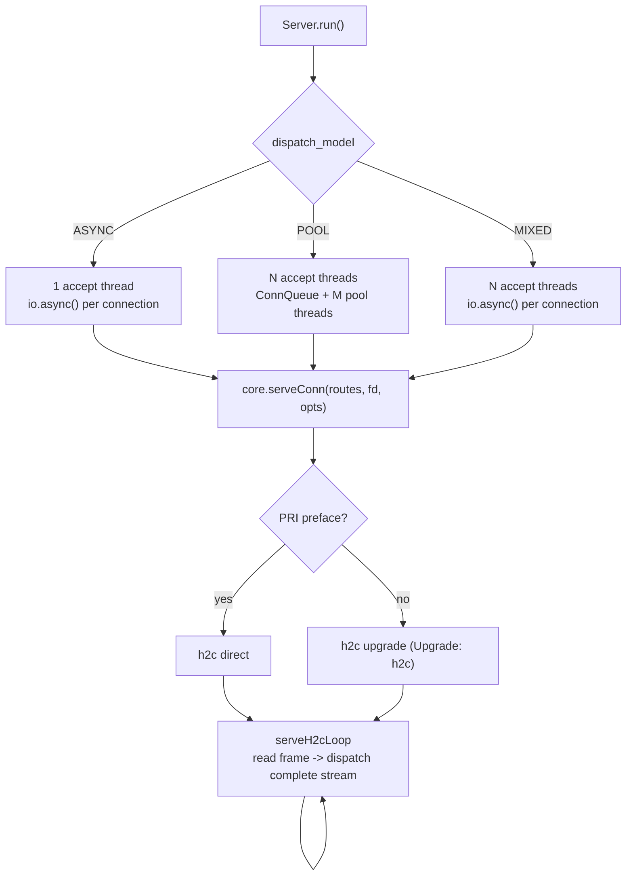
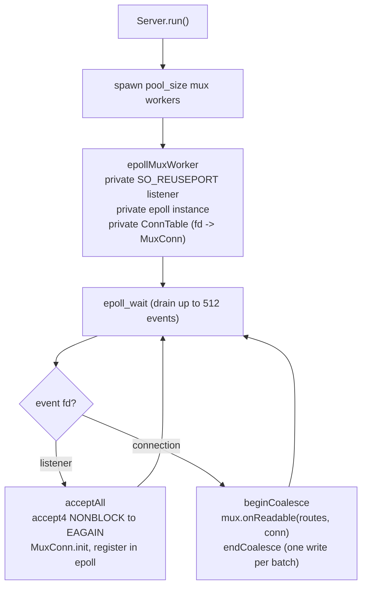
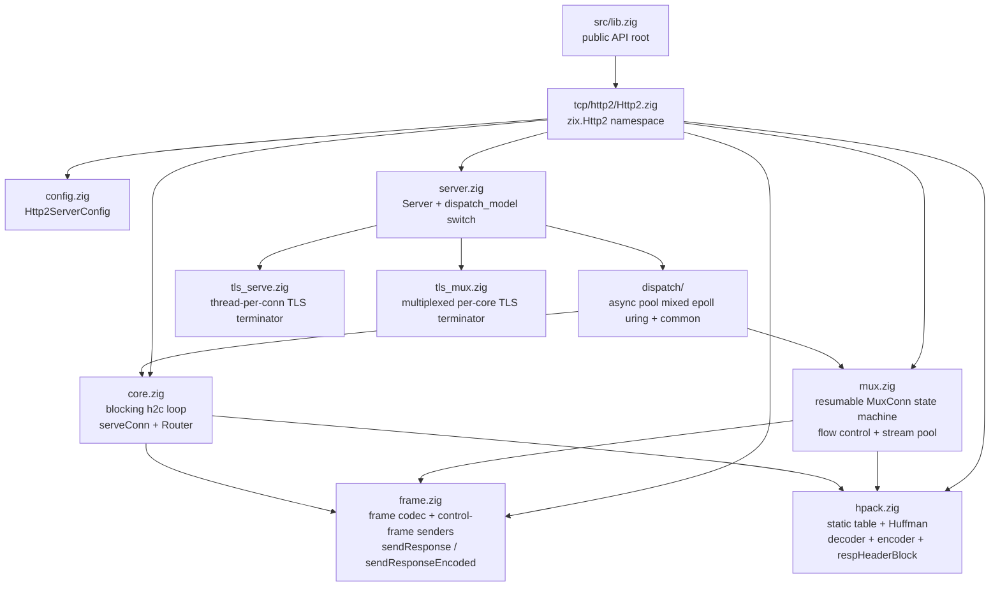
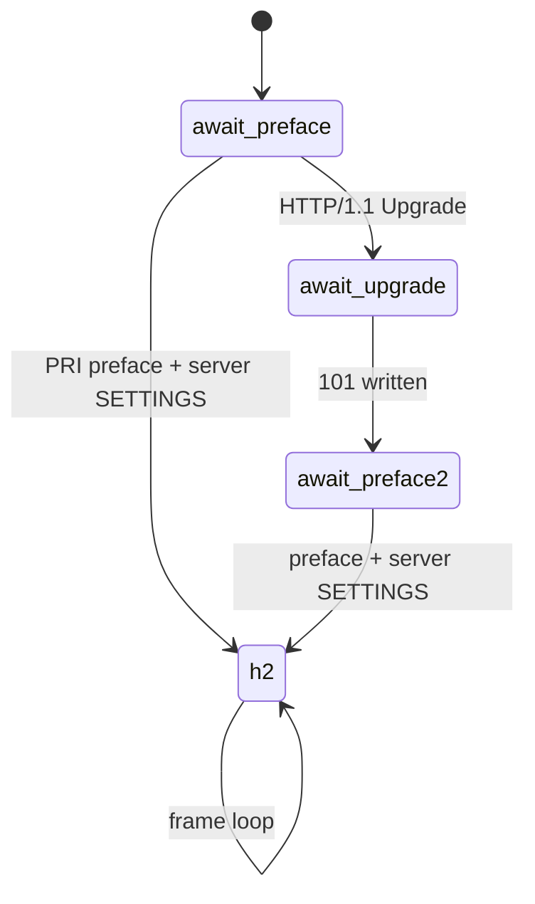

# HLD: zix.Http2

Engine server HTTP/2 (h2c) pure-Zig: frame codec, HPACK, dan state machine multiplexed yang resumable di atas raw fd I/O, tanpa `std.http` pada jalur frame.

---

## Tujuan

- h2c pure-Zig: frame codec plus HPACK (static table, dynamic table, Huffman) tanpa C FFI dan tanpa `std.http` pada jalur frame.
- Satu handler per stream yang selesai: handler menerima method, header hasil decode, slice body, fd, dan stream id, lalu menulis frame langsung ke fd.
- Multiplexed sejak rancangan: model `.EPOLL` / `.URING` menggerakkan banyak koneksi dan banyak stream konkuren dari satu worker thread melalui state machine yang resumable, tanpa thread per stream.
- Tabel route comptime dibakukan ke dalam tipe server, nol heap untuk routing.
- Raw `std.posix` I/O pada jalur data: `std.Io` hanya dipakai untuk plumbing listen/accept.
- TLS native (ALPN h2) bersifat tambahan di atas default h2c, sehingga dispatch cleartext tidak tersentuh.

---

## Posisi: zix.Http2 vs zix.Http1 vs zix.Grpc

Ketiganya adalah engine raw-fd dengan lima model dispatch yang sama dan tabel route comptime. Perbedaannya pada protokol dan bentuk handler.

| Aspek | `zix.Http1` | `zix.Http2` | `zix.Grpc` |
| :- | :- | :- | :- |
| Protokol | HTTP/1.1 | HTTP/2 h2c | gRPC di atas HTTP/2 h2c |
| Signature handler | `fn(head, body, fd)` | `fn(method, headers, body, fd, sid)` | `fn(headers, *Context)` |
| Konkurensi per koneksi | satu request pada satu waktu (pipelined) | banyak stream konkuren | banyak stream konkuren |
| Codec header | parse teks mentah | HPACK | HPACK |
| Allocator / context per-request | tidak ada | tidak ada | `GrpcContext` (recv / send / finish) |
| Response streaming | helper chunked / SSE | DATA dengan flow control (`sendResponseStream`) | `ctx.sendMessage` |
| Relasi layer | standalone | standalone | dibangun di atas `zix.Http2` |

Pakai `zix.Http2` untuk HTTP/2 kelas browser atau prior-knowledge dengan kontrol frame mentah. Pakai `zix.Grpc` saat payload-nya gRPC (ia memakai ulang layer frame dan HPACK engine ini). Pakai `zix.Http1` saat satu request per koneksi sudah cukup.

---

## Model Runtime

Lima model dispatch, dipilih melalui `config.dispatch_model` (enum `DispatchModel`). Wajib: pemanggil harus menyetelnya secara eksplisit (tidak ada default).

### .ASYNC / .POOL / .MIXED: Thread-per-connection di atas core blocking

Ketiganya berbagi `core.serveConn`: satu thread (atau task `io.async`) memiliki satu koneksi sepanjang masa hidupnya dan menjalankan loop h2c blocking (`serveH2cLoop`), membaca satu frame pada satu waktu dan men-dispatch setiap stream yang selesai secara inline. Perbedaannya hanya pada bagaimana koneksi di-accept dan diserahkan ke serving thread, pemisahan yang sama dengan `zix.Http1`.



- `.ASYNC`: satu accept thread, setiap koneksi di-dispatch sebagai task `io.async` konkuren. `workers` dan `pool_size` diabaikan.
- `.POOL`: `workers` accept thread mendorong stream hasil accept ke `ConnQueue` bersama, `pool_size` pool thread mengambil dan melayani setiap koneksi secara sinkron.
- `.MIXED`: `workers` accept thread (`SO_REUSEPORT`) masing-masing men-dispatch langsung via `io.async`, tanpa `ConnQueue`. `pool_size` diabaikan.

### .EPOLL: Event Loop Multiplexed Shared-Nothing (khusus Linux)



- Setiap worker memiliki listener pribadi, instance epoll pribadi, dan `ConnTable` ter-index fd. Kernel menyeimbangkan koneksi baru di antara listener `SO_REUSEPORT` per-worker, sehingga tidak ada accept thread, tidak ada queue bersama, dan tidak ada handoff fd antar thread.
- Satu worker menggerakkan banyak koneksi non-blocking melalui state machine h2 yang resumable di `mux.zig`, satu `MuxConn` per fd, sehingga konkurensi dibatasi oleh jumlah koneksi, bukan jumlah thread.
- Setiap frame yang ditulis oleh readable batch (HEADERS plus DATA per stream, dikali jumlah stream dalam batch) di-coalesce menjadi satu `write()` melalui sink per-worker (`beginCoalesce` / `endCoalesce`), alih-alih satu write per frame.
- `pool_size` adalah jumlah mux worker (0 = cpu count). Handler berjalan inline pada worker, jadi harus tetap terbatas: handler yang lama memblokir koneksi lain pada worker itu.
- Pada target non-Linux `.EPOLL` jatuh kembali ke `.POOL` dengan notice yang dicatat di log.

### .URING: Event Loop io_uring Shared-Nothing (khusus Linux)

Topologi shared-nothing, satu-listener-per-worker yang sama dengan `.EPOLL`, tetapi completion-based: satu multishot accept dan satu recv per koneksi disubmit sebagai SQE dan dipanen sebagai CQE (ADR-037 Phase 4). Setiap recv mengisi read accumulator koneksi, lalu `mux.processRing` menggerakkan state machine yang resumable yang sama. Handler tetap menulis balasannya langsung ke fd (non-blocking), di-batch oleh coalescing sink yang sama.

`.URING` memeriksa io_uring sekali saat startup (`initUringRing`). Saat ring tidak tersedia (kernel lama, sandbox seccomp, atau cap `RLIMIT_MEMLOCK` yang terlalu rendah untuk ring), ia melipat ke loop shared-nothing `.EPOLL`, sehingga memilih `.URING` tidak pernah membuat server terdampar tepat setelah binding. Di luar Linux ia melipat ke `.POOL`.

---

## Struktur Berkas



---

## API Publik

Diakses melalui `const zix = @import("zix");`

| Simbol | Tipe | Deskripsi |
| :- | :- | :- |
| `zix.Http2.Server` | struct | `init(comptime routes, config)`, lalu `run()` / `deinit()` |
| `zix.Http2.ServerConfig` | struct | Konfigurasi server (lihat bagian Http2ServerConfig) |
| `zix.Http2.DispatchModel` | enum(u8) | `.ASYNC`(0) `.POOL`(1) `.MIXED`(2) `.EPOLL`(3, native hanya di Linux) `.URING`(4, native hanya di Linux) |
| `zix.Http2.HandlerFn` | type | `*const fn(method: []const u8, headers: []const Header, body: []const u8, fd: std.posix.fd_t, sid: u31) void` |
| `zix.Http2.Route` | struct | `{ path, handler, kind = .EXACT }` |
| `zix.Http2.RouteKind` | enum(u8) | `.EXACT` `.PREFIX` |
| `zix.Http2.Router` | fn | `Router(comptime routes) type`, memetakan path ke handler (dipakai oleh engine) |
| `zix.Http2.ServeOpts` | struct | Opsi serve per-connection yang dibangun dari config |
| `zix.Http2.serveConn` | fn | `serveConn(comptime routes, fd, opts)`: entry point koneksi blocking langsung |
| `zix.Http2.Header` | struct | `{ name: []const u8, value: []const u8 }` header request hasil decode |
| `zix.Http2.sendResponse` | fn | `sendResponse(fd, sid, status, content_type, body)`: HEADERS plus DATA, END_STREAM pada frame terakhir (langsung, tanpa metering) |
| `zix.Http2.sendResponseEncoded` | fn | `sendResponse` plus header `content-encoding` (menyajikan body pra-kompres) |
| `zix.Http2.sendResponseStream` | fn | Pengiriman dengan flow control untuk body besar milik pemanggil (dipacu oleh WINDOW_UPDATE, body harus hidup lebih lama dari stream) |
| `zix.Http2.serveCached` / `sendCached` / `cacheTtl` | fn | Response cache per-worker (ADR-036), opt-in via `response_cache` (`.EPOLL` / `.URING`) |
| `zix.Http2.HpackEncoder` / `HpackDecoder` / `HpackEntry` | type | Tipe codec HPACK |
| `zix.Http2.huffEncode` / `huffDecode` | fn | Codec Huffman HPACK |
| `zix.Http2.respHeaderBlock` | fn | Meng-encode blok `[:status, content-type, content-encoding, content-length]` yang di-cache |
| `zix.Http2.FrameHeader` + `parseFrameHeader` / `writeFrameHeader` / `encodeFrameHeader` / `readFrameHeader` | type / fn | Codec frame-header untuk framing kustom |
| `zix.Http2.sendSettings` / `sendSettingsAck` / `sendPingAck` / `sendGoaway` / `sendRstStream` / `sendWindowUpdate` | fn | Pengirim control-frame |
| `zix.Http2.FRAME_TYPE_*` / `FLAG_*` / `ERR_*` / `SETTINGS_*` | const | Konstanta frame, flag, error, dan settings RFC 7540 |
| `zix.Http2.PREFACE` / `HPACK_STATIC` | const | String connection preface, static table HPACK |

---

## Http2ServerConfig

Field utama (tabel lengkap ada di [`docs/zix-config-id.md`](zix-config-id.md)):

```zig
pub const Http2ServerConfig = struct {
    io:             std.Io,        // hanya plumbing listen/accept, harus hidup lebih lama dari server
    ip:             []const u8,
    port:           u16,           // harus non-zero
    dispatch_model: DispatchModel, // wajib, tidak ada default
    kernel_backlog: u31   = 1024,
    workers:        usize = 0,     // 0 = cpu_count accept thread, diabaikan .ASYNC
    pool_size:      usize = 0,     // .POOL: 0 = max(10, cpu_count*2). .EPOLL/.URING: 0 = cpu_count worker
    worker_stack_size_bytes: usize = 512 * 1024,
    busy_poll_us:   u32   = 0,     // window spin SO_BUSY_POLL (.EPOLL/.URING), 0 = tidak diset
    max_streams:    u32   = 128,   // SETTINGS_MAX_CONCURRENT_STREAMS yang diiklankan
    max_frame_size: u32   = 16384, // SETTINGS_MAX_FRAME_SIZE yang diiklankan
    max_header_scratch: usize = 4096,       // scratch decode HPACK per koneksi
    max_body:       usize = 16384, // body request maksimum yang di-buffer per stream (body di atas ini di-shed dengan 413)
    max_recv_buf:   usize = 32 * 1024,      // floor read-buffer per-connection (.EPOLL/.URING)
    tls_write_buf_initial_bytes: usize = 16 * 1024,
    response_cache: bool  = false, // response cache per-worker (ADR-036), .EPOLL/.URING
    tls:            ?*Tls.Context = null,   // non-null menyajikan h2 di atas TLS (ALPN h2), selain itu h2c cleartext
    logger:         ?*Logger = null,        // baris lifecycle saja, lihat bagian Logging
};
```

Catatan: `pool_size` di-overload oleh model. Pada `.POOL` ia adalah jumlah pool-thread blocking. Pada `.EPOLL` / `.URING` ia adalah jumlah mux worker (0 = cpu count), dan meng-oversubscribe-nya hanya menambah churn scheduler. `max_recv_buf` adalah floor: read accumulator mux diukur sebesar nilai yang lebih besar antara ia dan satu frame maksimum, sehingga floor yang lebih besar memangkas `read()` dan compaction buffer untuk frame besar. `tls` opt-in ke h2 di atas TLS: saat non-null server menyajikan pada jalur TLS ter-gate (model dispatch cleartext tidak tersentuh), dan untuk HTTP/2 ALPN context sebaiknya menyertakan `.H2`. Field `response_cache` dan `cache_*` mengonfigurasi cache per-worker yang opt-in (ADR-036), dibaca saat runtime pada `.EPOLL` dan `.URING`.

`zix.Http2` tidak memiliki field timeout per-handler maupun per-connection. Handler memiliki frame I/O-nya sendiri dan mengembalikan `void`, sehingga sebuah deadline tidak akan punya objek context untuk disandarkan. `zix.Grpc`, yang dibangun di atas engine ini, menambahkan `handler_timeout_ms` dan deadline `GrpcContext` untuk model handler gRPC.

---

## Model Handler

```zig
fn home(
    method:  []const u8,
    headers: []const zix.Http2.Header,
    body:    []const u8,
    fd:      std.posix.fd_t,
    sid:     u31,
) void {
    _ = method;
    _ = headers;
    _ = body;

    zix.Http2.sendResponse(fd, sid, 200, "text/plain", "hello") catch {};
}

var server = zix.Http2.Server.init(
    &[_]zix.Http2.Route{
        .{ .path = "/", .handler = home },
    },
    .{ .io = process.io, .ip = "0.0.0.0", .port = 8082, .dispatch_model = .EPOLL },
);
defer server.deinit();
try server.run();
```

- Route adalah argumen comptime untuk `Server.init`: dibakukan ke dalam tipe server, tidak ada registrasi dinamis setelah init.
- Handler dipanggil sekali per stream yang selesai (END_HEADERS plus END_STREAM). `method`, `headers`, dan `body` semuanya menunjuk ke buffer per-stream dan hanya valid selama pemanggilan berlangsung.
- Tidak ada allocator per-request maupun objek context. Handler menulis frame ke fd melalui response helper dan mengembalikan `void`: error ditangani inline (biasanya `catch {}`, koneksi toh akan ditutup saat broken pipe).
- Response keluar melalui `frame.sendResponse` (kecil, langsung), `frame.sendResponseEncoded` (body pra-kompres dengan `content-encoding`), atau `mux.sendResponseStream` (body besar berumur proses yang dipacu oleh flow control).
- Engine memetakan path ke handler melalui `Router` comptime sebelum pemanggilan, sehingga handler tidak mem-parse atau mencocokkan path itu sendiri.

---

## State Machine Multiplexed

Model `.EPOLL` / `.URING` menggerakkan `mux.zig`, satu `MuxConn` per fd. Read accumulator (`rbuf`, dilacak oleh `rstart` / `rend`) bertahan lintas readable event dan menahan frame parsial sampai sisanya tiba, sehingga worker dapat me-resume koneksi di tengah frame dan menggerakkan banyak koneksi dari satu thread.

Sebuah koneksi maju melalui fase-fase preface, lalu sebuah frame loop:



Di dalam fase `.h2` frame loop membaca header 9-byte, menunggu payload penuh tiba di `rbuf` (mengembalikan `keep_alive` saat belum), lalu men-dispatch berdasarkan tipe:

- SETTINGS: terapkan header-table size dan initial window milik peer (menyesuaikan send window setiap stream terbuka sesuai RFC 7540 6.9.2), lalu ACK dan berikan WINDOW_UPDATE level-koneksi.
- HEADERS / CONTINUATION: klaim satu stream slot, HPACK-decode blok ke dalam header stream, dan dispatch saat END_HEADERS plus END_STREAM terlihat.
- DATA: kembalikan WINDOW_UPDATE untuk koneksi dan stream, salin payload ke dalam body stream, dan dispatch saat END_STREAM. Body yang melewati `max_body` di-shed dengan 413 dan END_STREAM alih-alih dipotong, hanya window koneksi yang dikredit untuk byte yang dibuang.
- WINDOW_UPDATE: tumbuhkan send window koneksi atau stream dan resume response body yang terparkir.
- RST_STREAM: lepaskan stream slot. PING: balas dengan ACK. GOAWAY: tutup koneksi.

Pelanggaran protokol (stream id 0 di tempat yang ilegal, frame kelewat besar, preface yang buruk) mengirim GOAWAY atau RST_STREAM. `core.serveH2cLoop` blocking menjalankan protokol yang sama di atas blocking read dengan array stream per-connection alih-alih slot ter-pool.

---

## HPACK

`hpack.zig` adalah codec HPACK lengkap tanpa dependensi eksternal.

- Request decoder: static table 61-entri plus dynamic table (hingga 128 entri) yang didukung buffer berumur koneksi (`dyn_buf`, 8 KB) dengan eviction terbatas ukuran dan compaction in-place. Nilai indexed dan literal disalin ke scratch per-stream milik pemanggil, sehingga slice header hasil decode tetap stabil bahkan setelah scratch dipakai ulang untuk stream berikutnya. String ber-kode Huffman di-decode secara on the fly.
- Response encoder: stateless (static table plus literal-without-indexing, tidak pernah dynamic table atau size update), sehingga suatu blok header identik secara byte pada setiap koneksi.
- `respHeaderBlock`: meng-encode `[:status, content-type, content-encoding, content-length]`. Karena encoder-nya stateless, prefix `[:status, content-type, content-encoding]` di-cache per triple berbeda (cache append-only dengan lock-free-read) dan hanya `content-length` yang bervariasi yang di-encode ulang per pemanggilan, sehingga jalur response panas melewati scan static-table berulang dan encode Huffman dari content-type yang sama.

---

## Flow Control

Flow control sisi-kirim mengikuti RFC 7540 6.9. Setiap `MuxConn` membawa send window level-koneksi, dan setiap stream terbuka membawa send window-nya sendiri, keduanya dimulai pada 65535 (disesuaikan dengan initial window yang diiklankan peer).

- `pumpBody` mengirim DATA yang dibatasi oleh `min(connection window, stream window, max_frame_size)`. Yang tidak muat diparkir pada stream (`pending_body`, `pending_end`) dan stream slot tetap dipinjam. END_STREAM menumpang pada frame terakhir hanya setelah seluruh body keluar.
- Sebuah WINDOW_UPDATE me-resume kerja yang terparkir: `resumeStream` untuk grant level-stream, `resumeAll` untuk grant level-koneksi. Slot dibebaskan setelah body-nya terkuras penuh.
- `sendResponseStream(fd, sid, status, content_type, content_encoding, body)` adalah entry publik. Body-nya direferensikan, bukan disalin, jadi harus hidup lebih lama dari stream (cache berumur proses, bukan scratch buffer per-request). Tanpa connection context aktif (jalur serve non-mux blocking) ia jatuh kembali ke pengiriman langsung tanpa metering.
- DATA masuk mengembalikan WINDOW_UPDATE untuk koneksi maupun stream agar peer terus mengirim.

---

## h2 di atas TLS

Menyetel `config.tls` (sebuah `*Tls.Context`) opt-in ke HTTP/2 di atas TLS (TLS 1.3 dengan fallback 1.2, ALPN h2). Switch `run()` di `server.zig` memilih salah satu dari dua terminator berdasarkan `dispatch_model`:

- `.EPOLL` / `.URING`: `tls_mux.runTlsMux`. Satu epoll worker `SO_REUSEPORT` per core melakukan terminasi TLS di tempat via session yang resumable (`tcp/tls/tls_session.zig`) dan mem-multiplex banyak koneksi per worker, tanpa socketpair dan tanpa thread per koneksi. Mux h2 yang resumable mengonsumsi plaintext hasil dekripsi, dan frame balasannya dienkripsi kembali menjadi TLS record melalui frame write hook thread-local. Ciphertext keluar yang tidak muat di-stage per koneksi dan di-flush pada EPOLLOUT berikutnya, sehingga klien lambat tidak pernah memarkir worker.
- `.ASYNC` / `.POOL` / `.MIXED`: `tls_serve.runTls`. Sebuah accept loop menyerahkan setiap koneksi ke worker thread-nya sendiri, yang menjalankan terminator bersama (`tcp/tls/h2_terminator.zig`) dengan driver inline-mux yang menggerakkan mux resumable yang sama langsung di atas stream hasil dekripsi (satu thread per koneksi, tanpa socketpair). Jalur ini juga menyajikan TLS 1.2.

Write hook (`frame.write_hook`) adalah mekanisme bersama: mux menulis plaintext melalui `frame.writeAllFD`, dan hook menyegelnya menjadi record pada jalur TLS (hook yang sama mem-batch frame menjadi satu write per readable batch pada jalur cleartext `.EPOLL` / `.URING`). Cert / key / policy berada di `Tls.Context` (ADR-047), dipakai ulang lintas engine. TLS berjalan pada performance band-nya sendiri. Lihat [`docs/hld-tls-id.md`](hld-tls-id.md).

---

## Logging

`config.logger` hanya menerima baris lifecycle server (notice listening, fallback io_uring, fallback non-Linux) via `logger.system()`. Saat null, baris lifecycle dicetak ke stderr hanya pada Debug build dan diam pada release build.

Access logging per-stream adalah tanggung jawab handler: handler memiliki frame I/O-nya sendiri dan mengembalikan `void`, sehingga engine tidak dapat mengamati status response atau jumlah byte. Panggil `logger.access()` di dalam handler di titik status akhir dan ukurannya diketahui.

---

## Model Memori

| Lingkup | Penyimpanan | Masa hidup |
| :- | :- | :- |
| Tabel route | comptime (nol biaya heap) | Proses |
| Frame payload + array stream (.ASYNC/.POOL/.MIXED) | `smp_allocator`: satu payload buffer plus `max_streams` slot `Stream` inline (masing-masing membawa buffer body dan header-scratch-nya sendiri) | Koneksi |
| MuxConn per-connection (.EPOLL/.URING) | `smp_allocator`: read accumulator (floor `max_recv_buf`) plus array pointer `*MuxStream` selebar `max_streams` dan flag slot | Koneksi |
| State stream terbuka (.EPOLL/.URING) | pool `MuxStream` thread-local per-worker (free-list), buffer `max_body` dan `max_header_scratch` tiap slot dipakai ulang lintas peminjaman | Stream konkuren (dikembalikan ke pool saat close) |
| Dynamic table HPACK | inline di decoder koneksi (`dyn_buf`, 8 KB) | Koneksi |
| Response cache per-worker (opt-in) | `smp_allocator`, `cache_max_entries` * `cache_max_value_bytes` per worker | Worker thread |
| Alokasi handler | tidak disediakan (bawa allocator sendiri bila perlu) | n/a |

Mux `.EPOLL` / `.URING` meminjam tiap stream slot dari pool thread-local per-worker (free-list berisi `MuxStream`), sehingga memori stream residen mengikuti jumlah stream konkuren pada worker itu, bukan jumlah koneksi dikali `max_streams`. Koneksi idle hanya menahan array pointer selebar `max_streams` dan read buffer-nya, bukan `max_streams` buffer stream penuh. Stream yang tertutup mengembalikan slot-nya (buffer dipertahankan) ke pool untuk peminjaman berikutnya, sehingga steady state tidak melakukan alokasi per-stream. Jalur blocking `.ASYNC` / `.POOL` / `.MIXED` sebaliknya menyediakan array `Stream` inline per-connection di muka.

---

## Batasan yang Diketahui

| Batas | Perilaku |
| :- | :- |
| Body request per stream | Di-buffer hingga `max_body` (default 16 KB). Body yang melewati kapasitas buffer di-shed dengan 413 dan END_STREAM, jadi handler tidak pernah melihat slice terpotong dan body korup tidak pernah di-dispatch. Hanya window koneksi yang dikredit untuk byte yang dibuang, menjaga koneksi tetap dapat dipakai untuk stream lainnya |
| Stream konkuren | Diiklankan sebagai `max_streams` (`SETTINGS_MAX_CONCURRENT_STREAMS`). Stream yang dibuka melebihi itu dijawab dengan `REFUSED_STREAM`, jadi nilai yang diiklankan minimal harus sebesar jumlah concurrent-stream peer |
| Upgrade h2c (.EPOLL/.URING) | Disajikan minimal pada jalur mux: `101` lalu connection preface, request yang dibawa pada stream 1 tidak dilayani. Klien prior-knowledge (kasus h2c yang umum) tidak terpengaruh. Model blocking `.ASYNC` / `.POOL` / `.MIXED` melayani request stream-1 hasil upgrade |
| Scratch blok header | `max_header_scratch` per koneksi (default 4 KB). Set header yang meluapkannya dijawab dengan `COMPRESSION_ERROR` dan RST_STREAM |
| Ukuran frame | Frame yang lebih besar dari `max_frame_size` plus slack adalah `FRAME_SIZE_ERROR` dan menutup koneksi dengan GOAWAY |
| TLS | h2 di atas TLS (TLS 1.3 + 1.2, ALPN h2), opt-in via `config.tls`, pada perf band-nya sendiri. `.EPOLL` / `.URING` melakukan terminasi di worker epoll-mux event-driven, `.ASYNC` / `.POOL` / `.MIXED` per koneksi di worker thread. Lihat [`docs/hld-tls-id.md`](hld-tls-id.md) |

Endpoint yang membutuhkan body request besar sebaiknya membacanya dalam frame DATA di dalam `max_body`, atau memindahkan transfer besar ke desain streaming (model ter-buffer mencakup body yang terbatas).

Untuk detail implementasi lihat [`docs/lld-http2-id.md`](lld-http2-id.md). Untuk terminator TLS lihat [`docs/hld-tls-id.md`](hld-tls-id.md).

---

###### end of hld-http2
