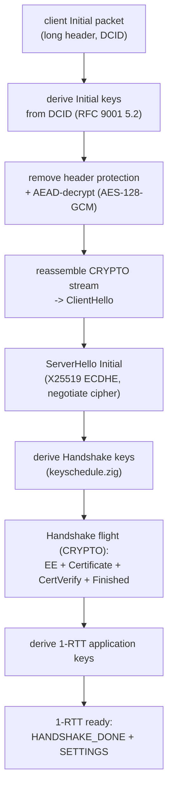
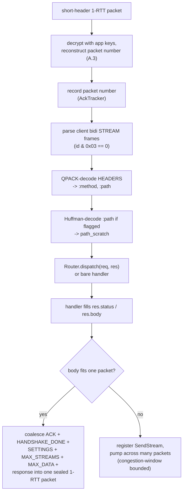
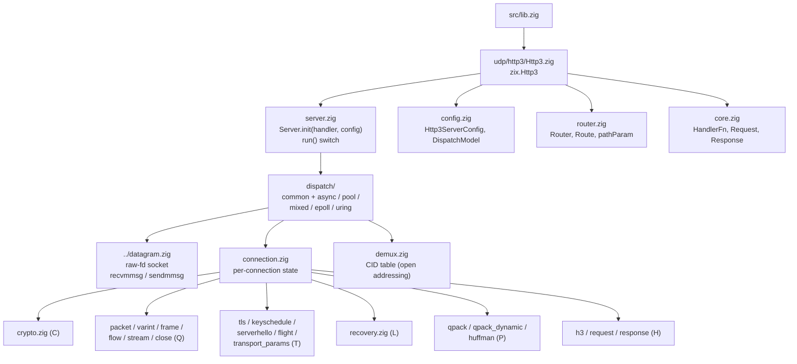

# HLD: zix.Http3

Pure-Zig HTTP/3 (RFC 9114) server over QUIC (RFC 9000 / 9001 / 9002), built on the `zix.Udp` datagram substrate. TLS 1.3 is mandatory: QUIC has no cleartext mode. No OpenSSL, all crypto rides `std.crypto`.

---

## Goals

- One coherent engine family: the same comptime `Router`, the same `DispatchModel` enum, and the same `Tls.Context` as `zix.Http1` / `zix.Http2`.
- Pure-Zig from the RFCs: the QUIC transport, packet protection, TLS 1.3 handshake glue, and QPACK header compression are all written from the specifications and proven byte-exact against the RFC worked examples in-file.
- The server is the product, the primitives are exposed: the low-level QUIC / TLS / QPACK building blocks are public so a peer (a hand-rolled client, a test harness) can build the other side of the wire, mirroring how `zix.Http2` exposes its frame / HPACK primitives.
- Explicit over implicit: every behavior named in config, `dispatch_model` required with no default.
- Separation of concern: `src/udp/http3/` sits on `src/udp/datagram.zig` (the raw datagram socket) and reuses `src/tls/` for the TLS 1.3 message builders and key schedule.

---

## Runtime Model

### Handshake (the server send path)

QUIC carries the TLS 1.3 handshake inside CRYPTO frames, not TLS records: QUIC packet protection replaces TLS record protection (RFC 9001 section 4).



### Request / response (1-RTT)



---

## Source Layout

Doc comments tag each file by layer: C (crypto bottom), Q (QUIC transport), T (TLS-over-QUIC glue), P (QPACK), L (loss recovery), H (HTTP/3 semantics).



---

## Public API

Access via `const zix = @import("zix");`

| Symbol | Type | Description |
| :- | :- | :- |
| `zix.Http3.Server` | struct | `Server.init(handler, config)` returns the server, the handler baked in at comptime |
| `zix.Http3.HandlerFn` | fn type | `fn(req: *const Request, res: *Response) void` |
| `zix.Http3.Request` | struct | Decoded request: `method`, `path`, `authority`, `body` |
| `zix.Http3.Response` | struct | Handler-filled response: `status`, `body`, `content_type` |
| `zix.Http3.ServerConfig` | struct | Server configuration (`Http3ServerConfig`) |
| `zix.Http3.DispatchModel` | enum(u8) | Shared with the TCP engines (ADR-050) |
| `zix.Http3.Router(routes)` | generic fn | Comptime route table, mirrors `zix.Http1` / `zix.Http2` |
| `zix.Http3.Route` | struct | `path`, `handler`, `kind` (EXACT / PARAM / PREFIX) |
| `zix.Http3.pathParam(name)` | fn | Look up a `:name` segment captured by a PARAM route |

Low-level primitives, exposed so a peer can build the other side of the wire: `crypto`, `protection`, `keyschedule`, `qpack`, `huffman`, `packet`, `varint`, `frame`, plus `tls_key_schedule`.

### Server methods

| Method | Description |
| :- | :- |
| `init(handler, config)` | Stores the config, no validation and no error. Mirrors `zix.Http1.Server.init`. |
| `run()` | Validates first (`error.PortNotConfigured` on a zero port, `error.TlsRequired` on a null TLS context), then binds and serves on the model in `config.dispatch_model`. Blocks until an error. Linux-only. |
| `deinit()` | Release resources (no-op today, kept for API symmetry). |

---

## Http3ServerConfig

```zig
pub const Http3ServerConfig = struct {
    io:        std.Io,             // caller-owned, must outlive the server
    allocator: std.mem.Allocator,  // general-purpose (e.g. std.heap.smp_allocator)
    ip:        []const u8,         // bind address
    port:      u16,                // bind port, must be non-zero

    dispatch_model: DispatchModel, // required, no default (ADR-050)
    workers:        usize = 0,     // per-core models: 0 = one worker per CPU
    recv_batch:     usize = 32,    // recvmmsg: datagrams per syscall
    send_batch:     usize = 32,    // sendmmsg: packets coalesced per flush
    max_recv_buf:   usize = 1500,  // receive buffer per slot, common Ethernet MTU

    busy_poll_us:            u32   = 0,          // SO_BUSY_POLL spin window (0 = unset)
    reuseport_cbpf:          bool  = false,      // steer by receiving CPU instead of 4-tuple hash, see note below
    worker_stack_size_bytes: usize = 512 * 1024, // per-core worker thread stack
    socket_rcvbuf:           usize = 4 * 1024 * 1024, // requested SO_RCVBUF (kernel clamps)
    socket_sndbuf:           usize = 4 * 1024 * 1024, // requested SO_SNDBUF (kernel clamps)
    gso_enabled:             bool  = true,       // UDP GSO on send, probed at worker start

    tls: ?*Tls.Context = null, // TLS 1.3 context (cert / key / ALPN), required, null rejected at run

    cid_len:              u8    = 8,     // server-issued connection-id length (RFC 9000 5.1)
    max_idle_ms:          u32   = 30000, // idle timeout (RFC 9000 10.1)
    max_streams:          u32   = 128,   // concurrent request streams (RFC 9000 4.6)
    max_datagram_size:    u64   = 1200,  // 1-RTT datagram target (clamped by peer + 16 KiB ceiling)
    max_stream_chunk:     usize = 0,     // STREAM payload cap per packet, 0 = derive from datagram size
    max_inflight_packets: usize = 128,   // congestion-window ceiling / loss-log depth (RFC 9002)
    initial_window_packets: usize = 32,  // initial congestion window in packets (RFC default is 10)

    logger: ?*Logger = null, // lifecycle events via logger.system() when set
};
```

`io`, `allocator`, `ip`, `port`, and `dispatch_model` are required (no defaults). `tls` defaults to `null` but is rejected at `init`: a QUIC server must present a TLS 1.3 certificate. `DispatchModel` is re-used from the TCP config, not defined here.

`reuseport_cbpf` (ADR-061) stays available here but keep it `false`: per-packet CPU steering breaks QUIC flow affinity (a connection's packets land on workers without its state), measured as a heavy throughput drop with zero failed requests. The TCP engines are the value case for this field, not `zix.Http3`.

---

## Router / Route

The router is the same shape as `zix.Http1` / `zix.Http2`: a comptime table dispatched on the decoded request path.

```zig
const Routes = zix.Http3.Router(&[_]zix.Http3.Route{
    .{ .path = "/",          .handler = home },
    .{ .path = "/users/:id", .handler = user, .kind = .PARAM },
    .{ .path = "/static",    .handler = files, .kind = .PREFIX },
});

var server = zix.Http3.Server.init(Routes.dispatch, config);
```

| Kind | Match | Lookup |
| :- | :- | :- |
| `EXACT` (default) | Whole path equals the route | `std.StaticStringMap`, O(1) |
| `PARAM` | `:name` segments capture, other segments must match | first registered match wins, read with `pathParam("name")` |
| `PREFIX` | Longest registered prefix on a `/` boundary | longest match wins |

The query string is stripped before matching (matching sees the path up to `?`), the handler still receives the full path. An unmatched path returns `404 Not Found`. `Routes.dispatch` is itself a `HandlerFn`, so it plugs straight into `Server.init`. A single bare handler works too (no router).

---

## Request / Response

```zig
pub const Request = struct {
    method:    []const u8,
    path:      []const u8,
    authority: []const u8 = "",
    body:      []const u8 = "",
};

pub const Response = struct {
    status:       u16        = 200,
    body:         []const u8 = "",
    content_type: []const u8 = "text/plain",

    pub fn setStatus(self: *Response, status: u16) void { self.status = status; }
    pub fn send(self: *Response, body: []const u8) void { self.body = body; }
};
```

The request slices point into the engine's per-connection decode buffer and are valid only for the duration of the handler call. On the current serve path only `method` and `path` are populated from the wire (`authority` and `body` keep their defaults). The response body is copied into the send path after the handler returns, so it may point at handler-owned or static memory (see the example's threadlocal scratch and process-lifetime `big_body`). `content_type` is part of the handler API but the v1 response path only QPACK-encodes `:status` on the wire.

---

## Dispatch Models

`dispatch_model` selects the worker shape. All models are Linux-only: a non-Linux build logs a notice and returns (HTTP/3 needs the Linux datagram path).

| Model | Shape |
| :- | :- |
| `.ASYNC` | One single-worker recv loop on the calling thread. One CID table owns every connection, so a client 4-tuple change (connection migration) is just a new peer address on the same connection id. Migration-safe. |
| `.POOL`, `.MIXED` | Multi-core: one SO_REUSEPORT `recvmmsg` blocking worker per CPU, each pinned to its core and owning its own CID table (shared-nothing). The kernel load-balances by 4-tuple. |
| `.EPOLL` | The per-core shape plus epoll readiness (drain-to-EAGAIN). |
| `.URING` | The per-core shape plus a real io_uring completion loop. Folds to the epoll worker loop per-worker when io_uring is unavailable (a capability fold, not model-mixing). |

The single-worker `.ASYNC` model is the migration-safe reference. The per-core models fan out by 4-tuple hash, which is correct for a stateless request / response workload but is not connection-migration-safe on its own: a migrated datagram can hash to a worker that does not hold the connection. Per-core connection-id steering is deferred (ADR-049 phase 3).

`workers` picks the per-core worker count (0 means one per available CPU, honoring cgroup / taskset affinity). Each worker owns its own datagram socket, CID table, and receive / send batches, with no cross-worker locking on the hot path.

---

## Handshake Overview

QUIC folds TLS 1.3 into the transport. The deterministic layers are pure-Zig from the RFCs, the TLS 1.3 message builders and key schedule are the existing, tested `src/tls/` code, only the framing changes (raw handshake bytes go into a CRYPTO frame instead of a TLS record).

| Step | What happens |
| :- | :- |
| Initial keys | Derived from the client's Destination Connection ID (RFC 9001 5.2), AES-128-GCM. |
| ClientHello | Reassembled from CRYPTO frames, X25519 key share and transport parameters read out. |
| ServerHello | X25519 ECDHE, cipher / group negotiation, sealed into an Initial packet. Handshake keys derived. |
| Handshake flight | EncryptedExtensions (ALPN `h3` + `quic_transport_parameters`), Certificate, CertificateVerify, Finished, all in one CRYPTO frame sealed with the Handshake keys. 1-RTT application keys derived. |
| 1-RTT | Short-header packets, application keys, requests served. |

The certificate can be ECDSA P-256, Ed25519, or RSA, from the same `Tls.Context` as the TCP engines (an RSA cert signs with `rsa_pss_rsae_sha256`). 0-RTT is rejected by default.

---

## Header Compression (QPACK)

The live path uses the QPACK static table plus literals only (RFC 9204). Requests are decoded, responses encoded, both with a Required-Insert-Count-0 / Base-0 field-section prefix (the two-zero-byte static-only prefix).

- Request decode: pulls `:method`, `:path`, and `accept-encoding` out of the HEADERS field section (indexed field line, or literal field line with a static name reference). A Huffman-encoded `:path` or `accept-encoding` value is decoded (RFC 7541 Appendix B) into scratch. `accept-encoding` is what a handler negotiates a pre-compressed response against.
- Response encode: maps the status code to a static-table index for `{103, 200, 304, 404, 503}` (default 200) and, when the handler set `content_encoding`, appends the indexed `content-encoding` line (static index 42 br / 43 gzip), inside an HTTP/3 HEADERS frame followed by a DATA frame. The engine emits the header only: it never compresses, the handler serves an already-coded body.

The QPACK dynamic table is fully implemented and tested but not wired into the serve path: there is no non-zero dynamic-capacity config, so the encoder / decoder stay static-only.

---

## Flow Control and Loss Recovery

The 1-RTT send path respects the client's advertised limits and a real NewReno congestion controller.

- Flow control, send side: the server reads the client's `initial_max_data` and `initial_max_stream_data_bidi_local` from its transport parameters and never sends response bytes past them.
- Flow control, receive side: both one-time handshake budgets the server advertises are rolled forward as the client spends them, MAX_STREAMS for the bidirectional stream count and MAX_DATA for the connection-wide request bytes. Each grant rides a reply once consumption crosses half its window, so a long-lived connection never stalls on stream credit and never deadlocks once the byte budget (`initial_max_data`) is spent.
- Loss recovery (RFC 9002): an RTT estimator, packet-reordering and time thresholds, a Probe Timeout with backoff, and a NewReno congestion window. A large response body is pumped across many 1-RTT packets bounded by the congestion window.

Detail lives in [`docs/lld-http3-en.md`](lld-http3-en.md).

---

## Memory Model

| Scope | Allocator | Lifetime |
| :- | :- | :- |
| CID table (`demux.Table`) | `config.allocator` | Server process lifetime, one per worker |
| Per-connection state (`Connection`) | inside the CID table slot | Connection lifetime, fixed-size (no per-packet heap) |
| Receive / send batches | `config.allocator` | Worker lifetime |
| Decode scratch (`app_payload_buf`, `path_scratch`) | inside `Connection` | Reused per packet |

The allocator must be general-purpose (e.g. `std.heap.smp_allocator`), the same requirement as the rest of the engine family. The CID table is fixed-capacity (256 connections per worker) with no per-packet allocation: a full table drops a new connection rather than growing.

---

## RFC Notes

- **RFC 9000 (QUIC transport)**: long / short headers, packet number reconstruction (Appendix A.3), variable-length integers (section 16), frames, streams, flow control, connection close, transport parameters.
- **RFC 9001 (QUIC-TLS)**: Initial secret derivation, packet protection (header protection + AEAD), the CRYPTO-frame handshake, key update.
- **RFC 9002 (QUIC recovery)**: RTT estimation, loss detection, Probe Timeout, NewReno congestion control.
- **RFC 9114 (HTTP/3)**: the framing and semantics layer (HEADERS / DATA / SETTINGS, control stream, message validation).
- **RFC 9204 (QPACK)** and **RFC 7541 (Huffman table)**: header compression.
- **RFC 8446 (TLS 1.3)**: the handshake and key schedule, reused from `src/tls/`.

---

## Not Yet Wired (deferred, RFC-completeness)

Several layers are implemented and unit-tested against the RFC vectors but not yet driven by the serve path. They are the building blocks for the next phase, kept as the full-RFC reference.

| Area | Note |
| :- | :- |
| QPACK dynamic table (`qpack_dynamic.zig`) | Static-only live path, no non-zero capacity config |
| HTTP/3 semantics layer (`h3.zig`) | Control-stream state machine, GOAWAY, full message validation. Live path handles minimal framing inline |
| QUIC streams / CID pool (`stream.zig`) | Send / receive state machines and NEW_CONNECTION_ID, for migration and CID pooling |
| ChaCha20-Poly1305, Retry, key update (`crypto.zig`) | Live path is AES-128-GCM only |
| Per-core CID steering | ADR-049 phase 3: per-core connection-id routing so the per-core models are migration-safe |

See ADR-049 / ADR-050 (`docs/adr-en.md`).

---

###### end of hld-http3
