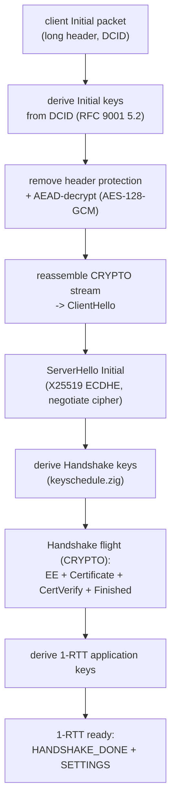
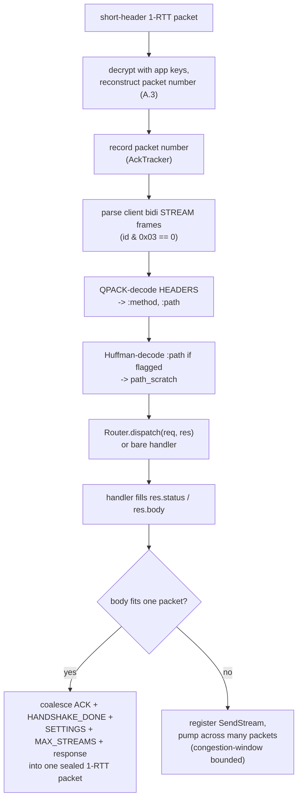
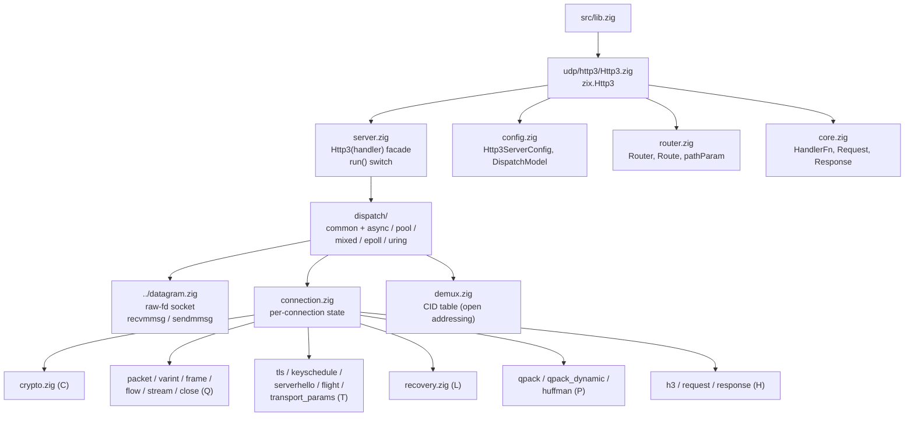

# HLD: zix.Http3

Server HTTP/3 (RFC 9114) pure-Zig di atas QUIC (RFC 9000 / 9001 / 9002), dibangun di atas substrat datagram `zix.Udp`. TLS 1.3 wajib: QUIC tidak punya mode cleartext. Tanpa OpenSSL, semua kripto memakai `std.crypto`.

---

## Tujuan

- Satu keluarga engine yang konsisten: `Router` comptime yang sama, enum `DispatchModel` yang sama, dan `Tls.Context` yang sama seperti `zix.Http1` / `zix.Http2`.
- Pure-Zig dari RFC: transport QUIC, packet protection, glue handshake TLS 1.3, dan kompresi header QPACK semuanya ditulis dari spesifikasi dan dibuktikan byte-exact terhadap worked example RFC di dalam file.
- Server adalah produknya, primitive diekspos: building block QUIC / TLS / QPACK level rendah bersifat public sehingga sebuah peer (client buatan sendiri, test harness) dapat membangun sisi lain dari wire, mencerminkan cara `zix.Http2` mengekspos primitive frame / HPACK-nya.
- Eksplisit bukan implisit: setiap perilaku disebutkan dalam konfigurasi, `dispatch_model` wajib tanpa default.
- Pemisahan tanggung jawab: `src/udp/http3/` berada di atas `src/udp/datagram.zig` (socket datagram raw) dan memakai ulang `src/tls/` untuk builder pesan TLS 1.3 dan key schedule.

---

## Runtime Model

### Handshake (jalur kirim server)

QUIC membawa handshake TLS 1.3 di dalam CRYPTO frame, bukan TLS record: packet protection QUIC menggantikan record protection TLS (RFC 9001 bagian 4).



### Request / response (1-RTT)



---

## Source Layout

Doc comment menandai tiap file dengan layer-nya: C (dasar kripto), Q (transport QUIC), T (glue TLS-over-QUIC), P (QPACK), L (loss recovery), H (semantik HTTP/3).



---

## Public API

Akses via `const zix = @import("zix");`

| Symbol | Tipe | Deskripsi |
| :- | :- | :- |
| `zix.Http3.Http3(handler)` | generic fn | Mengembalikan tipe server HTTP/3, handler dibaked saat comptime |
| `zix.Http3.HandlerFn` | fn type | `fn(req: *const Request, res: *Response) void` |
| `zix.Http3.Request` | struct | Request terdekode: `method`, `path`, `authority`, `body` |
| `zix.Http3.Response` | struct | Response yang diisi handler: `status`, `body`, `content_type` |
| `zix.Http3.ServerConfig` | struct | Konfigurasi server (`Http3ServerConfig`) |
| `zix.Http3.DispatchModel` | enum(u8) | Dibagi dengan engine TCP (ADR-050) |
| `zix.Http3.Router(routes)` | generic fn | Route table comptime, mencerminkan `zix.Http1` / `zix.Http2` |
| `zix.Http3.Route` | struct | `path`, `handler`, `kind` (EXACT / PARAM / PREFIX) |
| `zix.Http3.pathParam(name)` | fn | Ambil segmen `:name` yang ditangkap route PARAM |

Primitive level rendah, diekspos agar sebuah peer dapat membangun sisi lain dari wire: `crypto`, `protection`, `keyschedule`, `qpack`, `huffman`, `packet`, `varint`, `frame`, plus `tls_key_schedule`.

### Method Http3(handler)

| Method | Deskripsi |
| :- | :- |
| `init(config)` | Menolak port nol (`error.PortNotConfigured`) dan TLS context null (`error.TlsRequired`). Validasi terjadi di `init`, bukan `run`. |
| `run()` | Bind dan serve pada model di `config.dispatch_model`. Blok sampai error. Linux-only. |
| `deinit()` | Melepas resource (no-op saat ini, disimpan untuk simetri API). |

---

## Http3ServerConfig

```zig
pub const Http3ServerConfig = struct {
    io:        std.Io,             // milik caller, harus hidup lebih lama dari server
    allocator: std.mem.Allocator,  // general-purpose (mis. std.heap.smp_allocator)
    ip:        []const u8,         // bind address
    port:      u16,                // bind port, harus non-zero

    dispatch_model: DispatchModel, // wajib, tanpa default (ADR-050)
    workers:        usize = 0,     // model per-core: 0 = satu worker per CPU
    recv_batch:     usize = 32,    // recvmmsg: datagram per syscall
    send_batch:     usize = 32,    // sendmmsg: packet digabung per flush
    max_recv_buf:   usize = 1500,  // buffer receive per slot, MTU Ethernet umum

    busy_poll_us:            u32   = 0,          // window spin SO_BUSY_POLL (0 = tidak diset)
    worker_stack_size_bytes: usize = 512 * 1024, // stack thread worker per-core
    socket_rcvbuf:           usize = 4 * 1024 * 1024, // SO_RCVBUF yang diminta (kernel clamp)
    socket_sndbuf:           usize = 4 * 1024 * 1024, // SO_SNDBUF yang diminta (kernel clamp)
    gso_enabled:             bool  = true,       // UDP GSO saat kirim, diprobe saat worker mulai

    tls: ?*Tls.Context = null, // TLS 1.3 context (cert / key / ALPN), wajib, null ditolak di init

    cid_len:              u8    = 8,     // panjang connection-id terbitan server (RFC 9000 5.1)
    max_idle_ms:          u32   = 30000, // idle timeout (RFC 9000 10.1)
    max_streams:          u32   = 128,   // request stream konkuren (RFC 9000 4.6)
    max_datagram_size:    u64   = 1200,  // target datagram 1-RTT (di-clamp peer + ceiling 16 KiB)
    max_stream_chunk:     usize = 0,     // cap payload STREAM per packet, 0 = turunkan dari ukuran datagram
    max_inflight_packets: usize = 128,   // ceiling congestion-window / kedalaman loss-log (RFC 9002)
    initial_window_packets: usize = 32,  // congestion window awal dalam packet (default RFC = 10)

    logger: ?*Logger = null, // event lifecycle via logger.system() saat diset
};
```

`io`, `allocator`, `ip`, `port`, dan `dispatch_model` wajib (tanpa default). `tls` default `null` tetapi ditolak di `init`: server QUIC harus menyajikan sertifikat TLS 1.3. `DispatchModel` dipakai ulang dari config TCP, bukan didefinisikan di sini.

---

## Router / Route

Router-nya berbentuk sama seperti `zix.Http1` / `zix.Http2`: sebuah table comptime yang di-dispatch pada path request terdekode.

```zig
const Routes = zix.Http3.Router(&[_]zix.Http3.Route{
    .{ .path = "/",          .handler = home },
    .{ .path = "/users/:id", .handler = user, .kind = .PARAM },
    .{ .path = "/static",    .handler = files, .kind = .PREFIX },
});

const Server = zix.Http3.Http3(Routes.dispatch);
```

| Kind | Match | Lookup |
| :- | :- | :- |
| `EXACT` (default) | Seluruh path sama dengan route | `std.StaticStringMap`, O(1) |
| `PARAM` | Segmen `:name` menangkap, segmen lain harus cocok persis | match pertama terdaftar menang, dibaca dengan `pathParam("name")` |
| `PREFIX` | Prefix terdaftar terpanjang pada batas `/` | match terpanjang menang |

Query string di-strip sebelum matching (matching melihat path sampai `?`), handler tetap menerima path penuh. Path yang tidak cocok mengembalikan `404 Not Found`. `Routes.dispatch` sendiri adalah `HandlerFn`, jadi langsung terpasang ke `Http3(handler)`. Satu handler tunggal juga bekerja (tanpa router).

---

## Request / Response

```zig
pub const Request = struct {
    method:    []const u8,
    path:      []const u8,
    authority: []const u8 = "",
    body:      []const u8 = "",
};

pub const Response = struct {
    status:       u16        = 200,
    body:         []const u8 = "",
    content_type: []const u8 = "text/plain",

    pub fn setStatus(self: *Response, status: u16) void { self.status = status; }
    pub fn send(self: *Response, body: []const u8) void { self.body = body; }
};
```

Slice request menunjuk ke buffer dekode per-connection engine dan hanya valid selama pemanggilan handler. Pada jalur serve saat ini hanya `method` dan `path` yang diisi dari wire (`authority` dan `body` tetap default). Body response disalin ke jalur kirim setelah handler kembali, jadi boleh menunjuk ke memori milik handler atau memori static (lihat scratch threadlocal dan `big_body` process-lifetime di contoh). `content_type` adalah bagian dari API handler tetapi jalur response v1 hanya meng-QPACK-encode `:status` di wire.

---

## Dispatch Model

`dispatch_model` memilih bentuk worker. Semua model Linux-only: build non-Linux mencatat notice lalu return (HTTP/3 butuh jalur datagram Linux).

| Model | Bentuk |
| :- | :- |
| `.ASYNC` | Satu loop recv single-worker di thread pemanggil. Satu CID table memiliki setiap connection, jadi perubahan 4-tuple client (connection migration) hanyalah peer address baru pada connection yang sama. Migration-safe. |
| `.POOL`, `.MIXED` | Multi-core: satu worker blocking `recvmmsg` SO_REUSEPORT per CPU, masing-masing dipin ke core-nya dan memiliki CID table sendiri (shared-nothing). Kernel load-balance berdasarkan 4-tuple. |
| `.EPOLL` | Bentuk per-core plus readiness epoll (drain-to-EAGAIN). |
| `.URING` | Bentuk per-core plus loop completion io_uring nyata. Fold ke loop worker epoll per-worker saat io_uring tidak tersedia (capability fold, bukan pencampuran model). |

Model single-worker `.ASYNC` adalah referensi yang migration-safe. Model per-core mem-fan-out berdasarkan hash 4-tuple, yang benar untuk workload request / response stateless tetapi belum migration-safe sendiri: datagram yang bermigrasi bisa ter-hash ke worker yang tidak memegang connection tersebut. Connection-id steering per-core ditunda (ADR-049 fase 3).

`workers` memilih jumlah worker per-core (0 berarti satu per CPU tersedia, menghormati afinitas cgroup / taskset). Tiap worker memiliki socket datagram, CID table, serta batch receive / send sendiri, tanpa locking antar-worker di hot path.

---

## Ringkasan Handshake

QUIC melipat TLS 1.3 ke dalam transport. Layer deterministik pure-Zig dari RFC, builder pesan TLS 1.3 dan key schedule adalah kode `src/tls/` yang sudah ada dan teruji, hanya framing yang berubah (byte handshake raw masuk ke CRYPTO frame, bukan TLS record).

| Langkah | Yang terjadi |
| :- | :- |
| Initial keys | Diturunkan dari Destination Connection ID client (RFC 9001 5.2), AES-128-GCM. |
| ClientHello | Direassembly dari CRYPTO frame, X25519 key share dan transport parameter dibaca. |
| ServerHello | X25519 ECDHE, negosiasi cipher / group, di-seal ke Initial packet. Handshake keys diturunkan. |
| Handshake flight | EncryptedExtensions (ALPN `h3` + `quic_transport_parameters`), Certificate, CertificateVerify, Finished, semuanya dalam satu CRYPTO frame yang di-seal dengan Handshake keys. Application keys 1-RTT diturunkan. |
| 1-RTT | Short-header packet, application keys, request dilayani. |

Sertifikat bisa ECDSA P-256, Ed25519, atau RSA, dari `Tls.Context` yang sama seperti engine TCP (sertifikat RSA menandatangani dengan `rsa_pss_rsae_sha256`). 0-RTT ditolak secara default.

---

## Kompresi Header (QPACK)

Jalur live memakai QPACK static table plus literal saja (RFC 9204). Request didekode, response diencode, keduanya dengan field-section prefix Required-Insert-Count-0 / Base-0 (prefix dua-byte-nol static-only).

- Decode request: menarik `:method` dan `:path` dari field section HEADERS (indexed field line, atau literal field line dengan static name reference). `:path` yang ter-Huffman-encode didekode (RFC 7541 Appendix B) ke scratch per-connection.
- Encode response: memetakan status code ke indeks static table untuk `{103, 200, 304, 404, 503}` (default 200), di dalam HTTP/3 HEADERS frame diikuti DATA frame.

QPACK dynamic table terimplementasi penuh dan teruji tetapi belum diwire ke jalur serve: tidak ada config dynamic-capacity non-zero, jadi encoder / decoder tetap static-only.

---

## Flow Control dan Loss Recovery

Jalur kirim 1-RTT menghormati limit yang diiklankan client dan sebuah congestion controller NewReno nyata.

- Flow control: server membaca `initial_max_data` dan `initial_max_stream_data_bidi_local` client dari transport parameter-nya, dan menggulir bidirectional stream credit maju dengan MAX_STREAMS saat request stream pensiun, sehingga connection tidak stall setelah allowance awal habis.
- Loss recovery (RFC 9002): RTT estimator, threshold packet-reordering dan waktu, Probe Timeout dengan backoff, dan congestion window NewReno. Body response besar dipump lintas banyak packet 1-RTT dibatasi congestion window.

Detail ada di [`docs/lld-http3-id.md`](lld-http3-id.md).

---

## Memory Model

| Scope | Allocator | Lifetime |
| :- | :- | :- |
| CID table (`demux.Table`) | `config.allocator` | Lifetime proses server, satu per worker |
| State per-connection (`Connection`) | di dalam slot CID table | Lifetime connection, ukuran tetap (tanpa heap per-packet) |
| Batch receive / send | `config.allocator` | Lifetime worker |
| Scratch dekode (`app_payload_buf`, `path_scratch`) | di dalam `Connection` | Dipakai ulang per packet |

Allocator harus general-purpose (mis. `std.heap.smp_allocator`), syarat yang sama seperti keluarga engine lainnya. CID table berkapasitas tetap (256 connection per worker) tanpa alokasi per-packet: table penuh men-drop connection baru alih-alih tumbuh.

---

## Catatan RFC

- **RFC 9000 (QUIC transport)**: long / short header, rekonstruksi packet number (Appendix A.3), variable-length integer (bagian 16), frame, stream, flow control, connection close, transport parameter.
- **RFC 9001 (QUIC-TLS)**: derivasi Initial secret, packet protection (header protection + AEAD), handshake CRYPTO-frame, key update.
- **RFC 9002 (QUIC recovery)**: estimasi RTT, loss detection, Probe Timeout, congestion control NewReno.
- **RFC 9114 (HTTP/3)**: layer framing dan semantik (HEADERS / DATA / SETTINGS, control stream, validasi pesan).
- **RFC 9204 (QPACK)** dan **RFC 7541 (tabel Huffman)**: kompresi header.
- **RFC 8446 (TLS 1.3)**: handshake dan key schedule, dipakai ulang dari `src/tls/`.

---

## Belum Diwire (ditunda, kelengkapan RFC)

Beberapa layer terimplementasi dan diuji-unit terhadap vektor RFC tetapi belum didorong jalur serve. Mereka adalah building block untuk fase berikutnya, disimpan sebagai referensi full-RFC.

| Area | Catatan |
| :- | :- |
| QPACK dynamic table (`qpack_dynamic.zig`) | Jalur live static-only, tanpa config kapasitas non-zero |
| Layer semantik HTTP/3 (`h3.zig`) | State machine control-stream, GOAWAY, validasi pesan penuh. Jalur live menangani framing minimal inline |
| Stream QUIC / CID pool (`stream.zig`) | State machine send / receive dan NEW_CONNECTION_ID, untuk migration dan CID pooling |
| ChaCha20-Poly1305, Retry, key update (`crypto.zig`) | Jalur live AES-128-GCM saja |
| CID steering per-core | ADR-049 fase 3: routing connection-id per-core sehingga model per-core menjadi migration-safe |

Lihat ADR-049 / ADR-050 (`docs/adr-id.md`).

---

###### end of hld-http3
