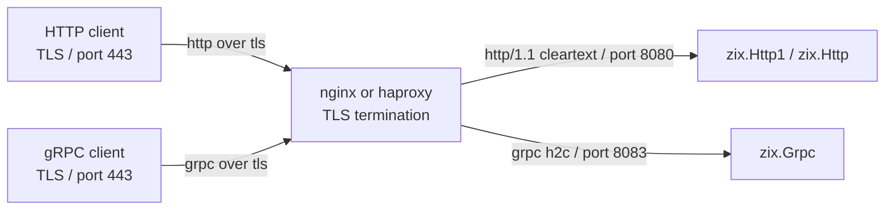

# Reverse proxy: nginx and haproxy in front of zix

`zix.Http1`, `zix.Http`, and `zix.Grpc` all serve TLS natively (set `tls: ?*Tls.Context`, see [`docs/hld-tls-en.md`](hld-tls-en.md)). Putting nginx or haproxy in front is an option, not a requirement, and it is the right call when you want TLS offload onto the proxy, host or path routing, load balancing across backends, or sharing port 443 with other services. The zix server then runs cleartext behind the proxy: HTTP/1.1 for `zix.Http1` / `zix.Http`, or h2c (HTTP/2 cleartext) for `zix.Grpc`. External clients connect to the proxy over TLS, and the proxy forwards to the backend.

## Architecture



Port numbers below are examples: `8080` for the HTTP backend, `8083` for the gRPC backend. Match them to your `config.port`.

## HTTP/1 (`zix.Http1` and `zix.Http`)

The backend runs plain HTTP/1.1 (no `tls`). The proxy terminates TLS and forwards.

### nginx

nginx 1.25.1 and later use the `http2 on;` directive. On older builds use the `listen ... http2` form noted below.

```nginx
server {
    listen 443 ssl;
    http2 on;
    server_name example.com;

    ssl_certificate     /etc/ssl/certs/example.com.crt;
    ssl_certificate_key /etc/ssl/private/example.com.key;
    ssl_protocols       TLSv1.2 TLSv1.3;
    ssl_ciphers         HIGH:!aNULL:!MD5;

    location / {
        proxy_pass http://127.0.0.1:8080;
        proxy_http_version 1.1;

        # Forward the real client context to the backend.
        proxy_set_header Host              $host;
        proxy_set_header X-Real-IP         $remote_addr;
        proxy_set_header X-Forwarded-For   $proxy_add_x_forwarded_for;
        proxy_set_header X-Forwarded-Proto $scheme;

        # Reuse upstream connections (keep-alive to the backend).
        proxy_set_header Connection "";

        proxy_read_timeout 60s;
        proxy_send_timeout 60s;
    }
}
```

Older nginx (before 1.25.1) replaces the first two lines with one:

```nginx
    listen 443 ssl http2;
```

Key directives:

| Directive | Notes |
| :- | :- |
| `proxy_pass http://` | Forward cleartext HTTP/1.1 to the backend |
| `proxy_http_version 1.1` | Required so upstream keep-alive works |
| `proxy_set_header Connection ""` | Clears the hop-by-hop header so the backend connection is reused |
| `X-Forwarded-*` | The backend reads these for the real client IP and scheme |

Upstream keep-alive and load balancing:

```nginx
upstream zix_http {
    server 127.0.0.1:8080;
    server 127.0.0.1:8081;
    keepalive 64;
}

server {
    # ... ssl + http2 as above ...
    location / {
        proxy_pass http://zix_http;
        proxy_http_version 1.1;
        proxy_set_header Connection "";
    }
}
```

### haproxy

haproxy 2.4 or later. The backend speaks HTTP/1.1 cleartext.

```haproxy
global
    maxconn 8192

defaults
    mode    http
    timeout connect 5s
    timeout client  60s
    timeout server  60s
    option  http-keep-alive

frontend http_tls
    bind *:443 ssl crt /etc/ssl/private/example.com.pem alpn h2,http/1.1
    http-request set-header X-Forwarded-Proto https
    default_backend zix_http

backend zix_http
    balance roundrobin
    server zix1 127.0.0.1:8080
    server zix2 127.0.0.1:8081
```

Key settings:

| Setting | Notes |
| :- | :- |
| `bind *:443 ssl crt ... alpn h2,http/1.1` | TLS on the frontend, ALPN lets clients pick h2 or http/1.1 |
| `mode http` | haproxy parses HTTP and reuses backend connections |
| `option http-keep-alive` | Keep-alive to the backend |
| no `proto h2` on the server | The HTTP/1 backend stays HTTP/1.1 (gRPC differs, below) |
| `X-Forwarded-Proto https` | Tells the backend the original scheme was TLS |

## gRPC (`zix.Grpc`, HTTP/2)

The backend runs h2c (HTTP/2 cleartext). The proxy terminates TLS and forwards as h2c.

### nginx

Requires nginx compiled with `--with-http_v2_module` and `--with-http_ssl_module` (standard in most distributions).

```nginx
server {
    listen 443 ssl;
    http2 on;
    server_name example.com;

    ssl_certificate     /etc/ssl/certs/example.com.crt;
    ssl_certificate_key /etc/ssl/private/example.com.key;
    ssl_protocols       TLSv1.2 TLSv1.3;
    ssl_ciphers         HIGH:!aNULL:!MD5;

    location / {
        grpc_pass grpc://127.0.0.1:8083;

        # Long-lived streaming RPCs.
        grpc_read_timeout    3600s;
        grpc_send_timeout    3600s;
        grpc_connect_timeout 5s;
    }
}
```

Key directives:

| Directive | Notes |
| :- | :- |
| `grpc_pass grpc://` | Forward as h2c (cleartext) to the backend |
| `grpc_pass grpcs://` | Forward as h2 (TLS) to the backend, not needed here |
| `grpc_read_timeout` | Increase for server-streaming and bidirectional RPCs |
| `grpc_send_timeout` | Increase for client-streaming RPCs |

Load balancing:

```nginx
upstream grpc_backend {
    server 127.0.0.1:8083;
    server 127.0.0.1:8084;
    keepalive 16;
}

server {
    # ... ssl + http2 as above ...
    location / {
        grpc_pass grpc://grpc_backend;
    }
}
```

### haproxy

haproxy 2.0 or later for full HTTP/2 / gRPC support.

```haproxy
global
    maxconn 4096

defaults
    mode    http
    timeout connect 5s
    timeout client  3600s
    timeout server  3600s
    option  http-server-close

frontend grpc_tls
    bind *:443 ssl crt /etc/ssl/private/example.com.pem alpn h2,http/1.1
    default_backend grpc_backend

backend grpc_backend
    balance roundrobin
    server zix1 127.0.0.1:8083 proto h2
    server zix2 127.0.0.1:8084 proto h2
```

Key settings:

| Setting | Notes |
| :- | :- |
| `bind *:443 ssl crt ... alpn h2,http/1.1` | TLS with ALPN advertising h2 |
| `proto h2` on the server | Send h2c (cleartext HTTP/2) to the backend |
| `timeout client 3600s` | Required for long-lived streaming RPCs |
| `timeout server 3600s` | Required for long-lived streaming RPCs |

A single haproxy certificate file (`crt`) is the PEM that concatenates the certificate and private key. nginx uses separate `ssl_certificate` and `ssl_certificate_key` files.

### Streaming RPC timeout guidance

| RPC type | Recommended timeout |
| :- | :- |
| Unary | 30-60s |
| Server streaming | 3600s (or stream duration) |
| Client streaming | 3600s (or stream duration) |
| Bidirectional | 3600s (or session duration) |

Set `grpc-timeout` in the client request to propagate deadlines end-to-end. `zix.Grpc.parseTimeout` parses the header value on the server side.
