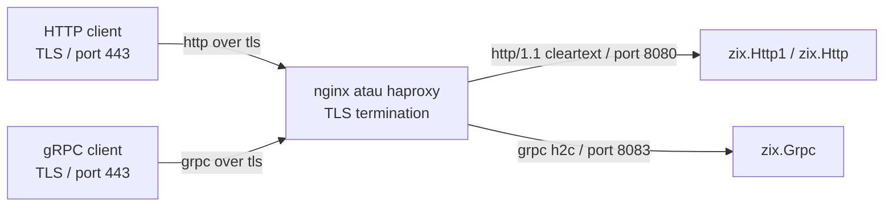

# Reverse proxy: nginx dan haproxy di depan zix

`zix.Http1`, `zix.Http`, dan `zix.Grpc` semua melayani TLS secara native (set `tls: ?*Tls.Context`, lihat [`docs/hld-tls-id.md`](hld-tls-id.md)). Menaruh nginx atau haproxy di depan adalah opsi, bukan keharusan, dan menjadi pilihan tepat saat ingin TLS offload ke proxy, routing per host atau path, load balancing antar backend, atau berbagi port 443 dengan service lain. Server zix lalu berjalan cleartext di belakang proxy: HTTP/1.1 untuk `zix.Http1` / `zix.Http`, atau h2c (HTTP/2 cleartext) untuk `zix.Grpc`. Client eksternal terhubung ke proxy lewat TLS, dan proxy meneruskan ke backend.

## Arsitektur



Nomor port di bawah hanya contoh: `8080` untuk backend HTTP, `8083` untuk backend gRPC. Sesuaikan dengan `config.port` Anda.

## HTTP/1 (`zix.Http1` dan `zix.Http`)

Backend berjalan HTTP/1.1 biasa (tanpa `tls`). Proxy melakukan TLS termination lalu meneruskan.

### nginx

nginx 1.25.1 ke atas memakai directive `http2 on;`. Pada build lama pakai bentuk `listen ... http2` yang dicatat di bawah.

```nginx
server {
    listen 443 ssl;
    http2 on;
    server_name example.com;

    ssl_certificate     /etc/ssl/certs/example.com.crt;
    ssl_certificate_key /etc/ssl/private/example.com.key;
    ssl_protocols       TLSv1.2 TLSv1.3;
    ssl_ciphers         HIGH:!aNULL:!MD5;

    location / {
        proxy_pass http://127.0.0.1:8080;
        proxy_http_version 1.1;

        # Teruskan konteks client asli ke backend.
        proxy_set_header Host              $host;
        proxy_set_header X-Real-IP         $remote_addr;
        proxy_set_header X-Forwarded-For   $proxy_add_x_forwarded_for;
        proxy_set_header X-Forwarded-Proto $scheme;

        # Pakai ulang koneksi upstream (keep-alive ke backend).
        proxy_set_header Connection "";

        proxy_read_timeout 60s;
        proxy_send_timeout 60s;
    }
}
```

nginx lama (sebelum 1.25.1) mengganti dua baris pertama dengan satu:

```nginx
    listen 443 ssl http2;
```

Directive kunci:

| Directive | Catatan |
| :- | :- |
| `proxy_pass http://` | Teruskan HTTP/1.1 cleartext ke backend |
| `proxy_http_version 1.1` | Wajib agar keep-alive upstream bekerja |
| `proxy_set_header Connection ""` | Membersihkan header hop-by-hop agar koneksi backend dipakai ulang |
| `X-Forwarded-*` | Backend membaca ini untuk IP client asli dan scheme |

Keep-alive upstream dan load balancing:

```nginx
upstream zix_http {
    server 127.0.0.1:8080;
    server 127.0.0.1:8081;
    keepalive 64;
}

server {
    # ... ssl + http2 seperti di atas ...
    location / {
        proxy_pass http://zix_http;
        proxy_http_version 1.1;
        proxy_set_header Connection "";
    }
}
```

### haproxy

haproxy 2.4 ke atas. Backend bicara HTTP/1.1 cleartext.

```haproxy
global
    maxconn 8192

defaults
    mode    http
    timeout connect 5s
    timeout client  60s
    timeout server  60s
    option  http-keep-alive

frontend http_tls
    bind *:443 ssl crt /etc/ssl/private/example.com.pem alpn h2,http/1.1
    http-request set-header X-Forwarded-Proto https
    default_backend zix_http

backend zix_http
    balance roundrobin
    server zix1 127.0.0.1:8080
    server zix2 127.0.0.1:8081
```

Pengaturan kunci:

| Pengaturan | Catatan |
| :- | :- |
| `bind *:443 ssl crt ... alpn h2,http/1.1` | TLS di frontend, ALPN membiarkan client memilih h2 atau http/1.1 |
| `mode http` | haproxy mem-parse HTTP dan memakai ulang koneksi backend |
| `option http-keep-alive` | Keep-alive ke backend |
| tanpa `proto h2` pada server | Backend HTTP/1 tetap HTTP/1.1 (gRPC berbeda, di bawah) |
| `X-Forwarded-Proto https` | Memberi tahu backend scheme asli adalah TLS |

## gRPC (`zix.Grpc`, HTTP/2)

Backend berjalan h2c (HTTP/2 cleartext). Proxy melakukan TLS termination lalu meneruskan sebagai h2c.

### nginx

Butuh nginx yang dikompilasi dengan `--with-http_v2_module` dan `--with-http_ssl_module` (standar di sebagian besar distribusi).

```nginx
server {
    listen 443 ssl;
    http2 on;
    server_name example.com;

    ssl_certificate     /etc/ssl/certs/example.com.crt;
    ssl_certificate_key /etc/ssl/private/example.com.key;
    ssl_protocols       TLSv1.2 TLSv1.3;
    ssl_ciphers         HIGH:!aNULL:!MD5;

    location / {
        grpc_pass grpc://127.0.0.1:8083;

        # RPC streaming long-lived.
        grpc_read_timeout    3600s;
        grpc_send_timeout    3600s;
        grpc_connect_timeout 5s;
    }
}
```

Directive kunci:

| Directive | Catatan |
| :- | :- |
| `grpc_pass grpc://` | Teruskan sebagai h2c (cleartext) ke backend |
| `grpc_pass grpcs://` | Teruskan sebagai h2 (TLS) ke backend, tidak diperlukan di sini |
| `grpc_read_timeout` | Naikkan untuk RPC server-streaming dan bidirectional |
| `grpc_send_timeout` | Naikkan untuk RPC client-streaming |

Load balancing:

```nginx
upstream grpc_backend {
    server 127.0.0.1:8083;
    server 127.0.0.1:8084;
    keepalive 16;
}

server {
    # ... ssl + http2 seperti di atas ...
    location / {
        grpc_pass grpc://grpc_backend;
    }
}
```

### haproxy

haproxy 2.0 ke atas untuk dukungan HTTP/2 / gRPC penuh.

```haproxy
global
    maxconn 4096

defaults
    mode    http
    timeout connect 5s
    timeout client  3600s
    timeout server  3600s
    option  http-server-close

frontend grpc_tls
    bind *:443 ssl crt /etc/ssl/private/example.com.pem alpn h2,http/1.1
    default_backend grpc_backend

backend grpc_backend
    balance roundrobin
    server zix1 127.0.0.1:8083 proto h2
    server zix2 127.0.0.1:8084 proto h2
```

Pengaturan kunci:

| Pengaturan | Catatan |
| :- | :- |
| `bind *:443 ssl crt ... alpn h2,http/1.1` | TLS dengan ALPN mengiklankan h2 |
| `proto h2` pada server | Kirim h2c (HTTP/2 cleartext) ke backend |
| `timeout client 3600s` | Wajib untuk RPC streaming long-lived |
| `timeout server 3600s` | Wajib untuk RPC streaming long-lived |

Satu file sertifikat haproxy (`crt`) adalah PEM yang menggabungkan sertifikat dan private key. nginx memakai file `ssl_certificate` dan `ssl_certificate_key` terpisah.

### Panduan timeout RPC streaming

| Tipe RPC | Timeout rekomendasi |
| :- | :- |
| Unary | 30-60s |
| Server streaming | 3600s (atau durasi stream) |
| Client streaming | 3600s (atau durasi stream) |
| Bidirectional | 3600s (atau durasi session) |

Set `grpc-timeout` di request client untuk mempropagasi deadline end-to-end. `zix.Grpc.parseTimeout` mem-parse nilai header di sisi server.
