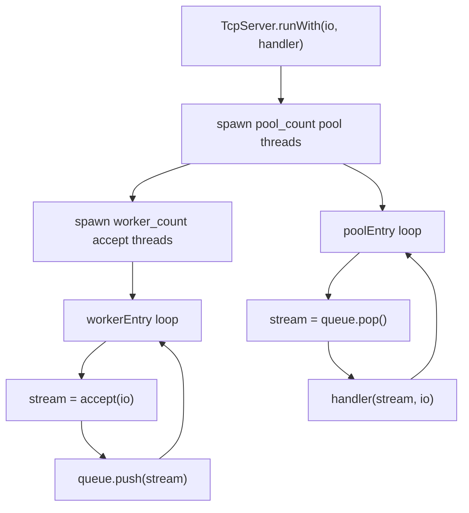
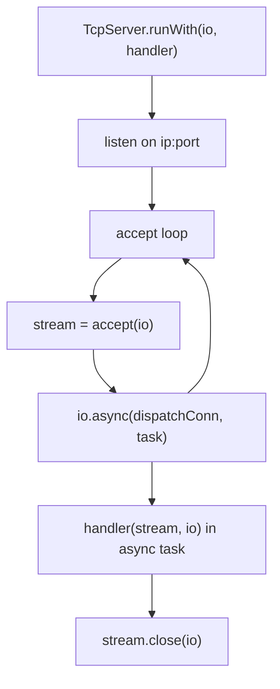
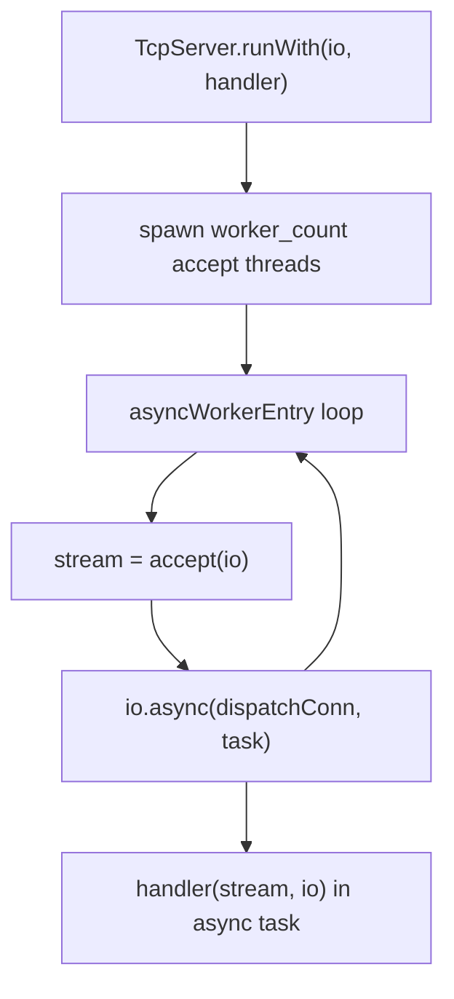
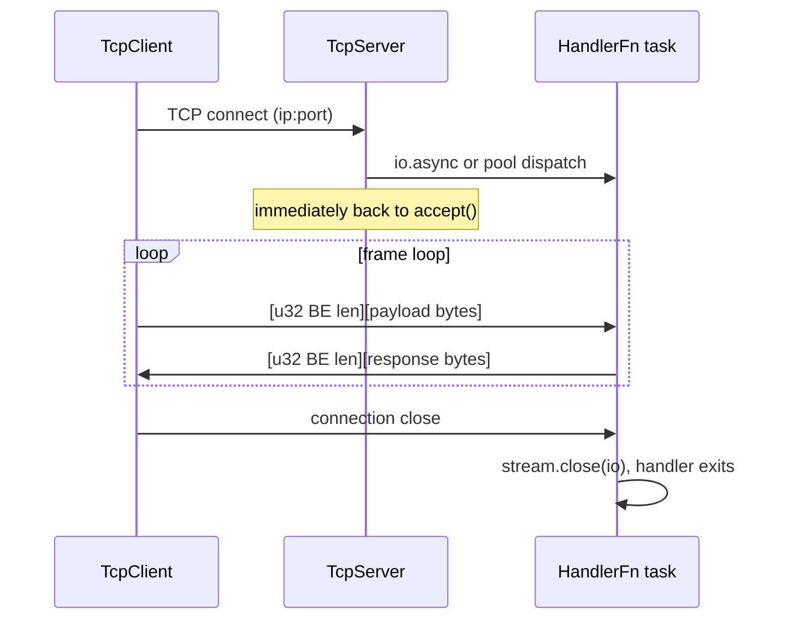

# HLD: zix.Tcp (raw stream)

Raw TCP stream server and client. Generic byte-stream over IP with user-defined framing. Dispatch models POOL, ASYNC, and MIXED are supported. EPOLL is accepted by the enum but falls back to POOL automatically.

---

## Status

Implemented. See ADR-022 for design rationale.

---

## Goals

- Explicit over implicit: same config and dispatch-model pattern as `zix.Http`.
- User owns the handler: `HandlerFn = *const fn(stream, io) void`, identical to `zix.Uds.HandlerFn`.
- Length-prefixed framing built into the default echo handler and the client API (big-endian, network byte order).
- POOL, ASYNC, MIXED dispatch models: same semantics as HTTP, proven by the PoC in `rnd/`. EPOLL is accepted but falls back to POOL (no native epoll loop for raw TCP).
- `initArgs()` on both server and client so `--ip` and `--port` are overridable at runtime without rebuilding.
- No cross-protocol dependencies: `src/tcp/server.zig`, `src/tcp/client.zig`, `src/tcp/config.zig` have no import from `src/tcp/http/`.

---

## Source Layout

```
src/tcp/
    config.zig    // TcpServerConfig, TcpClientConfig, DispatchModel
    server.zig    // TcpServer, HandlerFn, echoHandler, ConnQueue
    client.zig    // TcpClient
    Tcp.zig       // namespace aggregator (also re-exports Http)
```

Export from `src/lib.zig`:
```zig
pub const Tcp = @import("tcp/Tcp.zig");
// zix.Tcp.Server, zix.Tcp.Client, zix.Tcp.Http.*, ...
```

---

## Public API

| Symbol | Type | Description |
| :- | :- | :- |
| `zix.Tcp.Server` | struct | `init(config)` / `initArgs(config, args)` / `run(io)` / `runWith(io, handler)` / `deinit()` |
| `zix.Tcp.Client` | struct | `connect(config, io)` / `connectArgs(config, io, args)` / `sendMsg(io, msg)` / `recvMsg(io, buf)` / `deinit(io)` |
| `zix.Tcp.ServerConfig` | struct | `ip`, `port`, `dispatch_model` (.ASYNC), `kernel_backlog` (4096), `max_msg_len` (4096), `workers` (0), `pool_size` (0) |
| `zix.Tcp.ClientConfig` | struct | `ip`, `port`, `max_msg_len` (4096) |
| `zix.Tcp.DispatchModel` | enum(u8) | `ASYNC=0`, `POOL=1`, `MIXED=2`, `EPOLL=3` (falls back to POOL) |
| `zix.Tcp.HandlerFn` | type | `*const fn(stream: std.Io.net.Stream, io: std.Io) void` |
| `zix.Tcp.echoHandler` | fn | Default echo handler: reads length-prefixed frames and echoes each back |

---

## Frame Format

Both the built-in `echoHandler` and `TcpClient.sendMsg`/`recvMsg` use a simple length-prefixed frame:

```
[ u32 payload_len, 4 bytes, big-endian (network byte order) ]
[ payload bytes, payload_len bytes ]
```

Big-endian is used because TCP is a network protocol: network byte order is the conventional choice and matches how most protocol libraries encode multi-byte integers over the wire. (Contrast with `zix.Uds`, which uses little-endian because UDS is local-only.)

Frames with `payload_len == 0` or `payload_len > max_msg_len` (default 4096) close the connection.

---

## Dispatch Models

### POOL

N accept threads push accepted connections to a shared `ConnQueue`. M pool threads pop and handle each connection synchronously with blocking I/O.



- `workers = 0` -> `cpu_count` accept threads.
- `pool_size = 0` -> `max(10, cpu_count * 2)` pool threads.
- All accept threads bind the same port via `SO_REUSEPORT` (`.reuse_address = true`).

### ASYNC

Single accept thread dispatches each connection via `io.async()`. No pool threads or shared queue.



- `workers` and `pool_size` are ignored.
- Preferred when connections are long-lived (keeps no pool threads occupied).

### MIXED

N accept threads, each dispatching connections via `io.async()` directly, no `ConnQueue`.



- `pool_size` is ignored. `workers = 0` -> `cpu_count` accept threads.
- Balanced throughput and latency.

---

## Server Lifecycle

```
TcpServer.init(config): validates port != 0
    -> .runWith(io, handler): dispatches via dispatch_model
        -> blocks until error (ASYNC) or accept threads exit (POOL/MIXED)

TcpServer.deinit(): no-op (resources released inside runWith via defer)
```

- `init()` only validates configuration: no socket is opened.
- `runWith()` opens sockets, spawns threads (POOL/MIXED), then blocks.
- `deinit()` is a no-op. All network resources are released when `runWith()` returns.

---

## Client Lifecycle

```
TcpClient.connect(config, io): resolves address, opens TCP stream
    -> .sendMsg(io, msg): writes [u32 BE len][payload], flushes
    -> .recvMsg(io, buf): reads [u32 BE len][payload] into buf
    -> .deinit(io): closes stream
```

`TcpClient` holds a single persistent `std.Io.net.Stream`. Reconnection on error is the caller's responsibility.

---

## Connection Lifecycle



---

## Error Handling

| Error | Source | Meaning |
| :- | :- | :- |
| `error.PortNotConfigured` | `Server.init()` / `Client.connect()` | `config.port` is 0 |
| `error.MessageTooLarge` | `Client.recvMsg()` | server frame payload exceeds caller's `buf.len` |
| `error.ConnectionClosed` | `Client.recvMsg()` | server closed the connection mid-frame |

---

## CLI Arg Override

Both server and client support `initArgs` / `connectArgs` for runtime `--ip` / `--port` override without rebuilding:

```zig
// server
var server = try zix.Tcp.Server.initArgs(.{
    .ip   = "127.0.0.1",
    .port = 9300,
    .dispatch_model = .ASYNC,
}, process.minimal.args);

// client
var client = try zix.Tcp.Client.connectArgs(.{
    .ip   = "127.0.0.1",
    .port = 9300,
}, process.io, process.minimal.args);
```

Args are parsed left-to-right. Unknown args are silently skipped. Missing `--ip` or `--port` keeps the config default.

---

## Examples

| File | Dispatch model | Port | Audience |
| :- | :- | :- | :- |
| `examples/tcp_server_1_async.zig` | `.ASYNC` | 9300 | New: simplest server, single accept, custom handler |
| `examples/tcp_server_2_pool.zig` | `.POOL` | 9301 | Experienced: explicit workers/pool_size tuning |
| `examples/tcp_server_3_mixed.zig` | `.MIXED` | 9302 | Experienced: N accept + io.async, no queue |
| `examples/tcp_client.zig` | n/a | 9300 | Connect, send one message, print response, exit |

---

## Logger Integration

`TcpServerConfig.logger: ?*Logger = null`. When non-null:
- `system(.INFO, "tcp", ...)` on bind and shutdown.
- `conn(peer, dur_ms, err)` after the handler returns for each connection. `peer` is the remote address (`"1.2.3.4:54321"` or `"-"` if unavailable); `dur_ms` is the wall-clock connection duration; `err` is null on clean close.

```zig
var logger = try zix.Logger.init(std.heap.smp_allocator, .{
    .console = .ALWAYS,
});
defer logger.deinit();

var server = try zix.Tcp.Server.init(.{
    .ip     = "127.0.0.1",
    .port   = 9300,
    .logger = &logger,
});
```

See `docs/hld-logger.md` for log line format and config details.

---

## Platform Support

TCP stream sockets are available on all platforms where Zig's std supports `std.Io.net.IpAddress`. No platform-specific guards are required beyond what `std.Io.net` provides.

---

###### end of hld-tcp
