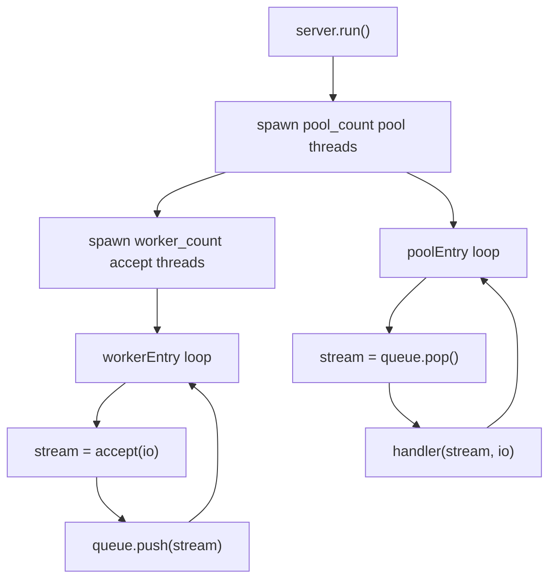
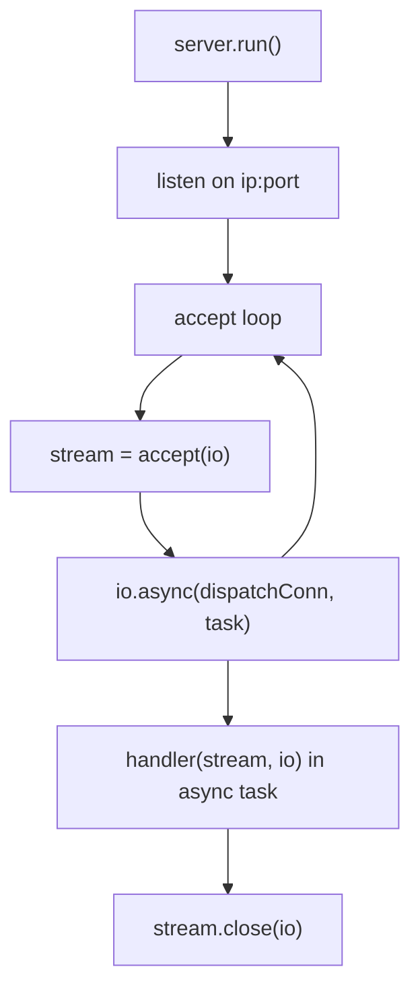
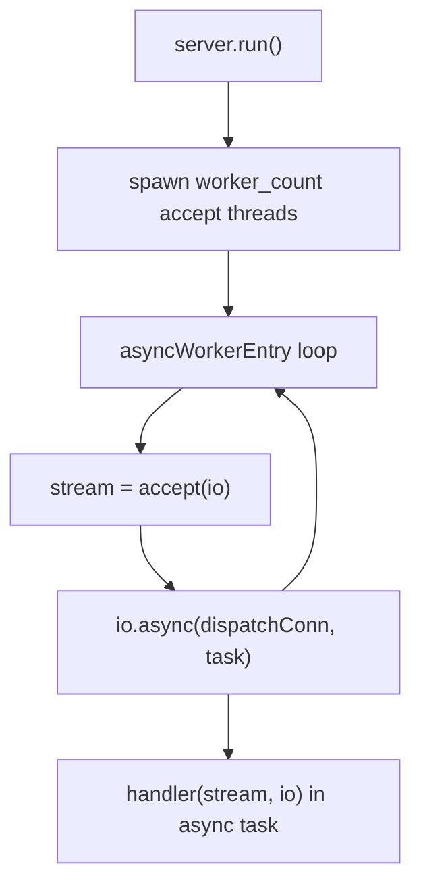
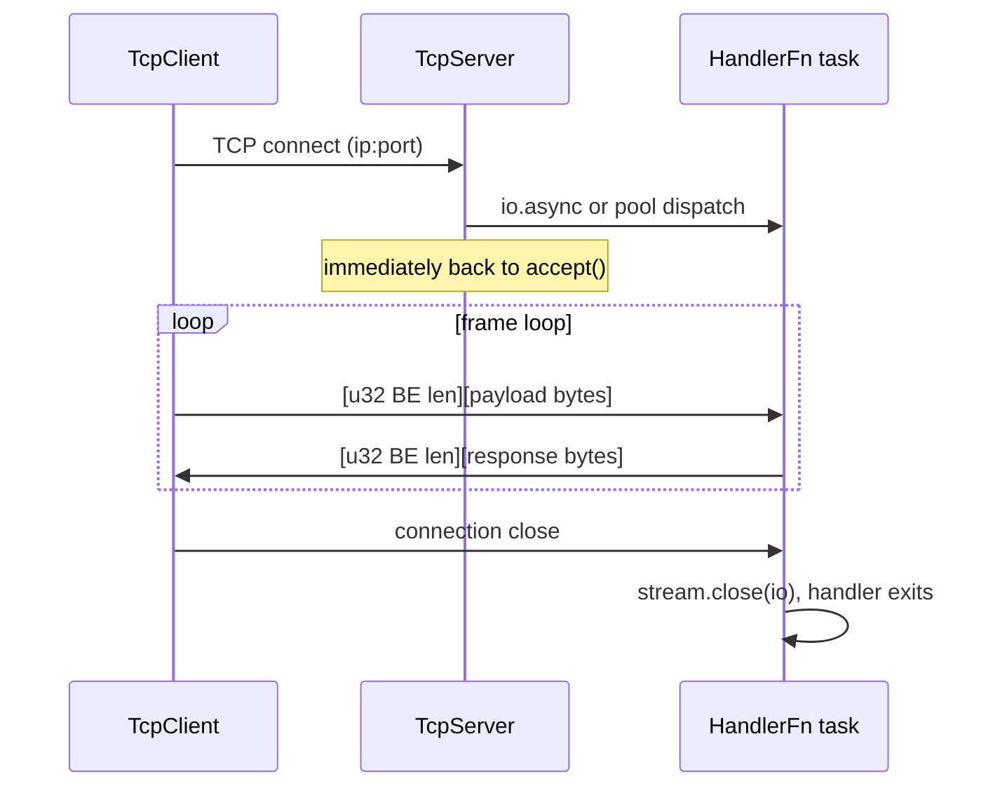

# HLD: zix.Tcp (raw stream)

Raw TCP stream server and client. Generic byte-stream over IP with user-defined framing. The per-connection handler runs under ASYNC, POOL, MIXED, and EPOLL (all native on Linux, EPOLL folds to POOL on non-Linux). A separate per-frame callback path (`initFramed`) adds a native io_uring `.URING` ring (ADR-037). For the per-connection handler, `.URING` folds to `.EPOLL` (ADR-038).

---

## Status

Implemented. See ADR-022 for design rationale.

---

## Goals

- Explicit over implicit: same config and dispatch-model pattern as `zix.Http`.
- User owns the handler: `HandlerFn = *const fn(stream, io) void`, baked into the server type at `init` (ADR-038), identical in shape to `zix.Uds.HandlerFn`.
- Length-prefixed framing built into the default echo handler and the client API (big-endian, network byte order).
- ASYNC, POOL, MIXED, EPOLL dispatch models for the per-connection handler: same semantics as HTTP, all native on Linux (EPOLL folds to POOL on non-Linux). The per-frame `FrameFn` callback (`initFramed`) adds a native `.URING` ring path (ADR-037, ADR-038).
- `initArgs()` on both server and client so `--ip` and `--port` are overridable at runtime without rebuilding.
- No cross-protocol dependencies: `src/tcp/server.zig`, `src/tcp/client.zig`, `src/tcp/config.zig` have no import from `src/tcp/http/`.

---

## Source Layout

```
src/tcp/
    config.zig    // TcpServerConfig, TcpClientConfig, DispatchModel
    server.zig    // Server (comptime factory), HandlerFn, FrameFn, echoHandler, ConnQueue
    client.zig    // TcpClient
    Tcp.zig       // namespace aggregator (also re-exports Http)
```

Export from `src/lib.zig`:
```zig
pub const Tcp = @import("tcp/Tcp.zig");
// zix.Tcp.Server, zix.Tcp.Client, zix.Tcp.Http.*, ...
```

---

## Public API

| Symbol | Type | Description |
| :- | :- | :- |
| `zix.Tcp.Server` | namespace | `init(handler, config)` / `initArgs(handler, config, args)` (per-connection), `initFramed(frame_fn, config)` / `initFramedArgs(frame_fn, config, args)` (per-frame ring), each returns a server with `run()` / `deinit()` |
| `zix.Tcp.Client` | struct | `connect(config, io)` / `connectArgs(config, io, args)` / `sendMsg(io, msg)` / `recvMsg(io, buf)` / `deinit(io)` |
| `zix.Tcp.ServerConfig` | struct | `io`, `ip`, `port`, `dispatch_model` (.ASYNC), `kernel_backlog` (4096), `max_recv_buf` (4096), `workers` (0), `pool_size` (0), `worker_stack_size_bytes` (512 KiB), `reuseport_cbpf` (false), `uring_send_buf_size` (64 KiB), `uring_max_conns_per_worker` (65536), `recv_timeout_ms` (0), `send_timeout_ms` (0), `logger` (null) |
| `zix.Tcp.ClientConfig` | struct | `ip`, `port`, `max_recv_buf` (4096) |
| `zix.Tcp.DispatchModel` | enum(u8) | `ASYNC=0`, `POOL=1`, `MIXED=2`, `EPOLL=3`, `URING=4`. Per-connection handler: ASYNC/POOL/MIXED/EPOLL native, URING folds to EPOLL. Framed path: URING native. |
| `zix.Tcp.HandlerFn` | type | `*const fn(stream: std.Io.net.Stream, io: std.Io) void` (per-connection, owns the stream) |
| `zix.Tcp.FrameFn` | type | `*const fn(payload: []const u8, fd: std.posix.fd_t) void` (per-frame, engine owns the connection, never blocks, runs on the `.URING` ring) |
| `zix.Tcp.echoHandler` | fn | Default echo handler: reads length-prefixed frames and echoes each back. Passed explicitly to `init` |

---

## Constructors

`zix.Tcp.Server` is a fieldless namespace with four constructors: two handler models, each with a plain and a CLI-arg variant.

| Constructor | Handler model | Extra |
| :- | :- | :- |
| `init(handler, config)` | per-connection `HandlerFn` (owns the stream, blocks) | the default, used by the examples |
| `initArgs(handler, config, args)` | per-connection `HandlerFn` | parses `--ip` / `--port` from `args`, overriding `config.ip` / `config.port` at runtime |
| `initFramed(frame_fn, config)` | per-frame `FrameFn` (engine owns the connection, never blocks) | the only path that runs natively on the `.URING` ring |
| `initFramedArgs(frame_fn, config, args)` | per-frame `FrameFn` | parses `--ip` / `--port` from `args` |

- The handler or callback is baked into the server type at `init` (comptime), and `io` is a config field, so `run()` takes no argument (ADR-038, ADR-039).
- `initFramed` is a genuinely different contract, not a convenience wrapper. The per-connection `HandlerFn` owns the socket and blocks on synchronous reads, which a single-threaded completion loop cannot drive, so the ring path needs the non-blocking per-frame `FrameFn` instead. For the per-connection handler, `.URING` folds to `.EPOLL`.
- `initArgs` / `initFramedArgs` only add `--ip` / `--port` parsing, so one built binary can bind a different address or port without a rebuild. The examples use the plain `init` / `initFramed`. Reach for the `Args` variants when you want runtime override.
- `zix.Udp` has the same `init` / `initArgs` split. The five engine servers (`zix.Http`, `zix.Http1`, `zix.Http2`, `zix.Grpc`, `zix.Fix`) have only `init`.

---

## Frame Format

Both the built-in `echoHandler` and `TcpClient.sendMsg`/`recvMsg` use a simple length-prefixed frame:

```
[ u32 payload_len, 4 bytes, big-endian (network byte order) ]
[ payload bytes, payload_len bytes ]
```

Big-endian is used because TCP is a network protocol: network byte order is the conventional choice and matches how most protocol libraries encode multi-byte integers over the wire. `zix.Uds` uses the same big-endian frame format (ADR-010), despite being local-only.

Frames with `payload_len == 0` or `payload_len > max_recv_buf` (default 4096) close the connection.

---

## Dispatch Models

### POOL

N accept threads push accepted connections to a shared `ConnQueue`. M pool threads pop and handle each connection synchronously with blocking I/O.



- `workers = 0` -> `cpu_count` accept threads.
- `pool_size = 0` -> `max(10, cpu_count * 2)` pool threads.
- All accept threads bind the same port via `SO_REUSEPORT` (`.reuse_address = true`).

### ASYNC

Single accept thread dispatches each connection via `io.async()`. No pool threads or shared queue.



- `workers` and `pool_size` are ignored.
- Preferred when connections are long-lived (keeps no pool threads occupied).

### MIXED

N accept threads, each dispatching connections via `io.async()` directly, no `ConnQueue`.



- `pool_size` is ignored. `workers = 0` -> `cpu_count` accept threads.
- Balanced throughput and latency.

### EPOLL

Shared-nothing: each worker owns one `SO_REUSEPORT` listener and one epoll instance. The kernel load-balances accepted connections across workers with no shared queue. Each connection still runs the blocking per-connection `HandlerFn`. Linux-only, native (no longer a POOL fallback). `workers = 0` -> `cpu_count` workers, `pool_size` is ignored. On non-Linux it folds to POOL.

### URING (framed path only)

The per-connection `HandlerFn` cannot run on a single-threaded completion loop (it owns the socket and blocks on synchronous reads). So `.URING` for the per-connection handler folds to `.EPOLL`. To use the io_uring ring, register a per-frame `FrameFn` through `initFramed`: the engine decodes each length-prefixed frame off the ring and calls the callback, which never blocks and never owns the connection (ADR-037, ADR-038). Shared-nothing, one ring per worker, Linux-only.

---

## Server Lifecycle

```
Tcp.Server.init(handler, config): validates port != 0, bakes the handler into the type
    -> .run(): dispatches via dispatch_model (io from config.io)
        -> blocks until error (ASYNC) or accept/worker threads exit (POOL/MIXED/EPOLL)

server.deinit(): no-op (resources released inside run via defer)
```

- `init()` / `initFramed()` only validate configuration: no socket is opened.
- `run()` opens sockets, spawns threads (POOL/MIXED) or shared-nothing epoll/uring workers, then blocks.
- `deinit()` is a no-op. All network resources are released when `run()` returns.

---

## Client Lifecycle

```
TcpClient.connect(config, io): resolves address, opens TCP stream
    -> .sendMsg(io, msg): writes [u32 BE len][payload], flushes
    -> .recvMsg(io, buf): reads [u32 BE len][payload] into buf
    -> .deinit(io): closes stream
```

`TcpClient` holds a single persistent `std.Io.net.Stream`. Reconnection on error is the caller's responsibility.

---

## Connection Lifecycle



---

## Error Handling

| Error | Source | Meaning |
| :- | :- | :- |
| `error.PortNotConfigured` | `Server.init()` / `Client.connect()` | `config.port` is 0 |
| `error.MessageTooLarge` | `Client.recvMsg()` | server frame payload exceeds caller's `buf.len` |
| `error.ConnectionClosed` | `Client.recvMsg()` | server closed the connection mid-frame |

---

## CLI Arg Override

Both server and client support `initArgs` / `connectArgs` for runtime `--ip` / `--port` override without rebuilding:

```zig
// server (handler baked at init; io in config; run() takes no argument)
var server = try zix.Tcp.Server.initArgs(myHandler, .{
    .io   = process.io,
    .ip   = "127.0.0.1",
    .port = 9300,
    .dispatch_model = .ASYNC,
}, process.minimal.args);

// client
var client = try zix.Tcp.Client.connectArgs(.{
    .ip   = "127.0.0.1",
    .port = 9300,
}, process.io, process.minimal.args);
```

Args are parsed left-to-right. Unknown args are silently skipped. Missing `--ip` or `--port` keeps the config default.

---

## Examples

| File | Dispatch model | Port | Audience |
| :- | :- | :- | :- |
| `examples/tcp_server_1_async.zig` | `.ASYNC` | 9300 | New: simplest server, single accept, custom handler |
| `examples/tcp_server_2_pool.zig` | `.POOL` | 9301 | Experienced: explicit workers/pool_size tuning |
| `examples/tcp_server_3_mixed.zig` | `.MIXED` | 9302 | Experienced: N accept + io.async, no queue |
| `examples/tcp_server_4_epoll.zig` | `.EPOLL` | 9303 | Linux: shared-nothing epoll workers |
| `examples/tcp_server_5_uring.zig` | `.URING` | 9304 | Linux: per-frame `FrameFn` on the io_uring ring (`initFramed`) |
| `examples/tcp_client.zig` | n/a | 9300 | Connect, send one message, print response, exit |

---

## Logger Integration

`TcpServerConfig.logger: ?*Logger = null`. When non-null:
- `system(.INFO, "tcp", ...)` on bind and shutdown.
- `conn(peer, dur_ms, err)` after the handler returns for each connection. `peer` is the remote address (`"1.2.3.4:54321"` or `"-"` if unavailable). `dur_ms` is the wall-clock connection duration. `err` is null on clean close.

```zig
var logger = try zix.Logger.init(std.heap.smp_allocator, .{
    .console = .ALWAYS,
});
defer logger.deinit();

var server = try zix.Tcp.Server.init(myHandler, .{
    .io     = process.io,
    .ip     = "127.0.0.1",
    .port   = 9300,
    .logger = &logger,
});
```

See `docs/hld-logger-en.md` for log line format and config details.

---

## Platform Support

TCP stream sockets are available on all platforms where Zig's std supports `std.Io.net.IpAddress`. No platform-specific guards are required beyond what `std.Io.net` provides.

---

###### end of hld-tcp
