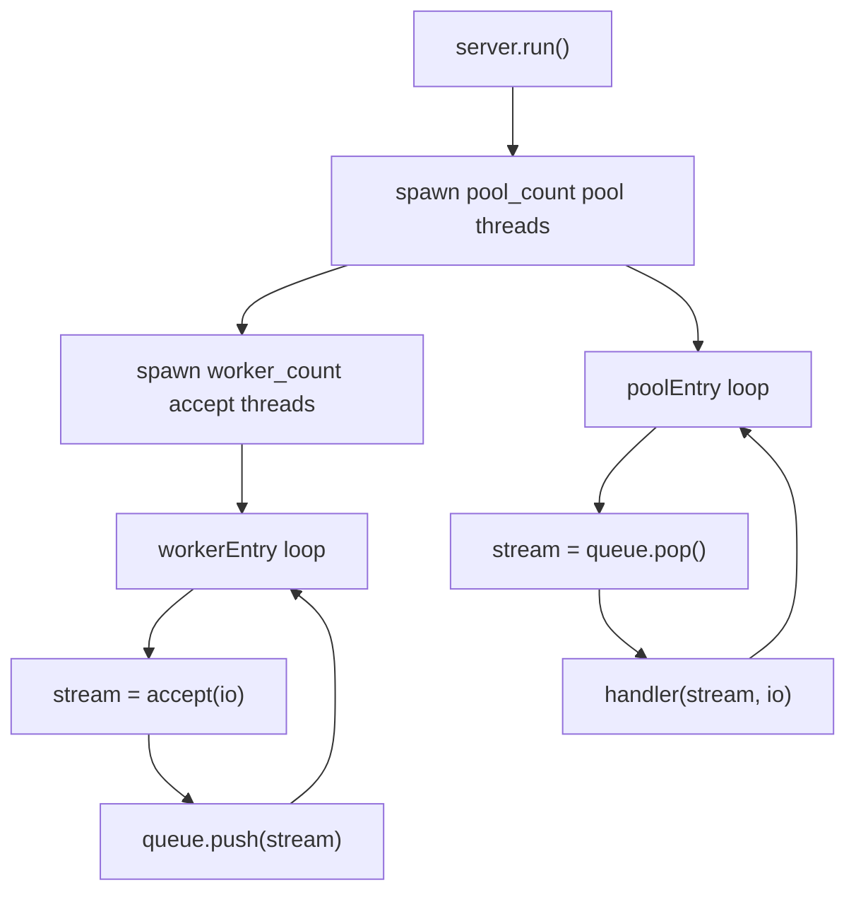
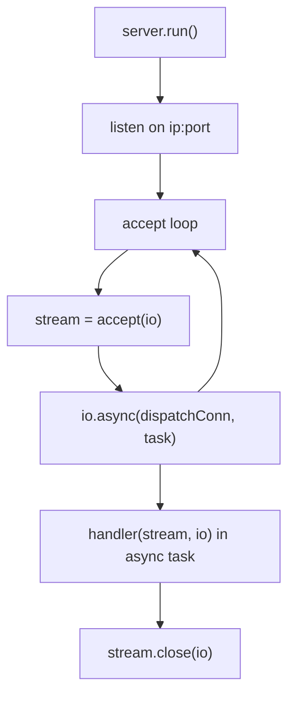
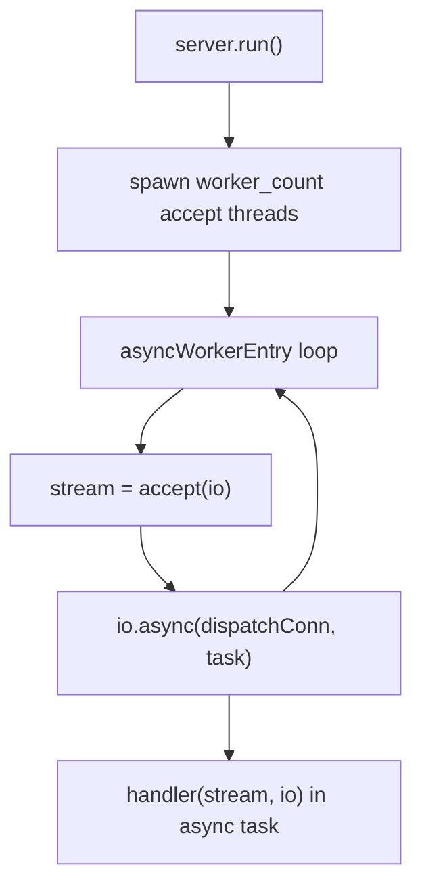
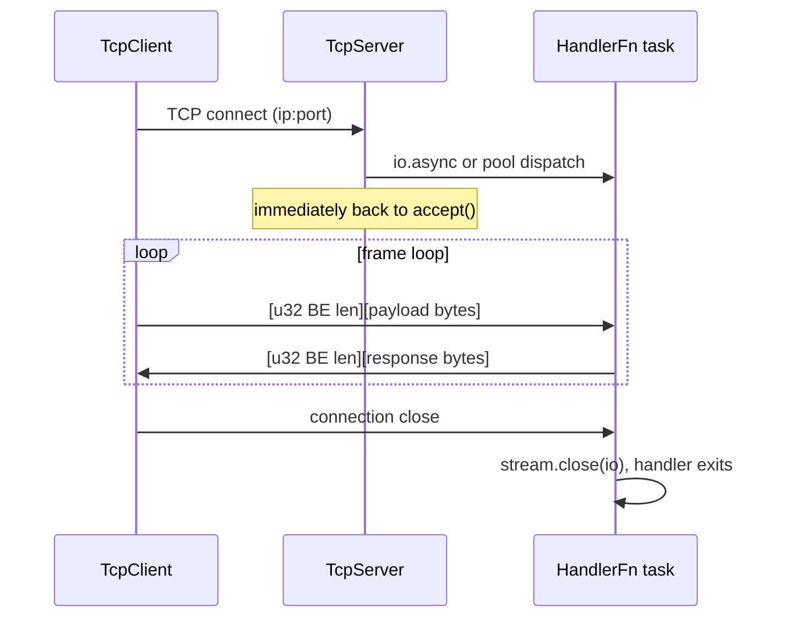

# HLD: zix.Tcp (raw stream)

Server dan client raw TCP stream. Byte-stream generik melalui IP dengan framing yang didefinisikan oleh pengguna. Handler per-connection berjalan di bawah ASYNC, POOL, MIXED, dan EPOLL (semua native di Linux, EPOLL melipat ke POOL di non-Linux). Jalur callback per-frame terpisah (`initFramed`) menambah ring io_uring `.URING` native (ADR-037). Untuk handler per-connection, `.URING` melipat ke `.EPOLL` (ADR-038).

---

## Status

Sudah diimplementasi. Lihat ADR-022 untuk dasar keputusan desain.

---

## Tujuan

- Eksplisit daripada implisit: pola config dan dispatch model yang sama seperti `zix.Http`.
- Pengguna memiliki handler: `HandlerFn = *const fn(stream, io) void`, dibakukan ke dalam tipe server pada `init` (ADR-038), identik bentuknya dengan `zix.Uds.HandlerFn`.
- Framing dengan length-prefix sudah terintegrasi di echo handler default dan API client (big-endian, network byte order).
- Dispatch model ASYNC, POOL, MIXED, EPOLL untuk handler per-connection: semantik sama seperti HTTP, semua native di Linux (EPOLL melipat ke POOL di non-Linux). Callback per-frame `FrameFn` (`initFramed`) menambah jalur ring `.URING` native (ADR-037, ADR-038).
- `initArgs()` pada server maupun client agar `--ip` dan `--port` dapat diganti saat runtime tanpa perlu build ulang.
- Tidak ada dependensi lintas protokol: `src/tcp/server.zig`, `src/tcp/client.zig`, `src/tcp/config.zig` tidak mengimpor dari `src/tcp/http/`.

---

## Struktur Berkas

```
src/tcp/
    config.zig    // TcpServerConfig, TcpClientConfig, DispatchModel
    server.zig    // Server (comptime factory), HandlerFn, FrameFn, echoHandler, ConnQueue
    client.zig    // TcpClient
    Tcp.zig       // namespace aggregator (juga me-re-export Http)
```

Export dari `src/lib.zig`:
```zig
pub const Tcp = @import("tcp/Tcp.zig");
// zix.Tcp.Server, zix.Tcp.Client, zix.Tcp.Http.*, ...
```

---

## API Publik

| Simbol | Tipe | Deskripsi |
| :- | :- | :- |
| `zix.Tcp.Server` | namespace | `init(handler, config)` / `initArgs(handler, config, args)` (per-connection), `initFramed(frame_fn, config)` / `initFramedArgs(frame_fn, config, args)` (per-frame ring), masing-masing mengembalikan server dengan `run()` / `deinit()` |
| `zix.Tcp.Client` | struct | `connect(config, io)` / `connectArgs(config, io, args)` / `sendMsg(io, msg)` / `recvMsg(io, buf)` / `deinit(io)` |
| `zix.Tcp.ServerConfig` | struct | `io`, `ip`, `port`, `dispatch_model` (.ASYNC), `kernel_backlog` (4096), `max_recv_buf` (4096), `workers` (0), `pool_size` (0), `worker_stack_size_bytes` (512 KiB), `reuseport_cbpf` (false), `uring_send_buf_size` (64 KiB), `uring_max_conns_per_worker` (65536), `recv_timeout_ms` (0), `send_timeout_ms` (0), `logger` (null) |
| `zix.Tcp.ClientConfig` | struct | `ip`, `port`, `max_recv_buf` (4096) |
| `zix.Tcp.DispatchModel` | enum(u8) | `ASYNC=0`, `POOL=1`, `MIXED=2`, `EPOLL=3`, `URING=4`. Handler per-connection: ASYNC/POOL/MIXED/EPOLL native, URING melipat ke EPOLL. Jalur framed: URING native. |
| `zix.Tcp.HandlerFn` | tipe | `*const fn(stream: std.Io.net.Stream, io: std.Io) void` (per-connection, memiliki stream) |
| `zix.Tcp.FrameFn` | tipe | `*const fn(payload: []const u8, fd: std.posix.fd_t) void` (per-frame, engine memiliki koneksi, tidak pernah blocking, berjalan di ring `.URING`) |
| `zix.Tcp.echoHandler` | fn | Echo handler default: membaca frame length-prefixed dan memantulkan setiap frame kembali. Dilewatkan secara eksplisit ke `init` |

---

## Constructor

`zix.Tcp.Server` adalah namespace tanpa field dengan empat constructor: dua model handler, masing-masing dengan varian polos dan varian CLI-arg.

| Constructor | Model handler | Tambahan |
| :- | :- | :- |
| `init(handler, config)` | `HandlerFn` per-connection (memiliki stream, blocking) | default, dipakai contoh |
| `initArgs(handler, config, args)` | `HandlerFn` per-connection | mem-parsing `--ip` / `--port` dari `args`, menimpa `config.ip` / `config.port` saat runtime |
| `initFramed(frame_fn, config)` | `FrameFn` per-frame (engine memiliki koneksi, tidak pernah blocking) | satu-satunya jalur yang berjalan native di ring `.URING` |
| `initFramedArgs(frame_fn, config, args)` | `FrameFn` per-frame | mem-parsing `--ip` / `--port` dari `args` |

- Handler atau callback dibakukan ke dalam tipe server pada `init` (comptime), dan `io` adalah field config, sehingga `run()` tidak menerima argumen (ADR-038, ADR-039).
- `initFramed` adalah kontrak yang benar-benar berbeda, bukan wrapper kenyamanan. `HandlerFn` per-connection memiliki socket dan blocking pada read sinkron, yang tidak bisa digerakkan loop completion single-threaded, jadi jalur ring memerlukan `FrameFn` per-frame yang non-blocking. Untuk handler per-connection, `.URING` melipat ke `.EPOLL`.
- `initArgs` / `initFramedArgs` hanya menambah parsing `--ip` / `--port`, sehingga satu binary yang sudah di-build bisa bind ke address atau port berbeda tanpa rebuild. Contoh memakai `init` / `initFramed` polos. Pakai varian `Args` saat kamu ingin override runtime.
- `zix.Udp` punya split `init` / `initArgs` yang sama. Lima engine server (`zix.Http`, `zix.Http1`, `zix.Http2`, `zix.Grpc`, `zix.Fix`) hanya punya `init`.

---

## Format Frame

Baik `echoHandler` bawaan maupun `TcpClient.sendMsg`/`recvMsg` menggunakan frame length-prefix sederhana:

```
[ u32 payload_len, 4 bytes, big-endian (network byte order) ]
[ payload bytes, payload_len bytes ]
```

Big-endian digunakan karena TCP adalah protokol jaringan: network byte order adalah pilihan konvensional dan sesuai dengan cara sebagian besar library protokol mengkodekan integer multi-byte melalui jaringan. `zix.Uds` memakai format frame big-endian yang sama (ADR-010), walau bersifat lokal saja.

Frame dengan `payload_len == 0` atau `payload_len > max_recv_buf` (default 4096) menutup koneksi.

---

## Model Dispatch

### POOL

N accept thread mendorong koneksi yang diterima ke `ConnQueue` bersama. M pool thread mengambil dan menangani setiap koneksi secara sinkron dengan blocking I/O.



- `workers = 0` menghasilkan `cpu_count` accept thread.
- `pool_size = 0` menghasilkan `max(10, cpu_count * 2)` pool thread.
- Semua accept thread mengikat port yang sama melalui `SO_REUSEPORT` (`.reuse_address = true`).

### ASYNC

Satu accept thread mendispatch setiap koneksi melalui `io.async()`. Tidak ada pool thread atau antrian bersama.



- `workers` dan `pool_size` diabaikan.
- Lebih cocok ketika koneksi bersifat long-lived (tidak menggunakan pool thread secara terus-menerus).

### MIXED

N accept thread, masing-masing mendispatch koneksi melalui `io.async()` secara langsung, tanpa `ConnQueue`.



- `pool_size` diabaikan. `workers = 0` menghasilkan `cpu_count` accept thread.
- Throughput dan latensi yang seimbang.

### EPOLL

Shared-nothing: setiap worker memiliki satu `SO_REUSEPORT` listener dan satu epoll instance. Kernel menyeimbangkan koneksi yang diterima ke worker tanpa antrian bersama. Setiap koneksi tetap menjalankan `HandlerFn` per-connection yang blocking. Khusus Linux, native (bukan lagi fallback POOL). `workers = 0` menghasilkan `cpu_count` worker, `pool_size` diabaikan. Di non-Linux melipat ke POOL.

### URING (hanya jalur framed)

`HandlerFn` per-connection tidak bisa berjalan pada loop completion single-threaded (ia memiliki socket dan blocking pada read sinkron). Jadi `.URING` untuk handler per-connection melipat ke `.EPOLL`. Untuk memakai ring io_uring, daftarkan `FrameFn` per-frame melalui `initFramed`: engine men-decode setiap frame length-prefixed dari ring dan memanggil callback, yang tidak pernah blocking dan tidak memiliki koneksi (ADR-037, ADR-038). Shared-nothing, satu ring per worker, khusus Linux.

---

## Siklus Hidup Server

```
Tcp.Server.init(handler, config): memvalidasi port != 0, membakukan handler ke tipe
    -> .run(): mendispatch berdasarkan dispatch_model (io dari config.io)
        -> memblokir hingga error (ASYNC) atau accept/worker thread selesai (POOL/MIXED/EPOLL)

server.deinit(): no-op (resource dibebaskan di dalam run melalui defer)
```

- `init()` / `initFramed()` hanya memvalidasi konfigurasi: tidak membuka socket.
- `run()` membuka socket, menspawn thread (POOL/MIXED) atau worker epoll/uring shared-nothing, kemudian memblokir.
- `deinit()` adalah no-op. Semua resource jaringan dibebaskan saat `run()` kembali.

---

## Siklus Hidup Client

```
TcpClient.connect(config, io): resolusi alamat, membuka TCP stream
    -> .sendMsg(io, msg): menulis [u32 BE len][payload], flush
    -> .recvMsg(io, buf): membaca [u32 BE len][payload] ke dalam buf
    -> .deinit(io): menutup stream
```

`TcpClient` menyimpan satu `std.Io.net.Stream` yang persisten. Reconnect saat terjadi error adalah tanggung jawab pemanggil.

---

## Siklus Hidup Koneksi



---

## Penanganan Error

| Error | Sumber | Makna |
| :- | :- | :- |
| `error.PortNotConfigured` | `Server.init()` / `Client.connect()` | `config.port` bernilai 0 |
| `error.MessageTooLarge` | `Client.recvMsg()` | payload frame server melebihi `buf.len` milik pemanggil |
| `error.ConnectionClosed` | `Client.recvMsg()` | server menutup koneksi di tengah frame |

---

## Override Argumen CLI

Baik server maupun client mendukung `initArgs` / `connectArgs` untuk override `--ip` / `--port` saat runtime tanpa perlu build ulang:

```zig
// server (handler dibakukan pada init; io di config; run() tidak menerima argumen)
var server = try zix.Tcp.Server.initArgs(myHandler, .{
    .io   = process.io,
    .ip   = "127.0.0.1",
    .port = 9300,
    .dispatch_model = .ASYNC,
}, process.minimal.args);

// client
var client = try zix.Tcp.Client.connectArgs(.{
    .ip   = "127.0.0.1",
    .port = 9300,
}, process.io, process.minimal.args);
```

Argumen diproses dari kiri ke kanan. Argumen yang tidak dikenal dilewati tanpa pesan error. Jika `--ip` atau `--port` tidak ada, nilai default dari config tetap digunakan.

---

## Contoh

| Berkas | Dispatch model | Port | Sasaran |
| :- | :- | :- | :- |
| `examples/tcp_server_1_async.zig` | `.ASYNC` | 9300 | Pemula: server paling sederhana, satu accept, custom handler |
| `examples/tcp_server_2_pool.zig` | `.POOL` | 9301 | Berpengalaman: tuning workers/pool_size secara eksplisit |
| `examples/tcp_server_3_mixed.zig` | `.MIXED` | 9302 | Berpengalaman: N accept + io.async, tanpa antrian |
| `examples/tcp_server_4_epoll.zig` | `.EPOLL` | 9303 | Linux: worker epoll shared-nothing |
| `examples/tcp_server_5_uring.zig` | `.URING` | 9304 | Linux: `FrameFn` per-frame di ring io_uring (`initFramed`) |
| `examples/tcp_client.zig` | n/a | 9300 | Koneksi, kirim satu pesan, cetak respons, keluar |

---

## Integrasi Logger

`TcpServerConfig.logger: ?*Logger = null`. Jika tidak null:
- `system(.INFO, "tcp", ...)` dipanggil saat bind dan shutdown.
- `conn(peer, dur_ms, err)` dipanggil setelah handler kembali untuk setiap koneksi. `peer` adalah alamat remote (`"1.2.3.4:54321"` atau `"-"` jika tidak tersedia). `dur_ms` adalah durasi koneksi berdasarkan wall-clock. `err` bernilai null jika koneksi ditutup dengan bersih.

```zig
var logger = try zix.Logger.init(std.heap.smp_allocator, .{
    .console = .ALWAYS,
});
defer logger.deinit();

var server = try zix.Tcp.Server.init(myHandler, .{
    .io     = process.io,
    .ip     = "127.0.0.1",
    .port   = 9300,
    .logger = &logger,
});
```

Lihat `docs/hld-logger-id.md` untuk format baris log dan detail konfigurasi.

---

## Dukungan Platform

Socket stream TCP tersedia di semua platform yang didukung oleh `std.Io.net.IpAddress` milik Zig. Tidak diperlukan guard platform-specific selain yang sudah disediakan oleh `std.Io.net`.

---

###### end of hld-tcp
