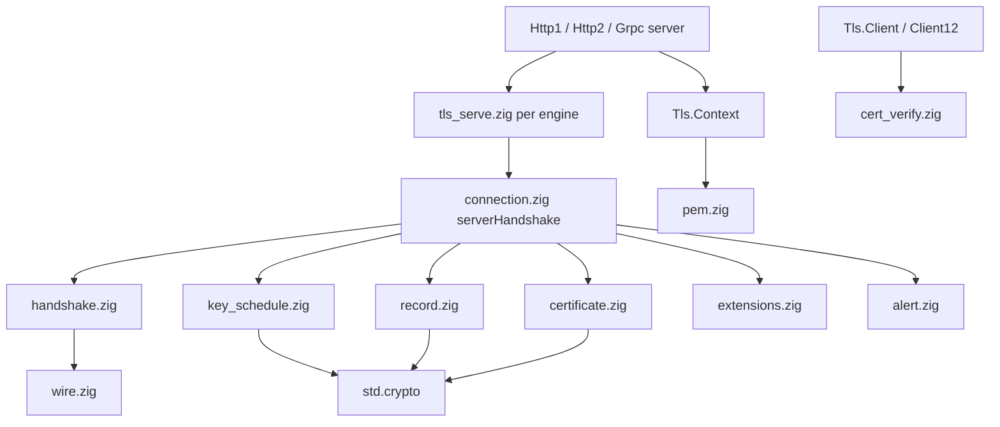
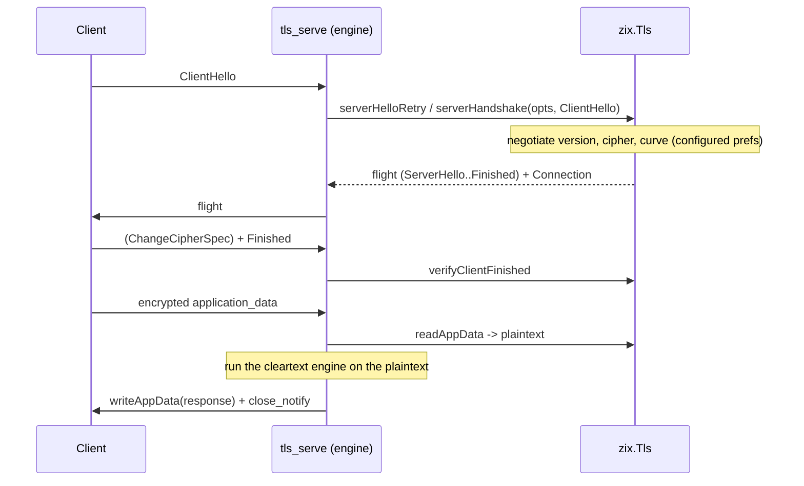

# TLS High-Level Design: zix.Tls

## Goals

- Pure-Zig TLS on `std.crypto` primitives, no OpenSSL or BoringSSL, no C FFI (ADR-045).
- TLS 1.3 (RFC 8446) plus a TLS 1.2 floor (RFC 5246 / 5288). 1.3 preferred, never below 1.2, 1.0 / 1.1 / SSL never offered (RFC 8996).
- Sans-I/O: the handshake produces bytes to send and consumes bytes received. The HTTP engine owns the socket loop, so the same code serves blocking and non-blocking dispatch.
- https is opt-in and additive: cleartext stays the default and its hot path is untouched. The TLS path runs on its own perf band (ADR-046).
- Server-side configuration as a user-owned `Tls.Context` object (the loaded cert / key + validated policy), mirroring the logger (ADR-047).
- Forward secrecy (ECDHE) and AEAD on both versions by construction.
- A native verifying client (ALPN offer, X.509 chain + hostname per RFC 5280 / 6125).
- The 1.3 handshake primitives (key schedule, certificate, hello serialization) also back `zix.Http3` over QUIC, where QUIC CRYPTO frames carry the handshake in place of the TLS record layer (`zix.Http3.tls_handshake` / `tls_key_schedule`).

## Architecture



`zix.Tls` is sans-I/O: it has no listener and no socket loop. The engine owns the socket. The h2 engines (Http2, Grpc) select between two TLS serve paths by `dispatch_model`: `.EPOLL` / `.URING` use a per-core multiplexed loop (`tls_mux.zig`) over a resumable session in `tcp/tls/tls_session.zig`, and `.ASYNC` / `.POOL` / `.MIXED` use `tls_serve.zig` over the shared terminator `tcp/tls/h2_terminator.zig` (ADR-052). The handshake is driven through `connection.zig`, which composes the wire, key-schedule, record, certificate, extension, and alert layers, all on `std.crypto`.

## Source Layout

| File | Role |
| :- | :- |
| `Tls.zig` | Public namespace: re-exports the server, client, context, and verify surface |
| `context.zig` | `Tls.Context` (loaded cert / key + validated policy) and `Tls.Context.Config` (ADR-047) |
| `connection.zig` | Server handshake driver (`serverHandshake`, HelloRetryRequest), the post-handshake `Connection` (record read / write) |
| `handshake.zig` | ClientHello parse, version / cipher / curve negotiation, ServerHello + HelloRetryRequest serialization, the wire enums |
| `key_schedule.zig` | HKDF-SHA256 key schedule, the running transcript hash |
| `record.zig` | TLS 1.3 AEAD record protect / deprotect, content-type framing |
| `certificate.zig` | Certificate / CertificateVerify / Finished builders, the `SigningKey` identity |
| `extensions.zig` | ALPN (`Alpn`, `negotiateAlpn`), EncryptedExtensions, supported_versions / key_share helpers |
| `alert.zig` | Alert codes, outbound alert records, inbound alert classification |
| `pem.zig` | PEM to DER decode, ECDSA SEC1 scalar + Ed25519 PKCS#8 seed extraction |
| `rsa.zig` | RSA signing (ADR-048): PKCS#1 / PKCS#8 key parse, EMSA-PKCS1-v1_5 + EMSA-PSS, CRT modexp via `montgomery.zig` |
| `montgomery.zig` | Constant-time Montgomery modexp for the RSA CRT sign: portable CIOS, plus a fused ADCX / ADOX asm path on x86_64+ADX |
| `cert_verify.zig` | Peer cert chain (RFC 5280) + hostname / IP identity (RFC 6125), the misdirected-request check |
| `client.zig` | TLS 1.3 client handshake (start / finish, `ClientConnection`) |
| `tls12_*.zig` | TLS 1.2 track: PRF schedule, record layer, version select, server handshake, client |

## Version Policy

| Version | zix policy | Status |
| :- | :- | :- |
| TLS 1.3 | preferred, default | implemented (RFC 8446) |
| TLS 1.2 | minimum / floor, required | implemented (RFC 5246 / 5288) |
| TLS 1.1, 1.0, SSL | never offered | deprecated / prohibited (RFC 8996, 7568, 6176) |

TLS 1.2 is the floor because RFC 5246 is not deprecated and is still widely deployed. The 1.2 suites are restricted to ECDHE-AEAD so forward secrecy and authenticated encryption hold on both versions. A `Tls.Context` narrows this range with `min_version` / `max_version`: the serve path forces the 1.2 path when the ceiling is 1.2, and refuses a 1.2-only client with a `protocol_version` alert when the floor is 1.3.

## Implemented Crypto

| Axis | TLS 1.3 | TLS 1.2 |
| :- | :- | :- |
| Cipher | `TLS_AES_128_GCM_SHA256` | `ECDHE_ECDSA_AES128_GCM_SHA256` (0xC02B) |
| Key exchange | X25519, secp256r1 ECDHE | secp256r1 ECDHE |
| Signature | ECDSA P-256, Ed25519, or RSA (`rsa_pss_rsae_sha256`) | ECDSA P-256 |

There is no finite-field DHE and no RSA key exchange, so key-exchange strength is governed entirely by the ECDHE curve, not a dhparam file. The certificate is ECDSA P-256, Ed25519, or RSA: ECDSA and Ed25519 sign on either version, while an RSA certificate signs the TLS 1.3 CertificateVerify with `rsa_pss_rsae_sha256` and therefore requires TLS 1.3 (the 1.2 path is ECDSA-only). RSA-2048 is the minimum and ECDSA P-256 is the default (ADR-048).

Build note (record throughput): AES-GCM runs on `std.crypto`, which picks the hardware or software backend at comptime from the BUILD CPU target. The hardware path needs both the `aes` (AES-NI) and `pclmul` (GHASH carry-less multiply) features. A target without them compiles the software fallback, which is roughly 40x slower (the `x86_64_v3` level does NOT include them, they are separate features). For any deployment that serves real TLS volume, build with a target that has them, for example `-Dcpu=x86_64_v3+aes+pclmul` or `-Dcpu=native` (on aarch64 the equivalent is `+aes`).

## Server Configuration: Tls.Context

The server attaches TLS by pointer, exactly like the logger:

```zig
var tls = try zix.Tls.Context.init(allocator, io, .{
    .cert_path = "examples/tls/certs/ecdsa_p256_cert.pem",
    .key_path  = "examples/tls/certs/ecdsa_p256_key.pem",
    .alpn      = &.{ .HTTP_1_1 }, // .H2 for the Http2 server
});
defer tls.deinit();

var server = zix.Http1.Server.init(handler, .{ .io = io, .ip = "127.0.0.1", .port = 9060, .tls = &tls });
```

- `Tls.Context.Config` is the plain settings struct: `cert_path`, `key_path`, `alpn`, `min_version`, `max_version`, `curves`, `ciphers`, `prefer_server_ciphers`, `hsts_max_age_s`.
- `Tls.Context.init` loads the PEM, detects the key type (ECDSA, Ed25519, or RSA), and validates the policy once on the cold path. The per-connection serve path then reads a ready context with no PEM work.
- `tls: ?*Tls.Context` on the Http1, Http2, and Grpc configs. A non-null pointer is the https opt-in gate.
- Curves and ciphers are typed enum slices validated to the implemented set. An unsupported value (P384, MLKEM768, AES-256, CHACHA20, any RSA suite) is a startup error, never a silent no-op. The set widens with no API change as crypto lands.

## Handshake Flow (server, TLS 1.3)



`serverHandshake` is sans-I/O: it returns the bytes to send plus a `Connection`. A HelloRetryRequest (when the client's chosen curve has no key_share) is a two-round variant via `serverHelloRetry` then `serverHandshakeAfterRetry`. A 1.2-only client surfaces as `UnsupportedTlsVersion`, which the serve path routes to the 1.2 track (subject to the version policy).

## Engine Integration (ADR-046)

TLS is a gated blocking serve path per engine, selected by `config.tls`, leaving every cleartext dispatch model untouched.

- Http1: `serveConnTls` runs the handshake, then per request decrypts the record, reuses `core.parseHead`, runs the handler with an in-memory response sink capturing its plaintext (`runHandlerToBuffer`), and encrypts that.
- Http2 and Grpc (ADR-052): two serve paths, selected by `dispatch_model`. ALPN selects h2 on both.
  - `.EPOLL` / `.URING`: one `SO_REUSEPORT` epoll worker per core (`tls_mux.zig`, `grpc/tls_mux.zig`) terminates TLS in place via a resumable TLS 1.3 session (`tcp/tls/tls_session.zig`) and multiplexes many connections per worker. No socketpair, no thread per connection. This is the high-concurrency path.
  - `.ASYNC` / `.POOL` / `.MIXED`: `tls_serve.zig` runs a thread-per-connection accept loop over the shared terminator `tcp/tls/h2_terminator.zig`, which runs an inline-mux driver directly over the decrypted records (frames sealed back into TLS records through a thread-local write hook). No socketpair, no second thread. This path also serves the TLS 1.2 fallback.

- Dual listener (ADR-060): with `tls_port` set next to `tls` (Http1, Http, Http2, Grpc), ONE server serves cleartext on `port` and TLS on `tls_port` from the same worker fleet. The per-connection transport machinery the mux paths share lives in `src/multiplexers/tls_conn.zig`, and under `.URING` the TLS side runs on the ring (no separate epoll fleet).

Because the engines are reused unchanged, https cannot regress the cleartext hot path. The per-request capture copy (Http1) is acceptable on the https band, which is not the 1 percent perf gate.

## Misdirected Request (RFC 9110 7.4)

On the Http1 https path, the request Host (port stripped) is matched against the certificate identity through `verifyCertIdentity`: a DNS SAN (std `verifyHostName`) or an IP SAN (matched by scanning the SAN for the iPAddress GeneralName, since std is DNS-only). A mismatch returns `421 Misdirected Request` plus a `close_notify`.

## Client

`zix.Tls.Client` (1.3) and `zix.Tls.Client12` (1.2) are the sans-I/O mirror of the server: `start` builds the ClientHello (offering ALPN and a signature_algorithms list of ecdsa_secp256r1_sha256 and ed25519), `finish` consumes the server flight, verifies the server signature (CertificateVerify for 1.3, ServerKeyExchange for 1.2) through `std.crypto.Certificate`, and returns a `ClientConnection`. Chain and hostname validation use `cert_verify.zig` (RFC 5280 / 6125).

## Inbound Alerts (RFC 8446 6)

`parseInboundAlert` classifies a received alert: `close_notify` (description 0) is a clean teardown, any other is fatal. The serve paths read post-handshake alerts and close cleanly rather than misreading an alert as a record.

## Memory Model

- No per-request allocator is exposed. The handshake works in caller-provided fixed buffers, and the application path reuses the engine's existing buffers.
- `Tls.Context` owns one heap allocation: the duplicated DER certificate, freed by `deinit`. The signing key and the validated policy slices are values or borrowed slices.
- The handshake transcript and key schedule are fixed-size (`Secret = [32]u8`, SHA-256 throughout).

## References

- ADR-045: pure-Zig TLS, TLS 1.2 the minimum version.
- ADR-046: wire TLS as a layer, gated serve paths over the unchanged engines.
- ADR-047: TLS bind options as a Tls.Context object.
- LLD: [`docs/lld-tls-en.md`](lld-tls-en.md).
