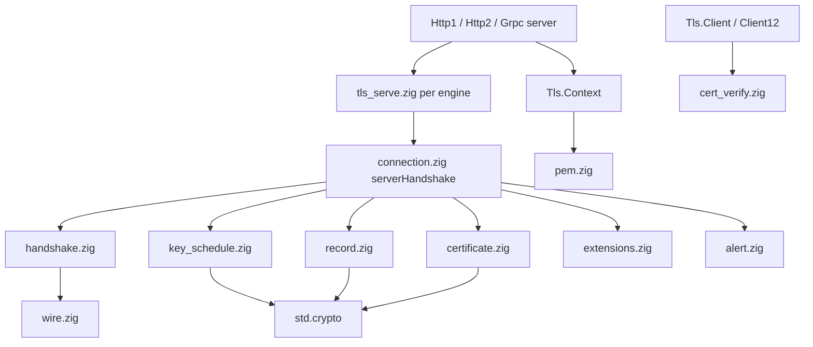
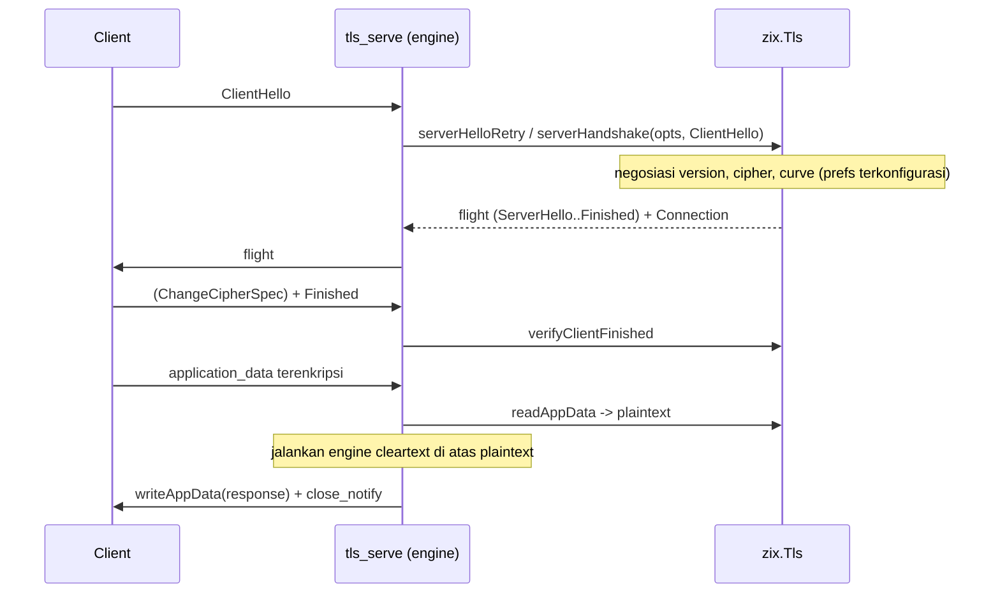

# TLS High-Level Design: zix.Tls

## Goals

- TLS pure-Zig di atas primitive `std.crypto`, tanpa OpenSSL atau BoringSSL, tanpa C FFI (ADR-045).
- TLS 1.3 (RFC 8446) plus floor TLS 1.2 (RFC 5246 / 5288). 1.3 diutamakan, tidak pernah di bawah 1.2, 1.0 / 1.1 / SSL tidak pernah ditawarkan (RFC 8996).
- Sans-I/O: handshake menghasilkan byte untuk dikirim dan mengonsumsi byte yang diterima. Engine HTTP memiliki socket loop, jadi kode yang sama melayani dispatch blocking maupun non-blocking.
- https bersifat opt-in dan aditif: cleartext tetap default dan hot path-nya tidak tersentuh. Jalur TLS berjalan di perf band-nya sendiri (ADR-046).
- Konfigurasi sisi server sebagai object `Tls.Context` milik pengguna (cert / key termuat + policy tervalidasi), dimodelkan pada logger (ADR-047).
- Forward secrecy (ECDHE) dan AEAD di kedua versi by construction.
- Client native yang melakukan verifikasi (penawaran ALPN, chain X.509 + hostname per RFC 5280 / 6125).

## Architecture



`zix.Tls` bersifat sans-I/O: tidak punya listener dan tidak punya socket loop. Accept loop berada di `tls_serve.zig` tiap engine, dan engine h2 (Http2, Grpc) berbagi satu terminator di `tcp/tls/h2_terminator.zig`. Handshake didorong lewat `connection.zig`, yang menyusun lapisan wire, key-schedule, record, certificate, extension, dan alert, semuanya di atas `std.crypto`.

## Source Layout

| File | Peran |
| :- | :- |
| `Tls.zig` | Namespace publik: re-export permukaan server, client, context, dan verify |
| `context.zig` | `Tls.Context` (cert / key termuat + policy tervalidasi) dan `Tls.Context.Config` (ADR-047) |
| `connection.zig` | Driver handshake server (`serverHandshake`, HelloRetryRequest), `Connection` pasca-handshake (baca / tulis record) |
| `handshake.zig` | Parse ClientHello, negosiasi version / cipher / curve, serialisasi ServerHello + HelloRetryRequest, enum wire |
| `key_schedule.zig` | Key schedule HKDF-SHA256, transcript hash berjalan |
| `record.zig` | Protect / deprotect record AEAD TLS 1.3, framing content-type |
| `certificate.zig` | Builder Certificate / CertificateVerify / Finished, identitas `SigningKey` |
| `extensions.zig` | ALPN (`Alpn`, `negotiateAlpn`), EncryptedExtensions, helper supported_versions / key_share |
| `alert.zig` | Kode alert, record alert keluar, klasifikasi alert masuk |
| `pem.zig` | Decode PEM ke DER, ekstraksi scalar SEC1 ECDSA + seed PKCS#8 Ed25519 |
| `rsa.zig` | RSA signing (ADR-048): parse key PKCS#1 / PKCS#8, EMSA-PKCS1-v1_5 + EMSA-PSS, modexp via `std.crypto.ff` |
| `cert_verify.zig` | Chain cert peer (RFC 5280) + identitas hostname / IP (RFC 6125), cek misdirected-request |
| `client.zig` | Handshake client TLS 1.3 (start / finish, `ClientConnection`) |
| `tls12_*.zig` | Track TLS 1.2: PRF schedule, record layer, version select, handshake server, client |

## Version Policy

| Versi | Policy zix | Status |
| :- | :- | :- |
| TLS 1.3 | diutamakan, default | diimplementasi (RFC 8446) |
| TLS 1.2 | minimum / floor, wajib | diimplementasi (RFC 5246 / 5288) |
| TLS 1.1, 1.0, SSL | tidak pernah ditawarkan | deprecated / prohibited (RFC 8996, 7568, 6176) |

TLS 1.2 jadi floor karena RFC 5246 tidak deprecated dan masih banyak dipakai. Suite 1.2 dibatasi ke ECDHE-AEAD sehingga forward secrecy dan authenticated encryption berlaku di kedua versi. Sebuah `Tls.Context` mempersempit range ini dengan `min_version` / `max_version`: jalur serve memaksa jalur 1.2 saat ceiling-nya 1.2, dan menolak client 1.2-only dengan alert `protocol_version` saat floor-nya 1.3.

## Implemented Crypto

| Axis | TLS 1.3 | TLS 1.2 |
| :- | :- | :- |
| Cipher | `TLS_AES_128_GCM_SHA256` | `ECDHE_ECDSA_AES128_GCM_SHA256` (0xC02B) |
| Key exchange | X25519, secp256r1 ECDHE | secp256r1 ECDHE |
| Signature | ECDSA P-256, Ed25519, atau RSA (`rsa_pss_rsae_sha256`) | ECDSA P-256 |

Tidak ada finite-field DHE dan tidak ada RSA key exchange, jadi kekuatan key-exchange ditentukan sepenuhnya oleh curve ECDHE, bukan file dhparam. Certificate adalah ECDSA P-256, Ed25519, atau RSA: ECDSA dan Ed25519 menandatangani di kedua versi, sementara certificate RSA menandatangani CertificateVerify TLS 1.3 dengan `rsa_pss_rsae_sha256` sehingga membutuhkan TLS 1.3 (jalur 1.2 ECDSA-only). RSA-2048 adalah minimum dan ECDSA P-256 tetap default (ADR-048).

## Server Configuration: Tls.Context

Server memasang TLS via pointer, persis seperti logger:

```zig
var tls = try zix.Tls.Context.init(allocator, io, .{
    .cert_path = "examples/tls/certs/ecdsa_p256_cert.pem",
    .key_path  = "examples/tls/certs/ecdsa_p256_key.pem",
    .alpn      = &.{ .HTTP_1_1 }, // .H2 untuk server Http2
});
defer tls.deinit();

var server = zix.Http1.Server.init(handler, .{ .io = io, .ip = "127.0.0.1", .port = 9060, .tls = &tls });
```

- `Tls.Context.Config` adalah struct setting biasa: `cert_path`, `key_path`, `alpn`, `min_version`, `max_version`, `curves`, `ciphers`, `prefer_server_ciphers`, `hsts_max_age_s`.
- `Tls.Context.init` memuat PEM, mendeteksi tipe key (ECDSA, Ed25519, atau RSA), dan memvalidasi policy sekali di cold path. Jalur serve per-koneksi lalu membaca context yang siap tanpa kerja PEM.
- `tls: ?*Tls.Context` di config Http1, Http2, dan Grpc. Pointer non-null adalah gate opt-in https.
- Curve dan cipher adalah enum slice bertipe yang divalidasi ke set yang diimplementasi. Value yang tidak didukung (P384, MLKEM768, AES-256, CHACHA20, suite RSA apapun) adalah error saat startup, bukan no-op diam. Set melebar tanpa perubahan API saat crypto mendarat.

## Handshake Flow (server, TLS 1.3)



`serverHandshake` bersifat sans-I/O: mengembalikan byte untuk dikirim plus sebuah `Connection`. HelloRetryRequest (saat curve pilihan client tidak punya key_share) adalah varian dua-ronde via `serverHelloRetry` lalu `serverHandshakeAfterRetry`. Client 1.2-only muncul sebagai `UnsupportedTlsVersion`, yang dirutekan jalur serve ke track 1.2 (tunduk pada version policy).

## Engine Integration (ADR-046)

TLS adalah jalur serve blocking ber-gate per engine, dipilih oleh `config.tls`, membiarkan setiap dispatch model cleartext tidak tersentuh.

- Http1: `serveConnTls` menjalankan handshake, lalu per request men-decrypt record, memakai ulang `core.parseHead`, menjalankan fd-handler yang ada lewat sebuah pipe (handler menulis plaintext tanpa perubahan), lalu meng-encrypt response.
- Http2 dan Grpc: terminator bersama (`tcp/tls/h2_terminator.zig`) menjalankan engine h2c yang tidak diubah di belakang socketpair, dengan loop `poll` yang men-decrypt record client masuk dan meng-encrypt frame engine. ALPN memilih h2. Http2 menjalankan `core.serveConn`, Grpc menggerakkan mux state machine-nya (`grpcMuxOnReadable`). Keduanya menancap ke terminator yang sama sebagai engine entry. Accept loop menyerahkan tiap koneksi ke worker thread-nya sendiri, jadi terminator blocking tidak pernah menahan accept dan koneksi berjalan konkuren.

Karena engine dipakai ulang tanpa perubahan, https tidak bisa meregresi hot path cleartext. Pipe / socketpair blocking dapat diterima di band https, yang bukan gate perf 1 persen.

## Misdirected Request (RFC 9110 7.4)

Di jalur https Http1, Host request (port di-strip) dicocokkan dengan identitas certificate lewat `verifyCertIdentity`: sebuah DNS SAN (std `verifyHostName`) atau IP SAN (dicocokkan dengan men-scan SAN untuk GeneralName iPAddress, karena std hanya DNS). Mismatch mengembalikan `421 Misdirected Request` plus `close_notify`.

## Client

`zix.Tls.Client` (1.3) dan `zix.Tls.Client12` (1.2) adalah mirror sans-I/O dari server: `start` membangun ClientHello (menawarkan ALPN dan list signature_algorithms ecdsa_secp256r1_sha256 dan ed25519), `finish` mengonsumsi flight server, memverifikasi signature server (CertificateVerify untuk 1.3, ServerKeyExchange untuk 1.2) lewat `std.crypto.Certificate`, dan mengembalikan `ClientConnection`. Validasi chain dan hostname memakai `cert_verify.zig` (RFC 5280 / 6125).

## Inbound Alerts (RFC 8446 6)

`parseInboundAlert` mengklasifikasi alert yang diterima: `close_notify` (description 0) adalah teardown bersih, lainnya fatal. Jalur serve membaca alert pasca-handshake dan menutup dengan bersih daripada salah membaca alert sebagai record.

## Memory Model

- Tidak ada allocator per-request yang diekspos. Handshake bekerja di buffer fixed yang disediakan caller, dan jalur aplikasi memakai ulang buffer engine yang ada.
- `Tls.Context` memiliki satu alokasi heap: DER certificate yang diduplikasi, dibebaskan oleh `deinit`. Signing key dan slice policy tervalidasi adalah value atau slice pinjaman.
- Transcript handshake dan key schedule berukuran fixed (`Secret = [32]u8`, SHA-256 sepanjang jalur).

## References

- ADR-045: TLS pure-Zig, TLS 1.2 sebagai versi minimum.
- ADR-046: pasang TLS sebagai layer, jalur serve ber-gate di atas engine yang tidak diubah.
- ADR-047: TLS bind options sebagai object Tls.Context.
- LLD: [`docs/lld-tls-id.md`](lld-tls-id.md).
