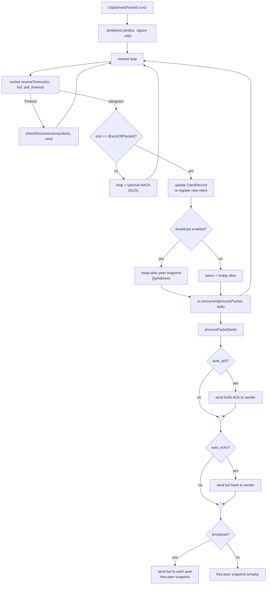
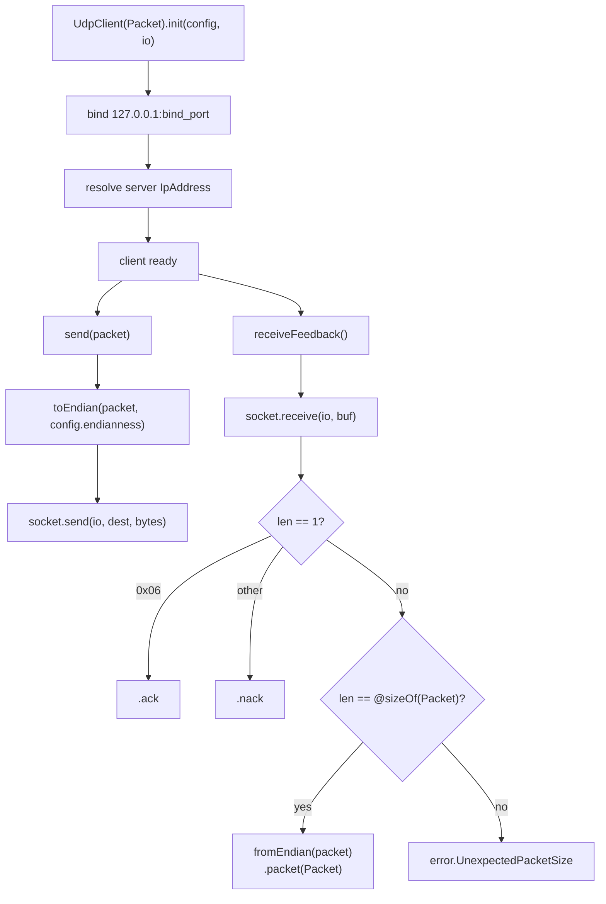
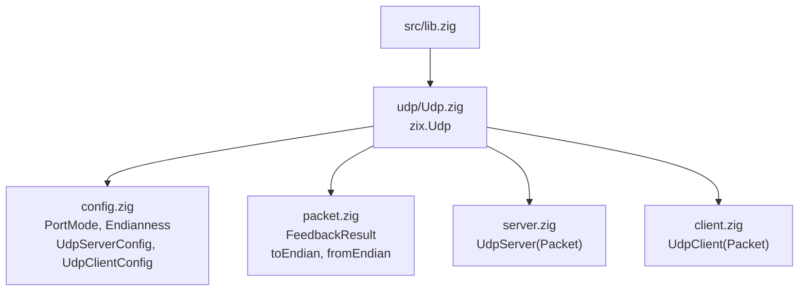
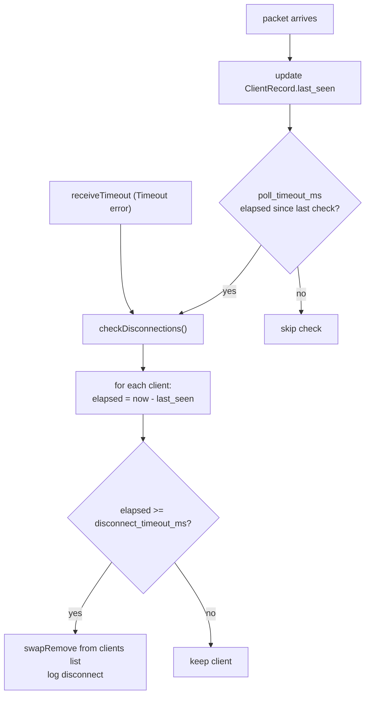
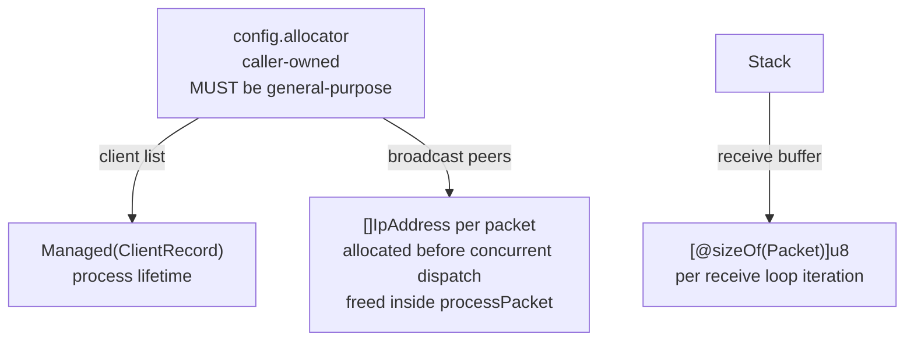

# HLD: zix.Udp

UDP server and client built on Zig 0.16.x `std.Io`. No relation to the TCP/HTTP layer.

---

## Goals

- Explicit over implicit: every behavior named in config.
- Cross-language interoperability: client can be Go, C++, Rust, or any language that speaks the same extern struct layout.
- No hardcoded packet type: user defines their own `extern struct`, zix is parameterized over it at comptime.
- Configurable endianness applied transparently on send and receive.
- Separation of concern: `src/udp/` has no import from `src/tcp/`.

---

## Runtime Model

### Server



### Client



---

## Source Layout



---

## Public API

Access via `const zix = @import("zix");`

| Symbol | Type | Description |
| :- | :- | :- |
| `zix.Udp.Server(Packet)` | generic fn | Returns `UdpServer(Packet)` type |
| `zix.Udp.Client(Packet)` | generic fn | Returns `UdpClient(Packet)` type |
| `zix.Udp.ServerConfig` | struct | Server configuration |
| `zix.Udp.ClientConfig` | struct | Client configuration |
| `zix.Udp.PortMode` | enum(u8) | `CONFIGURABLE` or `REQUIRED` |
| `zix.Udp.Endianness` | enum(u8) | `NATIVE`, `LITTLE`, `BIG` |
| `zix.Udp.FeedbackResult(Packet)` | union(enum) | `.ack`, `.nack`, `.packet(Packet)` |
| `zix.Udp.toEndian(Packet, pkt, end)` | fn | Apply endianness before wire send |
| `zix.Udp.fromEndian(Packet, pkt, end)` | fn | Apply endianness after wire receive |

### UdpServer(Packet) methods

| Method | Description |
| :- | :- |
| `init(config)` | REQUIRED mode: port must be non-zero |
| `initArgs(config, args)` | CONFIGURABLE mode: reads `--port` from CLI args |
| `run()` | Bind socket (io from config.io), enter receive loop. Blocks until error. |
| `deinit()` | Release resources. |

### UdpClient(Packet) methods

| Method | Description |
| :- | :- |
| `init(config, io)` | REQUIRED mode: binds socket immediately |
| `initArgs(config, io, args)` | CONFIGURABLE mode: reads `--bind-port` and `--server-port` |
| `send(packet)` | Apply endianness and send to server |
| `receiveFeedback()` | Blocking receive: returns `FeedbackResult` |
| `deinit()` | Close socket. |

---

## UdpServerConfig

```zig
pub const UdpServerConfig = struct {
    allocator:             std.mem.Allocator,          // caller-owned, used for client list and broadcast snapshots
    ip:                    []const u8,                 // bind address
    port:                  u16,                        // bind port & must be non-zero
    port_mode:             PortMode   = .REQUIRED,
    endianness:            Endianness = .LITTLE,
    disconnect_timeout_ms: i64        = 5000, // silence before client considered disconnected
    poll_timeout_ms:       i64        = 2000, // receiveTimeout interval for disconnect checks
    auto_ack:              bool       = false, // send 0x06 ACK to sender on receipt
    error_report:          bool       = false, // send 0x15 NACK on malformed/oversized datagram
    auto_echo:             bool       = false, // send received packet back to sender only
    broadcast:             bool       = false, // relay received packet to all connected clients
};
```

`allocator`, `ip`, and `port` are required (no defaults). `auto_ack` and `auto_echo` are independent: both can be true simultaneously (ACK then echo). `broadcast` sends to all clients, `auto_echo` sends only to the sender.

---

## UdpClientConfig

```zig
pub const UdpClientConfig = struct {
    server_ip:   []const u8, // server address to send packets to
    server_port: u16,        // server port & must be non-zero
    bind_port:   u16,        // local port: server uses this to send responses back
    port_mode:   PortMode   = .REQUIRED,
    endianness:  Endianness = .LITTLE, // must match server
    send_once:   bool       = false,
    send_every:  u64        = 99, // milliseconds between sends in run loop
};
```

`server_ip`, `server_port`, and `bind_port` are required (no defaults). `UdpClient` makes no heap allocations (all buffers are stack-allocated), so no `allocator` field is needed.

---

## Packet Model

The user defines their own `extern struct`. zix is parameterized over it at comptime.

```zig
// User-defined: must be an extern struct for fixed C ABI layout.
// All clients and the server must use the exact same definition.
const Packet = extern struct {
    id:          [16]u8,   // u8 arrays are NOT byte-swapped (identity bytes)
    packet_type: i32,      // swapped on non-native endian
    register:    u32,      // swapped on non-native endian
    position:    [3]f64,   // each element swapped on non-native endian
};

const MyServer = zix.Udp.Server(Packet);
const MyClient = zix.Udp.Client(Packet);
```

zix enforces at comptime (RFC 768):
```
@sizeOf(Packet) must be <= 65,507 bytes
(65,535 - 8 UDP header - 20 min IPv4 header)
```

---

## Port Mode

| Mode | Behavior | CLI key |
| :- | :- | :- |
| `REQUIRED` | Port from config struct. `init()` fails with `error.PortNotConfigured` if port is zero. | none |
| `CONFIGURABLE` | Port read from CLI args. Falls back to config default if arg absent. Never fails for missing arg. | `--port` (server), `--bind-port` / `--server-port` (client) |

Validation happens at `init()`, not at `run()`.

---

## Endianness

| Value | Description |
| :- | :- |
| `NATIVE` | No swap. Same machine only (unsafe across platforms or languages). |
| `LITTLE` | Swap if native is big-endian. Recommended for cross-language use (x86, ARM). |
| `BIG` | Swap if native is little-endian. Network byte order (RFC 791 convention). |

Endianness conversion is transparent: applied inside `send()` and `receive()`. User declares once in config. `toEndian` and `fromEndian` are the same operation (swap is its own inverse).

Swapping rules by field type:
- `int`: `@byteSwap`
- `float`: reinterpret as unsigned int, `@byteSwap`, reinterpret back
- `[N]T` where T is not u8: swap each element recursively
- `[N]u8`: no swap (identity bytes, e.g. id fields)

---

## Disconnect Detection

UDP has no connection state. Disconnect detection is purely timeout-based.



Worst-case detection delay: `disconnect_timeout_ms + poll_timeout_ms`. There is no OS-level signal equivalent to TCP FIN.

---

## Feedback Shape

| Scenario | Server behavior | Client decodes as |
| :- | :- | :- |
| `auto_ack = true` | Send 1 byte `0x06` to sender | `.ack` |
| `error_report = true` | Send 1 byte `0x15` to sender on bad datagram | `.nack` |
| `auto_echo = true` | Send full packet back to sender | `.packet(Packet)` |
| `broadcast = true` | Send full packet to all connected clients | `.packet(Packet)` |

ACK/NACK byte values (`0x06`, `0x15`) are ASCII control codes (ACK, NAK). They are an application-level convention, not mandated by any RFC.

---

## Concurrency Model

Matches the TCP/HTTP pattern: the caller owns the `io` backend. Pass `process.io` for runtime-managed concurrency or `threaded.io()` for an explicit cap. `io.concurrent()` is used internally to dispatch `processPacket`.

---

## Memory Model



| Scope | Allocator | Lifetime |
| :- | :- | :- |
| ClientRecord list | `config.allocator` | Server process lifetime |
| Peer snapshot (broadcast) | `config.allocator` | Single packet dispatch |
| Receive buffer | Stack | Single receive loop iteration |
| Socket | OS | `init()` to `deinit()` |

### Why ArenaAllocator is not suitable

`ArenaAllocator.free()` is a no-op: memory is only reclaimed when the entire arena is deinited. The broadcast peer snapshot is allocated and freed on every packet. Using an arena silently converts each `free(peers)` into a no-op, causing unbounded memory growth for the lifetime of the server:

```zig
// Each packet received when broadcast = true:
allocator.alloc(IpAddress, N)  // real allocation, arena grows
allocator.free(peers)          // no-op on ArenaAllocator, memory never reclaimed
// After M packets: M * N * @sizeOf(IpAddress) bytes held permanently
```

Use `std.heap.smp_allocator` (or any general-purpose allocator) so that `free()` is real. `std.testing.allocator` (backed by `GeneralPurposeAllocator`) is the correct choice in tests: it will catch any leak if the `free` path is ever broken.

---

## RFC Notes

- **RFC 768 (UDP)**: Port 0 is reserved. `init()` rejects it with `error.PortNotConfigured`. Max payload is 65,507 bytes, enforced at comptime via `@compileError`.
- **RFC 791 / network convention**: `Endianness.BIG` corresponds to network byte order (big-endian).
- Timeout-based disconnect detection has no RFC (application-level behavior since UDP is connectionless).
- ACK (0x06) and NACK (0x15) byte values are ASCII control codes, not defined by any UDP RFC.

---

## Logger Integration

`UdpServerConfig.logger: ?*Logger = null`. When non-null:
- `system(.INFO, "udp", ...)` on bind and shutdown.
- `packet(.RECV, peer, size, err)` inside `processPacket` after each received datagram. `peer` is the sender address; `size` is `@sizeOf(Packet)`.

```zig
var logger = try zix.Logger.init(std.heap.smp_allocator, .{
    .console = .ALWAYS,
});
defer logger.deinit();

var server = try MyServer.init(.{
    .allocator = std.heap.smp_allocator,
    .ip        = "127.0.0.1",
    .port      = 9100,
    .logger    = &logger,
});
```

`frame()` is not auto-called by the UDP server (UDP has no framing layer). Use `logger.frame()` manually inside custom processing logic if needed.

See `docs/hld-logger.md` for log line format and config details.

---

## Not Yet Implemented

| Feature | Note |
| :- | :- |
| `sendmmsg` batching | N sequential `send()` per broadcast, `sendmmsg` would reduce to 1 syscall |
| Sub-millisecond send interval | `send_every` is in milliseconds, rename to nanoseconds if needed |
| Arena-allocated peers cap removal | PoC used `MAX_BROADCAST_CLIENTS=64`. Current src uses heap slice with no cap |
| Configurable feedback struct | Currently echo sends the raw packet back. Production could use a tagged result |

<!-- tickrate 64 vs 128 -->

---

###### end of hld-udp
