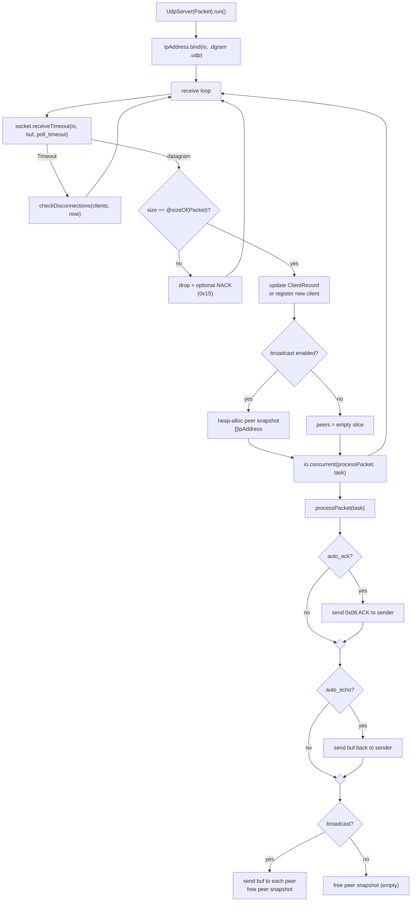
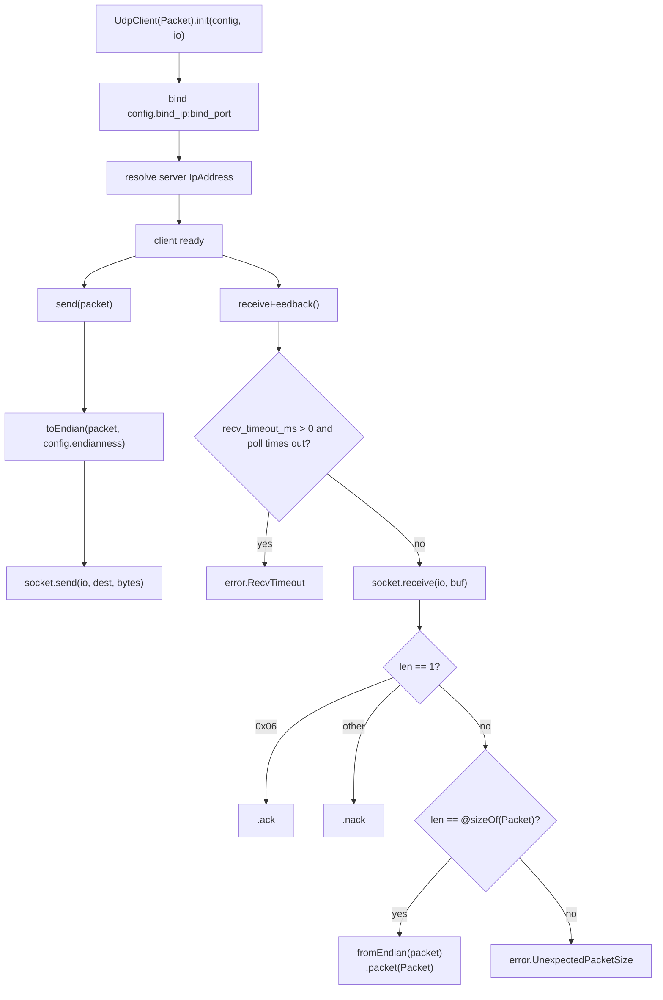
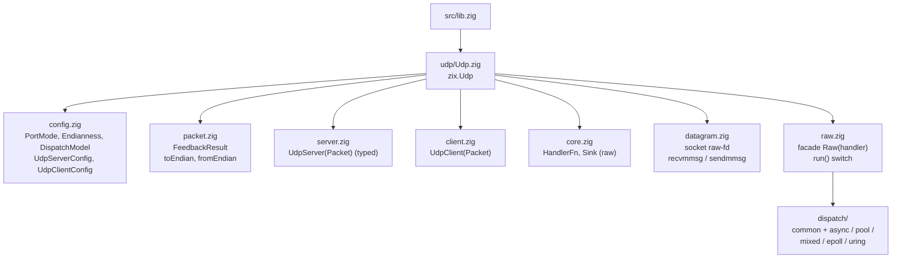
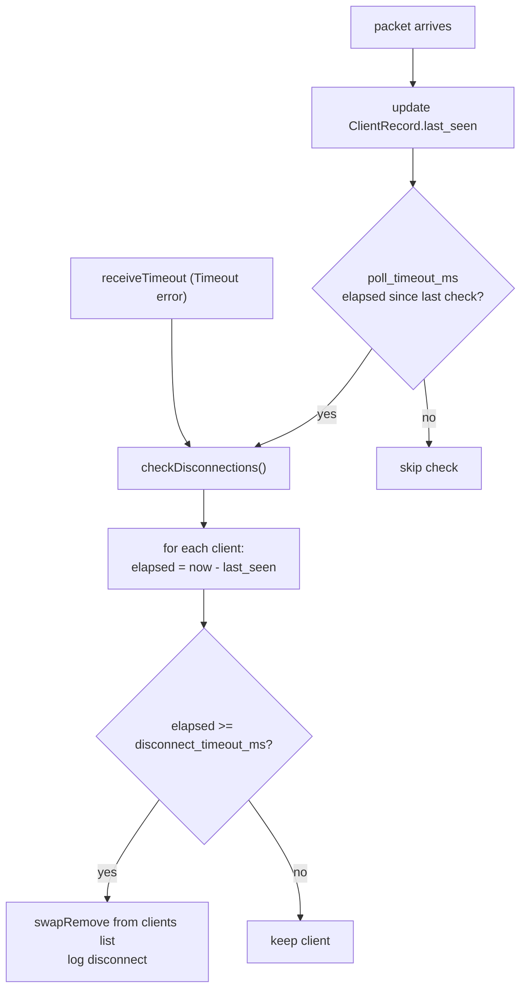
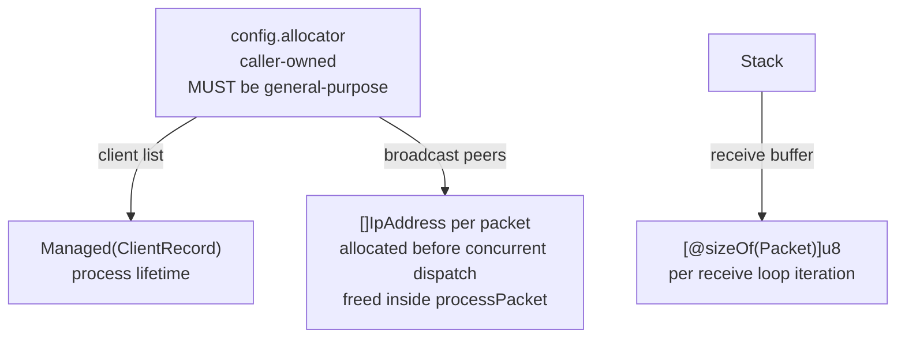

# HLD: zix.Udp

UDP server dan client yang dibangun di atas Zig 0.16.x `std.Io`. Tidak terkait dengan lapisan TCP/HTTP.

---

## Tujuan

- Eksplisit bukan implisit: setiap perilaku disebutkan secara langsung dalam konfigurasi.
- Interoperabilitas lintas bahasa: client dapat berupa Go, C++, Rust, atau bahasa lain yang menggunakan layout `extern struct` yang sama.
- Tidak ada tipe paket yang dikodekan secara tetap: pengguna mendefinisikan `extern struct` sendiri, zix diparameterisasi atas tipe tersebut saat comptime.
- Endianness yang dapat dikonfigurasi diterapkan secara transparan saat mengirim dan menerima.
- Pemisahan tanggung jawab: `src/udp/` tidak mengimpor apapun dari `src/tcp/`.

---

## Runtime Model

### Server



### Client



---

## Struktur Berkas



---

## API Publik

Akses melalui `const zix = @import("zix");`

| Simbol | Tipe | Deskripsi |
| :- | :- | :- |
| `zix.Udp.Server(Packet)` | generic fn | Mengembalikan tipe `UdpServer(Packet)` (typed messaging) |
| `zix.Udp.Client(Packet)` | generic fn | Mengembalikan tipe `UdpClient(Packet)` |
| `zix.Udp.Raw(handler)` | generic fn | Mengembalikan tipe server datagram raw-bytes (ADR-049) |
| `zix.Udp.Sink` | struct | Antrian balasan untuk handler raw (`reply`, `replyTo`) |
| `zix.Udp.HandlerFn` | fn type | Handler raw: `fn([]const u8, *const IpAddress, *Sink) void` |
| `zix.Udp.DispatchModel` | enum(u8) | Sama dengan engine TCP, memilih bentuk worker jalur raw |
| `zix.Udp.ServerConfig` | struct | Konfigurasi server |
| `zix.Udp.ClientConfig` | struct | Konfigurasi client |
| `zix.Udp.PortMode` | enum(u8) | `CONFIGURABLE` atau `REQUIRED` |
| `zix.Udp.Endianness` | enum(u8) | `NATIVE`, `LITTLE`, `BIG` |
| `zix.Udp.FeedbackResult(Packet)` | union(enum) | `.ack`, `.nack`, `.packet(Packet)` |
| `zix.Udp.toEndian(Packet, pkt, end)` | fn | Terapkan endianness sebelum pengiriman ke jaringan |
| `zix.Udp.fromEndian(Packet, pkt, end)` | fn | Terapkan endianness setelah penerimaan dari jaringan |

### Metode UdpServer(Packet)

| Metode | Deskripsi |
| :- | :- |
| `init(config)` | Mode REQUIRED: port harus bukan nol |
| `initArgs(config, args)` | Mode CONFIGURABLE: membaca `--port` dari argumen CLI |
| `run()` | Bind socket (io dari config.io), masuk ke receive loop. Memblokir sampai terjadi error. |
| `deinit()` | Lepaskan resource. |

### Metode UdpClient(Packet)

| Metode | Deskripsi |
| :- | :- |
| `init(config, io)` | Mode REQUIRED: bind socket segera |
| `initArgs(config, io, args)` | Mode CONFIGURABLE: membaca `--bind-port` dan `--server-port` |
| `send(packet)` | Terapkan endianness dan kirim ke server |
| `receiveFeedback()` | Penerimaan blocking: mengembalikan `FeedbackResult` |
| `deinit()` | Tutup socket. |

---

## UdpServerConfig

```zig
pub const UdpServerConfig = struct {
    io:                    std.Io,                     // caller-owned, must outlive the server
    allocator:             std.mem.Allocator,          // caller-owned (client list + broadcast snapshots, raw batches)
    ip:                    []const u8,                 // bind address
    port:                  u16,                        // bind port & must be non-zero
    port_mode:             PortMode   = .REQUIRED,
    endianness:            Endianness = .LITTLE,
    disconnect_timeout_ms: i64        = 5000, // silence before client considered disconnected
    poll_timeout_ms:       i64        = 2000, // receiveTimeout interval for disconnect checks
    auto_ack:              bool       = false, // send 0x06 ACK to sender on receipt
    error_report:          bool       = false, // send 0x15 NACK on malformed/oversized datagram
    auto_echo:             bool       = false, // send received packet back to sender only
    broadcast:             bool       = false, // relay received packet to all connected clients
    logger:                ?*Logger   = null,  // lifecycle + per-packet logging when set

    // Knob datagram-transport (ADR-049), dipakai jalur raw-bytes (zix.Udp.Raw). Jalur typed jalan
    // satu loop async: ia mem-fold dispatch_model non-ASYNC dengan notice dan tidak memakai knob
    // batch / worker.
    dispatch_model:        DispatchModel = .ASYNC, // .EPOLL / .URING = worker per-core
    workers:               usize         = 0,      // 0 = satu worker per CPU
    reuse_address:         bool          = false,  // SO_REUSEADDR + SO_REUSEPORT
    recv_batch:            usize         = 32,     // ukuran batch recvmmsg
    send_batch:            usize         = 32,     // ukuran batch sendmmsg
    max_recv_buf:          usize         = 1500,   // buffer datagram raw (typed pakai @sizeOf(Packet))
};
```

`io`, `allocator`, `ip`, dan `port` wajib diisi (tidak ada nilai default). `auto_ack` dan `auto_echo` bersifat independen: keduanya dapat bernilai true secara bersamaan (ACK lalu echo). `broadcast` mengirim ke semua client, `auto_echo` hanya mengirim ke pengirim. Field datagram-transport berlaku untuk jalur raw-bytes (`zix.Udp.Raw`, lihat [Mode Raw-bytes](#mode-raw-bytes-adr-049)), typed `Server(Packet)` tidak memakainya selain mem-fold `dispatch_model` non-ASYNC.

---

## UdpClientConfig

```zig
pub const UdpClientConfig = struct {
    ip:          []const u8, // server address to send packets to
    server_port: u16,        // server port & must be non-zero
    bind_ip:     []const u8 = "127.0.0.1", // local bind address, "0.0.0.0" for all interfaces
    bind_port:   u16,        // local port: server uses this to send responses back
    port_mode:   PortMode   = .REQUIRED,
    endianness:  Endianness = .LITTLE, // must match server
    send_once:   bool       = false,
    send_every:  u64        = 99, // milliseconds between sends in run loop
    recv_timeout_ms: u32    = 0,  // receive timeout via poll, 0 = blocking
};
```

`ip`, `server_port`, dan `bind_port` wajib diisi (tidak ada nilai default). `bind_ip` default ke loopback (override dengan `--bind-ip` di mode CONFIGURABLE), dan `recv_timeout_ms` default ke receive blocking. `UdpClient` tidak melakukan heap allocation (semua buffer dialokasikan di stack), sehingga tidak dibutuhkan field `allocator`.

---

## Model Paket

Pengguna mendefinisikan `extern struct` sendiri. zix diparameterisasi atas tipe tersebut saat comptime.

```zig
// User-defined: must be an extern struct for fixed C ABI layout.
// All clients and the server must use the exact same definition.
const Packet = extern struct {
    id:          [16]u8,   // u8 arrays are NOT byte-swapped (identity bytes)
    packet_type: i32,      // swapped on non-native endian
    register:    u32,      // swapped on non-native endian
    position:    [3]f64,   // each element swapped on non-native endian
};

const MyServer = zix.Udp.Server(Packet);
const MyClient = zix.Udp.Client(Packet);
```

zix memberlakukan batasan ini saat comptime (RFC 768):
```
@sizeOf(Packet) must be <= 65,507 bytes
(65,535 - 8 UDP header - 20 min IPv4 header)
```

---

## Port Mode

| Mode | Perilaku | Kunci CLI |
| :- | :- | :- |
| `REQUIRED` | Port dari struct konfigurasi. `init()` gagal dengan `error.PortNotConfigured` jika port bernilai nol. | tidak ada |
| `CONFIGURABLE` | Port dibaca dari argumen CLI. Menggunakan default konfigurasi jika argumen tidak ada. Tidak pernah gagal karena argumen hilang. | `--port` (server), `--bind-port` / `--server-port` (client) |

Validasi dilakukan saat `init()`, bukan saat `run()`.

---

## Endianness

| Nilai | Deskripsi |
| :- | :- |
| `NATIVE` | Tanpa swap. Hanya untuk mesin yang sama (tidak aman lintas platform atau bahasa). |
| `LITTLE` | Swap jika native adalah big-endian. Direkomendasikan untuk penggunaan lintas bahasa (x86, ARM). |
| `BIG` | Swap jika native adalah little-endian. Network byte order (konvensi RFC 791). |

Konversi endianness bersifat transparan: diterapkan di dalam `send()` dan `receive()`. Pengguna mendeklarasikan sekali dalam konfigurasi. `toEndian` dan `fromEndian` adalah operasi yang sama (swap adalah kebalikan dari dirinya sendiri).

Aturan swap berdasarkan tipe field:
- `int`: `@byteSwap`
- `float`: interpretasi ulang sebagai unsigned int, `@byteSwap`, interpretasi ulang kembali
- `[N]T` di mana T bukan u8: swap setiap elemen secara rekursif
- `[N]u8`: tanpa swap (identity bytes, misalnya field id)

---

## Disconnect

UDP tidak memiliki status koneksi. Deteksi disconnect murni berbasis timeout.



Penundaan deteksi maksimum: `disconnect_timeout_ms + poll_timeout_ms`. Tidak ada sinyal tingkat OS yang setara dengan TCP FIN.

---

## Bentuk Feedback

| Skenario | Perilaku server | Client mendekode sebagai |
| :- | :- | :- |
| `auto_ack = true` | Kirim 1 byte `0x06` ke pengirim | `.ack` |
| `error_report = true` | Kirim 1 byte `0x15` ke pengirim pada datagram yang rusak | `.nack` |
| `auto_echo = true` | Kirim packet lengkap kembali ke pengirim | `.packet(Packet)` |
| `broadcast = true` | Kirim packet lengkap ke semua client yang terhubung | `.packet(Packet)` |

Nilai byte ACK/NACK (`0x06`, `0x15`) adalah kode kontrol ASCII (ACK, NAK). Keduanya merupakan konvensi tingkat aplikasi, bukan mandat dari RFC manapun.

---

## Model Konkurensi

Mengikuti pola TCP/HTTP: pemanggil memiliki backend `io`. Teruskan `process.io` untuk konkurensi yang dikelola runtime atau `threaded.io()` untuk batas eksplisit. `io.concurrent()` digunakan secara internal untuk mendispatch `processPacket`.

---

## Model Memori



| Ruang Lingkup | Allocator | Masa Hidup |
| :- | :- | :- |
| Daftar ClientRecord | `config.allocator` | Masa hidup proses server |
| Peer snapshot (broadcast) | `config.allocator` | Satu dispatch packet |
| Receive buffer | Stack | Satu iterasi receive loop |
| Socket | OS | `init()` hingga `deinit()` |

### Mengapa ArenaAllocator tidak cocok

`ArenaAllocator.free()` adalah no-op: memori hanya diklaim kembali ketika seluruh arena di-deinit. Broadcast peer snapshot dialokasikan dan dibebaskan pada setiap packet. Menggunakan arena secara diam-diam mengubah setiap `free(peers)` menjadi no-op, menyebabkan pertumbuhan memori tanpa batas selama masa hidup server:

```zig
// Each packet received when broadcast = true:
allocator.alloc(IpAddress, N)  // real allocation, arena grows
allocator.free(peers)          // no-op on ArenaAllocator, memory never reclaimed
// After M packets: M * N * @sizeOf(IpAddress) bytes held permanently
```

Gunakan `std.heap.smp_allocator` (atau general-purpose allocator apapun) agar `free()` benar-benar berfungsi. `std.testing.allocator` (didukung oleh `GeneralPurposeAllocator`) adalah pilihan yang tepat dalam pengujian: allocator ini akan mendeteksi kebocoran apapun jika jalur `free` rusak.

---

## Catatan RFC

- **RFC 768 (UDP)**: Port 0 adalah reserved. `init()` menolaknya dengan `error.PortNotConfigured`. Payload maksimum adalah 65.507 byte, diberlakukan saat comptime melalui `@compileError`.
- **RFC 791 / konvensi jaringan**: `Endianness.BIG` bersesuaian dengan network byte order (big-endian).
- Deteksi disconnect berbasis timeout tidak memiliki RFC (perilaku tingkat aplikasi karena UDP tidak memiliki koneksi).
- Nilai byte ACK (0x06) dan NACK (0x15) adalah kode kontrol ASCII, tidak didefinisikan oleh RFC UDP manapun.

---

## Integrasi Logger

`UdpServerConfig.logger: ?*Logger = null`. Ketika bernilai non-null:
- `system(.INFO, "udp", ...)` saat bind dan shutdown.
- `packet(.RECV, peer, size, err)` di dalam `processPacket` setelah setiap datagram diterima. `peer` adalah alamat pengirim. `size` adalah `@sizeOf(Packet)`.

```zig
var logger = try zix.Logger.init(std.heap.smp_allocator, .{
    .console = .ALWAYS,
});
defer logger.deinit();

var server = try MyServer.init(.{
    .allocator = std.heap.smp_allocator,
    .ip        = "127.0.0.1",
    .port      = 9100,
    .logger    = &logger,
});
```

`frame()` tidak dipanggil secara otomatis oleh UDP server (UDP tidak memiliki lapisan framing). Gunakan `logger.frame()` secara manual di dalam logika pemrosesan kustom jika diperlukan.

Lihat `docs/hld-logger-id.md` untuk format baris log dan detail konfigurasi.

---

## Mode Raw-bytes (ADR-049)

Berdampingan dengan typed `Server(Packet)`, `zix.Udp.Raw(handler)` melayani datagram variable-length tanpa packet struct tetap. Ia adalah substrate datagram-transport yang ditumpangi engine `zix.Http3` (QUIC), berguna mandiri untuk server echo, DNS-style, dan telemetry.

- Handler: `fn(datagram: []const u8, peer: *const std.Io.net.IpAddress, sink: *Sink) void`. Ia menerima byte apa adanya (hingga `max_recv_buf`), peer, dan `Sink`. `sink.reply(bytes)` membalas pengirim tanpa konversi address, `sink.replyTo(peer, bytes)` membalas peer eksplisit.
- I/O batched (Linux): menerima dalam batch `recvmmsg` (`recv_batch`), mengirim dalam batch `sendmmsg` (`send_batch`). Balasan digabung jadi satu `sendmmsg` per batch yang diterima. Non-Linux jatuh ke satu loop receive `std.Io.net`.
- Dispatch (`dispatch_model`, enum yang sama dengan engine TCP, dipartisi sesuai ADR-043 ke `src/udp/dispatch/`): `.EPOLL` / `.URING` menjalankan satu worker SO_REUSEPORT per CPU (per-core shared-nothing), `.ASYNC` / `.POOL` / `.MIXED` menjalankan satu worker. `.URING` di-fold ke loop per-core recvmmsg untuk sekarang.

```zig
fn handler(dg: []const u8, peer: *const std.Io.net.IpAddress, sink: *zix.Udp.Sink) void {
    sink.reply(dg); // echo back to the sender
}

const Echo = zix.Udp.Raw(handler);
var server = try Echo.init(.{ .io = io, .allocator = std.heap.smp_allocator, .ip = "0.0.0.0", .port = 9064 });
try server.run();
```

Lihat `examples/udp_raw_echo.zig` dan ADR-049 (`docs/adr-id.md`).

---

## Belum Diimplementasikan

| Fitur | Catatan |
| :- | :- |
| Batching `sendmmsg` di loop broadcast typed | Sudah ada di jalur raw (`zix.Udp.Raw`). Broadcast typed masih melakukan N `send()` berurutan |
| GSO / GRO / ECN raw | Ditunda (ADR-049 fase 2): butuh jalur cmsg yang divalidasi hardware (GRO coalescing butuh splitter) |
| Submission io_uring khusus untuk `.URING` raw | Ditunda: `.URING` di-fold ke loop per-core recvmmsg untuk sekarang |
| Interval pengiriman sub-milidetik | `send_every` dalam milidetik, ganti nama ke nanodetik jika diperlukan |
| Struct feedback yang dapat dikonfigurasi | Saat ini echo mengirimkan kembali packet mentah. Produksi dapat menggunakan tagged result |

<!-- tickrate 64 vs 128 -->

---

###### end of hld-udp
