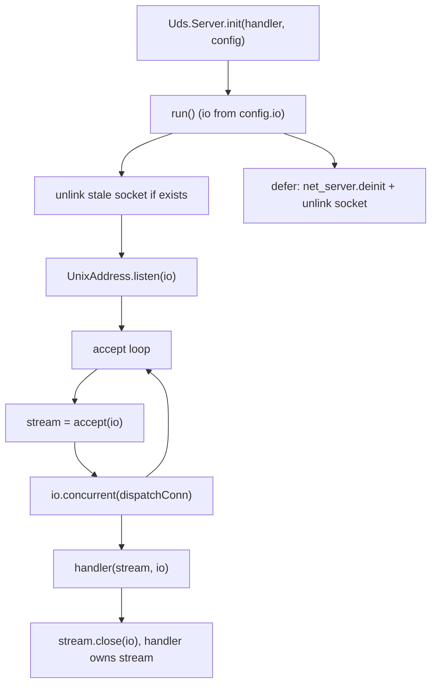
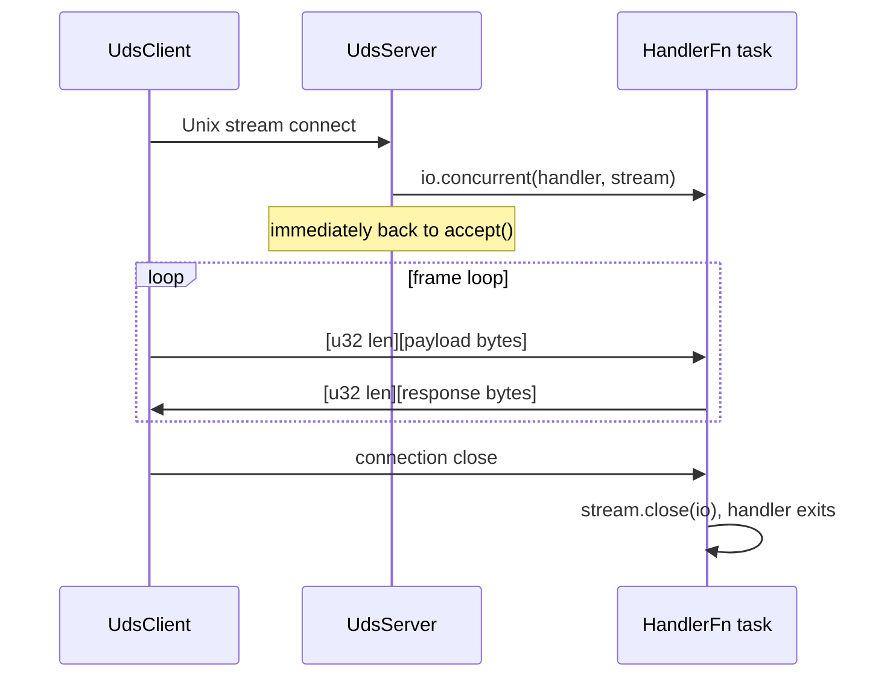

# HLD: zix.Uds

Unix Domain Socket server and client. Same-host IPC only (no network routing).

---

## Status

Implemented. See ADR-010 for design rationale.

---

## Goals

- Explicit over implicit: same config pattern as `zix.Udp`.
- Same-host IPC using stream sockets (connection-oriented).
- Length-prefixed framing built into the default echo handler and the client API.
- No cross-protocol dependencies: `src/uds/` has no import from `src/tcp/` or `src/udp/`.
- Namespace follows the same pattern: `zix.Uds.Server`, `zix.Uds.Client`.

---

## Source Layout

```
src/uds/
    config.zig   // UdsServerConfig, UdsClientConfig
    server.zig   // UdsServer, HandlerFn, echoHandler
    client.zig   // UdsClient
    Uds.zig      // namespace aggregator
```

Export from `src/lib.zig`:
```zig
pub const Uds = @import("uds/Uds.zig");
```

---

## Public API

| Symbol | Type | Description |
| :- | :- | :- |
| `zix.Uds.Server` | namespace | `init(handler, config)` returns a server with `run()` / `deinit()`. The built-in `echoHandler` is passed explicitly |
| `zix.Uds.Client` | struct | `connect(config, io)` / `sendMsg(io, msg)` / `recvMsg(io, buf)` / `deinit(io)` |
| `zix.Uds.ServerConfig` | struct | `io`, `path`, `allocator`, `kernel_backlog` (128), `max_recv_buf` (4096), `recv_timeout_ms` (0), `send_timeout_ms` (0), `logger` (null) |
| `zix.Uds.ClientConfig` | struct | `path`, `recv_timeout_ms` (0), `send_timeout_ms` (0) |
| `zix.Uds.HandlerFn` | type | `*const fn(stream: std.Io.net.Stream, io: std.Io) void` |
| `zix.Uds.echoHandler` | fn | Default echo handler: reads length-prefixed frames and echoes each back |

---

## Frame Format

Both the built-in `echoHandler` and `UdsClient.sendMsg`/`recvMsg` use a simple length-prefixed frame:

```
[ u32 payload_len, 4 bytes, big-endian ]
[ payload bytes, payload_len bytes ]
```

Frames with `payload_len > max_recv_buf` (default 4096) close the connection.

---

## Server Lifecycle



- Stale socket file is unlinked before binding (safe restart after crash).
- Each accepted connection is dispatched as a concurrent task via `io.concurrent()`.
- Fallback to synchronous dispatch if concurrent pool is exhausted.
- Socket file is unlinked again when `run()` returns.

---

## Client Lifecycle

```
connect(config, io)  -->  sendMsg(io, msg)  -->  recvMsg(io, buf)  -->  deinit(io)
                          (loop as needed)
```

`UdsClient` holds a single persistent `std.Io.net.Stream`. Reconnection on error is the caller's responsibility (see `examples/uds_http.zig` for the reconnect-on-failure pattern).

---

## Connection Lifecycle



---

## Error Handling

| Error | Source | Meaning |
| :- | :- | :- |
| `error.PathEmpty` | `Server.init()` | `config.path` is empty |
| `error.MessageTooLarge` | `Client.recvMsg()` | server frame payload exceeds caller's `buf.len` |
| `error.ConnectionClosed` | `Client.recvMsg()` | server closed the connection mid-frame |

---

## Timeouts and Limitations

`recv_timeout_ms` / `send_timeout_ms` (both configs, default 0 = disabled) bound the socket, not the connect call. On the server, `applyConnTimeout` sets `SO_RCVTIMEO` / `SO_SNDTIMEO` on each accepted connection before the handler runs. On the client, `recvMsg` / `sendMsg` each poll (`POLLIN` / `POLLOUT`) ahead of the read or write, returning `error.RecvTimeout` / `error.SendTimeout` on expiry, rather than `SO_RCVTIMEO` / `SO_SNDTIMEO`, since `std.Io.Threaded` panics on `EAGAIN`.

`std.Io.net.UnixAddress.connect` takes no timeout parameter. Unlike TCP's `IpAddress.connect`, which accepts `ConnectOptions.timeout`, the UDS connect path has no stdlib hook for a deadline, so a connect-time timeout is not implementable without a stdlib change. This limitation is stdlib-imposed, not a zix design decision, and will be revisited when the stdlib exposes the necessary primitive.

---

## Examples

| File | Pattern |
| :- | :- |
| `examples/uds_server.zig` | Data provider: increments counter per frame |
| `examples/uds_http.zig` | HTTP frontend backed by UDS: SSE, one-shot endpoint, Channel bridge |

---

## Logger Integration

`UdsServerConfig.logger: ?*Logger = null`. When non-null:
- `system(.INFO, "uds", ...)` on bind, accepted connection, and shutdown.

The server does not call `frame()` automatically: `frame()` is available for manual use inside `HandlerFn` implementations that want per-frame logging:

```zig
fn myHandler(stream: std.Io.net.Stream, io: std.Io) void {
    defer stream.close(io);
    // ...
    // logger.frame(.RECV, SOCK_PATH, payload_len, null);
}
```

```zig
var logger = try zix.Logger.init(std.heap.smp_allocator, .{
    .console = .ALWAYS,
});
defer logger.deinit();

var server = try zix.Uds.Server.init(.{
    .path      = "/tmp/app.sock",
    .allocator = std.heap.smp_allocator,
    .logger    = &logger,
});
```

See `docs/hld-logger.md` for log line format and config details.

---

## Platform Support

UDS stream sockets require `std.Io.net.has_unix_sockets == true`. This is true on Linux, macOS, and Windows 10 RS4+. WASI is not supported. Both `Server.init()` and `Client.connect()` emit `@compileError` on unsupported platforms.

---

###### end of hld-uds
