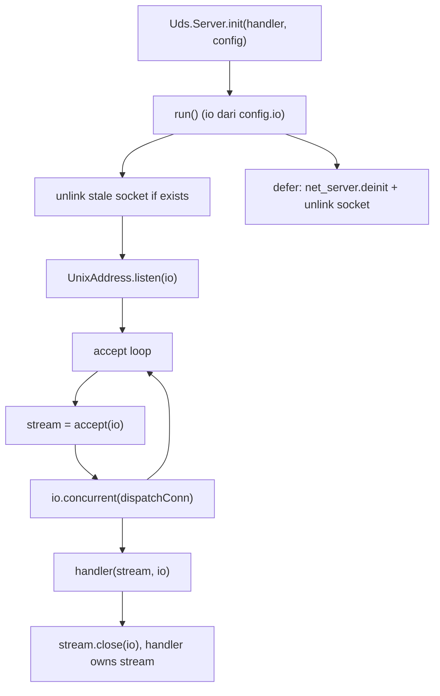
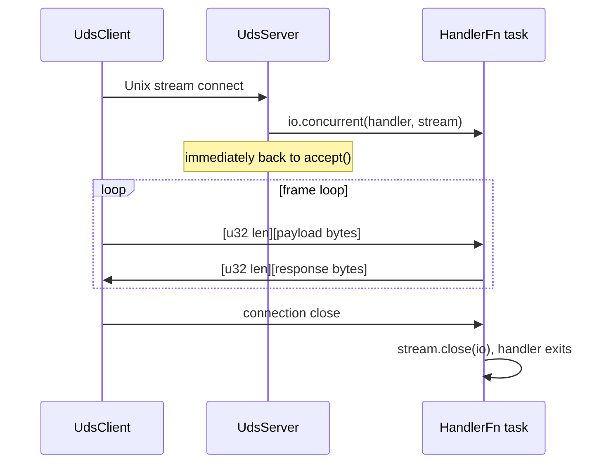

# HLD: zix.Uds

Server dan client Unix Domain Socket. Hanya untuk IPC pada host yang sama (tidak ada routing jaringan).

---

## Status

Sudah diimplementasi. Lihat ADR-010 untuk dasar keputusan desain.

---

## Tujuan

- Eksplisit bukan implisit: pola konfigurasi sama dengan `zix.Udp`.
- IPC pada host yang sama menggunakan stream socket (berbasis koneksi).
- Framing berbasis length-prefix sudah tersedia di default echo handler dan API client.
- Tidak ada dependensi lintas protokol: `src/uds/` tidak mengimpor dari `src/tcp/` maupun `src/udp/`.
- Namespace mengikuti pola yang sama: `zix.Uds.Server`, `zix.Uds.Client`.

---

## Struktur Berkas

```
src/uds/
    config.zig   // UdsServerConfig, UdsClientConfig
    server.zig   // UdsServer, HandlerFn, echoHandler
    client.zig   // UdsClient
    Uds.zig      // namespace aggregator
```

Ekspor dari `src/lib.zig`:
```zig
pub const Uds = @import("uds/Uds.zig");
```

---

## API Publik

| Simbol | Tipe | Deskripsi |
| :- | :- | :- |
| `zix.Uds.Server` | namespace | `init(handler, config)` mengembalikan server dengan `run()` / `deinit()`. `echoHandler` bawaan dilewatkan secara eksplisit |
| `zix.Uds.Client` | struct | `connect(config, io)` / `sendMsg(io, msg)` / `recvMsg(io, buf)` / `deinit(io)` |
| `zix.Uds.ServerConfig` | struct | `io`, `path`, `allocator`, `kernel_backlog` (128), `max_recv_buf` (4096), `recv_timeout_ms` (0), `send_timeout_ms` (0), `logger` (null) |
| `zix.Uds.ClientConfig` | struct | `path`, `recv_timeout_ms` (0), `send_timeout_ms` (0) |
| `zix.Uds.HandlerFn` | type | `*const fn(stream: std.Io.net.Stream, io: std.Io) void` |
| `zix.Uds.echoHandler` | fn | Default echo handler: membaca frame berbasis length-prefix dan mengembalikan setiap frame |

---

## Format Frame

Baik `echoHandler` bawaan maupun `UdsClient.sendMsg`/`recvMsg` menggunakan format frame sederhana berbasis length-prefix:

```
[ u32 payload_len, 4 bytes, big-endian ]
[ payload bytes, payload_len bytes ]
```

Frame dengan `payload_len > max_recv_buf` (default 4096) akan menutup koneksi.

---

## Siklus Hidup Server



- Berkas socket lama di-unlink sebelum binding (restart aman setelah crash).
- Setiap koneksi yang diterima di-dispatch sebagai task konkuren melalui `io.concurrent()`.
- Fallback ke dispatch sinkron jika concurrent pool habis.
- Berkas socket di-unlink kembali saat `run()` selesai.

---

## Siklus Hidup Client

```
connect(config, io)  -->  sendMsg(io, msg)  -->  recvMsg(io, buf)  -->  deinit(io)
                          (ulangi sesuai kebutuhan)
```

`UdsClient` memegang satu `std.Io.net.Stream` yang persisten. Reconeksi saat error menjadi tanggung jawab pemanggil (lihat `examples/uds_http.zig` untuk pola reconnect-on-failure).

---

## Siklus Hidup Koneksi



---

## Penanganan Error

| Error | Sumber | Arti |
| :- | :- | :- |
| `error.PathEmpty` | `Server.init()` | `config.path` kosong |
| `error.MessageTooLarge` | `Client.recvMsg()` | payload frame dari server melebihi `buf.len` pemanggil |
| `error.ConnectionClosed` | `Client.recvMsg()` | server menutup koneksi di tengah frame |

---

## Timeout dan Keterbatasan

`recv_timeout_ms` / `send_timeout_ms` (kedua config, default 0 = dinonaktifkan) membatasi socket, bukan call connect. Pada server, `applyConnTimeout` menyetel `SO_RCVTIMEO` / `SO_SNDTIMEO` pada tiap koneksi yang diterima sebelum handler berjalan. Pada client, `recvMsg` / `sendMsg` masing-masing poll (`POLLIN` / `POLLOUT`) sebelum read atau write, mengembalikan `error.RecvTimeout` / `error.SendTimeout` saat expired, alih-alih `SO_RCVTIMEO` / `SO_SNDTIMEO`, karena `std.Io.Threaded` panic pada `EAGAIN`.

`std.Io.net.UnixAddress.connect` tidak menerima parameter timeout. Berbeda dengan `IpAddress.connect` pada TCP yang menerima `ConnectOptions.timeout`, path connect UDS tidak memiliki hook di stdlib untuk deadline, jadi timeout saat connect tidak dapat diimplementasi tanpa perubahan di stdlib. Keterbatasan ini disebabkan oleh stdlib, bukan keputusan desain zix, dan akan ditinjau kembali saat stdlib menyediakan primitif yang diperlukan.

---

## Contoh

| Berkas | Pola |
| :- | :- |
| `examples/uds_server.zig` | Penyedia data: menaikkan counter per frame |
| `examples/uds_http.zig` | HTTP frontend berbasis UDS: SSE, one-shot endpoint, Channel bridge |

---

## Integrasi Logger

`UdsServerConfig.logger: ?*Logger = null`. Saat tidak null:
- `system(.INFO, "uds", ...)` dipanggil saat bind, koneksi diterima, dan shutdown.

Server tidak memanggil `frame()` secara otomatis: `frame()` tersedia untuk penggunaan manual di dalam implementasi `HandlerFn` yang ingin mencatat log per frame:

```zig
fn myHandler(stream: std.Io.net.Stream, io: std.Io) void {
    defer stream.close(io);
    // ...
    // logger.frame(.RECV, SOCK_PATH, payload_len, null);
}
```

```zig
var logger = try zix.Logger.init(std.heap.smp_allocator, .{
    .console = .ALWAYS,
});
defer logger.deinit();

var server = try zix.Uds.Server.init(.{
    .path      = "/tmp/app.sock",
    .allocator = std.heap.smp_allocator,
    .logger    = &logger,
});
```

Lihat `docs/hld-logger-id.md` untuk format baris log dan detail konfigurasi.

---

## Dukungan Platform

Stream socket UDS memerlukan `std.Io.net.has_unix_sockets == true`. Kondisi ini terpenuhi di Linux, macOS, dan Windows 10 RS4+. WASI tidak didukung. Baik `Server.init()` maupun `Client.connect()` menghasilkan `@compileError` pada platform yang tidak didukung.

---

###### end of hld-uds
