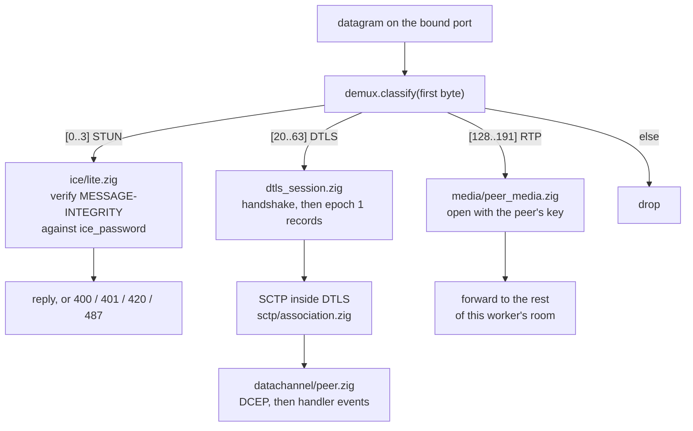
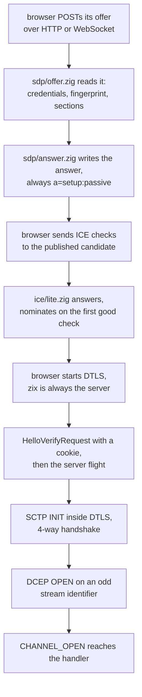
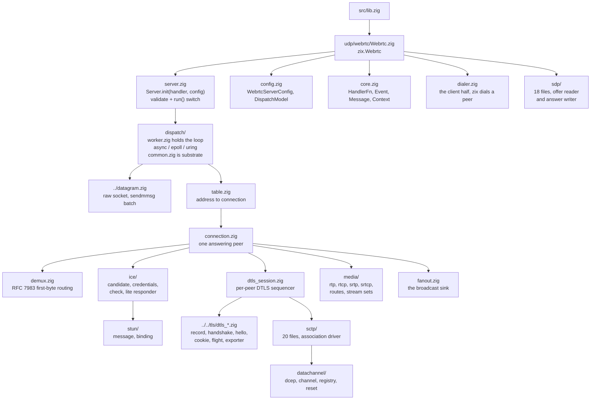
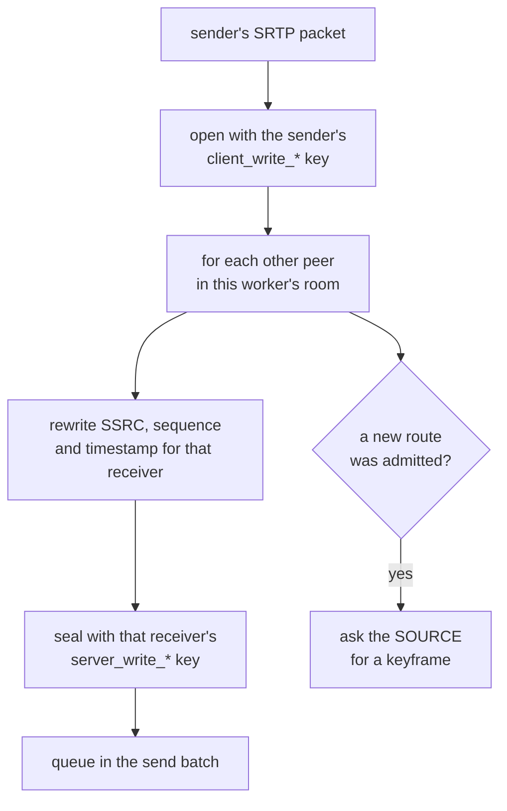

# HLD: zix.Webrtc

Pure-Zig WebRTC peer: ICE-lite (RFC 8445) over STUN (RFC 8489), DTLS 1.2 (RFC 6347), SCTP (RFC 9260) data channels (RFC 8831 / 8832), SDP offer and answer (RFC 8866 / 8829), and SRTP media forwarding (RFC 3711 / 5764). DTLS is mandatory: WebRTC has no cleartext mode. No OpenSSL, all crypto rides `std.crypto`.

---

## Goals

- Reach a browser. That is the whole reason this engine exists: a browser cannot open a raw socket, and WebRTC is the only transport it offers that gives unreliable delivery, a per-channel ordering choice, and audio and video.
- One coherent engine family: the same `DispatchModel` enum, the same `Tls.Context`, the same flat config shape as every other zix engine.
- Pure-Zig from the RFCs, with 32 current-generation WebRTC RFCs read rather than a library wrapped.
- The server is the product, the primitives are exposed: STUN, ICE, SCTP, DCEP, SDP and SRTP building blocks are public so a peer or a test harness can build the other side of the wire.
- Separation of concern: one file owns one wire format. 84 files under `src/udp/webrtc/`, plus the 9 `dtls_*` files that live in `src/tls/` beside the TLS code they share primitives with.
- Forward media, never decode it. The engine has no codec and no opinion about what a payload is.

---

## Runtime Model

### One datagram, five protocols

Everything arrives on one UDP port. The first byte says what it is (RFC 7983 section 7).



### Bringing one peer up



---

## Source Layout



---

## Public API

Access via `const zix = @import("zix");`

| Symbol | Type | Description |
| :- | :- | :- |
| `zix.Webrtc.Server` | struct | `Server.init(handler, config)` returns the server, the handler baked in at comptime |
| `zix.Webrtc.HandlerFn` | fn type | `fn(event: Event, ctx: *Context) anyerror!void` |
| `zix.Webrtc.Event` | union(enum) | `CHANNEL_OPEN`, `CHANNEL_CLOSED`, `MESSAGE` |
| `zix.Webrtc.Message` | struct | `channel`, `kind`, `payload` |
| `zix.Webrtc.Kind` | enum | The payload type: text or binary, empty or not |
| `zix.Webrtc.Context` | struct | What a handler answers through, built fresh per call |
| `zix.Webrtc.OpenRequest` | struct | What `ctx.openChannel` takes |
| `zix.Webrtc.ServerConfig` | struct | Server configuration (`WebrtcServerConfig`) |
| `zix.Webrtc.DispatchModel` | enum(u8) | Shared with every other engine (ADR-050) |
| `zix.Webrtc.Dialer` | struct | The client half: zix dials another peer |

Low-level primitives, exposed so a peer or a test harness can build the other side: `demux`, `stun`, `stun_binding`, `ice_lite`, `ice_check`, `ice_credentials`, `ice_candidate`, `sctp`, `sctp_chunk`, `sctp_packet`, `dcep`, `datachannel`, `payload`, `sdp_offer`, `sdp_answer`, `sdp_fingerprint`, `sdp_media_offer`, `sdp_media_answer`, `srtp`, `rtp`, `rtcp`, plus `dtls`, `dtls_client`, `dtls_record`, `dtls_handshake` and `dtls_hello`.

### Server methods

| Method | Description |
| :- | :- |
| `init(handler, config)` | Stores the config, no validation and no error. Mirrors every other engine. |
| `run()` | Validates first, then binds and serves on the model in `config.dispatch_model`. Blocks until an error. |
| `deinit()` | Release resources (no-op today, kept for API symmetry). |

`run()` rejects a bad configuration before it binds anything:

| Error | Cause |
| :- | :- |
| `error.PortNotConfigured` | `config.port` is 0 |
| `error.IceCredentialsRequired` | the local ufrag or password is empty |
| `error.IceCredentialsInvalid` | either is outside what RFC 8445 section 5.3 allows |
| `error.TlsRequired` | `config.tls` is null, and WebRTC has no cleartext mode |
| `error.UnsupportedCertificateKey` | that context's key is not ECDSA P-256 |
| `error.DispatchModelUnsupported` | `.EPOLL` or `.URING` off Linux |

### Context methods

| Method | Description |
| :- | :- |
| `send(stream_identifier, kind, bytes)` | Send on one channel of this peer |
| `broadcast(kind, bytes)` | Send to every other peer this worker holds, returns how many took it |
| `openChannel(request)` | Open a channel from the server side, returns its stream identifier |
| `close(stream_identifier)` | Ask for a channel to close |
| `channelCount()` | How many channels this peer has open |

---

## WebrtcServerConfig

Flat, like every other zix engine. The full field table with defaults lives in [zix Config Reference](zix-config-en.md).

```zig
pub const WebrtcServerConfig = struct {
    io:             std.Io,             // caller-owned, must outlive the server
    allocator:      std.mem.Allocator,  // general-purpose (e.g. std.heap.smp_allocator)
    ip:             []const u8,         // bind address
    port:           u16,                // bind port, must be non-zero
    dispatch_model: DispatchModel,      // required, no default

    ice_ufrag:    []const u8,           // this agent's ufrag, required
    ice_password: []const u8,           // this agent's password, required

    tls: ?*Tls.Context,                 // certificate and ECDSA P-256 key, required

    carry_media: bool = false,          // forward audio and video between peers
    max_peers:   usize = 64,            // per worker
    // ... see the config reference for the rest
};
```

---

## Dispatch Models

| Model | Shape | Platform |
| :- | :- | :- |
| `.ASYNC` | one worker, `std.Io` throughout | every supported platform |
| `.EPOLL` | one SO_REUSEPORT worker per core, level-triggered | Linux |
| `.URING` | one SO_REUSEPORT worker per core, a real ring with 64 one-shot recvmsg plus one timeout | Linux |

All three run the same loop body, in `dispatch/worker.zig`. The order a peer's outbound datagrams drain in is a correctness property, so it is owned once and not copied per model.

There is deliberately **no `reuseport_cbpf`** here, unlike raw UDP and HTTP/3. CBPF steering picks a worker by receiving CPU, and a WebRTC peer is its 4-tuple, so steering could split one session across two workers in the middle of a handshake. The default hash is what keeps a peer's datagrams on the one worker holding its state. The config field does not exist.

The wait is deadline-derived: `Worker.waitMs` is the soonest peer deadline capped by `tick_interval_ms`, so the loop never parks past a retransmit and never spins when nothing is due.

---

## The Four Deadlines

`timer.zig` carries exactly four, and they are why this engine owns its loop:

| Deadline | Meaning |
| :- | :- |
| `DTLS_RETRANSMIT` | RFC 6347 section 4.2.4, 1 second doubling |
| `SCTP_RETRANSMIT` | the association's own retransmission timeout |
| `ICE_CONSENT` | consent freshness |
| `IDLE` | `peer_idle_ms` since the last datagram, then the peer is dropped |

---

## ICE-lite

A server is not behind a NAT it has to find its way out of, so the full ICE agent is not built. This engine has one candidate, never gathers, never nominates a pair of its own, and answers 487 for every role tiebreaker value because it has no role to switch to (RFC 8445 section 6.1.1).

Two credential rules matter in practice:

- The USERNAME on an arriving check reads `<destination ufrag>:<source ufrag>`, so the **first** half is this agent's own. Reading it the other way rejects every legitimate check.
- `accept_any_peer_ice_ufrag` exists because a browser draws a fresh ufrag for every peer connection. It makes `ice_password` the only gate. Off by default: a server that names one peer should keep refusing everybody else.

---

## Data Channels

zix is always the DTLS server, which fixes data channels to **odd** stream identifiers (RFC 8832 section 6). Getting that parity wrong is invisible locally: every open succeeds against a peer that shares the mistake, and a real browser refuses all of them.

A handler sees three events. `MESSAGE` payloads die on the next engine call, so anything worth keeping has to be copied out.

An empty message is one zero byte under its own payload type, and the receiver drops that byte. That convention is what lets a zero-length message survive SCTP, which has no concept of an empty user message.

---

## Media Forwarding

Off by default. With `carry_media` on, the engine becomes a selective forwarding unit: one connection per peer, media opened once and re-sealed per receiver, nothing decoded.



Four facts worth knowing before touching this path:

- **Re-protection is unavoidable, not a design choice.** No two peers share an SRTP key, so a packet cannot be passed along as it arrived.
- **One SRTP session per stream identifier, not per peer.** The rollover counter and the replay list are per-SSRC. Audio and video sharing one session read each other's sequence numbers as gaps or wraps and reject real packets.
- **Open once, seal N times.** Opening a packet twice is a replay of an index the source stream already accepted.
- **The engine asks the source for a keyframe when a new route is admitted.** Nothing in a browser asks on a watcher's behalf, so without it a watcher joining mid-stream stays grey.

RTCP is **answered, never forwarded**. A report names streams by their pre-rewrite identifiers, so relaying one describes a stream the far side never saw. A receiver's picture-loss indication is read, mapped back through its routes to the source, and rebuilt for the sender.

### Two carry_media switches

They are at different layers and an example sets both:

| Switch | What it does |
| :- | :- |
| `WebrtcServerConfig.carry_media` | keys the transport: the handshake negotiates `use_srtp` and exports SRTP keys |
| `sdp/answer.zig Config.carry_media` | tells the peer to send media in the first place |

A server that turns on one and not the other either promises media it will not carry, or keys a path nothing will use.

---

## Concurrency Model

Shared-nothing, like the rest of zix. A peer belongs to exactly one worker for its whole life, and no peer state is shared between workers.

That has one visible consequence: **the reach of `ctx.broadcast` is one worker.** Under `.ASYNC` that is the whole room. Under `.EPOLL` or `.URING` it is this core's share of the room. The room examples pin `.ASYNC` and say why in their own header.

`max_peers` is counted per worker, so a server with N workers holds up to N times `max_peers`.

---

## Memory Model

No allocation on the datagram path. Every buffer is sized at startup from the config and reused:

| Buffer | Sized from |
| :- | :- |
| receive slot | `max_recv_buf` |
| send batch | `max_recv_buf` plus SRTP overhead, or the path MTU plus DTLS overhead, whichever is larger |
| peer table | `max_peers` entries per worker, looked up by a walk (tens, not thousands) |
| channel registry | `max_channels` per peer |
| SRTP stream set | 8 streams per direction per peer |
| routes | 8 per receiving peer |

---

## RFC Notes

| RFC | Used for |
| :- | :- |
| 8825 / 8826 / 8827 / 8835 | the umbrella documents |
| 8829 / 8866 / 3264 | JSEP, SDP, and the offer and answer model |
| 8445 / 8489 / 7983 | ICE, STUN, and the demultiplexing byte ranges |
| 6347 / 5763 / 5764 | DTLS 1.2, its use with SRTP, and `use_srtp` |
| 9260 / 3758 / 6525 / 8261 | SCTP, partial reliability, stream reconfiguration, over DTLS |
| 8831 / 8832 | data channels and DCEP |
| 3550 / 3551 / 3711 / 5761 / 4585 | RTP, SRTP, RTP and RTCP multiplexed, and feedback |
| 8122 | the certificate fingerprint carried in SDP |
| 8841 / 8842 / 8843 | SCTP over DTLS in SDP, `a=tls-id`, and BUNDLE |

---

## Not Built

Each with a reason, so nobody re-derives the question:

| Missing | Why |
| :- | :- |
| TURN relaying, a full ICE agent | everything so far was one machine on one LAN with no NAT, which says nothing about what they would need |
| DTLS 1.3 | Firefox 153 and OpenSSL 3.6 both complete on 1.2 |
| periodic sender and receiver reports | no RTCP on a timer at all yet |
| NACK answering | advertised in SDP, no packet history is kept |
| payload type remapping | a sender's numbers cross unchanged |
| simulcast, layer switching | needs the above first |
| `a=msid`, `a=extmap`, `a=ssrc` | not vendored in the RFC set, so not written from memory |
| RFC 8260 message interleaving | one message at a time per channel is enough for a data channel |
| a room spanning cores | shared-nothing is the design, not a gap |
| certificate verification against the SDP fingerprint | the fingerprint codec exists, nothing checks a certificate against one yet |

---

## Examples

| Example | Port | What it shows |
| :- | :- | :- |
| `webrtc_signaling` | 9081 | a WebSocket room relay, zix is **not** a peer |
| `webrtc_stun` | 9082 | a STUN binding server plus a page that reads its own reflexive address |
| `webrtc_datachannel_echo` | 9083 | the smallest server, echoes what a peer sends |
| `webrtc_native_pair` | 9084 (binds), dials 9083 | zix dialing zix, no browser involved |
| `webrtc_datachannel_chat` | 9085 | one message to every other browser in the room |
| `webrtc_file_transfer` | 9086 | a binary channel carrying a file |
| `webrtc_sfu_broadcast` | 9087 | the forwarding unit, one sender and many watchers |
| `webrtc_video_call` | 9088 | a mesh call through the relay, zix carries no media |

The four browser examples publish a candidate the browser will actually use. **Load those pages by the machine's network address, not localhost**, except `webrtc_sfu_broadcast`, whose sender page needs a secure context (`http://localhost` qualifies) and asks the reader for the address to publish through a `?at=` query parameter.

---

###### end of hld-webrtc
