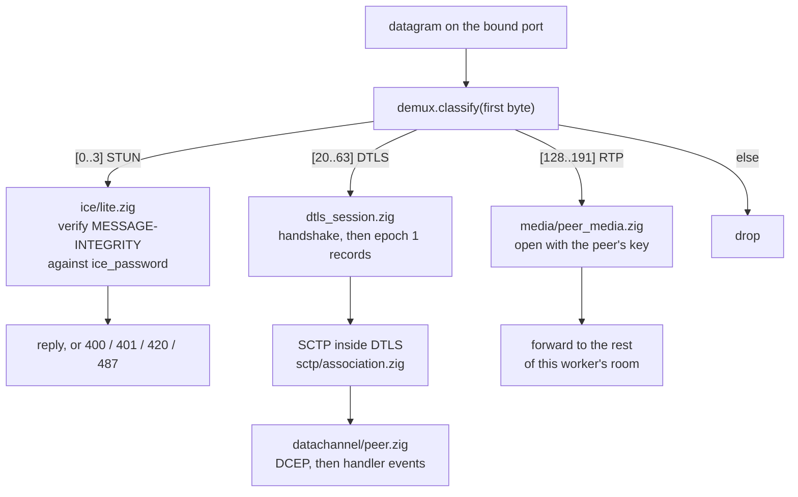
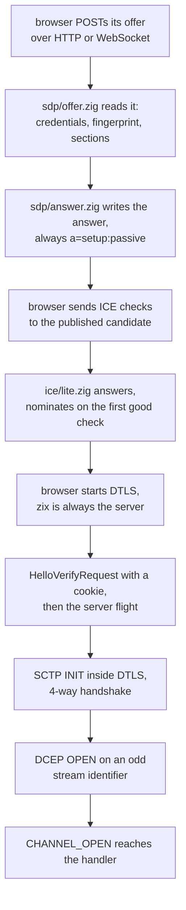
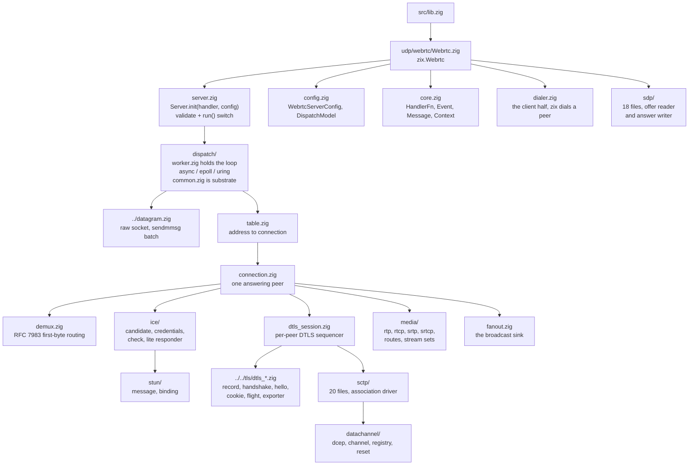
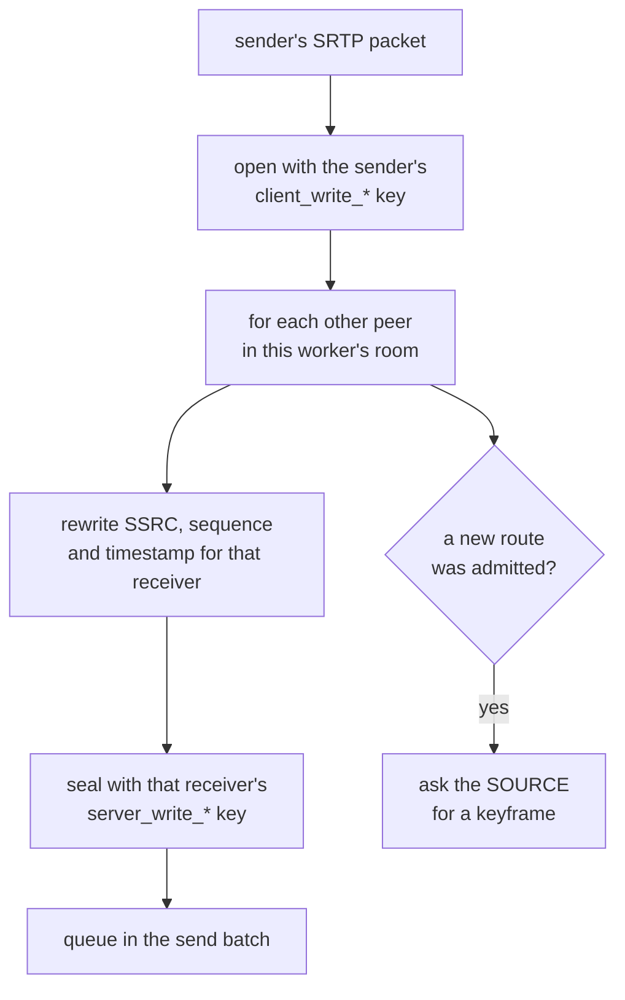

# HLD: zix.Webrtc

Peer WebRTC pure-Zig: ICE-lite (RFC 8445) di atas STUN (RFC 8489), DTLS 1.2 (RFC 6347), data channel SCTP (RFC 9260 dengan RFC 8831 / 8832), offer dan answer SDP (RFC 8866 / 8829), serta forwarding media SRTP (RFC 3711 / 5764). DTLS wajib: WebRTC tidak punya mode cleartext. Tanpa OpenSSL, semua kripto memakai `std.crypto`.

---

## Tujuan

- Menjangkau browser. Itulah alasan engine ini ada: browser tidak bisa membuka socket mentah, dan WebRTC satu-satunya transport yang ia tawarkan yang memberi pengiriman tidak reliabel, pilihan urutan per channel, serta audio dan video.
- Satu keluarga engine yang konsisten: enum `DispatchModel` yang sama, `Tls.Context` yang sama, bentuk config datar yang sama seperti engine zix lainnya.
- Pure-Zig dari RFC, dengan 32 RFC WebRTC generasi terkini dibaca, bukan library dibungkus.
- Server adalah produknya, primitifnya tetap terbuka: blok bangunan STUN, ICE, SCTP, DCEP, SDP dan SRTP bersifat publik supaya peer atau harness test bisa membangun sisi seberang.
- Pemisahan concern: satu berkas memiliki satu format wire. 84 berkas di bawah `src/udp/webrtc/`, plus 9 berkas `dtls_*` yang tinggal di `src/tls/` bersebelahan dengan kode TLS yang primitifnya dipakai bersama.
- Meneruskan media, tidak pernah mendekodenya. Engine ini tidak punya codec dan tidak punya pendapat tentang isi payload.

---

## Model Runtime

### Satu datagram, lima protokol

Semua datang di satu port UDP. Byte pertama menentukan jenisnya (RFC 7983 bagian 7).



### Menyalakan satu peer



---

## Tata Letak Sumber



---

## API Publik

Diakses lewat `const zix = @import("zix");`

| Simbol | Tipe | Deskripsi |
| :- | :- | :- |
| `zix.Webrtc.Server` | struct | `Server.init(handler, config)` mengembalikan server, handler dipanggang di comptime |
| `zix.Webrtc.HandlerFn` | tipe fn | `fn(event: Event, ctx: *Context) anyerror!void` |
| `zix.Webrtc.Event` | union(enum) | `CHANNEL_OPEN`, `CHANNEL_CLOSED`, `MESSAGE` |
| `zix.Webrtc.Message` | struct | `channel`, `kind`, `payload` |
| `zix.Webrtc.Kind` | enum | Tipe payload: text atau binary, kosong atau tidak |
| `zix.Webrtc.Context` | struct | Tempat handler menjawab, dibangun baru setiap panggilan |
| `zix.Webrtc.OpenRequest` | struct | Yang diterima `ctx.openChannel` |
| `zix.Webrtc.ServerConfig` | struct | Konfigurasi server (`WebrtcServerConfig`) |
| `zix.Webrtc.DispatchModel` | enum(u8) | Dipakai bersama engine lain (ADR-050) |
| `zix.Webrtc.Dialer` | struct | Sisi client: zix memanggil peer lain |

Primitif tingkat rendah, terbuka supaya peer atau harness test bisa membangun sisi seberang: `demux`, `stun`, `stun_binding`, `ice_lite`, `ice_check`, `ice_credentials`, `ice_candidate`, `sctp`, `sctp_chunk`, `sctp_packet`, `dcep`, `datachannel`, `payload`, `sdp_offer`, `sdp_answer`, `sdp_fingerprint`, `sdp_media_offer`, `sdp_media_answer`, `srtp`, `rtp`, `rtcp`, plus `dtls`, `dtls_client`, `dtls_record`, `dtls_handshake` dan `dtls_hello`.

### Method Server

| Method | Deskripsi |
| :- | :- |
| `init(handler, config)` | Menyimpan config, tanpa validasi dan tanpa error. Sama seperti engine lain. |
| `run()` | Memvalidasi lebih dulu, lalu bind dan melayani pada model di `config.dispatch_model`. Memblokir sampai ada error. |
| `deinit()` | Melepas sumber daya (belum melakukan apa pun, disediakan demi simetri API). |

`run()` menolak konfigurasi yang salah sebelum bind apa pun:

| Error | Sebab |
| :- | :- |
| `error.ZixPortNotConfigured` | `config.port` bernilai 0 |
| `error.ZixIceCredentialsRequired` | ufrag atau password lokal kosong |
| `error.ZixIceCredentialsInvalid` | salah satunya di luar yang diizinkan RFC 8445 bagian 5.3 |
| `error.ZixTlsRequired` | `config.tls` null, sementara WebRTC tidak punya mode cleartext |
| `error.ZixUnsupportedCertificateKey` | kunci pada context itu bukan ECDSA P-256 |
| `error.ZixDispatchModelUnsupported` | `.EPOLL` atau `.URING` di luar Linux |

### Method Context

| Method | Deskripsi |
| :- | :- |
| `send(stream_identifier, kind, bytes)` | Mengirim pada satu channel milik peer ini |
| `broadcast(kind, bytes)` | Mengirim ke setiap peer lain yang dipegang worker ini, mengembalikan berapa yang menerima |
| `openChannel(request)` | Membuka channel dari sisi server, mengembalikan stream identifier-nya |
| `close(stream_identifier)` | Meminta sebuah channel ditutup |
| `channelCount()` | Berapa channel yang terbuka pada peer ini |

---

## WebrtcServerConfig

Datar, seperti engine zix lainnya. Tabel field lengkap beserta nilai default ada di [Referensi Config zix](zix-config-id.md).

```zig
pub const WebrtcServerConfig = struct {
    io:             std.Io,             // milik pemanggil, harus hidup lebih lama dari server
    allocator:      std.mem.Allocator,  // general-purpose (mis. std.heap.smp_allocator)
    ip:             []const u8,         // alamat bind
    port:           u16,                // port bind, tidak boleh nol
    dispatch_model: DispatchModel,      // wajib, tanpa default

    ice_ufrag:    []const u8,           // ufrag agent ini, wajib
    ice_password: []const u8,           // password agent ini, wajib

    tls: ?*Tls.Context,                 // certificate dan kunci ECDSA P-256, wajib

    carry_media: bool = false,          // meneruskan audio dan video antar peer
    max_peers:   usize = 64,            // per worker
    // ... sisanya lihat referensi config
};
```

---

## Dispatch Model

| Model | Bentuk | Platform |
| :- | :- | :- |
| `.ASYNC` | satu worker, `std.Io` sepanjang jalur | setiap platform yang didukung |
| `.EPOLL` | satu worker SO_REUSEPORT per core, level-triggered | Linux |
| `.URING` | satu worker SO_REUSEPORT per core, ring sungguhan dengan 64 recvmsg one-shot plus satu timeout | Linux |

Ketiganya menjalankan badan loop yang sama, di `dispatch/worker.zig`. Urutan pengurasan datagram keluar satu peer adalah properti kebenaran, jadi ia dimiliki sekali dan tidak disalin per model.

Di sini sengaja **tidak ada `reuseport_cbpf`**, berbeda dari UDP raw dan HTTP/3. Steering CBPF memilih worker berdasarkan CPU penerima, sementara satu peer WebRTC adalah 4-tuple-nya, jadi steering bisa memecah satu sesi ke dua worker di tengah handshake. Hash default itulah yang menjaga datagram satu peer tetap di worker yang memegang state-nya. Field config-nya tidak ada.

Waktu tunggu diturunkan dari deadline: `Worker.waitMs` adalah deadline peer terdekat yang dibatasi `tick_interval_ms`, jadi loop tidak pernah parkir melewati satu retransmit dan tidak pernah berputar saat tidak ada yang jatuh tempo.

---

## Empat Deadline

`timer.zig` memegang tepat empat, dan itulah alasan engine ini punya loop sendiri:

| Deadline | Arti |
| :- | :- |
| `DTLS_RETRANSMIT` | RFC 6347 bagian 4.2.4, 1 detik dan berlipat |
| `SCTP_RETRANSMIT` | retransmission timeout milik association |
| `ICE_CONSENT` | consent freshness |
| `IDLE` | `peer_idle_ms` sejak datagram terakhir, lalu peer dilepas |

---

## ICE-lite

Server tidak berada di balik NAT yang harus ia cari jalan keluarnya, jadi ICE agent penuh tidak dibangun. Engine ini punya satu candidate, tidak pernah gathering, tidak pernah menominasikan pair miliknya sendiri, dan menjawab 487 untuk setiap nilai role tiebreaker karena ia tidak punya role untuk ditukar (RFC 8445 bagian 6.1.1).

Dua aturan credential yang penting dalam praktik:

- USERNAME pada check yang datang berbunyi `<ufrag tujuan>:<ufrag pengirim>`, jadi paruh **pertama** adalah milik agent ini. Membacanya terbalik akan menolak setiap check yang sah.
- `accept_any_peer_ice_ufrag` ada karena browser menarik ufrag baru untuk setiap peer connection. Flag ini menjadikan `ice_password` satu-satunya gerbang. Mati secara default: server yang menyebut satu peer harus tetap menolak yang lain.

---

## Data Channel

zix selalu menjadi DTLS server, yang mengunci data channel ke stream identifier **ganjil** (RFC 8832 bagian 6). Salah paritas di sini tidak terlihat secara lokal: setiap open berhasil terhadap peer yang berbagi kesalahan yang sama, dan browser sungguhan menolak semuanya.

Handler melihat tiga event. Payload `MESSAGE` mati pada panggilan engine berikutnya, jadi apa pun yang perlu disimpan harus disalin keluar.

Pesan kosong adalah satu byte nol di bawah payload type-nya sendiri, dan penerima membuang byte itu. Konvensi itulah yang membuat pesan berukuran nol bisa melewati SCTP, yang tidak mengenal pesan pengguna kosong.

---

## Forwarding Media

Mati secara default. Dengan `carry_media` menyala, engine menjadi selective forwarding unit: satu koneksi per peer, media dibuka sekali lalu disegel ulang untuk tiap penerima, tanpa ada yang didekode.



Empat fakta yang perlu diketahui sebelum menyentuh jalur ini:

- **Penyegelan ulang adalah keharusan, bukan pilihan desain.** Tidak ada dua peer yang berbagi kunci SRTP, jadi paket tidak bisa diteruskan apa adanya.
- **Satu session SRTP per stream identifier, bukan per peer.** Rollover counter dan daftar replay bersifat per-SSRC. Audio dan video yang berbagi satu session membaca nomor urut satu sama lain sebagai lubang atau wrap lalu menolak paket yang sah.
- **Buka sekali, segel N kali.** Membuka satu paket dua kali adalah replay atas index yang sudah diterima stream sumber.
- **Engine meminta keyframe ke sumber ketika route baru diterima.** Tidak ada apa pun di browser yang memintanya mewakili penonton, jadi tanpa itu penonton yang bergabung di tengah stream akan tetap abu-abu.

RTCP **dijawab, tidak pernah diteruskan**. Sebuah report menamai stream dengan identifier sebelum penulisan ulang, jadi meneruskannya berarti menggambarkan stream yang tidak pernah dilihat sisi seberang. Picture-loss indication dari penerima dibaca, dipetakan balik lewat route-nya ke sumber, lalu dibangun ulang untuk pengirim.

### Dua switch carry_media

Keduanya berada di layer berbeda dan sebuah example menyalakan keduanya:

| Switch | Yang dilakukannya |
| :- | :- |
| `WebrtcServerConfig.carry_media` | mengunci transport: handshake menegosiasikan `use_srtp` dan mengekspor kunci SRTP |
| `sdp/answer.zig Config.carry_media` | memberi tahu peer supaya mengirim media sejak awal |

Server yang menyalakan salah satu saja akan menjanjikan media yang tidak ia bawa, atau mengunci jalur yang tidak akan dipakai siapa pun.

---

## Model Konkurensi

Shared-nothing, seperti bagian zix lainnya. Satu peer menjadi milik tepat satu worker sepanjang hidupnya, dan tidak ada state peer yang dibagi antar worker.

Itu punya satu konsekuensi yang terlihat: **jangkauan `ctx.broadcast` adalah satu worker.** Di bawah `.ASYNC` itu berarti seluruh room. Di bawah `.EPOLL` atau `.URING` itu bagian room milik core ini. Example bertipe room memasang pin `.ASYNC` dan menjelaskan alasannya di header masing-masing.

`max_peers` dihitung per worker, jadi server dengan N worker menampung sampai N kali `max_peers`.

---

## Model Memori

Tidak ada alokasi di jalur datagram. Setiap buffer diukur saat startup dari config lalu dipakai ulang:

| Buffer | Diukur dari |
| :- | :- |
| slot penerima | `max_recv_buf` |
| batch pengirim | `max_recv_buf` plus overhead SRTP, atau MTU path plus overhead DTLS, mana yang lebih besar |
| tabel peer | `max_peers` entri per worker, dicari dengan penelusuran (puluhan, bukan ribuan) |
| registry channel | `max_channels` per peer |
| stream set SRTP | 8 stream per arah per peer |
| route | 8 per peer penerima |

---

## Catatan RFC

| RFC | Dipakai untuk |
| :- | :- |
| 8825 / 8826 / 8827 / 8835 | dokumen payung |
| 8829 / 8866 / 3264 | JSEP, SDP, dan model offer dan answer |
| 8445 / 8489 / 7983 | ICE, STUN, dan rentang byte demultiplexing |
| 6347 / 5763 / 5764 | DTLS 1.2, pemakaiannya dengan SRTP, dan `use_srtp` |
| 9260 / 3758 / 6525 / 8261 | SCTP, partial reliability, stream reconfiguration, di atas DTLS |
| 8831 / 8832 | data channel dan DCEP |
| 3550 / 3551 / 3711 / 5761 / 4585 | RTP, SRTP, RTP dan RTCP yang di-multiplex, dan feedback |
| 8122 | fingerprint certificate yang dibawa di SDP |
| 8841 / 8842 / 8843 | SCTP di atas DTLS dalam SDP, `a=tls-id`, dan BUNDLE |

---

## Belum Dibangun

Masing-masing dengan alasannya, supaya tidak ada yang menurunkan ulang pertanyaannya:

| Belum ada | Alasan |
| :- | :- |
| relay TURN, ICE agent penuh | semua yang dikerjakan sejauh ini satu mesin di satu LAN tanpa NAT, yang tidak mengatakan apa pun tentang kebutuhannya |
| DTLS 1.3 | Firefox 153 dan OpenSSL 3.6 sama-sama selesai di 1.2 |
| sender dan receiver report berkala | belum ada RTCP di atas timer sama sekali |
| jawaban NACK | diiklankan di SDP, tidak ada riwayat paket yang disimpan |
| pemetaan ulang payload type | nomor milik pengirim menyeberang tanpa diubah |
| simulcast, pergantian layer | butuh yang di atas lebih dulu |
| `a=msid`, `a=extmap`, `a=ssrc` | tidak ada di set RFC yang di-vendor, jadi tidak ditulis dari ingatan |
| message interleaving RFC 8260 | satu pesan sekaligus per channel sudah cukup untuk data channel |
| room yang melintasi core | shared-nothing adalah desainnya, bukan kekurangan |
| verifikasi certificate terhadap fingerprint SDP | codec fingerprint-nya ada, belum ada yang memeriksa certificate terhadapnya |

---

## Example

| Example | Port | Yang ditunjukkan |
| :- | :- | :- |
| `webrtc_signaling` | 9081 | relay room WebSocket, zix **bukan** peer |
| `webrtc_stun` | 9082 | server STUN binding plus halaman yang membaca alamat reflexive-nya sendiri |
| `webrtc_datachannel_echo` | 9083 | server terkecil, memantulkan yang dikirim peer |
| `webrtc_native_pair` | 9084 (bind), memanggil 9083 | zix memanggil zix, tanpa browser |
| `webrtc_datachannel_chat` | 9085 | satu pesan ke setiap browser lain di room |
| `webrtc_file_transfer` | 9086 | channel biner yang membawa sebuah berkas |
| `webrtc_sfu_broadcast` | 9087 | unit forwarding, satu pengirim dan banyak penonton |
| `webrtc_video_call` | 9088 | panggilan mesh lewat relay, zix tidak membawa media |

Keempat example browser mempublikasikan candidate yang benar-benar dipakai browser. **Buka halaman itu lewat alamat jaringan mesin, bukan localhost**, kecuali `webrtc_sfu_broadcast`, yang halaman pengirimnya butuh secure context (`http://localhost` memenuhi syarat) lalu menanyakan alamat yang akan dipublikasikan lewat query parameter `?at=`.

---

###### end of hld-webrtc
