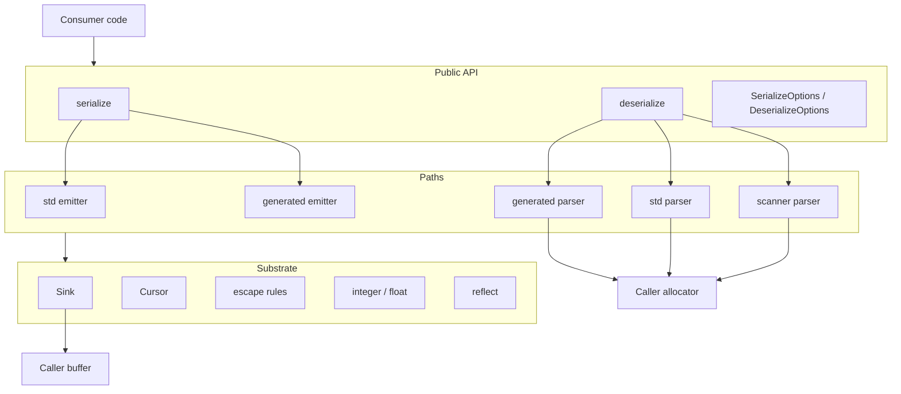
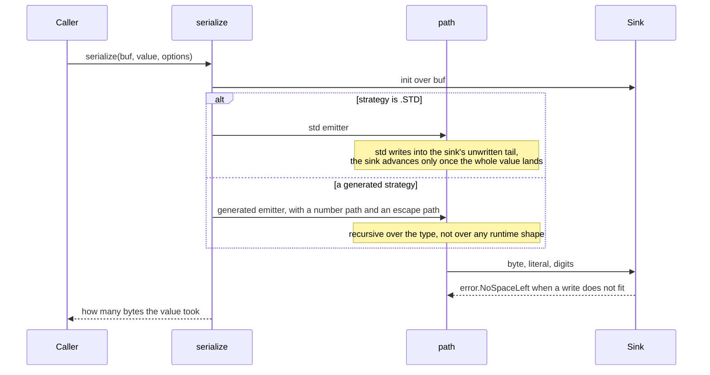
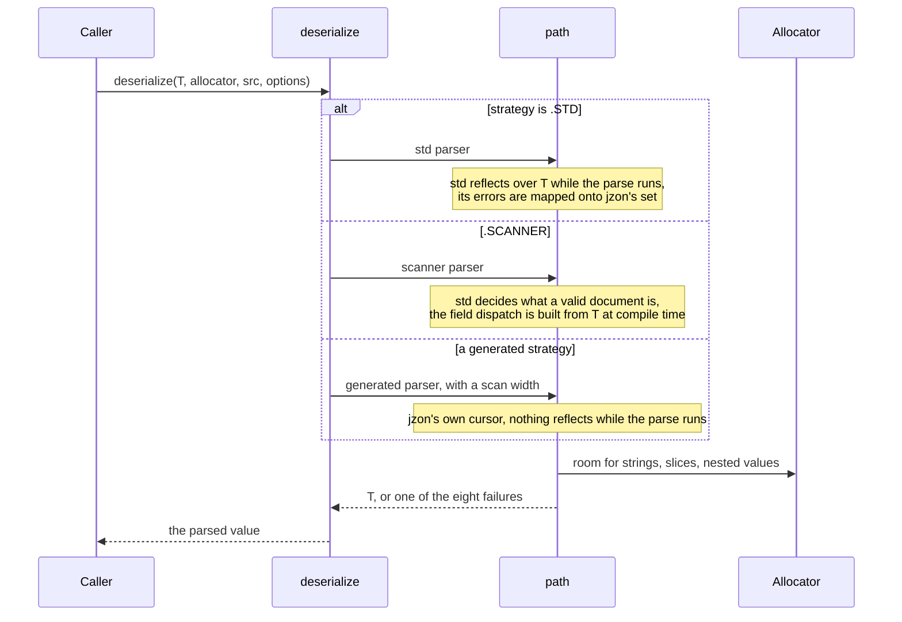

# jzon high-level design

## Scope

jzon is a JSON library in pure Zig, standard library only. It reads and writes the RFC 8259 grammar directly. This document covers the shape of the library: the layers, the components, the two flows, and how a strategy picks a path. The byte-level detail is in `lld-en.md`.

The design holds to one idea: every path produces the same bytes and reads the same documents, so a caller who swaps one for another changes what the call costs and nothing else.

## Layers

- The API layer is two functions and two options structs. It owns one decision: which path runs.
- A path owns how a value is rendered or read. It never sees which strategy named it.
- The substrate owns the mechanics: where the next byte goes, where a token ends, how a byte is escaped, how a number is spelled, and the few questions the two Zig versions answer differently.
- The buffer and the allocator belong to the caller. jzon holds neither.

## Components

| Component | Responsibility |
| :- | :- |
| `lib.zig` | the public surface: the two calls, the options types, the error sets |
| `sink.zig` | the write cursor: where the next byte goes and whether there is room |
| `cursor.zig` | the read cursor: where the next byte comes from and where a token ends |
| `cursor_vector.zig` | the same two scans a lane at a time: whitespace skip, string end |
| `escape.zig` | the RFC 8259 section 7 string rules, both directions, one owner |
| `escape_vector.zig` | the same encoding, with the escape scan a lane at a time |
| `integer.zig` | two ways to write an integer, one way to read one back with range enforced |
| `float.zig` | the JSON number form of a float, both directions |
| `reflect.zig` | the type questions Zig 0.16 and 0.17 answer differently, asked in one place |
| `serialize/options.zig` | what a caller hands a render, and what a render can hand back |
| `serialize/serialize.zig` | the entry point: pick a write path, run it, report the length |
| `serialize/std_emitter.zig` | render through `std.json.Stringify` into the caller's buffer |
| `serialize/generated_emitter.zig` | render through code built from the type at compile time |
| `deserialize/options.zig` | what a caller hands a parse, and the one error set every path reports through |
| `deserialize/deserialize.zig` | the entry point: pick a read path and run it |
| `deserialize/std_parser.zig` | parse through `std.json` reflection, with std's errors mapped onto jzon's set |
| `deserialize/scanner_parser.zig` | tokens from `std.json.Scanner`, dispatch built from the type |
| `deserialize/generated_parser.zig` | parse straight off jzon's cursor, dispatch built from the type |
| `deserialize/fields.zig` | which of a target's fields a document filled in, and what happens to the rest |
| `deserialize/scan.zig` | which of the two read scans a parse runs |
| `deserialize/skip.zig` | step over one whole value without building anything out of it |
| `deserialize/string_value.zig` | a string token into bytes: a slice of the document, or a copy |

## The write flow

Nothing allocates. A value that does not fit reports `error.NoSpaceLeft` and no length, so whatever the buffer holds afterwards is not a rendered value either way.

## The read flow

Everything the result points at comes from the caller's allocator. Under `strings = .BORROW` a string carrying no escape is a slice of the document instead, so the document has to outlive the value.

## Where a strategy lands

A strategy is a name for a pairing. The entry point resolves it and the path under it is handed only what it needs.

Write side:

| Strategy | Integer path | Escape scan |
| :- | :- | :- |
| `.GENERATED_FMT` | `std.fmt` | one byte at a time |
| `.GENERATED` | digits into the buffer | one byte at a time |
| `.GENERATED_VECTOR` | digits into the buffer | one vector lane at a time |

Read side:

| Strategy | Scan width |
| :- | :- |
| `.GENERATED` | one byte at a time |
| `.GENERATED_VECTOR` | one vector lane at a time |

The two write axes are independent, so every pairing exists in the emitter. The four strategies are the pairings worth naming, not the only ones the emitter can run.

## Allocation model

| Direction | What is allocated | Who owns it |
| :- | :- | :- |
| serialize | nothing | the caller's buffer holds the whole result |
| deserialize, `strings = .COPY` | every string, slice, and nested value | the caller's allocator |
| deserialize, `strings = .BORROW` | slices, nested values, and any string carrying an escape | the caller's allocator, with clean strings pointing into the document |

An escaped string is decoded into the allocator whichever mode was asked for, because its decoded bytes appear nowhere in the document to point at.

## Error model

One error set per direction, shared by every path.

The write side has one failure, because nothing is allocated and the buffer is fixed. The read side has eight, and a path that cannot tell two of them apart still reports through the same set: `.STD` reports a broken escape as a syntax error rather than as `BadEscape`, because std does not separate the two. A caller writes one `catch` and never revisits it after changing a strategy.

## Why the strategies exist

The std-backed paths are the capable ones. They take every shape std takes, including the shapes a generated path has no JSON form for, which is why they are the default.

A generated path resolves the shape of the type at compile time. On the write side that means every object key, its quotes, its colon and the comma before it collapse into one literal, so a field costs one fixed-size copy plus its value. On the read side it means nothing reflects while the parse runs and no token is built that the type has no field for.

That trade is the whole design: capability by default, and a compile-time-resolved path a caller opts into per call site once the shape is known to be a plain record. `benchmark-en.md` puts numbers on what that is worth on one record.
